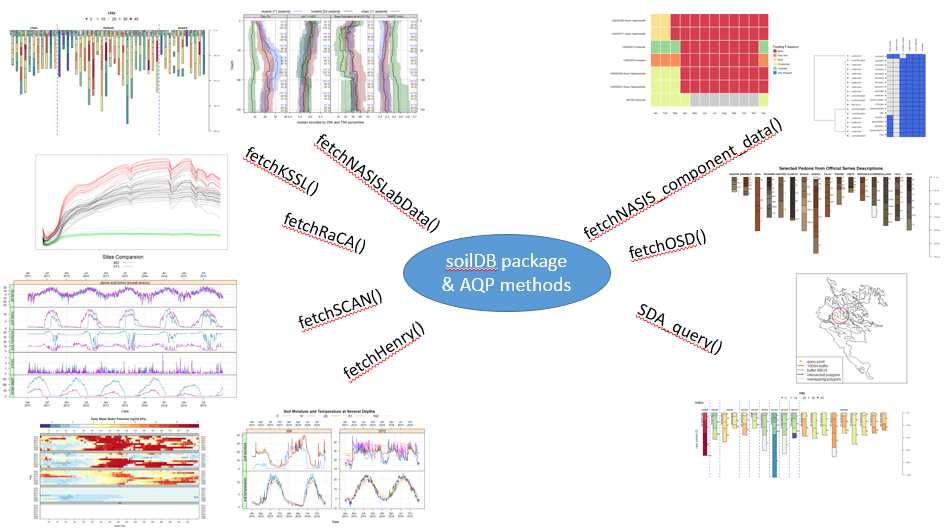
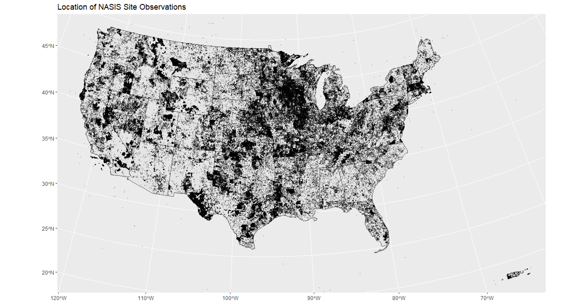
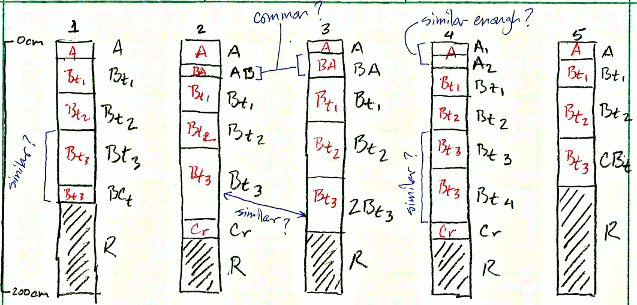
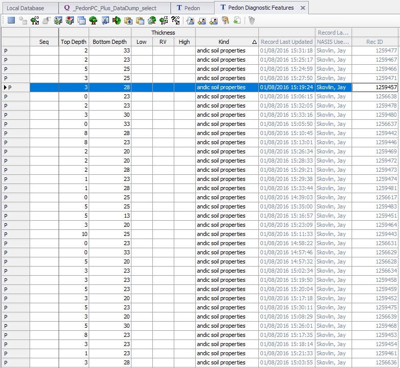
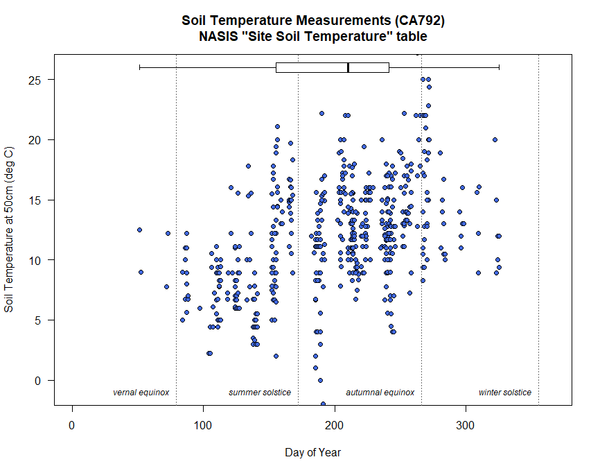

# The Data We Use {#data}


## Objectives (The Data We Use)

-   Expand on basic **R** skills from Chapter 1
    -   Inspect and work with different data types
    -   Perform operations on data such as filtering and aggregation
    -   Begin to explore regular expression (regex) patterns for text data
-   Work with Soil Data Sources and Structures
    -   Use the soilDB package to load data into R
    -   Understand the _SoilProfileCollection_ (SPC) object
    -   Learn about the data checks in the `fetchNASIS()` function

## The Structure of Soil Data

What if you could extract, organize, and visualize data from NASIS and many other commonly used soil database sources with a couple of lines of code?



The aqp (Algorithms for Quantitative Pedology) and soilDB packages enable data to be fetched from various sources and cast into a SoilProfileCollection (SPC) object. Tabular and spatial data objects fetched via soilDB and processed using aqp methods can simplify the process of working with commonly used soil data.

### Package References

-   [**Package 'aqp' manual**](http://ncss-tech.github.io/aqp/)

-   [**Package 'soilDB' manual**](http://ncss-tech.github.io/soilDB/)

-   [**Package 'sharpshootR' manual**](http://ncss-tech.github.io/sharpshootR/)

-   [**SoilProfileCollection Object Introduction**](http://ncss-tech.github.io/aqp/articles/Introduction-to-SoilProfileCollection-Objects.html)

-   [**Tutorials on the AQP website**](http://ncss-tech.github.io/AQP/)

We load aqp and soilDB packages using the `library()` command.

```{r, purl=FALSE, eval=FALSE}
# load the libraries
library(aqp)
library(soilDB)
```

The manual pages for `soilDB` and `aqp` are accessible online and from the **Help** tab in RStudio.

### Importance of Pedon Data

The importance of pedon data for present and future work cannot be overstated. These data represent decades of on-the-ground observations of the soil resource for a given area.

As difficult as it may be to take the time to enter legacy pedon data, it is vitally important that we capture this resource and get these data into NASIS as an archive of point observations.

```{r pedons_a, purl=FALSE, echo=FALSE, results='hide', warning=FALSE}

# options for R functions
options(width = 100, stringsAsFactors = FALSE)

library(ggplot2)
library(dplyr)

data("us_ss_timeline", package = "soilDB")

test <-
  as.data.frame(table(us_ss_timeline$year), stringsAsFactors = FALSE)

names(test)[names(test) %in% c("Var1", "Freq")] <-
  c("year", "Count")
test <- mutate(test,
               year = as.numeric(year))

g1 <- ggplot(test, aes(x = year, y = Count)) +
  geom_area(alpha = 0.7) +
  ylim(0, max(test$Count, na.rm = TRUE) * 1.5) +
  scale_x_continuous(breaks = seq(1880, 2030, 8)) +
  # theme(aspect.ratio = 1) +
  xlab("Year") +
  ggtitle("Number of Published US Soil Survey Manuscripts by Year")

g2  <- ggplot(test, aes(x = year, y = cumsum(Count))) +
  geom_area(alpha = 0.7) +
  ylim(0, max(cumsum(test$Count), na.rm = TRUE) * 1.5) +
  scale_x_continuous(breaks = seq(1880, 2030, 8)) +
  # theme(aspect.ratio = 1) +
  xlab("Year") + ylab("Count") +
  ggtitle("Cumulative Number of Published US Soil Survey Manuscripts by Year")

# gridExtra::grid.arrange(g1, g2, ncol = 1)
pedons <-
  read.csv(
    "https://raw.githubusercontent.com/ncss-tech/stats_for_soil_survey/master/data/pedons.csv",
    stringsAsFactors = FALSE
  )
pedons <- filter(pedons, obs_year %in% 1950:2018) %>%
  mutate(year = obs_year,
         lab = FALSE,
         Count = n_peiid)

labpedons <-
  read.csv(
    "https://raw.githubusercontent.com/ncss-tech/stats_for_soil_survey/master/data/labpedons.csv",
    stringsAsFactors = FALSE
  )
labpedons <- filter(labpedons, obs_year %in% 1950:2018) %>%
  mutate(year = obs_year,
         lab = TRUE,
         Count = n_peiid)

g3 <- ggplot(pedons, aes(x = year, y = Count)) +
  geom_area(aes(fill = lab), stat = "identity") +
  geom_area(data = labpedons,
            aes(x = year, y = Count, fill = lab),
            stat = "identity") +
  ylim(0, max(pedons$Count, na.rm = TRUE) * 1.2) +
  ylab("Count") + xlab("Observation Year") +
  scale_x_continuous(breaks = seq(1880, 2030, 8)) +
  ggtitle("Number of Pedons per Year")

g4 <- ggplot(pedons, aes(x = year, y = cumsum(Count))) +
  geom_area(aes(fill = lab), stat = "identity") +
  ylim(0, max(cumsum(pedons$Count), na.rm = TRUE) * 1.2) +
  ylab("Count") + xlab("Observation Year") +
  scale_x_continuous(breaks = seq(1880, 2030, 8)) +
  ggtitle("Cumulative Number of Pedons per Year")

gridExtra::grid.arrange(g1, g3, ncol = 1)
```



### Some Issues With Pedon Data

-   Making and documenting observations of soil requires hard work. Digging is difficult, and writing soil descriptions is time consuming!

-   Our confidence in observations typically weakens with the depth of the material described.

    -   If we acknowledge this, which we must, then how do we deal with it in pedon data?
        -   Use a cutoff depth, for example 100 cm, can be used to truncate observations to a zone of greater confidence.
        -   Show the relative confidence of the data with depth.

## Challenges with Pedon Data

-   Consistency
    -   Missing data
-   Confidence in the observations
    -   Uncertainty with depth
-   Description style differences
    -   Depth described, horizonation usage styles
-   Legacy data vintage
    -   Decadal span of data
    -   Taxonomy updates, horizon nomenclature changes
-   Location confidence
    -   Origin of the location information
    -   Datum used for data collection
    -   Accuracy for GPS values at the time of data collection

## The _SoilProfileCollection_

The [_SoilProfileCollection_](http://ncss-tech.github.io/aqp/articles/Introduction-to-SoilProfileCollection-Objects.html) class (SPC) provided by the `aqp` package is a specialized structure for soil data analysis. It simplifies the process of working with collections of data associated with soil profiles, e.g., site-level, horizon-level, spatial, diagnostic horizons, and other metadata.

A _SoilProfileCollection_ is similar to the NASIS Site/Pedon "object" in that it provides generalizations, specific routines and rules about data tables and their relationships.

The _SoilProfileCollection_ is an S4 R object. S4 objects have [slots](https://stat.ethz.ch/R-manual/R-patched/library/methods/html/slot.html). Of primary importance, are the slots for site-level and horizon-level data.

In many ways the SPC is more adaptable than the NASIS "Pedon" concept because it is more general. However, the SPC is not as expressive as the complex hierarchy of objects in NASIS, which are more aligned with data archival vs. analysis.

### _SoilProfileCollection_ methods

Many "familiar" methods are defined for the _SoilProfileCollection_ object. Some are unique, and others operate like more common functions of vector and `data.frame` objects, such as `nrow()` (*"how many horizons?"*) or `length()` (*"how many sites/pedons?"*).

Perhaps most importantly, when you access the site data (with `site(<object>)`) or the horizon data (with `horizons(<object>)`) of a _SoilProfileCollection_, you get a `data.frame` object that you can use like any other you might use or make in R.

#### Promoting a `data.frame` to _SoilProfileCollection_

The _SoilProfileCollection_ object is a collection of 1-dimensional profile descriptions, of the type conventionally described on a Form 232, or of tabular data returned from laboratory.

The object is "horizon data forward" in that you start with the layers, and can add or create site-level attributes by normalization, joins, and calculation.

Most of the time if you are using your NASIS data, or an official database, there are defined ways of getting the data "into" an SPC. For example, `fetchOSD` returns a _SoilProfileCollection_ that has been assembled from horizon and site level attributes gleaned from the OSDs text, Soil Classification database, and other sources.

In the pre-course, we had you set up a process so you could connect to your local NASIS instance to "fetch" data and have methods like `fetchNASIS` put things together for you.

This input to make a _SoilProfileCollection_ can be represented most simply as a `data.frame` with unique site or profile ID and depth combinations for each horizon or layer--for example, a subset of the `phorizon` or `chorizon` table in NASIS.

A simple demonstration of "tabular horizon data" is the `sp4` data set bundled with `aqp`: some serpentine soil profiles stored in a `data.frame` in the `aqp` package (after McGahan et al., 2009).

```{r, eval=TRUE}
library(aqp)

# Load sample serpentine soil data (McGahan et al., 2009)
data(sp4, package = "aqp")

# this is a data.frame
# same as if loaded from CSV file etc.
class(sp4)

# inspect the first couple of rows
head(sp4)
```

To convert this horizon data into a _SoilProfileCollection_, we need to identify three parameters: `idname`, `top`, and `bottom`. These parameters refer to the columns of unique profile IDs, top depths and bottom depths, respectively.

There are a couple of important constraints and considerations:

-   records (rows) represent horizons
-   profiles are uniquely identified by a column (user pedon ID, pedon record ID, etc.)
-   profiles IDs cannot contain missing values (NA)
-   horizon top and bottom depths are identified by column names
-   ideally there are no gaps, overlap, or missing top/bottom depths (more on that later)

Use a formula to specify column names in the `data.frame`, in this case `"id"`, `"top"` and `"bottom"`.

```{r, eval=TRUE}
#      profile ID ~ top depth + bottom depth
depths(sp4) <- id ~ top + bottom

# note new class
class(sp4)

# compact summary
sp4
```

The formula expresses the idea that a profile `id` defined by set of `top` and `bottom` depths.

NOTE: A character vector with same names has the same effect, and can be easier to "program" with than the formula-based syntax.

```{r}
depths(sp4) <- c("id", "top", "bottom")
```

### Promoting to "Spatial" _SoilProfileCollection_

You can also use the _SoilProfileCollection_ to manage the information about a profile's position on the Earth.

Chapter 4 will cover spatial data in greater detail, and the [SoilProfileCollection Reference](http://ncss-tech.github.io/aqp/articles/Introduction-to-SoilProfileCollection-Objects.html#spatial-data) has a section on Spatial Data. For now know you can use the `initSpatial<-` method to define "X" and "Y" coordinate columns and the coordinate reference system in one line:

```{r}
sp4$x <- runif(10)
sp4$y <- runif(10) # dummy XY coordinates

initSpatial(sp4, crs = "OGC:CRS84") <- ~ x + y
```

This is new syntax introduced in aqp 2.0, the older syntax uses the `coordinates<-` and `proj4string<-` methods.

#### Extracting Site and Horizon Data

You can extract values from the collection's `@site` and `@horizon` slots using the `site()` and `horizons()` functions. These create `data.frame` objects that are separate from the _SoilProfileCollection_.

```{r, eval=TRUE}
# extract site data from SPC into new data.frame 's'
# note that it only contains profile IDs
s <- site(sp4)
str(s)

# extract horizon data from SPC into new data.frame 'h'
h <- horizons(sp4)
str(h)
```

#### Methods like `data.frame`

The base R functions for accessing and setting `data.frame` columns by name such as `$` and `[[` work for _SoilProfileCollection_ objects, too. Review `data.frame` methods:

-   `[[` and `$`: single columns in `data.frame`, by name
    -   `x[['variable']]`
    -   `x$variable`
-   `[`: combinations of rows and columns, by name or index
    -   `x[i, ]`: specified rows, all columns
    -   `x[, j]`: all rows, specified columns
    -   `x[i, j]`: specified rows, specified columns

See [Chapter 1](intro.html) and the Chapter 2 [Appendix](http://ncss-tech.github.io/stats_for_soil_survey/misc/2a_appendix_data_types.html) for additional details and examples.

##### Column Access by Name: `$` and `[[`

```{r, eval=TRUE}
# sp4 is a SoilProfileCollection
sp4$clay
sp4[['clay']]

# horizon data.frame
h$clay
h[['clay']]

# use $<- or [[<- to set proportional clay content
sp4$clay <- sp4[['clay']] / 100

# undo what we did above; back to percentage
sp4[['clay']] <- sp4$clay * 100

# create new site variable ("numberone" recycled for all sites)
site(sp4)$newvar1 <- "numberone"

# create new horizon variable ("numbertwo" recycled for all horizons)
horizons(sp4)$newvar2 <- "numbertwo"
```

##### Row Access: `[`

The _SoilProfileCollection_ also has `[` ("single bracket"), but with a different interpretation from the `[i, j]` indexing of `data.frame` objects.

-   In a `data.frame` you have `object[row, column, drop=TRUE]`; the result is a `data.frame` (or a vector with default `drop=TRUE`).

-   In a _SoilProfileCollection_ you have `object[site, horizon]`; the result is a _SoilProfileCollection_.

```{r, eval=TRUE}
# i-index: first 2 profiles, all horizons
sp4[1:2, ]

# j-index: all profiles; first 2 horizons of each profile
sp4[, 1:2]
```

When you use the `[` function, everything in the _SoilProfileCollection_ is subset simultaneously depending on the constraints specified by the indices.

```{r, eval=TRUE}
# First profile, first 2 horizons
horizons(sp4[1, 1:2])
```

All slots in the collection have a relationship to the site or *i*-index. When you remove sites (profiles), all associated records (e.g. spatial, diagnostics, horizons, etc.) in the object are removed.

Similarly, when all horizons are removed (say, you request the 6th j-index from a profile that has only 5 layers), the site index and all associated data are removed from the collection.

## Exercise 1: Assemble a _SoilProfileCollection_ from several CSV files

Save the code you use in an R script, add answers as comments, and send to your mentor.

[Link to exercise R code](https://github.com/ncss-tech/stats_for_soil_survey/blob/master/exercises/SPC-from-CSV-files.R)


**Questions:**

Run the code in the linked R file and answer these questions.

1.  How many profiles (sites) and horizons are in the `granite` SoilProfileCollection? How many in `andesite`? See `length()` and `nrow()` functions for SoilProfileCollection objects.

2.  Which profile (and which horizon in that profile) has the highest ratio of oxalate-extractable Fe to dithionite-citrate-extractable Fe (`Fe_o_to_Fe_d`)?

## Using the `soilDB` Package

The `soilDB` package for R provides functions for accessing data stored in NASIS, KSSL, SDA, SoilWeb, SoilGrids and other sources.

These high-level 'fetch' functions bundle or wrap lower-level 'get' functions which access internal database interfaces to NASIS and other data sources. The ODBC connection to NASIS that you set up during the pre-course is an example of an internal database interface.

Basic data checks are run within 'fetch' functions. These checks ensure the basic integrity of the data as it is queried and moved from its existing structure into an SPC. There are times when it is useful to use the lower-level `get` functions individually. They generally return single `data.frame` or `list` of `data.frame`.

You can set up scripts to make custom queries against these or other sources on your own -- there is an example at the end of this section.

For now, we will start with the 'fetch' functions and others that will get you a large variety of data you can use for soil and ecological site analyses.

### soilDB functions for tabular data

`soilDB` functions are the quickest way to get up and running:

-   [**fetchNASIS()**](http://ncss-tech.github.io/soilDB/reference/fetchNASIS.html)

    -   Gets and re-packages data from a local NASIS database.
        -   soilDB Vignette [Columns in `fetchNASIS(from="pedons")`](https://ncss-tech.github.io/soilDB/articles/fetchNASIS.html)

-   [**fetchVegdata()**](http://ncss-tech.github.io/soilDB/reference/fetchVegdata.html)

    -   Gets Vegetation Plot and related/child tables into a list from a local NASIS database.

-   [**fetchNASISLabData()**](http://ncss-tech.github.io/soilDB/reference/fetchNASISLabData.html)

    -   Gets KSSL laboratory pedon/horizon layer data from a local NASIS database.

-   [**fetchNASISWebReport()**](http://ncss-tech.github.io/soilDB/reference/fetchNASISWebReport.html)

-   [**SDA_query()**](http://ncss-tech.github.io/soilDB/reference/SDA_query.html)

    -   Can be used to access SSURGO, STATSGO (spatial and tabular), and Lab DataMart snapshots
    -   Submits queries to the Soil Data Access system.
        -   [Soil Data Access Tutorial](http://ncss-tech.github.io/AQP/soilDB/SDA-tutorial.html)
        -   [SDA and Spatial Data](http://ncss-tech.github.io/AQP/soilDB/SDA-tutorial-2.html)
        -   [SDA and Interpretations](http://ncss-tech.github.io/AQP/soilDB/SDA-cointerp-tutorial.html)

-   [**fetchLDM()**](http://ncss-tech.github.io/soilDB/reference/fetchLDM.html)

    -   Gets KSSL data from the Lab Data Mart snapshot in Soil Data Access

-   [**fetchSDA()**](http://ncss-tech.github.io/soilDB/reference/fetchSDA_component.html)

    -   Fetches legend/mapunit/component/horizon data from Soil Data Access.

-   [**fetchKSSL()**](http://ncss-tech.github.io/soilDB/reference/fetchKSSL.html)

    -   Gets KSSL data from the SoilWeb system via BBOX, MLRA, or series name query.
        -   [KSSL Data Demo](http://ncss-tech.github.io/AQP/soilDB/KSSL-demo.html)
        -   [Water Retention Curve Development from KSSL Data](http://ncss-tech.github.io/AQP/soilDB/fetchKSSL-VG-demo.html)

-   [**fetchOSD()**](http://ncss-tech.github.io/soilDB/reference/fetchOSD.html)

    -   Fetches a limited subset of horizon- and site-level attributes for named soil series from the SoilWeb system.
        -   [Querying Soil Series Data](http://ncss-tech.github.io/AQP/soilDB/soil-series-query-functions.html)

-   [**OSDquery()**](http://ncss-tech.github.io/soilDB/reference/OSDquery.html)

    -   Full-text searching of OSD sections.
        -   [Querying Soil Series Data](http://ncss-tech.github.io/AQP/soilDB/soil-series-query-functions.html#6_OSD_Full_Text_Search)

-   [**fetchSCAN()**](http://ncss-tech.github.io/soilDB/reference/fetchSCAN.html)

    -   Queries soil and climate data from USDA-NRCS SCAN Stations.
        -   [A Unified Interface to SCAN/SNOTEL Data](http://ncss-tech.github.io/AQP/soilDB/fetchSCAN-demo.html)

-   [**fetchHenry()**](http://ncss-tech.github.io/soilDB/reference/fetchHenry.html)

    -   Downloads data from the Henry Mount Soil Climate Database.
        -   [Henry Mount Soil Climate Database Tutorial](http://ncss-tech.github.io/AQP/soilDB/Henry-demo.html)

-   [**fetchPedonPC()**](http://ncss-tech.github.io/soilDB/reference/fetchPedonPC.html)

    -   Fetches commonly used site and horizon data from a PedonPC (MS Access) database.

### Open Database Connectivity (ODBC) Connection to NASIS

After setting up an ODBC connection, as you did as part of the pre-course, you can use R to access data from a selected set defined in your local NASIS database.

-   [**How to Create an ODBC Connection to local NASIS database for R**](http://ncss-tech.github.io/AQP/soilDB/setup_local_nasis.html).

*Does NASIS need to be open and running to query data using soilDB?*

No, `fetchNASIS()` works whether the NASIS application is running or not. You just need to make sure that the data you want has been loaded into your selected set.

### `fetchNASIS()`

The [fetchNASIS()](http://ncss-tech.github.io/soilDB/reference/fetchNASIS.html) convenience function extracts data from a NASIS selected set via Structured Query Language (SQL).

Note that the import process in `fetchNASIS()`, and the other methods, is not comprehensive. It does not pull every column for every table related to pedon data out of NASIS.

Instead, it pulls essential / commonly used pedon and horizon data. Higher level functions like `fetchNASIS()` bundle a series of lower-level queries to get specific parts of the Pedon or Component data structures. Much of the nested complexity of NASIS is simplified in the resulting object.

```{r structure_diagram_a, purl=FALSE, eval=TRUE, echo=FALSE, warning=FALSE}
library(diagram, quietly=TRUE)
# reset figure margins
par(mar = c(1, 1, 1, 1))

# simple diagram of the pedon data structure
names <- c("Site", "Siteobs", "Pedon", "Horizon")
M <- matrix(nrow = 4, ncol = 4, byrow = TRUE, data = 0)
M[4, 3] <- M[3, 2] <- M[2, 1] <- ""
pos <- cbind (c(1, 1, 1, 1))
plotmat(M, pos = pos, name = names, lwd = 1, box.lwd = 2, cex.txt = 0.8, box.size = 0.1, box.type = "square", box.prop = 0.4, mx=-0.2)

# parallel simplified SPC structure
names <- c("Site-level", "Horizon-level")
M <- matrix(nrow = 2, ncol = 2, byrow = TRUE, data = 0)
 M[2, 1] <- ""
#pos <- cbind (c(2, 2))
plotmat(M, pos = c(1, 1), name = names, lwd = 1, box.lwd = 2, cex.txt = 0.8, box.size = 0.14, box.type = "square", box.prop = 0.75, mx=0.3, my=-0.05, add=TRUE)

# add arrows to the diagram
arrows(0.42, 0.12, x1=0.65, y1=0.2, length = 0.25, code=2, lwd=2, angle = 15)
arrows(0.42, 0.37, x1=0.65, y1=0.54, length = 0.25, code=2, lwd=2, angle = 15)
arrows(0.42, 0.61, x1=0.65, y1=0.61, length = 0.25, code=2, lwd=2, angle = 15)
arrows(0.42, 0.87, x1=0.65, y1=0.68, length = 0.25, code=2, lwd=2, angle = 15)
```

Many-to-one relationships are "flattened" where possible by `fetchNASIS()`. This aggregates the data from various tables into one "site" record with related horizon records, per profile.

You can see the child tables that are aggregated using the `get_extended_data_from_NASIS()` method, which returns a named list of child table sources that can be joined to the _SoilProfileCollection_ made with `fetchNASIS()` using the internal record IDs.

#### fetchNASIS arguments

`fetchNASIS()` has a number of different arguments:

-   **from = 'pedons' or 'components' or 'pedon_report'**

    -   This option allows you to select which data you want to load from NASIS. Choosing either 'pedons' or 'components' will load data from your local database. If 'pedon_report' is specified then it will load data from the text file generated by the NASIS report 'fetchNASIS' (run offline). This is useful for loading more than 20,000 pedons at one time, such for an entire Soil Survey Region.

-   **url =** string specifying the (temporary) URL for the NASIS `pedon_report` output generated by the `fetchNASIS` NASIS Report that can be run "Offline Against National Database" [EXAMPLE OUTPUT (MT663)](../data/book/02/fetchNASIS_61769c83-6180-486f-b8c8-9b0109ee1039.txt)

-   **SS = `TRUE`/`FALSE`**

    -   The Selected Set (SS) option allows you to choose whether you want the data to load from your current selected set in NASIS or from the local database tables. The default is set to `TRUE` so if unspecified `fetchNASIS()` will always load from the data in the selected set.

-   **stringAsFactors = `NULL`**

    -   This option is no longer used. See [`soilDB::NASISDomainsAsFactor()`](https://ncss-tech.github.io/soilDB/reference/NASISDomainsAsFactor.html)

-   **rmHzErrors = `TRUE`/`FALSE`**

    -   Setting this value to `TRUE` removes pedons that do not pass checks for horizon depth consistency. Default: `FALSE`

-   **nullFragsAreZero = `TRUE`/`FALSE`**

    -   Setting this value to `TRUE` (the default) converts null entries for rock fragment volumes to 0. This is typically the right assumption because rock fragment data are typically populated only when observed. If you know that your data contain a combination of omitted information (e.g. no rock fragment volumes are populated) then consider setting this argument to `FALSE`.

-   **soilColorState = 'moist' or 'dry'**

    -   Select dry or moist colors to be converted and placed into a horizon-level attribute called `soil_color`. The default is set to 'moist' unless specified. Moist and dry colors are also stored in `moist_soil_color` and `dry_soil_color`.

-   **lab = `TRUE`/`FALSE`**

    -   This option allows for loading the data associated with horizons that may be in the `phlabresults` table. The default is set to `FALSE`, which will not load records from the `phlabresults` table.

-   **fill = `TRUE`/`FALSE`**

    -   This option adds horizons to pedons or components that lack horizon data in the database, preserving their "position" within the output SoilProfileCollection object. Default is `FALSE` such that profiles without horizons are omitted from the result.

-   **dropAdditional = `TRUE`/`FALSE`**

    -   Used only for `from='components'` with `duplicates = TRUE`. Prevent "duplication" of `mustatus == "additional"` mapunits? Default: `TRUE`

-   **dropNonRepresentative = `TRUE`/`FALSE`**

    -   Used only for `from='components'` with duplicates = TRUE. Prevent "duplication" of non-representative data mapunits? Default: `TRUE`

-   **duplicates = FALSE**

    -   Used only for `from='components'`. Duplicate components for all instances of use (i.e. one for each legend data mapunit is used on; optionally for additional mapunits, and/or non-representative data mapunits?). This will include columns from `get_component_correlation_data_from_NASIS_db()` that identify which legend(s) each component is used on. NOTE: This requires that parent tables above "component" (such as legend, mapunit, correlation and datamapunit) are loaded in your NASIS database/selected set.

-   **dsn = `NULL`**

    -   Optional: custom path to an SQLite snapshot or DBIConnection object to database with NASIS schema. See [`soilDB::createStaticNASIS()`](https://ncss-tech.github.io/soilDB/reference/createStaticNASIS.html).

### The `gopheridge` Dataset

The `gopheridge` sample data set is a sample R object returned from `fetchNASIS()` in a self-contained `.rda` file stored in `soilDB`.

Open RStudio, and set up the environment by loading packages and the `gopheridge` sample dataset.

```{r gopheridge_a, eval=TRUE}
library(aqp)
library(soilDB)

# load example dataset
data(gopheridge, package = "soilDB")

# what kind of object is this?
class(gopheridge)

# what does the internal structure look like?
str(gopheridge, 2)
```

There are many columns in the data.frame objects within a `fetchNASIS()` _SoilProfileCollection_.

The following guide is part of the soilDB documentation and describes the columns that are returned from a `fetchNASIS(from="pedons")` call. In the future this guide will be extended to describe component data.

-   [fetchNASIS(from="pedons") column description guide](https://ncss-tech.github.io/soilDB/articles/fetchNASIS.html)

With `siteNames()` and `horizonNames()` we can view the names for eachslot respectively in the `gopheridge` object.

```{r spcNames, eval=TRUE}
# the fields at the site and horizon levels within the SPC
siteNames(gopheridge)
horizonNames(gopheridge)
```

#### Make profile sketches

The `plotSPC()` or `plot()` function generates sketches of a _SoilProfileCollection_ object based on horizon depths, designations, and colors. The [_SoilProfileCollection_ Reference](http://ncss-tech.github.io/aqp/articles/Introduction-to-SoilProfileCollection-Objects.html#plotting-soilprofilecollection-objects) vignette contains many examples demonstrating way in which these sketches can be customized. The [Soil Profile Sketches tutorial](https://ncss-tech.github.io/AQP/aqp/sketches.html) contains additional examples that demonstrate ways to customize soil profile sketches.

See [`?plotSPC` for a detailed list of arguments and examples](http://ncss-tech.github.io/aqp/reference/SoilProfileCollection-plotting-methods.html).

The `fetchNASIS()` function automatically converts moist Munsell colors into R-style colors, available in the `soil_color` horizon level attribute. This color is used by default in `plotSPC()`

```{r, fig.width=10, fig.height=4, eval=TRUE}
par(mar = c(1, 1, 1, 1))

# omitting pedon IDs and horizon designations
plotSPC(gopheridge,
        print.id = FALSE,
        name = NA,
        width = 0.3)
title('Pedons from the `gopheridge` sample dataset', line = -0.5)
```

Additional examples / documentation related to soil profile sketches:

-   [_SoilProfileCollection_ Reference](http://ncss-tech.github.io/aqp/articles/Introduction-to-SoilProfileCollection-Objects.html)

-   [OSD Dendrogram tutorial](http://ncss-tech.github.io/AQP/sharpshootR/OSD-dendrogram.html)

-   [Visualization of Horizon Boundaries tutorial](https://ncss-tech.github.io/AQP/aqp/hz-boundaries.html)

-   [Competing Series tutorial](http://ncss-tech.github.io/AQP/soilDB/competing-series.html)

#### Pedon Data Checks

When you load pedons using the `fetchNASIS()` function, the following data checks are performed:

-   **Inconsistent horizon boundaries**. Pedons with inconsistent horizon boundaries are not loaded when `rmHzErrors = TRUE`. In most cases, this occurs when the bottom depth of a horizon is not the same as the upper depth of the next lower horizon.

```{r example_a, purl=FALSE, eval=TRUE, echo=FALSE, results='show', warning=FALSE}
top <- c(0, 38, 56, 121, 135)
bot <- c(30, 56, 121, 135, NA)

hzname <- c('A', 'Bt1', 'Bt2', 'Bk', 'R')
d <- data.frame(hzname, top, bot)

d
```

Note the issue above. The bottom depth of the A horizon and the upper depth of the Bt1 horizon should be the same: either 30 or 38 cm. The correct depth needs to be determined and fixed in the database.

-   **Missing lower horizon depths.** Offending horizons are fixed by replacing the missing bottom depth with the top depth plus 1 cm. In the case of the profile shown above, a bottom depth of 137 cm would be inserted where the depth is missing.

-   **Sites missing pedon records**. Data without corresponding horizons are not loaded.

#### Find Data with Errors

If errors in the pedon data are detected when loading data using `fetchNASIS()`, the following "get" commands can trace them back to the corresponding records in NASIS.

These access an option that is stored in a special object called an `environment` associated with the soilDB package -- they generally contain vectors of IDs to help locating the problematic data.

-   `get('sites.missing.pedons', envir = soilDB.env)`
    -   Returns user site ID for sites missing pedons
-   `get('dup.pedon.ids', envir = soilDB.env)`
    -   Returns user pedon ID for sites with duplicate pedon ID
-   `get('bad.pedon.ids', envir = soilDB.env)`
    -   Returns user pedon ID for pedons with inconsistent horizon depths
-   `get('bad.horizons', envir = soilDB.env)`
    -   Returns a data.frame of horizon-level information for pedons with inconsistent horizon depths


Here is a full list of ID vectors that can be created when errors are detected:

```{r, eval=FALSE}
# fetchNASIS("pedons")
get('sites.missing.pedons', envir = get_soilDB_env())
get('dup.pedon.ids', envir = get_soilDB_env())
get('bad.pedon.ids', envir = get_soilDB_env())
get('missing.bottom.depths', envir=get_soilDB_env())
get('top.bottom.equal', envir=get_soilDB_env())
get('bad.horizons', envir = get_soilDB_env())
get('rock.fragment.volume.gt100.phiid', envir=get_soilDB_env())
get('artifact.volume.gt100.phiid', envir=get_soilDB_env())
get('multisiteobs.surface', envir=get_soilDB_env())
get('surface.fragment.cover.gt100.siteobsiid', envir=get_soilDB_env())
get('multiple.labsampnum.per.phiid', envir=get_soilDB_env())

# fetchNASISLabData()
get('bad.labpedon.ids', envir=get_soilDB_env())

# fetchNASIS("components"), fetchNASISWebReport()
get('dupe.coiids', envir=get_soilDB_env())
get('dupe.muiids', envir=get_soilDB_env())
get('multiple.mu.per.dmu', envir=get_soilDB_env())
get("component.hz.problems", envir = get_soilDB_env())
get('multiple.ecosite.per.coiid', envir=get_soilDB_env())
get('multiple.otherveg.per.coiid', envir=get_soilDB_env())

# Soil Data Access
get('dup.compmgrp.cokeyrvindictor', envir=get_soilDB_env())
get('component.hz.problems', envir=get_soilDB_env())
get('component.ecosite.problems', envir = get_soilDB_env())
```

These `get()` calls access variables stored in the package environment `soilDB.env`. The variables only exist if there are "problems" / values found by the data checks. If you fix the errors in the NASIS database and the checks don't find any errors then these vectors of IDs will not be defined.

## Basic Data Inspection

Now that you've loaded some data, you can look at additional ways to summarize and interact with data elements.

### `table()`: Tabulation and Cross Tabulation

The base R `table()` function is very useful for quick summary operations. It returns a named vector with the amount of each unique level of the a given vector.

The numeric vector of "counts" is commonly combined with other functions such as `sort()`, `order()`, `prop.table()`, `is.na()` to identify abundance, proportions, or missing data (`NA`).

```{r, eval=TRUE}
# load required packages
library(aqp)
library(soilDB)

data("gopheridge", package = "soilDB")

# for these examples, we use the gopheridge object as our "selected set"
pedons <- gopheridge 

## you can use fetchNASIS to load your own data, like this:
# pedons <- fetchNASIS()

# summarize which soil taxa we have loaded
table(pedons$taxonname)

# sort taxonomic names in descending order
sort(table(pedons$taxonname), decreasing = TRUE)

# could do the same thing for taxonomic subgroups 
table(pedons$taxsubgrp)
sort(table(pedons$taxsubgrp), decreasing = TRUE)
```

We can convert counts in the `table()` result into proportions with `prop.table()`:

```{r, eval=TRUE}
prop.table(table(pedons$taxsubgrp))
```

`table()` can be used to get counts over multiple dimensions of factor levels. This is called *cross tabulation*.

For instance, let's cross tabulate taxonomic subgroup (`taxsubgrp`) and the particle size family class (`taxpartsize`) for `pedons`

```{r, eval=TRUE}
table(pedons$taxsubgrp, pedons$taxpartsize)
```

As expected with `gopheridge` the majority of pedons are *Loamy-skeletal Ultic Haploxeralfs*.

Since `pedons` contains site and horizon level data, when cross tabulating we need to be sure pair a column from the site data with other site-level columns, and the same for horizon-level. This is because all arguments to `table()` must have the same length.

For example, let's cross-tabulate horizon designation (`hzname`) with horizon texture class (`texcl`).

We can use the `addmargins()` function to add the row and column sums to the margins of the table for easier interpretation when there are many rows/columns in the result.

```{r, eval=TRUE}
addmargins(table(pedons$hzname, pedons$texcl))
```

### Missing Values

Missing values are encoded in R as `NA`. The `table()` function has a `useNA` argument that affects whether `NA` values are counted. 

Use `is.na()` to return a logical value that identifies missing data.

```{r, eval=TRUE}
table(pedons$taxsubgrp, useNA = "ifany")

#  is.na(...) 
table(is.na(pedons$taxsubgrp))

#  is NOT NA !is.na(...)
table(!is.na(pedons$taxsubgrp))

# it can also be applied to horizon level columns in the SPC
sort(table(pedons$texture), decreasing=TRUE)
```

### Logical Operators

[Logical operators](https://stat.ethz.ch/R-manual/R-devel/library/base/html/Logic.html) act on vectors for the purposes of comparison.

-   `==` "EQUAL TO"

-   `!=` "NOT EQUAL TO"

-   `<` LESS than

    -   LESS than or equal to `<=`

-   `>` GREATER than

    -   GREATER than or equal to `>=`

-   `%in%` Equivalent to `IN ()` in SQL; same logic as `match()` but returns a logical, not integer

    -   Example: `pedons$taxpartsize %in% c('loamy-skeletal', 'sandy-skeletal')`

    -   Returns a vector of `TRUE`/`FALSE` equal in length to left-hand side

-   `&` logical AND

-   `|` logical OR

Any logical operation on `NA` returns `NA`, so it is important to make sure your data are complete before relying on logical expressions to find conditions of interest.

### Pattern Matching

The following examples use the `grep()` function to pattern match within the data. We do this to create an index of the _SoilProfileCollection_ for records that match the specified pattern, and then use that index to filter to specific sites and profiles.

Patterns are specified using [regular expression](http://regexr.com/) (REGEX) syntax.

This process can be applied to many different columns in the SPC based on how you need to filter the data. This example pattern matches on the `taxsubgrp` column, but another useful application might be to pattern match on geomorphology or parent material.

Say we want to see what the variation of particle size classes are within a specific subgroup. We can use `grep()` to create a row index, then apply that index to the _SoilProfileCollection_.

```{r, eval=TRUE}
# create a numeric index for pedons with taxsubgroup containing 'typic'
idx <- grep('typic', pedons$taxsubgrp)
idx

# use square bracket notation to subset 'typic' soils in `subset1` object
subset1 <- pedons[idx,]

# or use the index directly to summarize taxpartsize for 'typic' soils
sort(table(pedons$taxpartsize[idx]), decreasing = TRUE)
```

Note: `grep()` below has an `invert` argument (default `FALSE`). This option is very useful for excluding the results of the pattern matching process by inverting whatever the result is. `grepl()` is the *logical* version of `grep()`, so you can invert it using the logical NOT operator: `!`.

Another method is to create an index using `which()` function. `which()` takes any logical vector (or expression), and it returns the indices (positions) where that expression returns `TRUE`. The use of `which` becomes more important when there are missing values (NA) in an expression.

*Do a graphical check to see the "typic" profiles are selected.*

Plot them in R using the _SoilProfileCollection_ "plot" method (e.g., specialized version of the generic `plot()` function).

```{r, eval=TRUE, fig.width=8, fig.height=4}
# adjust margins
par(mar=c(1,0,0,1))

# plot the first 10 profiles of subset1
plot(subset1[1:10, ], label = 'taxsubgrp', max.depth = 60)
title('Pedons with the word "typic" at subgroup-level of Soil Taxonomy', line=-2)
```

#### Resources for Regular Expressions

A great way to test out regular expressions, and get in-depth explanations of how the syntax is working, is to use an online expression builder. For example, Regex101 or RegExr.

-   <https://regex101.com/> & <https://regexr.com/> - Online regular expression testers

-   For more information on using regular expressions in `grep()` for pattern matching operations, see:

    -   GNU [Regular-expression-syntax](https://www.gnu.org/software/findutils/manual/html_node/find_html/grep-regular-expression-syntax.html)

    -   Quick Start Guide :<http://www.regular-expressions.info/quickstart.html>

Quick check: *Review the chapter content, or run the commands, and review the documentation, to answer the questions.*

-   *True or False*: `grepl()` returns a *numeric* vector

-   *True or False*: `which(grepl('typic', pedons$taxsubgrp))` is the same as `grep('typic', pedons$taxsubgrp)`.

#### Statistics for Soil Survey: REGEX Operator Reference

-   `.` One character, any character

-   `*` Zero-or-more Quantifier (of previous token)

-   `+` One-or-more Quantifier (of previous token)

-   `{n}` quantifier where `n` is the the number of a match "repeats" (of previous token)

-   `[A-Z!]` ONE capital letter, or an exclamation mark

-   `[0-9]{2}` TWO numbers (using `{` quantifier)

-   `|` is equivalent to `OR`:

    -   Example: `grep('loamy|sandy', c("loamy-skeletal","sandy","sandy-skeletal"))`
        -   "loamy *OR* sandy"

-   `^` Anchor to beginning of string / line:

    -   Example: `grep('^sandy', c("loamy-skeletal","sandy","sandy-skeletal"))`
        -   "*STARTS WITH* sandy"

-   `$` Anchor to end of string / line:

    -   Example: `grep('skeletal$', c("loamy-skeletal","sandy","sandy-skeletal"))`
        -   "*ENDS WITH* skeletal"

-   `\\b` Anchor to word boundary:

    -   Example: `grep('\\bmesic', c("mesic","thermic","isomesic"))`
        -   "*WORD STARTS WITH* mesic" (e.g. not "isomesic")

### Filtering

A variety of methods are available to subset or "filter" R data objects, from a simple `data.frame` or vector, to something more complex like a `Spatial` object or a _SoilProfileCollection_.

You can index many R objects using numeric or logical expressions as above. There are also methods that make this process a little easier.

The base R method for this is `subset()` and it works on `data.frame` objects. It is nice because you can specify column names without explicitly referencing the data set, since subset uses non-standard evaluation of expressions passed as arguments.

#### Filtering with `aqp::subset()`

We use the _SoilProfileCollection_ `subset` method, where we first specify a data (`pedons`) object then we can write expressions for the columns that exist in that object.

Here, we combine two logical expressions to find `taxsubgrp` containing `"alfs"` (Alfisols) with `obsdate` before January 1st, 2010.

```{r, eval=TRUE,  fig.width=8, fig.height=4}
subset2 <- subset(pedons, grepl("alfs", taxsubgrp) & obsdate < as.POSIXlt("2010-01-01"))

# check taxonomic range of particle size classes in the data
# overwhelmingly these are described as loamy-skeletal ultic haploxeralfs
sort(table(subset2$taxsubgrp), decreasing = TRUE)
sort(table(subset2$taxpartsize), decreasing = TRUE)

# check year described and taxpartsize
table(subset2$taxpartsize, substr(subset2$obsdate, 0, 4))

# a double equal sign '==' is used for exact character or numeric criteria
subset3 <- subset(subset2, taxpartsize == 'loamy-skeletal')

table(subset3$taxpartsize)

par(mar = c(0, 0, 2, 1))
plotSPC(subset3[1:12, ], print.id = FALSE)
title('Loamy-skeletal Ultic Haploxeralfs')
```

### Dates and Times

Dates and times use special object types in R. The [Unix time](https://en.wikipedia.org/wiki/Unix_time), also known as "Posix time," is a system for describing a point in time. Unix epoch is a whole number value that is the number of seconds elapsed since the 00:00:00 UTC on 1 January 1970 minus leap seconds.

We can use logical comparison operators on dates and times if their string representation such as `"01/01/1970"` is converted to a common base R UNIX time representation known as `POSIXlt` or `POSIXct`.

This conversion accounts for important things such as timezone using your computer's locale--which is important to keep in mind.

When converting to POSIX time several unambiguous (year-month-day) date time formats can be detected.

For instance, if you want to convert a date in the common month-day-year format, you need to specify the `format` argument:

```{r, eval=TRUE}
as.POSIXct(24*60*60, origin = "1970-01-01", tz = "UTC")
```

By default the timezone will match your current timezone. Dates without times are treated as being at midnight UTC.

You can customize the timezone with `tz` argument:

```{r, eval=TRUE}
as.POSIXlt("01/01/1970", tz = "UTC", format = "%m/%d/%Y")
```

`POSIXlt` and `POSIXct` objects can be formatted with the `format()` function. `strptime()` can be used to parse character vectors into date/times. You use `as.POSIXlt()` with character input, and `as.POSIXct()` with numeric input.

R also has the Date class which can be used for formatting calendar dates. You can convert POSIXlt/POSIXct objects to Date objects with `as.Date()`

## Exercise 2: O Horizon Thickness

This exercise uses a synthetic transect generated with R code. The 10 hypothetical pedons along the transect have been described using a standardized set of horizon designations: Oe, Oa, A, Cg1, Cg2. The thicknesses of layers, the depth to gleyed matrix, and soil organic carbon content vary between pedons. 

We will start to examine this dataset graphically, and then we will use some functions defined for the _SoilProfileCollection_ to extract information from the data.

Save the code you use in an R script, add answers as comments, and send to your mentor.

```{r, eval=TRUE, echo=FALSE}
load(url("https://github.com/ncss-tech/stats_for_soil_survey/raw/master/data/book/02/ohz.rda"))
plotSPC(ohz)
```

The aqp function `thicknessOf()` can be used to calculate the thickness of horizons matching a regular expression pattern. For example, to calculate the total O horizon thickness  we can match the pattern `"O"`:

```{r, eval=TRUE}
ohz_thickness <- thicknessOf(ohz, pattern = "O", prefix = "O_")
ohz_thickness
```

We will use the `site()` LEFT JOIN method to merge the calculated thickness into the _SoilProfileCollection_.

```{r, eval=TRUE}
site(ohz) <- ohz_thickness
```

Now, let's plot the profiles in order of total O horizon thickness. We draw dashed lines at 20 and 40cm to indicate the thresholds for histic epipedon and Histosols soil order:

```{r, eval=TRUE}
plotSPC(ohz, plot.order = order(ohz$O_thickness))
abline(h = c(20, 40), lty = 2)
```

Using the object `ohz` object we just inspected, answer the following questions using techniques from the previous sections. Check your logic by comparing to the profile sketch. 

1. Check if any soil organic carbon values are `NA`. Make a profile sketch (`plotSPC()`) using organic carbon percentage (`"soc"`) to color the profiles. Then calculate a new column using the function `is.na()` and use that to color the profiles. Which profiles have missing data? In which horizons?

2. Tabulate unique horizon designations (`ohz$name`). How many of each horizon designation are present?

3. Use regular expressions to count the number of Cg horizons in the collection. How many Cg horizons have organic carbon data in the `"soc"` column?

4. Filter the `ohz` object using `aqp::subset()` to select pedons where `O_thickness` column is greater than `20` and less than `40`. This is the histic epipedon thickness requirement. How many pedons have a histic epipedon?

5. Filter the `ohz` object using `aqp::subset()` to select pedons where `O_thickness` column is greater than `40`. This is the Histosols order thickness requirement. How many pedons are Histosols?

## Generalized Horizon Labels

After review of the data, a new set of more general labels can be assigned to each horizon to define groups over which soil properties will be aggregated. These are called "Generalized Horizon Labels" (GHL). These new labels define functionally similar groups that usually span multiple genetic horizons.

Consider this situation: you have a collection of pedons that have been correlated to a named soil series or component. You would like to objectively compute a range in characteristics (“low-rv-high” values) and the typical range of horizon depths. 

Most collections of pedon data have variation in description style and horizons used, horizon depths, and number of horizons described.



In the scenario depicted in the image above there are several obvious “micro-correlation” decisions that can be to group horizons for aggregation. 

For example: what horizon prototype scheme (e.g., A-Bt1-Bt2-Bt3-Cr-R) best conveys the concept of this soil series or soil component? Does it make sense to group the Bt3, Bt4, BCt, and CBt horizons for aggregation? What about grouping Bt3 and 2Bt3 horizons? Do BA and AB horizons occur frequently enough to be included as their own group?

### Formal Approach

Generalized horizon labels are an aggregation strategy. Here is a basic outline of the process:

1. Select a set of GHL that best represents a group of pedons to be aggregated. This could be based on series descriptions, expert knowledge, or inspection of the most frequently described horizon designations.

3. Assign GHL to each horizon using whatever information is available for grouping horizons. This micro-correlation of horizon designations will often require slightly different rules for each dataset and group. Careful inspection of horizon designation and observed properties is critical.

3. Evaluate GHL assignments and manually refine as needed.

4. Keep track of final GHL assignments in NASIS (`dspcomplayerid`) column, an R script, or a text file.

5. Compute range in characteristics, aka low-rv-high values, for clay, sand, pH, etc. using the labels as grouping variables.

6. Estimate most likely top and bottom depths for each GHL group.

### Functions for Handling Generalized Horizon Labels

The aqp package defines several functions that can be used to assign GHLs or summarize the data associated with them.

The function `generalize.hz()` can be used to apply new labels based on regular expression pattern matching. The function `GHL()` can be used to get or set the column containing generalized horizon labels for a _SoilProfileCollection_.

Exercise 4 in this chapter will let you work through the process of summarizing data using GHLs with your own data. But first we continue with tools to inspect your data retrieved from NASIS with soilDB. It is very important that basic QC/QA be performed on your data before proceeding with any statistical summaries.

## `fetchNASIS()` data checks

`fetchNASIS()` does a lot of the hard work for you by pulling out a variety of child tables and joining them to site/horizon tables.

This results in a _SoilProfileCollection_ object that has many of the NASIS data columns. A variety of internal processes are performed to get data that conforms with site or horizon tables. Output is generated in the console that you should always look at.

We will walk through a few of the most common outputs.

*Quality control and limited "filling" of fragments, horizon depth data, site data, tables*

```         
replacing missing lower horizon depths with top depth + 1cm ... [19 horizons]
-> QC: horizon errors detected:
    Use `get('bad.pedon.ids', envir=soilDB.env)` for pedon record IDs (peiid)
    Use `get('bad.horizons', envir=soilDB.env)` for horizon designations
-> QC: pedons missing bottom hz depths:
    Use `get('missing.bottom.depths', envir=soilDB.env)` for pedon record IDs (peiid)
```

*Notes about default settings and handling of `NULL` (missing data elements or records)*

```         
NOTE: all records are missing surface fragment cover
NOTE: all records are missing rock fragment volume
```

### Inspecting Results

We will analyze occurrence of andic soil properties in pedons from MT647. This is a demonstration of inspecting a NASIS dataset by splitting it based on a specific diagnostic feature.

We will download a "selected set" from the course website from an *.rda* file to save you the effort of crafting your selected set just for this example.

Downloading and installing the *.rda* is equivalent to NASIS query _SSRO_Northwest: \_PedonPC_Plus_DataDump_select_ for User Site ID: `%MT647%`, NASIS Site: `SSRO_Northwest`, and NASIS Group: `NW-MIS Point Data`.  

After populating your NASIS selected set `mt647` is created in R with `mt647 <- fetchNASIS(rmHzErrors=TRUE)` and `mt647err` with `mt647err <- fetchNASIS(rmHzErrors=FALSE)`. `rmHzErrors=FALSE` is the default behavior, we are creating two objects to demonstrate how to identify and fix common horizon errors.

#### Load Example Data

To load the sample object data into R, just use `load()` and the path to the *.rda* file. In this case we are using a remote path, so we use `url()` to open the connection:

```{r eval=TRUE}
load(url("https://github.com/ncss-tech/stats_for_soil_survey/raw/master/data/book/02/mt647.rda"))
```

### Select Pedons with Andic Soil Properties

```{r, eval=TRUE}
length(mt647)

table(site(mt647)$andic.soil.properties, useNA = "ifany")

# get just the profiles with andic.soil.properties == TRUE
mt647.asp <- subset(mt647, andic.soil.properties)
mt647.asp

length(mt647.asp)
```

We can compare this to what we see in the NASIS Pedon Diagnostic Features table:



#### Using `fetchNASIS()` output to find errors

Any profiles that have have logic errors detected are stored in `soilDB.env` `bad.pedon.ids` variable after you run `fetchNASIS`. If this variable does not exist either you have not run `fetchNASIS()` in the current session or there are no errors.

```{r, eval=TRUE}
# these are the troublesome user pedon IDs
get('bad.pedon.ids', envir = soilDB.env)
```

```{r, eval=TRUE}
# rmHzErrors=TRUE removes the "bad" illogical pedons
any(mt647$upedonid %in% get('bad.pedon.ids', envir=soilDB.env))

# mt647err is created with rmHzErrors=FALSE
any(mt647err$upedonid %in% get('bad.pedon.ids', envir=soilDB.env))

# mt647.asp is a subset of mt647, so  no errors
any(mt647.asp$upedonid %in% get('bad.pedon.ids', envir=soilDB.env))
```

When `fetchNASIS(..., rmHzErrors = TRUE)` any horizons that were omitted from the _SoilProfileCollection_ will be stored in the `bad.horizons` variable in the `soilDB.env` environment.

```{r, eval=TRUE}
head(get('bad.horizons', envir=soilDB.env))
```

#### Logic Checks for the _SoilProfileCollection_

The `aqp` package has several functions that do logic checks on _SoilProfileCollection_ objects. The main method that does this in `aqp` is `checkHzDepthLogic()` which returns a data.frame of results of running four logic tests on the horizon data from each profile.

Checks for:

1.  bottom depths less than top depth / bad top depth order (`"depthLogic"`)

2.  bottom depths equal to top depth (`"sameDepth"`)

3.  overlaps and gaps (`"overlapOrGap"`)

4.  missing depths (`"missingDepth"`)

```{r, eval=TRUE}
logic_tests <- checkHzDepthLogic(mt647err)

# look at first few (look OK; valid == TRUE)
head(logic_tests)

# these all have overlapOrGap errors
head(logic_tests[!logic_tests$valid, ])

# join the logic test data into the site table
site(mt647err) <- logic_tests
```

Use the `$valid` vector in result to select profiles with depth logic issues (`logic_tests$valid == FALSE`)

```{r, eval=TRUE}
bad.profiles <- subset(mt647err, !valid)
bad.profiles

length(bad.profiles)
```

Alternately, we can keep only the "valid" ones (where `logic_tests$valid == TRUE`):

```{r, eval=TRUE}
good.profiles <- subset(mt647err, logic_tests$valid)
good.profiles

length(good.profiles)
```

Once you have created a subset _SoilProfileCollection_, you can manually inspect the data in that set to identify areas where there are issues. Ideally you would fix these in NASIS. If you don't have the ability to fix them in NASIS, you might write some R code into your analysis script to apply patches to missing or invalid data before proceeding with summaries.

## Extended Data Functions

Additional data related to both site and horizon information can be fetched using the [`get_extended_data_from_NASIS()`](http://ncss-tech.github.io/soilDB/reference/get_extended_data_from_NASIS.html) function. This function returns a named _list_ object with several tables that `fetchNASIS()` draws from.

There are a variety of calculated fields that are included in the default `fetchNASIS()` result based on these extended data. Sometimes you need to work with a less aggregated representation of the source data to chase down data issues.

### Elements of `get_extended_data_from_NASIS()`

-   Ecological Site History (`"ecositehistory"`)

-   Diagnostic Features (`"diagnostic"`)

-   Diagnostic Feature `TRUE`/`FALSE` Summary (`"diagHzBoolean"`)

-   Restrictions (`"restriction"`)

-   Fragment and Texture Summaries

    -   Horizon Fragments (`"frag_summary"`)

    -   Horizon Artifacts (`"art_summary"`)

    -   Surface Fragments (`"surf_frag_summary"`)

    -   Texture Class Modifiers (`"texmodifier"`)

-   Geomorphic Table Summaries (`"geomorph"`)

-   Parent Material Summaries (`"pm"`)

-   Taxonomic History (`"taxhistory"`)

-   Site Text Notes w/ Photo links(`"photo"`)

-   Horizon Structure (`"struct"`)

-   Horizon Designation (`"hzdesgn"`)

### Load Example Data

Below is a summary of additional information that can be readily brought into R from your NASIS selected set via the `get_extended_data_from_NASIS()` function.

Before continuing, imagine opening the NASIS client, populating your selected set with `2015MT663%` using a query like "*NSSC Pangaea – POINT-Pedon/Site by User Pedon ID*"

Load the data like we did above.

```{r eval=TRUE}
load(url("https://github.com/ncss-tech/stats_for_soil_survey/raw/master/data/book/02/mt663.rda"))
```

```{r}
## fetch extended site and horizon data from local NASIS
# mt663 <- fetchNASIS()
# mt663ext <- get_extended_data_from_NASIS_db()
```

We could use the `get_extended_data_from_NASIS_db()` function if `2015MT663%` or other data were in the selected set, but we will use the `mt663ext` data we loaded from the *.rda* file.

The column names are the names of variables that you could join to your site or horizon data by various means. Generally these variable names, with a few exceptions, mirror the [NASIS 7 data model names](https://www.nrcs.usda.gov/resources/education-and-teaching-materials/nasis-database-metadata).

```{r eval=TRUE}
# site and pedon related extended data

# list all dataframes in the extended data
str(mt663ext, 1)

# vegetation data summary
colnames(mt663ext$ecositehistory) 

# diagnostic features
colnames(mt663ext$diagnostic) 

# surface rock fragments
colnames(mt663ext$surf_frag_summary)

# geomorphic description
colnames(mt663ext$geomorph)

# taxonomic history data
colnames(mt663ext$taxhistory)

# linked photo stored in site textnotes
colnames(mt663ext$photo) 

# site parent materials
colnames(mt663ext$pm)

###
### horizon related extended data
### 

# rock fragments 
colnames(mt663ext$frag_summary) 

# soil texture modifers
colnames(mt663ext$texmodifier)

# soil structure data
colnames(mt663ext$struct) 
```

### Visualizing Common Landforms

The following code generates a simple graphical summary of the 10 most commonly occurring `"landform_string"` (a calculated field in `fetchNASIS()`) to inspect which are the most common.

```{r owndata_c, eval=TRUE, results='show'}
# load data from a NASIS selected set (or sample object)
pedons <- mt663

# create 'lf' object of landform factors sorted in descending order
lf <- sort(table(pedons$landform_string), decreasing = TRUE)

# plot top 10 or length, whichever is shorter
Hmisc::dotchart2(lf[1:pmin(10, length(lf))],
                 col = 'black',
                 xlim = c(0, max(lf)),
                 cex.labels = 0.75)
```

For a challenge and to further inspect your own data try the above code with some other summaries of geomorphic data produced by `fetchNASIS()`.

You can swap `landform_string` for: `landscape_string` (landscape), `hillslopeprof` (2D), `geomposmntn`, `geomposhill`, `geompostrce`, `geomposflats` (3D), `slope_shape`, `shapeacross`, `shapedown` (slope shape across/down), `microfeature_string` (microfeature), or `geomicrorelief_string` (site observation microrelief).

### Diagnostic Features

#### Boolean Diagnostic Features in `fetchNASIS()`

If diagnostic features are populated in the Pedon Diagnostic Features table in NASIS, then Boolean (`TRUE` or `FALSE`, or "logical") fields are created for each diagnostic feature type found in the data brought in by `fetchNASIS`.

These fields can be used to model presence / absence of a diagnostic soil feature by extracting the site data from the _SoilProfileCollection_ with `site()`.

#### Thickness from Diagnostic Features Table

The following is an example of how you could use the diagnostic features (if populated!) from the extended data to determine the thickness of a diagnostic feature of interest.

```{r, eval=TRUE, warning=FALSE, fig.width=6, fig.height=4}
# get diagnostic features associated with pedons loaded from selected set
d <- diagnostic_hz(mt663)

# summary of the diagnostic features in your data!
unique(d$featkind)

# tabulate
sort(table(droplevels(factor(d$featkind))), decreasing = TRUE)

# subset argillic horizons
d <- d[d$featkind == 'argillic horizon', ]

# create a new column and subtract the upper from the lower depth
d$argillic_thickness_cm <- d$featdepb - d$featdept

# create another new column with the upper depth to the diagnostic feature
d$depth_to_argillic_cm <- d$featdept

# omit NA values
d <- na.omit(d)

# subset to pedon records IDs and calculated thickness
d <- d[, c('peiid', 'argillic_thickness_cm', 'depth_to_argillic_cm')]
head(d)

# left-join with existing site data
site(mt663) <- d

# plot as histogram
par(mar = c(4.5, 4.5, 1, 1))

# note additional arguments to adjust figure labels
hist(
  mt663$argillic_thickness_cm, 
  xlab = 'Thickness of argillic (cm)', 
  main = '',
  las = 1
)

hist(
  mt663$depth_to_argillic_cm, 
  xlab = 'Depth to argillic top depth (cm)', 
  main = '',
  las = 1
)
```

Quick check: *What can you do with the boolean diagnostic feature data stored in the site table of a `fetchNASIS()` SoilProfileCollection?*

#### Diagnostic Feature Diagrams

```{r, eval=TRUE, warning=FALSE, fig.height=12, fig.width=9}
# work up diagnostic plot based on the mt663 dataset loaded above
library(aqp)
library(soilDB)
library(sharpshootR)

# can limit which diagnostic features to show by setting 'v' manually
v <- c('ochric.epipedon', 'mollic.epipedon', 'andic.soil.properties', 
       'argillic.horizon', 'cambic.horizon', 
       'lithic.contact')

# the default concatenated landform_string may have multiple levels
#  depending on how the geomorphic tables were populated
#  these are concatenated using the ampersand (&) character
#  so take the first string split using ampersand as a delimiter
mt663$first_landform <- sapply(strsplit(mt663$landform_string, "&"), 
                                  function(x) x[[1]])

# plot with diagnostic features ordered according to co-occurrence
# v: site-level attributes to consider
# k: number of clusters to identify
diagnosticPropertyPlot(
  mt663[1:30, ], v = v, k = 5,
  grid.label = 'usiteid', 
  dend.label = 'first_landform', 
  sort.vars = TRUE
)
```

## Exercise 3: Diagnostic Horizons in Your Own Data

Save the code you use in an R script, add answers as comments, and send to your mentor.

Use the following script to generate a diagnostic-feature diagram for the pedon data you've loaded from your NASIS selected set. Alternately, you may use the MT663 data from the example above, just substitute the object `mt663` for `f`.

You can select a subset of desired diagnostic properties or use all diagnostic feature columns.

```{r owndata_l, eval=FALSE, fig.height=9, fig.width=7}
library(aqp)
library(soilDB)
library(sharpshootR)

# Load data
f <- fetchNASIS(from = 'pedons')

# ... May need to use subset() to reduce the number of pedons!

# get all diagnostic feature columns from site data 
# by pattern matching on '[.]' in the site attribute names
# this is not a generic rule, but works here
idx <- grep('[.]', siteNames(f))
v <- siteNames(f)[idx]

# inspect v
v

# insert diagnostics of interest from the possible list in 'v'
v <- c('ochric.epipedon', 'cambic.horizon', 
       'argillic.horizon', 'paralithic.contact',
       'lithic.contact')

# generate diagnostic property diagram
diagnosticPropertyPlot(
  f, v = v, k = 5, 
  grid.label = 'usiteid', 
  dend.label = 'taxonname'
)
```

**Questions:**

Use the results of `site()`, `horizons()`, `diagnostic_hz()` to answer the following questions about your own data. These functions return data.frame objects from a SoilProfileCollection derived from your local NASIS data.

1.  How many pedons do you have in your selected set? Check the number of rows in the site portion of the SoilProfileCollection with `nrow()`, or use the method `length()` on the collection.

2.  How many diagnostic features do you have for those pedons? How many different `"featkind"`? You can calculate the number of unique values with with `length()` and `unique()`

3.  Interpret: What diagnostic features did you choose to plot? Did you notice any patterns in the diagnostic features that tend to occur together?

For more information on generating diagnostic feature diagrams, see the following tutorial:

-   [**Diagnostic Feature Property Plots**](http://ncss-tech.github.io/AQP/sharpshootR/diagnostic-property-plot.html).

## Custom Queries to Local NASIS Database

`fetchNASIS()` and related convenience functions are wrappers around commonly used chunks of SQL (Structured Query Language). Queries of the NASIS local database can be written in [T-SQL](https://en.wikipedia.org/wiki/Transact-SQL) which is the dialect of [SQL](https://en.wikipedia.org/wiki/SQL) used to communicate with Microsoft SQL Server. This is the connection that you set for the pre-course.

To create a `DBIConnection` object that can access the NASIS local database, use `dbConnectNASIS()` or simply `NASIS()`. This will look for an ODBC connection of the name `"nasis_local"` and will authenticate with the read-only credentials.

You can also pass an existing `DBIConnection` or path to SQLite file as the `dsn` argument to connect to an alternate source. The default driver type used for NASIS connections is `OdbcConnection` from the `odbc` package.

To query or execute SQL commands on a connection you created, you can use `dbGetQuery(connection, query)`, where `connection` is your `DBIConnection` object and `query` is the SQL to execute.

The soilDB package also includes a helper function `dbQueryNASIS()`, which functions just like `dbGetQuery()` except the default is to close the connection after returning the result. This can be convenient for interactive use or cases where a function needs to only execute a single query, as it will prevent you from leaving connections open accidentally.

### Example: Site Soil Temperature Data from CA792 (Sequoia-Kings Canyon National Park)

The following example will return all records in your selected set `sitesoiltemp` table, along with a couple of fields from the `site`, `siteobs`, and `pedon` tables. This is a convenient way to collect all of the field-based soil temperature data associated with the pedons in your selected set for further analysis.

You can use the CA792 (Sequoia-Kings Canyon National Park) pedons as an example. Use a query that searches user pedon ID for the following pattern `%CA792%` to download and populate a selected set in the NASIS client.

```{r, fig.width=7, fig.height=4, eval=FALSE}
library(soilDB)

# write query as a character string
q <- "SELECT siteiid as siteiid, peiid, usiteid, obsdate, soitemp, soitempdep 
       FROM site_View_1
       INNER JOIN siteobs_View_1 ON site_View_1.siteiid = siteobs_View_1.siteiidref
       LEFT OUTER JOIN sitesoiltemp_View_1 ON siteobs_View_1.siteobsiid = sitesoiltemp_View_1.siteobsiidref
       LEFT OUTER JOIN pedon_View_1 ON siteobs_View_1.siteobsiid = pedon_View_1.siteobsiidref
      ORDER BY obsdate, siteiid;"

# setup connection to local NASIS
channel <- NASIS()

# exec query
d <- dbQueryNASIS(channel, q)
```

The functions `dbConnectNASIS()` (alias `NASIS()`) and `dbQueryNASIS()` allow you to create a connection to the NASIS local database and send queries to that connection, respectively. By default, `dbQueryNASIS()` will close your connection after completing the query; you can change this by setting `close=FALSE`.

```{r, eval =  FALSE}
# check results
str(d)

# remove records missing values
d <- na.omit(d)

# tabulate unique soil depths
table(d$soitempdep)

# extract doy of year
d$doy <- as.integer(format(d$obsdate, "%j"))

# when where measurements collected?
hist(
  d$doy,
  xlim = c(1, 366),
  las = 1,
  main = 'Soil Temperature Measurements',
  xlab = 'Day of Year'
)

# soil temperature by day of year
plot(
  soitemp ~ doy,
  data = d,
  main = 'Soil Temperature Measurements (CA792)\nNASIS "Site Soil Temperature" table',
  type = 'p',
  pch = 21, 
  bg = 'royalblue',
  xlim = c(1, 366),
  ylim = c(-1, 26),
  xlab = 'Day of Year',
  ylab = 'Soil Temperature at 50cm (deg C)',
  las = 1
)

# vernal equinox, summer solstice, autumnal equinox, winter solstice
x <- as.Date(c('2022-03-20', '2022-06-21', '2022-09-23', '2022-12-21'))

# convert dates -> Julian date, or day-of-year
doy <- as.integer(format(x, "%j"))

# add vertical lines
abline(v = doy, lty = 3, col = grey(0.45))

# annotate
# pos argument: left-center offset
text(
  x = doy, 
  y = -1, 
  labels = c('vernal equinox', 'summer solstice', 'autumnal equinox', 'winter solstice'), 
  pos = 2,
  cex = 0.75,
  font = 3
)

# box/whisker plot showing distribution of day-of-year 
# when measurements (pedon descriptions) were collected
boxplot(d$doy, at = 26, horizontal = TRUE, add = TRUE, lty = 1, width = 1, col = 'white', axes = FALSE)
```

 +

## Exercise 4: Generalized Horizons with Loafercreek

Here we will introduce the concept of using regular expressions to apply "Generalized Horizon Labels" based on the field soil description horizon designations.

This demonstrates one way of grouping horizon data for determining the Range in Characteristics of layers within a Soil Series or a SSURGO component.

-   [Generalized Horizon Labels with Loafercreek](http://ncss-tech.github.io/stats_for_soil_survey/exercises/genhz_homework.html)

For the exercise during class we will give you some time to read over the materials and apply the process to the sample `loafercreek` data. The code to apply the process to `loafercreek` is given. Then we ask that you apply the process to your own data, adjusting your generalized horizon patterns as needed for your local soils.

This may take more time than we have during class itself, so you should follow up as needed with your mentor to complete the exercise. Chapter 3 Exploratory Data Analysis will get deeper into some of the topics that are referenced in the `loafercreek` code, such as summary statistics on grouped data. You will send a table and profile plots to your mentor when you are done.

Further discussion of generalized horizon labels to order profiles based on horizon-level properties can be found in this tutorial:

-   [Pair-Wise Distances by Generalized Horizon Labels tutorial](http://ncss-tech.github.io/AQP/aqp/genhz-distance-eval.html)

```{r, echo=FALSE}
rm(list = ls(all = TRUE))
```
