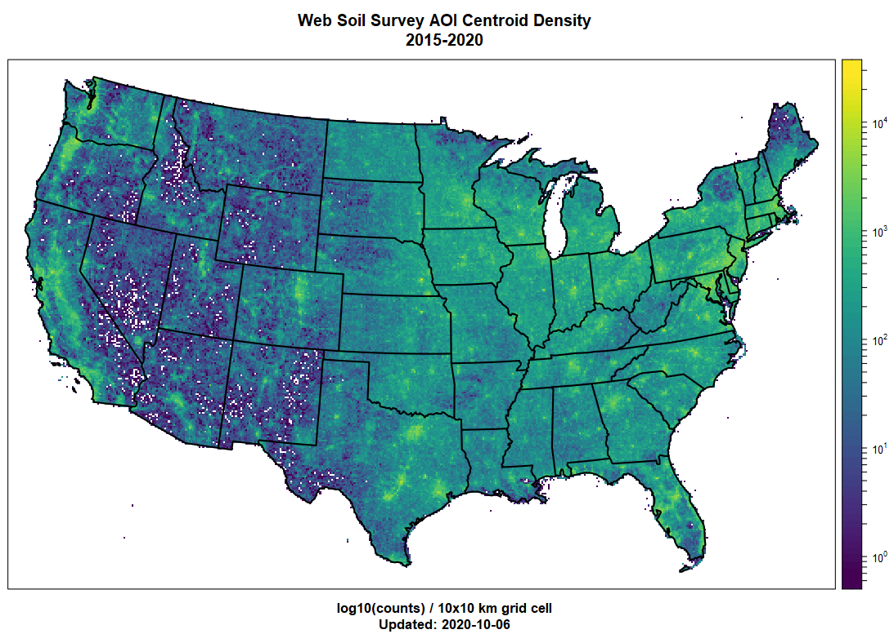

# Spatial Data in R {#spatial}


This chapter is a brief demonstration of possible ways to process spatial data in R. This will help you to develop a strategy for selecting spatial data processing methods.

## Objectives (Spatial Data)

-   Gain experience creating, editing, and exporting spatial data objects in R.

    -   Learn the basics of `sf` package for vector (points, lines, polygons) data
    -   Learn the basics of `terra` classes and functions for vector and raster data
    -   Learn about some interfaces to NCSS spatial data sources

-   Create maps with R

The next sections will require loading these libraries into the R session.

```{r eval=TRUE}
# SPC and soil database interface
library(aqp)
library(soilDB)

# "Simple Feature" (vector) data structures 
library(sf)

# superseded by sf -- spatial object classes e.g. SpatialPoints/SpatialPolygons
library(sp)

# gridded data management / analysis
library(terra)

# superseded by terra
# library(raster)

# interactive maps with leaflet
library(mapview)
```

There are [many packages](https://cran.r-project.org/web/views/Spatial.html) available for working with spatial data, however we only have time to cover introducing a few common libraries.

A couple resources are linked here for 5 packages that provide different ways displaying spatial data graphically:

-   [`tmap`](https://cran.r-project.org/web/packages/tmap/vignettes/tmap-getstarted.html)
-   [`ggplot2`](https://ggplot2.tidyverse.org/), [`ggmap`](https://github.com/dkahle/ggmap)\
-   [`mapview`](https://r-spatial.github.io/mapview/)
-   [`mapdeck`](https://symbolixau.github.io/mapdeck/articles/mapdeck.html)
-   [`leaflet`](https://rstudio.github.io/leaflet/)

## Making Maps with R



R has become a powerful tool for visualization and interaction with spatial data. There are many tools available for making maps with R! It is not all geostatistics and coordinate reference system transformations. There are powerful ways to automate your GIS workflow from beginning to end--from creating terrain derivatives from a source DEM, to high-quality, publication-ready maps and interactive HTML/JavaScript widgets.

An excellent resource for making maps with R is the chapter in "Geocomputation with R"

-   [geocompr: Making maps with R](https://r.geocompx.org/adv-map.html)

## Spatial Data Sources

Spatial data sources: "raster" and "vector"

-   Raster data sources (grids/images): GeoTIFF, ERDAS, BIL, ASCII grid, WMS, ...
-   Vector data sources (points/lines/polygons): Shape File, ESRI File Geodatabase, KML, GeoJSON, GML, WFS, ...

Conventional data sources that can be *upgraded* to be spatial data because they contain [GeoJSON](http://geojson.org/), [WKT](https://en.wikipedia.org/wiki/Well-known_text), or point coordinates include:

-   NASIS/LIMS reports
-   Web pages and Web Services
-   Excel and CSV files
-   Photo EXIF information

Here are some R-based interfaces to NCSS data sources via [`soilDB`](https://cran.r-project.org/web/packages/soilDB/index.html) package.

-   Functions that return *tabular data* contain longitude, latitude coordinates:

    -   [`fetchNASIS()`](http://ncss-tech.github.io/AQP/soilDB/fetchNASIS-mini-tutorial.html): NASIS "site" data 

    -   [`fetchLDM()`](http://ncss-tech.github.io/soilDB/reference/fetchLDM.html): KSSL "site" data from Lab Data Mart 

    -   [`fetchKSSL()`](http://ncss-tech.github.io/AQP/soilDB/KSSL-demo.html): KSSL "site" data from SoilWeb 

-   Functions that *return* spatial data:

    -   [`fetchSDA_spatial()`](http://ncss-tech.github.io/soilDB/reference/fetchSDA_spatial.html): polygon, bounding box and centroid data from SSURGO, STATSGO and the `sapolygon` (Soil Survey Area Polygon) from Soil Data Access (SDA)

    -   [`fetchHenry()`](http://ncss-tech.github.io/AQP/soilDB/Henry-demo.html): sensor / weather station locations as points

    -   [`SDA_query()`](http://ncss-tech.github.io/AQP/soilDB/SDA-tutorial-2.html): SSURGO data as points, lines, polygons (via SDA)

    -   [`SDA_spatialQuery()`](http://ncss-tech.github.io/soilDB/reference/SDA_spatialQuery.html): use points or polygons as a "query" to SDA

    -   [`seriesExtent()`](http://ncss-tech.github.io/soilDB/reference/seriesExtent.html) and [`taxaExtent()`](http://ncss-tech.github.io/soilDB/reference/taxaExtent.html): extent of series and taxonomic classes derived from SSURGO (SoilWeb) in vector and raster format (800m resolution). The vector output is identical to series extents reported by [Series Extent Explorer](https://casoilresource.lawr.ucdavis.edu/see/)

    -   [`mukey.wcs()`](http://ncss-tech.github.io/soilDB/reference/mukey.wcs.html) and [`ISSR800.wcs()`](http://ncss-tech.github.io/soilDB/reference/ISSR800.wcs.html) provide an interface to [gSSURGO (mukey), gNATSGO (mukey), and the ISSR-800 (gridded soil property) data](https://ncss-tech.github.io/soilDB/articles/wcs-ssurgo.html).

## Viewing Pedon Locations

In this section we will introduce the `sf` package with `mapview`.

### Plotting Geographic Data

Making maps of data gives you some idea how data look spatially and whether their distribution is what you expect.

Typos are relatively common when coordinates are manually entered. Viewing the data spatially is a quick way to see if any points plot far outside of the expected geographic area of interest.

```{r eval = TRUE}
# plot the locations of the gopheridge pedons with R
# 
# Steps:
# 1) create and inspect an sf data.frame object
# 2) plot the data with mapview

# load libraries
library(aqp)
library(soilDB)
library(sf)
library(mapview)

# this creates sample gopheridge object in your environment
data("gopheridge", package = "soilDB")

# replace gopheridge object with fetchNASIS() (your data)
# gopheridge <- fetchNASIS()

# create simple features POINT geometry data.frame
# st_as_sf(): convert data.frame to spatial simple features, with points in $geometry 
# st_crs(): set EPSG:4326 Coordinate Reference System (CRS) as Well-Known Text (WKT)
gopher.locations <- st_as_sf(
  site(gopheridge), 
  coords = c('longstddecimaldegrees','latstddecimaldegrees'),
  crs = st_crs(4326)
)

# create interactive map with sfc_POINT object
#  use site_id in sf data.frame as labels
mapview(gopher.locations, label = gopher.locations$site_id)
```

## Exercise 1: Pedon Locations {-}

In this exercise, you will create an interactive map with the pedons in your selected set. Then you will export them to a shapefile. Send a screenshot of your interactive map and your R script with any comments to your mentor.

Modify the code snippets below to make an R plot and a shapefile of pedon data loaded from your NASIS selected set. You will plot pedon locations using the standard WGS84 longitude/latitude decimal degrees fields from Site table of NASIS. In some cases, these data might be incomplete. You will create a subset SoilProfileCollection for the pedons that have complete spatial data (`longstddecimaldegrees` and `latstddecimaldegrees`).

1. Load the `aqp`, `soilDB`, `sf` and `mapview` packages and some pedons via `fetchNASIS()` (or similar source). You can use the sample datasets from Chapter 2 if you would like.

```{r r_plot_pedons, eval=FALSE, echo=TRUE, results='show', warning=FALSE}
library(aqp)
library(soilDB)
library(sf)
library(mapview)

# get pedons from the selected set
pedons <- fetchNASIS(from = 'pedons')
```

2.  Use the base R `subset()` function to create a subset of your SoilProfileCollection using `is.na()` to detect missing spatial data.

-   `longstddecimaldegrees` and `latstddecimaldegrees` variables contain WGS84 longitude and latitude in decimal degrees. This is the standard format for location information used in NASIS.

```{eval=FALSE}
# modify this code (replace ...) to create a subset
pedons.sp  <- aqp::subset(pedons, ...)
```

```{r, eval=FALSE, include=FALSE, echo=FALSE}
# answer 
pedons.sp  <- aqp::subset(pedons, !is.na(longstddecimaldegrees) & !is.na(latstddecimaldegrees))
```

3.  Create a `sf` data.frame from the site data in the SoilProfileCollection object `pedons.sp` using `aqp::site()`. Replace the `...` in the following code. Promoting a data.frame to sf POINT geometry requires that X and Y coordinate columns be specified.

```{eval=FALSE}
pedon.locations <- sf::st_as_sf(
  ..., 
  coords = c('longstddecimaldegrees', 'latstddecimaldegrees'),
  crs = sf::st_crs(4326) #WGS84 GCS
)
```

```{r, eval=FALSE, include=FALSE, echo=FALSE}
# answer 
pedon.locations <- sf::st_as_sf(
  aqp::site(pedons.sp), 
  coords = c('longstddecimaldegrees','latstddecimaldegrees'),
  crs = sf::st_crs(4326) #WGS84 GCS
)
```

4.  View your `sf` object `pedon.locations` interactively with `mapview::mapview()`, and change the `map.types` argument to `'Esri.WorldImagery'`. Use the `pedon.locations` column named `site_id` for the `label` argument.

```
# plot an interactive map
mapview(pedon.locations, 
        legend = FALSE, 
        map.types = 'OpenStreetMap',
        ...)
```

```{r, eval=FALSE, include=FALSE, echo=FALSE}
# answer 
mapview(pedon.locations, 
        legend = FALSE, 
        map.types = 'Esri.WorldImagery',
        label = pedon.locations$site_id)
```

5.  Create a subset `sf` data.frame with only the following "site data" columns: `pedlabsampnum`, `upedonid`, `taxonname`, `hillslopeprof`, `elev_field`, `slope_field`, `aspect_field`, `plantassocnm`, `bedrckdepth`, `bedrckkind`, `pmkind`, `pmorigin`. Select the target columns with `dplyr::select()` (or another method) by replacing the `...` in the following code.

```
pedon.locations_sub <- dplyr::select(pedon.locations, ...) 
# see also base::subset(x, select=...)
```

6.  Export the spatial information in `pedon.locations_sub` to a shape file (.shp) with `sf::st_write()`

```{r, eval=FALSE}
# write to SHP; output CRS is geographic coordinate system WGS84
sf::st_write(pedon.locations_sub, "./NASIS-pedons.shp")
```

## Packages for Vector Data

### The `sf` package

[Simple Features Access](https://www.ogc.org/standards/sfa) is a set of standards that specify a common storage and access model of geographic features. It is used mostly for two-dimensional geometries such as point, line, polygon, multi-point, multi-line, etc.

This is one of many ways of modeling the geometry of shapes in the real world. This model happens to be widely adopted in the **R** ecosystem via the `sf` package, and very convenient for typical data encountered by soil survey operations.

The [sf package](https://r-spatial.github.io/sf/) represents the latest and greatest in spatial data processing within the comfort of an R session. It provides a "main" object class `sf` to contain geometric data and associated tabular data in a familiar `data.frame` format. `sf` methods work on a variety of different levels of abstraction and manipulation of those geometries.

Most of the sf package functions start with the prefix `st_`, such as: `st_crs()` (get/set coordinate reference system), `st_transform()` (project feature class to different coordinate reference system), `st_bbox()` (bounding box), `st_buffer()` (buffer). Many of these are "verbs" that are common GIS operations.

#### `sf` vignettes

You can the following `sf` package vignettes for details, sample data sets and usage of `sf` objects.

1.  [Simple Features for R](https://r-spatial.github.io/sf/articles/sf1.html)

2.  [Reading, Writing and Converting Simple Features](https://r-spatial.github.io/sf/articles/sf2.html)

3.  [Manipulating Simple Feature Geometries](https://r-spatial.github.io/sf/articles/sf3.html)

4.  [Manipulating Simple Features](https://r-spatial.github.io/sf/articles/sf4.html)

5.  [Plotting Simple Features](https://r-spatial.github.io/sf/articles/sf5.html)

6.  [Miscellaneous](https://r-spatial.github.io/sf/articles/sf6.html)

7.  [Spherical geometry in sf using s2geometry](https://r-spatial.github.io/sf/articles/sf7.html)

### The `sp` Package

The data structures ("classes") and functions provided by the [`sp`](https://cran.r-project.org/web/packages/sp/index.html) package have served a foundational role in the handling of spatial data in R for years.

Many of the following examples will reference names such as `SpatialPoints`, `SpatialPointsDataFrame`, and `SpatialPolygonsDataFrame`. These are specialized (S4) classes implemented by the `sp` package.

Objects of these classes maintain linkages between all of the components of spatial data. For example, a point, line, or polygon feature will typically be associated with:

-   coordinate geometry
-   bounding box
-   coordinate reference system
-   attribute table

### Converting `sp` and `sf`

`sp` provides access to the same compiled code libraries (PROJ, GDAL, GEOS) through `sf` package.

For now the different package object types are interchangeable, and you may find yourself having to do this for a variety of reasons. You can convert between object types as needed using `sf::as_Spatial()` or `sf::st_as_sf()`.

Check the documentation (`?functionname`) to figure out what object types different methods need as input; and check an input object's class with `class()` or `inherits()`.

### Importing / Exporting Vector Data

Import a feature class from a ESRI File Geodatabase or shape file.

If you have a *.shp* file, you can specify the whole path, including the file extension in the `dsn` argument, or just the folder.

For a Geodatabase, you should specify the feature class using the `layer` argument. Note that a trailing "/" is omitted from the `dsn` (data source name) and the ".shp" suffix is omitted from the `layer`.

#### `sf`

```{r eval=FALSE}
x <- sf::st_read(dsn = 'E:/gis_data/ca630/FG_CA630_OFFICIAL.gdb', layer = 'ca630_a')
x <- sf::read_sf(dsn = 'E:/gis_data/ca630/pedon_locations.shp')
```

```{r eval=FALSE}
sf::st_write(x, dsn = 'E:/gis_data/ca630/pedon_locations.shp')
sf::write_sf(x, dsn = 'E:/gis_data/ca630/pedon_locations.shp')
```

#### `sp`

Export object `x` to shapefile using the `sf` syntax. `rgdal` is no longer available on CRAN.

The `sf` `st_read()` / `read_sf()` / `st_write()` / `write_sf()` functions have many arguments, so it is worth spending some time reviewing the associated manual pages.

### Interactive mapping with `mapview` and `leaflet`

The `mapview` and `leaflet` packages make it possible to display interactive maps of `sf` objects in RStudio viewer pane, or within an HTML document generated via R Markdown (e.g. this document).

-   [`mapview` package](https://github.com/r-spatial/mapview)
    -   [Basics](https://r-spatial.github.io/mapview/articles/mapview_01-basics.html)
    -   [Advanced Features](https://r-spatial.github.io/mapview/articles/mapview_02-advanced.html)
    -   See other "Articles" in this series, you can make [complex, interactive maps](https://r-spatial.github.io/mapview/articles/mapview_05-extras.html) using the `mapview` package.
-   [`leaflet` package](https://rstudio.github.io/leaflet/)
-   [`leafem`: 'leaflet' Extensions for 'mapview'](https://cran.r-project.org/web/packages/leafem/index.html)

## Exercise 2: Map your favorite soil series extents {-}

The `seriesExtent` function in `soilDB` returns an `sf` object showing generalized extent polygons for a given soil series.

```{r, eval=TRUE}
# load required packages, just in case
library(soilDB)
library(sf)
library(mapview)

# series extents from SoilWeb (sf objects)
pentz <- seriesExtent('pentz')
amador <- seriesExtent('amador')

# combine into a single object
s <- rbind(pentz, amador)
```

```{r, results='asis', eval=TRUE, out.width="100%"}
# colors used in the map
# add more colors as needed
cols <- c('royalblue', 'firebrick')

# make a simple map, colors set by 'series' column
mapview(s, zcol = 'series', col.regions = cols, legend = TRUE)
```

The following code demonstrates how to fetch / convert / map soil series extents, using a vector of soil series names.

Results appear in the RStudio "Viewer" pane. Be sure to try the "Export" and "show in window" (next to the broom icon) buttons.

```{r, results='asis', eval=FALSE, out.width="100%"}
# load required packages, just in case
library(soilDB)
library(sf)
library(mapview)

# vector of series names, letter case does not matter
# try several (2-9)!
series.names <- c('auberry', 'sierra', 'holland', 'cagwin')

# iterate over series names, get extent
# result is a list of sf objects
s <- lapply(series.names, soilDB::seriesExtent)

# flatten list -> single sf object
s <- do.call('rbind', s)

# colors used in the map
# note trick used to dynamically set the number of colors
cols <- RColorBrewer::brewer.pal(n = length(series.names), name = 'Set1')

# make a simple map, colors set by 'series' column
# click on polygons for details
# try pop-out / export buttons
mapview(s, zcol = 'series', col.regions = cols, legend = TRUE)
```

**Question: What do you notice about the areas where the extent polygons occur? Share your thoughts with your peers or mentor**

## Packages for Raster Data

### The `terra` Package

The [`terra` package](https://cran.r-project.org/web/packages/terra/index.html) package provides most of the commonly used grid and vector processing functionality that one might find in a conventional GIS. It provides high-level data structures and functions for the GDAL (Geospatial Data Abstraction Library).

-   resampling ([`terra::resample()`](https://rspatial.github.io/terra/reference/resample.html))

-   projection and warping ([`terra::project()`](https://rspatial.github.io/terra/reference/project.html)`)`

-   cropping, mosaicing, masking ([`terra::crop()`](https://rspatial.github.io/terra/reference/crop.html), [`terra::mosaic()`](https://rspatial.github.io/terra/reference/mosaic.html), [`terra::merge()`](https://rspatial.github.io/terra/reference/merge.html), [`terra::mask()`](https://rspatial.github.io/terra/reference/mask.html))

-   local and focal functions ([`terra::local()`](https://rspatial.github.io/terra/reference/local.html), [`terra::focal()`](https://rspatial.github.io/terra/reference/focal.html))

-   raster algebra (arithmetic operators, [`terra::xapp()`](https://rspatial.github.io/terra/reference/xapp.html))

-   sampling ([`terra::spatSample()`](https://rspatial.github.io/terra/reference/spatSample.html)`)`

-   contouring ([`terra::contour()`](https://rspatial.github.io/terra/reference/contour.html)`)`

-   raster/vector conversions ([`terra::rasterize()`](https://rspatial.github.io/terra/reference/rasterize.html), [`terra::as.polygons()`](https://rspatial.github.io/terra/reference/as.polygons.html))

-   terrain analysis ([`terra::terrain()`](https://rspatial.github.io/terra/reference/terrain.html))

-   model-based prediction and interpolation ([`terra::predict()`](https://rspatial.github.io/terra/reference/predict.html), [`terra::interpolate()`](https://rspatial.github.io/terra/reference/interpolate.html); more on this in [Part 2](https://ncss-tech.github.io/stats_for_soil_survey/book2/index.html))

#### Terra Example

This is a brief demonstration using sample data files with terra.

```{r fig.width=6, fig.height=6, eval=TRUE}
# use an example from the terra package
f <- system.file("ex", "elev.tif", package = "terra")

# corresponding luxembourg vector (polygon) data
g <- system.file("ex", "lux.shp", package = "terra")

r <- terra::rast(f)
r

v <- terra::vect(g)
v


# show SpatRaster details
print(r)

# default plot method
plot(r)
lines(v)

# interactive (leaflet) plot method
p <- plet(r, tiles = "OpenTopoMap")

lines(p, v)
```

The R object only stores a reference to the data until they are needed to be loaded into memory. This allows for internal raster manipulation algorithms to intelligently deal with very large grids that may not fit in memory.

#### Other approaches to raster data

##### `raster`

A more complete background on the capabilities of the `raster` package, and the replacement [`terra`](https://rspatial.org/terra/index.html), are described in the [*Spatial Data Science with R*](http://rspatial.org/) online book.

```{r, eval = TRUE}
# convert r to a RasterLayer object
r2 <- raster::raster(f)

# show RasterLayer details
print(r2) 
```

[*Introduction to the raster package*](https://cran.r-project.org/web/packages/raster/vignettes/Raster.pdf) vignette

##### `stars`

There is also a package called [`stars`](https://r-spatial.github.io/stars/) (Spatiotemporal Arrays: Raster and Vector Datacubes) that is the `sf`-centric way of dealing with higher dimensional raster and vector "datacubes." Data cubes have additional dimensions related to time, spectral band, or sensor type. The `stars` data structures are often used for processing spectral data sources from satellites.

#### Related Links

-   [`sf` package website](https://r-spatial.github.io/sf/)
-   [rspatial.org - Spatial Data Science with R](https://rspatial.org/)
-   [Goodbye PROJ.4 strings! How to specify a coordinate reference system in R?](https://inbo.github.io/tutorials/tutorials/spatial_crs_coding/)

### Converting Vector to Raster

#### [`terra::rasterize()`](https://rspatial.github.io/terra/reference/rasterize.html)

#### [`fasterize::fasterize()`](https://cran.r-project.org/web/packages/fasterize/vignettes/using-fasterize.html)

### Converting Raster to Vector

#### [`terra::as.polygons()`](https://rspatial.github.io/terra/reference/as.polygons.html)

## Coordinate Reference Systems (CRS)

Spatial data aren't all that useful without an accurate description of the Coordinate Reference System (CRS). This type of information is typically stored within the ".prj" component of a shapefile, or in the header of a GeoTIFF.

Without a CRS it is not possible to perform coordinate transformations (e.g. conversion of geographic coordinates to projected coordinates), spatial overlay (e.g. intersection), or geometric calculations (e.g. distance or area).

The "old" way (PROJ.4) of specifying coordinate reference systems is using character strings containing, for example: `+proj` or `+init` arguments. In general, this still "works," so you may encounter it and need to know about it. But you also may encounter cases where CRS are specified using integers, strings of the form `authority:code`, or well-known text (WKT).

Some common examples of coordinate system "EPSG" codes and their legacy "PROJ.4" strings. 4

-   "EPSG" stands for European Petroleum Survey Group. The "EPSG Geodetic Parameter Dataset" is a public registry of geodetic datums, spatial reference systems, Earth ellipsoids, coordinate transformations and related units of measurement.

-   "OGC" refers to the Open Geospatial Consortium, which is an example of another important `authority:code`. "ESRI" (company that develops ArcGIS) also defines many CRS codes.

-   "PROJ" is the software responsible for transforming coordinates from one CRS to another. The current version of PROJ available is 9, and in PROJ \> 6 major changes were made to the way that coordinate reference systems are defined and transformed led to the "PROJ.4" syntax falling out of favor.

-   *EPSG*: [`4326`](https://epsg.io/4326) / *PROJ.4*:`+proj=longlat +datum=WGS84` - geographic, WGS84 datum (NASIS Standard)

-   *OGC*:[`CRS84`](http://defs.opengis.net/vocprez/object?uri=http://www.opengis.net/def/ogc/CRS84) - geographic, WGS84 datum (same as above but explicit longitude, latitude XY order)

-   *EPSG*: [`4269`](https://epsg.io/4269) / *PROJ.4*:`+proj=longlat +datum=NAD83` - geographic, NAD83 datum

-   *EPSG*: [`4267`](https://epsg.io/4267) / *PROJ.4*:`+proj=longlat +datum=NAD27` - geographic, NAD27 datum

-   *EPSG*: [`26910`](https://epsg.io/26910) / *PROJ.4*:`+proj=utm +zone=10 +datum=NAD83` - projected (UTM zone 10), NAD83 datum

-   *EPSG*: [`5070`](https://epsg.io/5070) / *PROJ.4*: `+proj=aea +lat_1=29.5 +lat_2=45.5 +lat_0=23.0 +lon_0=-96 +x_0=0 +y_0=0 +datum=NAD83 +units=m +no_defs` - Albers Equal Area CONUS (gSSURGO)

-   More on the EPSG codes and specifics of CRS definitions:

    -   <https://spatialreference.org/ref/epsg/>

    -   <https://epsg.io/>

While you may encounter PROJ.4 strings, these are no longer considered the preferred method of referencing Coordinate Reference Systems -- and, in general, newer methods are "easier."

Well-known text (WKT) is a human- machine-readable standard format for geometry, so storing the Coordinate Reference System information in a similar format makes sense. This format is returned by the `sf::st_crs()` method.

For example: the WKT representation of `EPSG:4326`:

```{r, eval=TRUE}
st_crs(4326)
```

This is using the [OGC WKT CRS standard](https://www.ogc.org/standards/wkt-crs). Adoption of this standard caused some significant changes in packages in the R ecosystem.

So you can get familiar, what follows are several examples of doing the same thing: setting the CRS of spatial objects with WGS84 longitude/latitude geographic coordinates. If you have another target coordinate system, it is just a matter of using the correct codes to identify it.

### Assigning and Transforming Coordinate Systems

Returning to the example from above, lets **assign** a CRS to our series extent `s` using different methods.

```{r, eval=TRUE}
s <- seriesExtent('san joaquin')
```

The following sections give equivalent `sf` versus `sp` syntax.

#### `sf`

Use `st_crs<-` to set, or `st_crs()` get CRS of `sf` objects. Supply the target EPSG code as an integer.

```{r, eval=TRUE}
# the CRS of s is EPSG:4326
st_crs(s) == st_crs(4326)

# set CRS using st_crs<- (replace with identical value)
st_crs(s) <- st_crs(4326)
```

Transformation of points, lines, and polygons with `sf` requires an “origin” CRS be defined in the argument `x`. The “target” CRS is defined as an integer (EPSG code) in the `crs` argument or is the output of `st_crs()`.

```{r, eval=TRUE}
# transform to UTM zone 10
s.utm <- st_transform(x = s, crs = 26910)

# transform to GCS NAD27
s.nad27 <- st_transform(x = s, crs = st_crs(4267))
```

#### `sp`

You can do the same thing several different ways with `sp` objects. An equivalent EPSG, OGC and PROJ.4 can be set or get using `proj4string<-`/`proj4string` and either a `sp` `CRS` object or a PROJ.4 string for `Spatial` objects.

```{r, eval=TRUE}
# s is an sf object (we converted it), convert back to Spatial* object
s.sp <- sf::as_Spatial(s) 

# these all create the same internal sp::CRS object
proj4string(s.sp) <- sp::CRS('EPSG:4326')          # proj >6; EPSG
proj4string(s.sp) <- sp::CRS('OGC:CRS84')          # proj >6; OGC
proj4string(s.sp) <- '+init=epsg:4326'             # proj 4 style +init string (deprecated)
proj4string(s.sp) <- '+proj=longlat +datum=WGS84'  # proj 4 style +proj string
```

Here, we do the same transformations we did above only using `sp::spTransform()`.

```{r, eval=TRUE}
# transform to UTM zone 10
s.utm <- spTransform(s.sp, CRS('+proj=utm +zone=10 +datum=NAD83'))

# transform to GCS NAD27
s.nad27 <- spTransform(s.sp, CRS('+proj=longlat +datum=NAD27'))
```

#### `terra` and `raster`

To assign or get the coordinate reference system for `raster`, `terra` or `sp` `CRS` objects use the `crs()` functions.

```{r, eval=FALSE}
r <- terra::rast(system.file("ex", "elev.tif", package="terra"))

# inspect CRS
terra::crs(r)

# r is a SpatRaster object; set CRS to current CRS
terra::crs(r) <- terra::crs("OGC:CRS84")
```

"Transforming" or "warping" a raster is a different from with a vector as it requires interpolation of pixels to a target resolution and CRS.

The method provided by `terra` is `project()` and in `raster` it is `projectRaster()`.

It works the same as the above "transform" methods in that you specify an object to transform, and the target reference system or a template for the object.

```{r, eval=FALSE}
t.wgs84 <- terra::project(r, terra::crs("+proj=igh"))
r.wgs84 <- raster::projectRaster(raster::raster(r), crs = CRS("+proj=igh"))
```

Note that the default warping of raster uses *bilinear interpolation* (`method='bilinear'`), which is appropriate for *continuous variables*.

You also have the option of using nearest-neighbor (`method='ngb'`) for *categorical variables* (class maps) where interpolation would not make sense.

If we want to save this transformed raster to file, we can use something like this for `terra`

```{r, eval=FALSE}
terra::writeRaster(t.wgs84, filename='s_wgs84.tif', gdal=c("COMPRESS=LZW"))
```

Similarly for `raster`:

```{r, eval=FALSE}
terra::writeRaster(r.wgs84, filename='s_wgs84.tif', gdal=c("COMPRESS=LZW"))
```

## Load Required Packages

Load required packages into a fresh RStudio Session (Ctrl + Shift + F10)

```{r results="hide"}
library(aqp)
library(soilDB)
library(sf)
library(terra)
```

## Download Example Data

Run the following to create a path for the example data. Be sure to set a valid path to a local disk.

```{r, eval=TRUE}
# store path as a variable, in case you want to keep it somewhere else
ch4.data.path <- 'C:/workspace2/chapter-4'

# make a place to store chapter 2b example data
dir.create(ch4.data.path, recursive = TRUE)

# download polygon example data from github
download.file(
  'https://github.com/ncss-tech/stats_for_soil_survey/raw/master/data/chapter_4-spatial-data/chapter-4-mu-polygons.zip', 
  file.path(ch4.data.path, 'chapter-4-mu-polygons.zip')
)

# download raster example data from github 
download.file(
  'https://github.com/ncss-tech/stats_for_soil_survey/raw/master/data/chapter_4-spatial-data/chapter-4-PRISM.zip', 
  file.path(ch4.data.path, 'chapter-4-PRISM.zip')
)

# unzip
unzip(
  file.path(ch4.data.path, 'chapter-4-mu-polygons.zip'), 
  exdir = ch4.data.path, overwrite = TRUE
)

unzip(
  file.path(ch4.data.path, 'chapter-4-PRISM.zip'), 
  exdir = ch4.data.path, overwrite = TRUE
)
```

## Load Example MLRA Data

We will be using polygons associated with MLRA 15 and 18 as part of this demonstration.

Import these data with `sf::st_read()`.

```{r results='hide', eval=TRUE}
# load MLRA polygons
mlra <- sf::st_read(file.path(ch4.data.path, 'mlra-18-15-AEA.shp'))

## alternately, use your own MLRA
# mlra <- soilDB::fetchSDA_spatial(c("15", "18"), by.col="MLRARSYM", geom.src = "MLRAPOLYGON") |> sf::st_transform("EPSG:5070")
```

We will load the sample MLRA 15 and 18 (California) raster data (PRISM derived) using `terra::rast()`. If using your own MLRA, you will need to update file paths to use your own rasters.

```{r results='hide', eval=TRUE}
# mean annual air temperature, Deg C
maat <- terra::rast(file.path(ch4.data.path, 'MAAT.tif'))

# mean annual precipitation, mm
map <- terra::rast(file.path(ch4.data.path, 'MAP.tif'))

# frost-free days
ffd <- terra::rast(file.path(ch4.data.path, 'FFD.tif'))

# growing degree days
gdd <- terra::rast(file.path(ch4.data.path, 'GDD.tif'))

# percent of annual PPT as rain
rain_fraction <- terra::rast(file.path(ch4.data.path, 'rain_fraction.tif'))

# annual sum of monthly PPT - ET_p
ppt_eff <- terra::rast(file.path(ch4.data.path, 'effective_precipitation.tif'))
```

Sometimes it is convenient to "stack" raster data that share a common grid size, extent, and coordinate reference system into a multilayer `terra` `SpatRaster` object. Calling `terra::rast()` on a `list` of `SpatRaster` is equivalent to making a `RasterStack` from several `RasterLayer` with `raster::stack()`.

```{r, eval=TRUE}
# create a raster stack (multiple rasters aligned)
rs <- terra::rast(list(maat, map, ffd, gdd, rain_fraction, ppt_eff))

# inspect
rs

plot(rs)
```

## Vector Data

### `sf`

```{r, eval=TRUE}
p <- sf::st_as_sf(data.frame(x = -120, y = 37.5),
                  coords = c("x", "y"),
                  crs = 4326)
p.aea <- st_transform(p, "EPSG:5070")
```

In `sf` the functions used to do this are `st_intersects()` or `st_intersection()`.

```{r, eval=TRUE}
st_intersects(p.aea, mlra)
st_intersection(p.aea, mlra)
```

### `terra`

```{r, eval=TRUE}
p <- terra::vect(data.frame(x = -120, y = 37.5),
                 geom = c("x", "y"),
                 crs = "EPSG:4326")
p.aea <- project(p, "EPSG:5070")
```

In `terra` the functions used to determine the intersection is `relate()`.

```{r, eval=TRUE}
mlra[relate(vect(mlra), p.aea, relation = "intersects"), 
]
```

### `sp`

In `sp` objects, you do these operations with the `sp::over()` function. Access the associated vignette by running `vignette("over")` in the console when the `sp` package is loaded.

```{r, eval=FALSE}
# hand make a SpatialPoints object
# note that this is GCS
p <- SpatialPoints(coords = cbind(-120, 37.5), 
                   proj4string = CRS('+proj=longlat +datum=WGS84'))

mlra.sp <- sf::as_Spatial(mlra)
# spatial extraction of MLRA data requires a CRS transformation
p.aea <- spTransform(p, proj4string(mlra.sp))
over(p.aea, mlra.sp)
```

## Raster Data

### Object Properties

`SpatRaster` and `RasterLayer` objects are similar to `sf`, `sp` and other R spatial objects in that they keep track of the linkages between data, coordinate reference system, and optional attribute tables. Getting and setting the contents of raster objects should be performed using functions such as:

-   `terra::NAflag(r)` / `raster::NAvalue(r)`: get / set the NODATA value
-   `terra::crs(r)` / `raster::wkt(r)` : get / set the coordinate reference system
-   `terra::res(r)` / `raster::res(r)`: get / set the resolution
-   `terra::ext(r)` / `raster::extent(r)`: get / set the extent
-   `terra::datatype(r)` / `raster::dataType(r)`: get / set the data type
-   ... many more, see the [`raster`](https://rspatial.github.io/raster/) and [`terra`](https://rspatial.github.io/terra/) package manuals

### Rasters "In Memory" vs. "File-Based"

Processing of raster data in memory is always faster than processing on disk, as long as there is sufficient memory. The `terra` package handles basically all of the logic delegating in vs. out of memory processing internally--so it is rare that any adjustments to defaults are required.

With the `raster` package, the initial file/disk-based reference can be converted to an in-memory `RasterLayer` with the `readAll()` function. You can achieve a similar effect in `terra` by doing `set.values(object)`.

### Rasters "Continuous" vs. "Categorical"

Rasters can represent both continuous and categorical (factor) variables. Raster categories are stored as integers with one or more associated labels.

The categories can be viewed using the `levels()` and `terra::cats()` functions. You can have multiple category columns, and the "active" category can be set with `terra::activeCat()`.

You can use the `terra::classify()` function to assign integer values to each pixel that can be the basis for your categories. Then, you can set the category labels associated with each integer value.

For example,  we classify the terra sample elevation dataset into high and low elevation areas. We supply a reclassification matrix of values with three columns. The first column is the "low" end of the class range, the second column is the high end of the class range. The third column contains the new values to assign.

```{r, eval=TRUE}
x <- terra::rast(system.file("ex", "elev.tif", package = "terra"))

rcl <- cbind(c(0, 300), c(300, 600), 1:2)
colnames(rcl) <- c("low", "high", "new_value")
rcl

y <- terra::classify(x, rcl)
plot(y)
```

Once we classify a raster into a set of integer values, we can assign labels or categories to each value with `levels()`:

```{r, eval=TRUE}
new_levels <- data.frame(
  values = 1:2,
  region = c("low elevation", "high elevation"),
  otherlabel = c("A", "B")
)
new_levels

levels(y) <- new_levels
plot(y)
```

Our categories had two columns with labels. The first one (`region`) is selected by default. We can use the second (`otherlabel`) if we set it as the active category with `terra::activeCat()`.

```{r, eval=TRUE}
terra::activeCat(y) <- "otherlabel"
plot(y)
```

We can also handle values that are not matched in `classify()` matrix with the `others` argument. Here we set `others = 3` so that any cell values that are not included in `rcl` get assigned value `3`.

```{r, eval= TRUE}
rcl <- cbind(c(200, 300), c(300, 600), 1:2)
colnames(rcl) <- c("low", "high", "new_value")
rcl

y2 <- terra::classify(x, rcl, others = 3)
plot(y2)
```

We have not provided handling for `NA` values so they are not altered by the above classification. We can convert `NA` values explicitly by adding them to `rcl`:

```{r, eval= TRUE}
rcl <- cbind(c(200, 300, NA), c(300, 600, NA), c(1:2, 4))
colnames(rcl) <- c("low", "high", "new_value")
rcl

y3 <- terra::classify(x, rcl, others = 3)
plot(y3)
```

Note that `classify()` works with the "raw" values of categorical rasters, ignoring the categories. To simply change the labels of categorical rasters, use `terra::subst()` instead.

### Writing Rasters to File

Exporting data requires consideration of the output format, datatype, encoding of NODATA, and other options such as compression.

With terra, `"COMPRESS=LZW"` option is used by default when writing GeoTIFF files. Using the `gdal` argument e.g.: `terra::writeRaster(..., gdal=)` is equivalent to specifying `options` argument to `raster::writeRaster()`.

```{r eval=FALSE}
# using previous example data set
terra::writeRaster(x, filename = 't.wgs84.tif')
```

For example, a `RasterLayer` object that you wanted to save to disk as an internally-compressed GeoTIFF:

```{r eval=FALSE}
# using previous example data set
raster::writeRaster(x, filename = 'r.tif', options = c("COMPRESS=LZW"))
```

#### Writing Categorical Rasters to File

When you write categorical rasters to file, categories will either be stored within the file itself, or in a Persistent Auxiliary Metadata (PAM) into an .aux.xml file automatically. If only using terra or other GDAL tools to work with raster data this is usually sufficient.

You can also write a Value Attribute Table (VAT) as a .vat.dbf file containing categorical information. Writing this file can be important if you want to use your categories in other GIS software such as ArcGIS (which does not necessarily make full use of GDAL PAM).

We can write a data.frame containing the levels of our raster to file using `foreign::write.dbf()` function. You will append the ".vat.dbf"  extension to the base filename of your data.

```{r}
x <- terra::rast(system.file("ex", "elev.tif", package = "terra"))

rcl <- cbind(c(0, 300), c(300, 600), 1:2)
colnames(rcl) <- c("low", "high", "new_value")
rcl

y <- terra::classify(x, rcl)
plot(y)

terra::writeRaster(y, "my_categorical_data.tif", overwrite = TRUE)

my_categories <- data.frame(
  values = 1:2,
  region = c("low elevation", "high elevation"),
  otherlabel = c("A", "B")
)

foreign::write.dbf(my_categories, file = "my_categorical_data.tif.vat.dbf")
```

### Data Types

Commonly used raster `datatype` include: "unsigned integer", "signed integer", and "floating point" of variable precision.

-   `INT1U`: integers from 0 to 255
-   `INT2U`: integers from 0 to 65,534
-   `INT2S`: integers from -32,767 to 32,767
-   `INT4S`: integers from -2,147,483,647 to 2,147,483,647
-   `FLT4S`: floating point from -3.4e+38 to 3.4e+38
-   `FLT8S`: floating point from -1.7e+308 to 1.7e+308

It is wise to manually specify an output `datatype` that will "just fit" the required precision.

For example, if you have generated a `SpatRaster` that warrants integer precision and ranges from 0 to 100, then the `INT1U` data type would provide enough precision to store all possible values *and* the NODATA value, with the smallest possible file size. Raster data stored as integers will always be smaller (sometimes 10-100x) than those stored as floating point, especially when compressed.

```{r eval = FALSE}
# integer grid with a range of 0-100
raster::writeRaster(x, filename = 'r.tif', datatype = 'INT1U')

# floating point grid with very wide range
terra::writeRaster(x, filename = 'r.tif', datatype = 'FLT4S')
```

#### Notes on Compression

It is often a good idea to create internally-compressed raster data.

The [GeoTiff format](https://gdal.org/drivers/raster/gtiff.html) can accommodate many different compression algorithms, including lossy (JPEG) compression. Usually, the default "LZW" or "DEFLATE" compression will result in significant savings, especially for data encoded as integers.

For example, the CONUS gSSURGO map unit key grid at 30m resolution is about 55Gb (GeoTiff, no compression) vs. 2.4Gb after LZW compression.

```{r eval = FALSE}
# reasonable compression using LZW is the default, compare to 

raster::writeRaster(x, filename='r.tif', options=c("COMPRESS=NONE"))

# takes longer to write the file, but better compression
terra::writeRaster(x, filename='r.tif', gdal=c("COMPRESS=DEFLATE", "PREDICTOR=2", "ZLEVEL=9")
```

See [this article](https://kokoalberti.com/articles/geotiff-compression-optimization-guide/) for some ideas on optimization of file read/write times and associated compressed file sizes.

## Exercise 3: Creating a Slope Map {-}

In this exercise you will create a continuous and categorical slope gradient maps from a digital elevation model.

1. Use the sample Tahoe-area LiDAR elevation dataset from the gdalUtilities package or your own dataset as input. If you use your own data, you may want to make a smaller extent with [`terra::crop()`](https://search.r-project.org/CRAN/refmans/terra/html/crop.html).
   - `tahoe <- terra::rast(system.file("extdata", "tahoe_lidar_bareearth.tif", package = "gdalUtilities"))`

2. Run [`terra::terrain()`](https://search.r-project.org/CRAN/refmans/terra/html/terrain.html) to create a slope map with `unit="radians"`.

3. Convert radians to percent slope (divide by `2*pi`, multiply by `100`).

4. Make a plot of the continuous percent slope. You can use `terra::plot()` for static map or `terra::plet()` for an interactive map.

5. Make a plot of the binned percent slope. You can use `terra::plot(..., type="interval")` to do this. You can experiment with custom class breaks using the `breaks` argument.

5. Use `terra::classify()` to create a categorical map of custom slope classes. Use the following breaks and assign the integer values `1` through `5` from lowest to highest.

   - 0 to 3%
   - 3 to 15%
   - 15 to 30%
   - 30 to 60%
   - \>60% 
 
6. Create a data.frame containing the integer values and class labels. Use `levels()` to set the categories for your raster.

7. Write the raster data to a GeoTIFF file with `terra::writeRaster()`

8. Write the raster attribute table to a .vat.dbf file with `foreign::write.dbf()`

Bonus: Load the GeoTIFF file in the GIS software of your choice to inspect.  

## Spatial Overlay Operations

Spatial data are lot more useful when "related" (overlay, intersect, spatial query, etc.) to generate something new. The CRS of the two objects being overlaid must match.

### Working with Vector and Raster Data

Typically, spatial queries of raster data by geometry features (point, line, polygon) are performed in two ways:

1.  For each geometry, collect all pixels that overlap (`exactextractr` approach)

2.  For each geometry, collect a sample of pixels defined by [sampling points](http://ncss-tech.github.io/AQP/sharpshootR/sample-vs-population.html)

The first method ensures that all data are included in the analysis, however, processing can be slow for multiple/detailed rasters, and the results may not fit into memory.

The second method is more efficient (10-100x faster), requires less memory, and can remain statistically sound--as long as a reasonable sampling strategy is applied. Sampling may also help you avoid low-acreage "anomalies" in the raster product. More on sampling methods in the next chapter.

The `extract()` function can perform several operations in one call, such as buffering (in projected units) with `buffer` argument. See the manual page for an extensive listing of optional arguments and what they do.

Sampling and extraction with `terra` the results in a `SpatVector` object. Sampling and extraction with `raster` methods results in a `matrix` object.

```{r, eval=TRUE}
# sampling single layer SpatRaster
terra::spatSample(maat, size = 10)

# sampling SpatRaster
terra::spatSample(rs, size = 10)
```

```{r fig.width=8, fig.height=5, eval=TRUE}
par(mfcol = c(1, 2), mar = c(1, 1, 3, 1))

# regular sampling + extraction of raster values
x.regular <-  terra::spatSample(
  maat,
  method = "regular",
  size = 100,
  as.points = TRUE
)
x.regular

# see also raster::sampleRegular()

plot(maat,
     axes = FALSE,
     legend = FALSE,
     main = 'Regular Sampling')
points(x.regular)

# random sample + extraction of raster values
# note that NULL values are removed
x.random <- terra::spatSample(
  maat,
  size = 100,
  as.points = TRUE,
  na.rm = TRUE
)

# see also raster::sampleRandom()

plot(maat,
     axes = FALSE,
     legend = FALSE,
     main = 'Random Sampling with NA Removal')
points(x.random)
```

Note that the mean can be efficiently estimated, even with a relatively small number of samples.

```{r}
# all values: slow for large grids
mean(terra::values(maat), na.rm = TRUE)

# regular sampling: efficient, central tendency comparable to above
mean(x.regular$MAAT, na.rm = TRUE)

# this value will be pseudorandom
#  depends on number of samples, pattern of NA
mean(x.random$MAAT, na.rm = TRUE)
```

Just how much variation can we expect when collecting 100, randomly-located samples over such a large area?

```{r}
# 10 replications of samples of n=100
z <- replicate(10, {
  mean(terra::spatSample(maat,
                         size = 100,
                         na.rm = TRUE)$MAAT,
       na.rm = TRUE)
})

# 90% of the time the mean MAAT values were within:
quantile(z, probs = c(0.05, 0.95))
```

Do the above routine 100 times: compute the mean MAAT from 100 randomly-located samples. Does it make a difference in your estimates?

```{r, fig.width=5, fig.height=6.75, eval=TRUE}
# MLRA polygons in native coordinate system
plot(sf::st_geometry(mlra), main = 'MLRA 15 and 18')
box()

# MAAT raster
plot(maat, main = 'PRISM Mean Annual Air Temperature (deg C)')

# plot MAAT raster with MLRA polygons on top
# this requires transforming to CRS of MAAT
mlra.gcs <- sf::st_transform(mlra, sf::st_crs(maat))
plot(maat, main = 'PRISM Mean Annual Air Temperature (deg C)')
plot(sf::st_geometry(mlra.gcs), main = 'MLRA 15 and 18', add = TRUE)
```

## Exercise 4: Extracting Raster Data {-}

### Raster Summary By Point: NASIS Pedon Locations

In this extended example and exercise, we will extract PRISM data at the coordinates associated with NASIS pedons that have been correlated to the [Loafercreek](https://casoilresource.lawr.ucdavis.edu/sde/?series=loafercreek) series.

We will use the sample dataset `loafercreek` from the `soilDB` package to get NASIS data. This example can be easily adapted to your own pedon data extracted from NASIS using [`fetchNASIS()`](http://ncss-tech.github.io/soilDB/reference/fetchNASIS.html), but if your points are not in California, you will need to supply your own raster data.

Get some NASIS data and upgrade the "site" data to a `sf` object.

```{r, eval=TRUE}
data("loafercreek", package="soilDB")

# result is a SoilProfileCollection object
pedons <- loafercreek

## alternately, use fetchNASIS()
# pedons <- fetchNASIS()

# extract site data
s <-  sf::st_as_sf(aqp::site(pedons),
                   coords = c("longstddecimaldegrees", "latstddecimaldegrees"),
                   crs = 4326,
                   na.fail = FALSE)
```

Extract PRISM data (the `SpatRaster` object we made earlier) at the Loafercreek pedon locations and summarize.

```{r, eval=TRUE}
# convert sf object s to terra SpatVector
# and project to CRS of the raster
s2 <- project(terra::vect(s), rs)

# pass to terra::extract()
e <- terra::extract(rs, s2, df = TRUE)

# summarize: remove first (ID) column using [, -1] j index
summary(e[, -1])
```

Join the extracted PRISM data with the original _SoilProfileCollection_ object.

```{r, eval=TRUE}
# combine site data (sf) with extracted raster values (data.frame), row-order is identical, result is sf
res <- cbind(s, e)

# extract unique IDs and PRISM data
# dplyr verbs work with sf data.frames
res2 <- dplyr::select(res, upedonid, MAAT, MAP, FFD, GDD, rain_fraction, effective_precipitation)

# join with original SoilProfileCollection object via pedon_key
site(pedons) <- res2
```

The extracted values are now part of the "pedons" _SoilProfileCollection_ object via `site(<SoilProfileCollection>) <- data.frame` LEFT JOIN method.

Let's summarize the data we extracted using quantiles.

```{r, eval=TRUE}
# define some custom functions for calculating range observed in site data
my_low_function <- function(x) quantile(x, probs = 0.05, na.rm = TRUE)
my_rv_function <- function(x) median(x, na.rm = TRUE)
my_high_function <- function(x) quantile(x, probs = 0.95, na.rm = TRUE)

site(pedons) |> 
  dplyr::select(upedonid, MAAT, MAP, FFD, GDD,
                rain_fraction, effective_precipitation) |> 
  dplyr::summarize(dplyr::across(
    MAAT:effective_precipitation,
    list(low = my_low_function,
         rv = my_rv_function,
         high = my_high_function)
  ))
```

### Raster Summary By Polygon: Series Extent

The [`seriesExtent()`](http://ncss-tech.github.io/AQP/soilDB/series-extent.html) function from the `soilDB` package provides a simple interface to [Series Extent Explorer](https://casoilresource.lawr.ucdavis.edu/see/) data files. Note that these series extents have been generalized for rapid display at regional to continental scales. A more precise representation of "series extent" can be generated from SSURGO polygons and queried from [SDA](http://ncss-tech.github.io/AQP/soilDB/SDA-tutorial-2.html).

Get an approximate extent for the [Loafercreek](http://casoilresource.lawr.ucdavis.edu/sde/?series=loafercreek) soil series from [SEE](https://casoilresource.lawr.ucdavis.edu/see/#amador). See the `seriesExtent` [tutorial](http://ncss-tech.github.io/AQP/soilDB/series-extent.html) and [manual page](http://ncss-tech.github.io/soilDB/reference/seriesExtent.html) for additional options and related functions.

```{r, eval=TRUE}
# get (generalized) amador soil series extent from SoilWeb
x <- soilDB::seriesExtent(s = 'loafercreek')

# convert to EPSG:5070 Albers Equal Area
x <- sf::st_transform(x, 5070)
```

Generate 100 sampling points within the extent using a hexagonal grid. These point locations will be used to extract raster values from our `SpatRaster` of PRISM data. Note that using a "hexagonal" grid is not supported on geographic coordinates.

```{r, eval=TRUE, warning=FALSE}
samples <- sf::st_sample(x, size = 100, type = 'hexagonal')
```

For comparison, extract a single point from each SSURGO map unit delineation that contains *Loafercreek* as a major component. This will require a query to SDA for the set of matching map unit keys (`mukey`), followed by a second request to SDA for the geometry.

The `SDA_query` function is used to send arbitrary queries written in SQL to SDA, the results may be a `data.frame` or `list`, depending on the complexity of the query. The `fetchSDA_spatial` function returns map unit geometry as either polygons, polygon envelopes, or a single point within each polygon as selected by `mukey` or `nationalmusym`.

```{r, eval=TRUE}
# result is a data.frame
mukeys <- soilDB::SDA_query("SELECT DISTINCT mukey FROM component
                             WHERE compname = 'Loafercreek' AND majcompflag = 'Yes';")

# result is a sf data.frame
loafercreek.pts <- soilDB::fetchSDA_spatial(
  mukeys$mukey,
  by.col = 'mukey',
  method = 'point',
  chunk.size = 35
)
```

Graphically check both methods:

```{r, eval=TRUE}
# prepare samples and mapunit points for viewing on PRISM data
hexagonal <- sf::st_transform(samples, sf::st_crs(maat))
x_gcs <- sf::st_transform(x, sf::st_crs(maat))
maatcrop <- terra::crop(maat, x_gcs)
```

```{r fig.width=10, fig.height=7, eval=TRUE}
# adjust margins and setup plot device for two columns
par(mar = c(1, 1, 3, 1), mfcol = c(1, 2))

# first figure
plot(maatcrop,
     main = 'PRISM MAAT\n100 Sampling Points from Extent',
     axes = FALSE)
plot(sf::st_geometry(x_gcs), add = TRUE)
plot(hexagonal, cex = 0.25, add = T)

plot(maatcrop,
     main = 'PRISM MAAT\n"Loafercreek" Polygon Centroids',
     axes = FALSE)
plot(loafercreek.pts, cex = 0.25, add = TRUE)
```

Extract PRISM data (the `SpatRaster` object we made earlier) at the sampling locations (100 regularly-spaced and from MU polygon centroids) and summarize. Note that CRS transformations are automatic (when possible), with a warning.

```{r, eval=TRUE}
# return the result as a data.frame object
e <- terra::extract(rs, terra::vect(hexagonal), df = TRUE)
e.pts <- terra::extract(rs, terra::vect(loafercreek.pts), df = TRUE)

# check out the extracted data
summary(e[,-1])

# all pair-wise correlations
knitr::kable(cor(e[,-1]), digits = 2)
```

Quickly compare the two sets of samples.

```{r fig.width=6, fig.height=4, eval=TRUE}
# compile results into a list
maat.comparison <- list('regular samples' = e$MAAT,
                        'polygon centroids' = e.pts$MAAT)

# number of samples per method
lapply(maat.comparison, length)

# summary() applied by group
lapply(maat.comparison, summary)

# box-whisker plot
par(mar = c(4.5, 8, 3, 1), mfcol = c(1, 1))
boxplot(
  maat.comparison,
  horizontal = TRUE,
  las = 1,
  xlab = 'MAAT (deg C)',
  varwidth = TRUE,
  boxwex = 0.5,
  main = 'MAAT Comparison'
)
```

Basic climate summaries from a standardized source (e.g. PRISM) might be a useful addition to an OSD, or checking the ranges reported in mapunits.

### Raster Summary By Polygon: MLRA

The following example is a simplified version of what is available in the [`soilReports`](https://github.com/ncss-tech/soilReports) package, reports on the [ncss-tech](https://github.com/ncss-tech/soil-pit/tree/master/reports) GitHub repository.

The first step is to check the MLRA polygons (`mlra`); how many features per MLRA symbol? Note that some MLRAs have more than one polygon.

```{r}
table(mlra$MLRARSYM)
```

Convert polygon area from square meters to acres and summarize. [`terra::expanse()`](https://search.r-project.org/CRAN/refmans/terra/html/expanse.html) returns area in meters by default. For vector data, the best way to compute area is to use the longitude/latitude CRS. This is contrary to (erroneous, but popular) belief that you should use a planar coordinate reference system. Where applicable, the transformation to lon/lat is done automatically, if `transform=TRUE`.

```{r}
poly.area <- terra::expanse(terra::vect(mlra)) / 4046.86 

sf::sf_use_s2(TRUE)
poly.area.s2 <- units::set_units(x = sf::st_area(mlra), value = "acre")

sf::sf_use_s2(FALSE)
poly.area.sf <- units::set_units(x = sf::st_area(mlra), value = "acre")

summary(poly.area)

sum(poly.area)
sum(poly.area.s2)
sum(poly.area.sf)
```

Sample each polygon at a constant sampling density of `0.001` samples per acre (1 sample for every 1,000 ac.). At this sampling density we should expect approximately 16,700 samples--more than enough for our simple example.

```{r, eval=TRUE, warning=TRUE}
library(sharpshootR)

# the next function requires a polygon ID: 
#  each polygon gets a unique number 1--number of polygons
mlra$pID <- 1:nrow(mlra)
cds <- constantDensitySampling(mlra, n.pts.per.ac = 0.001)
```

Extract MLRA symbol at sample points using the `sf::st_intersection()` function. The result will be a `sf` object with attributes from our MLRA polygons which intersect the sampling points (`cds`).

```{r, eval=TRUE}
# spatial overlay: sampling points and MLRA polygons
res <- sf::st_intersection(sf::st_transform(sf::st_as_sf(cds), sf::st_crs(mlra)), mlra)

# row / feature order is preserved, so we can directly copy
cds$mlra <- res$MLRARSYM

# tabulate number of samples per MLRA
table(cds$mlra)
```

Extract values from the `SpatVector` of PRISM data as a `data.frame`.

```{r, eval=TRUE, warning=FALSE}
e <- terra::extract(rs, terra::project(cds, terra::crs(rs)))

# join columns from extracted values and sampling points
s.df <- cbind(as(cds, 'data.frame'), e)

# check results
head(s.df)
```

Summarizing multivariate data by group (MLRA) is usually much simpler after reshaping data from "wide" to "long" format.

```{r, eval=TRUE}
# reshape from wide to long format
m <- tidyr::pivot_longer(s.df, cols = c(MAAT, MAP, FFD, GDD, rain_fraction, effective_precipitation))

# check "wide" format
head(m)
```

A tabular summary of means by MLRA and PRISM variable using `dplyr` v.s. `base` `tapply()`.

```{r, eval=TRUE}
# tabular summary of mean values
dplyr::group_by(m, mlra, name) %>% 
  dplyr::summarize(mean(value)) %>%
  dplyr::arrange(name)

# base R
tapply(m$value, list(m$mlra, m$name), mean, na.rm = TRUE)
```

### Zonal Statistics with `exactextractr`

This example shows how to determine the distribution of Frost-Free Days across a soil series extent.

First, we load some sample data. We use `soilDB::seriesExtent()` to get some extent polygons for two series of interest. Then we load some PRISM-derived Frost Free Day estimates.

```{r results='hide', eval=TRUE}
library(sf)
library(soilDB)
library(terra)
library(exactextractr)

series <- c('holland', 'san joaquin')
s <- do.call('rbind', lapply(series, seriesExtent))

# load PRISM data
r <- rast('C:/workspace2/chapter-4/FFD.tif')

# inspect
r

# transform extent to CRS of raster 
s <- st_transform(s, crs = st_crs(r))

# inspect
s
```

#### Directly Returning Extracted Values

Data are extracted from the raster data source very rapidly using the `exactextractr` package.

```{r, eval=TRUE}
# use `st_union(s)` to create a MULTI- POINT/LINE/POLYGON from single
# use `sf::st_cast(s, 'POLYGON')` to create other types

system.time({ ex <- exactextractr::exact_extract(r, s) })

# ex is a list(), with data.frame [value, coverage_fraction]
#  for each polygon in s (we have one MULTIPOLYGON per series)
head(ex[[1]])

# combine all list elements `ex` into single data.frame `ex.all`
#  - use do.call('rbind', ...) to stack data.frames row-wise
#  - an anonymous function that iterates along length of `ex`
#  - adding the series name to as a new variable, calculated using `i`
ex.all <- do.call('rbind', lapply(seq_along(ex), function(i) {
  cbind(data.frame(group = series[i]), ex[[i]])
}))

summary(ex.all)
```

```{r, fig.width=6, fig.height=5, eval=TRUE}
library(lattice)

# simple summary
densityplot(~ value | group, data = ex.all, 
            plot.points = FALSE, bw = 2, lwd = 2,
            strip = strip.custom(bg = grey(0.85)),
            scales = list(alternating = 1),
            col = c('RoyalBlue'), layout = c(1, 2),
            ylab = 'Density', from = 0, to = 400,
            xlab = 'Frost-Free Days (50% chance)\n800m PRISM Data (1981-2010)', 
            main = 'FFD Estimate for Extent of San Joaquin and Holland Series'
)
```

#### Predefined Summary Operations

In the previous example we extracted all values and their coverage fractions into memory so we could make a graph with them in R. This operation does not scale well to very large rasters where all values would not fit in memory.

[`exactextractr::exact_extract()`](https://search.r-project.org/CRAN/refmans/exactextractr/html/exact_extract.html) has multiple built-in summary statistics we can use. These summary statistics can be processed very efficiently as all pixels do not to be loaded into memory at once. The available methods include weighted variants that account for pixel coverage fraction. You can specify summary options using the `fun` argument. 
For example, `fun="quantile"` calculates quantiles of cell values, weighted by coverage fraction. We used two MULTIPOLYGON geometries corresponding to two series extents, so we get two sets with 3 quantiles each for the Frost Free Days (FFD) grid. 

```{r, eval=TRUE}
ex2 <- exactextractr::exact_extract(
  r,
  s,
  fun = "quantile",
  quantiles = c(0.05, 0.5, 0.95),
  full_colnames = TRUE,
  append_cols = "series"
)

ex2
```

The list of summary operations available for use in `exact_extract()` `fun` argument includes: `"min"`, `"max"`, `"count"`, `"sum"`, `"mean"`, `"median"`, `"quantile"`, `"mode"`, `"majority"`, `"minority"`, `"variety"`, `"variance"`, `"stdev"`, `"coefficient_of_variation"`, `"weighted_mean"`, `"weighted_sum"`, `"weighted_stdev"`, `"weighted_variance"`, `"frac"`, and `"weighted_frac."`

Of interest beyond the typical summary statistics are frequency tables or compositional summaries. The `"frac"` and `"weighted_frac"` methods calculate composition of unique levels of the raster for the input features.

For example, imagine an interpretation for crop suitability. One requirement of this hypothetical crop is a growing season length greater than 250 days. Assume we can estimate the growing season for this crop length using Frost Free Days. First we create a classified raster based on our criteria, then we summarize the raster data using the polygon boundaries and `fun="frac"`:

```{r, eval=TRUE}
# calculate a binary raster
#   0: not suitable
#   1: suitable
r2 <- r > 250
levels(r2) <- data.frame(values = 0:1,
                         suitability = c("Not suitable", "Suitable"))
plot(r2)

ex3 <- exactextractr::exact_extract(
  r2,
  s,
  fun = "frac",
  full_colnames = TRUE,
  append_cols = "series"
)

ex3
```

From this output we can see that only about `r round(ex3[1,3] * 100)`% of areas within the Holland series extent polygon have more than 250 Frost Free Days, whereas almost all of the San Joaquin soil extent polygon would meet the growing season requirement.

Note that terra also supports creation of a frequency table of raster values via [`terra::freq()`](https://search.r-project.org/CRAN/refmans/terra/html/freq.html). This function works similarly to `exact_extract(..., fun = "frac")` but is built in to terra. The `exactextractr::exact_extract()` method is demonstrated in this chapter because it has many more summary statistics available.

### Example: Summarizing MLRA Raster Data with `lattice` graphics

Lattice graphics are useful for summarizing grouped comparisons.

The syntax is difficult to learn and remember, but there is a lot of [documentation online](http://www.statmethods.net/advgraphs/trellis.html).

```{r, fig.width=8, fig.height=4, eval=TRUE}
library(lattice)

tps <- list(
    box.rectangle = list(col = 'black'),
    box.umbrella = list(col = 'black', lty = 1),
    box.dot = list(cex = 0.75),
    plot.symbol = list(
      col = rgb(0.1, 0.1, 0.1, alpha = 0.25, maxColorValue = 1),
      cex = 0.25
    )
  )

bwplot(mlra ~ value | name, data = m,                   # setup plot and data source
       as.table=TRUE,                                   # start panels in top/left corner
       varwidth=TRUE,                                   # scale width of box by number of obs
       scales=list(alternating=3, relation='free'),     # setup scales
       strip=strip.custom(bg=grey(0.9)),                # styling for strips
       par.settings=tps,                                # apply box/line/point styling
       panel=function(...) {                            # within in panel, do the following
          panel.grid(-1, -1)                            # make grid lines at all tick marks
          panel.bwplot(...)                             # make box-whisker plot
      }
)
```

##### Interactive Summaries

Static figures are a good start, but sometimes an interactive summary is more appropriate for EDA.

The [`histboxp()`](https://search.r-project.org/CRAN/refmans/Hmisc/html/histboxp.html) function from the `Hmisc` package creates interactive (HTML) chunks that can be used in RStudio, or embedded in RMarkdown documents (e.g. these notes or `soilReports`). Use the mouse to hover over, click, drag, etc. to interact with the data. Double-click to reset the plot.

```{r fig.width=8, fig.height=7}
library(Hmisc)

# interactive exploration of the MAAT distributions by MLRA
histboxp(
  x = s.df$MAAT,
  group = s.df$mlra,
  bins = 100,
  xlab = 'Mean Annual Air Temperature (deg C)'
)

# interactive exploration of the Effective PPT distributions by MLRA
histboxp(
  x = s.df$eff.PPT,
  group = s.df$mlra,
  bins = 100,
  xlab = 'Annual Sum of Monthly PPT - PET (mm)'
)
```

## Additional Reading (Spatial)

-   Ahmed, Zia. 2020. [Geospatial Data Science with R](https://zia207.github.io/geospatial-r-github.io/index.html).

-   Gimond, M., 2019. Intro to GIS and Spatial Analysis <https://mgimond.github.io/Spatial/>

-   Hijmans, R.J. 2019. Spatial Data Science with R. <https://rspatial.org/>

-   Lovelace, R., J. Nowosad, and J. Muenchow, 2019. Geocomputation with R. CRC Press. <https://bookdown.org/robinlovelace/geocompr/>

-   Pebesma, E., and R.S. Bivand. 2005. Classes and methods for spatial data: The sp package. <https://cran.r-project.org/web/packages/sp/vignettes/intro_sp.pdf>.

-   Pebesma, E. and R. Bivand, 2019. Spatial Data Science. <https://keen-swartz-3146c4.netlify.com/>

-   [Applied Spatial Data Analysis with R](http://www.asdar-book.org/)
