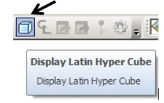
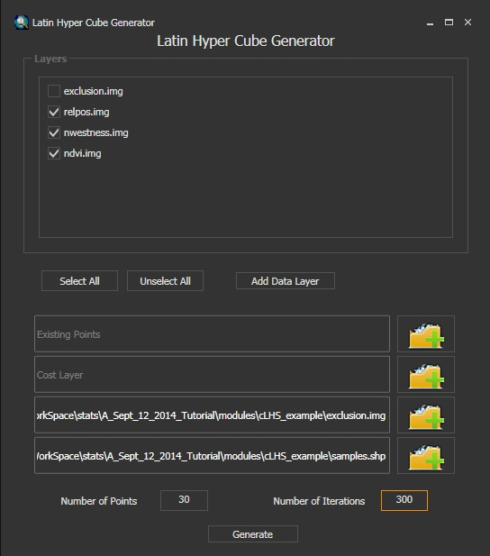
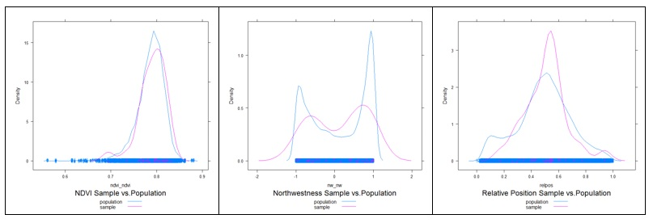
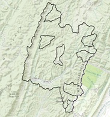
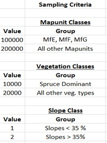
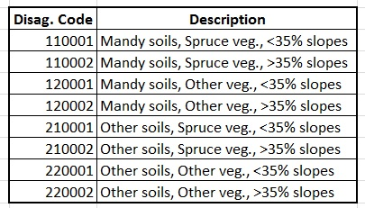
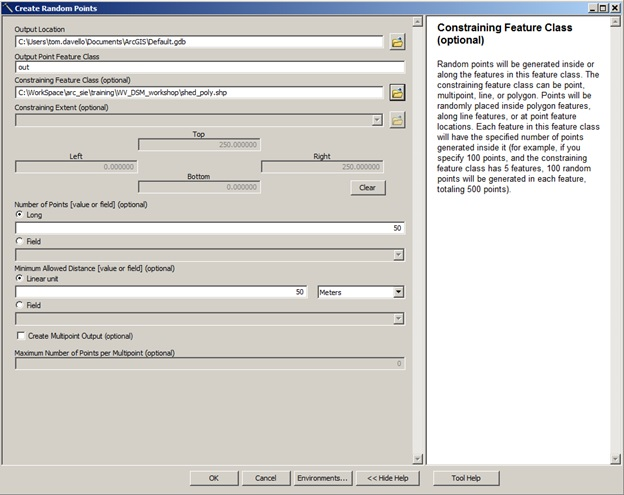
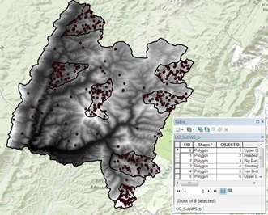
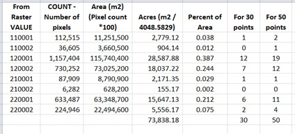

# Sampling {#sampling}


  


## Introduction   

Sampling is a fundamental part of statistics. Samples are collected to achieve an understanding of a population because it is typically not feasible to observe all members of the population. The goal is to collect samples that provide an accurate representation of the population. Constraints on time and money dictate that the sampling effort must be efficient. More samples are needed to characterize the nature of highly variable populations than less variable populations.  

**Define your purpose:** What are you investigating? Examples include soil properties, soil classes, and plant productivity.   

**How many samples are needed?**  

The question of how many samples are required is complex. As per usual, the answer is 'it depends'. For example, it depends on the type of analysis (e.g. non-spatial vs spatial) and properties of the data (e.g. continuous vs categorical). In all cases it requires an understanding/assumptions of the underlying population. If a scientist can estimate the several population variables, formulas exist to estimate the required number of samples.  The following are a list of methods for estimating sample size:

1. Standard error
2. Confidence interval
3. Power analysis (hypothesis testing)
4. Distance/time
5. Prediction error
6. Rules of thumb
7. NSSH 627.8


The first 3 methods use formulas for their corresponding statistics to solve for the sample size, each results in progressively higher sample size requirements. The `PracTools` R package [@valliant2022] offers several functions for the 1st and 2nd methods. The `pwr` [@champely2020] and `WebPower` [@zhang2021] R packages offer several functions for the 3rd method, based on a variety of statistical models. @gelman2020 provides a nice graphical illustration of the variables involved with these methods.  

```{r ci, echo=FALSE}
library(ggplot2)

set.seed(42)
df <- rbind(
  data.frame(n = 10,  mu = 16, clay = rnorm(10,  mean = 16, sd = 2)),
  data.frame(n = 50,  mu = 16, clay = rnorm(50,  mean = 16, sd = 2)),
  data.frame(n = 100, mu = 16, clay = rnorm(100, mean = 16, sd = 2)),
  data.frame(n = 10,  mu = 19, clay = rnorm(10,  mean = 19, sd = 2)),
  data.frame(n = 50,  mu = 19, clay = rnorm(50,  mean = 19, sd = 2)),
  data.frame(n = 100, mu = 19, clay = rnorm(100, mean = 19, sd = 2))
)
df$n  <- factor(paste("n =", df$n),  levels = c("n = 10", "n = 50", "n = 100"))
df$mu <- factor(as.character(df$mu), levels = c("16", "19")) 

df2 <- {
  split(df, list(df$mu, df$n)) ->.;
  lapply(., function(x) {
    if (x$mu[1] == "16") {p = 0.975
    } else p = 0.8
    y = cbind(x[1, 1:2], data.frame(density(x$clay)[c("x", "y")]))
    if (x$mu[1] == "16") {
      y$ci = (y$x > mean(x$clay) + -qt(p, length(x$clay) - 1) * sd(x$clay)) & (y$x < mean(x$clay) + qt(p, length(x$clay) - 1) * sd(x$clay))
    } else y$ci = y$x > mean(x$clay) + -qt(p, length(x$clay) - 1) * sd(x$clay)
    return(y)
    # x[1:3]
  }) ->.;
  do.call("rbind", .) ->.;
}

ggplot(df2, aes(x = x, y = y, fill = mu)) +
  # geom_density() +
  geom_vline(xintercept = c(16, 19)) +
  geom_vline(xintercept = 18, linetype = "dashed") +
  geom_line() +
  geom_area(data = df2, mapping = aes(x = ifelse(ci, x, NA)), alpha = 0.3) +
  facet_wrap(~ n, ncol = 1) +
  ylab("probability") + xlab("clay (%)") +
  ggtitle("Comparison of 2 groups with similar clay contents")
```


### DSM classes

A variation of the 2nd method is described by @congalton2019 for use with categorical data, which is applicable to digital soil mapping.


```{r dsm size, eval=TRUE}

nMultinomial <- function(k = NULL, p = 0.5, error = 0.1, alpha = 0.05) {
  # k     = number of classes
  # p     = proportion of the largest class
  # error = margin of error
  # alpha = confidence level probability
  ceiling(qchisq(1 - alpha / k, 1) * p * (1 - p) / error^2)
}
nMultinomial(k = c(10, 20, 30))
nMultinomial(k = 10, error = c(0.05, 0.1, 0.2))
nMultinomial(k = 10, alpha = c(0.05, 0.1, 0.2))
```

<!-- Because you are typically interested in using field point data to derive inferences, you need enough samples to be confident that they approximate the target population. In the case of calibrating a laboratory device, you might only need two measurements, each at opposite ends of the measurement scale. This illustrates the point that sample size is closely related to the inherent variability in the data. The number of samples required increases with increasing variability. Also, the more samples you have, the greater the confidence level you can achieve. For example, sampling at an 85 percent confidence level is less intensive than sampling at a 95 percent confidence level. -->

<!-- If you have prior knowledge about the soil attribute being sampled, you can use a t-test to estimate the number (n) of samples needed to detect a significant difference. You can use either the `power.t.test()` or `power.prop.tes()` functions. See the following example of differences in clay content. -->

<!-- ```{r, eval=TRUE} -->
<!-- # Clay example. Test to see the number of samples necessary to detect a 3 percent difference in clay between two horizons. -->
<!-- power.t.test(power = 0.95, sd = 2, delta = 16 - 19) # delta = the difference between the two means -->
<!-- power.t.test(power = 0.95, sd = 3, delta = 16 - 19) -->
<!-- ``` -->

<!-- ```{r, echo=FALSE,, eval=TRUE} -->
<!-- # Generate a graphical comparison of a fictitious clay example with 2 standard deviations -->
<!-- x1 <- seq(12, 20, 0.1) -->
<!-- y1 <- dnorm(x1, mean = 16, sd = 2) -->

<!-- x2 <- seq(15, 23, 0.1) -->
<!-- y2 <- dnorm(x2, mean = 19, sd = 2) -->

<!-- summary(c(x1, x2)) -->

<!-- plot(x1, y1, type = "l", xlim = range(c(x1, x2)),  -->
<!--      main = "Overlapping Populations",  -->
<!--      xlab = "Clay %" -->
<!--      ) -->
<!-- lines(x2, y2) -->
<!-- abline(v = mean(c(x1, x2)), lty = 2) -->
<!-- ``` -->

<!-- From the figure above, you can see how difficult it is to separate two overlapping populations (e.g., horizons). Also, a 1-unit increase in the standard deviation doubles the number of samples required. This simplistic example, although enlightening, is hard to implement in practice and serves only as a theoretical exercise.  -->

### Rules of thumb

Some rules of thumb for regression models are as follows:

- Use \> 10 observations (n) per predictor (m) (@kutner2005).
- Use \> 20 n per m and n > 104 + m to test regression coefficients [@rossiter2017; @franklin2009].
- Never use n < 5*m [@rossiter2017].

<!-- **Soil Survey Applications:** -->

<!-- 1. Capture range of soil-forming factors -->
<!-- 2. Determine map unit composition -->


### NSSH 627.8

Documentation requirement for the following data elements are specified in the section [627.8](https://directives.sc.egov.usda.gov/45136.wba) of the National Soil Survey Handbook (NSSH).

```{r nssh, eval=TRUE}
# NSSH 627.8 Documentation

# soil series
data.frame(
  level = "soil series", 
  n     = c(5, 10),
  acres = c(2000, 20000)
  )


# components
data.frame(
  level = "components",
  n     = 1,
  acres = 3000
  )

# map units
data.frame(
  level = "map unit",
  n     = cumsum(c(30, rep(10, 3))),
  acres = c(2000, seq(from = 4000, by = 4000, length.out = 3))
  )

```


## Sampling Strategies

```{r, echo=FALSE}
theme_update(axis.ticks = element_blank(), axis.text = element_blank())
```
 
```{r grid, fig.width=4, fig.height=4, eval=TRUE}

library(sf)
library(ggplot2)

# set the seed for the random number generator
set.seed(4)

# Create a sixteen square polygon
bb <- st_make_grid(st_bbox(c(xmin = 0, xmax = 6, ymin = 0, ymax = 6)), n = 6)
grd <- st_as_sf(bb)
grd$ID <- 1:length(bb)

```


### Simple Random 

In simple random sampling, all samples within the region have an equal chance of being selected. A simple random selection of points can be made using either the `st_sample()` function within the sf R package or the Create Random Points tool in ArcGIS.

**Advantages**

 - Simple
 - Unbiased (equal probability of inclusion)
 - Requires little prior knowledge of the population
 - Howell et al. (2004) - produced a “much more sensitive, more accurate, and greater range of estimated values” than the models from the subjective samples
   
       
**Disadvantages**

 - Inefficient (requires large numbers)
 - Lower accuracy
 - Higher cost
 - Samples may not be representative of the feature attribute(s)
 - Uneven spatial distribution (e.g. clustered)

```{r simple, fig.width=4, fig.height=4, eval=TRUE}
# Generate simple random sample
test <- st_sample(grd, size = 16, type = "random")

ggplot() + 
  geom_sf(data = grd) + 
  geom_sf(data = test) + 
  ggtitle("Simple")
```


### Systematic

In systematic sampling, a sample is taken according to a regularized pattern. This approach ensures even spatial coverage. Patterns may be rectilinear, triangular, or hexagonal. This sampling strategy can be inaccurate if the variation in the population doesn't coincide with the regular pattern (e.g., if the population exhibits periodicity).

**Advantages**

 - Simple
 - Precise estimates
 - Even spatial coverage
 - Greater efficiency


**Disadvantages**

 - Biased estimates (particularly sampling variance)
 - May miss individuals that don’t coincide with the sampling interval
 - If so, the density needs to be increased
 - Limited utility for areas larger than a single field
 - Grid may not optimally fit irregular shapes


```{r systematic, fig.width=4, fig.height=4, eval=TRUE}
# Generate systematic random sample
test <- st_sample(grd, size = 16, type = "regular")

ggplot() + 
  geom_sf(data = grd) + 
  geom_sf(data = test) + 
  ggtitle("Systematic")

```


### Stratified Random

In stratified random sampling, the sampling region is spatially subset into different strata, and random sampling is applied to each strata. If prior information is available about the study area, it can be used to develop the strata. Strata may be sampled equally or in proportion to area; however, if the target of interest is rare in the population, it may be preferable to sample the strata equally @franklin2009].

**Advantages**

 - More efficient than simple-random
 - Higher accuracy
 - Lower cost
 - Sampling can be sized relative to proportion or variance
 

**Disadvantages**

 - Require pre-existing knowledge of the population (which may be flawed)
 - If sampling is uneven, weights need to be known
 - May need to construct the strata manually


```{r stratified, fig.width=4, fig.height=4, eval=TRUE}
grd2 <- st_cast(grd, "MULTIPOLYGON")
st_crs(grd2) <- 5070

test <- st_sample(grd2, size = 16, type = "random", by_polygon = TRUE)

ggplot() + 
  geom_sf(data = grd2) + 
  geom_sf(data = test) + 
  ggtitle("Stratified")
```

Note that the `spsample()` function only stratifies the points spatially. Other more sophisticated designs can be implemented using the [spsurvey](https://cran.r-project.org/package=spsurvey), [sharpshootR](http://ncss-tech.github.io/sharpshootR/reference/constantDensitySampling.html), or [clhs](https://cran.r-project.org/package=clhs) packages.


### Multistage Stratified Random

In multistage random sampling, the region is separated into different subsets that are randomly selected (i.e., first stage), and then the selected subsets are randomly sampled (i.e., second stage). This is similar to stratified random sampling, except that with stratified random sampling each strata is sampled.

**Advantages**

 - Most efficient
 - Lower cost
 - Sampling can be sized relative to proportion or variance
  

**Disadvantages**

 - Less precise
 - Uneven spatial distribution (e.g. clustered)
 - Require pre-existing knowledge of the population (which may be flawed)
 - If sampling is uneven, weights need to be known
 - May need to construct the strata manually


```{r two_stage, fig.width=4, fig.height=4, eval=TRUE}
# Select 8 samples from each square
idx <- sample(1:nrow(grd), size = 2, replace = FALSE)
grd_sub <- grd[idx, ]
test <- sapply(1:2, function(i) {
  st_coordinates(st_sample(grd_sub[i, ], size = 8, type = "random"))
})
test <- st_as_sf(as.data.frame(test), coords = 1:2)

ggplot() + 
  geom_sf(data = grd) + 
  geom_sf(data = test) + 
  ggtitle("Two-stage")

```


### Spatial Coverage Sampling (e.g. k-means clustering)

```{r spcosa, fig.width=4, fig.height=4, eval=TRUE}
# spcosa ----
library(spcosa)

grd2 <- st_crs(grd, NA)
grd_sp <- as(grd, "Spatial")

strata <- stratify(grd_sp, nStrata = 16) 

pts    <- spsample(strata)
plot(strata, pts) + 
  ggtitle("Spatial Coverage")

```

<!-- ### Cluster -->

<!-- In cluster sampling, a cluster or group of points is selected at one or more sites. The transect is an example of this strategy, although other shapes are possible (e.g., square, triangle, or cross shapes). It is common to orient the transect in the direction of greatest variability. -->

<!-- **Advantages** -->

<!--  - Greater efficiency -->
<!--  - Lower cost    -->

<!-- **Disadvantages** -->

<!--  - Lower precision   -->

<!-- ```{r clustered, fig.width=4, fig.height=4, eval=TRUE}  -->
<!-- plot(polys, main = "Clustered (n = 3) random sample") -->

<!-- # Generate cluster random sample -->
<!-- test <- spsample(polys, nclusters = 3, type = "clustered") -->
<!-- points(test, pch = 19) -->
<!-- ``` -->


### Covariate space coverage sampling (e.g. k-means clustering)

Covariate space coverage sampling is a stratified sampling technique to obtain representative samples from feature (attribute) space [@brus2022]. 

**Advantages**

 - Maximumly stratifies the predictors
 - Automated sample selection
 - Can incorporates cost constraints
 - Ideal for developing map unit concepts (puts points in central landscape positions)
 - Can incorporate legacy points
 - Easily scales to multiple GIS layers

**Disadvantages**

 - Not ideal for map validation (non – probability sample)
 - Inefficient with large GIS layers

```{r, eval=TRUE}
library(sf)
library(terra)
source("https://raw.githubusercontent.com/ncss-tech/stats_for_soil_survey/master/exercises/fcsc.R")

# import volcano DEM, details at http://geomorphometry.org/content/volcano-maungawhau
data("volcano")
volcano_r <- rast(
  volcano[87:1, 61:1],
  crs = crs("+init=epsg:27200"),
  extent = c(
    xmin = 2667405,
    xmax = 2667405 + 61 * 10,
    ymin = 6478705,
    ymax = 6478705 + 87 * 10
  )
)
names(volcano_r) <- "elev"

# calculate slope from the DEM
slope_r <- terrain(volcano_r, v = "slope", unit = "degrees")

# Stack Elevation and Slope
rs  <- c(volcano_r, slope_r)

# Covariate Space Coverage Sampling
source("https://raw.githubusercontent.com/ncss-tech/stats_for_soil_survey/master/exercises/fcsc.R")
fs <- cscs(rs, vars = c("elev", "slope"), n = 20)

fs_sf <- st_as_sf(fs, coords = c("x", "y"), crs = crs(rs))

# Plot CSCS Samples
plot(volcano_r, axes=FALSE)
points(fs_sf)
```

### Conditioned Latin Hypercube (cLHS)

Conditioned Latin hypercube sampling is a stratified random sampling technique to obtain representative samples from feature (attribute) space [@minasny2006]. 

**Advantages**

 - Maximumly stratifies the predictors
 - Automated sample selection
 - Incorporates cost constraints
 - Can incorporate legacy points
 - Easily scales to multiple GIS layers

**Disadvantages**

 - Not ideal for map validation (non – probability sample)
 - Not ideal for developing map unit concepts (puts points in weird landscape positions)
 - Difficult to find alternatives for non-accessible points
 - Inefficient with large GIS layers

For example, assume you have prior knowledge of a study area and have the time and resources to collect 120 points. You also know the following variables (strata), which are represented as coregistered raster datasets, to be of importance to the soil property or class being investigated:  

 - Normalized Difference Vegetation Index (NDVI),  
 - Topographic Wetness Index (a.k.a. Wetness Index, compound topographic index),  
 - Solar insolation (potential incoming solar radiation), and
 - Relative elevation (a.k.a. relative position, normalized slope height).
 
The cLHS procedure iteratively selects samples from the strata variables such that they replicate the range of values from each stratum. Without a technique such as cLHS, obtaining a sample that is representative of the feature space becomes increasingly difficult as the number of variables (strata) increases.

To perform cLHS using R, you can use the clhs package [@roudier2011].

```{r clhs, fig.width=4, fig.height=4, eval=TRUE}
rs2 <- raster::stack(rs)

library(clhs)

# generate cLHS design
cs <- clhs(rs2, size = 20, progress = FALSE, simple = FALSE)

# Plot cLHS Samples
par(mar=c(1,1,1,4))
plot(volcano_r, axes=FALSE)
points(cs$sampled_data)

# Summary of clhs object
summary(cs$sampled_data)$data

# Summary of raster objects
cbind(summary(volcano_r), summary(slope_r)[1:6])
```

Although the above example works well on the small `volcano` dataset, the clhs package is inefficient if you are working with large rasters with many cells. To overcome this limitation, you can first take a large random sample and then subsample it using cLHS.

```{r clhs_sub, eval=FALSE}
sub_s <- spatSample(rs, size = 200, as.points = TRUE) |>
  st_as_sf() # random sample function from the raster package

s <- clhs(sub_s, size = 20, progress = FALSE, simple = FALSE)
```

## Evaluating a Sampling Strategy

To gauge the representativeness of a sampling strategy, you can compare the results it produces to the results for other variables you think might coincide with the soil properties or classes of interest [@hengl2009]. Examples include slope gradient, slope aspect, and vegetative cover. These other variables may be used to stratify the sampling design or to assess the representativeness of our existing samples (e.g., NASIS pedons).

The simple example below demonstrates how to compare several sampling strategies by evaluating how well they replicate the distribution of elevation. 

```{r seval, eval=TRUE}
# set seed
set.seed(1234)

# create a polygon from the spatial extent of the volcano dataset
test <- st_make_grid(ext(volcano_r), n = 1)

# take a large random sample
sr400 <- spatSample(rs, size = 1000, method = "random", as.points = TRUE)

# take a small random sample
sr <- spatSample(rs, size = 20, method = "random", as.points = TRUE)

# take a small systematic random sample
sys <- spatSample(rs, size = 20, method = "regular", as.points = TRUE)

# take a cLHS sample
cs <- clhs(rs2, size = 20, progress = FALSE, simple = FALSE)

# take a CSCS sample
fs <- cscs(rs, vars = c("elev", "slope"), n = 20)

# Combind and Extract Samples
s <- rbind(
  data.frame(method = "Simple Random 400", as.data.frame(sr400)),
  data.frame(method = "Simple Random",     as.data.frame(sr)),
  data.frame(method = "Systematic Random", as.data.frame(sys)),
  data.frame(method = "cLHS",              slot(cs$sampled_data, 'data')),
  data.frame(method = "CSCS",              fs[c("elev", "slope")])
)

# Summarize the sample values
aggregate(slope ~ method, data = s, function(x) round(summary(x)))

# Plot overlapping density plots to compare the distributions between the large and small samples
ggplot(s, aes(x = slope, col = method)) + 
        geom_density(cex = 2)
```

```{r fig.width=8.25, fig.height=3.5, eval=TRUE}
# plot the spatial locations            
par(mfrow = c(2, 2), mar = c(1,2,4,5))
plot(volcano_r, main = "Simple random", cex.main = 2, axes=FALSE)
points(sr, pch = 3, cex = 1.2)

plot(volcano_r, main = "Systematic random", cex.main = 2, axes=FALSE)
points(sys, pch = 3, cex = 1.2)

plot(volcano_r, main = "cLHS", cex.main = 2, axes=FALSE)
points(cs$sampled_data, pch = 3, cex = 1.2)

plot(volcano_r, main = "CSCS", cex.main = 2, axes=FALSE)
points(fs_sf, pch = 3, cex = 1.2)
```

The overlapping density plots above illustrate the differences between large and small sets of samples using several sampling designs. 

The cLHS approach best duplicates the distribution of elevation (because elevation is explicitly used in the stratification process). The contrast is less severe in the summary metrics, but again cLHS more closely resembles the larger sample. Other comparisons are possible using the approaches in the following chapters.

### Exercise: Design a Sampling Strategy

1. Load the "tahoe\_lidar\_bareearth.tif" dataset in the `gdalUtilities` package (`tahoe <- terra::rast(system.file("extdata", "tahoe_lidar_bareearth.tif", package = "gdalUtilities"))`) or use your own data set.
2. Compare two or more sampling approaches and evaluate how representative they are.
3. Show your work and submit the results to your mentor.

<!-- ## Other Tools for Selecting Random Features   -->

<!-- An ArcGIS tool for selecting random features is available from the [Job Aids page](https://www.nrcs.usda.gov/conservation-basics/natural-resource-concerns/soil/job-aids). This tool randomly selects the specified number of features from a dataset or set of selected features in ArcGIS. It is an ideal tool for the first stage of a two-stage random sample.   -->

<!-- ### cLHS Using TEUI   -->

<!-- The TEUI toolkit includes a tool for generating cLHS samples on large raster datasets. The tool is based on the clhs R package [@roudier2011]. -->

<!--  - Relative Elevation (a.k.a. relative position)   -->
<!--  - Northwestness   -->
<!--  - Normalized Difference Vegetation Difference (a.k.a. NDVI)   -->

<!--  -->

<!-- Open ArcGIS. Add the TEUI Toolkit Toolbar by clicking the **Customize** tab, pointing to **Toolbars**, and checking **TEUI**.   -->

<!--    -->

<!-- The TEUI Toolbar looks like the following.   -->

<!--    -->

<!-- Click the **Cube icon** to open the Latin Hyper Cube Generator Tool. -->

<!--    -->

<!--    -->

<!-- The Tool requires that all raster data be in Imagine format (i.e., have the "img" extension) and share a common projection and resolution.  -->

<!-- The tool adds all raster layers in the Table of Contents to the Layers section. The layers to be used are checked.   -->

<!-- An exclusion layer is used in this example. An exclusion layer is a binary raster with values of 0 and 1. Using an exclusion layer confines the selection of points to those areas with a raster value of 1.   -->

<!-- The output file is a shapefile named "samples.shp." The Number of Points is 30. The Number of Iterations is increased from the default of 100 to 300. Increasing the number of iterations increases the processing time, but it also increases the likelihood that the samples selected are representative of the selected strata.   -->

<!-- Click **Generate** and let the routine process. This can take from several minutes to several hours, depending on how large the area is in terms of columns and rows and how many layers are used.   -->

<!-- The resulting output shows 30 points confined to the watershed of interest.   -->

<!--    -->

<!-- Comparing the frequency distribution of the samples to the population shows a reasonable representation, especially considering the small sample size.   -->

<!--   -->

<!-- ### Two-Stage Stratified Random Sample Design Using ArcGIS -->

<!-- The following example examines a sampling design executed by Wendy Noll, USDA-NRCS, Morgantown, WV and used by NRCS and USFS investigators in the Monongahela National Forest. They were interested in quantifying the depth of organic surface horizons in soils that correlated to the Mandy soil series and formed under red spruce canopy on backslopes in the Upper Greenbrier Watershed (HUC 8 -05050003). This project ultimately led to the development of new soil series and the update of thousands of acres of forest soils in West Virginia.  -->

<!-- Stage 1: Sub-watersheds in the study area were randomly selected.  -->

<!--    -->

<!-- Strata: Sampling was based on three stratum.   -->

<!--  - Mandy soil map units (MfE, MfF, MfG, and other) -->
<!--  - Red spruce canopy cover (>30% canopy, other) -->
<!--  - Slope (<= 35%, >= 35%)   -->

<!-- Data layers: Input layers included coregistered raster data of each stratum, reclassed as follows.   -->

<!--    -->

<!-- The Raster Calculator was used to add data layers together.   -->

<!--    -->

<!-- The resulting raster file had the following combinations.   -->

<!--    -->

<!-- The following guide was used to verify the selection of sample numbers allocated according to the proportionate extent of the strata.   -->

<!--    -->

<!-- The Create Random Points tool was used within each sub-watershed. The tool is in **Data Management Tools** > **Feature Class toolbox**.   -->

<!--    -->

<!-- The sub-watershed layer was specified as the Constraining Feature Class. The number of points selected was 50.   -->

<!--    -->

<!-- The resulting point file had 50 points per polygon.   -->

<!--    -->

<!-- The following image was used to check if the sample points adequately represented the proportionate extent of the data made by summarizing the GRIDCODE of the points.   -->

<!--    -->

<!-- The results compared well to the extent of the population.   -->

<!--  -->

<!-- Vaughan, R., and K. Megown. 2015. The Terrestrial Ecological Unit Inventory (TEUI) Geospatial Toolkit: User guide v5.2. RSAC-10117-MAN1. Salt Lake City, UT: U.S. Department of Agriculture, Forest Service, Remote Sensing Applications Center. [http://www.fs.fed.us/eng/rsac/programs/teui/about.html](http://www.fs.fed.us/eng/rsac/programs/teui/about.html). -->


## Additional Reading (Sampling)

Brungard, C., & Johanson, J. (2015). The gate's locked! I can't get to the exact sampling spot ... can I sample nearby? Pedometron(37), 8-9. [http://www.pedometrics.org/Pedometron/Pedometron37.pdf](http://www.pedometrics.org/Pedometron/Pedometron37.pdf)

Brus, D.J. and J.J. de Gruijter. "Random sampling or geostatistical modelling? Choosing between design-based and model-based sampling strategies for soil (with discussion)." Geoderma. Vol. 80. 1. Elsevier, 1997. 1-44. [https://www.sciencedirect.com/science/article/pii/S0016706197000724](https://www.sciencedirect.com/science/article/pii/S0016706197000724)

Brus, Dick J. Spatial Sampling with R. First edition, CRC Press, 2022, [https://github.com/DickBrus/SpatialSamplingwithR](https://github.com/DickBrus/SpatialSamplingwithR).

de Gruijter, J., D.J. Brus, M.F.P. Bierkens, and M. Knotters. 2006. Sampling for natural resource monitoring: Springer. [http://www.springer.com/us/book/9783540224860](http://www.springer.com/us/book/9783540224860).

Viscarra Rossel, R.A., et al. "Baseline estimates of soil organic carbon by proximal sensing: Comparing design-based, model-assisted and model-based inference." Geoderma 265 (2016): 152-163. [https://www.sciencedirect.com/science/article/pii/S0016706115301312](https://www.sciencedirect.com/science/article/pii/S0016706115301312)
