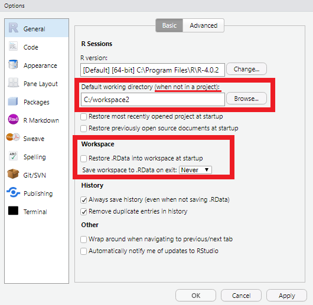
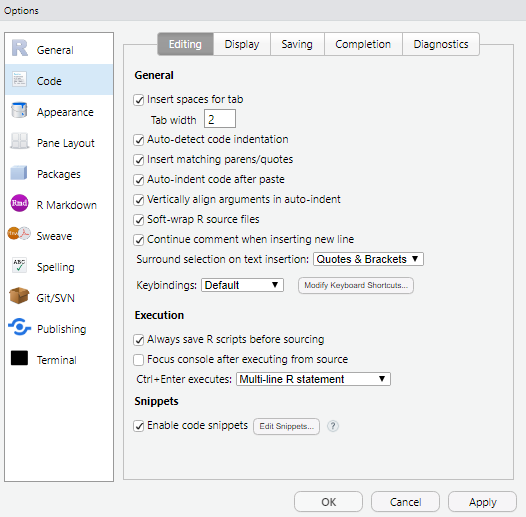

```{r include=FALSE}
# automatically create a bib database for R packages
knitr::write_bib(c(
  .packages(), 'bookdown', 'knitr', 'rmarkdown'
), 'packages.bib')
```

```{css, echo=FALSE}
.codeBlocks {
  font-size: 90%;
}
```

```{r include=FALSE}
# This sets up the whole book defaults for chunk options
#  - hide messages and warnings
#  - eval is FALSE by default 
#   - if you write code or change code, you have the responsibility 
#     to turn evaluation on, if needed, and verify it does not break the book
knitr::opts_chunk$set(
  message = FALSE,
  warning = FALSE,
  eval = FALSE,
  class.source = 'codeBlocks',
  fig.retina = 3,
  fig.align = 'center',
  dev = 'png'
)
```

# Pre-course Assignment {.unnumbered}


## Create Workspace

Make a local folder `C:\workspace2` to use as a working directory for this course. Use all lower case letters please.

## Configure RStudio

First, before doing any setup or installing packages, make sure you have the latest available version of RStudio and R installed from the Software Center.

Open **RStudio**, and edit the "Global Options" (Main menu: **Tools → Global Options**).

## Essentials

These options are important for reproducible and efficient use of the **RStudio** environment:

1.  **Change** the default working directory to `C:\workspace2` (**R** General Tab)

2.  <font style="color:red">**Uncheck**</font> "Restore .Rdata into workspace at startup" (**R** General Tab) <font style="color:red">**VERY IMPORTANT**</font>



**RStudio** automatically detects the **R** installations on your computer, and may prompt you to select one. Select the most recent version available.

## Personalization



-   Optional: Check "Soft-wrap **R** source files" (Code/Editing Tab)

-   Optional: Show help tooltips, control auto-completion and diagnostics (Code/Completion and Diagnostics Tabs)

-   Optional: Update code font size, colors and theme (Appearance)

-   Optional: Use **RStudio** Projects (top-right corner) to manage working directories

## Install Required Packages

Packages can be installed by name from the Comprehensive **R** Archive Network (CRAN) using the base **R** function `install.packages()`. 

There are a lot of packages out there.

The first time you install packages, **R** will ask you if you want to create a local package library. You need to do this we usually do not have administrator priveliges on government furnished equipment. 

The default location for R package library on Windows is: `C:\Users\<User.Name>\AppData\Local\R\win-library\<X.X>` where `<User.Name>` is the your Windows user name and `<X.X>` is the minor version of R packages are being installed for. There is no need to change this default. But you want to be sure your package library is not on any sort of network share or Cloud-synced folder (OneDrive, Box, etc.) as this, at best, slows things down, and at worst causes difficult to debug problems with accessing files.

For a first example of installing a package, we will get the `remotes` package from CRAN. Copy all of the code from the box below and paste into the **R** console window. Paste after the command prompt (`>`) and press **enter**. 

```{r, eval=FALSE}
install.packages("remotes")
```

On particularly slow network connections, i.e. over VPN or USDA network in general, it may be necessary to increase the "timeout" option to ensure that downloads have sufficient time to complete. To do that, you can use the `options()` function to set the `timeout` option. Run the following code in the console:

```{r, eval = FALSE}
# increase default timeout from 1 minute to 5 minutes (for current session only)
options(timeout = 300)
```

We will use the [`pak` package](https://pak.r-lib.org/) for easy and efficient package installation for the packages needed for the book ([Part 1](https://ncss-tech.github.io/stats_for_soil_survey/book/index.html) and [Part 2](https://ncss-tech.github.io/stats_for_soil_survey/book2/index.html)) and exercises.

```{r, eval = FALSE}
if (!requireNamespace("pak")) {
  install.packages("pak")
}

library(pak)
  
packages <- list(
  
  # Soil-specific packages
  soil_packages = c(
    "aqp",           # Algorithms for Quantitative Pedology
    "soilDB",        # Soil Database Access
    "sharpshootR",   # Soil mapping and analysis tools
    "soiltexture",   # Soil texture analysis and texture triangle plots
    "SoilTaxonomy"   # Soil Taxonomy classification system utilities
  ),
  
  # GIS and Spatial Analysis Packages
  gis_packages = c(
    # Spatial data handling
    "sf",            # Simple Features (vector geometry)
    "terra",         # Spatial (raster and vector) data handling
    "gdalUtilities", # GDAL utilities
    "rmapshaper",    # Topological polygon simplification
    
    # Spatial Analysis Tools
    "exactextractr", # Zonal statistics
    "RANN"           # Nearest neighbor search
  ),
  
  # Data Management and Manipulation Packages
  data_management_packages = c(
    # Data manipulation
    "dplyr",         # Data manipulation
    "tidyr",         # Data tidying
    
    # Package development
    "devtools",      # Package development
    "roxygen2",      # Documentation generation
    
    # Utility packages
    "Hmisc",         # Miscellaneous high-level functions
    "circular",      # Circular statistics
    "DT",            # Interactive data tables
    "remotes",       # Package installation
    "DescTools",     # Descriptive statistics
    "dendextend"     # Dendrogram extensions
  ),
  
  # Database Packages
  database_packages = c(
    "DBI",           # Database interface
    "odbc",          # ODBC database connection
    "RSQLite"        # SQLite database
  ),
  
  # Visualization and Graphics Packages
  graphics_packages = c(
    # Plotting libraries
    "ggplot2",       # Modern graphic visualization
    "lattice",       # Legacy graphical visualization
    "latticeExtra",  # Extended lattice graphics
    "tactile",       # Additional lattice graph themes
    
    # Mapping packages
    "spData",        # Spatial datasets
    "tmap",          # Thematic maps
    "mapview",       # Interactive maps (quick visualization)
    "leaflet",       # Interactive maps (high-level interface to Leaflet.js)
    "ggmap",         # Base maps from online services with ggplot2
    "ggspatial",     # Spatial annotations for ggplot2 and sf workflows
    
    # Additional visualization tools
    "kableExtra",    # Table formatting
    "corrplot",      # Correlation plots
    "rpart.plot",    # Decision tree plotting
    "visreg",        # Visualization of regression models
    "diagram",       # Flow diagrams
    "GGally",        # Extended ggplot2 functionality
    "igraph"         # Network visualization
  ),
  
  # Modeling Packages
  modeling_packages = c(
    # Statistical modeling
    "car",           # Companion to Applied Regression
    "rms",           # Regression modeling strategies
    
    # Machine Learning
    "randomForest",  # Random forest algorithm
    "ranger",        # Fast random forest implementation
    "party",         # Conditional inference trees
    "ROCR",          # ROC analysis
    "survey",        # Complex survey analysis
    "caret",         # Machine learning workflow
    
    # Ecological and Multivariate Analysis
    "vegan",         # Ecological community analysis
    "ape",           # Phylogenetic analysis
    "shape",         # Shape analysis
    "modEvA",        # Model evaluation
    "gower",         # Gower distance
    "MBESS",         # Mediation and moderation
    "yardstick"      # Model performance metrics
  ),
  
  # Sampling Packages
  sampling_packages = c(
    "clhs",          # Conditioned Latin Hypercube Sampling
    "spcosa",        # Spatial coverage sampling
    "sgsR"           # Spatial grid sampling
  ),
  
  # Other utilities
  utility_packages = c(
    # Report Generation
    "knitr",         # Dynamic report generation in R using Literate Programming
    "rmarkdown",     # Render R Markdown (.Rmd) documents
    
    # Package management
    "remotes",       # Installation of packages from GitHub
    "pak"            # Easy package installation and dependency management
  )
)

# Install packages
pak::pkg_install(unlist(packages))
```

```{r, include=FALSE, eval=FALSE}
# helper for updating stats_for_soil_survey package DESCRIPTION file
cat(sort(unlist(packages)), sep = ",\n\t")
```

`pak` will resolve the dependencies of the above packages, then you will need to enter `Y` (yes) in the console to proceed with installation.

The `pkg_install()` function will let you know if anything fails to install or other errors occur.

In the event that `pkg_install()` fails with an error unzipping files or similar, you can simply use base R `install.packages(unlist(packages))` instead.

## Dealing with Errors in R

### Best Practices

- Always check the console output for warnings and errors before proceeding.
- When working with unfamiliar code, run commands individually and carefully inspect the output.
- Avoid running entire files at once, as this can make error identification difficult.

### Common Error Scenarios

#### Incomplete Command Indicator

If you see a `+` instead of the standard `>` command prompt, R is waiting for you to complete an expression. This typically means you're missing (or have mismatched) quotes (`"` or `'`), braces (`{`), brackets (`[`), or parentheses (`(`).

#### Troubleshooting Tips

- Scroll through console output to identify error details
- Copy and paste error messages into web searches
- Use keyboard shortcuts like **Ctrl+Enter** to run code sections
- When possible, run code line-by-line to minimize input errors

#### `install.packages()`: `‘SOMEPACKAGE’ is not available (for R version X.Y.Z)`

This means *either*:

1.  A package named 'SOMEPACKAGE' exists but it is not available for your version of **R**

2.  CRAN does not have a package with that name

You can try again, but first check for spelling and case-sensitivity. When in doubt search the package name on Google or CRAN to make sure you have it right.

Note that not all **R** packages are available on CRAN: there are many other ways that you can deliver packages (including GitHub described below).

## Packages from Other Repositories.

Some R packages rely on compiled code. Windows users are limited to installing "binary" versions of such packages from CRAN unless they have Rtools installed. The Rtools software is available from the Software Center, and it is specific to the version of R you have.

One way to get the latest binary builds of R packages that use compiled code is by using <https://r-universe.dev>. This website provides custom repositories that can be used in addition to the defaults in `install.packages()`

For example, you can install  "rspatial" package `terra` from r-universe.dev by setting an alternate package repository with the `repos=` argument.

```{r, eval=FALSE}
install.packages('terra', repos='https://rspatial.r-universe.dev')
```

To install the latest version of ncss-tech (packages contributed by USDA-NRCS SPSD staff and NCSS cooperators) off GitHub we will often use the `remotes` package.

```{r, eval=FALSE}
remotes::install_github("ncss-tech/aqp", dependencies=FALSE, upgrade=FALSE, build=FALSE)
remotes::install_github("ncss-tech/soilDB", dependencies=FALSE, upgrade=FALSE, build=FALSE)
remotes::install_github("ncss-tech/sharpshootR", dependencies=FALSE, upgrade=FALSE, build=FALSE)
remotes::install_github("ncss-tech/soilReports", dependencies=FALSE, upgrade=FALSE, build=FALSE)
```

Generally, the CRAN versions (installed above) are the "stable" releases whereas the GitHub repositories are development versions with new features and bug fixes.

You can also get builds of these development packages using `install.packages(..., repos="https://ncss-tech.r-universe.dev")`. These may not be updated immediately after changes are pushed to GitHub, but should be available within a day of any updates.

## Install NASIS 

If you do not have NASIS installed you will not be able to complete the next steps. 

For USDA staff NASIS can be installed from the Software Center. Search `"NASIS"` and you should find two applications. First, you must install "Microsoft SQL Server Express 2016 for NASIS Client", then restart your computer, and then install the "NASIS Client". 

If you do not have access to the Software Center, or cannot find NASIS, it can be installed by OCIO staff by submitting an IT support ticket for "Install / Uninstall Software". 

If you are not a USDA employee you can find additional information on NASIS installation here: https://new.cloudvault.usda.gov/index.php/s/xFTJabHiT45WDom

More information on installing and initializing your NASIS client for the first time can be found in the training materials for NASIS 1010 (Basic NASIS) course: https://ncss-tech.github.io/nasis_training/content/pre-course.html

## Connect Local NASIS

Establish an ODBC connection to NASIS by following the directions at the following hyperlink ([ODBC Connection to NASIS](http://ncss-tech.github.io/AQP/soilDB/setup_local_nasis.html)).

Once you've successfully established the ODBC connection, you will "prove" it by loading your NASIS selected set with the site and pedon tables for any pedons from your local area.

You only need a few pedons for this demo too many (\>20) will make the example profile plot cluttered.

-   Paste the code below in the console (after the `>`) and press **enter**, as you did above.

-   Alternately, you can create a new **R** script (Main menu: **File → New File → R Script**) and paste code into the new tab in the "Source" pane (script editor window). Then,  you can click the **Run** button in the top-right corner of the Script Editor or use **Ctrl+Enter** to run code at the cursor location or any selected code. This will send the code to the console and run it.

Submit the resulting plot to your mentor (from "Plot" pane (bottom-right): **Export → Save as PDF...**)

```{r eval=FALSE}
# load packages into the current session
library(aqp) # provides "SoilProfileCollection" object & more
library(soilDB) # provides database access methods

# get pedons from NASIS selected set
test <- fetchNASIS(from = 'pedons')

# inspect the result
str(test, max.level = 2)

# make a profile plot

# set margins smaller than default
par(mar=c(1,1,1,1))

# make profile plot of selected set, with userpedonid as label
plot(test, label='upedonid')
```

## Proof
Copy the output from the `sessionInfo()` command and submit the results to your mentor. This will help us to verify that all of the required packages have been installed.

```{r, eval=FALSE}
sessionInfo()
```

## Additional Soil Data and R References

### Soil Data Videos

-   [NCSS Partners Seminar: Soils Data 101](https://www.youtube.com/watch?v=KnggyvT8bEg)
-   [Paul Finnell's NASIS webinar](https://youtu.be/VcdowqknChQ)
-   [Stats for Soil Survey Webinar](https://www.youtube.com/watch?v=G5mFt9k37a4)
-   [Soil Data Aggregation using R Webinar](https://www.youtube.com/watch?v=wD9Y0Qpv5Tw)

### R Books and Manuals

-   [R-Intro](https://cran.r-project.org/doc/manuals/r-release/R-intro.pdf)
-   [R for Data Science](https://r4ds.hadley.nz/)
-   [Geocomputation with R](https://r.geocompx.org/)
-   [Spatial Data Science with R and “terra”](http://rspatial.org/)
-   [Geographic Data Science with R book](https://bookdown.org/mcwimberly/gdswr-book/)
-   [Impatient R](https://www.burns-stat.com/documents/tutorials/impatient-r/)
-   [The R Inferno](http://www.burns-stat.com/documents/books/the-r-inferno/)
-   [AQP Website and Tutorials](http://ncss-tech.github.io/AQP/)
