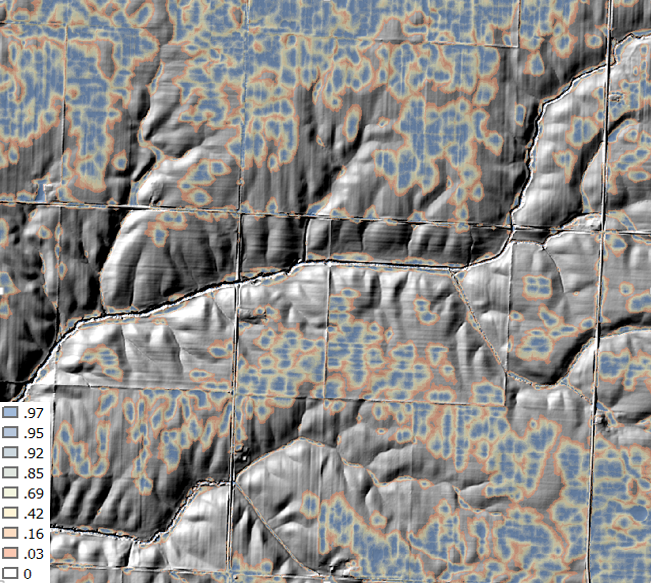

```{r include=FALSE}
# support for bigger downloads on slow connections
options(timeout = 600)
```

# Generalized Linear Models {#glm}


  

## Introduction

Generalized linear models (GLM) as the name implies are a generalization of the linear modeling framework to allow for the modeling of response variables (e.g. soil attributes) with non-normal distributions and heterogeneous variances. Whereas linear models are designed for predicting continuous soil properties such as clay content or soil temperature, GLM can be used to predict the presence/absence of argillic horizons (i.e. logistic regression) or counts of a plant species along a transect (i.e. Poisson regression). These generalizations greatly expand the applicability of the linear modeling framework, while still allowing for a similar fitting procedure and interpretation of the resulting models.

In the past in order to handle non-linearity and heterogeneous variances, transformations have been made to the response variable, such as the log(y). However, such transformations complicate the models interpretation because the results refer to the transformed scale (e.g. log(y))[@lane2002]. These response transformations are not guaranteed to achieve both normality and constant variance simultaneously. GLM approaches transform the response, but also preserve the scale of the response, and provide separate functions to transform the mean response and variance, known as the link and variance functions respectively. So instead of looking like this:

$f(y) = \beta_{0} + \beta_{1}x + \varepsilon$

you get this:

$g(\mu)$ or $\eta = \beta_{0} + \beta_{1}x + \varepsilon$

with $g(\mu)$ or $\eta$ symbolizing the link function. 

Another alteration of the classical linear model is that with GLM the coefficients are estimated iteratively by maximum likelihood estimation instead of ordinary least squares. This results in the GLM minimizing the deviance, instead of the sum of squares. However, for the Gaussian (i.e. normal) distributions the deviance and sum of squares are equivalent.


## Logistic Regression

Logistic regression is a specific type of GLM designed to model data that has a binomial distribution (i.e. presence/absence, yes/no, or proportional data), which in statistical learning parlance is considered a classification problem. For binomial data the logit link transform is generally used. The effect of the logit transform can be seen in the following figure. It creates a sigmoidal curve, which enhances the separation between the two groups. It also has the effect of ensuring that the values range between 0 and 1.


```{r logit-function, echo=FALSE, eval = TRUE, message=FALSE}

library(ggplot2)

p <- sort(c(rbinom(100, 1:100, 1)) / 100)
logp <- log(p / (1 - p))
test <- data.frame(p, logp)[!is.infinite(logp), ]
fit <- lm(p ~ logp, data = test)

ggplot(test, aes(x = logp, y = p)) +
  geom_line() +
  ylab("proportion (p)") + xlab("logit transform (log(p / (1 - p)))")

```

When comparing a simple linear model vs a simple logistic model we can see the effect of the logit transform on the relationship between the response and predictor variable. As before it follows a sigmoidal curve and prevents predictions from exceeding 0 and 1.

```{r logit-example, eval = TRUE, echo=FALSE, fig.width=8, fig.height=4}

data("meuse", package = "sp")
meuse <- meuse[order(meuse$dist.m), ]
meuse$lime <- ifelse(as.numeric(meuse$lime) == 2, 1, 0)

lm_fit  <- lm(lime ~ dist.m, data = meuse)
glm_fit <- glm(lime ~ dist.m, data = meuse, family = binomial())

test <- data.frame(obs = as.numeric(meuse$lime), predictor = meuse$dist.m, lm_fit = lm_fit$fitted.values, glm_fit = glm_fit$fitted.values)

gg_lm <- ggplot(test, aes(x = predictor, y = lm_fit)) +
  geom_line() +
  geom_point(data = meuse, aes(x = dist.m, y = lime)) +
  ylim(0, 1)
gg_glm <- ggplot(test, aes(x = predictor, y = glm_fit)) +
  geom_line() +
  geom_point(data = meuse, aes(x = dist.m, y = lime)) +
  ylim(0, 1)
gg_bp  <- ggplot(test, aes(x = predictor, y = as.character(obs)))  +
  geom_boxplot()
gridExtra::grid.arrange(gg_lm, gg_glm, gg_bp, nrow = 1)

```


## Examples 

![Example 1: Probability of Mollisols [@beaudette2009]](static-figures/mollisol.png)

![Example 2: Probability of Red Clay [@evans2014]](static-figures/redclay.png) 




## Exercise

Now that we've discussed some of the basic background GLM theory we'll move on to a real exercise, and address any additional theory where it relates to specific steps in the modeling process. The examples selected for this chapter come from Joshua Tree National Park (JTNP)(i.e. CA794) in the Mojave desert. The problem tackled here is a familiar one: Where can I expect to find argillic horizons on fan piedmonts? Argillic horizons within the Mojave are typically found on fan remnants, which are a stable landform that is a remnant of the Pleistocene [@peterson1981]. Despite the low relief of most fans, fan remnants are uplands in the sense that they generally don't receive run-on or active deposition.

With this dataset we'll encounter some challenges. To start with, fan piedmont landscapes typically have relatively little relief. Since most of our predictors will be derivatives of elevation, that won't leave us with much to work with. Also, our elevation data comes from the USGS National Elevation dataset (NED), which provides considerably less detail than say LiDAR or IFSAR data [@shi2012]. Lastly our pedon dataset like most in NASIS, hasn't received near as much quality control as have the components. So we'll need to wrangle some of the pedon data before we can analyze it. These are all typical problems encountered in any data analysis and should be good practice. Ideally, it would be more interesting to try and model individual soil series with argillic horizons, but due to some of the challenges previously mentioned it would be difficult with this dataset. However, at the end we'll look at one simple approach to try and separate individual soil series with argillic horizons.

### Load packages

To start, as always we need to load some extra packages. This will become a familiar routine every time you start R. Most of the basic functions we need to develop a logistic regression model are contained in base R, but the following contain some useful spatial and data manipulation functions. Believe it or not we will use all of them and more.

<!-- load libraries for examples, which run before any code is displayed -->
```{r eval = TRUE, echo=FALSE, results='hide', warning=FALSE, message=FALSE}
# load libs for examples
suppressPackageStartupMessages(library(aqp))
suppressPackageStartupMessages(library(raster))
suppressPackageStartupMessages(library(sf))     
suppressPackageStartupMessages(library(mapview))
suppressPackageStartupMessages(library(ggplot2))
suppressPackageStartupMessages(library(dplyr))  
suppressPackageStartupMessages(library(tidyr)) 
suppressPackageStartupMessages(library(rms))   
suppressPackageStartupMessages(library(caret))   

knitr::opts_chunk$set(message = FALSE, warning = FALSE, 
                      eval = FALSE, class.source = "codeBlock", class.output = "outputBlock",
                      fig.retina = 3, fig.align = 'center', 
                      dev = 'png')
```


```{r load packages, eval = FALSE}

library(aqp)     # soil data classes
library(raster)  # raster data functions
library(sf)      # vector data functions
library(mapview) # interactive mapping
library(ggplot2) # graphing
library(dplyr)   # data manipulation
library(tidyr)   # data manipulation
library(rms)     # additional regression tools
library(caret)   # additional modeling tools

```


### Read in data

Hopefully like all good soil scientists and ecological site specialists you enter your field data into NASIS. Better yet hopefully someone else did it for you! Once data are captured in NASIS it is much easier to import the data into R, extract the pieces you need, manipulate it, model it, etc. If it's not entered into NASIS, it may as well not exist. For this exercise we'll load a cached dataset on GitHub.

```{r import data, eval=TRUE}

# pedons <- fetchNASIS()
githubURL <- url("https://raw.githubusercontent.com/ncss-tech/stats_for_soil_survey/master/data/ca794_pedons.RData")
load(githubURL)

```

```{r View, eval=FALSE}

# Examine the SoilProfileCollection object
View(pedons)

```


## Exploratory analysis (EDA)

### Data wrangling

Generally before we begin modeling you should spend some time exploring the data. By examining a simple summary we can quickly see the breakdown of how many argillic horizons we have. Unfortunately, odds are good that all the argillic horizons haven't been consistently populated in the diagnostic horizon table like they should be. Luckily for us, the desert argillic horizons always pop up in the taxonomic name, so we can use pattern matching to extract it. By doing this we gain an additional 11 pedons with argillic horizons and are able to label the missing values (i.e. NA). At a minimum for modeling purposes we probably need 10 pedons of the target we're interested in and a total of 100 observations overall.

```{r consistency, eval = TRUE}

# Check consistency of argillic horizon population

# extract the site table from the SoilProfileCollection object
s <- site(pedons) 


# tabulate column
count(s, argillic.horizon)


# Extract argillic presence from the taxonomic subgroup
s <- mutate(s, argillic = grepl("arg", taxsubgrp))


# tabulate column
count(s, argillic)

```

Ideally, if the diagnostic horizon table had been populated consistently we could have used the upper depth to diagnostic feature to filter out argillic horizons that start below 50cm, which may not be representative of "good" argillic horizons and may therefore have gotten correlated to a Torripsamments anyway. Not only are unrepresentative sites confusing for scientists, they're equally confusing for models. However, as we saw earlier, some pedons don't appear to be fully populated, so we'll stick with those pedons that have the argillic specified in their taxonomic subgroup name, since it gives us the biggest sample.


```{r diagnostic, eval = TRUE}

# extract the diagnostic table from the SoilProfileCollection object
diagnostic_hz(pedons) %>%
  # create a new variable
  mutate(argillic.horizon50 = featkind == "argillic horizon" & featdept < 50) %>%
  # tabulate column
  count(argillic.horizon50)
  
```


### Geomorphic data

Another obvious place to look is at the geomorphic data in the site table. This information is intended to help differentiate where our soil observations exist on the landscape. If populated consistently it could potentially be used in future disaggregation efforts, as demonstrated by Nauman and Thompson (2014).


```{r landform, eval = TRUE}

# Landform vs argillic presence
s %>%
  # subset rows using logical expression
  filter(argillic == TRUE) %>%
  # cross-tabulate columns
  count(landform, argillic) %>%
  # subset rows by landform.string with > 3 observations
  filter(n > 3) %>%
  # sort data by decreasing n
  arrange(-n)


# generalize the landform.string
s <- mutate(
  s, 
  landform_generic = ifelse(grepl("fan|terrace|sheet|drainageway|wash", s$landform), "fan", "hill")
  )

```

Examining the above frequency table we can see that argillic horizons occur predominantly on fan remnants as was alluded too earlier. However, they also seem to occur frequently on other landforms - some of which are curious combinations of landforms or redundant terms.


```{r slope, eval = TRUE}

# Hillslope position

# # subset rows using logical expression
s_sub <- filter(s, landform_generic == "fan") 


# Hillslope
s_sub %>%
  # cross-tabulate columns
  count(hillslopeprof, argillic) %>%
  # group by variable and calculate percent
  group_by(argillic) %>%
  mutate(pct = round(n / sum(n) * 100)) %>%
  # reshape to wide format
  select(-n) %>%
  pivot_wider(names_from = argillic, values_from = pct)


# slope shape
s_sub %>%
  # create a new variable
  mutate(SS = paste(shapedown, shapeacross)) %>%
  # cross-tabulate columns
  count(SS, argillic) %>%
  # calculate percent by group
  group_by(argillic) %>%
  mutate(pct = round(n / sum(n) * 100)) %>%
  # reshape to wide format
  select(-n) %>%
  pivot_wider(names_from = argillic, values_from = pct)

```

Looking at the hillslope position of fan landforms we can see a slightly higher proportion of argillic horizons are found on summits, while less are found on toeslopes. Slope shape doesn't seem to provide any useful information for distinguishing argillic horizons.

```{r surface, eval = TRUE}

s_long <- s %>%
  # subset rows using logical expression
  filter(landform_generic == "fan") %>%
  # extract columns
  select(argillic, bedrckdepth, slope, elev, surface_total_frags_pct) %>%
  # reshape to long format
  pivot_longer(cols = c(bedrckdepth, slope, elev, surface_total_frags_pct))


# examine results
head(s_long)


# plot results
ggplot(s_long, aes(x = argillic, y = value)) +
  geom_boxplot() +
  facet_wrap(~ name, scale = "free")

```

Looking at boxplots of our numeric variables we can see none of them show much separation between the presense/absense of argillic horizons.


### Soil Scientist Bias

Next we'll look at soil scientist bias. The question being: Are some soil scientists more likely to describe argillic horizons than others? Due to the excess number of soil scientist that have worked on CA794, including detailees, we've filtered the names of soil scientist to include just the top 3 mappers and given priority to the most senior soil scientists when they occur together.

```{r bias, eval = TRUE}

# Filter and sort most frequent soil scientists by seniority
s <- mutate(
  s,
  old = descname,
  descname2 = NA,
  descname2 = ifelse(grepl("Stephen", old), "Stephen", descname2), # least senior
  descname2 = ifelse(grepl("Paul",    old), "Paul",    descname2),
  descname2 = ifelse(grepl("Peter",   old), "Peter",   descname2)  # most senior
  )

```

```{r bias2, eval = TRUE}

s %>%
  # subset rows using logical expression
  filter(landform_generic == "fan") %>%
  # cross-tabulate columns
  count(descname2, argillic) %>%
  # calculate percent by group
  group_by(descname2) %>%
  mutate(pct = round(n / sum(n) * 100)) %>%
  # reshape the results into a table
  select(-n) %>%
  pivot_wider(names_from = argillic, values_from = pct)

```

For fan landforms, one of the soil scientists seems more likely than the others to describe argillic horizons. However while this information is suggestive, it is far from definitive in showing a potential bias because it doesn't take into account other factors. We'll examine this more closely later.


### Plot coordinates

Where do our points plot? To start we need to convert them to a spatial object first. Then we can create an interactive we map using `mapview`. Also, if we wish we can also export the locations as a Shapefile.

```{r plot, eval = TRUE}

# subset rows with only complete X & Y coordinates 
s_sub <- filter(s, complete.cases(x_std, y_std))


# convert s_sub data.frame to a spatial object
s_sf <- st_as_sf(s_sub,
                 # define coordinates
                 coords = c("x_std", "y_std"),
                 # define coordinate reference system using ESPG code
                 crs = 4326
                 ) %>%
  # reproject to equal area coordinate reference system using ESPG code
  st_transform(crs = 5070)


# Download soil survey area boundaries
ca794 <- soilDB::fetchSDA_spatial("CA794", geom.src = "sapolygon") %>%
  # convert to spatial object
  st_as_sf() %>%
  # reproject to equal area coordinate reference system using ESPG code
  st_transform(crs = 5070)

```


```{mapview, eval=FALSE}

# Plot interactive map
mapview(ca794, alpha.regions = 0, lwd = 2) +
  mapview(s_sf, zcol = "argillic")

```


## Exercise 1: View the data

- Examine the interactive map.
- Hypothesize what predictor variables/landscape relationships might be predictive.


### Extracting spatial data

Prior to any spatial analysis or modeling, you will need to develop a suite of geodata files that can be intersected with your field data locations. This is, in and of itself a difficult task, and should be facilitated by your Regional GIS Specialist. Typically, these geodata files would primarily consist of derivatives from a DEM or satellite imagery. Prior to any prediction it is also necessary to ensure the geodata files have the same projection, extent, and cell size. Once we have the necessary files we can construct a list in R of the file names and paths, read the geodata into R, and then extract the geodata values where they intersect with field data.

```{r extract, eval=TRUE}

# load raster stack from GitHub
githubURL <- url("https://raw.githubusercontent.com/ncss-tech/stats_for_soil_survey/master/data/ca794_rs.rds")
geodata_r <- readRDS(githubURL)


# Extract the geodata and add to a data frame
data <- raster::extract(geodata_r, as(s_sf, "Spatial"), sp = TRUE)@data

# Modify some of the geodata variables
data <- mutate(
  data, 
  cluster  = factor(cluster),
  twi_sc   = abs(twi - 13.8), # 13.8 = twi median
  gsi      = (ls_3 - ls_1) / (ls_3 + ls_2 + ls_1),
  ndvi     = (ls_4 - ls_3) / (ls_4 + ls_3),
  )

```


### Examine spatial data 

With our spatial data in hand, we can now see whether any of the variables will help us separate the presence/absence of argillic horizons. Because we're dealing with a classification problem, we'll compare the numeric variables using boxplots. What we're looking for are variables with the least amount of overlap in their distribution (i.e. the greatest separation in their median values).  

```{r spatial, fig.width=8, fig.height=10, eval = TRUE}

URL <- url("https://raw.githubusercontent.com/ncss-tech/stats_for_soil_survey/master/data/ch7_data.Rdata")
load(URL)

train <- data

# Select argillic horizons with "arg" in the subgroup name and on fans
# Argillic horizons that occur on hills and mountains more than likely form by different process, and therefore would require a different model.train$argillic 
train <- mutate(
  train, 
  argillic  = factor(ifelse(grepl("arg", taxsubgrp) & train$mrvbf > 0.15, "yes", "no")),
  ch_log  = log(ch + 1),
  z2str_log = log(z2str + 1),
  ch    = NULL,
  z2str = NULL
  )

train <- select(train, c(argillic, z:z2str_log))

data_l <- train %>%
  select(-cluster, -geo) %>%
  pivot_longer(col = - argillic) %>%
  filter(!is.na(value))

ggplot(data_l, aes(x = argillic, y = value)) +
  geom_boxplot() +
  facet_wrap(~ name, scales = "free")

```


## Constructing the model

R has several functions for fitting linear models. The most common is arguably the `glm()` function from the stats R package, which is loaded by default. The `glm()` function is also extended thru the use of several additional packages such as the car and caret R packages. Another noteworthy R package for logistic regrssion is rms, which offers the `lrm()` function. The rms R package [@harrell2015] offers an ‘almost’ comprehesive alternative to `glm()` and it’s accessory function. It is difficult to objectively functions say which approach is better. Therefore methods both methods will be demonstrated. Look for comments (i.e. #) below referring to rms, stats, caret or visreg.

```{r glm, eval=TRUE}

# stats

fit_glm <- glm(argillic ~ z + slp + twi_sc + ch_log + z2str_log + mrrtf + solar + precip + precipsum + temp +tc_1 + tc_2 + tc_3 + k + th + u + cluster, data = train, family = binomial)


# rms

library(rms)

dd <- datadist(train)
options(datadist = "dd")

fit_lrm <- lrm(argillic ~ z + slp + twi_sc + ch_log + z2str_log + mrrtf + solar + precip + precipsum + temp + tc_1 + tc_2 + tc_3 + k + th + u, data = train, x = TRUE, y = TRUE)

```

### Diagnostic

#### Residual plots

One unfortunate side effect of side effect of logistic regression is that the default residual plots are not interpretable. However the partial residual plots can be useful for identifying outliers and nonlinear trends.

```{r diag, eval = TRUE}
par(mfcol = c(2, 2))

plot(fit_glm)

termplot(fit_glm, partial.resid = TRUE, col.res = "black", pch = 16)

```


#### Multicolinearity

As we mentioned earlier multicolinearity should be avoided. To assess a model for multicolinearity we can compute the variance inflation factor (VIF). Its square root indicates the amount of increase in the predictor coefficients standard error. A value greater than 3 indicates a doubling the standard error. Rules of thumb vary, but a square root of vif greater than 2 or 3 indicates an unacceptable value.

```{r, eval = FALSE}

# vif() function from the rms or car packages
sqrt(vif(fit_lrm))

# or 

sqrt(vif(fit_lrm)) > 3

```


### Variable Selection & model validation

Modeling is an iterative process that cycles between fitting and evaluating alternative models. Compared to tree and forest models, linear and generalized models typically require more scrunity from the user. Automated model selection procedures are available, but should not be taken at face value because they may result in complex and unstable models. This is in part due to correlation amongst the predictive variables that can confuse the model. Also, the order in which the variables are included or excluded from the model effects the significance of the other variables, and thus several weak predictors might mask the effect of one strong predictor. Regardless of the approach used, variable selection is probably the most controversial aspect of linear modeling.

Both the rms and caret packages offer methods for variable selection and cross-validation. In this instance the rms approach is a bit more convinent and faster, with the one line call to validate().

```{r rms-step1, eval = FALSE}

set.seed(42)

# rms
## stepwise selection and validation
validate(fit_lrm, bw = TRUE)

```

The results for validate() above show which variables were retained and deleted. Below we can see a dot matrix of which variables were retained in during the 40 iterations of the bootstrapping. In addition, below we can see the difference between the training and test accuracy and error metrics. Remember that it is the test accuracy we should pay attention too.


### Final model & accuracy

Once we've settled on a final model we can fit it and validate it. The `validate()` function can also be used for cross-validation and will get multiple probability-based accuracy metrics, including: $R^2$, the Brier score (B), Tjur's D (D), and many others.

```{r, eval=TRUE}
final_lrm <- lrm(argillic ~ slp + twi_sc + tc_1 + tc_2 + precipsum, data = train, x = TRUE, y = TRUE)

validate(final_lrm, method = "crossvalidation", B = 10)


# Compare the metrics from rms::validate() to aqp::brierScore() and modEvA::RsqGLM()
pred <- predict(final_lrm, train, type = "fitted")
test <- data.frame(pred, obs = train$argillic == "yes")

# Brier score
brierScore(test, classLabels = "pred", actual = "obs")

# Nagelkerke D2 & Tjur's D
unlist(modEvA::RsqGLM(pred = test$pred, obs = test$obs, plot = FALSE))

```

Because we're dealing with a classification problem, we have to consider both errors of commission (Type I) and omission (Type II), or their corresponding accuracies of sensitivity and positive predicted value respectively. Before we can assess the error, however, we need to select a probability threshold. 

- **Sensitivity** and **specificity** examine how well the ground truth or reference data compares to the predictions. 
- **Positive** and **negative** predicted values examine the inverse concept of how well the predictions match the reference data as a function of their **prevalence** (see `help(confusionMatrix)`. 


```{r, eval=TRUE}

# examine possible thresholds
ggplot(test, aes(x = pred, fill = obs)) +
  geom_density(alpha = 0.5) +
  geom_vline(aes(xintercept = 0.5), lty = "dashed") +
  xlab("probability") +
  scale_x_continuous(breaks = seq(0, 1, 0.2))

test$predictedClass <- ifelse(test$pred > 0.25, TRUE, FALSE)

# Confusion Matrix
cm <- table(predicted = test$predictedClass, observed = test$obs)
confusionMatrix(cm, positive = "TRUE")


# Spatially variable accuracy
test$cluster <- train$cluster
temp <- test %>%
  group_by(cluster) %>%
  summarise(
    TP       = sum(predictedClass == TRUE  & obs, na.rm = TRUE),
    FN       = sum(predictedClass == FALSE & obs, na.rm = TRUE),
    sensitivity = TP / (TP + FN),
    n  = length(obs)
    )

ggplot(temp, aes(x = cluster, y = sensitivity, size = n)) +
  geom_point()

```

- Discuss the variability of the predictions across the clusters, perhaps different models need to be constructed in each cluster, some clusters appear to be dominated by specific soil series, these data aren't clean enough (nor are the series concepts usually) to model series separately, however, we could use the clusters as an additional model to attempt to separate the series. Do the hyperthermic clusters perform differently.


### Model effects

```{r effects, eval=TRUE}

# Model accuracy, and slopes (e.g. coefficents)
final_lrm


# Chi-square
anova(final_lrm)


# Model Effects
plot(summary(final_lrm))


# Plot Effects
ggplot(Predict(final_lrm, fun = plogis))

```

- View the results in ArcGIS and examine the accuracy at individual points
- Discuss the effects of data quality, including both NASIS and GIS
- Discuss how the modeling process isn't an end in itself, but serves to uncover trends, possibly generate additional questions and direct future investigations


## Generate spatial predictions

```{r prediction, eval=TRUE, results='hide'}
# Custom function to return the predictions and their standard errors

library(raster)

predfun <- function(model, data) {
  prob <- predict(model, data, type = "fitted")
  H    <- apply(cbind(prob, 1 - prob), 1, shannonEntropy)
  cbind(prob, H)
  }
  
# Generate spatial predictions
r <- predict(geodata_r, final_lrm, fun = predfun, index = 1:2, progress = "text")

```

```{r eval=TRUE}

library(raster)

# argillic probability
plot(r[[1]], col = viridis::viridis(10))

# argillic Shannon Entropy
plot(r[[2]], col = viridis::viridis(10))

```


## Exercise

1. Construct a dataset of shallow soils as shown below.

```{r, message=FALSE, eval=FALSE}
URL <- url("https://raw.githubusercontent.com/ncss-tech/stats_for_soil_survey/master/data/ch7_data.Rdata")
load(URL)

train2 <- allocate(pedons, to = "ST Diagnostic Features")
train2 <- train2 %>%
  mutate(shallow = grepl("contact", train2$featkind) & train2$featdept) %>%
  arrange(peiid, -shallow, featdept) %>%
  filter(shallow == TRUE & ! duplicated(peiid)) %>%
  right_join(data, by = "peiid") %>%
  mutate(shallow = ifelse(is.na(shallow), FALSE, shallow)) %>%
  select(z:mast, pc_1:u, ndvi:gsi, shallow)
```

2. Fit a GLM
```{r, eval=FALSE, echo=FALSE}
fit_glm <- glm(shallow ~ ., data = train2, family = binomial)


library(rms)

dd <- datadist(train2)
options(datadist = "dd")
fit <- lrm(shallow ~., data = train2, x = TRUE, y = TRUE)
```
3. Perform a variable selection
    - Does the automatic selection make sense?
```{r, eval=FALSE, echo=FALSE}
table(train2$shallow)

data_l <- select(train2, z:shallow) %>%
  tidyr::pivot_longer(col = - shallow) %>%
  filter(!is.na(value))

ggplot(data_l, aes(x = shallow, y = value)) +
  geom_boxplot() +
  facet_wrap(~ name, scales = "free")

validate(fit, bw = TRUE)
```
4. Assess the model accuracy and plot the fit
    - How do the train vs test accuracies compare?
```{r, eval=FALSE, echo=FALSE}
fit_final <- lrm(shallow ~ z + pc_1 + ch + mrrtf + mrvbf, data = train2, x = TRUE, y = TRUE)
fit_final <- lrm(shallow ~ z + slp + twi_sc + ch + mrvbf + pc_5 + tc_3, data = train2, x = TRUE, y = TRUE)
validate(fit_final)

train2$pred <- predict(fit_final, train2, type = "fitted")

ggplot(train2, aes(x = pred, fill = shallow)) + 
  geom_density(alpha = 0.5)

cm <- table(pred = train2$pred > 0.4, train2$shallow)

caret::confusionMatrix(cm, positive = "TRUE")
```
5. Summarize and plot the model effects
    - Which variable has the steepest slope?
    - Which variable has the greatest effect?
    - Which variable has the highest Chi-squared?
```{r, eval=FALSE, echo=FALSE}
# - which variable has the steepest slope?
coefficients(fit_final)
exp(coefficients(fit_final))
# mrvbf

# - Which variable has the greatest effect?
plot(summary(fit_final))
plot(Predict(fit_final, fun = plogis))

# elevation

# - Which variable has the highest Chi-squared?

anova(fit_final)

# mrvbf
```

## Additional reading

The application of generalized linear models in soil science are described by @lane2002.@james2021 provide a useful introduction to logistic regression.

