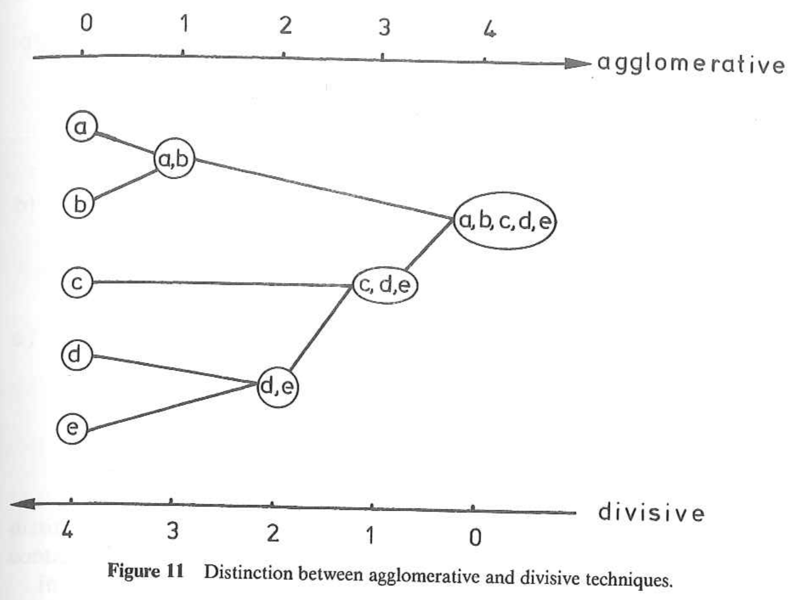
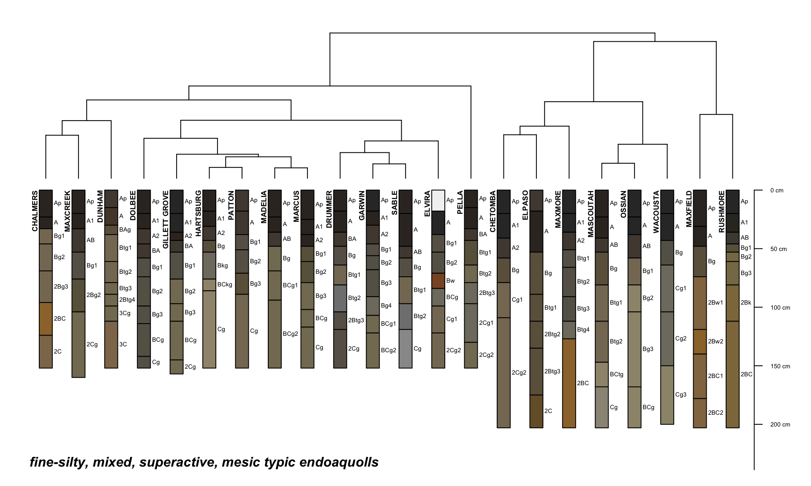

<!-- load libraries for examples, which run before any code is displayed -->
```{r eval = TRUE, echo=FALSE, results='hide', warning=FALSE, message=FALSE}
# load libs for examples
library(kableExtra)
library(aqp)
library(cluster)
library(ape)
library(RColorBrewer)
library(MASS)
library(lattice)
library(viridis)
library(vegan)

# custom functions
source('local-functions.R')
```


# Numerical Taxonomy and Ordination {#ordination}


## Introduction

Nearly every aspect of soil survey involves the question: "Is X more similar to Y or to Z?" The quantification of similarity within a collection of horizons, pedons, components, map units, or even landscapes represents an exciting new way to enhance the precision and accuracy of the day-to-day work of soil scientists. After completing this module, you should be able to quantitatively organize objects based on measured or observed characteristics in a consistent and repeatable manner. Perhaps you will find a solution to the long-standing "similar or dissimilar" question.


### Objectives
 * Learn essential vocabulary used in the field of numerical taxonomy. Review some of the literature.
 * Gain experience with R functions and packages commonly used for clustering and ordination.
 * Learn how to create and interpret a distance matrix and appropriate distance metrics.
 * Learn how to create and interpret a dendrogram.
 * Lean the basics and application of hierarchical clustering methods.
 * Lean the basics and application of partitioning clustering methods.
 * Learn the basics and application of ordination methods.
 * Apply skills to a range of data sources for soils and vegetation.
 * Apply techniques from numerical taxonomy to addressing the "similar or dissimilar" question.
 * Learn some strategies for coping with missing data.

## Whirlwind Tour

Most of the examples featured in this whirlwind tour are based on soil data from [McGahan, D.G., Southard, R.J, Claassen, V.P. 2009. Plant-available calcium varies widely in soils on serpentinite landscapes. Soil Sci. Soc. Am. J. 73: 2087-2095.](https://dl.sciencesocieties.org/publications/sssaj/articles/73/6/2087) These data are available in the dataset "sp4" that is built into `aqp` package for R.

### Similarity, Disimilarty, and Distance

There are shelves of books and thousands of academic articles describing the theory and applications of "clustering" and "ordination" methods. This body of knowledge is commonly described as the field of **numerical taxonomy** [@Sneath1973]. Central to this field is the quantification of **similarity** among "individuals" based on a relevant set of "characteristics." Individuals are typically described as rows of data with a single characteristic per column, together referred to as a **data matrix**. For example:

```{r eval = TRUE, echo=FALSE}
data('sp4', package = 'aqp')
sp4 <- sp4[1:4, c('name', 'clay', 'sand', 'Mg', 'Ca', 'CEC_7')]
kable_styling(kable(sp4, align = 'c', format='html'), full_width = FALSE)
```

Quantitative measures of similarity are more conveniently expressed as distance, or dissimilarity; in part because of convention and in part because of computational efficiency. In the simplest case, dissimilarity can be computed as the shortest distance between individuals in property-space. Another name for the shortest linear distance between points is the [**Euclidean distance**](https://en.wikipedia.org/wiki/Euclidean_distance). Evaluated in two dimensions (between individuals $p$ and $q$), the Euclidean distance is calculated as follows:

$$D(p,q) = \sqrt{(p_{1} - q_{1})^{2} + (p_{2} - q_{2})^{2}}$$

where $p_{1}$ is the 1st characteristic (or dimension) of individual $p$.

There are many other ways to define "distance" (e.g. distance metrics), but they will be covered later.

Using the sand and clay percentages from the data above, dissimilarity is represented as the length of the line connecting any two individuals in property space.

```{r eval = TRUE, echo=FALSE, fig.width=5, fig.height=5}
m <- distPlot(sp4, vars=c('sand', 'clay'), individuals=c(1,2,4), id='name', xlim=c(10, 60), ylim=c(10, 60), xlab='Sand (%)', ylab='Clay (%)')
```

The following is a matrix of all pair-wise distances (the [**distance matrix**](https://en.wikipedia.org/wiki/Distance_matrix)):

|    |    A|  ABt|  Bt1|  Bt2|
|:---|----:|----:|----:|----:|
|A   |  0.0|  <b>7.2</b>| 12.5| 38.9|
|ABt |  <b>7.2</b>|  0.0|  5.4| <b>31.8</b>|
|Bt1 | 12.5|  5.4|  0.0| 26.4|
|Bt2 | 38.9| <b>31.8</b>| 26.4|  0.0|

Note that this is the full form of the [**distance matrix**](https://en.wikipedia.org/wiki/Distance_matrix). In this form, zeros are on the diagonal (i.e. the distance between an individual and itself is zero) and the upper and lower "triangles" are symmetric. The lower triangle is commonly used by most algorithms to encode pair-wise distances.

|    |    A|  ABt|  Bt1|
|:---|----:|----:|----:|
|ABt |  <b>7.2</b>|  |  |
|Bt1 | 12.5|  5.4|  |
|Bt2 | 38.9| <b>31.8</b>| 26.4|

Interpretation of the matrix is simple: Individual "A" is more like "ABt" than like "Bt1." It is important to note that quantification of dissimilarity (distance) among individuals is always relative: "X is more like Y, as compared to Z."


#### Distances You Can See: Perceptual Color Difference

Simulated redoximorphic feature colors, constrast classes and CIE $\Delta{E_{00}}$. Details [here](https://ncss-tech.github.io/AQP/aqp/color-contrast.html).
```{r eval = TRUE, fig.width=8, fig.height=3.5, echo=FALSE}
m1 <- paste0('7.5YR 4/', 2:8)
m2 <- rep('10YR 5/2', times=length(m1))
colorContrastPlot(m1, m2, labels = c('F3M', 'MAT'), d.cex = 0.8, col.cex = 0.8)
```


### Standardization of Characteristics

Euclidean distance doesn't make much sense if the characteristics do not share a common unit of measure or range of values. Nor is it relevant when some characteristics are categorical and some are continuous. For example, distances are distorted if you compare clay (%) and exchangeable Ca (cmol/kg).

```{r eval = TRUE, echo=FALSE, fig.width=5, fig.height=5}
m <- distPlot(sp4, vars=c('Ca', 'clay'), individuals=c(1,2,4), id='name', xlim=c(0, 60), ylim=c(0, 60), xlab='Exchangeable Ca (cmol/kg)', ylab='Clay (%)')
```

In this example, exchangeable Ca contributes less to the distance between individuals than clay content, effectively down-weighting the importance of the exchangeable Ca. Typically, characteristics are given equal weight [@Sneath1973]; however, weighting is much simpler to apply after **standardization**.

**Standardization** of the data matrix solves the problem of unequal ranges or units of measure, typically by subtraction of the mean and division by standard deviation ([z-score transformation](https://en.wikipedia.org/wiki/Standard_score)).

$$x_{std} = \frac{x - mean(x)}{sd(x)}$$

There are several other **standardization** methods covered later. The new data matrix looks like the following:

```{r eval = TRUE, echo=FALSE, fig.width=5, fig.height=5}
sp4.scaled <- data.frame(name=sp4[, 1], round(scale( sp4[, -1]), 2))
kable_styling(kable(sp4.scaled, align = 'c', format='html'), full_width = FALSE)
```

Using the standardized data matrix, distances computed in the property space of clay and exchangeable calcium are unbiased by the unique central tendency or spread of each character.

```{r eval = TRUE, echo=FALSE, fig.width=5, fig.height=5}
m <- distPlot(sp4, vars=c('Ca', 'clay'), individuals=c(1,2,4), id='name', scale=TRUE, xlim=c(-1.5, 1.5), ylim=c(-1.5, 1.5), xlab='Exchangeable Ca (cmol/kg)', ylab='Clay (%)')
```

Rarely can the question of "dissimilarity" be answered with only two characteristics (dimensions). Euclidean distance, however, can be extended to an arbitrary number of $n$ dimensions.

$$D(p,q) = \sqrt{ \sum_{i=1}^{n}{(p_{i} - q_{i})^{2}} }$$

In the equation above, $i$ is one of $n$ total characteristics. Imagining what distance "looks like" is difficult if there are more than three dimensions. Instead, examine the distance matrix calculated using all five characteristics.

```{r eval = TRUE, echo=FALSE, fig.width=6.5, fig.height=6.5}
d <- dist(sp4.scaled[, -1])
m <- as.matrix(d)
dimnames(m) <- list(sp4.scaled$name, sp4.scaled$name)

# remove upper triangle
m[upper.tri(m)] <- NA

# "nice" colors
cols <- viridis(10)
col.palette <- colorRampPalette(cols)

levelplot(round(m, 2), col.regions=col.palette, colorkey=list(tick.number=10), xlab='', ylab='', main='Pair-Wise Distances', scales=list(alternating=3), panel=function(x, y, z, ...) {
  panel.levelplot(x, y, z, ...)
  idx <- which(!is.na(z))
  panel.text(x[idx], y[idx], z[idx], font=2, col='red')
  panel.abline(h=seq(from=0.5, to=length(y), by=1), col=grey(0.45))
  panel.abline(v=seq(from=0.5, to=length(x), by=1), col=grey(0.45))
})
```

Rescaling to the interval {0,1}.
```{r eval = TRUE, echo=FALSE, fig.width=6.5, fig.height=6.5}
m <- m / max(m, na.rm = TRUE)
levelplot(round(m, 2), col.regions=col.palette, colorkey=list(tick.number=10), xlab='', ylab='', main='Pair-Wise Distances', scales=list(alternating=3), panel=function(x, y, z, ...) {
  panel.levelplot(x, y, z, ...)
  idx <- which(!is.na(z))
  panel.text(x[idx], y[idx], z[idx], font=2, col='red')
  panel.abline(h=seq(from=0.5, to=length(y), by=1), col=grey(0.45))
  panel.abline(v=seq(from=0.5, to=length(x), by=1), col=grey(0.45))
})
```

You can now begin to describe dissimilarity between individuals using an arbitrary number of (relevant) characteristics. You can make statements like *"The A horizon is roughly 2x more similar to the ABt horizon than it is to the Bt horizon."* Although this is a trivial example, the utility of generalizing these methods to soil survey operations should be obvious.

#### Review and Discuss

 * What are the "data matrix" and "distance matrix"?
 * What is standardization, and why is it important?
 * What is the largest impediment to creating a distance matrix from NASIS and KSSL data?
 * **Key point:** Each characteristic is its own dimension in property-space.
  + Sand, clay, and CEC = 3 dimensions.
  + Sand, clay, CEC, OC, and horizon depth = 5 dimensions.
  + Multiple dimensions are simple to define in code but [are hard to visualize](https://youtu.be/N0WjV6MmCyM).
  + The [curse of dimensionality](https://en.wikipedia.org/wiki/Curse_of_dimensionality).
   

### Missing Data

Missing data are a fact of life. Soil scientists are quite familiar with missing lab data (*"Why didn't we request optical grain counts?"*) or missing essential NASIS pedon data elements, such as horizon bottom depth, estimated clay fraction, or pH. Nearly all of the methods described in this document are very sensitive to missing data. In other words, they won't work! Following are a couple of possible solutions:
 
 * Fix the missing data if at all possible,
 * Estimate the missing data values from know relationships to other properties or a group-wise mean or median, or
 * Remove records containing any missing data.


### Visualizing Pair-Wise Distances: The Dendrogram

[Dendrograms](http://en.wikipedia.org/wiki/Dendrogram) are a convenient approximation of [pair-wise distances](http://hymenoptera.tamu.edu/courses/ento601/pdf/Sokal_1966.pdf) between individuals (after application of hierarchical grouping criteria; more on this later). Dissimilarity between branches is proportional to the level at which branches merge: branching at higher levels (relative to the root of the tree) suggests greater dissimilarity; branching at lower levels suggests greater similarity. Consider the previous example in which distance between individuals was defined in terms of sand and clay percentages.

```{r eval = TRUE, echo=FALSE, fig.width=10, fig.height=5}
par(mar=c(1,1,1,0), mfcol=c(1,2))

m <- distPlot(sp4, vars=c('sand', 'clay'), individuals=c(1,2,4), id='name', show.distances=FALSE, xlim=c(10, 60), ylim=c(10, 60), xlab='Sand (%)', ylab='Clay (%)')
d <- as.dist(m)
dd <- diana(d)
h <- as.hclust(dd)
p <- as.phylo(h)

plot(p, font=2, label.offset=0.5, adj=0.5, direction='down', srt=90)
# axis(2, las=1, line=1.5)
mtext('Dendrogram Representation of Distance Matrix\n(sand and clay %)', side=1, line=2)
```

Interpretation is simple. Euclidean distance in property-space is directly proportional to branching height in the corresponding dendrogram. Visualizing the geometry of pair-wise distances in more than three dimensions is difficult. A dendrogram, however, can conveniently summarize a distance matrix created from an arbitrary number of characteristics (dimensions). It is important to note that some information about pair-wise distances is lost or distorted in the dendrogram. Distortion is *least* near the terminal "leaves" of the dendrogram. This phenomena is analogous to the distortion generated by a map projection. It is impossible to flatten a higher-dimensional entity to a lower-dimensional form without causing distortion.


### Re-arranging a Dendrogram for Clarity
The branches of a dendrogram can be rotated like a mobile, so that the final ordering of the terminal "leaves" approximates an alternate ranking. For example, branches of the following dendrogram (right-hand side) have been rotated to approximate the expected hydrologic gradient from summit to toeslope.


#### Review and Discuss
 * Do you have any questions about dendrogram interpretation?  Dendrograms are used extensively in the rest of this chapter.
 * If you were explaining how to interpret a dendrogram to someone, would you start at the roots or leaves? Why?


### Cluster Analysis: Finding Groups in Data
[**Cluster analysis**](https://en.wikipedia.org/wiki/Cluster_analysis) is a massive topic that deals with the seemingly simple task of finding useful groups within a dataset. This topic and the methods used are also referred to as "unsupervised classification" in the fields of remote sensing and GIS. All of the [available algorithms](https://cran.r-project.org/web/views/Multivariate.html) will find groups in a given dataset; however, it is up to the subject expert to determine the following:
 
  1. Suitable characteristics and standardization method,
  2. Appropriate clustering algorithm,
  3. Criteria to determine the "right" number of clusters,
  4. Limitations of the selected algorithm,
  5. Interpretation of the final grouping based on subject knowledge, and
  6. The possibility of needing to start over at step 1.


#### Using Color to Communicate Results of Clustering or Ordination
Note that the widespread use of color in the following examples is not for aesthetic purposes. Colors are convenient for tri-variate data-spaces because you can visually integrate the information into a self-consistent set of classes.


#### Hierarchical Clustering
[Hierarchical clustering](https://en.wikipedia.org/wiki/Hierarchical_clustering) is useful when a full **distance matrix** is available and the optimal number of clusters is not yet known. This form of clustering creates a data structure that can encode "grouping" information from one cluster to as many clusters as there are individuals. The expert must determine the optimal place to "cut the tree" and generate a fixed set of clusters. The results from a hierarchical clustering operation are nearly always presented as a dendrogram.

```{r eval = TRUE, echo=FALSE, results='hide', fig.width=10, fig.height=4}
# re-make data, this time with all profiles
data('sp4', package = 'aqp')
sp4 <- sp4[, c('name', 'clay', 'sand', 'Mg', 'Ca', 'CEC_7')]
sp4.scaled <- data.frame(name=sp4[, 1], round(scale( sp4[, -1]), 2))

# distance matrix
d <- dist(sp4.scaled[, -1])
m <- as.matrix(d)
dimnames(m) <- list(sp4.scaled$name, sp4.scaled$name)
d <- as.dist(m)
# dendrogram from divisive clustering
dd <- diana(d)
h <- as.hclust(dd)
p <- as.phylo(h)

# define colors based on natural groupings
cols <- brewer.pal(9, 'Set1')[cutree(h, 4)]

par(mar=c(0,0,0,0), mfcol=c(1,2))
plot(p, label.offset=0.125, direction='right', font=1, cex=0.85)
abline(v=2.3, col='orange', lty=2, lwd=2)
# mtext('Dendrogram Representation of Distance Matrix\n(all characteristics, standardized)', side=1, line=1)

plot(p, label.offset=0.125, direction='right', font=1, cex=0.85)
abline(v=2.3, col='orange', lty=2, lwd=2)
tiplabels(pch=15, col=cols)
# mtext('Dendrogram Representation of Distance Matrix\n(all characteristics, standardized)', side=1, line=1)
```

##### Methods

There are two main types of [hierarchical clustering](https://en.wikipedia.org/wiki/Hierarchical_clustering).

 1. **Agglomerative:** Start with individuals and iteratively combine into larger and larger groups.
 2. **Divisive:** Start with all individuals and iteratively split into smaller and smaller groups.

Both methods are strongly influenced by the choice of **standardization** method and **distance metric**. Both methods require a full, pair-wise distance matrix as input. This requirement can limit the use of hierarchical clustering to datasets that can be fit into memory.

<div style="width: 75%; margin: auto; border: 1px solid black; padding 5px;"></div>
<br> 

The agglomerative methods also depend on the choice of [linkage criterion](https://en.wikipedia.org/wiki/Hierarchical_clustering#Linkage_criteria). Some of these criteria include:

  1. Average: usually generates spherical clusters, default in `agnes()` and recommended by [@Kaufman2005],
  2. Single linkage: usually generates elongated clusters,
  3. Complete linkage: usually generates small, compact clusters,
  4. Ward's (minimum variance) method,
  6. Weighted average (or Gower's) linkage: spherical clusters of roughly equal size, and
  7. "Flexible strategy": adjustable linkage based on parameter $\alpha$.  
  8. "Flexible UPGMA" [@belbin1992]: adjustable linkage based on parameter $\beta$.  

See [@Kaufman2005], [@Arkley1976], [@Legendre1998], and [`agnes()` manual page](https://www.rdocumentation.org/packages/cluster/versions/2.0.7-1/topics/agnes) for a detailed description of these linkage criteria. Selection of linkage criteria can be quantitatively evaluated using the [cophenetic correlation](https://en.wikipedia.org/wiki/Cophenetic_correlation); and index of how well a dendrogram preserves the original pair-wise distances. [This thread](https://stats.stackexchange.com/questions/195446/choosing-the-right-linkage-method-for-hierarchical-clustering) on StackExchange has a nice summary of various linkage criteria. I really like [these slides by Brian Tibshirani](https://www.stat.cmu.edu/~ryantibs/datamining/lectures/05-clus2.pdf) on the topic of agglomerative method selection. More on this later.

###### Review and Discuss
 * The simplicity and lack of decisions make the divisive method convenient for most work. 
 * The top-down approach is similar to the way in which we describe soil morphology and taxonomy.
 * Linkage criteria should be selected based on the hypothesized shape of clusters or prior subject knowledge.
 * When selecting a method, read/think about it; don't just go "fishing."
 * *Personal opinion:* I usually select divisive hierarchical clustering over the other methods: structures *seem* to be generally more interpretable.


#### Centroid and Medoid (Partitioning) Clustering
Centroid and medoid cluster analyses are commonly referred to as [k-means](https://en.wikipedia.org/wiki/K-means_clustering)-style analysis. "K-means," however, is just one of many possible clustering algorithms that partition property-space into a fixed number of groups. These type of algorithms can be applied to very large datasets because they do not rely on the **distance matrix**. Instead, they are based on an iterative shuffling of group "centroids" until some criterion is minimized, for example, the mean variance within groups.  

```{r eval = TRUE, echo=FALSE, results='hide', fig.width=6, fig.height=6}
# re-make data, this time with all profiles
data('sp4', package = 'aqp')
sp4 <- sp4[, c('name', 'Mg', 'Ca')]
sp4.scaled <- data.frame(name=sp4[, 1], round(scale( sp4[, -1]), 2))

# use pam to generate 3 clusters
cl <- pam(sp4.scaled[, -1], k = 3, stand = FALSE)

# use kmeans to generate centroids for demo
km <- kmeans(sp4.scaled[, -1], 3, nstart = 10, iter.max = 100)

# define colors based on hard clustering
col.set <- brewer.pal(9, 'Set1')
cols <- col.set[cl$clustering]

# setup plot
par(mar=c(4,4,0,0))
plot(sp4.scaled$Mg, sp4.scaled$Ca, asp=1, ylab='Exchangeable Mg (cmol [+]/kg), Standardized', xlab='Exchangeable Ca (cmol [+]/kg), Standardized', type='n')
abline(h=0, v=0, col='black')
grid()

# add k-means centroids
points(km$centers[, 1], km$centers[, 2], cex=2, lwd=1, pch=8, col='black')

# add medoids
points(cl$medoids, col=col.set, lwd=2, cex=3, pch=0, lend=2)

# add original obs
points(sp4.scaled$Mg, sp4.scaled$Ca, bg=cols, col='black', cex=1.25, pch=21)

# legend
legend('topright', legend=c('Observation', 'Medoid', 'Centroid'), pch=c(21, 0, 8), lwd=c(1, 2, 1), pt.cex=c(1.25, 3, 2), lty=NA, bty='n', cex=1.25)
```

##### Methods

This section describes three (out of many) of the most important partitioning-type algorithms.
 
 * [K-means](https://en.wikipedia.org/wiki/K-means_clustering): Groups of individuals are partitioned around newly created "[centroids](https://en.wikipedia.org/wiki/Centroid)". Resulting clusters approximately spherical and contain an approximately equal number of individuals.
 * [K-medoids](https://en.wikipedia.org/wiki/K-medoids): Groups of individuals are partitioned around selected "[medoids](https://en.wikipedia.org/wiki/Medoid)".
 * [Fuzzy clustering](https://en.wikipedia.org/wiki/Fuzzy_clustering): Individuals are assigned a "fuzzy membership" value for each partition of property-space.

All of these methods are sensitive to the type of **standardization** applied to the characteristics. These methods rely on iterative minimization of one or more criteria; therefore, each clustering "run" may generate slightly different output. Most implementations re-run the algorithm until it stabilizes.


###### Review and Discuss

 * What is the difference between a "medoid" and a "centroid"? Can you think of a way in which both concepts could be applied to the grouping of soils data?
  + medoids are tied to individuals, centroids are hypothetical (calculated)
 * Fuzzy clustering is also referred to as "soft clustering," while the other two methods are referred to as "hard clustering." Sometimes, using both can be helpful, especially if individuals straddle the line between groups.
 * Each method has its own strength and weakness, for example [here is a nice summary of the limitations of k-means](http://varianceexplained.org/r/kmeans-free-lunch/).


### Ordination: Visualization in a Reduced Space
Humans are generally quite good at extracting spatial patterns, almost instantly, from two dimensional fields: faces, written language, etc. Sadly, this ability does not extend beyond two or three dimensions. The term [**ordination**](https://en.wikipedia.org/wiki/Ordination_(statistics)) refers to a suite of methods that project coordinates in a high-dimensional space into suitable coordinates in a low-dimensional (reduced) space. Map projections are a simple form of ordination: coordinates from the curved surface of the Earth are projected to a two-dimensional plane. As with any projection, there are assumptions, limitations, and distortions. [Carl Sagan gives a beautiful demonstration of this concept using shadows, in this excerpt from *Cosmos*. ](https://youtu.be/N0WjV6MmCyM) [Here is another excellent demonstration based on handwriting recognition.](http://colah.github.io/posts/2014-10-Visualizing-MNIST/)

Hole and Hironaka [-@Hole1960] were some of the first pedologists to apply ordination methods to soils data. The main figure from [their classic paper](https://dl.sciencesocieties.org/publications/sssaj/pdfs/24/4/SS0240040309) was hand-drawn, based on a physical model (constructed from wooden dowels and spheres!) of the ordination.
<div style="width: 75%; margin: auto; border: 1px solid black; padding 5px;"></div>


#### Major Types of Ordination
Of the many possible ordination [methods](http://ordination.okstate.edu/), there are two major types to keep in mind:

  1. Constrained ordination: coordinates in the reduced space are subject to some kind of constraint (more rigid, simple interpretation). [Principal component analysis](https://en.wikipedia.org/wiki/Principal_component_analysis) (PCA) is one of the simplest and most widely used ordination methods. The reduced space ("principal components") are defined by linear combinations of characteristics.
    
  2. Unconstrained ordination: coordinates in the reduced space are not subject to any kind of constraint (more flexible, less interpretable). ["Non-metric" multidimensional scaling](https://en.wikipedia.org/wiki/Multidimensional_scaling#Non-metric_multidimensional_scaling) (nMDS) attempts to generate a reduced space that minimizes distortion in proportional similarity; i.e., similar individuals are near each other in the reduced space, dissimilar individuals are farther apart. The "non-metric" adjective implies that exact distances are not preserved.

See [@Legendre1998] for a comprehensive listing of methods, associated theory, and ecological applications.

#### An Example of nMDS Applied to Soil Data
The following example is based on a **data matrix** containing lab measurements of clay fraction, sand fraction, exchangeable Ca, exchangeable Mg, and CEC measured by NH<sub>4</sub>-Ac at pH 7.

|name |  clay|  sand|    Mg|    Ca| CEC_7|
|:----|-----:|-----:|-----:|-----:|-----:|
|A    | -0.41|  0.21|  0.06|  0.44| -0.23|
|ABt  |  0.04| -0.07| -0.06| -0.13| -0.38|
|Bt1  |  0.41| -0.21| -0.09| -0.74| -0.16|
| <b>...</b>  |  <b>...</b>| <b>...</b>| <b>...</b>| <b>...</b>| <b>...</b>|


Note that distances between individuals, within clusters, and between clusters **is more apparent in the nMDS** representation of the distance matrix. Similar information is embedded in the dendrogram but it is not as intuitive.
```{r eval = TRUE, echo=FALSE, results='hide', fig.width=10, fig.height=5}
# re-make data, this time with all profiles
data('sp4', package = 'aqp')
sp4 <- sp4[, c('name', 'clay', 'sand', 'Mg', 'Ca', 'CEC_7')]
sp4.scaled <- data.frame(name=sp4[, 1], round(scale( sp4[, -1]), 2))

# distance matrix
d <- dist(sp4.scaled[, -1])
m <- as.matrix(d)
dimnames(m) <- list(sp4.scaled$name, sp4.scaled$name)
d <- as.dist(m)
# dendrogram from divisive clustering
dd <- diana(d)
h <- as.hclust(dd)
p <- as.phylo(h)

# define colors based on natural groupings
cols <- brewer.pal(9, 'Set1')[cutree(h, 4)]

# nMDS
m <- metaMDS(d, distance = 'gower')

# multi-figure output
par(mar=c(3,0,0,3), mfcol=c(1,2))
plot(p, label.offset=0.125, direction='right', font=1, cex=0.85)
tiplabels(pch=15, col=cols)
abline(v=2.3, col='orange', lty=2, lwd=2)
mtext('Dendrogram Representation of Distance Matrix\n(all characteristics, standardized)', side=1, line=1)

# setup plot
o <- ordiplot(m, type='n', axes=FALSE)
# grid and nMDS origin
grid()
# abline(v=0, h=0, col='black', lty=3)
# add points, colored accoring to cluster from previous example
points(o, 'sites', cex=1, col=cols, pch=16)
# text(o, 'sites', labels=sp4$name, cex=0.75, col=cols, font=2)

# annotate
mtext('Ordination of Distance Matrix (nMDS)\n(all characteristics, standardized)', side=1, line=1)
```


##### Interpreting the Results
We can conveniently annotate the results of an ordination with contextual information, such as the approximate trends in clay content or CEC. Note that ordination methods represent a *flattening* of multi-dimensional data space, and in the case of nMDS, preserve proportional (vs. exact) pair-wise distances. Therefore, it is quite common for surfaces (the contours below) fit to the 2D ordination to have complex patterns.
```{r eval = TRUE, echo=FALSE, results='hide', fig.width=10, fig.height=4}
# figure margins
par(mar=c(1,1,3,1), mfcol=c(1,2))

# setup plot
o <- ordiplot(m, type='n', axes=FALSE)
# add points, colored accoring to cluster from previous example
points(o, 'sites', cex=1, col=cols, pch=16)

# overlay smooth surface of variable used in ordination
ordisurf(m, sp4$clay, add=TRUE, col='black', labcex=0.65)

# finish plot
title('Influence of Clay Content (%)')
box()

# setup plot
o <- ordiplot(m, type='n', axes=FALSE)
# add points, colored accoring to cluster from previous example
points(o, 'sites', cex=1, col=cols, pch=16)

# overlay smooth surface of variable used in ordination
ordisurf(m, sp4$CEC_7, add=TRUE, col='black', labcex=0.65)

# finish plot
title('Influence of CEC by NH4-Ac (cmol [+]/kg)')
box()
```

Putting the clustering results into context is important: recall that we are working with *individuals* that represent genetic horizons that have been clustered according to 5 physical / chemical properties (*characteristics*). Differences in CEC by NH4-Ac are one of the strongest contributors to the pair-wise distances and overall clustering structure.
```{r eval = TRUE, echo=FALSE, results='hide', fig.width=10, fig.height=4}
# re-init sp4, copy clustering colors to hz attribute
data('sp4', package = 'aqp')
sp4$cl <- cols
depths(sp4) <- id ~ top + bottom

# arrange from 
max.CEC7 <- profileApply(sp4, function(i) {
  max(i$CEC_7, na.rm = TRUE)
})

# low -> high CEC7
new.order <- order(max.CEC7)

par(mar=c(1,0,0,0))
plotSPC(sp4, color='cl', cex.names=0.75, plot.order = new.order)
# title('Clustering Results in Context', line=-1)
mtext('profiles arranged from low \u2192 high, profile maximum CEC by NH4-Ac', side = 1, line = -1, font=3, at = c(0.5, 50), adj = 0)
```


### Review and Discuss

 * Which visualization of the distance matrix was simpler to interpret: Dendrogram or ordination by nMDS?
 * Do you have any questions about the figures?
 * Do you have any guesses on what the clusters represent?


### Pair-Wise Distances Between Soil Profiles

```{r eval = TRUE, fig.width=8, fig.height=4, echo=FALSE}
library(sharpshootR)
# init example data
data(sp4)
depths(sp4) <- id ~ top + bottom

# eval dissimilarity:
# using Ex-Ca:Mg and CEC at pH 7
# with no depth-weighting (k=0)
# to a maximum depth of 40 cm
d <- profile_compare(sp4, vars=c('ex_Ca_to_Mg', 'CEC_7'), k=0, max_d=40)

# cluster via divisive method
clust <- diana(d)

# vizualize dissimilarity matrix via hierarchical clustering
par(mar=c(0,0,3,0))
plotProfileDendrogram(sp4, clust, dend.y.scale = max(d), scaling.factor = (1/max(d) * 10), y.offset = 2, width=0.15, cex.names=0.45, color='ex_Ca_to_Mg', col.label='Exchageable Ca to Mg Ratio')
```




This is a complex topic, described in a [supplemental set of slides](http://ncss-tech.github.io/AQP/presentations/AQP-num_soil_classification.pdf).

If you want for more detailed information, see this [relevant paper](http://dx.doi.org/10.1016/j.cageo.2012.10.020).


### Final Discussion
 * Missing data strategy
 * Meaningful characteristics
 * Standardization of characteristics
 * Distance metric
 * Clustering algorithm
 * Number of clusters
 * Application to soil survey and ESD
 

## Excercises
This is the fun part.

### Set Up the R Session
Install R packages as needed. Open a new R script file to use as you follow along.
```{r eval = TRUE, results='hide'}
# load libraries
library(aqp)
library(soilDB)
library(sharpshootR)
library(cluster)
library(ape)
library(RColorBrewer)
library(vegan)
library(MASS)
library(colorspace)
library(viridis)
```

#### Data Sources

Most of the examples used in the following exercises come from these sources:

  1. Built-in data sets from the `aqp` and `soilDB` packages ("sp4," "gopheridge," and "loafercreek").
  2. Results from [`fetchNASIS()`](http://ncss-tech.github.io/AQP/soilDB/fetchNASIS-mini-tutorial.html): pedon data from the local NASIS selected set.
  3. Results from [`fetchKSSL()`](http://ncss-tech.github.io/AQP/soilDB/KSSL-demo.html): lab characterization data from the SoilWeb snapshot.
  4. Results from [`fetchOSD()`](http://ncss-tech.github.io/AQP/sharpshootR/OSD-dendrogram.html): basic morphologic and taxonomic data from the SoilWeb snapshot.
  5. Results from [`SDA_query()`](http://ncss-tech.github.io/AQP/soilDB/SDA-tutorial.html): live SSURGO spatial and tabular data from [Soil Data Access](http://sdmdataaccess.nrcs.usda.gov/)
  6. Data from SSR 2, as CSV, downloaded from class [GitHub site](https://github.com/ncss-tech/stats_for_soil_survey/tree/master/data/clustering_and_ordination)


In most cases, you can edit the examples and swap-in just about any data that are in a [`SoilProfileCollection` object](http://ncss-tech.github.io/AQP/aqp/aqp-intro.html). For example, pedons from your local NASIS selected set can be loaded with `fetchNASIS()`.


##### Try it!
Tinker with some `SoilProfileCollection` objects.

 * Get some data using one of the methods listed above. If you need help, see the manual pages for examples (`?fetchKSSL`) or the [SoilProfileCollection tutorial](http://ncss-tech.github.io/AQP/aqp/aqp-intro.html).
 * Determine the number of profiles and horizons within the collection.
 * View and extract some site and horizon attributes.
 * Generate some soil profile sketches.


### Evaluating Missing Data

The `aqp` package provides two functions for checking the fraction of missing data within a `SoilProfileCollection` object. The first function (`evalMissingData`) generates an index that ranges from 0 (all missing) to 1 (all present) for each profile. This index can be used to subset or rank profiles for further investigation. The second function (`missingDataGrid`) creates a visualization of the *fraction* of data missing within each horizon. Both functions can optionally filter-out horizons that don't typically have data, for example Cr, Cd, and R horizons.

The following examples are based on the `gopheridge` sample dataset.

**evalMissingData**
```{r eval = TRUE, fig.width=10, fig.height=4}
# example data
data("gopheridge", package = "soilDB")

# compute data completeness
gopheridge$data.complete <- evalMissingData(gopheridge, vars = c('clay', 'sand', 'phfield'), name = 'hzname', p = 'Cr|R|Cd')

# check range in missing data
summary(gopheridge$data.complete)

# rank
new.order <- order(gopheridge$data.complete)

# plot along data completeness ranking
par(mar=c(3,0,1,1))
plot(gopheridge, plot.order=new.order, print.id=FALSE, name='')

# add axis, note re-ordering of axis labels
axis(side=1, at=1:length(gopheridge), labels = round(gopheridge$data.complete[new.order], 2),
line=-2, cex.axis=0.65, las=2)

title('Gopheridge pedons sorted according to data completeness (clay, sand, pH)')
```


**missingDataGrid**
```{r eval = TRUE, fig.width=9.5, fig.height=4}
# view missing data as a fraction
res <- missingDataGrid(gopheridge, max_depth=100, vars=c('clay', 'sand', 'phfield'), filter.column='hzname', filter.regex = 'Cr|R|Cd', main='Fraction of missing data (clay, sand, pH)', cols = viridis(10))

# plot figure
print(res$fig)

# check results
head(res$summary)
```

For now, extract those profiles that have a complete set of field-described clay, sand, or pH values for later use.
```{r eval = TRUE, fig.width=8.5, fig.height=4}
# be sure to read the manual page for this function
gopheridge.complete <- subset(gopheridge, data.complete > 0.99)

# another way
idx <- which(gopheridge$data.complete > 0.99)
gopheridge.complete <- gopheridge[idx, ]

# looks good
par(mar=c(0,0,3,1))
plot(gopheridge.complete, color='clay', id.style='side', label='pedon_id')
```


### More on the Distance Matrix and How to Make One

The following three functions are essential to the creation of a **distance matrix**:

  * `dist()`: This function is in base R, is simple and fast, and has a limited number of distance metrics.
  * `daisy()`: This function is in [cluster package](https://cran.r-project.org/web/packages/cluster/index.html), has a better selection of distance metrics, and has simple standardization. Much more convenient than `dist()`.
  * `vegdist()`: This function is in [vegan package](https://cran.r-project.org/web/packages/vegan/index.html), has many distance metrics, and is primarily designed for species composition data.


The following is a short demonstration:
```{r eval = TRUE}
# get some example data from the aqp package
data('sp4', package = 'aqp')
# subset select rows and columns
sp4 <- sp4[1:4, c('name', 'clay', 'sand', 'Mg', 'Ca', 'CEC_7')]
row.names(sp4) <- sp4$name

# compare distance functions

# Euclidean distance, no standardization
round(dist(sp4[, -1], method = 'euclidean'))

# Euclidean distance, standardization
round(daisy(sp4[, -1], stand = TRUE, metric = 'euclidean'), 2)

# Gower's generalized distance metric (includes standardization)
round(vegdist(sp4[, -1], method = 'gower'), 2)
```


#### Distance Calculations with Categorical Data
The following example is excerpted from ["A Novel Display of Categorical Pedon Data"](http://ncss-tech.github.io/AQP/sharpshootR/diagnostic-property-plot.html). This example illustrates an application of clustering binary data (presence or absence of a diagnostic feature). Internally, the `diagnosticPropertyPlot()` function uses the `daisy()` function to compute pair-wise distances using the "general dissimilarity coefficient" of Gower [@Gower1971]. A concise summary of this distance metric is in [@Kaufman2005].

```{r eval = TRUE, fig.width=8.5, fig.height=4}
# load some example NASIS data
data(loafercreek, package='soilDB')

# cut-down to a subset, first 20 pedons
loafercreek <- loafercreek[1:20, ]

# get depth class
sdc <- getSoilDepthClass(loafercreek)
site(loafercreek) <- sdc

# diagnostic properties to consider, no need to convert to factors
v <- c('lithic.contact', 'paralithic.contact', 'argillic.horizon',
       'cambic.horizon', 'ochric.epipedon', 'mollic.epipedon', 'very.shallow',
       'shallow', 'mod.deep', 'deep', 'very.deep')

# do the analysis and save the results to object 'x'
x <- diagnosticPropertyPlot(loafercreek, v, k=5, grid.label='bedrckkind', dend.label = 'taxonname')
```

If you are wondering what is in the object `x`, the `str()` function or manual page (`?diagnosticPropertyPlot`) can help.


### Hierachrical Clustering
 
The go-to functions for hierarchical clustering are as follows:
 
 * `hclust()`: This function is agglomerative, is in base R, requires a distance matrix, and implements most of the commonly used linkage criteria.
 * `agnes()`: This function is agglomerative, is in `cluster` package, can perform standardization and distance calculations, and implements more linkage criteria.
 * `diana()`: This function is divisive, is in `cluster` package, can perform standardization and distance calculations.


#### Basic Agglomerative Hierarchical Clustering with `hclust`
The `hclust()` function and resulting `hclust`-class objects are simple to use, but limited.

```{r eval = TRUE}
# re-make data, this time with all profiles
data('sp4', package = 'aqp')
sp4 <- sp4[, c('name', 'clay', 'sand', 'Mg', 'Ca', 'CEC_7')]

# distance matrix
d <- daisy(sp4[, -1], metric = 'euclidean', stand = TRUE)

# hierachical clustering with base function hclust
sp4.h <- hclust(d, method = 'ward.D')
sp4.h$labels <- sp4$name

# plot with basic plotting method... not many options here
par(mar=c(2,4,2,2))
plot(sp4.h, font=2, cex=0.85)

# ID clusters after cutting tree
rect.hclust(sp4.h, 4)
```


#### Better Plots via `ape` Package

This example uses a different approach to plotting based on functions and classes from the `ape` package.
```{r eval = TRUE}
# re-make data, this time with all profiles
data('sp4', package = 'aqp')
sp4 <- sp4[, c('name', 'clay', 'sand', 'Mg', 'Ca', 'CEC_7')]

# distance matrix
d <- daisy(sp4[, -1], metric = 'euclidean', stand = TRUE)

# divising clustering
dd <- diana(d)

# convert to ape class, via hclust class
h <- as.hclust(dd)
h$labels <- sp4$name
p <- as.phylo(h)

# define some nice colors
col.set <- brewer.pal(9, 'Set1')

# cut tree into 4 groups
groups <- cutree(h, 4)

# make color vector based on groups
cols <- col.set[groups]
```

The plot methods for `phylo` class objects are quite flexible. Be sure to see the manual page `?plot.phylo`.
```{r eval = TRUE, fig.width=9, fig.height=9}
par(mar=c(1,1,1,1), mfcol=c(2,2))
plot(p, label.offset=0.125, direction='right', font=1, cex=0.85, main='dendrogram')
tiplabels(pch=15, col=cols)

plot(p, type='radial', font=1, cex=0.85, main='radial')
tiplabels(pch=15, col=cols)

plot(p, type='fan', font=1, cex=0.85, main='fan')
tiplabels(pch=15, col=cols)

plot(p, type='unrooted', font=1, cex=0.85, main='unrooted')
tiplabels(pch=15, col=cols)
```


#### Evaluation of Dendrogram Representation

Re-visiting our sample data from before, develop hierarchical clusterings using several strategies (methods / linkage criteria).
```{r eval = TRUE}
# re-make data, this time with all profiles
data('sp4', package = 'aqp')
sp4 <- sp4[, c('name', 'clay', 'sand', 'Mg', 'Ca', 'CEC_7')]

# distance matrix
d <- daisy(sp4[, -1], metric = 'euclidean', stand = TRUE)

# hierarchical clustering based on several strategies
# agglomerative
h.avg <- agnes(d, method='average')
h.single <- agnes(d, method='single')
h.complete <- agnes(d, method='complete')
h.ward <- agnes(d, method='ward')
h.flexible <- agnes(d, method='gaverage', par.method = 0.01)

# divisive
h.div <- diana(d)
```


The correlation between original distance matrix and [cophenetic distance matrix](https://en.wikipedia.org/wiki/Cophenetic) is a reasonable index of how faithfully a dendrogram preserves the original pair-wise distances.
```{r eval = TRUE}
# agglomerative hierarchical clustering with various linkage criteria
corr.avg <- cor(d, cophenetic(h.avg))
corr.single <- cor(d, cophenetic(h.single))
corr.complete <- cor(d, cophenetic(h.complete))
corr.ward <- cor(d, cophenetic(h.ward))
corr.flexible <- cor(d, cophenetic(h.flexible))

# divisive hierarchical clustering
corr.div <- cor(d, cophenetic(h.div))
```

Combine the results into a table for quick comparison. Note that the [`agnes`](https://www.rdocumentation.org/packages/cluster/versions/2.0.7-1/topics/agnes.object) and [`diana`](https://www.rdocumentation.org/packages/cluster/versions/2.0.7-1/topics/diana) functions provide an agglomerative / divisive coefficient that can be used to evaluate clustering efficiency (e.g. cluster size and "compactness"). Depending on the application, one metric may be more informative than the other.
```{r eval = TRUE}
res <- data.frame(
  method=c('average', 'single', 'complete', 'ward', 'flexible UPGMA', 'divisive'), 
  cophenetic.correlation=c(corr.avg, corr.single, corr.complete, corr.ward, corr.flexible, corr.div),
  agg_div.coefficient=c(h.avg$ac, h.single$ac, h.complete$ac, h.ward$ac, h.flexible$ac, h.div$dc)
)

# re-order
res <- res[order(res$cophenetic.correlation, decreasing = TRUE), ]
```

```{r eval = TRUE, echo=FALSE}
kable_styling(kable(res, row.names = FALSE, format = 'html', digits = 3), full_width = FALSE)
```

Investigate differences graphically: I've ranked according to the frequency withwhich I use the various methods.
```{r eval = TRUE,fig.width=8, fig.height=5}
par(mar=c(0,0.25,1.5,0.25), mfrow=c(2,3))

plot(as.phylo(as.hclust(h.div)), label.offset=0.125, direction='right', font=1, cex=0.65, main='1. Divisive')
tiplabels(pch=15, col=col.set[cutree(h.div, 4)])

plot(as.phylo(as.hclust(h.ward)), label.offset=0.125, direction='right', font=1, cex=0.65, main='2. Ward')
tiplabels(pch=15, col=col.set[cutree(h.ward, 4)])

plot(as.phylo(as.hclust(h.flexible)), label.offset=0.125, direction='right', font=1, cex=0.65, main='3. Flexible (0.01)')
tiplabels(pch=15, col=col.set[cutree(h.flexible, 4)])

plot(as.phylo(as.hclust(h.avg)), label.offset=0.125, direction='right', font=1, cex=0.65, main='4. Average')
tiplabels(pch=15, col=col.set[cutree(h.avg, 4)])

plot(as.phylo(as.hclust(h.single)), label.offset=0.125, direction='right', font=1, cex=0.65, main='(never) Single')
tiplabels(pch=15, col=col.set[cutree(h.single, 4)])

plot(as.phylo(as.hclust(h.complete)), label.offset=0.125, direction='right', font=1, cex=0.65, main='(never) Complete')
tiplabels(pch=15, col=col.set[cutree(h.complete, 4)])
```


##### More on the Flexible UPGMA method
Test the "flexible UPGMA" method [@belbin1992] by iterating over possible values for $\beta$. Looks like a value near `0.01` would be ideal (e.g. highest cophenetic correlation). Interestingly, this is very close to the cophenetic correlation associated with the "average" linkage criteria.
```{r eval = TRUE, fig.width=6.5, fig.height=4}
# init a sequence spanning -1 to 1
beta <- seq(from=-1, to=1, length.out = 100)
# init an empty vector to store results
r <- vector(mode='numeric', length = length(beta))

# iterate over values of beta and compute cophenetic correlation
for(i in 1:length(r)) {
  r[i] <- cor(d, cophenetic(agnes(d, method='gaverage', par.method = beta[i])))
}

# plot
par(mar=c(5,5,1,1))
plot(beta, r, type='l', xlab='beta parameter', ylab='cophenetic correlation', pch=16, las=1)
# locate the max coph. corr.
idx <- which.max(r)
# mark this point and label
points(beta[idx], r[idx], col='red', cex=2, lwd=2)
text(beta[idx], r[idx], labels = round(beta[idx], 3), pos=4)
```


#### Comparison of Dendrograms

The following example is rather basic. Many more possibilities are available in the [`dendextend` package](https://cran.r-project.org/web/packages/dendextend/index.html).
```{r eval = TRUE}
# load sample dataset from aqp package
data(sp3)

# promote to SoilProfileCollection
depths(sp3) <- id ~ top + bottom

# compute dissimilarity using different sets of variables
# note that these are rescaled to the interval [0,1]
d.1 <- profile_compare(sp3, vars=c('clay', 'L'), k=0, max_d=100, rescale.result=TRUE)

# cluster via divisive hierarchical algorithm
# convert to 'phylo' class
p.1 <- as.phylo(as.hclust(diana(d.1)))

# graphically compare diana() to agnes() using d.2
dueling.dendrograms(as.phylo(as.hclust(diana(d.1))), 
as.phylo(as.hclust(agnes(d.1, method='average'))), lab.1='divisive', lab.2='agglomerative: average linkage')
```


### Centroid and Medoid (Partitioning) Clustering

The following creates simulated data for demonstration purposes, representing two populations:

  1. mean = 0, sd = 0.3
  2. mean = 1, sd = 0.3
  
```{r eval = TRUE}
# nice colors for later
col.set <- brewer.pal(9, 'Set1')

# 2D example
x <- rbind(
  matrix(rnorm(100, mean = 0, sd = 0.3), ncol = 2),
  matrix(rnorm(100, mean = 1, sd = 0.3), ncol = 2)
)
colnames(x) <- c("x", "y")
```

#### Hard Classes

##### K-Means
It is important to note that the k-means algorithm is sensitive to the initial selection of centroid locations (typically random). The default behavior of the `kmeans()` function does **not** attempt to correct for this limitation. Note that cluster assignment and centroid vary across runs (panels in the figure below).

```{r eval = TRUE, fig.width=8, fig.height=8}
par(mfrow=c(3,3), mar=c(1,1,1,1))
for(i in 1:9) {
  cl <- kmeans(x, centers=3)
  plot(x, col = col.set[cl$cluster], axes=FALSE)
  grid()
  points(cl$centers, col = col.set, pch = 8, cex = 2, lwd=2)
  box()
}
```


Setting the `nstart` argument ("number of random starts") to a value great than 1 (10 is ideal) will ensure that the final clustering configuration will remain stable between runs. Note that the cluster ID (color) will vary between runs, however, with `nstart=10` the overal configuration remains the same.
```{r eval = TRUE, fig.width=8, fig.height=8}
par(mfrow=c(3,3), mar=c(1,1,1,1))
for(i in 1:9) {
  cl <- kmeans(x, centers=3, nstart = 10, iter.max = 100)
  plot(x, col = col.set[cl$cluster], axes=FALSE)
  grid()
  points(cl$centers, col = col.set, pch = 8, cex = 2, lwd=2)
  box()
}
```


##### K-Medoids
The `cluster` package provides two interfaces to the k-medoids algorithm:

   * `pam()`: small to medium sized data sets
   * `clara()`: optmized for larger data sets

A quick example of using `pam()` to identify an increasing number of clusters.
```{r eval = TRUE}
par(mfrow=c(2,3), mar=c(1,1,1,1))
for(i in 2:7) {
  cl <- pam(x, k = i, stand = TRUE)
  plot(x, col = col.set[cl$clustering], axes=FALSE)
  grid()
  points(cl$medoids, col = col.set, pch = 0, cex = 2, lwd=2)
  box()
}
```


#### Fuzzy Clusters
Clustering results are in the form of class membership; values ranging between 0 and 1. This means that group membership is a continuum vs. the "hard" classes assigned by k-means or k-medoids. The "mixture" of class membership in the example below is conveniently expressed using proportions of red, green, and blue.

```{r eval = TRUE, fig.width=6, fig.height=6}
# re-make data, this time with all profiles
data('sp4', package = 'aqp')
sp4.std <- data.frame(sp4[, c('id', 'name', 'top', 'bottom')], scale( sp4[, c('Mg', 'Ca')]))

# perform fuzzy clustering
cl <- fanny(sp4.std[, c('Mg', 'Ca')], k = 3, stand = FALSE)

# get membership matrix
m <- cl$membership

# convert to colors by interpreting membership as R,G,B proportions
cols <- rgb(m)

# setup plot
par(mar=c(4,4,0,0))
plot(sp4.std$Mg, sp4.std$Ca, asp=1, ylab='Exchangeable Mg (cmol/kg), Standardized', xlab='Exchangeable Ca (cmol/kg), Standardized', type='n')
abline(h=0, v=0, col='black')
grid()

# add original obs
points(sp4.std$Mg, sp4.std$Ca, bg=cols, col='black', cex=1.5, pch=21)
```

Save the RGB color representation of cluster membership to the source `data.frame` and convert to `SoilProfileCollection`.
```{r eval = TRUE, results='hide', fig.width=10, fig.height=4}
sp4.std$colors <- cols
depths(sp4.std) <- id ~ top + bottom

par(mar=c(0,0,0,0))
plot(sp4.std, color='colors', cex.names=0.75)
title('Fuzzy Clustering Results in Context', line=-1)
```

From the source:
<div style="font-size:95%; font-style: italic; width: 90%; margin: auto;">Of the 11 parent materials, 9 were serpentinites. The parent materials in Napa and Tehama Counties were quite different from each other and from those of the nine other sites. Neither had parent rock that contained serpentine minerals. They were, therefore, not serpentinites. The Napa County parent material contained dominantly vermiculite and albite and had minor amounts of Ca-bearing clino-pyroxene. The Tehama County parent material was dominated by grossularite, which is a calcsilicate ugrandite garnet, and had subdominant amounts of the Ca-bearing sorosilicate, pumpellyite, and Ca-bearing clinopyroxene. The rocks from the Shasta and Kings County sites were serpentinite, dominated by serpentine minerals. They had minor amounts of Ca-bearing accessory minerals (calcic clinoamphibole [tremolite] and calcsilicate ugrandite garnet [andradite]). The seven other parent materials were serpentinites and exhibited, at most, trace amounts of Ca-bearing minerals.</div>


#### How Many Clusters?
There is no simple answer to the question "How many clusters are in my data?" Some metrics, however, can be used to help estimate a "reasonable" number of clusters. The mean [silhouette width](https://en.wikipedia.org/wiki/Silhouette_(clustering)) is a useful index of "cluster compactness" relative to neighbor clusters [@Rousseeuw1987]. Larger silhouette widths suggest tighter grouping.


```{r eval = TRUE, fig.width=8, fig.height=4}
# re-make data, this time with all profiles
data('sp4', package = 'aqp')
sp4.std <- data.frame(sp4[, c('id', 'name', 'top', 'bottom')], scale( sp4[, c('Mg', 'Ca')]))

# perform hard clustering
sil.widths <- vector(mode='numeric')
for(i in 2:10) {
  cl <- pam(sp4.std[, c('Mg', 'Ca')], k = i, stand = FALSE)
  sil.widths[i] <- cl$silinfo$avg.width
}

par(mar=c(4,4,3,1))
plot(sil.widths, type='b', xlab='Number of Clusters', ylab='Average Silhouette Width', las=1, lwd=2, col='RoyalBlue', cex=1.25, main='Finding the "Right" Number of Clusters')
grid()
```
According to *this metric*, it looks like 3 clusters is reasonable. Again, this is a judgement call--most decisions related to clustering algorithm selection and the "optimal number of clusters" are somewhat subjective.


```{r eval = TRUE, fig.width=6, fig.height=6}
# perform fuzzy clustering
cl <- pam(sp4.std[, c('Mg', 'Ca')], k = 3, stand = FALSE)

# setup plot
par(mar=c(4,4,0,0))
plot(sp4.std$Mg, sp4.std$Ca, asp=1, ylab='Exchangeable Mg (cmol/kg), Standardized', xlab='Exchangeable Ca (cmol/kg), Standardized', type='n')
abline(h=0, v=0, col='black')
grid()

# add original obs
points(sp4.std$Mg, sp4.std$Ca, bg=cl$clustering, col='black', cex=1.25, pch=21)
```

TODO: other cluster metrics packages


#### Ordination

##### Principal Component Analysis
A simple, constrained ordination based on variance. This method does not use the distance matrix, rather it seeks to find a new set of axes that describe maximum variance via linear combinations of characteristics. Standardization is essential.

```{r eval = TRUE, results='hide', fig.width=6, fig.height=6}
# re-make data, this time with all profiles
data('sp4', package = 'aqp')
sp4 <- sp4[, c('name', 'clay', 'sand', 'Mg', 'Ca', 'CEC_7')]
sp4.scaled <- data.frame(name=sp4[, 1], round(scale( sp4[, -1]), 2))

# PCA
# note that we are leaving out the first column: the horizon names
# note the syntax used to extract the principal components
# note that PCA doesn't use the distance matrix
pca <- predict(princomp(sp4.scaled[, -1]))

## perform clustering to highlight structure in the PCA
# distance matrix
d <- dist(sp4.scaled[, -1])
m <- as.matrix(d)
dimnames(m) <- list(sp4.scaled$name, sp4.scaled$name)
d <- as.dist(m)
# dendrogram from divisive clustering
dd <- diana(d)
h <- as.hclust(dd)
p <- as.phylo(h)

# define colors based on cutting a divisive hierarchical clustering into 4 groups
cols <- brewer.pal(9, 'Set1')[cutree(h, 4)]

# plot first 2 PC
plot(pca[, 1:2], asp=1, type='n', axes=FALSE, xlab='', ylab='', main="Principal Components 1 and 2")
grid()
text(pca[, 1:2], sp4.scaled$name, cex=0.75, col=cols, font=2)
box()
```

#### Sammon's Non-linear Mapping
Simple interface to nMDS, input is a distance matrix. Note that this algorithm will fail if there are 0's or ties within the distance matrix. See `?sammon` for details.

```{r eval = TRUE, results='hide', fig.width=6, fig.height=6}
# re-make data, this time with all profiles
data('sp4', package = 'aqp')
sp4 <- sp4[, c('name', 'clay', 'sand', 'Mg', 'Ca', 'CEC_7')]
sp4.scaled <- data.frame(name=sp4[, 1], round(scale( sp4[, -1]), 2))

# distance matrix
d <- dist(sp4.scaled[, -1])
m <- as.matrix(d)
dimnames(m) <- list(sp4.scaled$name, sp4.scaled$name)
d <- as.dist(m)
# dendrogram from divisive clustering
dd <- diana(d)
h <- as.hclust(dd)
p <- as.phylo(h)

# define colors based on cutting a divisive hierarchical clustering into 4 groups
cols <- brewer.pal(9, 'Set1')[cutree(h, 4)]

# nMDS from distance matrix
s <- sammon(d)

# plot
par(mar=c(3,1,3,1))
plot(s$points, asp=1, type='n', axes=FALSE, xlab='', ylab='', main="nMDS by Sammon's Non-Linear Mapping")
# abline(v=0, h=0, col='black')
grid()
text(s$points, rownames(s$points), cex=0.75, col=cols, font=2)
box()
```

#### nMDS with the `vegan` Package

The following example is quite brief. See the [*Introduction to ordination in vegan*](https://cran.r-project.org/web/packages/vegan/vignettes/intro-vegan.pdf) vignette for some excellent worked examples and ecological interpretation. The [vegan package FAQ](https://cran.r-project.org/web/packages/vegan/vignettes/FAQ-vegan.html) is another excellent resource. [*Numerical Ecology with R*](http://www.springer.com/us/book/9781441979759) can be used as both reference and learning resource.

The `metaMDS()` function from the `vegan` package provides a convenience function that automates most of the steps required to create an oridination.
```{r eval = TRUE, results='hide', fig.width=6, fig.height=6}
# re-make data, this time with all profiles
data('sp4', package = 'aqp')
sp4 <- sp4[, c('name', 'clay', 'sand', 'Mg', 'Ca', 'CEC_7')]
sp4.scaled <- data.frame(name=sp4[, 1], round(scale( sp4[, -1]), 2))

# define colors based on natural groupings
cols <- brewer.pal(9, 'Set1')

# distance calc + ordination
s <- metaMDS(sp4.scaled[, -1], distance = 'gower', autotransform = FALSE, wascores=FALSE)

## this is used to generate 4 classes from a divisive hierarchical clustering
# manually compute distance matrix
d <- dist(sp4.scaled[, -1])
m <- as.matrix(d)
dimnames(m) <- list(sp4.scaled$name, sp4.scaled$name)
d <- as.dist(m)
# dendrogram from divisive clustering
dd <- diana(d)
h <- as.hclust(dd)

# define colors based on cutting a divisive hierarchical clustering into 4 groups
cols <- brewer.pal(9, 'Set1')[cutree(h, 4)]

# plot ordination
par(mar=c(3,1,3,1))
fig <- ordiplot(s, type='none', cex.axis=0.75, axes=FALSE, xlab='', ylab='', main='nMDS by metaMDS()')
abline(h=0, v=0, lty=2, col='grey')
text(fig$sites, sp4$name, cex=0.75, font=2, col=cols)
# ordicluster(fig, agnes(daisy(sp4.scaled[, -1]), method='ward'), prune=3, col = "orange")
box()
```


#### Rotations
procrustes, etc.
```{r}
# https://ncss-tech.github.io/AQP/aqp/color-contrast.html

```


## Practical Applications

Before you work through the following examples, you should review the [SoilProfileCollection object tutorial](http://ncss-tech.github.io/AQP/aqp/aqp-intro.html).


### Pair-Wise Distances Between Soil Profiles 

```{r eval = TRUE, message=FALSE}
# init example data
data(sp4)
depths(sp4) <- id ~ top + bottom

# eval dissimilarity:
# using Ex-Ca:Mg and CEC at pH 7
# with no depth-weighting (k=0)
# to a maximum depth of 40 cm
d <- profile_compare(sp4, vars=c('ex_Ca_to_Mg', 'CEC_7'), k=0, max_d=40)

# check distance matrix:
round(d, 1)

# cluster via divisive method
clust <- diana(d)
```

```{r eval = TRUE, fig.width=8, fig.height=4}
# vizualize dissimilarity matrix via hierarchical clustering
par(mar=c(0,0,3,1))
plotProfileDendrogram(sp4, clust, dend.y.scale = max(d), scaling.factor = (1/max(d) * 10), y.offset = 2.25, width=0.25, cex.names=0.6, color='ex_Ca_to_Mg', col.label='Exchageable Ca to Mg Ratio')
```

### Pair-Wise Distances Between Soil Series

The following figures are a preview of some new [functionality planned for SoilWeb/SDE](http://soilmap2-1.lawr.ucdavis.edu/mike/soilweb/sde/?series=drummer). These related tutorials cover similar material in greater detail:

 * [Competing Soil Series](https://ncss-tech.github.io/AQP/soilDB/competing-series.html)
 * [Querying Soil Series Data](https://ncss-tech.github.io/AQP/soilDB/soil-series-query-functions.html)

The `fetchOSD` function can return [additional summaries](https://ncss-tech.github.io/AQP/soilDB/soil-series-query-functions.html) tabulated from climate data, MLRA boundaries, SSURGO, and much more with the `extended=TRUE` argument. Lets experiment with distances computed from annual climate data and hillslope position.
```{r eval = TRUE}
# soil series from around CONUS
soils <- c('redding', 'pentz', 'willows', 'yolo', 'hanford', 'cecil', 'sycamore', 'KLAMATH', 'drummer', 'musick', 'zook')
s <- fetchOSD(soils, extended = TRUE)

# note additional data, packed into a list
str(s, 1)
```

#### Annual Climate Data
The [`vizAnnualClimate` function (sharpshootR package)](http://ncss-tech.github.io/sharpshootR/docs/reference/vizAnnualClimate.html) arranges percentiles of annual climate summaries according to divisive hierarchical clustering applied to median values. Climate summaries were derived from 800m, daily PRISM data spanning 1981-2010.
```{r eval = TRUE, fig.width=10, fig.height=6}
# control color like this
trellis.par.set(plot.line=list(col='RoyalBlue'))

# control centers symbol and size here
res <- vizAnnualClimate(s$climate.annual, IQR.cex = 1.25, cex=1.1, pch=18)

# plot figure, this is Lattice graphics
print(res$fig)
```

```{r eval = TRUE, fig.width=10, fig.height=5.5}
# do something with clustering
par(mar=c(0,0,1,1))
# usually requires tinkering...
plotProfileDendrogram(s$SPC, clust = res$clust, scaling.factor = 0.05, width = 0.2, y.offset = 1.3)
mtext('sorted by annual climate summaries', side = 3, at = 0.5, adj = 0, line = -1.5, font=3)
```


#### Hillslope Position
The [`vizHillslopePosition` function (sharpshootR package)](http://ncss-tech.github.io/sharpshootR/docs/reference/vizHillslopePosition.html) arranges hillslope position proportions (SSURGO) according to divisive hierarchical clustering. Proportions are used as characteristics for each soil series. The branches of the dendrogram are rotated so that ordering within the figure approximates the hydrologic gradient as closely as possible. Rotation is performed by the `dendextend::rotate` function.
```{r eval = TRUE, fig.width=8, fig.height=5}
# result is a lattice graphics object
res <- vizHillslopePosition(s$hillpos)
print(res$fig)
```

### Pair-Wise Distances Between Subgroup-Level Taxa

The following are demonstrations of pair-wise distances computed from categorical data and the use of a dendrogram to organize groups from Soil Taxonomy. [Click here](http://ncss-tech.github.io/AQP/sharpshootR/OSD-dendrogram.html) for details.

```{r eval = TRUE, fig.width=10, fig.height=4.5}
# define a vector of series
s.list <- c('amador', 'redding', 'pentz', 'willows', 'pardee', 'yolo', 'hanford', 'cecil', 'sycamore', 'KLAMATH', 'MOGLIA', 'drummer', 'musick', 'zook', 'argonaut', 'PALAU')

# get and SPC object with basic data on these series
s <- fetchOSD(s.list)

# graphical check
par(mar=c(0,0,2,0))
plot(s) ; title('Selected Pedons from Official Series Descriptions', line=0)

# check structure of some site-level attributes
# head(site(s))[, c('id', 'soilorder', 'suborder', 'greatgroup', 'subgroup')])
```

```{r eval = TRUE, echo=FALSE}
kable_styling(kable(head(site(s))[, c('id', 'soilorder', 'suborder', 'greatgroup', 'subgroup')], format = 'html'))
```

```{r eval = TRUE, fig.width=12, fig.height=5}
par(mar=c(0,1,1,1))
# plot dendrogram + profiles
d <- SoilTaxonomyDendrogram(s, scaling.factor = 0.01, width=0.2, cex.names=0.5)
```

Check the resulting distance matrix.
```{r, eval=FALSE}
print(d)
```


### Soil Color Signatures


See this [related tutorial](http://ncss-tech.github.io/AQP/aqp/soil-color-signatures.html) for additional examples.
```{r eval = TRUE, fig.width=12, fig.height=5}
# manually convert Munsell -> sRGB
rgb.data <- munsell2rgb(s$hue, s$value, s$chroma, return_triplets = TRUE)
s$r <- rgb.data$r
s$g <- rgb.data$g
s$b <- rgb.data$b

# eval color signature
pig <- soilColorSignature(s, RescaleLightnessBy = 5, method='depthSlices')

# display results as table
kable_styling(knitr::kable(head(pig), digits = 3, row.names = FALSE))

# move row names over for distance matrix
row.names(pig) <- pig[, 1]
d <- daisy(pig[, -1])
dd <- diana(d)

# plot
par(mar=c(0,0,0.25,1))
plotProfileDendrogram(s, dd, dend.y.scale = max(d) * 2, scaling.factor = 0.3, y.offset = 6, width=0.2, cex.names=0.5)
```

### Clustering of Soil Colors
Just for fun, use hierarchical clustering and nMDS on soil color data from the OSDs that were used in the previous example.

```{r eval = TRUE, fig.width=6, fig.height=6}
# extract horizon data from select OSDs in above example
h <- horizons(s)

# convert Munsell color notation to sRGB
# these are moist colors
rgb.data <- munsell2rgb(h$hue, h$value, h$chroma, return_triplets = TRUE)
lab.data <- munsell2rgb(h$hue, h$value, h$chroma, returnLAB = TRUE)

# check
head(rgb.data)
head(lab.data)

# remove NA
rgb.data <- na.omit(rgb.data)
lab.data <- na.omit(lab.data)

# retain unique colors
rgb.data <- unique(rgb.data)
lab.data <- unique(lab.data)

# visualize colors in LAB coordinates
pairs(lab.data, col='white', bg=rgb(rgb.data), pch=21, cex=2)
```

```{r eval = TRUE, fig.width=12, fig.height=6, results='hide'}
# create distance matrix from LAB coordinates
d <- daisy(lab.data, stand=FALSE)

# divisive heirarcical clustering
d.hclust <- as.hclust(diana(d))

# convert to phylo class for nicer plotting
p <- as.phylo(d.hclust)

# perform nMDS on distance matrix
d.sammon <- sammon(d)

# setup multi-figure page
par(mfcol=c(1,2), mar=c(0,0,2,0), bg=grey(0.95))

# plot fan-style dendrogram
plot(p, font=2, cex=0.5, type='fan', show.tip.label=FALSE, main='Dendrogram Representation')
# add colors at dendrogram tips
tiplabels(pch=21, cex=4, col='white', bg=rgb(rgb.data))

# plot nMDS ordination
plot(d.sammon$points, type='n', axes=FALSE, xlab='', ylab='', asp=1, main='nMDS Ordination')
abline(h=0, v=0, col='black', lty=3)
points(d.sammon$points, bg=rgb(rgb.data), pch=21, cex=3.5, col='white')
```


### "How Do the Interpretations Compare?"
Example borrowed from [this tutorial](http://ncss-tech.github.io/AQP/soilDB/SDA-cointerp-tutorial.html).


```{r eval = TRUE}
library(reshape2)
# set list of component names, same as soil color example
s.list <- c('amador', 'redding', 'pentz', 'willows', 'pardee', 'yolo', 
            'hanford', 'cecil', 'sycamore', 'KLAMATH', 'MOGLIA', 'drummer', 
            'musick', 'zook', 'argonaut', 'PALAU')

# set list of relevant interpretations
interp.list <- c('ENG - Construction Materials; Topsoil', 
'ENG - Sewage Lagoons', 'ENG - Septic Tank Absorption Fields', 
'ENG - Unpaved Local Roads and Streets')

# compose query
q <- paste0("SELECT UPPER(compname) as compname, mrulename, AVG(interplr) as interplr_mean
FROM component INNER JOIN cointerp ON component.cokey = cointerp.cokey
WHERE compname IN ", format_SQL_in_statement(s.list), "
AND seqnum = 0
AND mrulename IN ", format_SQL_in_statement(interp.list), "
AND interplr IS NOT NULL
GROUP BY compname, mrulename;")

# send query
x <- SDA_query(q)

# reshape long -> wide
x.wide <- dcast(x, compname ~ mrulename, value.var = 'interplr_mean')
knitr::kable(x.wide, digits = 3, caption="Mean Fuzzy Ratings for Select Soil Series")
```

```{r eval = TRUE}
# note: component name and series name have been converted to upper case
# sort rows of fuzzy ratings based on profiles from OSDs
new.order <- match(x.wide$compname, profile_id(s))
x.wide <- x.wide[new.order, ]

# copy ids to row.names so that they are preserved in distance matrix
row.names(x.wide) <- x.wide$compname

# create distance matrix
d <- daisy(x.wide[, -1])

# divisive hierarchical clustering
clust <- diana(d)
```

```{r eval = TRUE, fig.width=10, fig.height=6}
par(mar=c(2,0,2,0))
plotProfileDendrogram(s, clust, dend.y.scale = 1.5, scaling.factor = 0.004, y.offset = 0.1, width=0.25, cex.names=0.45)
title('Component Similarity via Select Fuzzy Ratings')
mtext('Profile Sketches are from OSDs', 1)
```


### MLRA Concepts via Climate and Elevation Samples

Get and process example data, originally sampled from PRISM raster and DEM within MLRA 15, 18, 22A, and 22B. Variables include:

 * elevation
 * mean annual air temperature
 * mean annuap precipitation
 * fraction of annual precipitation as rain
 * effective precipitation
 * frost-free days
 * growing degree days
   
```{r eval = TRUE, fig.width=8, fig.height=8, results='hide'}
library(MASS)
library(vegan)
library(cluster)
library(RColorBrewer)

# get example data
# init a temp file
tf <- tempfile()

# download compressed CSV to temp file
download.file('https://github.com/ncss-tech/stats_for_soil_survey/raw/master/data/clustering_and_ordination/MLRA-raster-data-example.csv.gz', destfile = tf, quiet = TRUE)
# read-in from compressed CSV to data.frame object
d.sub <- read.csv(gzfile(tf), stringsAsFactors = FALSE)

# check: note that the column names are quite strange
head(d.sub)

# set factor levels
mu.set <- c('15', '18', '22A', '22B')
d.sub$.id <- factor(d.sub$.id, levels = mu.set)

# define some nice colors
cols <- brewer.pal(9, 'Set1') 
# remove light colors
cols <- cols[c(1:5,7,9)]
```

#### Nonmetric Multidimensional Scaling

A smooh surface fit to mean annual air temperature highlights structure within a nMDS ordination.
```{r eval = TRUE, results='hide', fig.width=8}
m <- metaMDS(d.sub[, -c(1:3)], distance = 'gower')

# margins
par(mar=c(1,1,3,1))

# setup plot
o <- ordiplot(m, type='n', axes=FALSE)
# add points, colored accoring to MLRA
points(o, 'sites', cex=1, col=cols[as.numeric(d.sub$.id)], pch=16)

# overlay smooth surface of variable used in ordination
ordisurf(m, d.sub$Mean.Annual.Air.Temperature..degrees.C., add=TRUE, col='black', labcex=1)
legend('topleft', legend=mu.set, pch=16, col=cols, bty='n', cex=1.25)

title('nMDS with mean annual air temperature (deg C) surface')

box()
```


#### Principle Coordinates

This example generates an ordination (via principal coordinates) of environmental variables (PRSIM and elevation) associated with MLRAs 15, 18, 22A, and 22B. Ellipses represent 50% probability contours via *multivariate homogeneity of group dispersions*. See comments in the code for details. Note that this example was [extracted from the Region 2 Map Unit Comparison Report](https://github.com/ncss-tech/soilReports/tree/master/inst/reports/region2/mu-comparison).

**Thoughts on interpretation:**

 * The relative position of points and ellipses are meaningful; absolute position will vary each time the figure is generated.
 * Look for "diffuse" vs. "concentrated" clusters: these suggest relatively broadly vs. narrowly defined concepts.
 * Nesting of clusters (e.g. smaller cluster contained by larger cluster) suggests super-set/subset relationships.
 * Overlap is proportional to similarity.
 

```{r eval = TRUE, fig.width=8, fig.height=8, results='hide'}
## NOTE: data with very low variability will cause warnings
# eval numerical distance, removing first 3 columns of IDs
d.dist <- daisy(d.sub[, -c(1:3)], stand=TRUE)

## map distance matrix to 2D space via principal coordinates
d.betadisper <- betadisper(d.dist, group=d.sub$.id, bias.adjust = TRUE, sqrt.dist = FALSE, type='median')

## fancy plot
plot(
  d.betadisper, hull=FALSE, ellipse=TRUE, conf=0.5,
  col=cols, main='Ordination of Raster Samples\n50% Probability Ellipse', sub='MLRA 15, 18, 22A, 22B'
)
```

Pair-wise comparisons at the 90% level of confidence. 
```{r eval = TRUE, fig.width=7, fig.height=5}
## pair-wise comparisons of variance
par(mar=c(4.5, 5.5, 4.5, 1))
plot(TukeyHSD(d.betadisper, conf.level = 0.9), las=1)
```


## References (Numerical Taxonomy and Ordination)


<!-- TODO: consider this kind of information in the front matter -->
<div style = "font-size: 80%;">
This document is based on `aqp` version `r utils::packageDescription("aqp", field="Version")` and `soilDB` version `r utils::packageDescription("soilDB", field="Version")` and `sharpshootR` version `r utils::packageDescription("sharpshootR", field="Version")`.
</div>


