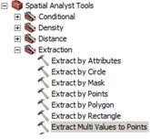
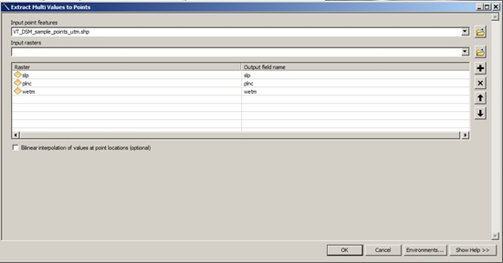
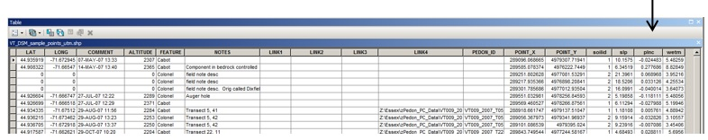

# Extracting Point Data from a Raster in ArcGIS

This section discusses the use of the "Extract Multi Values to Points" tool, which assigns the cell value of specified raster data sets to existing points. The "Extract Values to Points" and "Sample" tools achieve similar results. These tools are described in the ESRI help section [An Overview of the Extraction Tools](http://help.arcgis.com/en/arcgisdesktop/10.0/help/index.html#/An_overview_of_the_Extraction_tools/009z00000028000000/).  

To start, assume you have 50 observations across an area of interest in an ArcGIS point file that has numerous observed soil properties. In your analysis, you will also consider such variables as slope, profile curvature, solar insolation, topographic wetness index, relative position, and elevation.
 
The Extract Multi Values to Points tool is the most expedient way to populate raster values to a point file. If your spatial extent is large and you have many raster layers; e.g., 12, it may be best to proceed using 3 or 4 rasters at a time and running the tool 3 or 4 times.  

The **Extract Multi Values to Points** tool is in the **Extraction** tool box in **Spatial Analyst Tools.**  

  

Select your point file and the associated raster files of interest as noted in the following graphic.  

  

The resulting point file has the corresponding cell values for slope, profile curvature, and wetness index attached to the point file as columns in the shapefile table.  

  

The resulting point file may also be saved as a text file for use in R.
