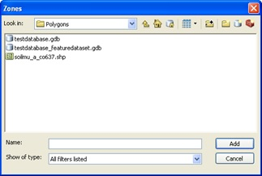
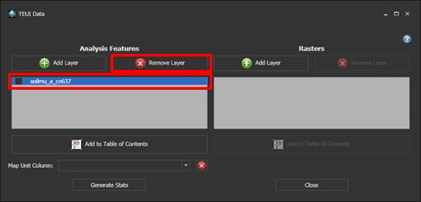
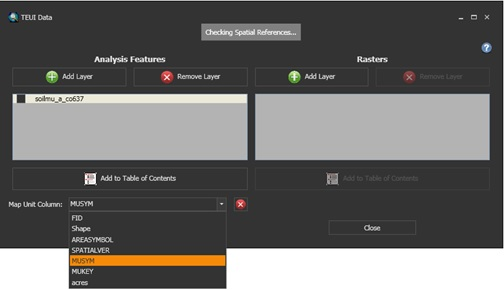
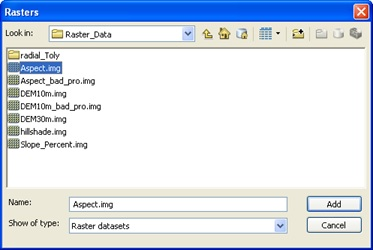
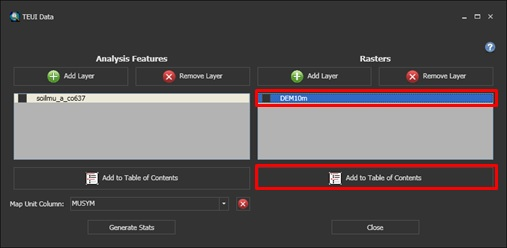
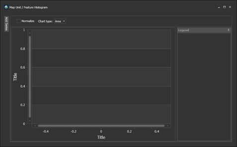
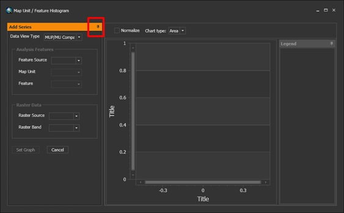
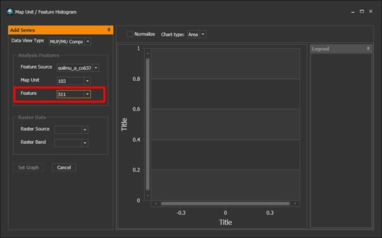
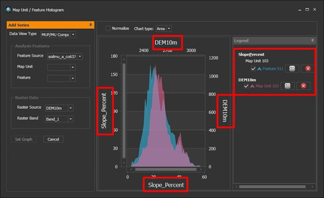

```{r setup, echo=FALSE, warning=FALSE, message=FALSE}
# setup
knitr::opts_chunk$set(message=FALSE, warning=FALSE, background='#F7F7F7', fig.align='center', fig.retina=2, dev='png', tidy=FALSE, verbose=FALSE, antialias='cleartype', cache=FALSE)
```

  


# TEUI toolkit

The TEUI toolkit works in a similar manner to *Zonal Statistics as Table* within ArcGIS, with the added benefit of interactive graphics to aid in the assessment. TEUI is an ArcGIS Add-in and may be installed without Administrator privilege. Additional information and downloads are available here:  

[http://www.fs.fed.us/eng/rsac/programs/teui/downloads.html](http://www.fs.fed.us/eng/rsac/programs/teui/downloads.html)  

One advantage of TEUI is the ability to output tabular data at both the map unit and polygon level with one operation. SECTIONS 2 - 5 of the TEUI User Guide are excerpted below.  

**SECTION 2. Creating and opening an existing project**

The Toolkit requires the user to specify a folder location to store the database that contains the statistics and the file location of the data used to create them. This database can be an existing project folder location, but it is recommended that a new folder be created to reduce the number of extraneous files in a folder with other data.  

**Create a New Toolkit Project**  

 1.  On the TEUI Toolbar, select the Folder icon.
  

 2. A dialog window will appear.  

 
 3. Select Browse...  

 4.	In the Browse for Folder dialog, navigate to a location of your choice and select “Make New Folder”  

 5.	Type in an appropriate name for your project  

 6.	Click **OK**
  
**Open an Existing Toolkit Project**  

 1.  On the TEUI Toolbar, select the Folder icon   
 
 
 2.  A dialog window will appear.  
   
 
If the project was recent, click on the project in the Recent dialog box and click **Open**. If it is older and does not appear in the dialog box, select **Browse** and navigate to the project folder location. Select the project and click **OK**.  

**SECTION 3. Manage geospatial data and calculate statistics**

Managing project data with version 5.0 is very simple. The user simply points the program to the file location of the data on your computer that is to be used in the analysis.  

Note: _If you move the geospatial data used in an existing Toolkit project, you will need to re-link the Toolkit to the data when opening that project._  

**Add Analysis Features to a Toolkit Project**  

 1.  On the TEUI Toolbar, select the Data Manager icon.   
 2.  The Data Manager dialog window will appear.  
 
   
 
**Analysis Features**: are zones within which you would like to generate statistics. These features
can be feature classes such polygons or points (line features will be available soon) as a shapefile (.shp), as a feature class within a file geodatabase, or within a feature dataset within a file geodatabase. Analysis features can also be in the form of a discrete raster. The value field will be used as the identifier.  

**Rasters**: are the raster data that are to be used to generate the descriptive statistics. An example would be a digital elevation model (DEM), percent slope, aspect, or land use for a discrete raster.  

 3.  In the Analysis Features area, click on the Add Layer button.    
 
  

 4.  A data navigation window will appear. Navigate to the analysis layer you wish to use and select **Add**. You can add as many data layers as you wish to analyze.  

  

Note: _All data layers to be analyzed (analysis features and raster data) must have the same geographic coordinate system and projection as each other. You will receive a warning if they are different._   

**Remove Analysis Features from a Toolkit Project**  

 1. To remove an analysis layer from the Data Manager, click on the layer you wish to remove in the grey layer list, and click **Remove**. Click OK when prompted that this is correct.  
 
  
  

**Add Analysis Features to the ArcMap Table of Contents**  

 1.  To add the selected layer to the ArcMap table of contents, **select the layer you wish to add** by clicking on it in the grey layer list, and click the **Add to Table of Contents** button.    
 
  

**Choose a Map Unit**

*In some instances, such as TEUI mapping or Soil Survey, you may wish to identify individual polygon features as belonging to a specific map unit. This is simply a repeating identifying symbol or value which will be used to aggregate the statistics of the polygons belonging to that group. You do not need to select a map unit column in order to run the Toolkit. The symbol must be present as an attribute column in either the feature class layer or as an attribute in the VAT table of a discrete raster.* 

 1. Select the Analysis Feature layer that you wish to add a Map Unit symbol for.  

 2.	Select the appropriate map unit column attribute name for your map unit symbol in the drop down menu    
  
 

**Add Raster Data to the Toolkit Project**  

 1.  To add raster data to your Toolkit project, select the Add Layer button under the Raster heading  
  

  2.  In the Browse to Raster file location dialog window, navigate to the file location of the raster data you wish to add to the Toolkit project.  
  
  

 3.  Select the layer you wish to add and select the **Add** button.    

**Add Raster Data to the ArcMap Table of Contents**  


1.  To add raster data to your ArcMap Table of Contents, first select the layer or layers you wish to add by clicking on them in the grey layer list under the **Rasters** section.    


  

2.  Click the **Add to Table of Contents** button.  

3.	To add multiple raster data layers at once, hold down the **control button** while
**selecting the individual layers** you wish to add.  

**Calculate Statistics**  

 1.  To calculate statistics, you must first select the analysis feature layers and raster data layers you wish to run statistics on by **checking the box next to each layer**.  
 
    

 2.  Click on the **Generate Stats** button. Select **Yes** when prompted by the time warning that appears. This process may take a significant amount of time depending on the amount of data selected to be run.  
 
  

 3.  A dialog will appear which informs the user of the duration, features or rasters being used, and the progress. The tool can calculate more than 1 million cells a second.  
 
  

 4.  When the statistics run is finished, click **OK**.
 
**SECTION 4. Create and Visualize Graphs and Tables**  

A primary Toolkit feature is the ability to view the generated statistics in both a graph and table format. The Toolkit creates zonal statistics for the analysis features and raster data selected in the data manager. The results can be visualized in graph form or as summary table both by individual feature or by map unit if one was chosen.  

**Open a graph window**  

 1.  To create a graph, click on the **graph button** on the Toolkit Toolbar.  
 
  

 2.  A blank graph window will appear. You can open as many individual graph windows as you want.  
 
  

 3.  Click on the **Add Series** Tab in the upper left corner of the graph window.  
 
  

 4.  The Add Series window pane will open up. You can **pin the window open** by clicking on the sideways pin in the upper right hand of the Add Series window pane or close it by clicking on the vertical pin.  
 
  

 5.  In a step wise fashion, select… MUP\MU Comparison: This is the default option. This allows the greatest flexibility when comparing individual polygons against other individual polygons, individual polygons against map units, or map units against map units (if chosen).  
 
MU Comparison: This data view type contains unique default graphs when comparing map units or other aggregated statistics types. These graphs have the mean (solid line), range (darker colored area), and standard deviation (lighter colored area) on the same graph, for each polygon within a map unit.  

  

Chart type: You can choose the type of graph that best represents your data. The default is the area chart type.  
 
**Area chart**  
    

**Bar chart**  

    

**Point chart**  

  

**Line chart**  

  

**Radial chart**  

  

Feature Source: Choose which feature analysis layer you would like to graph. Polygons or discrete raster  

  

Map Unit: Chose from which map unit you would like to select a polygon. Alternatively, select just
the map unit you want to graph as a whole (i.e., don’t select an individual feature below). Also, you can leave this option blank which is the default.  

  

Feature: Select the individual feature you would like to view statistics for. This is the Feature ID or FID.  

  

Raster Source: Select the raster layer you wish to view the statistics from.  

  

Raster Band: Select the raster band from the raster layer.  

  

Set Graph: Click once finished.  

  

**Common tasks with graphs**

**How do I add more individual features or map units to same graph?**
Within the Add Series pane, simply select a new feature source (if desired), map unit, feature, or raster source. Click Set Graph and the new feature or map unit will be added to the graph and the legend in a new color.  

  

**Can I add multiple axes to the graph? For example, a graph of elevation and percent slope?**  
To add another axis to your graph window, simply select the feature source, a map unit if desired, or a feature if desired, but select a new raster data source. You will notice in the graph legend map units and features are separated by the raster layer.  

  

**Is there a way to find a specific value on the graph?**  
If you hover over a specific spot in the graph, a line and window will appear with the specific values that your cursor is on. This is valuable if you are trying to identify outliers in your data.  

  

**Can I normalize the data ranges?**  
To normalize data so that the data ranges are comparable within the graph window, check the normalize button at the top of the graph.  

  

**How do I remove a graph series from the graph window?**  
Simply hit the red X next to the graph series you would like to remove in the graph legend.  

  

**How do I view the tabular data associated with each map unit or feature in the graph window?**  
To view the tabular and descriptive statistics of each map unit or feature in the graph window,
simply select the table icon next to the data series in the graph legend.  

  

**SECTION 5. Exporting Statistics Data to Excel**  

The statistical data summaries produced by the toolkit can be exported to excel as a .CSV file for further use.  

**Export individual feature statistics**  

  

 1.  On the main menu bar, click the **export table button** with the green arrow. Note this may take a little while as the program is gathering up the data.  

 2.	Navigate to the location you would like to save the .CSV file. Give the file a name and click
**Save**.  

  

**Export map unit feature statistics**  

  

 1.  On the main Toolkit menu bar, click the **export map unit table button** with the blue arrow. Note this may take a little while as the program is gathering up the data.  

 2.	Navigate to the location you would like to save the .CSV file. Give the file a name and click **Save**.  


# References  

Vaughan, R., & Megown, K., 2015. The Terrestrial Ecological Unit Inventory (TEUI) Geospatial Toolkit: user guide v5.2. RSAC-10117-MAN1. Salt Lake City, UT: U.S. Department of Agriculture, Forest Service, Remote Sensing Applications Center. 40 p. [http://www.fs.fed.us/eng/rsac/programs/teui/about.html](http://www.fs.fed.us/eng/rsac/programs/teui/about.html)
