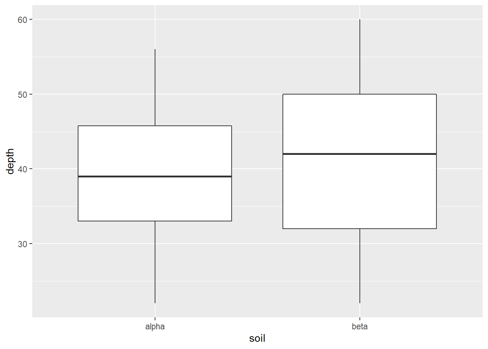
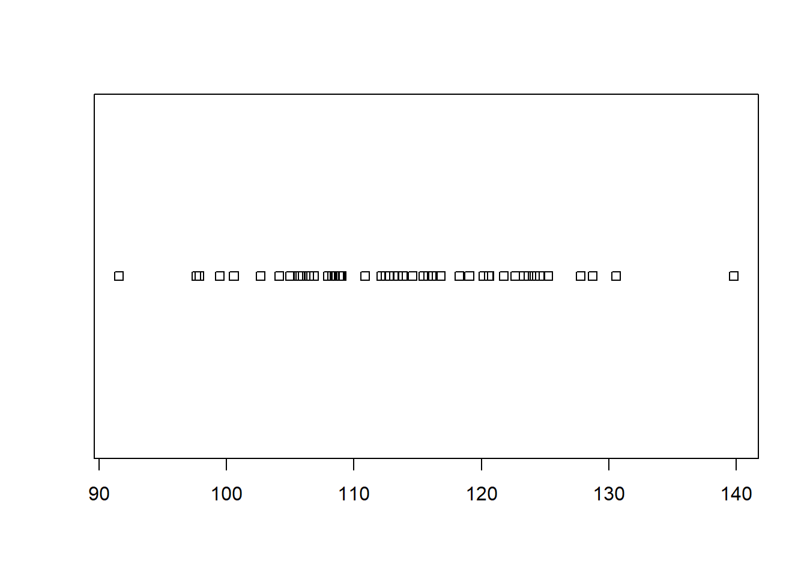
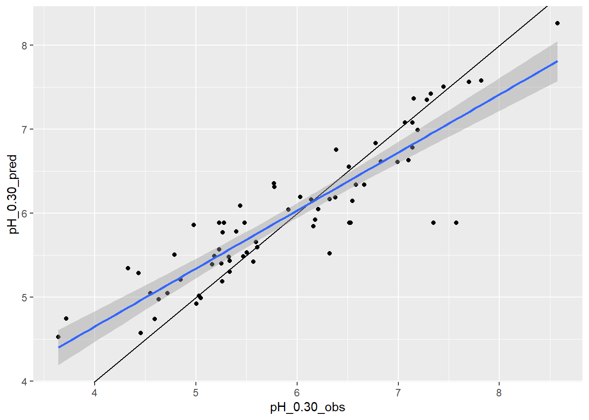

# Uncertainty {#uncertainty}


## Introduction
 
Validating and assessing the uncertainty of a model is just as, if not more important, than generating the model itself. Validation quantifies the model's ability to explain variance in the data while uncertainty quantifies the confidence of model prediction. Uncertainty and validation assessments enable the end user to better understand model error, the nature and distribution of the input data, and the overall accuracy and spatial applicability of the model. Within a soil model, there are several sources of error:  

- Measurement errors
- Interpretation errors
- Digitization errors
- Classification errors
- Generalization errors
- Interpolation errors

Errors are simply the difference between reality and our representation of reality. Assessing the data structure with simple statistical measures such as mean, median and mode can be useful for understanding the central tendency of the data, but more complicated calculations are needed to get at dispersion or the variation of a property within a population to further assess error and uncertainty (Zar, 1999).

**Measure of Dispersion**

- Range: The difference between the highest and lowest values measured or observed. Not always reliable because it can include outliers, error, or misclassified data. 
- Quantiles: These refer to 25% increments in the rank of observations. Typically, the 25th and 75th quantiles are used to represent the spread of the most typical values around the central tendency.

**Measure of Variation**
  * Variance: The deviation of from the mean is calculated as sum of squares (SS) to use absolute deviation (eliminate any distinction between negative and positive correlation). $variance (sample) = \frac{SS}{n-1}$
  
- $SS = \sum{(X - x)^2}$
- Standard deviation: Used to return variance to the original units $sd = \sqrt{\frac{SS}{n-1}}$
- Coefficient of variation: Scale standard deviation with mean so that multiple properties can be compared $CV = \frac{SD}{x}$

**Measures of Certainty**

- Standard Error: represents the variance of the mean that would be found with repeated sampling. Estimated by dividing standard deviation by the square root of n. The concept of standard error is important for hypothesis testing.
- Confidence interval: Interval in which you are confident that a given percentage (known as the confidence limit 95, 80, 75%) of the population lie. If a normal distribution is assumed, for a 95% confidence interval, it can be estimated that the value is 95% likely to fall between as SD * 1.96 +/- mean.   


### Exercise - Dispersion

Create an example data-set and evaluate dispersion.


```r
library(ggplot2)
```

```
## Warning: package 'ggplot2' was built under R version 4.0.3
```

```r
# set random seed, so that we all get the same results
set.seed(123)

# create a sample dataset with 10 values between 20 - 60
d1 <- data.frame(
  soil = "alpha",
  depth = sample(20:60, size = 10, replace = TRUE)
  )

# create a sample dataset with 100 values between 20 - 60
d2 <- data.frame(
  soil = "beta",
  depth = sample(20:60, size = 100, replace = TRUE)
  )

# combine d1 and d2
d3 <- rbind(d1, d2)

aggregate(depth ~ soil, data = d3, quantile)
```

```
##    soil depth.0% depth.25% depth.50% depth.75% depth.100%
## 1 alpha    22.00     33.00     39.00     45.75      56.00
## 2  beta    22.00     32.00     42.00     50.00      60.00
```

```r
# examine box plots
ggplot(d3, aes(x = soil, y = depth)) + geom_boxplot()
```



Dispersion or variance is a characteristic of the population being evaluated. While more or better sample collection might give you better precision of those estimates, we would not expect them to change the dispersion calculated. Conversely, measures of certainty of the central tendency (how sure are you of the typical value reported) depends both on the characteristic dispersion/variance and the number of samples collected.

  
### Exercise - Variation and Certainty

Create an example data-set and and evaluate variation and certainty.


```r
# calculate the mean of depth
m <- mean(d2$depth)
 
# subtract mean from each value and square (i.e. residuals)
d2$S <- (d2$depth - m)^2
 
#calculate overall sum of squares
SS <- sum(d2$S)
 
#calculate sample variance (length gives us the total number of sample/observations)
SS / (length(d2$depth) - 1)
```

```
## [1] 113.3425
```

Note the differences in range and variance calculated for Depth in both examples (10 samples vs. 100)


```r
aggregate(depth ~ soil, data = d3, var)
```

```
##    soil    depth
## 1 alpha 125.5667
## 2  beta 113.3425
```

Now Compare Standard Error (standard deviation / square root of n)


```r
SE <- function(x) sd(x) / sqrt(length(x))

aggregate(depth ~ soil, data = d3, SE)
```

```
##    soil    depth
## 1 alpha 3.543539
## 2  beta 1.064624
```

Why are the standard errors different?


## Theory of Uncertainty
  
At it's most basic level, uncertainty is simply a lack of certainty. In soil survey, uncertainty encompasses both of these aspects:

1. you've gathered multiple observations and you need to describe them in relation to one another, and 
2. you must predict a property or characteristic at unobserved locations. 

It is difficult to quantify the knowledge we have about data and information uncertainty. While we may have good data of the accuracy of our GPS, how likely are we to include that in our estimates of model error? How important is it? In other disciplines, they spend a lot of time quantifying and tracking measurement error. In soil science, we tend to treat measurement as having an exact known location and value. Given the unknowns in mapping and predicting soil properties, this is a reasonable treatment of relatively small levels of error.

When using secondary information as data (or data that is actually a prior prediction or result of a model, including soil components), considering incorporated error can be crucial. One way to deal with this is through re-sampling an alternate way is to through error propagation theory. The most common way to deal with this in soil survey and digital soil mapping is to assess error through model validation.
	
**Explanatory vs. Predictive Modelling**

While explanatory and predictive modeling can use the same types of models, data and even questions, the errors and uncertainty are important for different reasons

**Explanatory or Descriptive** - data are collected and analyzed in order to test causal hypothesis and observe correlations and relationships between data element. Often used at the beginning phases of soil-landscape exploration. How does the soil relate to each of the soil forming factors?

**Predictive** - applying a model or algorithm to data for the purpose of making a prediction (in new or unknown locations) (Shueli, 2010).
  
  
## Resampling to Estimate Uncertainty
  
When calculating many basic statistical parameters, the assumption is that the data is parametric. That implies that the data is continuous (ratio or interval) and normally distributed. This is rarely the case with soil data. Soil properties are often not normally distributed (you cannot have less that 0% organic matter, for instance) and often we are trying to predict soil taxa or other nominal classes. 

Re-sampling is a general term that defines any procedure to repeatedly draw samples form a given data-set. You are essentially pretending to collect a series of separate samples from your sample set then calculating a statistic on that sample. Re-sampling techniques can be used on known and unknown data distributions for uncertainty estimation and validation (Good, 2001).  


### Exercise - Resampling


```r
# this bootstrap is estimating the uncertainty associated with the variance of d2$depth
# an example of getting a confidence interval through bootstrapping (no assumption of a normal distribution)

# abbreviate our data to simply the commands
d <- d2$depth
n <- length(d)

# set number of iterations
N <- 50

# create a data frame to store the results
boot_stats <- data.frame(
  vars = numeric(N),
  means = numeric(N)
  )

# for each instance (i) in the set from 1 to N (50 in this case)
for (i in 1:N) {
  # create a new variable dB from each bootstrap sample of d
  boot.sample = sample(d, n, replace = TRUE) 
  boot_stats$means[i] = mean(boot.sample)
  boot_stats$vars[i] = var(boot.sample)
  }

quantile(boot_stats$vars)
```

```
##        0%       25%       50%       75%      100% 
##  91.54293 107.14240 112.61833 120.47970 139.81818
```

```r
stripchart(boot_stats$vars)
```



```r
# Traditional Approach
ci <- c(
  # lower 5th
  l = mean(d) - 1.96 * sd(d) / sqrt(n),
  # upper 95th
  u = mean(d) + 1.96 * sd(d) / sqrt(n)
  )

# Compare Bootstrap to Confidence Interval
quantile(boot_stats$means, c(0.05, 0.95))
```

```
##     5%    95% 
## 39.663 43.005
```

```r
ci
```

```
##        l        u 
## 39.38334 43.55666
```

## Performance Metrics

**Numerical**

- Coefficient of variation ($R^2$): % of variance explained
- Mean Error (ME): average error
- Root Mean Square Error (RMSE): average residual

**Categorical** (derivatives of confusion matrix)

- Overall Accuracy: % of observations that were correctly classified, for all classes
- Precision (i.e. user's accuracy, errors of commission (Type II): % of observations that were correctly classified, for an individual class
- Sensitivity (i.e. producer's accuracy, errors of omission (Type I)): % of predictions that were correctly classified, for an individual class


Confusion Matrix | Observed           |                     |
-----------------|--------------------|---------------------|
**Predicted**    | No                 | Yes                 |
No               | True Negative (TN) | False Negative (FN) |
Yes              | False Positive (FP)| True Positive (TP)  |


### Exercise - Numeric Metrics


```r
### Numeric error metrics

### Linear model example

# Create a Ficticous Data-set
d_num <- data.frame(
  depth = 21:60 + rnorm(40, mean = 0, sd = 10),
  slope = 60:21
  )

num_lm <- lm(depth ~ slope, data = d_num, y = TRUE)

# R2
summary(num_lm)$r.squared
```

```
## [1] 0.5795156
```

```r
# or

predicted <- num_lm$fitted.values
observed <- num_lm$y

cor(predicted, observed)^2
```

```
## [1] 0.5795156
```

```r
# ME
mean(predicted - observed)
```

```
## [1] 2.220446e-16
```

```r
# RMSE
sqrt(mean((predicted - observed)^2))
```

```
## [1] 11.48239
```


### Exercise - Categorical Metrics


```r
# Create a Ficticous Data-set
r <- runif(175)
idx <- sample(which(r > 0.5), 75)
r <- r[-idx]

d_cat = data.frame(
  predicted = r, 
  observed  = (r + rnorm(100, sd = 0.2)) > 0.5
  )

# Compute Confusion Matrix
cm <- table(predicted = d_cat$predicted > 0.5, observed = d_cat$observed)
print(cm)
```

```
##          observed
## predicted FALSE TRUE
##     FALSE    66   14
##     TRUE      2   18
```

```r
# or

library(caret)
```

```
## Loading required package: lattice
```

```r
confusionMatrix(cm, positive = "TRUE")
```

```
## Confusion Matrix and Statistics
## 
##          observed
## predicted FALSE TRUE
##     FALSE    66   14
##     TRUE      2   18
##                                           
##                Accuracy : 0.84            
##                  95% CI : (0.7532, 0.9057)
##     No Information Rate : 0.68            
##     P-Value [Acc > NIR] : 0.0002249       
##                                           
##                   Kappa : 0.5918          
##                                           
##  Mcnemar's Test P-Value : 0.0059595       
##                                           
##             Sensitivity : 0.5625          
##             Specificity : 0.9706          
##          Pos Pred Value : 0.9000          
##          Neg Pred Value : 0.8250          
##              Prevalence : 0.3200          
##          Detection Rate : 0.1800          
##    Detection Prevalence : 0.2000          
##       Balanced Accuracy : 0.7665          
##                                           
##        'Positive' Class : TRUE            
## 
```

```r
# Examine threshoold
ggplot(d_cat, aes(x = predicted, color = observed)) +
  geom_density(lwd = 1.5)
```



```r
# Trade Precision for Sensitivity by Varying the Threshold 
cm <- table(predicted = d_cat$predicted > 0.4, observed = d_cat$observed)
confusionMatrix(cm, positive = "TRUE")
```

```
## Confusion Matrix and Statistics
## 
##          observed
## predicted FALSE TRUE
##     FALSE    56    8
##     TRUE     12   24
##                                           
##                Accuracy : 0.8             
##                  95% CI : (0.7082, 0.8733)
##     No Information Rate : 0.68            
##     P-Value [Acc > NIR] : 0.005378        
##                                           
##                   Kappa : 0.5552          
##                                           
##  Mcnemar's Test P-Value : 0.502335        
##                                           
##             Sensitivity : 0.7500          
##             Specificity : 0.8235          
##          Pos Pred Value : 0.6667          
##          Neg Pred Value : 0.8750          
##              Prevalence : 0.3200          
##          Detection Rate : 0.2400          
##    Detection Prevalence : 0.3600          
##       Balanced Accuracy : 0.7868          
##                                           
##        'Positive' Class : TRUE            
## 
```

## Validation
  
Validation refers to the process and the result of a process where the validity of a model is tested. That is, how well does the model represent reality? There are varying degrees of formality and thoroughness that can be used in validation. While multiple stages of the modeling process can be validated, usually it's the output of the model that is investigated and reported. You can group initial validation into three broad groups: Expert evaluation, Theoretical Analysis and Prediction Accuracy.  

**Expert Evaluation:**  In this case, the model output is inspected by an expert user. The first evaluator will be you (the developer), but ideally an outside expert will be utilized. This is often a step in an iterative process. Evaluate the model output, does it make sense, do you see things that need to be improved? Then make changes to the model to improve the output.  

**Theoretical Analysis:** compare the results of the model to what is theoretically possible. In systems modeling, this might include diagnostics statistics including residual analysis, cross-correlation of variables and outputs, sensitivity analysis and model analysis such as Akaike Information Criterion (AIC). This can also include simple comparison of output to known possible values. This is especially important for linear regression where the slope of the model is assumed to be steady no matter the values of the dependent variables.  

**Prediction Accuracy**: The correctness of the parameter being predicted by the model (soil taxa, property etc.). Ideally this is done with an independent set of data.

In soil science, we typically use the term model validation to refer to a statistical analysis that assesses how well a model will predict at an unknown location. A complete model should have a formal statistical evaluation that can be reported and stored as model and output meta-data. That is the portion of validation we will focus. For this discussion, validation can be thought of as an assessment of prediction error and variance.

**Three types of validation used in the course**

- Apparent - Performance on sample used to develop model
- Internal - Performance on population underlying the sample
- External - Performance on related (similar/adjacent) but independent population


## Apparent Validation
  
In this exploratory and explanatory phase you are looking for relationships that can be used later for predictive purposes.

- Use Goodness of fit tests on all the data in your sample
    - Correlation (R2, rho, etc.)
    - P-values (test questions about individual or combinations of variables)
- Analyze Residuals (distribution of model errors) to diagnose modeling problems. One or more of these issues indicate that one or more important variables was omitted from the model or that an incorrect functional form was used (linear when the function should be non-linear)
    - Heteroscedasticity
    - Normality
    - Spatial distribution (auto-correlation)

## Inherent Validation 

### Split-sample - A single partition of the data into a learning and a calibration set.

- Achieve an independent validation by partitioning the samples into calibration or training and validation data-sets (70% of the samples available are recommended for calibration)
    - Build model on calibration (training) data-set
    - Test model on validation (test) data-set
    - Report accuracy on the validation data-set
- This method is relatively simple (conceptually and computationally). Results depend on having an adequate sample size to both develop and test the model.

### Cross-validation - Alternate development and validation

**Leave-One-Out Cross-Validation (LOOCV)**

- One observation is used for testing and all others are used to develop model
- Repeat n (total number of observations) times
- Average error over n
- The mean of the accuracy is the expected accuracy of the model (this assumes that new data is from the same population) (Efron, 1983)

**k-fold Cross-Validation (k-fold) CV**

- Randomly divide observations into calibration and validation sets.
- Repeat k times, each time one k group is used for error estimates
- Average error of k
- Less computationally intensive than LOOCV, but it is more robust and can be done with smaller sample sizes than a simple split.
- Several R packages have tools to cross-validate predictions, including: `DAAG` and `boot` for `lm()` and `glm()` objects, `caret`, `rms`,


```r
### Linear model example
# Create folds
folds <- createFolds(d_num$depth, k = 10)

# Cross validate
lm_cv <- lapply(folds, function(x) {
  train   = d_num[-x,]
  test    = d_num[x,]
  model   = lm(depth ~ ., data = train, y = TRUE)
  actual  = test$depth
  predict = predict(model, test)
  RMSE    = sqrt(mean((actual - predict)^2, na.rm = TRUE))
  R2      = cor(actual, predict, use = "pairwise")^2
  return(c(RMSE = RMSE, R2 = R2))
  }
  )

# Convert to a data.frame
lm_cv <- do.call(rbind, lm_cv)

# Summarize results
summary(lm_cv)
```

```
##       RMSE              R2         
##  Min.   : 5.115   Min.   :0.07494  
##  1st Qu.: 8.806   1st Qu.:0.76935  
##  Median :11.283   Median :0.82930  
##  Mean   :11.552   Mean   :0.74810  
##  3rd Qu.:15.006   3rd Qu.:0.93548  
##  Max.   :17.183   Max.   :0.98633
```

  
### Subsample (Resampling or sample simulation)

In this method, the 'leave-out' method can be random (Bootstrap) or observation selection can use a more sophisticated method to select observations to represent the population including Monte Carlo (Molarino, 2005) and .632+bootstrap of Efron & Tibshirani (1997). The details of those aren't important, except to know that they can give you a better idea of the robustness of your model.

- As with re-sampling for uncertainty estimation, observations are repeatedly sampled
    - Select a number of samples (Randomly or from known distribution).
    - Develop the model
    - Estimate model accuracy on unselected samples
    - Repeat the process (with independent sample) a large number of times, 500 - 5,000. 
    - The expected model accuracy is then the mean of the estimates. 

	
**NOTE:** The BEST model should not be assumed to be the one that makes the 'truest' predictions. Beware of over-fitting. When a model is over-fit, it predicts due to very specific "quirks" in the calibration data set and not due to explanatory relationships that will apply to validation and independent data-sets. One strategy to avoid this situation is to build models with as few variables as possible. Parsimonious models (those that use the least amount of information possible to obtain the same result or convey the same meaning) often have higher predicative validity. The use of metrics such as Akaike's Information Criterion (AIC) can be helpful for balancing error and parameter minimization.


### External Validation  

In this case, an independent data-set is used as the test case.  

- Independent observations predicted with model
- Errors (ME, RMSE) calculated on predicted vs. actual
- Some exploratory analysis can be helpful to diagnose and explain model performance.
  
The use of validation will be demonstrated as part of each modeling section. The size of the data-set used, understanding of the variables involved and the nature of the statistical models and algorithms used all influence which validation techniques are most convenient and appropriate.


## Additional reading

James, G., D. Witten, T. Hastie, and R. Tibshirani, 2014. An Introduction to Statistical Learning: with Applications in R. Springer, New York. [http://www-bcf.usc.edu/~gareth/ISL/](http://www-bcf.usc.edu/~gareth/ISL/)

Hastie, T., R. Tibshirani, and J. Friedman 2009. The Elements of Statistical Learning: Data Mining, Inference, and Prediction. Springer, New York. [http://statweb.stanford.edu/~tibs/ElemStatLearn/](http://statweb.stanford.edu/~tibs/ElemStatLearn/)


## References (Uncertainty)

Efron, B., Tibshirani, R.J., 1993. An introduction to the bootstrap. Monographs on Statistics and Applied Probability, vol. 57. Chapman & Hall, London, UK.

Good, P.I., 2001. Resampling methods. Birkhäuser.

James, G., D. Witten, T. Hastie, and R. Tibshirani, 2014. An Introduction to Statistical Learning: with Applications in R. Springer, New York. [http://www-bcf.usc.edu/~gareth/ISL/](http://www-bcf.usc.edu/~gareth/ISL/)

Molinaro, A. M. (2005). Prediction error estimation: a comparison of resampling methods. Bioinformatics, 21(15), 3301-3307. doi:10.1093/bioinformatics/bti499

Shmueli, G.. (2010). To Explain or to Predict?. Statistical Science, 25(3), 289:310. Retrieved from http://www.jstor.org/stable/41058949

Zar, J.H., 1999. Biostatistical analysis. Pearson Education India.


  
