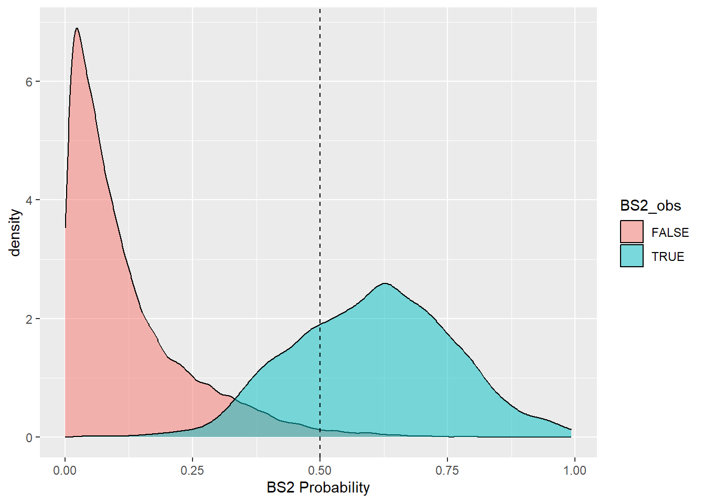

# Uncertainty {#uncertainty}


## Introduction

Validating and assessing the uncertainty of a model is just as, if not more important, than generating the model itself. Validation quantifies the model's ability to explain variance in the data while uncertainty quantifies the confidence of model prediction. Uncertainty and validation assessments enable the end user to better understand model error, the nature and distribution of the input data, and the overall accuracy and spatial applicability of the model. Within a soil model, there are several sources of error:

-   Measurement errors
-   Interpretation errors
-   Digitization errors
-   Classification errors
-   Generalization errors
-   Interpolation errors
-   Semantic errors

Errors are simply the difference between reality and our representation of reality. Assessing the data structure with simple statistical measures such as mean, median and mode can be useful for understanding the central tendency of the data, but more complicated calculations are needed to get at dispersion or the variation of a property within a population to further assess error and uncertainty (Zar, 1999).

**Measure of Dispersion**

-   Range: The difference between the highest and lowest values measured or observed. Not always reliable because it can include outliers, error, or misclassified data.
-   Quantiles: These refer to 25% increments in the rank of observations. Typically, the 25th and 75th quantiles are used to represent the spread of the most typical values around the central tendency.

**Measure of Variation** \* Variance: The deviation of from the mean is calculated as sum of squares (SS) to use absolute deviation (eliminate any distinction between negative and positive correlation). $variance (sample) = \frac{SS}{n-1}$

-   $SS = \sum{(X - x)^2}$
-   Standard deviation: Used to return variance to the original units $sd = \sqrt{\frac{SS}{n-1}}$
-   Coefficient of variation: Scale standard deviation with mean so that multiple properties can be compared $CV = \frac{SD}{x}$

**Measures of Certainty**

-   Standard Error: represents the variance of the mean that would be found with repeated sampling. Estimated by dividing standard deviation by the square root of n. The concept of standard error is important for hypothesis testing.
-   Confidence interval: Interval in which you are confident that a given percentage (known as the confidence limit 95, 80, 75%) of the population lie. If a normal distribution is assumed, for a 95% confidence interval, it can be estimated that the value is 95% likely to fall between as SD \* 1.96 +/- mean.

### Examples - Dispersion

Below is a simulated example demonstrating the affect of sample size and standard deviation on quantile estimates.


```r
library(dplyr)
library(ggplot2)


# create 50 random pH samples of 10, 30, 60, and 100
y   <- c(10, 30, 60, 100)
lab <- paste0("n = ", y)


f <- function(x, n, sd) {
  idx <- rnorm(n, mean = 7, sd = sd)
  tmp <- data.frame(iteration = factor(x, levels = 1:30), n = factor(n, levels = y, labels = lab), sd = paste0("sd = ", sd), pH = idx)
  return(tmp)
}

# standard deviation of 1
test <- mapply(FUN = f, rep(1:30, times = 4), rep(y, each = 30), sd = 1, SIMPLIFY = FALSE)
test <- do.call("rbind", test)

# standard deviation of 1
test2 <- mapply(FUN = f, rep(1:30, times = 4), rep(y, each = 30), sd = 2, SIMPLIFY = FALSE)
test2 <- do.call("rbind", test2)

test <- rbind(test, test2)


# examine summary statistics
test %>%
  group_by(iteration, n, sd) %>%
  summarize(med = median(pH)) %>%
  group_by(sd, n) %>%
  summarize(across(med, list(min = min, mean = mean, max = max)))
```

```
## # A tibble: 8 × 5
## # Groups:   sd [2]
##   sd     n       med_min med_mean med_max
##   <chr>  <fct>     <dbl>    <dbl>   <dbl>
## 1 sd = 1 n = 10     6.29     6.93    7.59
## 2 sd = 1 n = 30     6.55     6.98    7.39
## 3 sd = 1 n = 60     6.65     7.01    7.38
## 4 sd = 1 n = 100    6.81     6.98    7.21
## 5 sd = 2 n = 10     5.72     6.97    8.91
## 6 sd = 2 n = 30     5.80     6.91    7.92
## 7 sd = 2 n = 60     6.05     6.98    7.53
## 8 sd = 2 n = 100    6.30     7.01    7.47
```

```r
# examine box plots
ggplot(test, aes(x = iteration, y = pH)) +
  geom_boxplot() +
  facet_wrap(~ n + sd, ncol = 2, )
```


The results show that quantile estimates are more variable with smaller sample sizes and larger inherent standard deviations. This example demonstrates how our results would differ if we were to sample the same soils again. We would be "uncertain" of our results unless the underlying standard deviation is small or our sample size was large. Both factors would also impact how certain we could be that 2 or more classes of soils are different.

### Examples - Variation and Certainty

Demonstration of how to calculate variance.


```r
# calculate the mean
mu <- mean(test$pH)

# subtract mean from each value and square (i.e. residuals)
test$S <- (test$pH - mu)^2

# calculate overall sum of squares
SS <- sum(test$S)

# calculate sample variance (length gives us the total number of sample/observations)
SS / (length(test$pH) - 1)
```

```
## [1] 2.5137
```

Note below how our estimate of the variance can vary widely, particularly for simulated datasets with a inherent standard deviation of 2.


```r
test %>%
  group_by(iteration, n, sd) %>%
  summarize(var = var(pH)) %>%
  group_by(sd, n) %>%
  summarize(across(var, list(min = min, mean = mean, max = max)))
```

```
## # A tibble: 8 × 5
## # Groups:   sd [2]
##   sd     n       var_min var_mean var_max
##   <chr>  <fct>     <dbl>    <dbl>   <dbl>
## 1 sd = 1 n = 10    0.398    1.02     1.88
## 2 sd = 1 n = 30    0.488    0.968    1.57
## 3 sd = 1 n = 60    0.722    1.01     1.69
## 4 sd = 1 n = 100   0.732    1.02     1.39
## 5 sd = 2 n = 10    0.492    4.17     7.64
## 6 sd = 2 n = 30    1.99     4.19     6.37
## 7 sd = 2 n = 60    3.17     4.03     5.47
## 8 sd = 2 n = 100   3.06     3.94     4.85
```

Now let's see Standard Error (standard deviation / square root of n) below. The results show how our estimates become more precise as the sample size increases.


```r
SE <- function(x) sd(x, na.rm = TRUE) / sqrt(length(!is.na(x)))

test %>%
  group_by(iteration, n, sd) %>%
  summarize(SE = SE(pH)) %>%
  group_by(sd, n) %>%
  summarize(across(SE, list(min = min, mean = mean, max = max)))
```

```
## # A tibble: 8 × 5
## # Groups:   sd [2]
##   sd     n       SE_min SE_mean SE_max
##   <chr>  <fct>    <dbl>   <dbl>  <dbl>
## 1 sd = 1 n = 10  0.199    0.314  0.433
## 2 sd = 1 n = 30  0.127    0.178  0.229
## 3 sd = 1 n = 60  0.110    0.129  0.168
## 4 sd = 1 n = 100 0.0855   0.101  0.118
## 5 sd = 2 n = 10  0.222    0.626  0.874
## 6 sd = 2 n = 30  0.258    0.370  0.461
## 7 sd = 2 n = 60  0.230    0.259  0.302
## 8 sd = 2 n = 100 0.175    0.198  0.220
```

## Theory of Uncertainty

At it's most basic level, uncertainty is simply a lack of certainty. In soil survey, uncertainty encompasses both of these aspects:

1.  you've gathered multiple observations and you need to describe them in relation to one another, and
2.  you must predict a property or characteristic at unobserved locations.

It is difficult to quantify the knowledge we have about data and information uncertainty. While we may have good data of the accuracy of our GPS, how likely are we to include that in our estimates of model error? How important is it? In other disciplines, they spend a lot of time quantifying and tracking measurement error. In soil science, we tend to treat measurement as having an exact known location and value. Given the unknowns in mapping and predicting soil properties, this is a reasonable treatment of relatively small levels of error.

When using secondary information as data (or data that is actually a prior prediction or result of a model, including soil components), considering incorporated error can be crucial. One way to deal with this is through re-sampling an alternate way is to through error propagation theory. The most common way to deal with this in soil survey and digital soil mapping is to assess error through model validation.

**Explanatory vs. Predictive Modelling**

While explanatory and predictive modeling can use the same types of models, data and even questions, the errors and uncertainty are important for different reasons

**Explanatory or Descriptive** - data are collected and analyzed in order to test causal hypothesis and observe correlations and relationships between data element. Often used at the beginning phases of soil-landscape exploration. How does the soil relate to each of the soil forming factors?

**Predictive** - applying a model or algorithm to data for the purpose of making a prediction (in new or unknown locations) (Shueli, 2010).

## Resampling to Estimate Uncertainty

When calculating many basic statistical parameters, the assumption is that the data is parametric. That implies that the data is continuous (ratio or interval) and normally distributed. This is rarely the case with soil data. Soil properties are often not normally distributed (you cannot have less that 0% organic matter, for instance) and often we are trying to predict soil taxa or other nominal classes.

Re-sampling is a general term that defines any procedure to repeatedly draw samples form a given data-set. You are essentially pretending to collect a series of separate samples from your sample set then calculating a statistic on that sample. Re-sampling techniques can be used on known and unknown data distributions for uncertainty estimation and validation [@good2013].


```r
# this bootstrap is estimating the uncertainty associated with the variance of sas$pH_0.30_obs
# an example of getting a confidence interval through bootstrapping (no assumption of a normal distribution)

# load the GSP Salt Affected Soil dataset
url <- "https://raw.githubusercontent.com/ncss-tech/stats_for_soil_survey/master/data/gsp_sas.csv"
sas <- read.csv(url)

N   <- nrow(sas)


# abbreviate our data to simply the commands
ph <- na.exclude(sas$pH_0.30_obs)
n <- 100

# set number of iterations
k <- 50

# create a data frame to store the results
boot_stats <- data.frame(
  vars = numeric(k),
  means = numeric(k)
  )

# for each instance (i) in the set from 1 to N (50 in this case)
for (i in 1:k) {
  # create a new variable dB from each bootstrap sample of d
  boot.sample = sample(ph, n, replace = TRUE) 
  boot_stats$means[i] = mean(boot.sample)
  boot_stats$vars[i]  = var(boot.sample)
  }

quantile(boot_stats$vars)
```

```
##        0%       25%       50%       75%      100% 
## 0.9107443 1.0303026 1.1051217 1.2100743 1.4244804
```

```r
stripchart(boot_stats$vars)
```


```r
# Traditional Approach
ci <- c(
  # lower 5th
  l = mean(ph) - 1.96 * sd(ph) / sqrt(N),
  # upper 95th
  u = mean(ph) + 1.96 * sd(ph) / sqrt(N)
  )

# Compare Bootstrap to Confidence Interval
quantile(boot_stats$means, c(0.025, 0.975))
```

```
##     2.5%    97.5% 
## 5.788471 6.213160
```

```r
ci
```

```
##        l        u 
## 6.002983 6.024366
```

### Exercise 1

1.  Create a new R script.
2.  Calculate a bootstrapped median, 10th percentile, and 90th percentile for `EC_0.30_obs`.


3.  Calculate a traditional confidence interval for `EC_0.30_obs`.


4.  Why is the traditional confidence interval so much narrower?


5.  Forward you R script your instructor.

## Performance Metrics

### Numerical

Accuracy:

-   Mean Error (ME)/Prediction Error/Bias:
    -   Description: average error
    -   Pro: In the same use as the original values
-   Mean Square Error (MSE):
    -   Description: Estimate of the model variance
-   Root Mean Square Error (RMSE):
    -   Description: average residual or estimate of the model standard deviation
    -   Pro: In the same units as the original values
- Coefficient of variation ($R^2$):
    -   Description: of variance explained;
    -   Pro: Values range from \>-1 to 1
    -   Con: Often confused with the correlation coefficient squared (`caret::R2()`), which does not assess the accuracy; see <http://mng.bz/ndYf> for when the two terms overlap


Precision:

- Standard error (SE)
    - Description: quantifies uncertainty in model parameters (e.g. coefficients, overall prediction)
- Confidence intervals (CI)
    - Description: expansion of the SE to cover an interval according to a given probability
- Prediction intervals (PI)
    - Description: quantifies uncertainty in the individual predicted values; wider than the CI
- Distance


```r
library(caret)

# Numeric error metrics----

# R2 ----
R2(pred = sas$pH_0.30_pred, obs = sas$pH_0.30_obs, formula = "traditional", na.rm = TRUE)
```

```
## [1] 0.8526782
```

```r
# RMSE ----
sqrt(mean((sas$pH_0.30_pred - sas$pH_0.30_obs)^2, na.rm = TRUE))
```

```
## [1] 0.4690274
```

```r
# or

RMSE(pred = sas$pH_0.30_pred, obs = sas$pH_0.30_obs, na.rm = TRUE)
```

```
## [1] 0.4690274
```

```r
# plot errors

idx <- sample(1:nrow(sas), 100)

ggplot(sas[idx, ], aes(x = pH_0.30_pred, y = pH_0.30_obs)) +
  geom_point() +
  # draw a 1 to 1 line
  geom_abline() +
  # draw a linear fit; method = "lm"
  geom_smooth(method = "lm")
```


```r
ggplot(sas, aes(x = pH_0.30_pred, y = pH_0.30_obs)) +
  # use if too many points overlap
  geom_hex() +
  geom_abline() +
  geom_smooth()
```


### Exercise 2

1.  Append the following exercises to your previous R script.
2.  Compare the traditional $R^2$ to the alternative $R^2$ for `EC_0.30_obs` vs `EC_0.30_pred`?


3.  Calculate the `RMSE()` and `MAE()`for `EC_0.30_obs` vs `EC_0.30_pred`?


4.  Plot a hex bin scatterplot of `EC_0.30_obs` vs `EC_0.30_pred` with a linear smoother.


5.  Forward you R script your instructor.

### Categorical

**Probability-based metrics** (threshold-independent)

Beware the $D^2$ and Tjur's D only apply to binary classes. Also, measures like Overall Accuracy, Precision and User Accuracy are dependent on the prevalence (frequency) of observation, and thus shouldn't be use to compare classes with different sample sizes [@foody_assessing_2010; @kuhn2013; @kuhn_feature_2019; @monaghan_foundational_2021; @parikh_understanding_2008]. Alternative calculations exist for row-wise accuracy that corrects for prevalence, such as the positive predictive value (PPV) and negative predictive value (NPV), which are available via the `caret::confusionMatrix` function. Similar named functions exist in other R packages, but don't incorporate the prevalence corrected calculations. 

Accuracy:

-   Brier score: equivalent to the mean square error (`aqp::brierScore()`)
-   Deviance squared ($D^2$): % of devariance explained $R^2$ (`modEvA::Dsquared()`)
-   Coefficient of discrimination (or Tjur's D)(`modEvA::RsqGLM()`)

Precision:

-   Shannon entropy: index of information content; higher values equal more uncertainty (`aqp::shannonEntropy()`)
-   Confusion index: index of confusion; ranges from 0 to 1 (`aqp::confusionIndex()`)


**Class-based metrics** are derivatives of the confusion matrix [@congalton2019; @fielding_review_1997; @james2021; @kuhn2013; @stehman_selecting_1997] (`caret::confusionMatrix()`)

| Confusion Matrix    | Observed             |                       | Metric              |
|---------------------|----------------------|-----------------------|-------------------- |
| **Predicted**       | No                   | Yes                   | UA                  |
| No                  | True Negative (TN)   | False Negative (FN)   | NPV/ UA             |
| Yes                 | False Positive (FP)  | True Positive (TP)    | PPV/ Precision / UA |
| ------------------- | -------------------- | --------------------- | ------------------- |
| Metric              | Specificity / PA     | Sensitivity / PA      | Overall             |

-   Prevalence (P): % of class occurrence in the population, usually this is estimated from the sample
-   Overall Accuracy: % of observations that were correctly classified, for all classes
-   Sensitivity (SN) (aka Recall or True Positive Rate):
    -   TP / (TP + FN)
    -   \% of TRUE predictions that were correctly classified, for an individual class
-   Specificity (SP) (aka True Negative Rate):
    -   TN / (TN + FP)
    -   errors of commission (Type I)
-   \% of FALSE observations that were correctly classified, for an individual class
    -   Precision:
    -   TP / (TP + FP)
    -   \% of TRUE observations that were classified as a class, that actually were that class
-   Positive Preditive Value (PPV):
    -   if prevalence  = 50 then TP / (TP + FP)
    -   if prevalence != 50 then SN * P / (SN * P) + ((1 - SP) * (1 - P))
    -   \% of TRUE observations that were classified as a class, that actually were that class
-   Negative Predictive Value (NPV):
    -   if prevalence  = 50 then TN / (TN + FN)
    -   if prevalence != 50 then SP * (1 - P) / (P * (1 - SN)) + (SP * (1 - P))
    -   \% of FALSE observations that were classified as a class, that actually were that   class
-   Producer's Accuracy (PA):
    -   diagonal values (TN & TP) / observed values
    -   \% of predictions that were correctly classified, for an individual class
-   User's Accuracy (UA):
    -   diagonal values / predicted values
    -   \% of FALSE observations that were classified as a class, that actually were that class
-   Tau index: An index of accuracy that accounts for agreement by chance--- effectively a replacement for Cohen's Kappa (`aqp::tauW()`)


```r
url <- "https://raw.githubusercontent.com/ncss-tech/stats_for_soil_survey/master/data/gsp_bs.csv"
bs <- read.csv(url)
bs <- subset(bs, complete.cases(BS1_obs, BS2_obs))


# Probability metrics ----

## Brier score ----
vars <- c("BS2_pred", "BS2_obs")
aqp::brierScore(bs[vars], "BS2_pred", actual = "BS2_obs")
```

```
## [1] 0.04384271
```

```r
## D2 & Tjur D2----
modEvA::RsqGLM(obs = bs$BS2_obs, pred = bs$BS2_pred, plot = FALSE)
```

```
## $CoxSnell
## [1] 0.3957293
## 
## $Nagelkerke
## [1] 0.7857143
## 
## $McFadden
## [1] 0.7191203
## 
## $Tjur
## [1] 0.4823267
## 
## $sqPearson
## [1] 0.5992087
```

```r
# Shannon entropy ----
# fake example
test <- seq(0, 0.5, 0.1)
test <- data.frame(obs = test, pred = 1 - test)
cbind(
  test,
  entropy = apply(test, 1, aqp::shannonEntropy)
)
```

```
##   obs pred   entropy
## 1 0.0  1.0 0.0000000
## 2 0.1  0.9 0.4689956
## 3 0.2  0.8 0.7219281
## 4 0.3  0.7 0.8812909
## 5 0.4  0.6 0.9709506
## 6 0.5  0.5 1.0000000
```

```r
# bs example
summary(
  apply(data.frame(bs$BS2_pred, 1 - bs$BS2_pred), 1, aqp::shannonEntropy)
)
```

```
##    Min. 1st Qu.  Median    Mean 3rd Qu.    Max. 
##  0.0000  0.2111  0.4327  0.4722  0.7418  1.0000
```

```r
# Class-based metrics -----

## Confusion matrix ----
# beware conf_mat prefers factors with equal numbers of levels
cm1 <- table(pred = as.factor(bs$BS2_pred > 0.5), obs = as.factor(bs$BS2_obs))
cm1
```

```
##        obs
## pred    FALSE  TRUE
##   FALSE 28788   979
##   TRUE    411  2696
```

```r
# or

cm2 <- confusionMatrix(cm1, positive = "TRUE")
cm2
```

```
## Confusion Matrix and Statistics
## 
##        obs
## pred    FALSE  TRUE
##   FALSE 28788   979
##   TRUE    411  2696
##                                           
##                Accuracy : 0.9577          
##                  95% CI : (0.9555, 0.9599)
##     No Information Rate : 0.8882          
##     P-Value [Acc > NIR] : < 2.2e-16       
##                                           
##                   Kappa : 0.7717          
##                                           
##  Mcnemar's Test P-Value : < 2.2e-16       
##                                           
##             Sensitivity : 0.73361         
##             Specificity : 0.98592         
##          Pos Pred Value : 0.86772         
##          Neg Pred Value : 0.96711         
##              Prevalence : 0.11179         
##          Detection Rate : 0.08201         
##    Detection Prevalence : 0.09451         
##       Balanced Accuracy : 0.85976         
##                                           
##        'Positive' Class : TRUE            
## 
```

```r
## Examine thresholds ----
ggplot(bs, aes(x = BS2_pred, fill = BS2_obs)) +
  geom_density(alpha = 0.5) +
  xlab("BS2 Probability")
```



```r
## Trade Precision for Sensitivity by Varying the Threshold 
table(predicted = bs$BS2_pred > 0.5, observed = bs$BS2_obs)
```

```
##          observed
## predicted FALSE  TRUE
##     FALSE 28788   979
##     TRUE    411  2696
```

### Exercise 3

1.  Append the following exercises to your previous R script.
2.  Calculate the Brier score, $D^2$ and Shannon Entropy for the `BS1` class from the `bs` dataset.


3.  What probably threshold creates the best split for the `BS1` class.


4.  Calculate a confusion matrix for `sas30_obs` vs `sas30_pred` from the `sas` dataset. Be sure to manually set the factor levels as shown below.


```r
lev <- unique(c(sas$sas030_obs, sas$sas030_pred))
lev <- lev[c(1, 4, 8, 9, 12, 5, 3, 6, 7, 11)]
sas$sas030_obs  <- factor(sas$sas030_obs,  levels = lev)
sas$sas030_pred <- factor(sas$sas030_pred, levels = lev)
```


5.  Why can't you calculate a Brier score and Shannon entropy for the `SAS` classes from the `sas` dataset?


6.  Forward you R script your instructor.

## Stratified-random/areal-adjustment

In the case of stratified-random samples or non-probability samples, it is necessary to adjust the class totals by their assumed/estimated proportion or area prior to calculating their accuracy or standard errors [@brus_sampling_2011; @campbell_introduction_2023; @congalton_basic_2019; @stehman_key_2019]. This is often the case when a minority class (e.g. minor component or small map unit) is sampled in excess of it's true proportion relative to the total sample set. Surprisingly R functions to adjusts for these unequal weights is rare, with the exception of the [`sits`](https://github.com/e-sensing/sits) and [`MetricsWeighted`](https://github.com/mayer79/MetricsWeighted) R package.


```r
# weights
wt <- c(0.95, 0.05)

# confusion matrix
cm <- table(pred = bs$BS2_pred > 0.5, obs = bs$BS2_obs)
cm
```

```
##        obs
## pred    FALSE  TRUE
##   FALSE 28788   979
##   TRUE    411  2696
```

```r
# apply weights
cm_wt <- wt * cm/rowSums(cm)

# optional transformation to original totals
cm_wt2 <- cm_wt/sum(cm_wt) * sum(cm)


# compare weighted and unweighted confusion matrices
confusionMatrix(cm,    positive = "TRUE")$byClass
```

```
##          Sensitivity          Specificity       Pos Pred Value 
##           0.73360544           0.98592418           0.86771806 
##       Neg Pred Value            Precision               Recall 
##           0.96711123           0.86771806           0.73360544 
##                   F1           Prevalence       Detection Rate 
##           0.79504571           0.11179047           0.08201010 
## Detection Prevalence    Balanced Accuracy 
##           0.09451238           0.85976481
```

```r
confusionMatrix(cm_wt2, positive = "TRUE")$byClass
```

```
##          Sensitivity          Specificity       Pos Pred Value 
##           0.58134486           0.99285248           0.86771806 
##       Neg Pred Value            Precision               Recall 
##           0.96711123           0.86771806           0.58134486 
##                   F1           Prevalence       Detection Rate 
##           0.69623400           0.07463023           0.04338590 
## Detection Prevalence    Balanced Accuracy 
##           0.05000000           0.78709867
```

## Validation

Validation refers to the process and the result of a process where the validity of a model is tested. That is, how well does the model represent reality? There are varying degrees of formality and thoroughness that can be used in validation. While multiple stages of the modeling process can be validated, usually it's the output of the model that is investigated and reported. You can group initial validation into three broad groups: Expert evaluation, Theoretical Analysis and Prediction Accuracy.

**Expert Evaluation:** In this case, the model output is inspected by an expert user. The first evaluator will be you (the developer), but ideally an outside expert will be utilized. This is often a step in an iterative process. Evaluate the model output, does it make sense, do you see things that need to be improved? Then make changes to the model to improve the output.

**Theoretical Analysis:** compare the results of the model to what is theoretically possible. In systems modeling, this might include diagnostics statistics including residual analysis, cross-correlation of variables and outputs, sensitivity analysis and model analysis such as Akaike Information Criterion (AIC). This can also include simple comparison of output to known possible values. This is especially important for linear regression where the slope of the model is assumed to be steady no matter the values of the dependent variables.

**Prediction Accuracy**: The correctness of the parameter being predicted by the model (soil taxa, property etc.). Ideally this is done with an independent set of data.

In soil science, we typically use the term model validation to refer to a statistical analysis that assesses how well a model will predict at an unknown location. A complete model should have a formal statistical evaluation that can be reported and stored as model and output meta-data. That is the portion of validation we will focus. For this discussion, validation can be thought of as an assessment of prediction error and variance.

**Three types of validation used in the course**

-   Internal - Performance on population underlying the sample
-   External - Performance on related (similar/adjacent) but independent population

<!-- ## Apparent Validation -->

<!-- In this exploratory and explanatory phase you are looking for relationships that can be used later for predictive purposes. -->

<!-- - Use Goodness of fit tests on all the data in your sample -->

<!--     - Correlation (R2, rho, etc.) -->

<!--     - P-values (test questions about individual or combinations of variables) -->

<!-- - Analyze Residuals (distribution of model errors) to diagnose modeling problems. One or more of these issues indicate that one or more important variables was omitted from the model or that an incorrect functional form was used (linear when the function should be non-linear) -->

<!--     - Heteroscedasticity -->

<!--     - Normality -->

<!--     - Spatial distribution (auto-correlation) -->

### Internal Validation

#### Split-sample - A single partition of the data into a learning and a calibration set.

-   Achieve an independent validation by partitioning the samples into calibration or training and validation data-sets (70% of the samples available are recommended for calibration)
    -   Build model on calibration (training) data-set
    -   Test model on validation (test) data-set
    -   Report accuracy on the validation data-set
-   This method is relatively simple (conceptually and computationally). Results depend on having an adequate sample size to both develop and test the model.

#### Cross-validation - Alternate development and validation

**Leave-One-Out Cross-Validation (LOOCV)**

-   One observation is used for testing and all others are used to develop model
-   Repeat n (total number of observations) times
-   Average error over n
-   The mean of the accuracy is the expected accuracy of the model (this assumes that new data is from the same population) (Efron, 1983)

**k-fold Cross-Validation (k-fold) CV**

-   Randomly divide observations into calibration and validation sets.
-   Repeat k times, each time one k group is used for error estimates
-   Average error of k
-   Less computationally intensive than LOOCV, but it is more robust and can be done with smaller sample sizes than a simple split.
-   Several R packages have tools to cross-validate predictions, including: `DAAG` and `boot` for `lm()` and `glm()` objects, `caret`, `rms`,


```r
### Linear model example
# Create folds
folds <- createFolds(1:nrow(sas), k = 10)

# Cross validate
lm_cv <- lapply(folds, function(x) {
  train = sas[-x,]
  test  = sas[x,]
  obs   = test$pH_0.30_obs
  # predict = predict(model, test)
  pred  = test$pH_0.30_pred
  RMSE  = RMSE(pred, obs, na.rm = TRUE)
  R2    = R2(pred, obs, formula = "traditional", na.rm = TRUE)
  return(c(RMSE = RMSE, R2 = R2))
})

# Convert to a data.frame
lm_cv <- do.call(rbind, lm_cv)

# Summarize results
summary(lm_cv)
```

```
##       RMSE              R2        
##  Min.   :0.4524   Min.   :0.8414  
##  1st Qu.:0.4658   1st Qu.:0.8490  
##  Median :0.4703   Median :0.8530  
##  Mean   :0.4689   Mean   :0.8526  
##  3rd Qu.:0.4742   3rd Qu.:0.8568  
##  Max.   :0.4791   Max.   :0.8597
```

#### Subsample (Resampling or sample simulation)

In this method, the 'leave-out' method can be random (Bootstrap) or observation selection can use a more sophisticated method to select observations to represent the population including Monte Carlo (Molarino, 2005) and .632+bootstrap of Efron & Tibshirani (1997). The details of those aren't important, except to know that they can give you a better idea of the robustness of your model.

-   As with re-sampling for uncertainty estimation, observations are repeatedly sampled
    -   Select a number of samples (Randomly or from known distribution).
    -   Develop the model
    -   Estimate model accuracy on unselected samples
    -   Repeat the process (with independent sample) a large number of times, 500 - 5,000.
    -   The expected model accuracy is then the mean of the estimates.

**NOTE:** The BEST model should not be assumed to be the one that makes the 'truest' predictions. Beware of over-fitting. When a model is over-fit, it predicts due to very specific "quirks" in the calibration data set and not due to explanatory relationships that will apply to validation and independent data-sets. One strategy to avoid this situation is to build models with as few variables as possible. Parsimonious models (those that use the least amount of information possible to obtain the same result or convey the same meaning) often have higher predicative validity. The use of metrics such as Akaike's Information Criterion (AIC) can be helpful for balancing error and parameter minimization.

### External Validation

In this case, an independent data-set is used as the test case.

-   Independent observations predicted with model
-   Errors (ME, RMSE) calculated on predicted vs. actual
-   Some exploratory analysis can be helpful to diagnose and explain model performance.

The use of validation will be demonstrated as part of each modeling section. The size of the data-set used, understanding of the variables involved and the nature of the statistical models and algorithms used all influence which validation techniques are most convenient and appropriate.

<!-- ## Additional reading -->

<!-- Efron, B., Tibshirani, R.J., 1993. An introduction to the bootstrap. Monographs on Statistics and Applied Probability, vol. 57. Chapman & Hall, London, UK. -->

<!-- Hastie, T., R. Tibshirani, and J. Friedman 2009. The Elements of Statistical Learning: Data Mining, Inference, and Prediction. Springer, New York. [http://statweb.stanford.edu/~tibs/ElemStatLearn/](http://statweb.stanford.edu/~tibs/ElemStatLearn/) -->

<!-- Molinaro, A. M. (2005). Prediction error estimation: a comparison of resampling methods. Bioinformatics, 21(15), 3301-3307. doi:10.1093/bioinformatics/bti499 -->

<!-- Shmueli, G.. (2010). To Explain or to Predict?. Statistical Science, 25(3), 289:310. Retrieved from http://www.jstor.org/stable/41058949 -->

<!-- Zar, J.H., 1999. Biostatistical analysis. Pearson Education India. -->

<!-- references automatically added here  -->
