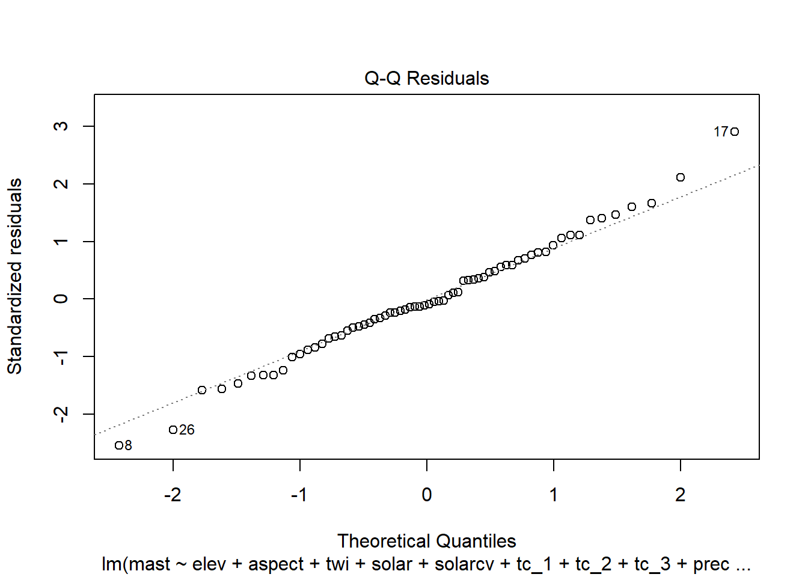

# Linear Regression


## Introduction

Linear regression models the linear relationship between a response variable (y) and an predictor variable (x). 

$y = \alpha + \beta x + e$

Where:

  * $y$ = the dependent variable

  * $\alpha$ = the intercept of the fitted line

  * $\beta$ = the Regression coefficient, i.e. slope of the fitted line. Strong relationships will have high values.

  * $x$ = the independent variable (aka explanatory or predictor variable(s) )

  * $e$ = the error term

Linear regression has been used for soil survey applications since the early 1900s when Briggs and McLane (1907) developed a pedotransfer function to estimate the wilting coefficient as a function of soil particle size. 

Wilting coefficient = 0.01(sand) + 0.12(silt) + 0.57(clay)

When more than one independent variable is used in the regression, it is referred to as multiple linear regression. In regression models, the response (or dependent) variable must always be continuous. The predictor (or independent) variable(s) can be continuous or categorical. In order to use linear regression or any linear model, the errors (i.e. residuals) must be normally distributed. Most environmental data are skewed and require transformations to the response variable (such as square root or log) for use in linear models. Normality can be assessed using a QQ plot or histogram of the residuals.


## Linear Regression Example

Now that we've got some of the basic theory out of the way we'll move on to a real example, and address any additional theory where it relates to specific steps in the modeling process. The example selected for this chapter comes from the Mojave desert. The landscape is composed primarily of closed basins ringed by granitic hills and mountains (Peterson, 1981). The problem tackled here is modeling mean annual air temperature as a function of PRISM, digital elevation model (DEM) and Landsat derivatives.

This climate study began in 1998 as part of a national study run by the National Lab and led by Henry Mount (Mount and Paetzold, 2002). The objective was to determine if the hyperthermic line was consistent across the southern US, which at the time was thought to be ~3000 in elevation. Up until 2015 their were 77 active MAST sites, and 12 SCAN sites throughout MLRA 30 and 31.

For more details see the "MLRA 30 - Soil Climate Study - Soil Temperature" project in NASIS, on [GitHub](https://github.com/smroecker/mast-mojave), or by [Roecker et al., 2012](https://www.researchgate.net/publication/331977150_Modeling_and_Application_of_Soil_Temperature_in_the_Mojave_and_Lower_Colorado_Deserts_of_California/citations).


```r
library(soilDB)

prj <- get_project_from_NASISWebReport(mlrassoarea = "8-VIC", fiscalyear = 2015)
```

```
## Loading required namespace: rvest
```

```r
subset(prj, projectname == "MLRA 30 - Soil Climate Study - Soil Temperature")
```

```
## # A tibble: 1 x 30
##   mlrassoarea nonmlrassaarea mlraarea projecttypename fiscalyear
##   <chr>       <chr>             <int> <chr>                <int>
## 1 8-VIC       <NA>                 30 MLRA                  2015
## # ... with 25 more variables: fiscalyear_goaled <int>, projectiid <int>,
## #   uprojectid <chr>, projectname <chr>, projectapprovedflag <lgl>,
## #   projectconcerntypename <chr>, projectdesc <chr>, n_projectdesc <int>,
## #   n_areasymbol <int>, n_nationalmusym <int>, n_spatial <int>,
## #   date_start <date>, date_complete <date>, date_qc <date>,
## #   date_qa_start <date>, date_qa_complete <date>, date_qc_spatial <date>,
## #   date_qa_spatial <date>, pl_username <chr>, qa_username <chr>,
## #   muacres <int>, acre_landcat <int>, acre_goal <int>, acre_progress <int>,
## #   pct_progress <int>
```

In addition to the 11-IND MAST modeling efforts there has also been two published studies on the Mojave. The first was by Schmidlin et al. (1983) who examined both the Great Basin and Mojave Deserts in Nevada. The second was by Bai et al. (2010) who examined the Mojave Desert in California. Both studies developed regression models using elevation, but Schmidlin et al. (1983) also incorporated latitude. The results from Bai et al. (2010) displayed considerably larger areas of hyperthermic soils than Schmidlin et al. (1983). This made be due to the unconventional method used by Bai et al. (2010) to measure MAST.


## Data

### Henry Mount Database

The Henry Mount Database already has 79 of the sites from the Mojave. However only 8 have temperature records.


```r
f <- fetchHenry(sso = "8-VIC")

length(unique(f$sensors$user_site_id))
```


```
## computing un-biased soil temperature summaries
```

```
## 79 sensors loaded (1.97 Mb transferred)
```


### Aggregate Time Series


```r
library(dplyr)
library(tidyr)
library(ggplot2)
```


```r
ms_df <- f$soiltemp
s     <- f$sensors
  

# convert date time data
ms_df <- mutate(
  ms_df,
  day  = date_time,
  Jday = doy
  )


# Plot sites visually inspect for flat lines and spikes
ms_df %>%
  filter(name == "JVOHV2-50") %>%
  ggplot(aes(x = day, y = sensor_value)) +
  geom_line()
```

```
## Warning: Removed 649 row(s) containing missing values (geom_path).
```


```r
# Aggregate by Year, Month, and Julian day (i.e. 1-365, 366 for leap years)
# compute number of days per site
ms_n_df <- ms_df %>%
  group_by(sid, day) %>%
  summarise(mast = mean(sensor_value, na.exclude = TRUE)) %>%
  group_by(sid) %>%
  summarise(numDays = sum(!is.na(mast)), ) %>%
  ungroup()
```

```
## `summarise()` has grouped output by 'sid'. You can override using the `.groups` argument.
```

```r
# compute mast per year
ms_site_df <- ms_df %>%
  group_by(sid, Jday) %>%
  summarise(mast = mean(sensor_value, na.rm = TRUE)) %>%
  group_by(sid) %>%
  summarise(mast = mean(mast, na.rm = TRUE)) %>%
  ungroup()
```

```
## `summarise()` has grouped output by 'sid'. You can override using the `.groups` argument.
```

```r
# merge mast & numDays
mast_df <- as.data.frame(s) %>%
  select(name, sid, sensor_depth, lon = wgs84_longitude, lat = wgs84_latitude) %>%
  left_join(ms_site_df, by = "sid") %>%
  left_join(ms_n_df,    by = "sid") %>%
  filter(sensor_depth == 50 & !is.na(mast))
```


### Final Dataset

Since the Henry Mount database is incomplete we will proceed with the aggregation from the original txt files.


```r
# Read mast data
githubURL <- url("https://raw.githubusercontent.com/ncss-tech/stats_for_soil_survey/master/data/mast_mojave.Rdata")

load(githubURL)
```


## Spatial data

### Plot Coordinates

Where do our points plot? To start we need to convert them to a spatial object first. Then we can create an interactive we map using `mapview`. Also, if we wish we can also export the locations as a Shapefile.


```r
library(sf)
# library(mapview)


# convert to sites to a spatial object
mast_sf <- st_as_sf(mast_df,
                    coords = c("lon", "lat"),
                    crs = 4326
                    ) %>%
  # reproject
  st_transform(crs = 4326)


# plot
# mapview(mlra, alpha.region = 0, lwd = 2) +
  # mapview(mast_sf)
```


### Extracting Spatial Data

Prior to any spatial analysis or modeling, you will need to develop a suite of geodata files that can be intersected with your field data locations. This is, in and of itself a difficult task and should be facilitated by your Regional GIS Specialist. The geodata files typically used would consist of derivatives from a DEM or satellite imagery, and a 'good' geology map. Prior to any prediction it is also necessary to ensure the geodata files have the same projection, extent, and cell size. Once we have the necessary files we can construct a list in R of the file names and paths, read the geodata into R, and then extract the geodata values where they intersect with field data.

As you can see below their are numerous variables we could inspect.


```r
library(raster)
```

```
## Warning: package 'raster' was built under R version 4.0.5
```

```
## Loading required package: sp
```

```
## Warning: package 'sp' was built under R version 4.0.3
```

```
## 
## Attaching package: 'raster'
```

```
## The following object is masked from 'package:tidyr':
## 
##     extract
```

```
## The following object is masked from 'package:dplyr':
## 
##     select
```

```r
library(sf)

# load raster stack from GitHub
githubURL <- url("https://raw.githubusercontent.com/ncss-tech/stats_for_soil_survey/master/data/mast_mojave_rs.rds")
geodata_r <- readRDS(githubURL)


# Extract the geodata and add to a data frame
mast_sp <- as(st_transform(mast_sf, crs = 5070), "Spatial")
data <- raster::extract(geodata_r, mast_sp, sp = TRUE)@data


# convert aspect
data$northness <- abs(180 - data$aspect)


# random sample
vars <- c("elev", "temp", "precip", "solar", "tc_1", "twi")
idx <- which(names(geodata_r) %in% vars)
geodata_s <- sampleRegular(geodata_r[[idx]], size = 1000)
```


## Exploratory Data Analysis (EDA)

Generally before we begin modeling it is good to explore the data. By examining a simple summary we can quickly see the breakdown of our data. It is important to look out for missing or improbable values. Probably the easiest way to identify pecularities in the data is to plot it.


```r
summary(data)
```

```
##        siteid        mast          numDays          elev            slope      
##  Cheme01  : 1   Min.   : 3.10   Min.   : 363   Min.   :   0.0   Min.   : 0.00  
##  Clark01  : 1   1st Qu.:18.50   1st Qu.:1831   1st Qu.: 699.2   1st Qu.: 2.00  
##  DEVA01   : 1   Median :20.57   Median :2918   Median : 947.5   Median : 5.00  
##  DEVA02   : 1   Mean   :19.93   Mean   :2465   Mean   :1082.0   Mean   :11.85  
##  DEVA03   : 1   3rd Qu.:23.72   3rd Qu.:3397   3rd Qu.:1480.2   3rd Qu.:21.00  
##  Jawbone01: 1   Max.   :28.77   Max.   :4159   Max.   :3021.0   Max.   :42.00  
##  (Other)  :62                                                                  
##      aspect            twi            solar         solarcv     
##  Min.   :  6.00   Min.   : 8.00   Min.   :1758   Min.   :21.00  
##  1st Qu.: 90.25   1st Qu.: 9.25   1st Qu.:2028   1st Qu.:31.00  
##  Median :140.00   Median :12.00   Median :2091   Median :32.50  
##  Mean   :143.62   Mean   :12.00   Mean   :2084   Mean   :32.66  
##  3rd Qu.:196.00   3rd Qu.:14.00   3rd Qu.:2136   3rd Qu.:33.25  
##  Max.   :333.00   Max.   :21.00   Max.   :2443   Max.   :44.00  
##                   NA's   :2                                     
##       tc_1             tc_2             tc_3            precip      
##  Min.   : 58.00   Min.   : 26.00   Min.   :  2.00   Min.   : 3.000  
##  1st Qu.: 97.75   1st Qu.: 47.75   1st Qu.: 31.50   1st Qu.: 6.000  
##  Median :120.00   Median : 57.50   Median : 50.50   Median : 7.000  
##  Mean   :122.22   Mean   : 56.85   Mean   : 51.87   Mean   : 9.824  
##  3rd Qu.:143.50   3rd Qu.: 64.00   3rd Qu.: 74.00   3rd Qu.:10.000  
##  Max.   :191.00   Max.   :100.00   Max.   :121.00   Max.   :44.000  
##                                                                     
##       temp         northness     
##  Min.   :10.00   Min.   :  0.00  
##  1st Qu.:20.75   1st Qu.: 23.75  
##  Median :23.50   Median : 68.00  
##  Mean   :23.10   Mean   : 64.59  
##  3rd Qu.:26.00   3rd Qu.: 93.50  
##  Max.   :31.00   Max.   :174.00  
## 
```

You may recall from discussion of EDA that QQ plots are a visual way to inspect the normality of a variable. If the variable is normally distributed, the points (e.g. soil observations) should line up along the straight line.


```r
# QQ plot

ggplot(data, aes(sample = mast)) +
  geom_qq() +
  geom_qq_line()
```


By examining the correlations between some of the predictors we can also determine wheter they are *collinear* (e.g. > 0.6). This is common for similar variables such as landsat bands, terrain derivatives, and climatic variables. Variables that are colinear are redundant and contain no additional information. In additino, collinearity will make it difficult to estimate our regression coefficients. 


```r
vars <- c("mast", "elev", "temp", "precip", "tc_2", "tc_1", "tc_3")
GGally::ggpairs(data[vars])
```

```
## Registered S3 method overwritten by 'GGally':
##   method from   
##   +.gg   ggplot2
```


```r
vars <- c("mast", "slope", "twi", "northness", "solar", "solarcv")
GGally::ggpairs(data[vars])
```


The correlation matrices and scatter plots above show that that MAST has moderate correlations with some of the variables, particularly the elevation and the climatic variables. 

Examining the density plots on the diagonal axis of the scatterplots we can also see that some variables are skewed.


### Compare Samples vs Population 

Since our data was not randomly sampled, we had better check the distribution of our samples vs the population. We can accomplish this by overlaying the sample distribution of predictor variables vs a large random sample.


```r
geodata_df <- as.data.frame(geodata_s)

geodata_df <- rbind(
  data.frame(source = "sample",     data[names(geodata_df)]),
  data.frame(source = "population", geodata_df)
)

geodata_l <- pivot_longer(
  geodata_df, 
  cols = - source
  )

ggplot(geodata_l, aes(x = value, fill = source)) +
  geom_density(alpha = 0.5) +
  facet_wrap(~ name, scales = "free") +
  ggtitle("Evaluation of Sample Representativeness")
```

```
## Warning: Removed 1266 rows containing non-finite values (stat_density).
```


The overlap between our sample and the population appear satisfactory.


## Linear modeling

R has several functions for fitting linear models. The most common is arguably the `lm()` function from the stats R package, which is loaded by default. The `lm()` function is also extended thru the use of several additional packages such as the car and caret R packages. Another noteworthy R package for linear modeling is rms, which offers the `ols()` function for linear modeling. The rms R package (Harrell et al., 2015) offers an 'almost' comprehesive alternative to `lm()' and it's accessory function. It is difficult to objectively functions say which approach is better. Therefore methods both methods will be demonstrated. Look for comments (i.e. #) below referring to rms, stats, caret or visreg. 


```r
# stats
fit_lm <- lm(mast ~ elev + aspect + twi + solar + solarcv + tc_1 + tc_2 + tc_3 + precip + temp, data = data, weights = data$numDays)


# rms R package

library(rms)

dd <- datadist(data)
options(datadist = "dd")

fit_ols <- ols(mast ~ elev + aspect + twi + solar + solarcv + tc_1 + tc_2 + tc_3 + precip + temp, data = data, x = TRUE, y = TRUE, weights = data$numDays)
```


### Diagnostics

#### Residual plots

Once we have a model we need to assess residuals for linearity, normality, and homoscedastivity (or constant variance). Oddly this is one area were the rms R package does not offer convient functions for plotting residuals, therefore we'll simply access the results of `lm()`.


```r
par(mfcol = c(2, 2))

# residual
plot(fit_lm)
```


```r
# partial residuals
termplot(fit_lm, partial.resid = TRUE, col.res = "black", pch = 16)
```


#### Multicolinearity

As we mentioned earlier multicolinearity should be avoided. To assess a model for multicolinearity we can compute the **variance inflation factor** (VIF). Its square root indicates the amount of increase in the predictor coefficients standard error. A value greater than 3 indicates a doubling the standard error. Rules of thumb vary, but a square root of vif greater than 2 or 3 indicates an unacceptable value.


```r
# vif() function from the rms or car packages
sqrt(vif(fit_ols))
```

```
##     elev   aspect      twi    solar  solarcv     tc_1     tc_2     tc_3 
## 8.851106 1.103580 2.056235 6.068831 5.787921 4.114079 3.009392 3.311669 
##   precip     temp 
## 2.274489 7.860236
```

```r
# or 

sqrt(vif(fit_ols)) > 3
```

```
##    elev  aspect     twi   solar solarcv    tc_1    tc_2    tc_3  precip    temp 
##    TRUE   FALSE   FALSE    TRUE    TRUE    TRUE    TRUE    TRUE   FALSE    TRUE
```

The values above indicate we have several colinear variables in the model, which you might have noticed already from the scatter plot matrix.


### Variable selection & model validation

Modeling is an iterative process that cycles between fitting and evaluating alternative models. Compared to tree and forest models, linear and generalized models typically require more scrutiny from the user. Automated model selection procedures are available, but should not be taken at face value because they may result in complex and unstable models. This is in part due to correlation monist the predictive variables that can confuse the model. Also, the order in which the variables are included or excluded from the model effects the significance of the other variables, and thus several weak predictors might mask the effect of one strong predictor. Regardless of the approach used, variable selection is probably the most controversial aspect of linear modeling.

Both the rms and caret packages offer methods for variable selection and cross-validation. In this instance the rms approach is a bit more convenient, with the one line call to `validate()`.


```r
# Set seed for reproducibility
set.seed(42)


# rms
## stepwise selection and validation
fit_step <- validate(fit_ols, method = "crossvalidation", B = 10, bw = TRUE)
```

```
## 
## 		Backwards Step-down - Original Model
## 
##  Deleted Chi-Sq d.f. P      Residual d.f. P      AIC   R2   
##  temp    0.19   1    0.6593 0.19     1    0.6593 -1.81 34676
##  aspect  0.45   1    0.5020 0.65     2    0.7243 -3.35 34674
##  solarcv 0.97   1    0.3248 1.61     3    0.6561 -4.39 34672
##  twi     0.51   1    0.4762 2.12     4    0.7133 -5.88 34670
##  tc_3    1.25   1    0.2642 3.37     5    0.6434 -6.63 34667
##  precip  0.85   1    0.3558 4.22     6    0.6468 -7.78 34665
## 
## Approximate Estimates after Deleting Factors
## 
##                Coef     S.E.  Wald Z         P
## Intercept 24.486899 4.044131   6.055 1.405e-09
## elev      -0.007142 0.000550 -12.985 0.000e+00
## solar      0.009497 0.002012   4.721 2.346e-06
## tc_1      -0.062146 0.012006  -5.176 2.264e-07
## tc_2      -0.157832 0.036778  -4.291 1.775e-05
## 
## Factors in Final Model
## 
## [1] elev  solar tc_1  tc_2
```

The results for `validate()` above and below show which variables were retained and deleted. Below we can see a dot matrix of which variables were retained in during the 10 iterations of the cross validation. In addition, below we can see the difference between the training and test accuracy and error metrics. Remember that it is the test accuracy we should pay attention too.


```r
## test accuracy and error
fit_step
```

```
##           index.orig training   test optimism index.corrected  n
## R-square      0.9286   0.9293 0.6377   0.2915          0.6370 10
## MSE           2.1473   2.1143 3.4892  -1.3750          3.5223 10
## g             5.6666   5.6878 5.3049   0.3829          5.2837 10
## Intercept     0.0000   0.0000 2.6416  -2.6416          2.6416 10
## Slope         1.0000   1.0000 0.8829   0.1171          0.8829 10
## 
## Factors Retained in Backwards Elimination
## 
##  elev aspect twi solar solarcv tc_1 tc_2 tc_3 precip temp
##  *                     *       *    *                    
##  *               *             *    *                    
##  *               *             *    *                    
##  *               *             *    *                    
##  *               *             *    *                    
##                        *       *    *                *   
##  *               *             *                         
##  *                     *       *    *                    
##  *               *             *    *                    
##  *                     *       *    *                    
## 
## Frequencies of Numbers of Factors Retained
## 
## 3 4 
## 1 9
```


### Final model & accuracy assessment


```r
# rms
final_ols <- ols(mast ~ elev + solarcv + tc_1 + tc_2, data = data, weights = data$numDays, x = TRUE, y = TRUE)

validate(final_ols, method = "crossvalidation", B = 10)
```

```
##           index.orig training   test optimism index.corrected  n
## R-square      0.9209   0.9228 0.3214   0.6015          0.3194 10
## MSE           2.3332   2.2565 2.7699  -0.5133          2.8465 10
## g             5.7197   5.6587 4.6978   0.9609          4.7588 10
## Intercept     0.0000   0.0000 1.8893  -1.8893          1.8893 10
## Slope         1.0000   1.0000 0.9020   0.0980          0.9020 10
```


### Model Effects


```r
# Model summmary
summary(final_ols)
```

```
##              Effects              Response : mast 
## 
##  Factor  Low    High    Diff.  Effect   S.E.    Lower 0.95 Upper 0.95
##  elev    699.25 1480.20 781.00 -5.19080 0.43926 -6.06860   -4.31300  
##  solarcv  31.00   33.25   2.25 -0.54478 0.11836 -0.78131   -0.30826  
##  tc_1     97.75  143.50  45.75 -2.44820 0.51488 -3.47710   -1.41930  
##  tc_2     47.75   64.00  16.25 -2.38690 0.58767 -3.56120   -1.21250
```

```r
# Anova
anova(final_ols)
```

```
##                 Analysis of Variance          Response: mast 
## 
##  Factor     d.f. Partial SS MS          F      P     
##  elev        1    751577.78  751577.776 139.64 <.0001
##  solarcv     1    114017.66  114017.655  21.18 <.0001
##  tc_1        1    121686.11  121686.110  22.61 <.0001
##  tc_2        1     88784.39   88784.388  16.50 1e-04 
##  REGRESSION  4   4240328.96 1060082.241 196.96 <.0001
##  ERROR      63    339072.21    5382.099
```

```r
# Plot Effects
ggplot(Predict(final_ols),
       addlayer = geom_hline(yintercept = c(8, 15, 22), linetype = "dotted") +
         scale_y_continuous(breaks = c(8, 15, 22))
       )
```


```r
# Vary solarcv (North = 23; Flat = 33; South = 55)
ggplot(Predict(final_ols, elev = NA, solarcv = c(23, 33, 51))) +
  geom_hline(yintercept = c(8, 15, 22), linetype = "dotted") +
  scale_y_continuous(breaks = c(8, 15, 22))
```




## Generate spatial predictions


```r
# Predict mast model
predfun <- function(model, data) {
  v <- predict(model, data, se.fit=TRUE)
  }

mast_r <- predict(geodata_r, final_ols, fun = predfun, index = 1:2, progress = 'text')

names(mast_r) <- c("MAST", "SE")
```


## Create Map


```r
# mast
plot(mast_r)
```


## Literature
Bai, Y., T.A. Scott, W. Chen, R.C. Graham, L. Wu, A.C. Chang, and L.J. Lund, 2010. Soil Temperature Regimes in the Mojave Desert. Soil Science, 175(8):398-404. 

Harrell, F.E., 2015. Regression Modeling Strategies: With Applications to Linear Models, Logisitc and Ordinal Regression, and Survival Analysis. Springer, New York. [https://link.springer.com/book/10.1007%2F978-3-319-19425-7](https://link.springer.com/book/10.1007%2F978-3-319-19425-7)

Mount, H.R., and R.F. Paetzold, 2002. The temperature regime for selected soils in the United States. United States Department of Agriculture, Natural Resources Con-servation Service, National Soil Survey Center, Lincoln, Nebraska, Soil Survey Investi-gation Report No. 48.

Peterson, F.F., 1992. Status of Soil Climate Studies in Nevada. pp1-11.  

[Roecker, S.M. and C.A. Haydu-Houdeshell, 2012. Modeling and Application of Soil Temperature in the Mojave and Lower Colorado Deserts of California. 2012 Western Regional Cooperative Soil Survey Conference.](https://www.researchgate.net/publication/331977150_Modeling_and_Application_of_Soil_Temperature_in_the_Mojave_and_Lower_Colorado_Deserts_of_California/citations)

Schmidlin, T.W., F.F. Peterson, and R.O. Gifford, 1983. Soil Temperature Regimes of Nevada. Soil So. Sci. Am. J., 47:977-982. 

## Additional reading

Faraway, J.J., 2002. Practical Regression and Anova using R. CRC Press, New York. [https://cran.r-project.org/doc/contrib/Faraway-PRA.pdf](https://cran.r-project.org/doc/contrib/Faraway-PRA.pdf)

James, G., D. Witten, T. Hastie, and R. Tibshirani, 2014. An Introduction to Statistical Learning: with Applications in R. Springer, New York. [http://www-bcf.usc.edu/~gareth/ISL/](http://www-bcf.usc.edu/~gareth/ISL/)

Webster, R. 1997. Regression and functional relations. European Journal of Soil Science, 48, 557-566. [http://onlinelibrary.wiley.com/doi/10.1111/j.1365-2389.1997.tb00222.x/abstract](http://onlinelibrary.wiley.com/doi/10.1111/j.1365-2389.1997.tb00222.x/abstract)


## References (Linear Models)


