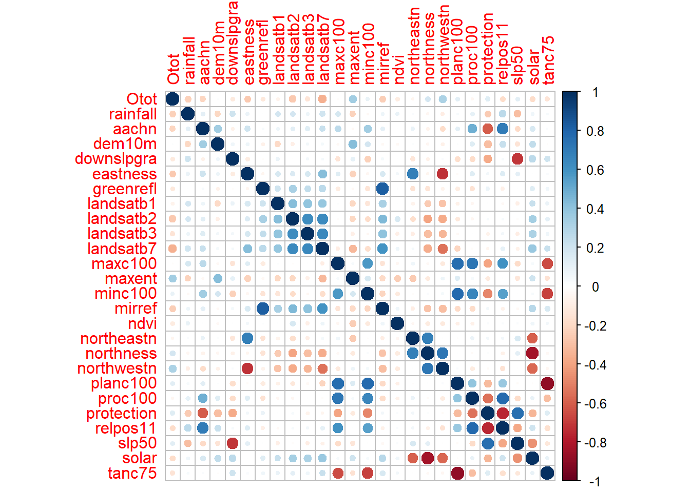
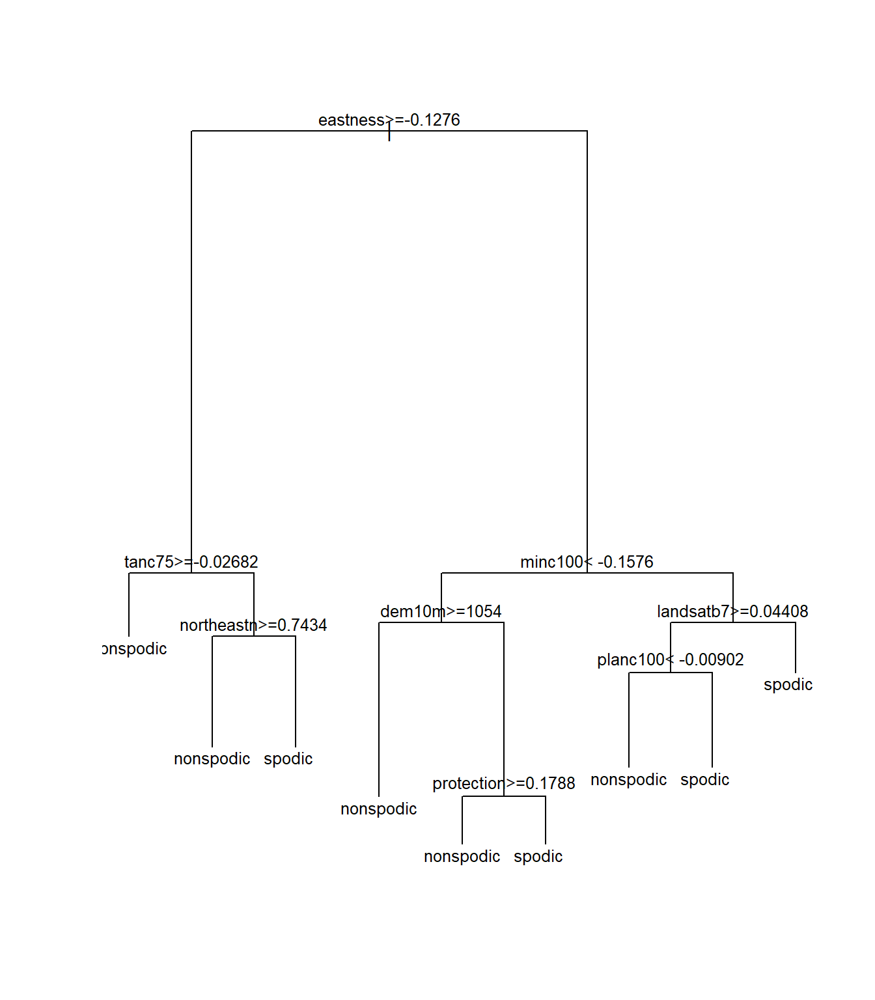

# Tree-based Models


## Introduction
Tree-based models are a supervised machine learning method commonly used in soil survey and ecology for exploratory data analysis and prediction due to their simplistic nonparametric design. Instead of fitting a model to the data, tree-based models recursively partition the data into increasingly homogenous groups based on values that minimize a loss function (such as Sum of Squared Errors (SSE) for regression or Gini Index for classification) ([McBratney et al.,2013](http://www.clw.csiro.au/aclep/documents/McBratney%20et%20al.%202003.pdf)). The two most common packages for generating tree-based models in R are rpart and randomForest. The rpart package creates a regression or classification tree based on binary splits that maximize homogeneity and minimize impurity. The output is a single decision tree that can be further "pruned" or trimmed back using the cross-validation error statistic to reduce over-fitting. The randomForest package is similar to rpart, but is double random in that each node is split using a random subset of predictors AND observations at each node and this process is repeated hundreds of times (as specified by the user). Unlike rpart, random forests do not produce a graphical decision tree since the predictions are averaged across hundreds or thousands of trees. Instead, random forests produce a variable importance plot and a tabular statistical summary. 


## Exploratory Data Analysis

The data that we will be working with in this chapter were collected in support of a MLRA 127 soil survey update project to tabularly and spatially update SSRUGO map units for spodic properties in the Monongahela National Forest. Soils that were historically covered by Eastern Hemlock and Red Spruce exhibit spodic morphology on shale, siltstone, and sandstone bedrocks at elevations typically >3,200 ft in West Virginia ([Nauman et al., 2015](http://www.sciencedirect.com/science/article/pii/S0016706115000427)). The landscape and vegetative communities were greatly altered by fire and logging in the early 1900s, complicating the identification of spodic morphology. It is of particular interest to the project leader and the U.S. Forest Service that spatial maps be developed to depict the location of spodic morphology and folistic epipedons in the Monongahela National Forest. Folistic epipedons provide habitat for the Northern Flying Squirrel, just recently removed from the endangered species list.  


### Getting Data Into R and Exporting to Shapefile

Before we dive in to model building, let's first import and plot the dataset in R. 


```r
library(lattice) #graphing
library(sp) #spatial data
library(maps) #maps
library(rgdal) #spatial import
library(corrplot) #graphical display of correlation matrix

file <-'https://raw.githubusercontent.com/ncss-tech/stats_for_soil_survey/master/data/logistic/wv_transect_editedforR.csv'
download.file(file, destfile = "soildata.csv")
soildata <- read.csv("soildata.csv", header=TRUE, sep=",")
coordinates(soildata) <- ~ x + y #set the coordinates; converting dataframe to a spatial object
proj4string(soildata) <- CRS("+init=EPSG:4269") #set the projection; https://www.nceas.ucsb.edu/~frazier/RSpatialGuides/OverviewCoordinateReferenceSystems.pdf 

map("county", "west virginia") 
points(soildata) #plot points
```


```r
#convert soildata into a shapefile
writeOGR(soildata, dsn = "C:/workspace", "soildata", driver = "ESRI Shapefile") 
```

Conveniently, environmental covariate values were previously extracted for all of the observations in the **soildata** dataset. **How would you extract raster data to points in R?**  ([Hint](https://github.com/ncss-tech/stats_for_soil_survey/blob/master/chapters/6_linear_models/6_Linear_models.md))


### Examining Data in R


```r
#since we converted the soildata dataframe to a spatial object to export as a shapefile, we will need to convert it back to a dataframe to plot and further examine the data in R

#re-importing the data and overwriting the soildata object is just one way to achieve this
file <-'https://raw.githubusercontent.com/ncss-tech/stats_for_soil_survey/master/data/logistic/wv_transect_editedforR.csv'
download.file(file, destfile = "soildata.csv")
soildata <- read.csv("soildata.csv", header=TRUE, sep=",")
View(soildata) #view the data
str(soildata) #examine the internal data structure
```

```
## 'data.frame':	250 obs. of  50 variables:
##  $ x           : num  -79.7 -79.7 -79.7 -79.8 -79.7 ...
##  $ y           : num  38.6 38.6 38.6 38.6 38.6 ...
##  $ Overtype    : chr  "Hardwood" "Hardwood" "Hardwood" "Hardwood" ...
##  $ Underconifer: chr  "n" "y" "n" "y" ...
##  $ Oi          : num  3 4 3 4 3 2 2 2 4 3 ...
##  $ Oe          : num  0 0 2 4 4 6 4 2 2 4 ...
##  $ Oa          : num  0 3 0 0 8 0 0 0 7 4 ...
##  $ Otot        : num  3 7 5 8 15 8 6 4 13 7 ...
##  $ epipedon    : chr  "ochric" "ochric" "ochric" "ochric" ...
##  $ spodint     : num  0 0 0 0 1 1 1 0.5 1 0 ...
##  $ subgroup    : chr  "typic" "typic" "typic" "typic" ...
##  $ order       : chr  "ultisol" "inceptisol" "ultisol" "inceptisol" ...
##  $ ps          : chr  "fl" "ls" "fl" "cl" ...
##  $ drainage    : chr  "wd" "wd" "wd" "wd" ...
##  $ series      : chr  "Carrollton" "Mandy" "Carrollton" "Mandy" ...
##  $ taxon       : chr  "series" "series" "series" "taxadjunct" ...
##  $ slope       : int  45 54 39 25 38 30 38 36 16 36 ...
##  $ surfacetex  : chr  "l" "l" "cnl" "l" ...
##  $ stoniness   : chr  "stx" "stv" "stx" "stv" ...
##  $ depthclass  : chr  "md" "md" "md" "md" ...
##  $ bedrockdepth: int  200 200 200 200 200 200 200 200 200 200 ...
##  $ depth_cm    : int  67 69 52 95 93 81 86 90 75 92 ...
##  $ hillslope   : chr  "backslope" "backslope" "backslope" "backslope" ...
##  $ tipmound    : int  0 0 0 0 0 0 0 0 0 0 ...
##  $ rainfall    : int  51 51 51 51 51 51 51 51 51 51 ...
##  $ geology     : chr  "Dch" "Dhs" "Dhs" "Dhs" ...
##  $ aachn       : num  27.46 81.7 2.59 43.36 70.75 ...
##  $ dem10m      : num  1123 1239 1155 1240 1211 ...
##  $ downslpgra  : num  25.9 25.1 78 37 26.1 ...
##  $ eastness    : num  -0.53 0.972 1 0.9 -0.474 ...
##  $ greenrefl   : num  0.1035 0.0425 0.0351 0.0776 0.0721 ...
##  $ landsatb1   : num  0.0726 0.0742 0.0742 0.0775 0.0694 ...
##  $ landsatb2   : num  0.062 0.0583 0.0547 0.0583 0.0528 ...
##  $ landsatb3   : num  0.0335 0.0351 0.0301 0.0419 0.0318 ...
##  $ landsatb7   : num  0.0494 0.0516 0.043 0.0451 0.0302 ...
##  $ maxc100     : num  -0.0845 -0.0963 -0.0848 0.2386 0.1368 ...
##  $ maxent      : num  20.26 30.21 27.44 7.88 73.85 ...
##  $ minc100     : num  -0.1925 -0.1457 -0.8324 0.069 0.0998 ...
##  $ mirref      : num  0.1608 0.0827 0.1109 0.1477 0.0762 ...
##  $ ndvi        : num  0.866 0.822 0.842 0.8 0.77 ...
##  $ northeastn  : num  -0.974 0.854 0.728 0.944 -0.958 ...
##  $ northness   : num  -0.848 0.237 0.03 0.435 -0.88 ...
##  $ northwestn  : num  -0.225 -0.52 -0.686 -0.329 -0.287 ...
##  $ planc100    : num  -0.1177 -0.1077 -0.2173 0.1321 0.0476 ...
##  $ proc100     : num  -0.231 -0.178 -0.735 0.221 0.161 ...
##  $ protection  : num  0.237 0.154 0.222 0.114 0.138 ...
##  $ relpos11    : num  0.352 0.507 0.233 0.544 0.585 ...
##  $ slp50       : num  42.4 42.3 26.3 24.5 36.3 ...
##  $ solar       : int  1481510 1280610 1348160 1322630 1532160 1536340 1488440 1155820 1440500 1474730 ...
##  $ tanc75      : num  0.0511 0.0279 0.0553 -0.0187 -0.0346 ...
```

The example dataset, **soildata**, consists of 250 observations and 58 variables that were collected in the field or derived from geospatial data to identify spodic soil properties in West Virginia. Of particular interest is determining best splits for spodic intensity (relative spodicity index). As you can see in the data structure, R interpreted the spodint field as numeric. Since spodint is an index, it will need to be changed to a factor and then to an ordered factor. The same will need to be done for tipmound (a tip and mound microtopography index).


```r
set.seed(250)
soildata$spodint <- as.factor(soildata$spodint)
soildata$spodint <- ordered(soildata$spodint)
soildata$tipmound <- as.factor(soildata$tipmound)
soildata$tipmound <- ordered(soildata$tipmound)
```

Next, let's explore the tabular data:


```r
boxplot(solar~spodint, data=soildata, xlab="spodic intensity", ylab="solar") #does solar radiation affect spodic intensity?
```


```r
boxplot(northwestn~spodint, data=soildata, xlab="spodic intensity", ylab="northwestness") #how about aspect?
```


```r
densityplot(~ Otot|order, data=soildata) #distribution of O horizon thickness among soil orders
```


```r
numeric <- data.frame(soildata[, c(8, 25, 27:50)]) #combine numeric columns into a new data frame
names(numeric) 
```

```
##  [1] "Otot"       "rainfall"   "aachn"      "dem10m"     "downslpgra"
##  [6] "eastness"   "greenrefl"  "landsatb1"  "landsatb2"  "landsatb3" 
## [11] "landsatb7"  "maxc100"    "maxent"     "minc100"    "mirref"    
## [16] "ndvi"       "northeastn" "northness"  "northwestn" "planc100"  
## [21] "proc100"    "protection" "relpos11"   "slp50"      "solar"     
## [26] "tanc75"
```

```r
cormatrix <- cor(numeric) #calculate correlation matrix
corrplot(cormatrix, method = "circle") #plot correlation matrix
```




### Exercise 1
Examine the **soildata** shapefile and environmental covariate data in ArcGIS. Come up with a theory of which possible covariates might be useful for predicting spodic morphology and folistic epipedons. Also, think of the different possible ways to model these features given the **soildata** dataset. 


## Classification and Regression Trees (CART)
The basic form for all CART models is (y ~ x), where y is the dependent variable to be predicted from x, a set of independent variables. If the dependent variable (y) is numeric, the resulting tree will be a regression tree. Conversely, if the dependent variable (y) is categorical, the resulting tree will be a classification tree. The rpart package allows all data types to be used as independent variables, regardless of whether the model is a classification or regression tree. The rpart algorithm ignores missing values when determining the quality of a split and uses surrogate splits to determine if observation(s) with missing data is best split left or right. If an observation is missing all surrogate splits, then the observation(s) is sent to the child node with the largest relative frequency (Feelders, 1999).

Assuming that the rpart and randomForest packages are already installed on your machine, simply load the packages using the `library()` function.


```r
library(rpart) #CART models
library(randomForest) #random forest
library(rpart.plot) #rpart plot graphics
library(caret) #confusion matrix
```


If you wanted to create a classification tree for spodint using all of the variables, you would simply type: `rpart(spodint ~ ., data=soildata)`. Since our goal is to generate a spatial prediction model, we only want to use the variables for which we have spatial coverage--our environmental covariate rasters. 


```r
spodintmodel <- rpart(spodint ~ rainfall + geology + aachn + dem10m + downslpgra + eastness + greenrefl + landsatb1 + landsatb2 + landsatb3 +landsatb7 + maxc100 + maxent + minc100 + mirref + ndvi+ northeastn + northness + northwestn + planc100 + proc100 + protection + relpos11 + slp50 + solar + tanc75, data = soildata, method = "class")

spodintmodel
```

```
## n= 250 
## 
## node), split, n, loss, yval, (yprob)
##       * denotes terminal node
## 
##   1) root 250 162 0 (0.35 0.084 0.26 0.024 0.28)  
##     2) northwestn< 0.55138 148  80 0 (0.46 0.081 0.29 0.027 0.14)  
##       4) maxc100< 0.10341 57  20 0 (0.65 0.088 0.14 0.018 0.11) *
##       5) maxc100>=0.10341 91  56 1 (0.34 0.077 0.38 0.033 0.16)  
##        10) solar< 1504355 83  52 0 (0.37 0.084 0.33 0.036 0.18)  
##          20) minc100< -0.197089 9   1 0 (0.89 0 0 0 0.11) *
##          21) minc100>=-0.197089 74  47 1 (0.31 0.095 0.36 0.041 0.19)  
##            42) maxent< 12.9024 23  10 0 (0.57 0.13 0.26 0.043 0)  
##              84) solar< 1460005 16   5 0 (0.69 0.19 0.12 0 0) *
##              85) solar>=1460005 7   3 1 (0.29 0 0.57 0.14 0) *
##            43) maxent>=12.9024 51  30 1 (0.2 0.078 0.41 0.039 0.27)  
##              86) greenrefl>=0.01846795 40  20 1 (0.22 0.075 0.5 0.025 0.17)  
##               172) dem10m>=1012.96 33  14 1 (0.27 0.061 0.58 0 0.091)  
##                 344) minc100< 0.06651935 24   7 1 (0.21 0.083 0.71 0 0) *
##                 345) minc100>=0.06651935 9   5 0 (0.44 0 0.22 0 0.33) *
##               173) dem10m< 1012.96 7   3 2 (0 0.14 0.14 0.14 0.57) *
##              87) greenrefl< 0.01846795 11   4 2 (0.091 0.091 0.091 0.091 0.64) *
##        11) solar>=1504355 8   0 1 (0 0 1 0 0) *
##     3) northwestn>=0.55138 102  53 2 (0.2 0.088 0.22 0.02 0.48)  
##       6) protection< 0.0988242 25  15 1 (0.2 0.16 0.4 0.04 0.2)  
##        12) proc100< 0.1502945 14  10 0 (0.29 0.29 0.14 0 0.29) *
##        13) proc100>=0.1502945 11   3 1 (0.091 0 0.73 0.091 0.091) *
##       7) protection>=0.0988242 77  33 2 (0.19 0.065 0.16 0.013 0.57)  
##        14) maxent< 9.5806 30  19 0 (0.37 0.1 0.17 0.033 0.33)  
##          28) rainfall< 52 9   2 0 (0.78 0 0 0 0.22) *
##          29) rainfall>=52 21  13 2 (0.19 0.14 0.24 0.048 0.38)  
##            58) landsatb7>=0.0398039 12   7 1 (0.17 0.25 0.42 0 0.17) *
##            59) landsatb7< 0.0398039 9   3 2 (0.22 0 0 0.11 0.67) *
##        15) maxent>=9.5806 47  13 2 (0.085 0.043 0.15 0 0.72) *
```

```r
plot(spodintmodel)
text(spodintmodel, cex=0.8) #cex is text size
```


```r
#if you are having trouble viewing the text in the plot window, click zoom to open a bigger window
#you may also need to adjust the plot margins or text size; for this example, try:
par(mar=c(3,6,3,6)) 
plot(spodintmodel)
text(spodintmodel, cex=0.6)
```

For more plot customization, use the rpart.plot package. 

```r
rpart.plot(spodintmodel, extra=3) #extra=3 displays the misclassification rate at the node, expressed as the number of incorrect classifications divided by the total observations in the node; there are many options under the extra setting for classification models
```


```r
rpart.plot(spodintmodel, extra=103) #adding 100 to the extra setting displays the percentage observations in the node
```


```r
prp(spodintmodel,type=1,extra=1,branch=1) #prp is another function in the rpart.plot package that has numerous plot customization options
```


Notice that the terminal nodes display the different spodic intensity classes, ranging from 0 to 2. **Can you think of another way that we could model spodic expression?** 

Could we treat spodic intesity (an ordered factor) as numeric, ranging from 0 to 1 to develop a regression tree? Does this make sense? what would a mean of 1 tell you about the observations in the terminal node? 

What if we considered everything with a spodic intensity of <= 0.5 to be non-spodic and everything >0.5 to be spodic? A binary probability approach to predicting spodic morphology, similar to Nauman et al., 2015.


```r
index <- c(0, 0.5, 1, 1.5, 2) #index for lookup table
values <- c("nonspodic", "nonspodic", "spodic", "spodic", "spodic") #assigning corresponding categories to look up values
soildata$newcolumn <- values[match(soildata$spodint, index)] #match spodint to index and assign values
soildata$newcolumn <- as.factor(soildata$newcolumn) #convert new column from character to factor

spodintmodel2 <- rpart(newcolumn ~ rainfall + geology + aachn + dem10m + downslpgra + eastness + greenrefl + landsatb1 + landsatb2 + landsatb3 +landsatb7 + maxc100 + maxent + minc100 + mirref + ndvi+ northeastn + northness + northwestn + planc100 + proc100 + protection + relpos11 + slp50 + solar + tanc75, data = soildata, method = "class")

spodintmodel2
```

```
## n= 250 
## 
## node), split, n, loss, yval, (yprob)
##       * denotes terminal node
## 
##  1) root 250 109 spodic (0.4360000 0.5640000)  
##    2) eastness>=-0.1275925 100  36 nonspodic (0.6400000 0.3600000)  
##      4) tanc75>=-0.0268239 64  16 nonspodic (0.7500000 0.2500000) *
##      5) tanc75< -0.0268239 36  16 spodic (0.4444444 0.5555556)  
##       10) northeastn>=0.7433605 13   3 nonspodic (0.7692308 0.2307692) *
##       11) northeastn< 0.7433605 23   6 spodic (0.2608696 0.7391304) *
##    3) eastness< -0.1275925 150  45 spodic (0.3000000 0.7000000)  
##      6) minc100< -0.1576455 47  23 spodic (0.4893617 0.5106383)  
##       12) dem10m>=1054.305 15   2 nonspodic (0.8666667 0.1333333) *
##       13) dem10m< 1054.305 32  10 spodic (0.3125000 0.6875000)  
##         26) protection>=0.178847 13   5 nonspodic (0.6153846 0.3846154) *
##         27) protection< 0.178847 19   2 spodic (0.1052632 0.8947368) *
##      7) minc100>=-0.1576455 103  22 spodic (0.2135922 0.7864078)  
##       14) landsatb7>=0.0440802 37  15 spodic (0.4054054 0.5945946)  
##         28) planc100< -0.00902005 8   1 nonspodic (0.8750000 0.1250000) *
##         29) planc100>=-0.00902005 29   8 spodic (0.2758621 0.7241379) *
##       15) landsatb7< 0.0440802 66   7 spodic (0.1060606 0.8939394) *
```

```r
plot(spodintmodel2)
text(spodintmodel2, cex=0.8)
```


Notice that several of the splits changed. Which model performed better? One way to compare the two models is to use the function `printcp()`:


```r
printcp(spodintmodel)
```

```
## 
## Classification tree:
## rpart(formula = spodint ~ rainfall + geology + aachn + dem10m + 
##     downslpgra + eastness + greenrefl + landsatb1 + landsatb2 + 
##     landsatb3 + landsatb7 + maxc100 + maxent + minc100 + mirref + 
##     ndvi + northeastn + northness + northwestn + planc100 + proc100 + 
##     protection + relpos11 + slp50 + solar + tanc75, data = soildata, 
##     method = "class")
## 
## Variables actually used in tree construction:
##  [1] dem10m     greenrefl  landsatb7  maxc100    maxent     minc100   
##  [7] northwestn proc100    protection rainfall   solar     
## 
## Root node error: 162/250 = 0.648
## 
## n= 250 
## 
##         CP nsplit rel error  xerror     xstd
## 1 0.179012      0   1.00000 1.00000 0.046614
## 2 0.030864      1   0.82099 0.90123 0.048107
## 3 0.029321      2   0.79012 0.91358 0.047967
## 4 0.018519      7   0.63580 0.95679 0.047374
## 5 0.015432      8   0.61728 0.94444 0.047561
## 6 0.012346     11   0.56790 0.94444 0.047561
## 7 0.010000     14   0.53086 0.95679 0.047374
```

```r
printcp(spodintmodel2)
```

```
## 
## Classification tree:
## rpart(formula = newcolumn ~ rainfall + geology + aachn + dem10m + 
##     downslpgra + eastness + greenrefl + landsatb1 + landsatb2 + 
##     landsatb3 + landsatb7 + maxc100 + maxent + minc100 + mirref + 
##     ndvi + northeastn + northness + northwestn + planc100 + proc100 + 
##     protection + relpos11 + slp50 + solar + tanc75, data = soildata, 
##     method = "class")
## 
## Variables actually used in tree construction:
## [1] dem10m     eastness   landsatb7  minc100    northeastn planc100   protection
## [8] tanc75    
## 
## Root node error: 109/250 = 0.436
## 
## n= 250 
## 
##         CP nsplit rel error  xerror     xstd
## 1 0.256881      0   1.00000 1.00000 0.071933
## 2 0.050459      1   0.74312 0.91743 0.071064
## 3 0.027523      5   0.54128 0.98165 0.071773
## 4 0.010000      8   0.45872 0.90826 0.070943
```

The `printcp()` funtion generates a cost complexity parameter table that provides the complexity parameter value (CP), relative model error (1 - relative error = ~variance explained), error estimated from a 10-fold cross validation (xerror), and the standard error of the xerror (xstd). The CP values control the size of the tree; the greater the CP value, the fewer the number of splits in the tree. To determine the optimal CP value, rpart automatically performs a 10-fold cross validation. The optimal size of the tree is generally the row in the CP table that minimizes all error with the fewest branches. Another way to determine the optimal tree size is to use the `plotcp()` function. This will plot the xerror versus cp value and tree size. 


```r
plotcp(spodintmodel)
```


```r
plotcp(spodintmodel2)
```


The optimal CP value is 0.029321 for spodintmodel and 0.050459 for spodintmodel2. Since both spodic intensity models overfit that data, they will need to be pruned using the `prune()` function.


```r
pruned <- prune(spodintmodel, cp=0.029321)
printcp(pruned)
```

```
## 
## Classification tree:
## rpart(formula = spodint ~ rainfall + geology + aachn + dem10m + 
##     downslpgra + eastness + greenrefl + landsatb1 + landsatb2 + 
##     landsatb3 + landsatb7 + maxc100 + maxent + minc100 + mirref + 
##     ndvi + northeastn + northness + northwestn + planc100 + proc100 + 
##     protection + relpos11 + slp50 + solar + tanc75, data = soildata, 
##     method = "class")
## 
## Variables actually used in tree construction:
## [1] northwestn protection
## 
## Root node error: 162/250 = 0.648
## 
## n= 250 
## 
##         CP nsplit rel error  xerror     xstd
## 1 0.179012      0   1.00000 1.00000 0.046614
## 2 0.030864      1   0.82099 0.90123 0.048107
## 3 0.029321      2   0.79012 0.91358 0.047967
```

```r
rpart.plot(pruned, extra=3)
```



```r
pruned2 <- prune(spodintmodel2, cp=0.050459)
printcp(pruned2)
```

```
## 
## Classification tree:
## rpart(formula = newcolumn ~ rainfall + geology + aachn + dem10m + 
##     downslpgra + eastness + greenrefl + landsatb1 + landsatb2 + 
##     landsatb3 + landsatb7 + maxc100 + maxent + minc100 + mirref + 
##     ndvi + northeastn + northness + northwestn + planc100 + proc100 + 
##     protection + relpos11 + slp50 + solar + tanc75, data = soildata, 
##     method = "class")
## 
## Variables actually used in tree construction:
## [1] eastness
## 
## Root node error: 109/250 = 0.436
## 
## n= 250 
## 
##         CP nsplit rel error  xerror     xstd
## 1 0.256881      0   1.00000 1.00000 0.071933
## 2 0.050459      1   0.74312 0.91743 0.071064
```

```r
rpart.plot(pruned2, extra=3)
```


The misclassification rate (in cross-validation) for the spodintmodel was 57% (root node error * xerror * 100) which dropped to 38% in the spodintmodel2. Why did the performance of these models differ significantly?

Let's compute an internal validation using a confusion matrix to further examine differences in these models. In order to do this, we will need to split our data into a training and test set.


```r
## splits 70% of the data selected randomly into training set and the remaining 30% sample into test set
datasplit <- sort(sample(nrow(soildata), nrow(soildata)*.7)) 
train <- soildata[datasplit,]
test <- soildata[-datasplit,]

spodintmodel <- rpart(spodint ~ rainfall + geology + aachn + dem10m + downslpgra + eastness + greenrefl + landsatb1 + landsatb2 + landsatb3 +landsatb7 + maxc100 + maxent + minc100 + mirref + ndvi+ northeastn + northness + northwestn + planc100 + proc100 + protection + relpos11 + slp50 + solar + tanc75, data = train, method = "class")
printcp(spodintmodel)
```

```
## 
## Classification tree:
## rpart(formula = spodint ~ rainfall + geology + aachn + dem10m + 
##     downslpgra + eastness + greenrefl + landsatb1 + landsatb2 + 
##     landsatb3 + landsatb7 + maxc100 + maxent + minc100 + mirref + 
##     ndvi + northeastn + northness + northwestn + planc100 + proc100 + 
##     protection + relpos11 + slp50 + solar + tanc75, data = train, 
##     method = "class")
## 
## Variables actually used in tree construction:
## [1] dem10m     downslpgra maxc100    maxent     northwestn planc100   proc100   
## [8] solar     
## 
## Root node error: 118/175 = 0.67429
## 
## n= 175 
## 
##         CP nsplit rel error  xerror     xstd
## 1 0.186441      0   1.00000 1.00000 0.052538
## 2 0.059322      1   0.81356 0.87288 0.055168
## 3 0.050847      2   0.75424 0.96610 0.053422
## 4 0.038136      3   0.70339 0.91525 0.054494
## 5 0.025424      5   0.62712 0.85593 0.055383
## 6 0.021186      6   0.60169 0.84746 0.055479
## 7 0.010000      9   0.53390 0.84746 0.055479
```

```r
pruned <- prune(spodintmodel, cp=0.070175)
pred <- predict(pruned, newdata=test, type="class") #predicting class test data using the pruned model
confusionMatrix(pred, test$spodint) #computes confusion matrix and summary statistics
```

```
## Confusion Matrix and Statistics
## 
##           Reference
## Prediction  0 0.5  1 1.5  2
##        0   22   2 10   1  7
##        0.5  0   0  0   0  0
##        1    0   0  0   0  0
##        1.5  0   0  0   0  0
##        2    9   5  6   0 13
## 
## Overall Statistics
##                                           
##                Accuracy : 0.4667          
##                  95% CI : (0.3505, 0.5855)
##     No Information Rate : 0.4133          
##     P-Value [Acc > NIR] : 0.2053          
##                                           
##                   Kappa : 0.181           
##                                           
##  Mcnemar's Test P-Value : NA              
## 
## Statistics by Class:
## 
##                      Class: 0 Class: 0.5 Class: 1 Class: 1.5 Class: 2
## Sensitivity            0.7097    0.00000   0.0000    0.00000   0.6500
## Specificity            0.5455    1.00000   1.0000    1.00000   0.6364
## Pos Pred Value         0.5238        NaN      NaN        NaN   0.3939
## Neg Pred Value         0.7273    0.90667   0.7867    0.98667   0.8333
## Prevalence             0.4133    0.09333   0.2133    0.01333   0.2667
## Detection Rate         0.2933    0.00000   0.0000    0.00000   0.1733
## Detection Prevalence   0.5600    0.00000   0.0000    0.00000   0.4400
## Balanced Accuracy      0.6276    0.50000   0.5000    0.50000   0.6432
```

```r
#sensitivity=producer's accuracy and specificity=user's accuracy

spodintmodel2 <- rpart(newcolumn ~ rainfall + geology + aachn + dem10m + downslpgra + eastness + greenrefl + landsatb1 + landsatb2 + landsatb3 +landsatb7 + maxc100 + maxent + minc100 + mirref + ndvi+ northeastn + northness + northwestn + planc100 + proc100 + protection + relpos11 + slp50 + solar + tanc75, data = train, method = "class")
printcp(spodintmodel2)
```

```
## 
## Classification tree:
## rpart(formula = newcolumn ~ rainfall + geology + aachn + dem10m + 
##     downslpgra + eastness + greenrefl + landsatb1 + landsatb2 + 
##     landsatb3 + landsatb7 + maxc100 + maxent + minc100 + mirref + 
##     ndvi + northeastn + northness + northwestn + planc100 + proc100 + 
##     protection + relpos11 + slp50 + solar + tanc75, data = train, 
##     method = "class")
## 
## Variables actually used in tree construction:
## [1] downslpgra eastness   landsatb2  maxent     northeastn rainfall   slp50     
## 
## Root node error: 71/175 = 0.40571
## 
## n= 175 
## 
##         CP nsplit rel error  xerror     xstd
## 1 0.225352      0   1.00000 1.00000 0.091489
## 2 0.070423      1   0.77465 0.91549 0.090028
## 3 0.056338      2   0.70423 1.02817 0.091872
## 4 0.042254      3   0.64789 1.02817 0.091872
## 5 0.028169      4   0.60563 1.02817 0.091872
## 6 0.014085      6   0.54930 1.08451 0.092487
## 7 0.010000      7   0.53521 1.08451 0.092487
```

```r
pruned2 <- prune(spodintmodel2, cp=0.050459)
pred2 <- predict(pruned2, newdata=test, type="class") #predicting class of test data using the pruned model
confusionMatrix(pred2, test$newcolumn) #computes confusion matrix and summary statistics
```

```
## Confusion Matrix and Statistics
## 
##            Reference
## Prediction  nonspodic spodic
##   nonspodic        22     16
##   spodic           16     21
##                                           
##                Accuracy : 0.5733          
##                  95% CI : (0.4538, 0.6869)
##     No Information Rate : 0.5067          
##     P-Value [Acc > NIR] : 0.1493          
##                                           
##                   Kappa : 0.1465          
##                                           
##  Mcnemar's Test P-Value : 1.0000          
##                                           
##             Sensitivity : 0.5789          
##             Specificity : 0.5676          
##          Pos Pred Value : 0.5789          
##          Neg Pred Value : 0.5676          
##              Prevalence : 0.5067          
##          Detection Rate : 0.2933          
##    Detection Prevalence : 0.5067          
##       Balanced Accuracy : 0.5733          
##                                           
##        'Positive' Class : nonspodic       
## 
```

The accuracy of the spodintmodel using split sample internal validation was 39% (61% misclassification error). The model incorrectly classified all spodic intensity ratings of 0.5 and 1.5. The accuracy of the spodintmodel2 was 63% (37% misclassification error). The model was able to predict spodic better than nonspodic. Notice that both of the misclassification errors increased slightly using the split sample validation versus the deafult internal 10-fold cross-validation used in by the rpart package. It is not uncommon to see slight differences in overall model performance between validations. In this case, it confirms that the first model is relatively 40% accurate and the second model is relatively 63% accurate. 

As a side note: The default 10-fold internal cross-validation in rpart divides the data into 10 subsets, using 9 sets as 'learning samples' to create trees, and 1 set as 'test samples' to calculate error rates. This process is repeated for all possible combinations of learning and test samples (a total of 10 times), and error rates are averaged to estimate the error rate for the full data set.


### Exercise 2: rpart
The examples above dealt with classification trees which resulted in categorical terminal nodes determined by majority votes. In a regression tree model, terminal nodes reflect the mean of the observations in that node. Using the **soildata** dataset, construct a rpart regression tree model to predict total O horizon thickness. Prune the model if necessary and answer the following questions:

** 1) Was the majority of the variance in total O horizon thickness captured with the rpart model?**

** 2) What were the most important variables in the model?**

** 3) How could the model be improved?**


## Random Forest
The randomForest algorithm fits hundreds to thousands of CART models to random subsets of input data and combines the trees for prediction. Similarly to rpart, randomForest allows all data types to be used as independent variables, regardless of whether the model is a classification or regression tree. Unlike rpart, the randomForest algorithm does not straight forwardly handle missing values with surrogate splits. There is a function called `rfImpute()` that uses a proximity matrix from the randomForest to populate missing values with either the weighted average of the non-missing observations (weighted by the proximities) for continuous predictors or the category with the largest average proximity for categorical predictors. 

Going back to the **soildata** dataset, let's generate a random forest regression model for total O horizon thickness and compare it to the one we just generated in rpart. Just like rpart, randomForest has the same basic model function: (y ~ x).


```r
rf <- randomForest(Otot ~ rainfall + geology + aachn + dem10m + downslpgra + eastness + greenrefl + landsatb1 + landsatb2 + landsatb3 +landsatb7 + maxc100 + maxent + minc100 + mirref + ndvi+ northeastn + northness + northwestn + planc100 + proc100 + protection + relpos11 + slp50 + solar + tanc75, data = soildata, importance=TRUE, ntree=1000, mtry=10) #importance=TRUE will allow the generation of a variable importance plot

rf #statistical summary
```

```
## 
## Call:
##  randomForest(formula = Otot ~ rainfall + geology + aachn + dem10m +      downslpgra + eastness + greenrefl + landsatb1 + landsatb2 +      landsatb3 + landsatb7 + maxc100 + maxent + minc100 + mirref +      ndvi + northeastn + northness + northwestn + planc100 + proc100 +      protection + relpos11 + slp50 + solar + tanc75, data = soildata,      importance = TRUE, ntree = 1000, mtry = 10) 
##                Type of random forest: regression
##                      Number of trees: 1000
## No. of variables tried at each split: 10
## 
##           Mean of squared residuals: 28.09843
##                     % Var explained: 21.86
```

```r
plot(rf)  #out of bag (OOB) error rate versus number of trees; this will help us tune the ntree parameter
```


The rf model, generated using the default number of trees and number of variables tried at each split, explained approximately 23% of the variance and produced a mean square error (sum of squared residuals divided by n) of 28 cm2. If you were to run this same model again, the % variance explained and MSE would change slightly due to the random subsetting and averaging in the randomForest algorithm. **How does this compare with the rpart model?**

Recall that the **soildata** dataset had one Histosol observation:

```r
hist(soildata$Otot)
```


Let's remove that observation to see how it impacted our model. 

```r
file <- 'https://raw.githubusercontent.com/ncss-tech/stats_for_soil_survey/master/data/logistic/wv_transect_editedforR.csv'
download.file(file, destfile = "soildata.csv")
soildata <- read.csv("soildata.csv", header=TRUE, sep=",")
soildata2 <- droplevels(subset(soildata, order!="histosol")) #remove Histosol observation

rf2 <- randomForest(Otot ~ rainfall + geology + aachn + dem10m + downslpgra + eastness + greenrefl + landsatb1 + landsatb2 + landsatb3 +landsatb7 + maxc100 + maxent + minc100 + mirref + ndvi+ northeastn + northness + northwestn + planc100 + proc100 + protection + relpos11 + slp50 + solar + tanc75, data = soildata2, importance=TRUE, ntree=1000, mtry=9) 
#importance=TRUE will allow the generation of a variable importance plot

rf2 # statistical summary
```

```
## 
## Call:
##  randomForest(formula = Otot ~ rainfall + geology + aachn + dem10m +      downslpgra + eastness + greenrefl + landsatb1 + landsatb2 +      landsatb3 + landsatb7 + maxc100 + maxent + minc100 + mirref +      ndvi + northeastn + northness + northwestn + planc100 + proc100 +      protection + relpos11 + slp50 + solar + tanc75, data = soildata2,      importance = TRUE, ntree = 1000, mtry = 9) 
##                Type of random forest: regression
##                      Number of trees: 1000
## No. of variables tried at each split: 9
## 
##           Mean of squared residuals: 24.24666
##                     % Var explained: 22.73
```


**Did removing the outlier Histosol observation improve the model?** 

The defaults for the number of trees (`ntree`) and number of variables tried at each split (`mtry`) may need to be adjusted in the `randomForest` command to explain more variance in the data and to reduce model over-fitting. For most datasets, manually tweaking these parameters and examining the statistical summary is often sufficient. The `tuneRF()` function can be used to determine the optimal `mtry` value, but some users have claimed that this algorithm leads to bias. Feel free to manually tweak the `ntree` and `mtry` settings to see how they effect the overall model performance. 

Another way to assess the rf model is to look at the variable importance plot. 


```r
varImpPlot(rf2)
```


```r
imp <- as.data.frame(sort(importance(rf2)[,1],decreasing = TRUE),optional = T)
names(imp) <- "% Inc MSE"
imp # sorted tabular summary
```

```
##             % Inc MSE
## landsatb7  22.2881522
## maxent     18.0479569
## protection 10.7843422
## northwestn  8.2679676
## solar       7.6946079
## rainfall    7.2362535
## downslpgra  6.0682438
## slp50       5.5789709
## minc100     5.2974000
## aachn       5.0169593
## dem10m      4.6986309
## eastness    4.5805129
## maxc100     4.1549669
## relpos11    4.1451131
## northeastn  4.1421563
## northness   4.1022384
## planc100    4.0799308
## proc100     3.8260886
## greenrefl   3.3736472
## geology     2.7520274
## landsatb2   2.6020824
## landsatb3   1.6680639
## landsatb1   1.6473007
## tanc75      0.9004840
## ndvi        0.8694725
## mirref      0.4696301
```

For each tree, each predictor in the OOB sample is randomly permuted and passed through the tree to obtain an error rate (mean square error (MSE) for regression and Gini index for classification). The error rate from the unpermuted OOB is then subtracted from the error rate of the permuted OOB data, and averaged across all trees. When this value is large, it implies that a variable is highly correlated to the dependent variable and is needed in the model. 

In a regression tree analysis, randomForest uses %IncMSE and IncNodePurity to rank variable importance. %IncMSE is simply the average increase in squared residuals of the test set when variables are randomly permuted (little importance = little change in model when variable is removed or added) and IncNodePurity is the increase in homogeneity in the data partitions. In a classification tree analysis, randomForest uses MeanDecreaseAccuracy and MeanDecreaseGini. For MeanDecreaseAccuracy, the more the accuracy of the model decreases due to the addition of a single variable, the more important the variable is deemed. MeanDecreaseGini is a measure of how each variable contributes to the homogeneity of the nodes and leaves.

In the rf2 model, it is apparent that landsatb7 is the most important variable used in the model, followed by maxent, protection index, northwestness, solar, and rainfall. 


### Exercise 3: randomForest
Using the **soildata** dataset, construct a randomForest model to predict the probability of a folistic epipedon. Be sure to tweak the ntree and mtry parameters to capture the most variability. Use the following code to combine ochric and umbric into a new category called nonfolistic. 


```r
soildata$epipedon2 <- soildata$epipedon
levels(soildata$epipedon2)[levels(soildata$epipedon2)=="ochric"] <- "nonfolistic"
levels(soildata$epipedon2)[levels(soildata$epipedon2)=="umbric"] <- "nonfolistic"
```


** 1) What is the out-of-bag error rate?**

** 2) Compare this model with the total O horizon thickness regression model. Which would be better for spatial interpolation?**

** 3) How could you improve this model?**


## Prediction using Tree-based Models
As with any modeling technique, tree-based models can be used for prediction and can be spatially interpolated using environmental covariates. In order to interpolate a model, R requires that all raster images have a common datum, common cell resolution, are coregistered, and are preferably .img files. The function `stack()` combines all of the rasters into a "raster stack." The `predict()` function is then used in the form of: `predict(rasterstack, fittedmodel, type="")`. Follow along through the example below to interpolate the rpart total O horizon thickness model:


```r
library(raster)
rasters <- stack(list.files(getwd(),pattern="img$",full.names=FALSE)) #combines rasters with a .img file extension stored in the working directory

rasters 

model <- randomForest(Otot~landsatb7+maxent+protection+northwestn+solar, data=soildata2)

predict(rasters,model,progress="window",overwrite=TRUE,filename="rfpredict.img") 
#type not specified=vector of predicted values, "response" for predicted class, "prob" for probabilities, or "vote" for matrix of vote counts (one column for each class and one row for each new input); either in raw counts or in fractions (if norm.votes=TRUE)

#options for predicting rpart model: type= "vector" for mean response at the node, "prob" for matrix of class probabilities, or "class" for a factor of classifications based on the responses
```

The output raster "rfpredict.img" can be added and viewed in ArcMap. 

  


You can also view the interpolated model in R:

```r
rfpredict <- raster("rfpredict.img")
plot(rfpredict, xlab="Easting (m)", ylab="Northing (m)", main="Total O Horizon Thickness (cm)")
```


## Summary
Tree-based models are intuitive, quick to run, nonparametric, and are often ideal for exploratory data analysis and prediction. Both rpart and randomForest produce graphical and tabular outputs to aid interpretation. Both packages also perform internal validataion (rpart=10-fold cross validation; randomForest=OOB error estimates) to assess model performance. Tree-based models do require pruning and/or tweaking of model parameters to reduce over-fitting and are unstable in that removing observations (especially outliers) or independent predictors can greatly alter the tree structure. In general, tree-based models are robust against multicollinearity and low n, high p datasets (low sample size and many predictors).


## Additional Reading

Gareth, J., D. Witten, T. Hastie, and R. Tibshirani, 2014. An Introduction to Statistical Learning: with Applications in R. Springer, New York. [http://www-bcf.usc.edu/~gareth/ISL/](http://www-bcf.usc.edu/~gareth/ISL/)

Rad, M.R.P., N. Toomanian, F. Khormali, C.W. Brungard, C.B. Komaki, and P. Bogaert. 2014. Updating soil survey maps using random forest and conditioned Latin hypercube sampling in the loess derived soils of northern Iran. Geoderma. 232-234: 97-106. 


## References (Tree-based Models)
