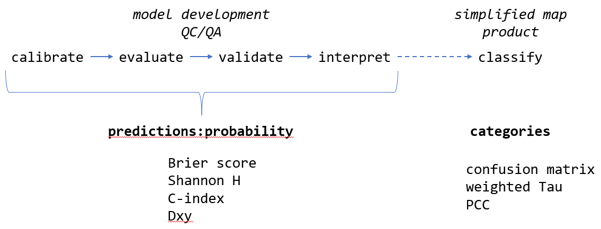
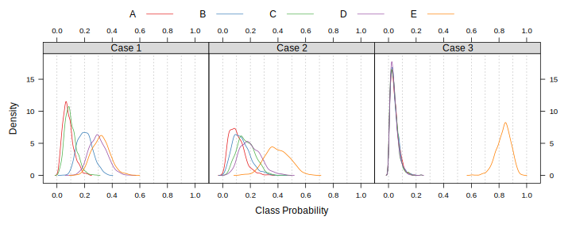

# (APPENDIX) Appendix {-} 


# Accuracy and Uncertainty for Categorical Predictions {#acc-unc-categorical-data}

This document is [an abbreviated attempt](https://ncss-tech.github.io/misc/accuracy/accuracy-uncertainty-soil-class-prediction.html) at addressing some of the issues related to accuracy and uncertainty that I have brought up over discussion of raster (soil class) mapping standards. As such, the following is a combination of soap box moments, demonstrations of methods, todo items for my future self, and references. Honestly, before going any further be sure to read the recent paper by @Rossiter2017.

This [article](http://www.fharrell.com/post/classification/) does a fine job of summarizing the major differences between *classification* and *prediction*. Most of the modeling frameworks we will be using or evaluating generate predictions in the form of probabilities (prediction). At some point the stack of probabilities will be converted into a single map depicting the most likely class at each pixel (classification). The iterative assessment of model performance (e.g. accuracy and uncertainty) should happen as part of the *prediction* phase via metrics such as the Brier score and Shannon entropy. An evaluation of the final *classification* is helpful for communicating accuracy to a wider audience (e.g. percent correctly classified) but should not be the primary means of optimizing model performance.



## Status Quo
The "Digital Soil Mapping" chapter (5) from the latest Soil Survey Manual describes two commonly used metrics for the description of accuracy and uncertainty: overall accuracy / percent correctly classified (PCC) and the confusion index (CI) of @Burrough1997. These methods are widely used and implementation is simple.

Given the complex nature of class mapping results (e.g. stack of class probabilities) and inherent (likely quantifiable) similarity of soil classes, I think that we should explore options for a more robust suite of accuracy and uncertainty metrics. Furthermore, it is my opinion that any evaluation of probabilistic predictions should be integrated over *all* classes. 


## Theses

 * The $\tau$ statistic of [@Rossiter2017] is a more reliable and nuanced representation of accuracy vs. PCC.

 * The $\tau$ statistic can be *upgraded* with additional *knowledge* given the availability of 1) prior understanding of class proportions, and/or, 2) meaningful parameterization of pair-wise class distances.
  
 * There can be consensus on formulation of *approximate* pair-wise distances, within a given modeling domain. Pair-wise distances may not necessarily be the same across modeling domains or projects.
  
 * Brier scores are option for an even more nuanced representation of accuracy as they integrate all predicted probabilities.

 * The confusion index of @Burrough1997 is an *unstable* metric when the number of predicted classes is large and when the most likely classes are associated with low probabilities.
   
 * Shannon entropy (log base 2) is a more reliable representation of uncertainty than the confusion index, especially when the number of possible classes varies by project. The importance of a universally reliable representation of uncertainty is even more important when several methods are used concurrently.
  
 * There *should be* a way to integrate pair-wise distances into the Shannon entropy (or related method) and Brier scores; maybe we will discover those here.
  

  

## Soap Box Time
Our current QC/QA process is based on many forms of evaluation, accumulates some degree of subjectivity and relies heavily on qualitative forms of information (field experience, institutional knowledge, etc.).  On the opposite side of the spectrum, the validation of raster mapping is often claimed to be free of subjective interference and entirely quantitative. Those are "good things" that we should always strive for, however, the simplicity of calculating a "percent correctly classified" can interfere with a more nuanced evaluation of accuracy. As I mentioned on the phone (and implicitly volunteered for) a validation "score" might be more meaningful than any single validation metrics. 

One such score might include:

 * agreement between predicted probabilities and observed class (e.g. Brier scores)
 * agreement between the most likely class and observed class, accounting for class similarities (e.g. weighted $\tau$)
 * distribution of class-wise Shannon entropy values
 * calibration vs. predicted vs. validation proportion of classes
 * some kind of metric that integrates spatial connectivity of predictions / observations, for example: cross-tabulate calibration / prediction / validation classes with geomorphon classes

I strongly believe that we need a robust suite of metrics primarily for internal discussion and evaluation of raster mapping products; even more so when complex modeling frameworks such as randomForest or neural nets are used.

Accuracy and uncertainty metrics are primarily vehicles for understanding, re-calibrating (as needed), and communicating statistical models as part of the development and QA/QC process.


## Concept Demonstration via Simulated Data

Consider a supervised classification that generates predictions for 5 possible soil classes. Suites of predicted probabilities fall into 3 general cases:

 * "Case 1": classes **D** and **E** are nearly tied for the most likely class, but their respective probabilities are generally < 0.5
 * "Case 2": class **E** is almost always the most likely class, but classes **B**, **C**, and **D** are tied for second place
 * "Case 3": class **E** is always the most likely class, all other classes have probabilities < 0.2


```r
# examples of three cases
print(p.1)
```

<div class="figure">

<p class="caption">(\#fig:unnamed-chunk-2)Probability distributions of predictions.</p>
</div>

Even though these are simulated data, the three cases above demonstrate common modeling scenarios where classification uncertainty ranges from very low ("Case 3") in some areas to quite high ("Case 1") in others. These three cases could easily be associated with real situations:

 * "Case 1": predictions for soil classes represent a hillslope complex that isn't quite disentangled by the model
 * "Case 2": predictions for soil classes represent limited success in partitioning between a single water shedding (**E**) vs. multiple water collecting positions (**A**-**D**)
 * "Case 3": predictions for soil classes represent a successful partitioning between Holocene age deposits (**E**) vs. older alluvial terraces (**A**-**D**)


## Accuracy

### Confusion Matrix / Area Under ROC

See [Chapter 9](http://ncss-tech.github.io/stats_for_soil_survey/chapters/9_uncertainty/Uncert_val.html).

Review some of the [commentary]((http://www.fharrell.com/post/mlconfusion/)) on the use of *only* the confusion matrix and AUROC for rating predictions in the medical field.

*The confusion matrix and associated statistics are a useful starting point but not the most effective means for comparing performance.*

### Brier Scores

Brier scores [@Brier1950, @harrell2015] quantify agreement between observed classes and predicted probabilities:
$$ B = \frac{1}{n} \sum_{i=1}^{n}{ ( p_{i} - y_{i} )^{2}  }  $$
where $B$ is an index of agreement between predicted probabilities, $\mathbf{p}$, and class labels, $\mathbf{y}$. Larger values suggest less agreement between probabilities and observed class labels.

Follow-up:

 * https://en.wikipedia.org/wiki/Brier_score
 * https://stats.stackexchange.com/questions/112250/understanding-the-rank-probability-score
 * http://empslocal.ex.ac.uk/people/staff/dbs202/publications/2008/stephenson-brier.pdf
 * http://iopscience.iop.org/article/10.1088/1748-9326/7/4/044019


*What about a weighted version of this score, based on a re-statement of the distance matrix?*


### Tau and Weighted Tau (class-similarity)

[@Rossiter2017] implemented in `aqp::tauw()`. This paper contains some discussion on a weighted version of Shannon Entropy using the subset of similarities between predicted classes and the *actual* class.


#### Commentary from DGR

 * Prior class probabilities. Commentary from DGR:
   + That depends on the mapping method. In LDA we can set the priors, then we'd use these in tau. But for an automatic DSM procedure the priors are all equal (Foody's modified kappa). If judging a manual mapper, the priors can be their overall probabilities for an area.  E.g., in one county we have a pretty good idea that it is half Vertisols, so the mapper is prejudiced (in the good sense) about this.
   
 * Class similarity
   + The weighting is quite tricky since obviously it can be used to manipulate results. I really like the 'error loss' method if there is some numerical value put on each difference -- as I did with the NC site index. In CA you have the Storie index, you could use that difference for mis-mappings of series.  Numerical taxonomy measures could also be used but you'd need to agree on which properties to use. If the purpose of the map is e.g. to estimate C stocks, then the difference between the mean C stocks  between classes from NASIS might be used. Coming up with a transparent and accepted weighting can be tricky.


## Uncertainty

### Shanon Entropy

$$ H = -\sum_{i=1}^{n}{p_{i} * log_{2}(p_{i})}  $$

where $H$ is an index of uncertainty associated with predicted probabilities, $\mathbf{p}$, of encountering classes $i$ through $n$. Smaller values imply less entropy (more information). Given equal class probabilities, H will increas as the number of classes increases.


@Kempen2009 described a normalized version of Shannon entropy that is constrained to values between 0 and 1:

$$ H = -\sum_{i=1}^{n}{p_{i} * log_{n}(p_{i})}  $$
where $H$ is an index of uncertainty associated with predicted probabilities, $\mathbf{p}$, of encountering classes $i$ through $n$. This representation may be conveniently contained within the range of $[0,1]$, however, it cannot be used to compare uncertainty from models using different numbers of classes.

It is my recommendation that the $log_{2}$ version of Shannon H be used as our *primary* metric of uncertainty for predictive soil class mapping.

*Shannon entropy does not take into account similarity among classes.*


## Review


```r
# examples of three cases
print(p.1)
```


```r
pp <- ldply(s, performance)
names(pp)[1] <- 'example'

kable_styling(kable(pp, row.names = FALSE, digits = 2, format='html'), full_width = FALSE)
```

<table class="table" style="width: auto !important; margin-left: auto; margin-right: auto;">
 <thead>
  <tr>
   <th style="text-align:left;"> example </th>
   <th style="text-align:right;"> brier.score </th>
   <th style="text-align:right;"> tau.equal </th>
   <th style="text-align:right;"> tau.actual </th>
   <th style="text-align:right;"> PCC </th>
  </tr>
 </thead>
<tbody>
  <tr>
   <td style="text-align:left;"> Case 1 </td>
   <td style="text-align:right;"> 0.73 </td>
   <td style="text-align:right;"> 0.19 </td>
   <td style="text-align:right;"> 0.13 </td>
   <td style="text-align:right;"> 0.35 </td>
  </tr>
  <tr>
   <td style="text-align:left;"> Case 2 </td>
   <td style="text-align:right;"> 0.71 </td>
   <td style="text-align:right;"> 0.27 </td>
   <td style="text-align:right;"> 0.21 </td>
   <td style="text-align:right;"> 0.42 </td>
  </tr>
  <tr>
   <td style="text-align:left;"> Case 3 </td>
   <td style="text-align:right;"> 0.32 </td>
   <td style="text-align:right;"> 0.77 </td>
   <td style="text-align:right;"> 0.43 </td>
   <td style="text-align:right;"> 0.81 </td>
  </tr>
</tbody>
</table>


```r
ex <- ldply(s, extractExample, n=1)
names(ex)[1] <- 'example'
ex$CI <- NULL
ex$actual <- NULL

add_header_above(kable_styling(kable(ex, row.names = FALSE, digits = 2, format='html'), full_width = FALSE), header=c(" " = 1, "Class Probabilities" = 5, "Uncertainty" = 1))
```

<table class="table" style="width: auto !important; margin-left: auto; margin-right: auto;">
 <thead>
<tr>
<th style="empty-cells: hide;border-bottom:hidden;" colspan="1"></th>
<th style="border-bottom:hidden;padding-bottom:0; padding-left:3px;padding-right:3px;text-align: center; " colspan="5"><div style="border-bottom: 1px solid #ddd; padding-bottom: 5px; ">Class Probabilities</div></th>
<th style="border-bottom:hidden;padding-bottom:0; padding-left:3px;padding-right:3px;text-align: center; " colspan="1"><div style="border-bottom: 1px solid #ddd; padding-bottom: 5px; ">Uncertainty</div></th>
</tr>
  <tr>
   <th style="text-align:left;"> example </th>
   <th style="text-align:right;"> A </th>
   <th style="text-align:right;"> B </th>
   <th style="text-align:right;"> C </th>
   <th style="text-align:right;"> D </th>
   <th style="text-align:right;"> E </th>
   <th style="text-align:right;"> Shannon.H </th>
  </tr>
 </thead>
<tbody>
  <tr>
   <td style="text-align:left;"> Case 1 </td>
   <td style="text-align:right;"> 0.11 </td>
   <td style="text-align:right;"> 0.15 </td>
   <td style="text-align:right;"> 0.08 </td>
   <td style="text-align:right;"> 0.21 </td>
   <td style="text-align:right;"> 0.45 </td>
   <td style="text-align:right;"> 2.04 </td>
  </tr>
  <tr>
   <td style="text-align:left;"> Case 2 </td>
   <td style="text-align:right;"> 0.09 </td>
   <td style="text-align:right;"> 0.21 </td>
   <td style="text-align:right;"> 0.25 </td>
   <td style="text-align:right;"> 0.15 </td>
   <td style="text-align:right;"> 0.29 </td>
   <td style="text-align:right;"> 2.22 </td>
  </tr>
  <tr>
   <td style="text-align:left;"> Case 3 </td>
   <td style="text-align:right;"> 0.03 </td>
   <td style="text-align:right;"> 0.03 </td>
   <td style="text-align:right;"> 0.04 </td>
   <td style="text-align:right;"> 0.03 </td>
   <td style="text-align:right;"> 0.87 </td>
   <td style="text-align:right;"> 0.79 </td>
  </tr>
</tbody>
</table>


## Example Implementation

The `aqp` package has an implementation of Shannon entropy and Brier score; there are many other implementations but these are convenient for soil survey work. Consider the following table of predicted probabilities (classes A,B,C,D,E) and observed class (actual).


```r
library(aqp)

# example data
d <- structure(list(A = c(0.0897243494322252, 0.0537087411977284, 
0.0643087579284512, 0.0582791533521884, 0.0655491726966812, 0.0878056947034425, 
0.0550727743006022, 0.10724015754623, 0.0332599961787985, 0.0555131608754956
), B = c(0.191110141078936, 0.187244044389649, 0.119214057525671, 
0.198461646003737, 0.161851348940294, 0.172157251906694, 0.113611770097243, 
0.178697159594029, 0.194607795787689, 0.188977055949146), C = c(0.121941735763077, 
0.0770539012535731, 0.0977753159795662, 0.0774293724263895, 0.072198187957068, 
0.0366921003115242, 0.151033286139089, 0.0974443429098862, 0.124876574685048, 
0.0864142563046045), D = c(0.351108807309283, 0.322120077305279, 
0.440632731639948, 0.401063395801608, 0.312647702445919, 0.304193047630158, 
0.270239142407351, 0.258895264130713, 0.422747316475851, 0.252724366285052
), E = c(0.246114966416479, 0.359873235853771, 0.278069136926363, 
0.264766432416077, 0.387753587960038, 0.399151905448182, 0.410043027055715, 
0.357723075819142, 0.224508316872614, 0.416371160585702), id = c("1", 
"10", "100", "1000", "101", "102", "103", "104", "105", "106"
), actual = c("D", "B", "D", "E", "D", "D", "E", "E", "D", "E"
)), .Names = c("A", "B", "C", "D", "E", "id", "actual"), row.names = c(NA, 
10L), class = "data.frame")

# check it out
# predictions, and actual, observed class
head(d)
```

```
##            A         B          C         D         E   id actual
## 1 0.08972435 0.1911101 0.12194174 0.3511088 0.2461150    1      D
## 2 0.05370874 0.1872440 0.07705390 0.3221201 0.3598732   10      B
## 3 0.06430876 0.1192141 0.09777532 0.4406327 0.2780691  100      D
## 4 0.05827915 0.1984616 0.07742937 0.4010634 0.2647664 1000      E
## 5 0.06554917 0.1618513 0.07219819 0.3126477 0.3877536  101      D
## 6 0.08780569 0.1721573 0.03669210 0.3041930 0.3991519  102      D
```

Brier scores (accuracy) are computed over all predictions and associated observed classes.

```r
# compute Brier score from all predictions
brierScore(d, classLabels = c('A', 'B', 'C', 'D', 'E'), actual = 'actual')
```

```
## [1] 0.5833992
```


Shannon entropy (uncertainty) is computed from each vector of predicted probabilities.

```r
# shannon entropy for first row, could be a single pixel or obs. point
shannonEntropy(d[1, c('A', 'B', 'C', 'D', 'E')])
```

```
## [1] 2.166525
```

```r
# compute shannon entropy for all rows
apply(d[, c('A', 'B', 'C', 'D', 'E')], 1, shannonEntropy)
```

```
##        1        2        3        4        5        6        7        8 
## 2.166525 2.021157 1.982791 2.024063 2.011094 1.971243 2.036219 2.151995 
##        9       10 
## 2.006615 2.018874
```


## Resources
 
### Evaluating Accuracy of Categorical / Probabilistic Predictions
 
 * [Commentary on the use of confusion matrix and AUROC](http://www.fharrell.com/post/mlconfusion/)
 * [What is  the AUC / AUROC?](https://stats.stackexchange.com/questions/132777/what-does-auc-stand-for-and-what-is-it/193333#193333)
 * [Commentary on C-index / AUROC](https://stats.stackexchange.com/questions/1241/what-do-roc-curves-tell-you-that-traditional-inference-wouldnt)
 * [AUROC](https://stats.stackexchange.com/questions/90659/why-is-auc-higher-for-a-classifier-that-is-less-accurate-than-for-one-that-is-mo/90705#90705)
 * [Scoring Rules](https://en.wikipedia.org/wiki/Scoring_rule)
 * [Frank Harrel's Website + links](http://biostat.mc.vanderbilt.edu/wiki/Main/RmS)
 * [Classification vs. Prediction](http://www.fharrell.com/post/classification/)

### Sampling and Stability of Estimates
  
 * [Gridded Data: Sample vs. Population](http://ncss-tech.github.io/AQP/sharpshootR/sample-vs-population.html)
 * [Demonstration of sampling density vs. stability of median](http://ncss-tech.github.io/AQP/sharpshootR/sampling-stability-demo.html)


