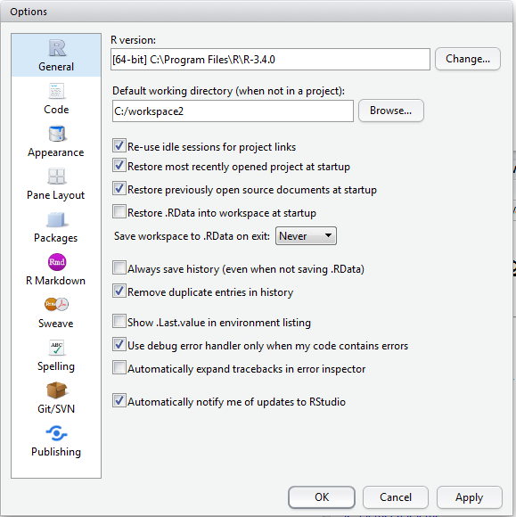
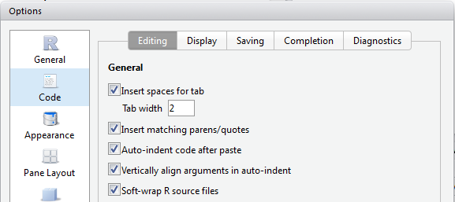

# Create Workspace

Make a local folder `C:\workspace2` to use as a working directory for this course. Use all lower case letters please.


# Configure RStudio

Open **RStudio**, and edit the "Global Options" (Main menu: **Tools &rarr; Global Options**). 

## Essentials

These options are important for pleasant, reproducible and efficient use of the **RStudio** environment:

  1. **Change** the default working directory to `C:\workspace2` (**R** General Tab)

  2. <font style="color:red">**Uncheck**</font> "Restore .Rdata into workspace at startup" (**R** General Tab) <font style="color:red">**VERY IMPORTANT**</font>
  
   
  
**RStudio** detects the available **R** installations on your computer. 

Individual versions are certified for the Software Center as they become available, and sometimes there is a more recent version available for download. It is worth taking the time _before installing packages_ to get the latest version of **R** available to you. This is to minimize compatibility issues which arise over time.
  
## Personalization

   

  - Optional: Check "Soft-wrap **R** source files" (Code/Editing Tab)
  
  - Optional: Show help tooltips, control auto-completion and diagnostics (Code/Completion and Diagnostics Tabs)

  - Optional: Update code font size, colors and theme (Appearance)
  
  - Optional: Use **RStudio** Projects (top-right corner) to manage working directories 


# Install .RProfile

The code you run next will establish a *safe* location for your **R** package library. Your package library should ideally be on a local disk with about 1 - 2 GB of free space. We want to prevent installs to `~` (your `$HOME` directory) which is typically on a network share (such as `H:/`), not a local disk. 

**Copy** the following code in the box below and **paste** into the **R** console panel after the command prompt (`>`) and press **enter**. 

_Hint: the **R** console is the lower left or left window in RStudio with a tab labeled "Console"._

```{r, eval=FALSE}
source('https://raw.githubusercontent.com/ncss-tech/soilReports/master/R/installRprofile.R')
installRprofile(overwrite=TRUE)
```

An updated set of library paths will be printed. Close and re-open **RStudio**, or Restart **R** (Main menu: **Session &rarr; Restart R**; or **Ctrl+Shift+F10**), before continuing to the next steps.

  

When your `.Rprofile` is set up correctly you will see output in a new **R** console/session confirming your _library paths_ are:

 1) on a local drive (such as `C:/`)
 
 2) specific to the version number of **R** installed (such as `4.0`)
 
 
# Install Required Packages

Packages can be installed by name from the Comprehensive **R** Archive Network (CRAN) using the base **R** function `install.packages`
There are a lot of packages out there -- many more than you will download here, and many of which are useful for Soil Survey work. 

The first time you install packages, **R** will ask you if you want to create a local repository in your User `Documents` folder. 
Click **Yes**.

For example, to download and install the `remotes` package from CRAN:
 
```{r, eval=FALSE}
install.packages("remotes")
```

To install the **R** packages used in this class copy all of the code from the box below and paste into the **R** console window. Paste after the command prompt (`>`) and press **enter**. 
  
Downloading and configuring the packages will take a while if you are installing or upgrading all of the packages in the list below. 

```{r, eval = FALSE}
# ipkCRAN: a helper fuction for installing required packages from CRAN
# - p: vector of package names
# - up: logical - upgrade installed packages? Default: TRUE
ipkCRAN <- function(p, up = TRUE){
  message('installing packages from CRAN...')
  if (up) {
    # default is to re-install everything
    install.packages(p, dependencies = TRUE)
  } else {
    # but if up != TRUE install just what is needed
    new.pkg <- p[! (p %in% installed.packages()[, "Package"])]
    if (length(new.pkg) > 0) {
      install.packages(new.pkg, dependencies = TRUE)
    }
  }
  # finally, check and see if any failed
  missing.pkg <- p[! (p %in% installed.packages()[, "Package"])]
  if (length(missing.pkg) > 0) { 
     warning(sprintf('\033[31mOne or more packages failed to install!\033[39m\n%s',
             sprintf("Restart R then try `\033[35minstall.packages(c(%s))\033[39m`",
             paste0(sprintf('"%s"', missing.pkg), collapse = ","))), call. = FALSE)
  }
}

## character vector of packages
packages <- c(
    # soil
    "aqp", "soilDB", "sharpshootR", "soiltexture",
    # gis
    "rgdal", "raster", "sp", "sf", "terra", "gdalUtils", 
    "rgrass7", "RSAGA", "exactextractr", "fasterize",
    # data management
    "dplyr", "tidyr", "devtools", "roxygen2", "Hmisc", "RODBC", "circular", "DT", "remotes",
    # graphics
    "ggplot2", "latticeExtra", "maps", "spData", "tmap", 
    "mapview", "plotrix", "rpart.plot", "visreg",
    # modeling
    "car", "rms", "randomForest", "ranger", "party", "caret", "vegan", "ape", "shape",
    # sampling
    "clhs"
  )

## install vector of CRAN packages "safely"
##  up = TRUE to download all packages 
##  up = FALSE to download only packages you don't already have installed
ipkCRAN(packages, up = TRUE)
```

The `ipkCRAN` function will let you know if any of the above packages fail to install.

Any time you run code, _always_ check the console output for warnings and errors before continuing. If a lot of output is produced by a command you should scroll up and sift through. It may be best early on to send commands _individually_ to learn about and inspect their output. 

## Common Errors

### No output is produced after pasting into console

If you do not have a new command prompt (`>`) and a blinking cursor on the left hand side of your console, but instead see a `+` after you run a command, **R** may think you are still in the middle of submitting input to the "read-eval-print-loop" (REPL). If this is not expected you are possibly missing closing quotes, braces, brackets or parentheses. **R** needs to know you were done with your expression, so you may need to supply some input to get the command to be complete. You can use the shortcut **Ctrl+C** to get out of a partially-complete command. 
 
Pasting code line-by-line is useful but prone to input errors with multi-line expressions. Alternately, you can run commands or an entire file using the GUI or keyboard shortcuts such as **Ctrl+Enter**. You have a chance to try this in the example at the end.

### `‘SOMEPACKAGE’ is not available (for R version X.Y.Z)`

This means _either_:

  1. A package named 'SOMEPACKAGE' exists but it is not available for your version of **R**
  
  2. CRAN does not have a package with that name
  
You can try again, but first check for spelling and case-sensitivity. When in doubt search the package name on Google or CRAN to make sure you have it right. Note that not all **R** packages are available on CRAN: there are many other ways that you can deliver packages (including GitHub described below).

##  Packages not on CRAN

<!-- These packages aren't available to our computers as we are stuck at an older version of R, or not currently on CRAN. The `soilDB` and `sharpshootR` packages should be back on CRAN by early February. 

```{r, eval=FALSE}
# temporary CRAN fix - get previous version for R 4.0
install.packages('https://cran.microsoft.com/snapshot/2020-06-15/bin/windows/contrib/4.0/Rcpp_1.0.4.6.zip', repos = NULL)
install.packages("https://cran.microsoft.com/snapshot/2020-06-24/bin/windows/contrib/4.0/raster_3.1-5.zip", repos = NULL)
install.packages("https://cran.microsoft.com/snapshot/2020-06-24/bin/windows/contrib/4.0/terra_0.6-9.zip", repos = NULL)

# temporary CRAN fix - get previous version of caTools
install.packages('https://cran.microsoft.com/snapshot/2019-04-15/bin/windows/contrib/3.6/caTools_1.17.1.2.zip', repos = NULL)

# RODBC binaries are no longer available for R 3.6.3 from CRAN. It depends on R 4.0.0. 
# The following call pulls the binaries from the “old” 3.6 release.
install.packages('https://cran.r-project.org/bin/windows/contrib/3.6/RODBC_1.3-16.zip', repos = NULL)
```
-->

To install the latest version of packages from the Algorithms for Quantitative Pedology (AQP) suite off GitHub we use the `remotes` package. 

The AQP packages are updated much more frequently on GitHub than they are on CRAN.

Generally, the CRAN versions (installed above) are the "stable" releases whereas the GitHub repositories have new features and bug fixes.

```{r, eval=FALSE}
remotes::install_github("ncss-tech/aqp", dependencies=FALSE, upgrade=FALSE, build=FALSE)
remotes::install_github("ncss-tech/soilDB", dependencies=FALSE, upgrade=FALSE, build=FALSE)
remotes::install_github("ncss-tech/soilReports", dependencies=FALSE, upgrade=FALSE, build=FALSE)
remotes::install_github("ncss-tech/sharpshootR", dependencies=FALSE, upgrade=FALSE, build=FALSE)
```


# Connect Local NASIS

Establish an ODBC connection to NASIS by following the directions at the following hyperlink ([ODBC Connection to NASIS](http://ncss-tech.github.io/AQP/soilDB/setup_local_nasis.html)).

Once you've successfully established a ODBC connection, prove it by loading your NASIS selected set with the site and pedon tables for any pedons from your local area. You only need a few pedons at a minimum for this demo -- too many (say, >20) will make the example profile plot cluttered.

 * Paste the below code at the command prompt (`>`) and press **enter**, as you did above. 
 
 * Or create a new **R** script (Main menu: **File &rarr; New File &rarr; R Script**) and paste code into the "Source" pane (script editor window). Then, click the **Run** button in the top-right corner of the Script Editor or use **Ctrl+Enter** to run code at the cursor location / any selected code. This will execute the code in the Console.

Submit the resulting plot to your mentor (from "Plot" pane (bottom-right): **Export &rarr; Save as PDF...**)

```{r eval=FALSE}
# load packages into the current session
library(aqp) # provides "SoilProfileCollection" object & more
library(soilDB) # provides database access methods

# get pedons from NASIS selected set
test <- fetchNASIS(from = 'pedons')

# inspect the result
str(test, max.level = 2)

# make a profile plot

# set margins smaller than default
par(mar=c(1,1,1,1))

# make profile plot of selected set, with userpedonid as label
plot(test, label='pedon_id')
```


# Proof

Follow the one line example below, copy the output, and submit the results to your mentor. This will help us to verify that all of the required packages have been installed.

```{r, eval=FALSE}
# dump list of packages that are loaded into the current session
sessionInfo()
```

7. Additional Support/Optional Readings
  
  * Paul Finnel's [webinar](https://youtu.be/VcdowqknChQ)
  * [Spatial Data Analysis and Modeling with R](http://rspatial.org/) (highly recommended)
  * [R-Intro](https://cran.r-project.org/doc/manuals/r-release/R-intro.pdf)
  * [R for Beginners](ftp://cran.r-project.org/pub/R/doc/contrib/Paradis-rdebuts_en.pdf)
  * [The R Inferno](http://www.burns-stat.com/documents/books/the-r-inferno/)
  * [AQP Website and Tutorials](http://ncss-tech.github.io/AQP/)
  * [Stats for Soil Survey Webinar](https://www.youtube.com/watch?v=G5mFt9k37a4)
  * [Soil Data Aggregation using R Webinar](https://www.youtube.com/watch?v=wD9Y0Qpv5Tw)
  
