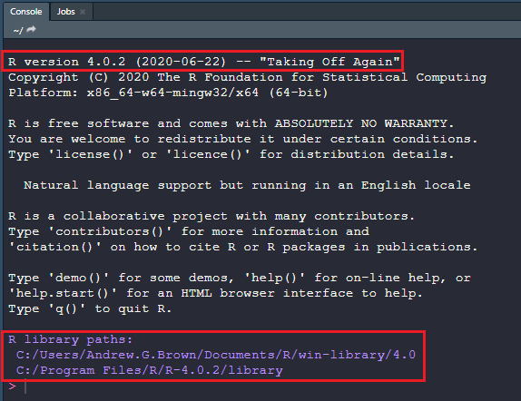

1. **View** Paul Finnel's [webinar](https://youtu.be/VcdowqknChQ)

2. **Create** a folder on your machine to be used as the working directory for this course at `C:/workspace`.

3. **Open RStudio**, **verify** that version 0.99.467 is installed (Help>About RStudio), and **set** your working directory (Session>Set Working Directory) to `C:/workspace`.

4. **Install** the necessary additional packages by **copying and pasting** the following code into the R console window after the command prompt (>) and hit **enter**. This doesn't require admin privileges. Depending on your network connection this could take a while. *Hint the R console is the lower left or left window in RStudio with a tab labeled "Console".* 

  

```{r, warning=FALSE, message=FALSE, results="hide", eval=FALSE}
## Create new folders to reroute the location of the R packages. This is a work around for the problems caused by ITs file redirection of the My Documents folder. The .Rprofile file will inform RStudio were your packages are located each time it's opened.
dir.create(path="C:/workspace", recursive = T)
dir.create(path="C:/R/win-library/3.2", recursive = T)

x <- '.libPaths(c("C:/R/win-library/3.2", "C:/Program Files/R/R-3.2.1/library"))'
write(x, file = "C:/workspace/.Rprofile")

## Set CRAN mirror
local({
  r <- getOption("repos")
  r["CRAN"] <- "http://cran.mirrors.hoobly.com/"
  options(repos = r)
})

## Install and packages and dependencies
ipak <- function(pkg){
    new.pkg <- pkg[!(pkg %in% installed.packages(lib.loc = "C:/R/win-library/3.2")[, "Package"])]
    if (length(new.pkg) > 0) 
      install.packages(new.pkg, lib = "C:/R/win-library/3.2", dependencies = TRUE)
}

## list of packages
packages <- c("aqp", "soilDB", "sharpshootR", "circular", "Rcmdr", "fBasics", "rms", "randomForest", "rpart", "caret", "knitr", "printr", "markdown", "raster", "rgdal", "sp", "spatial", "shape", "shapefiles", "plyr", "dplyr", "reshape2", "httr", "cluster", "ape", "lattice", "latticeExtra", "ggplot2", "RColorBrewer", "plotrix")

## install
ipak(packages)

## install the latest version of packages from the AQP suite:
install.packages("aqp", repos = "http://R-Forge.R-project.org", type = "source")
install.packages("soilDB", repos = "http://R-Forge.R-project.org", type = "source")
install.packages("sharpshootR", repos = "http://R-Forge.R-project.org", type = "source")

## load packages in the list
sapply(packages, library, character.only = TRUE, quietly = TRUE, logical.return =
  TRUE)
```

5. Establish an ODBC connection to NASIS by following the directions at the following hyperlink ([ODBC Connection to NASIS](https://r-forge.r-project.org/scm/viewvc.php/*checkout*/docs/soilDB/setup_local_nasis.html?root=aqp)).

Once you've successfully established a ODBC connection, prove it by loading your NASIS selected set with the site and pedon tables for any user pedon id (e.g. 11CA794317), run `fetchNASIS()` in the R console like the example below, and submit your results to Tom D'Avello.

```{r example, message=FALSE, warning=FALSE, eval=FALSE}
# Example

library(soilDB)

test <- fetchNASIS()

str(test, max.level = 2)
```

6. Follow the one line example below, copy the output, and submit the results to Tom D'Avello. This should spit back a report of all the packages you downloaded.

```{r, eval=FALSE}
# Example
sessionInfo()
```


7. Additional Support/Optional Readings
  * [Soil Data Aggregation using R](https://www.youtube.com/watch?v=wD9Y0Qpv5Tw)
  * [Stats for Soil Survey Webinar](https://www.youtube.com/watch?v=G5mFt9k37a4)
  * [Introduction to Stats in R](http://www.gardenersown.co.uk/Education/Lectures/R/index.htm#inputting_data)
  * [AQP Website](http://aqp.r-forge.r-project.org/)
