  

#CHAPTER 1: INTRODUCTION TO R

- [1.0 Introduction](#intro)
- [1.1 R Interface](#gui) 
- [1.2 Data Management in R](#datamanagement)
     - [1.2.1 Importing Data](#dataimport)
     - [1.2.2 Exporting Data](#dataexport)
     - [1.2.3 Viewing Data](#viewingdata)
- [1.3 Saving R Files](#saving)
     - [1.3.1 Workspace](#workspace)
     - [1.3.2 R Script](#script)
     - [1.3.3 R History](#history)
     - [1.3.4 R Graphics](#graphics)
- [1.4 Installing and Loading Packages](#packages)
- [1.5 A Graphical User Interface for R - Rcmdr](#cmdr)
     - [1.5.1 Importing Data with Rcmdr](#importrcmdr)
     - [1.5.2 Creating Graphs](#graphs)
     - [1.5.3 Simple Statistics](#statistics)
     - [1.5.4 Importing and Executing a Saved Rcmdr Script](#rcmdrscript)
- [1.6 RStudio](#studio)
     - [1.6.1 Working with Scripts](#rscript)
     - [1.6.2 Help Features](#help)
- [1.7 Introduction to the soilDB Package](#soilDB)
- [1.8 Review](#review)
- [1.9 Additional Resources](#additional)
- [1.10 References](#ref)
 
##<a id="intro")></a>1.0  Introduction

R is a free, open-source software and programming language developed in 1995 at the University of Auckland that is capable of executing simple and complex mathematical, statistical, and graphical functions [(Ikaha and Gentleman, 1996)](https://www.stat.auckland.ac.nz/~ihaka/downloads/R-paper.pdf).  It is a dialect of the S language and is case sensitive. The R interface allows you to execute functions using a command prompt (>). To date R has become popular amongst soil scientists and ecologists for exploring data, modeling soil and plant relationships, generating raster-based model predictions, and developing new R functions.  

R and RStudio have been installed on all computers with NASIS and is typically updated and CCE approved once a year. USDA machines may be 1 to 3 versions behind the latest available version for public download. Having an outdated version of R though rarely creates a problem, although warnings may appear.  

Tips for using R:  

- R is command-line driven and requires you to type or copy and paste commands after the command prompt (>) that appears when you open R. After typing a command and pressing enter on your keyboard in the R console, the command will run. If your command is not complete, R will issue a continuation prompt (signified by a plus sign, `+`). 

- R has a built in editor where you can edit and select code to run. Some people find it easiest to use Notepad instead. 

- R is case sensitive, make sure your spelling and capitalization are correct!  
 
- Commands in R are also called functions. The basic format of a function in R is: `function.name(argument, options)`  
 
- The up arrow (^) on your keyboard can be used to bring up previous commands that you've typed in the R console. 
 
- The `$` is used to select a particular column within the dataset, `dataset$column`.

- Any text that you do not want R to act on (such as instructions, information, notes or comments) needs to be preceded by a `#` (aka hashtag or comment).  R will ignore the remainder of the script line following `#`, if it is included in an R script. For example:  
 
`plot(x ~ y) # This text will not affect the plot function because of the comment`


## <a id="gui")></a>1.1  R Graphical User Interface
 
Navigate to R (in the start and program menus) and open R (3.2.2, or latest version). When you first open R, the R console window below appears:  

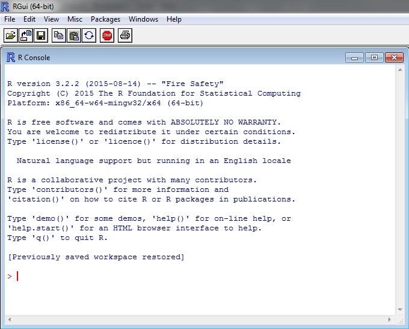  

The RGui contains 3 main windows: R console, R editor, and R graphics:  

  

To use R, you type commands after the command prompt `>`. In the R Console window, if you type a command and press ENTER, the command will run. You are able to edit command text in R Editor and are also able to then highlight, right click, and select run for the commands that you wish to run. The R Graphics window will display only when the `plot()` function is run.  

Commands in R can range from simple mathematical equations to complex statistical functions and models. As an example of simple math, if you type:  `9 * 8 + 6 - 1` in R and hit ENTER, R will act as a calculator and return the answer `77`.  

## <a id="datamanagement")></a>1.2  Data Management in R  

At the beginning of each R session, whether you are using R or Rstudio, you want to make sure that you set your working directory. This directory should be where your input datasets are stored, R files are located, and will also serve as the default storage of plots or exported objects from R. 

Before working in R, create a folder to keep all R files in, such as "C:/workspace". Change the working directory in R to the new folder you set up using the following command:   

```{r, eval=FALSE}
setwd("C:/workspace")
```

To check the filepath of the current working directory, which should now be "C:/workspace", type:

```{r, eval=FALSE}
getwd()
```

The working directory can also be changed and set by clicking on File > Change dir... from the menu bar. Setting a working directory allows you to import data into R with just a file name, not an entire folder path and file name. It also is the default folder for when you save or export data out of R. Every time you start an R session, you should set your working directory. 

### <a id="dataimport")></a> 1.2.1 Importing Data
After your working directory is set, you can import data from .txt, .csv, etc. One basic command for importing data into R is `read.csv()`. The command is followed by the file name and then some optional instructions for how to read the file.    

First, create an example file by copying the following contents below, starting with location, paste it into Notepad and save to a file named sand_example.txt, into the C:/workspace folder:  

location,landuse,horizon,depth,sand  
city,crop,A,14,19  
city,crop,B,25,21  
city,pasture,A,10,23  
city,pasture,B,27,34  
city,range,A,15,22  
city,range,B,23,23  
farm,crop,A,12,31  
farm,crop,B,31,35  
farm,pasture,A,17,30  
farm,pasture,B,26,36  
farm,range,A,15,25  
farm,range,B,24,29  
west,crop,A,13,27  
west,crop,B,29,25  
west,pasture,A,11,21  
west,pasture,B,31,26  
west,range,A,14,23  
west,range,B,24,24  

The sand_example.txt file can then imported into R by typing:  

```{r, echo=FALSE}
sand<- read.csv("C:/workspace/sand_example.txt", header=TRUE, sep=",") 

#since you've specified your working directory, you could also use: sand<-read.csv("sand_example.txt")

# use the read.table() function to import other types of table formatted files
```

There are other arguments that you might want to use with `read.csv()`. A quick way to find out what arguments are available for a given command is to type `help(command)`. In this example, you would type:

```{r, eval=FALSE}
help(read.csv) # or
?read.csv
```

These commands will bring up a webpage that describes all of the possible arguments for a command and usually provides examples. You should also notice by reading the help page for `read.csv()` that it is just one of several functions for reading text files.

### <a id="dataexport")></a> 1.2.2 Exporting Data

To export data from R, use the command `write.csv`. Since we have already set our working directory, R will automatically save our file into the folder that we specified as our working directory.  

```{r, eval=FALSE}
write.csv(sand, file = "sand_example2.csv")

#for other output file types, use the write.table() function
``` 

### <a id="viewingdata")></a> 1.2.3 Viewing Data

Once imported, it is imperative that you check to make sure that R correctly imported your data (ie: making sure numerical data are correctly imported as numerical, your column headings are kept as headings, etc.). A few commands that you can use to view your data in R are `str()`, `names()` and `head()`. `str()` shows the structure of the data object, while `names()` shows the column names (i.e. headers) of your data, and `head` prints the first 6 lines of data. You can also enter the name of the table next to the command prompt to print the entire table; however avoid doing this if your table is large. Instead for large tables try `View(sand)`, this will open the dataset in a separate window.   

Enter the following commands to view your dataset in R:  
```{r}
str(sand)
names(sand)
head(sand)

ls()
``` 

A data object is anything you've created or imported and assigned a name to in R. The `ls()` command allows you to see what data objects are in your R session. In the figure above, you see that sand is the only data object returned. If you wanted to delete all data objects from your R session, you would type: `rm(list = ls(all = TRUE))`

The `ls()` and `rm()` functions are also available in the RGui under the menu bar heading Misc. 

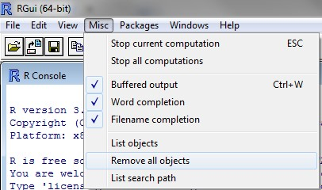  

## <a id="saving")></a>1.3  Saving R Files  

In R, there are several types of files that you can save to keep track of the work you do in R: workspace, script, history, and graphics. It is important to save often because R, like other software, may crash periodically especially when working with large files. Saving your work in R can be done via command line or file menu selection.  

### <a id="workspace")></a> 1.3.1 Workspace (.Rdata)  

The R workspace consists of all the data objects you've created or loaded during your R session. When you quit R by either typing `q()` or exiting out of the application window, R will prompt you to save your workspace. If you choose yes, R will save a file called .RData to your working directory. The next time you open R and link to the same working directory that the .RData file is saved to, all of your data objects will be available in R and all of the commands that you've typed will be accessible by using the up-arrow and down-arrow keys on your keyboard. You can also save or load your workspace at any time during your R session by clicking on File tab on the menu bar.   

  

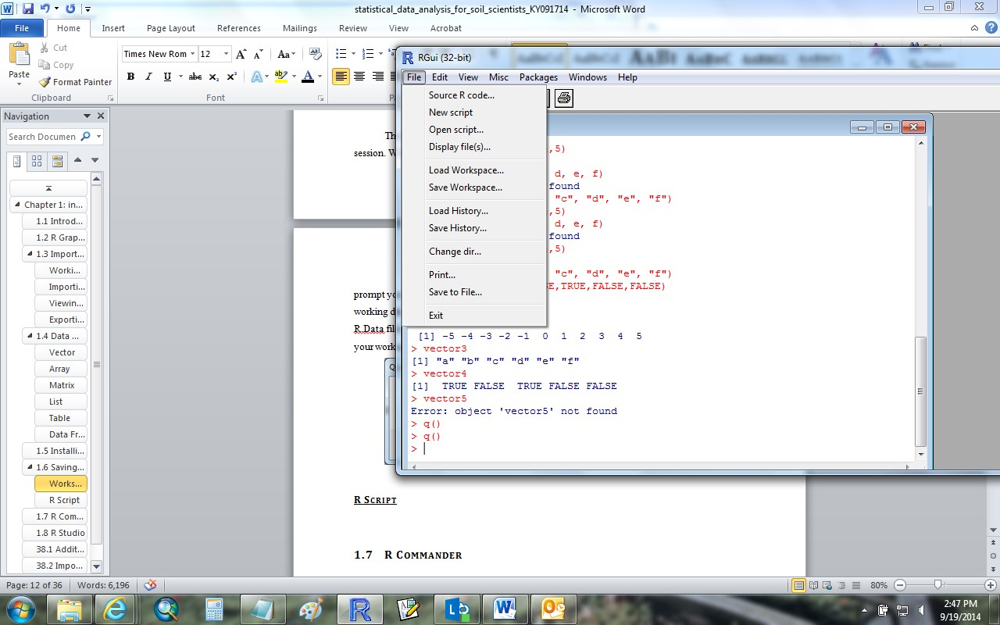    

The R command for saving your workspace is:
```{r, eval=FALSE}
save.image(file="workspace.RData")
```

### <a id="script")></a> 1.3.2 R script (.R)  

A R script is simply a text file of R commands that you've typed. You may want to save your scripts (whether they were written in R Editor or an ancillary program like Notepad) so that you can reference them in the future, edit them if needed, and keep track of what you've done. In order to save R scripts in the RGui, make sure the R Editor window is active and go to File > Save as on the menu bar. Save scripts with the .R extension. R assumes that script files are saved with only that extension. If you are using another text editor you won't need to worry about saving your scripts in R. You can always copy and paste them in to the R Console or R Editor from your text editor.  

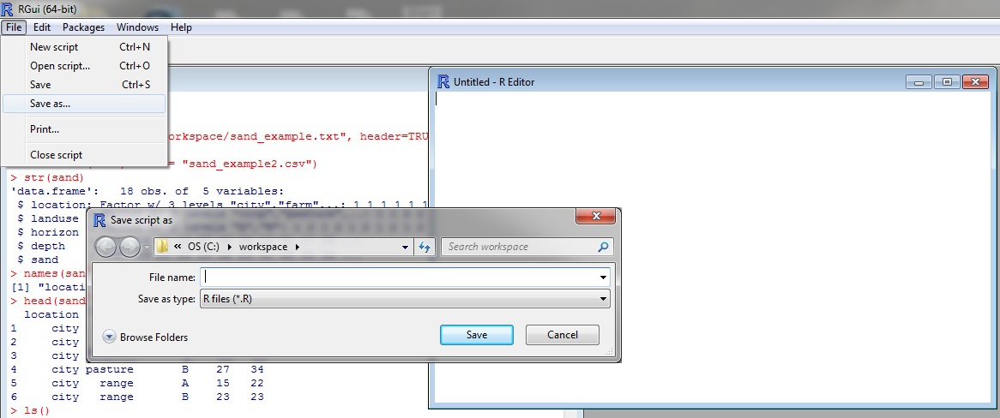  

To open a R script, go to File > Open script:  

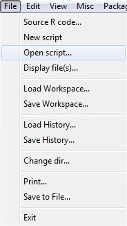  

### <a id="history")></a> 1.3.3 R history (.Rhistory) 

R history files are a copy of all your key strokes. You might think of it as brute force way of saving your work. This can often be useful if you didn't document all your steps in an .R script file. Like an .R file, a .Rhistory is simply a text file that lists all of the commands that you've executed. It does not keep a record of the results. To load or save your R history from the menu bar select: File > Load History or File > Save History. If you load a .Rhistory file, your previous commands will again become available with the up-arrow and down-arrow keys.

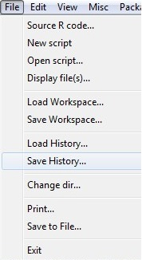 

You can also use command line:  

```{r, eval=FALSE}
savehistory(file = "sand.Rhistory")  
loadhistory(file = "sand.Rhistory")  
```

### <a id="graphics")></a> 1.3.4 R Graphics   

Graphic outputs can be saved in one of many formats: 
 
```{r, echo=FALSE, warning=FALSE}
library(knitr)
test <- data.frame(Function = c('pdf("graphic.pdf")', 'win.metafile("graphic.wmf")', 'png("graph.png")', 'jpeg("graph.jpg")', 'bmp("graph.bmp")', 'postscript("graph.ps")'), Output = c("pdf file", "window metafile", "png file", "jpeg file", "bmp file", "postscript file"))
kable(test)
```

To save a graphic: (1) Click in the Graphics Device window to bring it to focus, (2) click on File > Save as from the menu bar, and (3) save as desired image format.  

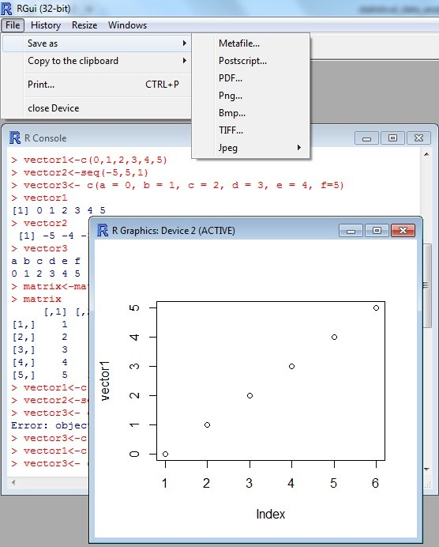  

The R command for saving a graphic is:  

```{r, eval=FALSE}
jpeg(file = "sand.jpeg")
plot(sand$sand)
dev.off()
```

The first line of this command creates a blank file named sand with a JPEG extension.  The second line plots the data object that you want to create a graphic of (here it is conveniently the same name as the jpeg file we are creating). The third line closes the graphics device.  

## <a id="packages")></a>1.4   Installing and Loading Packages

Packages are collections of well-defined and referenced code developed by R users that run specific functions. They often include example data that can be used when executing those functions. While R comes with some standard, basic statistical functions; most of our work will require additional packages. In order to use a package, you must install and then load it. This can be done through command line or using the RGui. Examples of both are provided below. R packages only need to be installed once on your computer unless R is upgraded or re-installed. Every time you start a new R session, you will have to load every package that you intend to use in that session.  

When the R Console window is active in the RGui (simply click on the Console window if it is not currently active), you can navigate to the Packages dropdown menu on the menu bar. You will see options to set your CRAN mirror (physical location used to transmit data to select the location closest to you) and load, install, and update packages. You can select more than one package to install at a time by holding down the Ctrl key.     

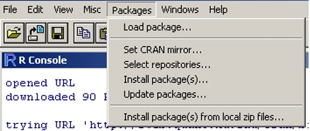  

To find out what packages have been installed:

```{r, eval=FALSE}
library() #or
installed.packages()

``` 

Prior to installing the package you will be asked which CRAN mirror site you would like to download from. Simply select the CRAN mirror closest to your physical location and click OK.The Comprehensive R Archive Network (CRAN) is a collection of sites that carry identical material for R. The maps package will allow us to create nice base maps in R. To install a package that you do not have currently downloaded, type the following command:  

```{r, eval=FALSE}
install.packages("maps", dep=TRUE) #dep=TRUE will install all packages that "maps" depends on to work correctly
``` 

Once a package is installed, it must be loaded into the R session to be utlized: 

```{r, eval=FALSE}
library(maps)
```

You can also install and load packages using the Packages dropdown menu. To find more documentation about the maps package, request more information from R: 

```{r, eval=FALSE}
help(package = "maps")
``` 

This will send you to a webpage. Scroll down and select the hyperlink "map." This will bring up a webpage with instructions of how to use the map function in R. The basic usage is: map(database, regions)  
 
where   

database specifies a character string naming a geographical database, or a list of x, y, and names obtained from a previous call to map. The string choices include a world map, three USA databases (usa, state, county), and more (see the package index). The location of the map databases may be overridden by setting the R_MAP_DATA_DIR environment variable. See world for further details. 

and

regions specifies a character vector that names the polygons to draw. Each database is composed of a collection of polygons, and each polygon has a unique name. When a region is composed of more than one polygon, the individual polygons have the name of the region, followed by a colon and a qualifier, as in michigan:north and michigan:south. Each element of regions is matched against the polygon names in the database and, according to exact, a subset is selected for drawing. The default selects all polygons in the database.  

Now we can call the `map` function from the maps package:  

```{r, eval=FALSE}
map("usa")
map("state")
``` 

When the region is left out, it defaults to showing all regions. We can specify a specific region by:

```{r, eval=FALSE}
map("county", "west virginia")
map("county", region=c("maryland", "virginia", "west virginia"))
``` 

Now try your home state.

Try some of the examples included at the end of the map {maps} documentation, from the previous search, or [http://cran.r-project.org/web/packages/maps/maps.pdf](http://cran.r-project.org/web/packages/maps/maps.pdf)  

## <a id="cmdr")></a>1.5  A Graphical user interface for R: Rcmdr (R COMMANDER)  

R Commander (Rcmdr) is an expanded RGui that allows users to run basic statistical functions in R using menu bars, icons, and information fields. It was created for students in introductory statistics courses so they could see how the software worked without learning a large number of command line scripts. Rcmdr is a great way to begin familiarizing yourself with R and statistics within a standardized framework.   

To install and load Rcmdr from the R console:  

```{r, eval=FALSE}
install.packages("Rcmdr", dep = TRUE)  
library(Rcmdr)  
```

This should open the R Commander GUI. 

### <a id="importrcmdr")></a> 1.5.1 Importing Data with Rcmdr  

Navigate to the Data toolbar and scroll down to Import data and then select from text file, clipboard, or URL...

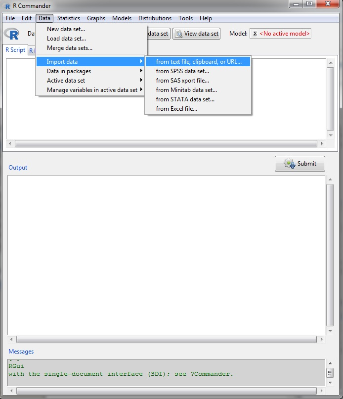

Replace Dataset with sand2 and make sure that the Field Seperator field is set to Commas. 

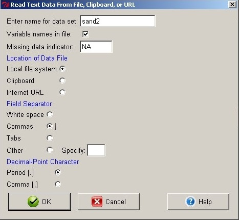  

Once you select OK, a windows explorer box will appear for you to select the file you wish to import. For this example, you want to select the sand.txt file. Now use the R Commander GUI functions to View Dataset and confirm that the data imported with 5 columns.  

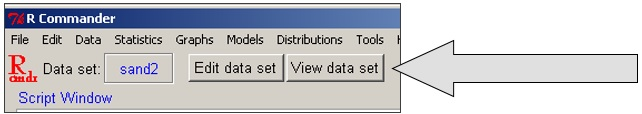  

A quicker way to import data if it is already imported as an object in R is to simply click on the box next to Data set in the Rcmdr GUI. This will open a window that will list all of the dataset objects that have been created during your R session. In our case, we want to select the sand dataset. 

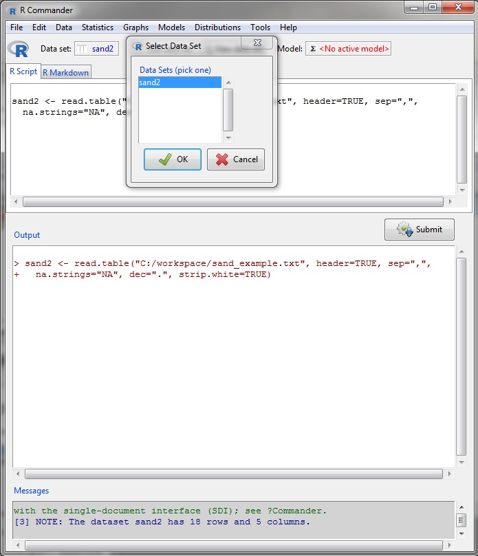

### <a id="graphs")></a> 1.5.2 Creating Graphs 

Use the **Graphs** dropdown menu in the Rcmdr GUI and select **Histogram...**  

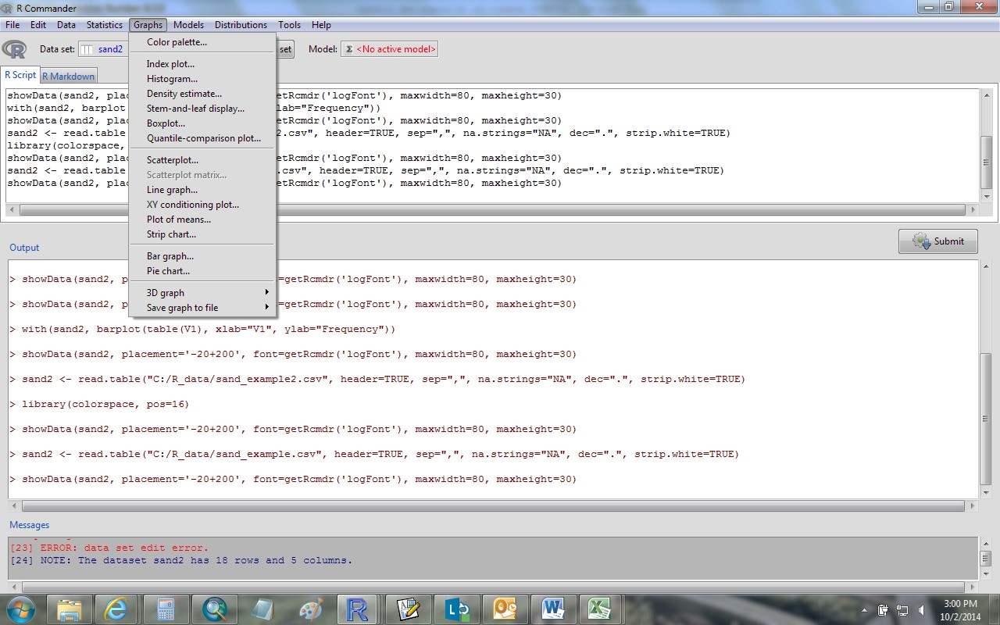

Select sand as the variable and then click on the Option Tab and make sure the Number of bins is set to auto for the first time, edit later. Click OK. A plot will appear in a separate window within the RGui. 

```{r, echo=FALSE, warning=FALSE}
hist(sand$sand, col="darkgrey", xlab="sand", ylab="frequency", main="")
```

Navigate back to R Commander window and select the **Graphs** menu again. This time select **Boxplot...** and choose **sand** as the variable. Click on **Plot by Groups** and select **landuse** as the variable. Next, switch to the **Options Tab** to ensure that outliers are identified **automatically**. Click **OK**. 

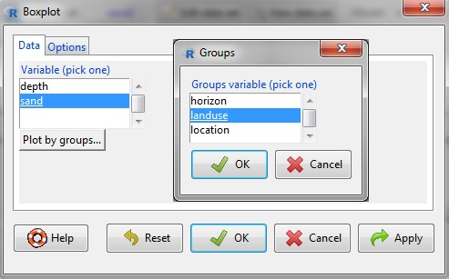  

If you want to change something slightly, edit the command line in the script window, select the entire command and hit Submit. Notice that commands in the R Commander script window are not preceded by > like in the R Console.  

Use R help or an online search engine to find information about the desired function. For instance, if you would like to change the color of the bars in the histogram to red, you would edit the `col` argument in the `Hist()` command:  

```{r, eval=FALSE}
with(sand2, Hist(sand, scale="frequency", breaks="Sturges", col="red")) #command used by Rcmdr; notice the function `Hist`

#or
```

```{r}
hist(sand$sand, col="red", xlab="sand", ylab="frequency", main="")  #the function `hist` in a R base package
``` 

Edit the Rcmdr script and select the line. Click **Submit** to plot the updated histogram.  

### <a id="statistics")></a> 1.5.3 Simple Statistics

To calculate basic summary statistics use the options in the Statistics menu. A couple of examples are provided below:  

Navigate to the **Statistics** dropdown menu and select **Summary - Active dataset**.  

Results are returned in the Output Window and consist of a summary of the number of records for each categorical (name) variable and some basic measures of the continuous (numeric) variables.  

```{r}
summary(sand)
```
  
Navigate back to the **Statistics** menu and select **Means - One-way ANOVA**. If you wish to reuse your model, give it a unique name in the Enter name for model: field. Select **landuse** in the **Groups** field and set **sand** as the Response Variable. Click **OK**. 

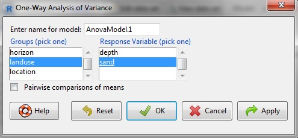  

Example Ouput:  

```{r, echo=FALSE, message=FALSE, warning=FALSE}
library(RcmdrMisc)
```

```{r}
AnovaModel.1 <- aov(sand ~ landuse, data = sand)
summary(AnovaModel.1)
with(sand, numSummary(sand, groups=landuse, statistics = c("mean", "sd")))
```

This result indicates that the sand content of these landuses are not significantly different (Pr = 0.422).  It should be noted that this simple analysis has not accounted for the two kinds of horizons analyzed (A and B) or the non-independent nature of multiple samples collected at each location. It also doesn't tell you if comparing sand content between land uses was a reasonable thing to do.  

Just like in the R editor window, you can save the Rcmdr script that you generate by using the File drop down menu in the Rcmdr GUI and selecting Save script as...

Save the Rcmdr script that you just created as **sand_rcmdr.R** in your working directory. You can also save your workspace, markdown file, and output if desired using the File drop down menu. 

### <a id="rcmdrscript")></a> 1.5.4 Importing and Executing a Saved Rcmdr Script  

**Rcmdr**  

You can open a saved R commander script in R commander or in R editor. Sometimes, however, scripts saved with R Commander will have things encoded for R commander that aren't apparent and won't run directly from R editor. First we'll open the script with R commander that we just saved and then open it in the R editor. Using the saved R commander script in R Commander, open and view R Commander and navigate to File, Open Script file, and select sand_rcmdr.R. It will ask you if you want to save the current log file (hit no to clear without saving). Your saved script now appears in the Script Window.  

Place your cursor on any command line and hit **submit**. You will see the output and graphs display as they did when you first executed them through the menu system of R Commander.  

**R Console**

Click on the RGui console and navigate to the File dropdown menu and select Open script. A windows explorer box will appear. Navigate to sand_rcmdr.R. A new R editor window will open up within R. Select the first two lines of the script using your mouse, right click, and select **Run line or selection**.

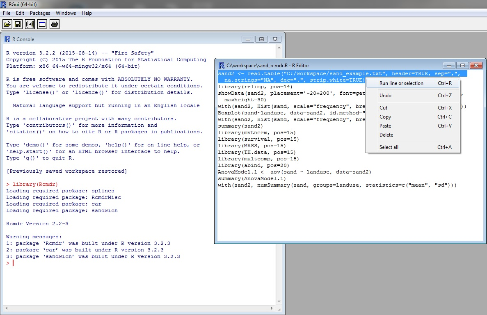  

This is a data input step. Next time you open R, you will need to import the dataset again. If you update the file sand_example.csv, the changes will be reflected when you rerun the analysis.  

Select the next line and select **run**. 

```{r, eval=FALSE}
library(relimp, pos=14)
```

This loads a package that R Commander used to run the script. Next, select the lines for any command that you wish to execute, for instance:

```{r, eval=FALSE}
with(sand2, Hist(sand, scale="frequency", breaks="Sturges", col="darkgray"))
```

This recreates the histogram graph. To get more information about how to use this function, including its usage and arguments, and how you can modify the default output, enter the command:

```{r, eval=FALSE}
help(Hist)
``` 

We can edit this in R editor and save our changes for later. Enter the following script to change the label of the x-axis and the color of the graph:

```{r, eval=FALSE}
Hist(sand2$sand, scale="frequency", breaks="Sturges", col="lightblue", xlab = "Total Sand")
``` 

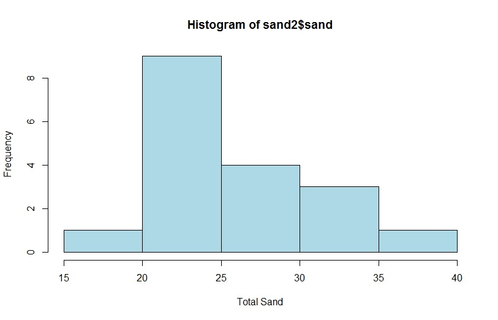 

At the top of the R editor window enter: #this is a demo of how to use R editor with an R Commander Script. Now select all and run the entire script. Save your R script using the file icon or in the File menu and close R. 

### <a id="studio")></a>1.6 RStudio  

RStudio is an integrated development environment (IDE) that allows you to interact with R more readily. RStudio is similar to the RGui, but is more user friendly with more drop down menus, windows, and customization options. When you open RStudio on your machine, you will see 3 windows: the console window, just like in the RGui and two other windows composed of multiple tabs. The upper right window has two tabs: environment and history. The environment tab will keep track of the datasets that you import and objects that you create while the history tab keeps a history of all of the commands you've executed during your Rstudio session. The lower right window is composed of 5 tabs:

**Files** - shows all the files and folders in your default workspace as if you were in windows explorer

**Plots** - displays figures generated through the R Console (for example, the results of `plot()` would be displayed here)

**Packages** - shows the list of add-ons included in the installation of RStudio. If checked, the package is loaded into R, if not, any command related to that package won't work, you will need to select it. You can also install other add-ons by clicking on the Install Packages icon.

**Help** - allows the user to search for help regarding R functions, packages, or topics 

**Viewer** - can be used to view local web content such as static HTML files written to the session temporary directory (i.e. files with paths generated by the tempfile function) or a locally run web application (this tab is usually reserved for advanced users)

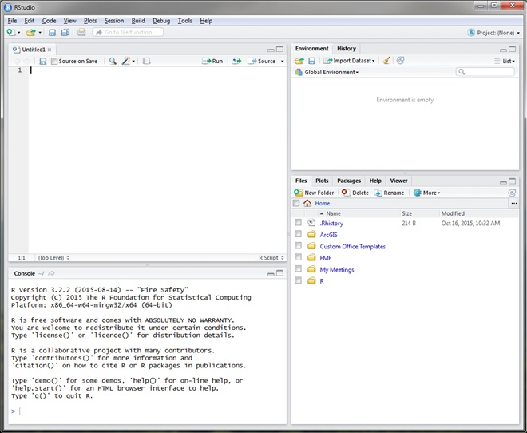  

Notice that in the figure above, there is a 4th window open called "Untitled1". This is a R script window, very similar to the one we looked at in RGui. To open the R script window in RStudio, simply use the File dropdown menu to select New File and then R Script. 

For further information on how to use RStudio, visit: <a href="https://support.rstudio.com/hc/en-us/sections/200107586-Using-RStudio">Using RStudio</a>

### <a id="rscript")></a> 1.6.1 Working with Scripts  

In RStudio, set your working directory to C:/workspace by either using the drop down menus (Session, Set Working Directory, Choose Directory) or by typing the following into the RStudio Console window and pressing Enter: 

```{r, eval=FALSE}
setwd("C:/workspace")
```

Next, open the script you created in R commander and edited in R editor by navigating to the File menu, Open File..., and then select sand_rcmdr.R. Run commands from within the script by selecting the first command (first two lines of code) and hit Run from the task bar above the script. 

  

Notice that the command line is passed to the console (lower left) and the data file appears in the workspace (upper right) as sand2. Click on the file name sand2 under the Environment Tab in the top left quadrant; notice that the console will show the corresponding command prompt >view(sand).  


Switch back to the sand_rcmdr.R script window and select the command to create a histogram (begins with Hist) and hit Run. You will get an error message "Error: could not find function 'Hist.'" 

**What happened?**

The Hist function is only available through the Rcmdr package. Since Rcmdr is not loaded in RStudio, you cannot use the `Hist()` command unless you load Rcmdr (`library(Rcmdr)`). To use the `Hist` command without loading the Rcmdr package, go to the console and use the up arrow key on your keyboard to edit the command to have a lower case h as in hist, hit enter. Now edit the Hist command in the R script; do the same for Boxplot (ie: change to boxplot).  

  

Select both commands (hist and boxplot) and hit Run again. Ignore the warning message. You will see the most recent graph in the Plot window; use the arrows to scroll through all graphs produced during this session. Save your script by first clicking in the R script window and then navigating to File > Save As... Name the file: sand_studio.R.  


### <a id="help")></a> 1.6.2 Help Features 

To learn more about the function you are using and the options/arguments available, take advantage of some of the help functions in RStudio:

1. Use the Help tab in the lower right to search commands (such as hist) or objects (such as histogram). 
2. When you type a command (such as hist) in the Console window, place your cursor at the end of the function and press F1 on your keyboard to bring up more information about the command. Information will appear under the Help tab on the lower right. 
3. Just like in R, you can type `?hist` in the Console window to bring up a help page. This will also be displayed under the Help tab in the lower right. 
4. Finally, you can also search for help on any function (even if you don't have the package installed) by typing:  
```{r, eval=FALSE}
help.search("histogram")
``` 

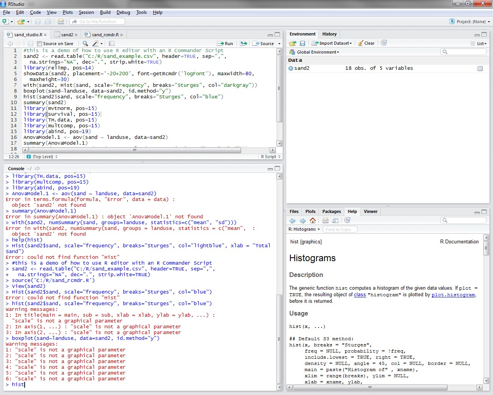  

Look through the usage and arguments in the help documents. Re-enter the `hist` function; evaluate the effects of changing color, breaks, freq, and labels.  
```{r}
hist(sand$sand, freq=TRUE, breaks=12, xlim = c(15, 40), main = "Histogram of Sand", sub = "with 12 bins", col ="lightblue", ylab = "Counts", xlab = "Total Sand") 
```

Notice how changing the breaks argument alters the appearance of the graph. The breaks argument tells R how the individual values should be counted in bins or groups. The xlim argument tells R where to set the upper and lower limit of the x-axis.  

Note that this arbitrarily sets the bin breaks using a list c(x1,x2,x3..). This can be a good way to separate groups, but in a way that may alter the way you visualize the distribution. This will work for any function in the console command prompt. 

**How would you change the chart title to "Histogram" and change the number of breaks (and therefore sub title) to 6 bins? Plot and examine the results.**


##<a id="soilDB")></a>1.7  Introduction to the soilDB Package

The soilDB package was created to more readily analyze data from USDA-NCSS soil databases in R. There are a series of `fetch()` commands that allow the user to specify what NRCS soil database they are wanting to extract data from (NASIS, KSSL, OSD, etc.). In this module, we are only going to focus on the `fetchKSSL()` function. Use the following script to examine KSSL data for the Hartleton soil series. Feel free to replace Hartleton with a soil series in your MLRA. 

```{r, warning=FALSE}
#load soilDB, aqp, and lattice packages
library(soilDB)
library(aqp)
library(lattice)

#fetch all KSSL data 'correlated as' Hartleton from the June 2015 snapshot
Hartleton<-fetchKSSL(series='Hartleton') 

#set plot parameters
par(mar=c(0,0,0,0)) 

#soil profile plot
plot(Hartleton, name='hzn_desgn', cex.names=0.85, axis.line.offset=-4, color='clay') 

#soil depth class
sdc <- getSoilDepthClass(Hartleton, name='hzn_desgn', top='hzn_top', bottom='hzn_bot') 
site(Hartleton) <- sdc

#summary statistics for soil depth
tapply(Hartleton$depth, Hartleton$taxonname, summary) 

``` 

```{r, eval=FALSE}
#data structure and variable names
str(Hartleton) 

``` 

```{r, warning=FALSE}
# slab() is used to aggregate selected variables within collections of soil profiles along depth-slices; in this example we are aggregating clay, sand, and organic carbon
h.slab <- slab(Hartleton, taxonname ~ clay+sand+oc)

#specify color and line width to be used in plot
tps <- list(superpose.line=list(col='RoyalBlue', lwd=2)) 

# slice-wise median and 25th/75th percentiles are reasonable estimations of central tendency and spread
xyplot(top ~ p.q50 | variable, data=h.slab, ylab='Depth',
        xlab='median bounded by 5th and 95th percentiles',
        lower=h.slab$p.q25, upper=h.slab$p.q75, ylim=c(155,-5),
        panel=panel.depth_function, alpha=0.25, sync.colors=TRUE,
        prepanel=prepanel.depth_function,
        cf=h.slab$contributing_fraction,
        par.strip.text=list(cex=0.8),
        strip=strip.custom(bg=grey(0.85)),
        layout=c(3,1), scales=list(x=list(alternating=1, relation='free'), y=list(alternating=3)),
        par.settings=tps, auto.key=list(columns=1, lines=TRUE, points=FALSE))
``` 

Check out [fetchKSSL Example](https://r-forge.r-project.org/scm/viewvc.php/*checkout*/docs/soilDB/KSSL-demo.html?root=aqp) for more details. 

### <a id="review")></a>1.8 Review
Given what you now know about R and RStudio, try to answer the following questions:

1. How can the `str()` function be used?

2. What are packages?

3. Which R function is used to load packages?

4. What can the Rcmdr package be used for?

5. What types of files can you save in R? 

6. What would be the result of `plot(clay ~ organiccarbon, data=KSSL)`? 


### <a id="additional")></a>1.9 Additional Resources  
- [R Manuals](http://cran.r-project.org/manuals.html)
- [Comprehensive R Archive Network (CRAN) Task View](https://cran.r-project.org/web/views/)
- [Quick R](http://www.statmethods.net/)  
- [Gardener's own](http://www.gardenersown.co.uk/Education/Lectures/R/index.htm#nav)   
- [Algorithms for Quantitative Pedology and Working with NRCS soil databases](http://aqp.r-forge.r-project.org/)
- [California Soil Resource Lab](http://casoilresource.lawr.ucdavis.edu/software/r-advanced-statistical-package/)
- [David Rossiter's R applications and lecture notes](http://www.css.cornell.edu/faculty/dgr2/)
- [Use R for Digital Soil Mapping Tutorial by Brendan Malone](http://www.clw.csiro.au/aclep/documents/DSM_R_manual_2013.pdf)
- [NPS Inventory and Monitoring lecture notes](https://science.nature.nps.gov/im/datamgmt/statistics/r/index.cfm)
- [Geographic Data Analysis and Visualization: Topics and Examples](http://geog.uoregon.edu/geogr/topics/)
- [Stack Overflow (discussion forum that includes R questions)](http://stackoverflow.com/)
- [Google](www.google.com) (this will usually lead you to Stack Overflow)  
- [Stay connected with the latest discussions of Soil Survey R Users on Google+](https://plus.google.com/u/0/communities/101713042265696005456)  

### <a id="ref")></a>1.10 References

Ihaka, R., and Gentleman, R. (1996). R: a language for data analysis and graphics. Journal of Computational and Graphical Statistics, 5(3):399-314. [https://www.stat.auckland.ac.nz/~ihaka/downloads/R-paper.pdf](https://www.stat.auckland.ac.nz/~ihaka/downloads/R-paper.pdf)  
