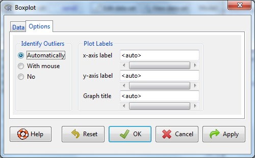
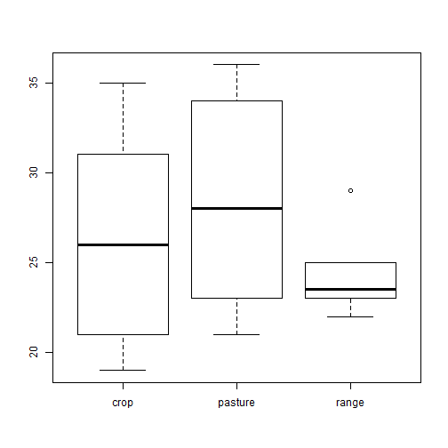

  

##CHAPTER 1: INTRODUCTION TO R

- [1.1 Introduction](#intro)
- [1.2 R Interface](#gui) 
- [1.3 Data Management in R](#datamanagement)
- [1.4 Saving R Files](#saving)
- [1.5 Installing and Loading Packages](#packages)
- [1.7 A Graphical User Interface for R - Rcmdr](#cmdr)
- [1.8 R Studio](#studio)
- [1.9 Additional Resoources](#additional)

 
###<a id="intro")></a>1.1  Introduction

R is a free, open-source software and programming language developed in 1995 at the University of Auckland that is capable of executing simple and complex mathematical, statistical, and graphical functions [(Ikaha and Gentleman, 1996)](https://www.stat.auckland.ac.nz/~ihaka/downloads/R-paper.pdf).  It is a dialect of the S language and is case sensitive. The R interface allows you to execute functions using a command prompt (>). To date R has become popular amongst Soil Scientists and Ecologists for exploring data, modeling soil and plant relationships, generating raster-based model predictions, and developing new R functions.  

R has been installed on all computers with NASIS and is typically updated and CCE approved once a year. USDA machines maybe 1 to 3 versions behind the latest available version for public download. Having an outdated version of R though rarely creates a problem, although warnings may appear.  

A few tips in R before you get started:  

- R is command-line driven and requires you to type or copy and paste commands after the command prompt (>) that appears when you open R. After typing a command and pressing enter on your keyboard in the R console, the command will run. If your command is not complete, R will issue a continuation prompt (signified by a plus sign, `+`). 

- R has a built in editor where you can edit and select code to run. Some people find it easiest to use Notepad instead. 

- R is case sensitive, make sure your spelling and capitalization are correct!  
 
- Commands in R are also called functions. The basic format of a function in R is: `function.name(argument, options)`  
 
- The up arrow (^) on your keyboard can be used to bring up previous commands that you've typed in the R console. 
 
- The `$` is used to select a particular column within the dataset, `dataset$column`.

- Any text that you do not want R to act on (such as instructions, information, notes or comments) needs to be preceded by a `#` (aka hashtag or comment).  R will ignore the remainder of the script line following `#`, if it is included in an R script. For example:  
 
`plot(x ~ y) # This text will not affect the plot function because of the comment`


###<a id="gui")></a>1.2  R Graphical User Interface
 
**Navigate** to R (in the start and program menus) and **Open** R (3.1.1, or latest version). When you first open R, the R console window below appears:  

  

The RGui contains 3 main windows: R console, R editor, and R graphics:  

  

To use R, you type commands after the command prompt `>`. In the R Console window, if you type a command and press ENTER, the command will run. You are able to edit command text in R Editor and are also able to then highlight, right click, and select run for the commands that you wish to run. The R Graphics window will display only when the `plot()` function is run.  

Commands in R can range from simple mathematical equations to complex statistical functions and models. As an example of simple math, if you type:  `9 * 8 + 6 - 1` in R and hit ENTER, R will act as a calculator and return the answer `77`.  

###<a id="datamanagement")></a>1.3  Data Management in R  

**WORKING DIRECTORY**  

Before working in R, **create a folder** to keep all R files in, such as "C:/workspace".

  

Before entering any commands in R, it is best to find out what the current working directory is by typing `getwd()` after the command prompt in the R Console.


```r
getwd()
```

Now change the working directory to the new folder you setup. Use the backlash as follows to avoid errors in R:    


```r
setwd("C:/workspace")
```

The working directory can also be changed and set by clicking on **File > Change dir...** from the menu bar. Setting a working directory allows you to import data into R with just a file name, not an entire folder path and file name. It also is the default folder for when you save or export data out of R. *Every time you start an R session, you should set your working directory*. 

**IMPORTING DATA**

One basic command for importing data into R is `read.csv()`.  The command is followed by the file name and then some optional instructions for how to read the file.    

First, create an example file by **copying** the following contents below, starting with location, **paste** it into Notepad and **save** to a file named *sand_example.csv*, into the C:/workspace folder:  

location,landuse,horizon,depth,sand  
city,crop,A,14,19  
city,crop,B,25,21  
city,pasture,A,10,23  
city,pasture,B,27,34  
city,range,A,15,22  
city,range,B,23,23  
farm,crop,A,12,31  
farm,crop,B,31,35  
farm,pasture,A,17,30  
farm,pasture,B,26,36  
farm,range,A,15,25  
farm,range,B,24,29  
west,crop,A,13,27  
west,crop,B,29,25  
west,pasture,A,11,21  
west,pasture,B,31,26  
west,range,A,14,23  
west,range,B,24,24  

The sand_example.csv file can then imported into R by typing:  


```r
sand <- read.csv("sand_example.csv")
```

There are other arguments that you might want to use with `read.csv()`. A quick way to find out what arguments are available for a given command is to type `help(command)`. In this example, you would **type**:


```r
help(read.csv) # or
?read.csv
```

These commands will bring up a webpage that describes all of the possible arguments for a command and usually provides examples. You should also notice by reading the help page for `read.csv()` that it is just one of several functions for reading text files.

**EXPORTING DATA**

To export data from R, use the command `write.csv`.  Since we have already set our working directory, R will automatically save our file into the folder that we specified as our working directory.  


```r
write.csv(sand, file = "sand_example2.csv")
```

**VIEWING DATA AND DATA OBJECTS**  

A few commands that you can use to view your data in R are `str()`, `names()` and `head()`. `str()` shows the structure of the data object, while `names()` shows the column names (i.e. headers) of your data, and `head` prints the first 6 lines of data. You can also enter the name of the table next to the command prompt to print the entire table; however avoid doing this if your table is large. Instead for large tables try `View(sand)`, this will opend the dataset in a separate window.   

**Enter** the following commands to view your dataset in R:  

```r
str(sand)
```

```
## 'data.frame':	18 obs. of  5 variables:
##  $ location: Factor w/ 3 levels "city","farm",..: 1 1 1 1 1 1 2 2 2 2 ...
##  $ landuse : Factor w/ 3 levels "crop","pasture",..: 1 1 2 2 3 3 1 1 2 2 ...
##  $ master  : Factor w/ 2 levels "A","B": 1 2 1 2 1 2 1 2 1 2 ...
##  $ depth   : int  14 25 10 27 15 23 12 31 17 26 ...
##  $ sand    : int  19 21 23 34 22 23 31 35 30 36 ...
```

```r
names(sand)
```

```
## [1] "location" "landuse"  "master"   "depth"    "sand"
```

```r
head(sand)
```

```
##   location landuse master depth sand
## 1     city    crop      A    14   19
## 2     city    crop      B    25   21
## 3     city pasture      A    10   23
## 4     city pasture      B    27   34
## 5     city   range      A    15   22
## 6     city   range      B    23   23
```

```r
ls()
```

```
## [1] "sand" "test"
```

A data object is anything you've created or imported and assigned a name to in R. The `ls()` command allows you to see what data objects are in your R session. In the figure above, you see that sand is the only data object returned. If you wanted to delete all data objects from your R session, you would type:  

**rm(list = ls(all = TRUE))**

The `ls()` and `rm()` functions are also available in the RGui under the menu bar heading **Misc**. 

  

###<a id="saving")></a>1.4  Saving R Files  

In R, there are several types of files that you can save to keep track of the work you do in R: workspace, script, history, and graphics. It is important to save often because R, like other software, may crash periodically especially when working with large files. Saving your work in R can be done via commandline or meanus.  

The easiest way to save your work in R is simply by clicking on **File > Save to File**, and select one of the saving options in the menu bar. Depending on which window you have selected, such as the R Console or Editor, different options will appear.

  

**WORKSPACE (.RDATA)**  

The R workspace consists of all the data objects you've created or loaded during your R session. When you quit R by either typing `q()` or exiting out of the application window, R will prompt you to save your workspace. If you choose yes, R will save a file called .RData to your working directory. The next time you open R and link to the same working directory that the .RData file is saved to, all of your data objects will be available in R. You can also save or load your workspace at any time during your R session by clicking on **File** tab on the menu bar.   

  

    

The R command for saving your workspace is:

```r
save.image(file="workspace.RData")
```

**R SCRIPT (.R)**  

A R script is simply a text file of R commands that you've typed. You want to save your scripts (whether they were written in R Editor or an ancillary program like Notepad) so that you can reference them in the future, edit them if needed, and keep track of what you've done. In order to save R scripts in the R Gui, make sure the R Editor window is active and go to **File > Save as** on the menu bar. Save scripts with the .R extension. R assumes that script files are saved with only that extension. If you are using another text editor you won't need to worry about saving your scripts in R. You can always copy and paste them in to the R Console or R Editor from your text editor.  

  

To open a R script, go to **File > Open script**:  

  

**R HISTORY (.Rhistory)**  

R history files are a copy of all your key strokes. You might think of it as brute force way of saving your work. This can often be useful if you didn't document all your steps in an .R script file. Like an .R file, a .Rhistory is simply a text file, and can be treated as such. To load or save your R history from the menu bar select: **File > Load History** or **File > Save History**. If you load an .Rhistory file your previous commands will again become available with the up-arrow and down-arrow keys. If an .Rhistory fil

 

You can also use command line:  


```r
savehistory(file = "sand.Rhistory")  
loadhistory(file = "sand.Rhistory")  
```

**GRAPHICS**  

 Graphic outputs can be saved in one of many formats: 
 

|Function                    |Output          |
|:---------------------------|:---------------|
|pdf("graphic.pdf")          |pdf file        |
|win.metafile("graphic.wmf") |window metafile |
|png("graph.png")            |png file        |
|jpeg("graph.jpg")           |jpeg file       |
|bmp("graph.bmp")            |bmp file        |
|postscript("graph.ps")      |postscript file |

To save a graphic: (1) Click in the **Graphics Device window** to bring it to focus, (2) click on **File > Save as** from the menu bar, and (3) save as desired image format.  

  

The R command for saving a graphic is:  


```r
jpeg(file = "sand.jpeg")**
plot(sand$sand)
dev.off()
```

The first line of this command creates a blank file named sand with a JPEG extension.  The second line plots the data object that you want to create a graphic of (here it is conveniently the same name as the jpeg file we are creating). The third line closes the graphics device.  

###<a id="packages")></a>1.5   Installing and Loading Packages

Packages are collections of well-defined and referenced code developed by R users that run specific functions. They often include example data that can be used when executing those functions. While R comes with some standard, basic statistical functions; most of our work will require additional packages. In order to use a package, you must install and then load it. This can be done through command line or using the R GUI. Examples of both are provided below. R packages only need to be installed on your computer once unless R is upgraded or re-installed. Every time you start a new R session, you will have to load every package that you intend to use in that session.  

**COMMAND LINE** 

First, find out what packages have been installed by **typing**:


```r
library()
```

To install a package that you do not have currently downloaded, **type the following command**:  


```r
install.packages("maps")
```

Prior to installing the package you will be asked which CRAN mirror site you would like to download from. Simply select the CRAN mirror closest to your physical location and click OK.The Comprehensive R Archive Network (CRAN) is a collection of sites that carry identical material for R. If instead you had typed **install.packages("maps", dep = TRUE)** in to the Console, several additional packages would have been installed that are used maybe used by the maps packages, known as dependencies. The maps package will allow us to create nice base maps in R. 

To use the installed package, we must load it to our current library by **typing**: 

```r
library(maps)
```

To find more documentation about the maps package; **request more information from R**: 


```r
help(package = "maps")
```
This will send you to a webpage.  We are interested in the maps:map documentation.  At that website, you see the documentation about that function.  There are a lot of options, but we'll focus on the basics.  

Useage (simple form): map(database, regions)  
This means the command is “map” which will be followed by specific instructions (called arguments).  In this case:  

**database**  - character string naming a geographical database, or a list of x, y, and names obtained from a previous call to map. The string choices include a **world** map, three USA databases (**usa, state, county**), and more (see the package index). The location of the map databases may be overridden by setting the **R_MAP_DATA_DIR** environment variable. See **world** for further details. 

**regions**  - character vector that names the polygons to draw. Each database is composed of a collection of polygons, and each polygon has a unique name. When a region is composed of more than one polygon, the individual polygons have the name of the region, followed by a colon and a qualifier, as in michigan:north and michigan:south. Each element of regions is matched against the polygon names in the database and, according to exact, a subset is selected for drawing. The default selects all polygons in the database.  

**Now we can call the map function from the maps package.**  


```r
map("usa")
map("state")
```

**When the region is left out, it defaults to showing all regions.  We can specify a specific region.**  


```r
map("county", "west virginia")
map("county", region=c("maryland", "virginia","west virginia"))
```
**Now try your home state.**  

Try some of the examples included at the end of the map {maps} documentation, from the previous search, or [http://cran.r-project.org/web/packages/maps/maps.pdf](http://cran.r-project.org/web/packages/maps/maps.pdf)  

**GUI**  

When the R Console window is active in the R GUI (simply click on the Console window if it is not currently active), you can navigate to the ‘Packages’ drop-down menu on the menu bar. You will see options to set your CRAN mirror (physical location used to transmit data to you – select the location closest to you) and load, install, and update packages.   

  

You can select more than one package to install at a time by holding down the **Ctrl** key.  


###<a id="cmdr")></a>1.7  A Graphical user interface for R: RCMDR (R COMMANDER)  

R Commander (Rcmdr) is an expanded GUI in R that allows users to run basic statistical functions in R using menu bars, icons, and information fields.  It was created for students in introductory statistics courses so they could see how the software worked without learning a large number of command line scripts.  Rcmdr is a great way to begin familiarizing yourself with R and statistics within a standardized framework.   

**To install and load Rcmdr from the R console**:  


```r
install.packages("Rcmdr", dep = TRUE)  
library(Rcmdr)  
```

This should open the R Commander window.  If it is not visible, select it from you toolbar (it may be in a list with other R windows).  

**IMPORTING DATA WITH Rcmdr**  

**Navigate to the Data toolbar – scroll down to ‘Import data’ and then select ‘from Excel, Access or dBase dataset…’**  


**Replace ‘Dataset’ with ‘sand2’ and select OK **  

  

**Navigate to file location using window explorer, select proper excel file.**  

If we wanted to import a text file:  
  
Navigate menus and select:  Data – Import data – from text file, clipboard or url….  

Complete the import box: name – change to ‘sand’, check the box ‘variable names in file, location = local file system, field separator = commas, decimal-point character = period  


Pay attention to the field separator (csv’s use commas); decimal point (Americans typically use periods) and variable names in file (checking this box means that the header names will be included in the dataframe).  

**Navigate to csv file location using Windows explorer.**    
**Now use the R Commander GUI functions to:**  
**View Dataset – confirm that data imported with 5 columns**  

  

**CREATING GRAPHS** 


**Navigate Graphs menu from the menu bar.**     
**Select – Histogram… **  


**Variable – sand**  
**Click on the Option Tab and then Number of bins – use <auto> first time, edit later**  
**Click OK**  

Plot will appear in a separate window within the R GUI  

**Navigate back to R Commander from toolbar (may be within the R list) and select the Graphs menu again**  
**Select – Boxplot…**  
**Variable – sand**  
**Then click on the Options Tab - Identify outliers – ‘automatically’**  

  

**Click back to the Data Tab and Select ‘Plot by Groups’ button**    
**Group variable – choose ‘landuse’**  
**Click ‘OK’ button**  
**Select ‘OK’ button**  

The plot will appear in a separate window within the R GUI  

  

Boxplot output:  



  

If you want to change something slightly, edit the command line in the script window, select the entire command and hit ‘Submit’.  Notice that commands in the R Commander script window are not preceded by ‘>’ like in the R Console.  

Use R help – or use an online search engine to find information about the desired function.  
For instance, if you would like to change the colors of the bars in the histogram, edit the ‘col’ command:  


```r
hist(sand$sand, col="grey")  
```


  
Select the line and then click the ‘Submit’ button.  

**SIMPLE STATISTICS** 

To calculate basic summary statistics use the options in the Statistics menu.  A couple of examples are provided below:  

**Navigate to Statistics menu**   
**Select Summary - Active dataset**  

Results are returned in the ‘Output Window’ and consist of a summary of the number of records for each categorical (name) variable and some basic measures of the continuous (numeric) variables.  


```r
summary(sand)
```

```
##  location    landuse  master     depth            sand      
##  city:6   crop   :6   A:9    Min.   :10.00   Min.   :19.00  
##  farm:6   pasture:6   B:9    1st Qu.:14.00   1st Qu.:23.00  
##  west:6   range  :6          Median :20.00   Median :25.00  
##                              Mean   :20.06   Mean   :26.33  
##                              3rd Qu.:25.75   3rd Qu.:29.75  
##                              Max.   :31.00   Max.   :36.00
```
  

**Navigate back to the Statistics menu and Select Means - One-way ANOVA**  

If you wish to reuse your model, give it a unique name in the ‘Enter name for model:’ field  

**Groups – landuse**  
**Response Variable – sand**  
**Hit OK**  
  

Example Ouput:  


```r
AnovaModel.1 <- aov(sand ~ landuse, data = sand)
summary(AnovaModel.1)
```

```
##             Df Sum Sq Mean Sq F value Pr(>F)
## landuse      2     48   24.00   0.914  0.422
## Residuals   15    394   26.27
```

```r
with(sand, numSummary(sand, groups=landuse, statistics = c("mean", "sd")))
```

```
##             mean       sd data:n
## crop    26.33333 6.022181      6
## pasture 28.33333 6.022181      6
## range   24.33333 2.503331      6
```

This result indicates that the sand content of these landuses are not significantly different (Pr = 0.422).  It should be noted that this simple analysis has not accounted for the two kinds of horizons analyzed (A and B) or the non-independent nature of multiple samples collected at each location. It also doesn't tell you if comparing sand content between land uses was a reasonable thing to do.  

**SAVING R SCRIPTS**  

For record keeping, you can copy and paste script and results into Excel or other compatible software. You can also save your script for later use in R commander or R Console. To Save a script: **Edit the ‘Script Window’** to reflect the analyses you want to recreate (including the data importation step).  
**Navigate to the File menu**   
**Save script as…**    
**Rename sand_rcmdr.R and save in your working directory**  
The same steps can be used to save the output window using ‘save ouput as’. **Minimize the R Commander window and move to the next section.**  

**IMPORTING AND EXECUTING A SAVED R COMMANDER SCRIPT**  
**R COMMANDER**  

You can open a saved R commander script in R commander or in R editor.  Sometimes, however, scripts saved with R Commander will have things encoded for R commander that aren’t apparent and won’t run directly from R editor.  First we’ll open the script with R commander that we just saved and then open it in the R editor. Using the saved R commander script in R Commander,   

**Open and view R Commander**  
**Navigate to File, Open Script file sand_rcmdr.R**  

It will ask you if you want to save the current log file (hit no to clear without saving). Your saved script now appears in the ‘Script Window’.  

**Place your cursor on any command line and hit submit.**  

You will see the ‘output’ and graphs display as they did when you first executed them through the menu system of R Commander.  

**R Console**  
**Open the RGui console. Navigate to the File menu and select ‘Open script.’**  

**Use windows explorer to navigate to the previously saved script sand_rcmdr.R**  
A new window will open up within R - ‘R editor’.  
**Select the first two lines of script using your mouse to left-click and drag.**  
**Then right click with your mouse and select ‘Run line or section’**  

**\ sand2 <- read.csv("C:/workspace/sand_example.csv")\**  

  


This is a data input step – next time you open R, you will need to import the dataset again.  If you update the file **sand_example.csv**, the changes will be reflected when you rerun the analysis.  

**Select the next line and ‘run’**  
**library(relimp, pos=4)**  

This loads a package that R Commander used to run the script. **Next, select the lines for any command that you wish to execute, for instance:**  
**Hist(sand$sand, col = "grey")**  

This recreates the histogram graph. **Enter the command:**  
**help(hist)**  

to get more information about how to use this function including its usage and arguments that you can modify the default output. We can edit this in R editor and save our changes for later.  
**Hist(sand$sand, scale="frequency", breaks="Sturges", col="lightblue", xlab = "Total Sand")**  

In this example, we’ve changed the label of the x-axis and the color of the graph. **At the top of the R editor window enter:**  
#this is a demo of how to use R editor with an R Commander Script
**Now select all and run the entire script. Save your R script using the file icon or in the File menu and Close R.**  

###<a id="studio")></a>1.8 R Studio  


R studio is a ‘super-package’ that allows you to interact with R more easily. If it is not already installed on your computer, you can install it from within [R](http://rstudio.org/download/desktop#) (does not require admin privileges) at http://rstudio.org/download/desktop# using a tarball or zip file.  Follow the instructions and work with ITS to get the package installed.  

Navigate to R Studio from your start menu. When you open R Studio, you will see your screen split into quadrants:  

 * Source – these are script files that you have saved or are creating
 * Console – this is the command prompt window for R
 * Workspace – keeps track of all data in use (which can be clicked and viewed through the source)
 * Plots – input and output space, includes files, packages and graphs that you create  

  

Rstudio Support has examples in the [Knowledge Base](https://support.rstudio.com/hc/en-us/sections/200107586-Using-RStudio) that will help you use R studio.   

**WORKING WITH SCRIPTS**  

**Open the script you created with R commander and edited in R editor by going to the File menu >**  
**Open File…**  
**Open sand_rcmdr.R**  
**Run commands from within the script by selecting the first command (first three lines) and hit ‘run’ from the task bar above the script.**  

  

Notice that the command line is passed to the console (lower left) and the data file appears in the workspace (upper right) as sand2.  
**Click on the file name sand2 under the Environment Tab in the top left quadrant**; notice that the console will show the corresponding command prompt **‘>view(sand)**’  


**Switch back to the sand_rcmdr.R script window and select the command to create a histogram** (begins with ‘hist’) and hit ‘run’  
You will get an error message “Error: could not find function "Hist"  
This is a function of the packages that loaded when you installed and loaded Rcmdr, but are not available now. **Go to the console, at command prompt (>) push the up arrow and edit the command to have a lower case ‘h’ as in ‘hist’ hit enter;**  
**Now edit the ‘Hist’ command in the R script; do the same for Boxplot – to boxplot**  

  

**Select both commands (hist and boxplot) and hit ‘run again**. Ignore the warning message.
You will see the most recent graph in the Plot window; use the **arrows** to scroll through all graphs produced during this session. **Save your script by first clicking in the R script window and then navigating to File > Save As...   Name the file: sand_studio.R**  


**HELP FEATURES OF R STUDIO**  

To learn more about the function you are using and the options/arguments available; take advantage of some of the help functions in R studio. **Place your cursor next to the command prompt (>) in the console (lower left).**  
**Type: > hist**  
**Place your cursor at the end of ‘hist’ and hit tab** – you’ll see a brief explanation of the functions and the name of the package it comes from {this can be handy for searching. **Hit the ‘F1’ key to get further explanation** (equivalent to help(hist) in the console. Information will appear in the Help window (lower right).  

  

Look through the usage and arguments. Reenter ‘hist’ function; evaluate the effects of changing color, breaks, freq, and labels.  

**hist(sand2$sand, freq=TRUE, breaks=12, xlim = c(15, 40), main = "Histogram of Sand", sub = "with 12 bins", col ="lightblue", ylab = "Counts", xlab = "Total Sand")**  

**hist(sand2$sand, freq=TRUE, breaks=5, xlim = c(15, 40), main = "Histogram of Sand", sub = "with 5 bins", col ="lightblue", ylab = "Counts", xlab = "Total Sand")**  

Notice how changing the ‘breaks’ argument alters the appearance of the graph.  The breaks argument tells R how the individual values should be counted in bins or groups.  The ‘xlim’ argument tells R where to set the upper and lower limit of the x-axis.  

Now try:  

**hist(sand2$sand, freq=FALSE, breaks = c(10,15,20,35,40), xlim = c(10, 40), main = "Histogram of Sand", sub = "with predefined bins", col ="lightblue", ylab = "Counts", xlab = "Total Sand")**  

Note that this arbitrarily sets the bin breaks using a list – c(x1,x2,x3…..).  This can be a good way to separate groups, but in a way that may alter the way you visualize the distribution.
This will work for any function in the console command prompt. You can also search for help on any function (even if you don’t have the package installed)  

**help.search("histogram")**  

###<a id="additional")></a>1.9 Additional Resources  
- [R Manuals](http://cran.r-project.org/manuals.html)
- [Comprehensive R Archive Network (CRAN) Task View](https://cran.r-project.org/web/views/)
- [Quick R](http://www.statmethods.net/)  
- [Gardener's own](http://www.gardenersown.co.uk/Education/Lectures/R/index.htm#nav)   
- [Algorithms for Quantitative Pedology and Working with NRCS soil databases](http://aqp.r-forge.r-project.org/)
- [California Soil Resource Lab](http://casoilresource.lawr.ucdavis.edu/software/r-advanced-statistical-package/)
- [David Rossiter's R applications and lecture notes](http://www.css.cornell.edu/faculty/dgr2/)
- [Use R for Digital Soil Mapping Tutorial by Brendan Malone](http://www.clw.csiro.au/aclep/documents/DSM_R_manual_2013.pdf)
- [Geographic Data Analysis and Visualization: Topics and Examples](http://geog.uoregon.edu/geogr/topics/)
- [Coastal Carolina Tutorials in R](http://ww2.coastal.edu/kingw/statistics/R-tutorials/)  
- [Stack Overflow (discussion forum that includes R questions)](http://stackoverflow.com/)
- [Google](www.google.com) (this will usually lead you to Stack Overflow)  
- [Stay connected with the latest discussions of Soil Survey R Users on Google+](https://plus.google.com/u/0/communities/101713042265696005456)  

###<a id="ref")></a>1.10  References  

Ihaka, R., and Gentleman, R. (1996). [R: a language for data analysis and graphics. Journal of Computational and Graphical Statistics, 5(3):399-314.](https://www.stat.auckland.ac.nz/~ihaka/downloads/R-paper.pdf)  


