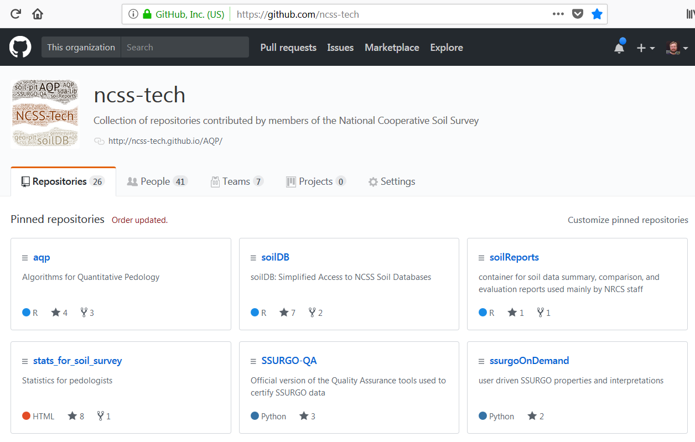

```{r setup, include=FALSE}
knitr::opts_chunk$set(warning=FALSE, message=FALSE, results='asis')
```


## Objectives

1. What is R?
    1. Why should I use R?
    2. What can R do?
2. How do I get started?
    1. RStudio interface
    2. How to import, export, and view files
    3. How to navigate the Help tab
    4. What are packages?
    5. How to save files


---


## What is R? - Open Source Project

1. a software environment: statistics, graphics, programming, calculator, GIS, etc...

2. a language: vocabulary to explore, summarize, and model data

{ width=80% }


---


## What is R? - "One Tool""

{ width=50% }


---


## Why should I use R? - 3 Reasons!

1. It's free. ["Free as in free speech, not free beer"!](https://www.gnu.org/philosophy/free-sw.html)

2. [Reproducible Research](http://christophergandrud.github.io/RepResR-RStudio/) (*self-documenting, repeatable*)
    + repeatable: 
        + code + output in a single document *('I want the right answer, not a quick answer' - Paul Finnell)*
        + easier the next time ([humorous example](https://www.youtube.com/watch?time_continue=1&v=s3JldKoA0zw))
        + numerous Excel horror stories of scientific studies gone wrong exist ([TED Talk](https://www.youtube.com/watch?v=dXKbkpilQME))
    + scalable: applicable to small or large problems

3. R in a Community
    + [Numerous Discipline Specific R Groups](https://cran.r-project.org/web/views/)
    + [Numerous Local R User Groups (including R-Ladies Groups)](https://jumpingrivers.github.io/meetingsR/r-user-groups.html#north-america)
    + [Stack Overflow](https://stackoverflow.com/)

4. Learning Resources *(quantity and quality)*
    + [R books](https://www.r-project.org/doc/bib/R-books.html)
    + [(Free Online) R Books](https://bookdown.org/)

5. It's ubiquitous! "If we don't accept these challenges, other who are less qualified will; and soil scientists will be displaced by apathy." [(Arnold and Wilding, 1992)](https://dl.sciencesocieties.org/publications/books/abstracts/sssaspecialpubl/spatialvariabil/1)

---


## What can R do? - Packages
* Base R (*functionality is extended through packages*)
    + basic summaries of quantitative or qualitative data
    + data exploration via graphics
    + [GIS](https://cran.r-project.org/web/views/Spatial.html) data processing and analysis

* Soil Science R Packages
    + [soilDB](https://github.com/ncss-tech/soilDB) - access to commonly used soil databases
    + [soilReports](https://github.com/ncss-tech/soilReports) - handful of report templates
    + [aqp](https://github.com/ncss-tech/aqp) - visualization, aggregation, classification
    + [soiltexture](http://soiltexture.r-forge.r-project.org/) - textural triangles

* [Ecology](https://cran.r-project.org/web/views/Environmetrics.html) R packages
    + [vegan](http://vegan.r-forge.r-project.org/) - ordination, diversity analysis, etc...
    + [dismo](http://rspatial.org/sdm/) -  species distribution modeling


---


## What can R do? - Draw Soil Profiles

```{r, echo=FALSE, fig.dim=c(10, 5)}
library(soilDB)
data("loafercreek")

n <- c("A",
       "BAt",
       "Bt1",
       "Bt2",
       "Cr",
       "R")
# REGEX rules
p <- c("A",
       "BA|AB",
       "Bt|Bw",
       "Bt3|Bt4|2B|C",
       "Cr",
       "R")

# Compute genhz labels and add to loafercreek dataset
loafercreek$genhz <- generalize.hz(loafercreek$hzname, n, p)

plot(loafercreek[1:5], color = "genhz", label = "pedon_id")

```

---


## What can R do? - Draw Depth Plots

```{r, echo=FALSE, fig.dim=c(10, 5)}

s <- aqp::slice(loafercreek, 1:100 ~ clay + phfield + total_frags_pct)
s <- aqp::slab(s, fm = ~ clay + phfield + total_frags_pct, slab.fun = function(x) quantile(x, c(0, 0.5, 1), na.rm = TRUE))
names(s) <- gsub("\\.", "", names(s))
names(s) <- gsub("^X", "p", names(s))


library(ggplot2)
ggplot(s, aes(x = top, y = p50)) +
  geom_line() +
  geom_ribbon(aes(ymin = p0, ymax = p100, x = top), alpha = 0.2) +
  xlim(c(100, 0)) + xlab("depth (cm)") + ylab("") +
  coord_flip() +
  facet_wrap(~ variable, scales = "free_x") +
  ggtitle("Loafercreek")

```

---


## What can R do? - Estimate RIC

```{r, echo=FALSE}
library(knitr)

h <- horizons(loafercreek)
h$genhz <- factor(h$genhz, levels = rev(levels(h$genhz)))

vars <- c("clay", "phfield", "total_frags_pct")
h2 <- reshape(h[c("genhz", vars)],
              direction = "long",
              timevar = "variable", times = vars,
              v.names = "value",    varying = vars
              )
# h3 <- select(h, genhz, clay, phfield, total_frags_pct) %>% 
#   gather(key = "variable", value = "value", clay, phfield, total_frags_pct)

# ggplot(h2, aes(x = genhz, y = value)) +
#   geom_boxplot() +
#   facet_wrap(~ variable, scales = "free_x") +
#   coord_flip()

vars <- c("genhz", "variable")
test <- {
  split(h2, h2[vars]) ->.;
  lapply(., function(x) data.frame(
    x[1, vars],
    pct10  = round(quantile(x$value,  0.1,  na.rm = TRUE)),
    median = round(median(x$value, na.rm = TRUE)),
    pct90  = round(quantile(x$value, 0.9,  na.rm = TRUE))
    )) ->.;
  do.call("rbind", .) ->.;
  .[order(.$variable, rev(.$genhz)), ] ->.;
  }

# test <- group_by(h2, variable, genhz) %>% 
#   summarize(
#     pct10    = round(quantile(value,  0.1,  na.rm = TRUE)),
#     median = round(median(value, na.rm = TRUE)),
#     pct90    = round(quantile(value, 0.9,  na.rm = TRUE))
#     ) %>%
#   arrange(variable, rev(genhz)) %>%
#   as.data.frame()

test <- test[!is.na(test$median), ]
rownames(test) <- NULL
kable(test[1:8, ])

```


----


## What can R do? - Create Maps

{ width=80% }


---


## What can R do? - etc...

* Query and import data from NASIS or SDA
* Develop reports, websites, presentations
* Construct a sampling plan
* Develop pedotransfer functions (e.g. NASIS calculations)
* Digital soil mapping


---


## RStudio - Integrated Development Environment

{ width=80% }


---

## Brief Examples

`object <- function(argument_1 = data, argument_2 = TRUE)`

* object = noun (data)
* function = verb (do something)
* arguments = adverbs (options)


---


## Brief Examples

```{r, echo = TRUE, fig.dim=c(8, 5)}
# Assignment
test <- 1 # or test = 1

# Math
test * 10

# Print Text
"Hello World"
```


---


## Brief Examples

```{r, echo = TRUE, fig.dim=c(5, 3)}
# Plot Histogram
hist(rnorm(100))
```


---


## Text Files

{ width=40% }


----


## R Workspace  

{ width=40% }

```{r, eval=FALSE}
# set current working directory
setwd("C:/workspace2")

# beware R uses forward slashes / instead of back slashes \ for file path names

# get the current working directory
getwd()
```

---

## Importing and Exporting Text Files

* [Beware of Excel Files](https://www.washingtonpost.com/news/wonk/wp/2016/08/26/an-alarming-number-of-scientific-papers-contain-excel-errors/?utm_term=.9352a35dca6f)

{ width=40% }

```{r, eval=FALSE}
# Importing
sand <- read.csv("C:/workspace/sand_example.csv") 

# Exporting
write.csv(sand, file = "sand_example.csv"))
```


---


## Viewing Data

{ width=40% }

Function  | Description                                         |
----------|-----------------------------------------------------|
`print()` | prints the entire object (avoid with large tables)  |
`head()`  | prints the first 6 lines of your data               |
`str()`   | shows the data structure of an R object             |
`names()` | lists the column names (i.e., headers) of your data |
`ls()`    | lists all the R objects in your workspace directory |


---


## Removing Data

{ width=40% }

```{r, eval=FALSE}

# Remove all R objects
rm(list = ls(all = TRUE)) 

# Remove individal objects
rm(sand)

```

---


## Getting Help

{ width=40% }

```{r, eval=FALSE}
# Help file for a function
help(read.csv) # or ?read.csv

# Help files for a package
help(package = "soiltexture")
```


---


## Installing Packages

{ width=80% }

```{r, eval=FALSE}
# CRAN
installed.packages(c("aqp", "soilDB", "soilReports", "soiltexture"))

# GitHub
devtools::install_github("ncss-tech/soilDB", dependencies=FALSE, upgrade_dependencies=FALSE)
``` 


---


## GitHub

{ width=80% }


---


## Loading Packages

{ width=60% }

```{r, eval=TRUE}
# Load Package from Library
library(soilDB)
```


---


## Basic Tips of Scripting

{ width=50%}

* Place each function (e.g. `read.csv()`) on a separate line.
* If a function has a long list of arguments, place each argument on a separate line.
* A command can be excuted from the text editor by placing the cursor on a line and typing **Crtl + Enter**, or by **clicking** the Run button.
* An entire R script file can be excuted by **clicking** the Source button. 


---


## Saving R Files

* Don't save your scripts in Word!

```{r, echo=FALSE}

rfiles <- data.frame(
  'File Type' = c("R Script", "R Markdown", "R Workspace", "R History"),
  'File Extension' = c(".R", ".Rmd", ".RData", ".RHistory"),
  Description = c("text file of R commands",
                  "text file of R commands formatted in Markdown",
                  "copy R objects from your workspace",
                  "copy all of commands sumbitted to the R Console"
                  ),
  check.names = FALSE,
  stringsAsFactors = FALSE
  )

knitr::kable(rfiles)

```


---


## Rcmdr (R Commander): A Graphical User Interface for R

[Rcmdr Tutorials by Andy Chang & G. Jay Kerns](http://gchang.people.ysu.edu/r/R_Instructions.html)

```{r, echo=TRUE, eval=FALSE}
install.packages(Rcmdr)
library(Rcmdr)
```

{ width=60% } 


---


## Review

Given what you now know about R, try to answer the following questions:

1. Can you think of a situation where an existing hypothesis or convientional wisdom was not repeatable?

2. What are packages?

3. What is GitHub?

4. Where can you get help?

5. What does the file .Rprofile do?


---


## (Free) R Learning Resources

* Introductory R Books
    + [Quick-R](https://www.statmethods.net/)
    + [R Cookbook](http://www.cookbook-r.com/)
    + [Reproducible Research with R & RStudio (not free)](http://christophergandrud.github.io/RepResR-RStudio/)
    
* Advanced DSM R Books
    + [A Practical Guide to Geostatistical Mapping](http://spatial-analyst.net/book/)
    + [Predictive Soil Mapping with R](https://envirometrix.github.io/PredictiveSoilMapping/)
    + [Using R for Digital Soil Mapping (not free)](http://www.springer.com/us/book/9783319443256)

* Soil Science R Tutorials
    + [aqp and soilDB tutorials](http://ncss-tech.github.io/AQP/)
    + [Global Soil Information Facilities](http://www.isric.org/utilise/capacity-building/tutorials)
    + [David Rossiter's Cornell Homepage](http://www.css.cornell.edu/faculty/dgr2/)
    + [Pierre Roudier](https://pierreroudier.github.io/teaching/index.html)


