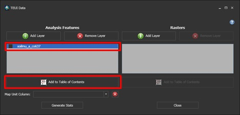
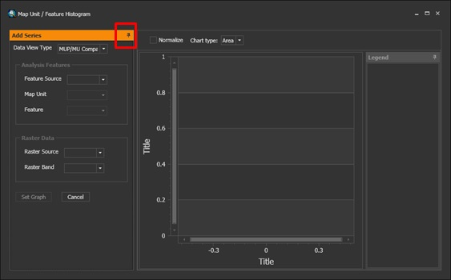

---
html_document:
    toc: yes
    keep_md: yes
author: Jay Skovlin, Dylan Beaudette, Stephen Roecker, Skye Wills, Tom D'Avello
date: "Friday, February 27, 2015"
output: html_document
title: Chapter 2 The data we use
---
  

# Chapter 2: The data we use

- [2.1 Measurement scales](#datatypes)
- [2.2 Accuracy, precision, and significant figures](#acc) 
- [2.3 Tidy data](#tidydata)
- [2.4 Data structures in R](#datastructures)
- [2.5 The soil project collection (spc) object](#aqp)
- [2.6 Extracting spatial data](#extract)   
- [2.6.1 R tools](#rtools)
- [2.6.2 ArcGIS Tools](#arcgistools)  
- [2.6.3 TEUI Tools](#teuitools)       
- [2.7 References](#ref)

 
##<a id="datatypes")></a>2.1  Measurement scales   
Data types can be classified according to the measurement scale of their units. Measurement scales are important to consider because they can affect the types of statistical operations that can be performed. [Stevens (1946)](#ref) was the first to propose the measurement scales listed below in the order of decreasing precision. Althougth their is a fierce debate as to Stevens's statistical interpretation of the the proposed scales. See [Wikipedia (2016)](https://en.wikipedia.org/wiki/Level_of_measurement) and [Velleman and Wilkinson (1993)](https://www.cs.uic.edu/~wilkinson/Publications/stevens.pdf) for more details.

**Ratio** - measurements having a constant interval size and a true zero point. Examples include: measurements of length, weight, volume, rates, length of time, counts of items and temperature in Kelvin.

**Interval** - measurements having a constant interval size but no true zero point. Examples include: temperature (excluding Kelvin), direction (e.g. slope aspect), time of day. Specific statistical procedures are available to handle circular data like slope aspect.

**Ordinal** - members of a set that are differentiated by their order or rank. Examples include soil interpretation classes (e.g., slight, moderate, severe), soil structure grade (e.g.,structureless, weak, moderate, strong). 

**Nominal** - members of a set that are differentiated by kind. Examples include: vegetation classes, soil map units, geologic units.

Stevens's (1946) measurements scales can also be categorized as to whether their scales are continuous or discontinuous.

**Continuous data** - any measured value. This includes: ratio and interval scales. Data with a possible value between any observed range. For example, the depth of an Ap horizon could range from 20cm to 30cm, with an infinite number of values between, limited only by the precision of the measurement device.

**Discrete data** - data with exact values. This includes: ordinal and nominal scales. For example, the number of Quercus Alba seedlings observed in a square meter plot, the number of legs on a dog, the presence/absence of an attribute (e.g. argillic horizon).

##<a id="acc")></a>2.2  Accuracy, precision, and significant figures  

**Accuracy** - is the closeness of a number to its actual value.

**Precision** - is the closeness of repeated measurements to each other.

**Significant figures** - the digits in a number that define the precision of a measurement. The value of 6 cm has one significant digit. The implied range is 1 cm. The true value lies between 5.50 and 6.49. The value of 6.2 cm has two significant digits. The implied range is 0.1 cm. The true value lies between 6.150 and 6.249. The implied precision is greater for the number 6.0 cm than 6 cm. See page 37 of the [Keys to Soil Taxonomy](http://www.nrcs.usda.gov/wps/portal/nrcs/detail/soils/survey/class/taxonomy/?cid=nrcs142p2_053580) for a discussion of how significant figures are applied in Soil Taxonomy. 

##<a id="tidydata")></a>2.3  Tidy data  

When preparing data for statistical analysis, a nicely formatted summary table is not appropriate. The data needs to be in formated similarly to how many tables in NASIS are structured. The generally preferred configuration is a comma delimited text file, where columns contain variables and rows contain individual observations of the variables. Using sand content as an example, you might collect or present your data like this:  

  

However, for purpose of analysis the data needs to be organized with total sand content as one long column with headers for organization. It is also best to remove spaces from column headers beforehand, and simplify and standardize the coding of categorical variables. There should be only 1 header row followed by data as noted in the following table. For an exhaustive discussion on tidy data see [Wickham (2014)](http://www.jstatsoft.org/article/view/v059i10).

```{r, warning=FALSE}
sand <- read.csv("C:/workspace/stats_for_soil_survey/trunk/data/sand_example.csv")

library(knitr)

kable(head(sand))
```
The same table in a format suitable for use by R.


##<a id="datastructures")></a>2.4 Data structures in R 

R recognizes a dozen or so data structures including: vectors, lists, arrays, matrices, data frames, factor, tables and several spatial data formats. As a soil scientist, we most often deal with data frames, like the sand file we imported into R in Chapter 1. It is important to understand what data structure you are using or creating and how it is handled in R. 


**Vectors**  
Vectors are the most fundamental data structure in R. All other data structures are simply some combination of vectors. Vectors are 1-dimensional ordered collections of individual elements. You can think of these as a column from a table. These elements can be numerical, character, or logical. Examples include:

```{r}
vector1 <- c(0, 1, 2, 3, 4, 5, NA) # integers
vector2 <- seq(1.1, 2, 0.1) # numeric
vector3 <- c("a", "b", "c", "d", NA) # characters
vector4 <- c(TRUE, FALSE, NA) # logical

vector1
vector2
vector3
vector4
```

**Matrices**  

Matrices are 2-dimensional vectors that are limited to columns having the same mode (e.g. numeric, character, logical, etc.) and same length. A common command for creating a matrix in R is the `matrix()` function that requires the following inputs: matrix (vector, number of rows, number of columns).  

```{r}
m <- matrix(1:10, nrow = 5, ncol = 2)
m
```


**Arrays**    
Arrays are multi-dimensional matrices that are also limited to columns having the same mode (e.g. numeric, character, logical, etc.) and length. The `array()` function creates arrays. The "dim" option gives the number of rows, columns, and layers, in that order.  

```{r}
a <- array(1:8, dim = c(4, 2, 2))
a
```


**Lists**  
Lists are ordered collections of multiple R objects. In the example below, the R objects created are land use, location, and sand. The `list()` function simply serves as a storage bin for land use, location, and sand. Many outputs of R functions are actually lists.

```{r}
landuse <- sand$landuse
location <- sand$location
sand2 <- sand$sand

sand_list <- list(landuse, location, sand2)
sand_list
```


**Data frames**  

Data frames, like the sand data set, are actually lists that are formatted to resemble tables. Data frames are similar to matrices, but allow different columns to have different modes (e.g. numeric, character, factor, etc.).

```{r}
sand
```


**Rasters**
...
The raster data should be in a common GDAL format like IMAGINE (img) or TIFF. 


##<a id="extract")></a>2.6 Extracting spatial data

In soil survey we're typically interested in the values for spatial data that overlap point locations or polygons. This gives us information on the geomorphic setting of our soil observations. With this information we would like to predict the spatial distribution of soil properties or classes at unobserved sites (e.g. raster cells). The procedure for extracting spatial data at point locations is a simple process of intersecting the point coordinates with the spatial data and recording their values. This can be accomplished with almost any GIS program, including R.

To summarize spatial data for a polygon, some form of zonal statistics can be used. Zonal statistics is a generic term for statistics that aggregate data for an area or zone (e.g. a set of map unit polygons). This can be accomplished via two methods. The most common method provided by most GIS is the census survey method, which computes a statistical summary of all the raster cells that overlap a polygon or map unit. This approach is generally faster and provides a complete summary of the spatial data. An alternative approach is the sample survey method, which takes a collection of random samples from each polygon or map unit. While the sample approach is generally slower and does not sample every cell that overlaps a polygon it does offer certain advantages. For example the census approach used by most GIS typically only provides basic statistics such as: the min, max, mean, standard deviation, and sum. However, for skewed data sets the mean and standard deviation may be unreliable. A better alternative for skewed data sets is to use non-parametric statistics like quantiles. Examples of non-parametric statistics are covered in Chapter 4. The advantage of the sample approach is that it allows us to utilize alternative statistics, such as quantiles, and perform a more thorough exploratory analysis. While some people might prefer the census approach because it provides a complete summary of all the data that overlaps a map unit, it is important to remember that all spatial data are only approximations of the physical world and therefore are only estimates themselves with varying levels of precision.

Before extracting spatial data for the purpose of spatial prediction, it is necessary that the data meet the following conditions:  

 - All data conforms to a common projection and datum
 - All raster data have a common cell resolution
 - All raster data are co-registered, that is, the geographic coordinates of cell centers are the same for all layers. Setting the _Snap Raster_ in the ArcGIS Processing Environment prior to the creation of raster derivatives can insure cell alignment. An ERDAS model is also available to perform this task.  

###<a id="rtools")></a>2.6.1 R tools for extracting spatial data

To extract spatial data R has several spatial packages which provide similar functionality to other GIS programs, but also significantly streamline the process for generating raster maps from statistical models.


#### Extracting point data from spatial data

To extract point data using R, either the sp or raster packages can be used. For large raster data sets it is best to use the `extract()` function form the raster package, because the raster package doesn't require the raster files to be read into the computer's random access memory (RAM).

```{r r_point_extract, warning=FALSE, message=FALSE}
# library(soilDB)
# library(raster)
# 
# p <- fetchNASIS()
# s <- site(p)
# idx <- complete.cases(s[c("x", "y")]) # create an index to filter out pedons that are missing coordinates in WGS84
# p2 <- p[idx] # subset pedon using idx
# coordinates(p2) <- ~ x + y # add coordinates to the pedon object
# proj4string(p2) <- CRS("+init=epsg:4326") # add projection to the pedon object
# p_sp <- as(p2, "SpatialPointsDataFrame") # extract SpatialPointsDataFrame
# 
# setwd("M:/geodata/project_data/8VIC/")
# 
# rs <- stack(c(elev = "ned30m_8VIC.tif", slope = "ned30m_8VIC_slope5.tif")) # create a raster stack
# proj4string(rs) <- CRS("+init=epsg:5070")
# 
# test <- data.frame(p_sp$site_id, extract(rs, p_sp)) # extract data from the stack
# 
# save(p, p_sp, test, file = "C:/workspace/ca794_pedons.Rdata")

load(file = "C:/workspace/ca794_pedons.Rdata")

summary(test)
```


#### Extracting zonal statistics from a raster for polygons

Zonal statistics in R can be implemented using either the census or sample approach. While R can compute zonal statistics using the census approach with the `zonal()` function in the raster package, it is considerable faster to call another GIS via either the RSAGA or spgrass6 packages. These additional GIS packages provide R functions to access SAGA and GRASS commands. For this example the RSAGA package will be used.

```{r r_poly_extract}
# library(rgdal)
# 
# ca794 <- readOGR(dsn = "M:/geodata/soils/CA794/spatial", layer = "soilmu_a_ca794")
# ca794 <- spTransform(ca794, CRS("+init=epsg:5070"))
# ca794$mukey2 <- as.integer(as.character(ca794$MUKEY))
# writeOGR(ca794, dsn = "C:/workspace", layer = "ca794", driver = "ESRI Shapefile", overwrite_layer = TRUE)
# 
# library(RSAGA)
# myenv <- rsaga.env(path = "C:/Program Files/QGIS Wien/apps/saga")
# ned <- raster("M:/geodata/project_data/8VIC/sdat/ned30m_8VIC.sdat")
# test <- raster(extent(ca794), ext = extent(ned), crs = crs(ned), res = res(ned))  # create a blank raster
# writeRaster(test, file = "M:/geodata/project_data/8VIC/sdat/ca794.sdat", format = "SAGA", progress = "text", overwrite = TRUE)
# 
# rsaga.geoprocessor("grid_gridding", 0, env = myenv, list(
#   INPUT = "C:/workspace/ca794.shp",
#   FIELD = "mukey2",
#   OUTPUT = "2",
#   TARGET = "0",
#   GRID_TYPE = "2",
#   USER_GRID = "M:/geodata/project_data/8VIC/sdat/ca794.sgrd",
#   USER_XMIN = extent(test)[1] + 15,
#   USER_XMAX = extent(test)[2] - 15,
#   USER_YMIN = extent(test)[3] + 15,
#   USER_YMAX = extent(test)[4] - 15,
#   USER_SIZE = res(test)[1]
# )
# )
# 
# rsaga.geoprocessor("statistics_grid", 5, env = myenv, list(
#   ZONES = "M:/geodata/project_data/8VIC/sdat/ca794.sgrd",
#   STATLIST = paste(c("M:/geodata/project_data/8VIC/sdat/ned30m_8VIC.sgrd", "M:/geodata/project_data/8VIC/sdat/ned30m_8VIC_slope5.sgrd"), collapse = ";"),
#   OUTTAB = "C:/workspace/test.csv"
# ))

test <- read.csv("C:/workspace/test.csv")
names(test)[1] <- "mukey"
test[test$mukey == 2480977, ] # examine mukey 2480977
```

To implement the sample approach to zonal statistics we can use the `extract()` and `over()` functions in the raster and sp packages respectively.

```{r}
# ca794 <- readOGR(dsn = "M:/geodata/soils/CA794/spatial", layer = "soilmu_a_ca794")
# ca794 <- spTransform(ca794, CRS("+init=epsg:5070"))
# 
# s <- spsample(ca794, n = 100000, type = "stratified")
# 
# setwd("M:/geodata/project_data/8VIC/")
# 
# rs <- stack(c(elev = "ned30m_8VIC.tif", slope = "ned30m_8VIC_slope5.tif"))
# proj4string(rs) <- CRS("+init=epsg:5070")
# 
# 
# test1 <- over(s, ca794)
# test2 <- data.frame(extract(rs, s))
# test2 <- cbind(test1, test2)
# save(test2, file = "C:/workspace/ch2_sample.Rdata")

load(file = "C:/workspace/ch2_sample.Rdata")

summary(test2[test2$MUKEY == 2480977, ]) # examine summary for mukey 2480977
```

Compare the results of the census and sample approaches above. While the census approach surveyed 204,460 cells, the sample approach only surveyed 5,777. However we can see that the results are largely similar between the two approaches.


#### Extracting zonal statistics via R Markdown

R Markdown is a document format that makes it easy to create reports and other dynamic documents. It allows R code and text to be mingled in the same document and executed like an R script. This allows R to generate reports similar to NASIS. Examples can be found at the following link, [https://github.com/ncss-tech/soil-pit/tree/master/examples](https://github.com/ncss-tech/soil-pit/tree/master/examples). Some examples show customized reports developed to generate zonal statistics of map units. Instructions can be found at the following SharePoint link, [hyperlink](https://ems-team.usda.gov/sites/NRCS_SSRA/mo-11/Soils%20%20GIS/Forms/AllItems.aspx?RootFolder=%2Fsites%2FNRCS%5FSSRA%2Fmo%2D11%2FSoils%20%20GIS%2Fguides%2FR&FolderCTID=0x0120007929E36D8FF15644B2C3F1488664C3CD&View=%7BFE55388F%2DFD5F%2D4A7B%2D98BD%2DA1F618066492%7D). We'll demonstrate these reports in Chapter 4 as part of exploratory data analysis.

## Exercise: extracting spatial data

Using your own data.

- Extracting spatial data from the point locations of your pedons.
- Using the sample approach, extract the zonal statistics for one soil survey area.
- Submit the results to your coach.


###<a id="arcgistools")></a>2.6.2  ArcGIS tools for extracting spatial data

### Extracting point data from a raster

This section discusses the use of the *Extract Multi Values to Points* tool, which assigns the cell value of specified raster data sets to existing points. *Extract Values to Points* and *Sample* tools will achieve similar results. These tools are described in the ESRI help section:  

[An_overview_of_the_Extraction_tools](http://help.arcgis.com/en/arcgisdesktop/10.0/help/index.html#/An_overview_of_the_Extraction_tools/009z00000028000000/)  

To start assume you have 50 observations across your area of interest contained in a point file in ArcGIS with numerous observed soil properties. You would also like to consider variables like slope, profile curvature, solar insolation, topographic wetness index, relative position and elevation in your analysis.
 
Using the **Extract Multi Values to Points** tool is the most expedient way to populate raster values to a point file. _If your spatial extent is large and you have many raster layers, e.g. 12, it may be best to proceed using 3 or 4 rasters at a time and running the tool 3 or 4 times_.  

The Extract Multi Values to Points tool is found in the Extraction Tool Box in Spatial Analyst Tools  

  

Select your point file and the associated raster files of interest as noted in the example graphic  

  

The resulting point file will have the corresponding cell values for slope, profile curvature and wetness index attached to the point file:  

  

The resulting point file may also be saved as a text file for use in R.

ArcGIS also provides the capability of creating histograms for data associated with point files using the Geostatistical Analyst:  

  


### Extracting zonal statistics from a raster

Gathering statistics of raster data cells for polygon data sets like SSURGO is typically achieved by the use of the *Zonal Statistics as Table* tool. The output will be a tabular summary for the specified *Zone*, usually map unit symbol or individual polygons.  

Example for summarizing by Map Unit Symbol:  

Open the Zonal Statistics as Table Tool in the Zonal Toolbox.

  

The input zone field is MUSYM and the input raster is slope:  

  

Which produces a table with the following output:  

  

The use of the Mean and Standard Deviation are acceptable, provided the distributions are close to normal and the interest is in summarizing the entire population of map units. To get a closer look at individual polygons, summarize using the FID:  

  

Which produces a table with the following output:  

  

Use the Join capability to associate the table of statistics to the spatial data:  

  

  

Which lets you view results by polygon and search for outliers or polygons that require further investigation:  

  

In this example, 4 polygons of *ChC2*, *Coshocton silt loam, 6 to 15 percent slopes, eroded*, have an average slope greater than 15 percent. Discrepancies like this will need to be investigated and resolved.  

  

In another example using a Box plot for assessment of a map unit with a slope class of 15 to 25 percent slopes, indicates half of the polygons with an average slope less than 15 percent:  

  


###<a id="teuitools")></a>2.6.3  TEUI tools for extracting and summarizing spatial data

The TEUI toolkit works in a similar manner to *Zonal Statistics as Table*, with the added benefit of interactive graphics to aid in the assessment. TEUI is an ArcGIS Add-in and may be installed without Administrator privilege. Additional information and downloads are available here:  

[http://www.fs.fed.us/eng/rsac/programs/teui/downloads.html](http://www.fs.fed.us/eng/rsac/programs/teui/downloads.html)  

One advantage of TEUI is the ability to output tabular data at both the map unit and polygon level with one operation. SECTIONS 2 - 5 of the TEUI User Guide are excerpted below.  

**SECTION 2. Creating and opening an existing project**

The Toolkit requires the user to specify a folder location to store the database that contains the statistics and the file location of the data used to create them. This database can be an existing project folder location, but it is recommended that a new folder be created to reduce the number of extraneous files in a folder with other data.  

**Create a New Toolkit Project**  

 1.  On the TEUI Toolbar, select the Folder icon.
  

 2. A dialog window will appear.  

 
 3.  Select Browse??.  

 4.	In the Browse for Folder dialog, navigate to a location of your choice and select “Make New Folder”  

 5.	Type in an appropriate name for your project  

 6.	Click **OK**
  
**Open an Existing Toolkit Project**  

 1.  On the TEUI Toolbar, select the Folder icon   
 
 
 2.  A dialog window will appear.  
   
 
 1.  If the project was recent, click on the project in the Recent dialog box and click Open.  

 2.	If it is older and does not appear in the dialog box, select **Browse**.and navigate to the project folder location. Select the project and click OK.  

**SECTION 3. Manage geospatial data and calculate statistics**

Managing project data with version 5.0 is very simple. The user simply points the program to the file location of the data on your computer that is to be used in the analysis.  

Note: _If you move the geospatial data used in an existing Toolkit project, you will need to re-link the Toolkit to the data when opening that project._  

**Add Analysis Features to a Toolkit Project**  

 1.  On the TEUI Toolbar, select the Data Manager icon.   
 2.  The Data Manager dialog window will appear.  
 
   
 
**Analysis Features**: are zones within which you would like to generate statistics. These features
can be feature classes such polygons or points (line features will be available soon) as a shapefile (.shp), as a feature class within a file geodatabase, or within a feature dataset within a file geodatabase. Analysis features can also be a in the form of a discrete raster. The value field will be used as the identifier.  

**Rasters**: are the raster data that are to be used to generate the descriptive statistics. An example would be a digital elevation model (DEM), percent slope, aspect, or land use for a discrete raster.  

 3.  In the Analysis Features area, click on the Add Layer button.    
 
  

 4.  A data navigation window will appear. Navigate to the analysis layer you wish to use and select **Add**. You can add as many data layers as you wish to analyze.  

  

Note:_All data layers to be analyzed (analysis features and raster data) must have the same
geographic coordinate system and projection as each other. You will receive a warning if they are different._   

**Remove Analysis Features from a Toolkit Project**  

 1. To remove an analysis layer from the Data Manager, click on the layer you wish to remove in the grey layer list, and click Remove. Click OK when prompted that this is correct.  
 
  
  

**Add Analysis Features to the ArcMap Table of Contents**  

 1.  To add the selected layer to the ArcMap table of contents, **select the layer you wish to add** by clicking on it in the grey layer list, and click the **Add to Table of Contents** button.    
 
  

**Choose a Map Unit**

_In some instances, such as TEUI mapping or Soil Survey, you may wish to identify individual polygon features as belonging to a specific map unit. This is simply a repeating identifying symbol or value which will be used to aggregate the statistics of the polygons belonging to that group. You do not need to select a map unit column in order to run the Toolkit. The symbol must be present as an attribute column in either the feature class layer or as an attribute in the VAT table of a discrete raster._  

 1.  Select the Analysis Feature layer that you wish to add a Map Unit symbol for.  

 2.	Select the appropriate map unit column attribute name for your map unit symbol in the drop down menu    
  
 

**Add Raster Data to the Toolkit Project**  

 1.  To add raster data to your Toolkit project, select the Add Layer button under the Raster heading  
  

  2.  In the Browse to Raster file location dialog window, navigate to the file location of the raster data you wish to add to the Toolkit project.  
  
  

 3.  Select the layer you wish to add and select the **Add** button.    

**Add Raster Data to the ArcMap Table of Contents**  


1.  To add raster data to your ArcMap Table of Contents, first select the layer or layers you wish to add by clicking on them in the grey layer list under the **Rasters** section.    


  

2.  Click the **Add to Table of Contents** button.  

3.	To add multiple raster data layers at once, hold down the **control button** while
**selecting the individual layers** you wish to add.  

**Calculate Statistics**  

 1.  To calculate statistics, you must first select the analysis feature layers and raster data layers you wish to run statistics on by **checking the box next to each layer**.  
 
    

 2.  Click on the **Generate Stats** button. Select **Yes** when prompted by the time warning that appears. This process may take a significant amount of time depending on the amount of data selected to be run.  
 
  

 3.  A dialog will appear which informs the user of the duration, features or rasters being used, and the progress. The tool can calculate more than 1 million cells a second.  
 
  

 4.  When finished click **OK** when the statistics run is done.  
 
**SECTION 4. Create and Visualize Graphs and Tables**  

A primary Toolkit feature is the ability to view the generated statistics in both a graph and table format. The Toolkit creates zonal statistics for the analysis features and raster data selected in the data manager. The results can be visualized in graph form or as summary table both by individual feature or by map unit if one was chosen.  

**Open a graph window**  

 1.  To create a graph, click on the **graph button** on the Toolkit Toolbar.  
 
  

 2.  A blank graph window will appear. You can open as many individual graph windows as you want.  
 
  

 3.  Click on the **Add Series** Tab in the upper left corner of the graph window.  
 
  

 4.  The Add Series window pane will open up. You can **pin the window open** by clicking on the sideways pin in the upper right hand of the Add Series window pane or close it by clicking on the vertical pin.  
 
  

 5.  In a step wise fashion, select… MUP\MU Comparison: This is the default option. This allows the greatest flexibility when comparing individual polygons against other individual polygons, individual polygons against map units, or map units against map units (if chosen).  
 
MU Comparison: This data view type contains unique default graphs when comparing map units or other aggregated statistics types. These graphs have the mean (solid line), range (darker colored area), and standard deviation (lighter colored area) on the same graph, for each polygon within a map unit.  

  

Chart type: You can choose the type of graph that best represents your data. The default is the area chart type.  
 
**Area chart**  
    

**Bar chart**  

    

**Point chart**  

  

**Line chart**  

  

**Radial chart**  

  

Feature Source: Choose which feature analysis layer you would like to graph. Polygons or discrete raster  

  

Map Unit: Chose from which map unit you would like to select a polygon. Alternatively, select just
the map unit you want to graph as a whole (i.e. don’t select an individual feature below). Also, you can leave this option blank which is the default.  

  

Feature: Select the individual feature you would like to view statistics for. This is the Feature ID or FID  

  

Raster Source: Select the raster layer you wish to view the statistics from.  

  

Raster Band: Select the raster band from the raster layer.  

  

Set Graph: Click once finished.  

  

**Common tasks with graphs**

**How do I add more individual features or map units to same graph?**
Within the Add Series pane, simply select a new feature source (if desired), map unit, feature, or raster source. Click Set Graph and the new feature or map unit will be added to the graph and the legend in a new color.  

  

**Can I add multiple axes to the graph? For example, a graph of elevation and percent slope?**  
To add another axis to your graph window, simply select the feature source, a map unit if desired, or a feature if desired, but select a new raster data source. You will notice in the graph legend map units and features are separated by the raster layer.  

  

**Is there a way to find a specific value on the graph?**  
If you hover over a specific spot in the graph, a line and window will appear with the specific values that your cursor is on. This is valuable if you are trying to identify outliers in our data.  

  

**Can I normalize the data ranges?**  
To normalize data so that the data ranges are comparable within the graph window, check the normalize button at the top of the graph.  

  

**How do I remove a graph series from the graph window?**  
Simply hit the red X next to the graph series you would like to remove in the graph legend.  

  

**How do I view the tabular data associated with each map unit or feature in the graph window?**  
To view the tabular and descriptive statistics of each map unit or feature in the graph window,
simply select the table icon next to the data series in the graph legend.  

  

**SECTION 5. Exporting Statistics Data to Excel**  

The statistical data summaries produced by the toolkit can be exported to excel as a .CSV file for further use.  

**Export individual feature statistics**  

  

 1.  On the main menu bar, click the **export table button** with the green arrow. Note this may take a little while as the program is gathering up the data.  

 2.	Navigate to the location you would like to save the .CSV file. Give the file a name and click
**Save**.  

  

**Export map unit feature statistics**  

  

 1.  On the main Toolkit menu bar, click the **export map unit table button** with the blue arrow. Note this may take a little while as the program is gathering up the data.  

 2.	Navigate to the location you would like to save the .CSV file. Give the file a name and click **Save**  .  
 

##<a id="ref")></a>2.7  References  

Stevens, S. S. (1946). On the theory of measurement scales. Science, 103(2684). [http://www.sciencemag.org/content/103/2684/677.full.pdf](http://www.sciencemag.org/content/103/2684/677.full.pdf) 

Velleman, P.F., and L. Wilkinson, 1993. Nominal, Ordinal, Interval, and Ratio Typologies are Misleading. The American Statistician 47(1)65:72. [https://www.cs.uic.edu/~wilkinson/Publications/stevens.pdf](https://www.cs.uic.edu/~wilkinson/Publications/stevens.pdf)

"Level of measurement" Wikipedia: The Free Encyclopedia. Wikimedia Foundation, Inc. 7 Feb. 2016. Web. 10 Feb. 2016. [https://en.wikipedia.org/wiki/Level_of_measurement](https://en.wikipedia.org/wiki/Level_of_measurement)


##<a id="ref")></a>2.8  Additional reading

Venables, W. N., D. M. Smith and the R Core Team, 2015. Introduction to R, Notes on R: A Programming Environment for Data Analysis and Graphics Version. (3.2.3, 2015-12-10) [https://cran.r-project.org/doc/manuals/r-release/R-intro.pdf](https://cran.r-project.org/doc/manuals/r-release/R-intro.pdf)

Wickham, H., 2014. Advanced R. CRC Press, New York. [http://adv-r.had.co.nz/](http://adv-r.had.co.nz/)
