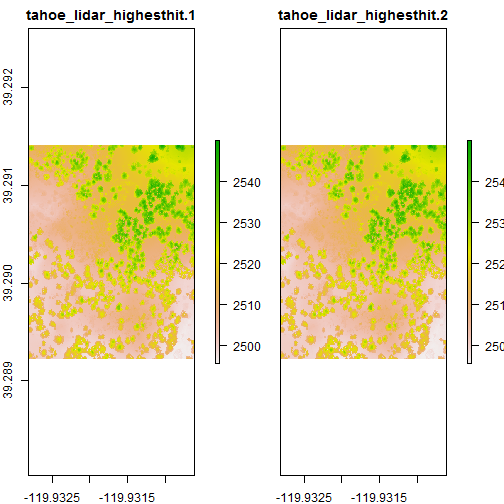

---
html_document:
    toc: yes
    keep_md: yes
author: Jay Skovlin, Dylan Beaudette, Stephen Roecker, Skye Wills, Tom D'Avello
date: "Friday, February 27, 2015"
output: html_document
title: Chapter 2 The data we use
---
  

# Chapter 2: The data we use

- [2.1 Measurement scales](#datatypes)
- [2.2 Accuracy, precision, and significant figures](#acc) 
- [2.3 Tidy data](#tidydata)
- [2.4 Data structures in R](#datastructures)
- [2.5 The soil project collection (spc) object](#aqp)
- [2.6 Extracting spatial data](#extract)
    - [2.6.1 R tools](#rtools)
    - [Exercise: extracting spatial data](#ex1)
    - [2.6.2 ArcGIS Tools](#arcgistools)  
- [2.7 References](#ref)

 
##<a id="datatypes")></a>2.1  Measurement scales   
Data types can be classified according to the measurement scale of their units. Measurement scales are important to consider because they can affect the types of statistical operations that can be performed. [Stevens (1946)](#ref) was the first to propose the measurement scales listed below in the order of decreasing precision. Althougth their is a fierce debate as to Stevens's statistical interpretation of the the proposed scales. See [Wikipedia (2016)](https://en.wikipedia.org/wiki/Level_of_measurement) and [Velleman and Wilkinson (1993)](https://www.cs.uic.edu/~wilkinson/Publications/stevens.pdf) for more details.

**Ratio** - measurements having a constant interval size and a true zero point. Examples include: measurements of length, weight, volume, rates, length of time, counts of items and temperature in Kelvin.

**Interval** - measurements having a constant interval size but no true zero point. Examples include: temperature (excluding Kelvin), direction (e.g. slope aspect), time of day. Specific statistical procedures are available to handle circular data like slope aspect.

**Ordinal** - members of a set that are differentiated by their order or rank. Examples include soil interpretation classes (e.g., slight, moderate, severe), soil structure grade (e.g.,structureless, weak, moderate, strong). 

**Nominal** - members of a set that are differentiated by kind. Examples include: vegetation classes, soil map units, geologic units.

Stevens's (1946) measurements scales can also be categorized as to whether their scales are continuous or discontinuous.

**Continuous data** - any measured value. This includes: ratio and interval scales. Data with a possible value between any observed range. For example, the depth of an Ap horizon could range from 20cm to 30cm, with an infinite number of values between, limited only by the precision of the measurement device.

**Discrete data** - data with exact values. This includes: ordinal and nominal scales. For example, the number of Quercus Alba seedlings observed in a square meter plot, the number of legs on a dog, the presence/absence of an attribute (e.g. argillic horizon).

##<a id="acc")></a>2.2  Accuracy, precision, and significant figures  

**Accuracy** - is the closeness of a number to its actual value.

**Precision** - is the closeness of repeated measurements to each other.

**Significant figures** - the digits in a number that define the precision of a measurement. The value of 6 cm has one significant digit. The implied range is 1 cm. The true value lies between 5.50 and 6.49. The value of 6.2 cm has two significant digits. The implied range is 0.1 cm. The true value lies between 6.150 and 6.249. The implied precision is greater for the number 6.0 cm than 6 cm. See page 37 of the [Keys to Soil Taxonomy](http://www.nrcs.usda.gov/wps/portal/nrcs/detail/soils/survey/class/taxonomy/?cid=nrcs142p2_053580) for a discussion of how significant figures are applied in Soil Taxonomy. 

##<a id="tidydata")></a>2.3  Tidy data  

When preparing data for statistical analysis, a nicely formatted summary table is not appropriate. The data needs to be in formated similarly to how many tables in NASIS are structured. The generally preferred configuration is a comma delimited text file, where columns contain variables and rows contain individual observations of the variables. Using sand content as an example, you might collect or present your data like this:  

  

However, for purpose of analysis the data needs to be organized with total sand content as one long column with headers for organization. It is also best to remove spaces from column headers beforehand, and simplify and standardize the coding of categorical variables. There should be only 1 header row followed by data as noted in the following table. For an exhaustive discussion on tidy data see [Wickham (2014)](http://www.jstatsoft.org/article/view/v059i10).


```r
sand <- read.csv("C:/workspace/stats_for_soil_survey/trunk/data/sand_example.csv")

library(knitr)

kable(head(sand))
```


|location |landuse |master | depth| sand|
|:--------|:-------|:------|-----:|----:|
|city     |crop    |A      |    14|   19|
|city     |crop    |B      |    25|   21|
|city     |pasture |A      |    10|   23|
|city     |pasture |B      |    27|   34|
|city     |range   |A      |    15|   22|
|city     |range   |B      |    23|   23|
The same table in a format suitable for use by R.


##<a id="datastructures")></a>2.4 Data structures in R 

R recognizes a dozen or so data structures including: vectors, lists, arrays, matrices, data frames, factor, tables and several spatial data formats. As a soil scientist, we most often deal with data frames, like the sand file we imported into R in Chapter 1. It is important to understand what data structure you are using or creating and how it is handled in R. 


**Vectors**  
Vectors are the most fundamental data structure in R. All other data structures are simply some combination of vectors. Vectors are 1-dimensional ordered collections of individual elements. You can think of these as a column from a table. These elements can be numerical, character, or logical. Examples include:


```r
vector1 <- c(0, 1, 2, 3, 4, 5, NA) # integers
vector2 <- seq(1.1, 2, 0.1) # numeric
vector3 <- c("a", "b", "c", "d", NA) # characters
vector4 <- c(TRUE, FALSE, NA) # logical

vector1
```

```
## [1]  0  1  2  3  4  5 NA
```

```r
vector2
```

```
##  [1] 1.1 1.2 1.3 1.4 1.5 1.6 1.7 1.8 1.9 2.0
```

```r
vector3
```

```
## [1] "a" "b" "c" "d" NA
```

```r
vector4
```

```
## [1]  TRUE FALSE    NA
```

**Matrices**  

Matrices are 2-dimensional vectors that are limited to columns having the same mode (e.g. numeric, character, logical, etc.) and same length. A common command for creating a matrix in R is the `matrix()` function that requires the following inputs: matrix (vector, number of rows, number of columns).  


```r
m <- matrix(1:10, nrow = 5, ncol = 2)
m
```

```
##      [,1] [,2]
## [1,]    1    6
## [2,]    2    7
## [3,]    3    8
## [4,]    4    9
## [5,]    5   10
```


**Arrays**    
Arrays are multi-dimensional matrices that are also limited to columns having the same mode (e.g. numeric, character, logical, etc.) and length. The `array()` function creates arrays. The "dim" option gives the number of rows, columns, and layers, in that order.  


```r
a <- array(1:8, dim = c(4, 2, 2))
a
```

```
## , , 1
## 
##      [,1] [,2]
## [1,]    1    5
## [2,]    2    6
## [3,]    3    7
## [4,]    4    8
## 
## , , 2
## 
##      [,1] [,2]
## [1,]    1    5
## [2,]    2    6
## [3,]    3    7
## [4,]    4    8
```


**Lists**  
Lists are ordered collections of multiple R objects. In the example below, the R objects created are land use, location, and sand. The `list()` function simply serves as a storage bin for land use, location, and sand. Many outputs of R functions are actually lists.


```r
landuse <- sand$landuse
location <- sand$location
sand2 <- sand$sand

sand_list <- list(landuse, location, sand2)
sand_list
```

```
## [[1]]
##  [1] crop    crop    pasture pasture range   range   crop    crop   
##  [9] pasture pasture range   range   crop    crop    pasture pasture
## [17] range   range  
## Levels: crop pasture range
## 
## [[2]]
##  [1] city city city city city city farm farm farm farm farm farm west west
## [15] west west west west
## Levels: city farm west
## 
## [[3]]
##  [1] 19 21 23 34 22 23 31 35 30 36 25 29 27 25 21 26 23 24
```


**Data frames**  

Data frames, like the sand data set, are actually lists that are formatted to resemble tables. Data frames are similar to matrices, but allow different columns to have different modes (e.g. numeric, character, factor, etc.).


```r
sand
```

```
##    location landuse master depth sand
## 1      city    crop      A    14   19
## 2      city    crop      B    25   21
## 3      city pasture      A    10   23
## 4      city pasture      B    27   34
## 5      city   range      A    15   22
## 6      city   range      B    23   23
## 7      farm    crop      A    12   31
## 8      farm    crop      B    31   35
## 9      farm pasture      A    17   30
## 10     farm pasture      B    26   36
## 11     farm   range      A    15   25
## 12     farm   range      B    24   29
## 13     west    crop      A    13   27
## 14     west    crop      B    29   25
## 15     west pasture      A    11   21
## 16     west pasture      B    31   26
## 17     west   range      A    14   23
## 18     west   range      B    24   24
```


**Rasters**

Raster are a common GIS format primarily designed for displaying continuous data. They are similar to matrices in R, although they contain additional information such as their spatial projection and resolution. To import raster data, R uses the Geospatial Data Abstraction Library (GDAL), similar many other GIS, including ArcGIS. GDAL supports a wide variety of raster formats. Popular formats include GeoTIFF (.tif) and Erdas Imagine (.img), but exclude rasters stored in ESRI's propriety file geodatabase format. To import raster data either the `readGDAL()` or `raster()` functions can used, which come from the rgdal and raster packages respectively. When working with large raster datasets the raster package is preferred because it doesn't require reading the raster files into the computer's random access memory (RAM). The raster package also contains a wider variety of functions, similar to those found in ArcGIS's Spatial Analyst extension.


```r
# Example importing raster data

library(sp)
library(rgdal)
library(raster)
library(gdalUtils)

f <- system.file("external/tahoe_lidar_highesthit.tif", package="gdalUtils") # pointer to example raster file

# import raster data using the raster package
r <- raster(f)

# create a raster stack of multiple rasters
s <- stack(f, f) 

str(r, max.level = 2)
```

```
## Formal class 'RasterLayer' [package "raster"] with 12 slots
##   ..@ file    :Formal class '.RasterFile' [package "raster"] with 13 slots
##   ..@ data    :Formal class '.SingleLayerData' [package "raster"] with 13 slots
##   ..@ legend  :Formal class '.RasterLegend' [package "raster"] with 5 slots
##   ..@ title   : chr(0) 
##   ..@ extent  :Formal class 'Extent' [package "raster"] with 4 slots
##   ..@ rotated : logi FALSE
##   ..@ rotation:Formal class '.Rotation' [package "raster"] with 2 slots
##   ..@ ncols   : int 400
##   ..@ nrows   : int 400
##   ..@ crs     :Formal class 'CRS' [package "sp"] with 1 slot
##   ..@ history : list()
##   ..@ z       : list()
```

```r
proj4string(r) # get or set the coordinate reference system
```

```
## [1] "+proj=longlat +datum=WGS84 +no_defs +ellps=WGS84 +towgs84=0,0,0"
```

```r
bbox(r) # get bounding box
```

```
##           min        max
## s1 -119.93281 -119.93062
## s2   39.28922   39.29141
```

```r
plot(r)
```


```r
plot(s)
```



```r
# or import raster data using the rgdal package

# r2 <- readGDAL(f)

# str(r2, max.level = 2)

# spplot(r2) # sp package plotting method based on lattice package


# Example exporting raster data

# raster package
writeRaster(r, filename = "C:/workspace/test.tif", format = "GTiff", progress = "text", overwrite = TRUE) # for large datasets the progess option is helpful
```

```
## 
  |                                                                       
  |                                                                 |   0%
  |                                                                       
  |================                                                 |  25%
  |                                                                       
  |================================                                 |  50%
  |                                                                       
  |=================================================                |  75%
  |                                                                       
  |=================================================================| 100%
## 
```

```r
# rgdal package
# writeGDAL(r2, fname = "C:/workspace/test.tif", drivername = "GTiff")
```

**Vector**

Vectors are a common GIS format designed for displaying points, lines, and polygons. To import vector files R uses the rgdal package, which is a wrapper for GDAL. However during the import process R converts all vector files to its own format, which is a complicated series of lists. This makes R impractical for large vector datasets. However, R can call other GIS and spatial databases, such as SAGA, GRASS, and PostGIS.


```r
# Example importing vector data

library(sp)
library(rgdal)

pol <- readOGR(dsn = "C:/workspace/ca794.shp", layer = "ca794")
```

```
## OGR data source with driver: ESRI Shapefile 
## Source: "C:/workspace/ca794.shp", layer: "ca794"
## with 719 features
## It has 5 fields
```

```r
str(pol, max.level  = 2)
```

```
## Formal class 'SpatialPolygonsDataFrame' [package "sp"] with 5 slots
##   ..@ data       :'data.frame':	719 obs. of  5 variables:
##   ..@ polygons   :List of 719
##   .. .. [list output truncated]
##   ..@ plotOrder  : int [1:719] 419 448 95 185 89 451 9 447 334 253 ...
##   ..@ bbox       : num [1:2, 1:2] -1862018 1365854 -1754262 1425526
##   .. ..- attr(*, "dimnames")=List of 2
##   ..@ proj4string:Formal class 'CRS' [package "sp"] with 1 slot
```

```r
proj4string(pol)
```

```
## [1] "+proj=aea +lat_1=29.5 +lat_2=45.5 +lat_0=23 +lon_0=-96 +x_0=0 +y_0=0 +datum=NAD83 +units=m +no_defs +ellps=GRS80 +towgs84=0,0,0"
```

```r
bbox(pol)
```

```
##        min      max
## x -1862018 -1754262
## y  1365854  1425526
```

```r
plot(pol, axes = TRUE)
```


```r
# Example exporting vector data

writeOGR(pol, dsn = "C:/workspace/test.shp", layer = "test", driver = "ESRI Shapefile", overwrite_layer = TRUE)
```

## <a id="extract")></a> 2.6 Extracting spatial data

In soil survey we're typically interested in the values for spatial data that overlap point locations or polygons. This gives us information on the geomorphic setting of our soil observations. With this information we would like to predict the spatial distribution of soil properties or classes at unobserved sites (e.g. raster cells). The procedure for extracting spatial data at point locations is a simple process of intersecting the point coordinates with the spatial data and recording their values. This can be accomplished with almost any GIS program, including R.

Before extracting spatial data for the purpose of spatial prediction, it is necessary that the data meet the following conditions:  

 - All data conforms to a common projection and datum
 - All raster data have a common cell resolution
 - All raster data are co-registered, that is, the geographic coordinates of cell centers are the same for all layers. Setting the _Snap Raster_ in the ArcGIS Processing Environment prior to the creation of raster derivatives can insure cell alignment. An ERDAS model is also available to perform this task.  


###<a id="rtools")></a>2.6.1 R tools for extracting spatial data

To extract point data using R, either the sp or raster packages can be used. For large raster data sets it is best to use the `extract()` function from the raster package.


```r
# library(soilDB)
# library(raster)
# 
# p <- fetchNASIS()
# s <- site(p)
# idx <- complete.cases(s[c("x", "y")]) # create an index to filter out pedons that are missing coordinates in WGS84
# p2 <- p[idx] # subset pedon using idx
# coordinates(p2) <- ~ x + y # set the coordinates to the pedon object
# proj4string(p2) <- CRS("+init=epsg:4326") # set the projection of the pedon object
# p_sp <- as(p2, "SpatialPointsDataFrame") # extract a SpatialPointsDataFrame
# 
# setwd("M:/geodata/project_data/8VIC/")
# 
# rs <- stack(c(elev = "ned30m_8VIC.tif", slope = "ned30m_8VIC_slope5.tif")) # create a raster stack
# proj4string(rs) <- CRS("+init=epsg:5070")
# 
# test <- data.frame(p_sp$site_id, extract(rs, p_sp)) # extract data from the stack
# 
# save(p, p_sp, test, file = "C:/workspace/ca794_pedons.Rdata")

load(file = "C:/workspace/ca794_pedons.Rdata")

summary(test)
```

```
##      p_sp.site_id      elev             slope        
##  1249515815:  3   Min.   :  18.74   Min.   : 0.2441  
##  1249704903:  3   1st Qu.: 560.21   1st Qu.: 3.7603  
##  1249704905:  3   Median : 766.46   Median : 6.7417  
##  1249713101:  3   Mean   : 850.83   Mean   :15.1356  
##  1249713104:  3   3rd Qu.:1187.82   3rd Qu.:26.1443  
##  1249713106:  3   Max.   :1816.41   Max.   :70.0182  
##  (Other)   :996   NA's   :6         NA's   :6
```

#### <a id="ex1")></a> Exercise 1: extracting spatial data

- Using your own data, extract the raster values for several pedons
- Submit the results to your coach.


###<a id="arcgistools")></a>2.6.2  ArcGIS tools for extracting spatial data

### Extracting point data from a raster

This section discusses the use of the *Extract Multi Values to Points* tool, which assigns the cell value of specified raster data sets to existing points. *Extract Values to Points* and *Sample* tools will achieve similar results. These tools are described in the ESRI help section:  

[An_overview_of_the_Extraction_tools](http://help.arcgis.com/en/arcgisdesktop/10.0/help/index.html#/An_overview_of_the_Extraction_tools/009z00000028000000/)  

To start assume you have 50 observations across your area of interest contained in a point file in ArcGIS with numerous observed soil properties. You would also like to consider variables like slope, profile curvature, solar insolation, topographic wetness index, relative position and elevation in your analysis.
 
Using the **Extract Multi Values to Points** tool is the most expedient way to populate raster values to a point file. _If your spatial extent is large and you have many raster layers, e.g. 12, it may be best to proceed using 3 or 4 rasters at a time and running the tool 3 or 4 times_.  

The Extract Multi Values to Points tool is found in the Extraction Tool Box in Spatial Analyst Tools  

  

Select your point file and the associated raster files of interest as noted in the example graphic  

  

The resulting point file will have the corresponding cell values for slope, profile curvature and wetness index attached to the point file:  

  

The resulting point file may also be saved as a text file for use in R.


##<a id="ref")></a>2.7  References  

Stevens, S. S. (1946). On the theory of measurement scales. Science, 103(2684). [http://www.sciencemag.org/content/103/2684/677.full.pdf](http://www.sciencemag.org/content/103/2684/677.full.pdf) 

Velleman, P.F., and L. Wilkinson, 1993. Nominal, Ordinal, Interval, and Ratio Typologies are Misleading. The American Statistician 47(1)65:72. [https://www.cs.uic.edu/~wilkinson/Publications/stevens.pdf](https://www.cs.uic.edu/~wilkinson/Publications/stevens.pdf)

"Level of measurement" Wikipedia: The Free Encyclopedia. Wikimedia Foundation, Inc. 7 Feb. 2016. Web. 10 Feb. 2016. [https://en.wikipedia.org/wiki/Level_of_measurement](https://en.wikipedia.org/wiki/Level_of_measurement)


##<a id="ref")></a>2.8  Additional reading

Brenning, A., and D. Bangs, 2015. Introduction to Terrain Analysis with RSAGA: Landslide Susceptibility Modeling. [https://cran.r-project.org/web/packages/RSAGA/vignettes/RSAGA-landslides.pdf](https://cran.r-project.org/web/packages/RSAGA/vignettes/RSAGA-landslides.pdf)

Hijmans, R.J., 2015. Introduction to the 'raster' package. [https://cran.r-project.org/web/packages/raster/vignettes/Raster.pdf](https://cran.r-project.org/web/packages/raster/vignettes/Raster.pdf)

Pebesma, E., and R.S. Bivand, 2005. Classes and Methods for Spatial Data: the sp Package. [https://cran.r-project.org/web/packages/sp/vignettes/intro_sp.pdf](https://cran.r-project.org/web/packages/sp/vignettes/intro_sp.pdf)

Venables, W. N., D. M. Smith and the R Core Team, 2015. Introduction to R, Notes on R: A Programming Environment for Data Analysis and Graphics Version. (3.2.3, 2015-12-10) [https://cran.r-project.org/doc/manuals/r-release/R-intro.pdf](https://cran.r-project.org/doc/manuals/r-release/R-intro.pdf)

Wickham, H., 2014. Advanced R. CRC Press, New York. [http://adv-r.had.co.nz/](http://adv-r.had.co.nz/)
