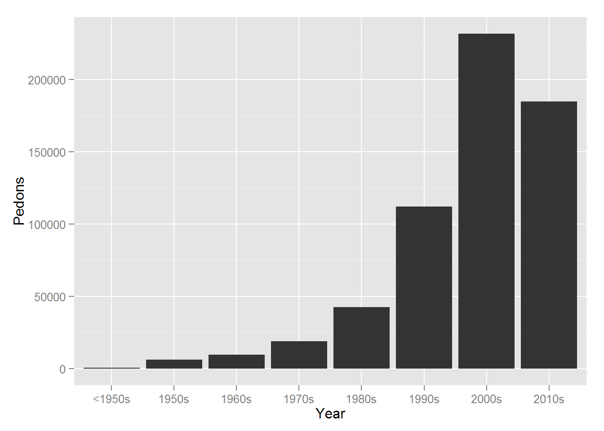
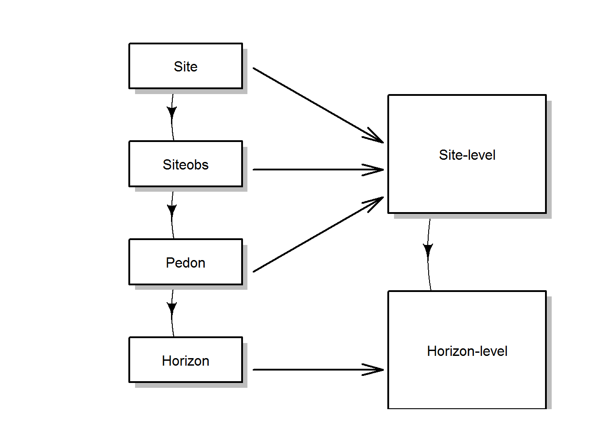
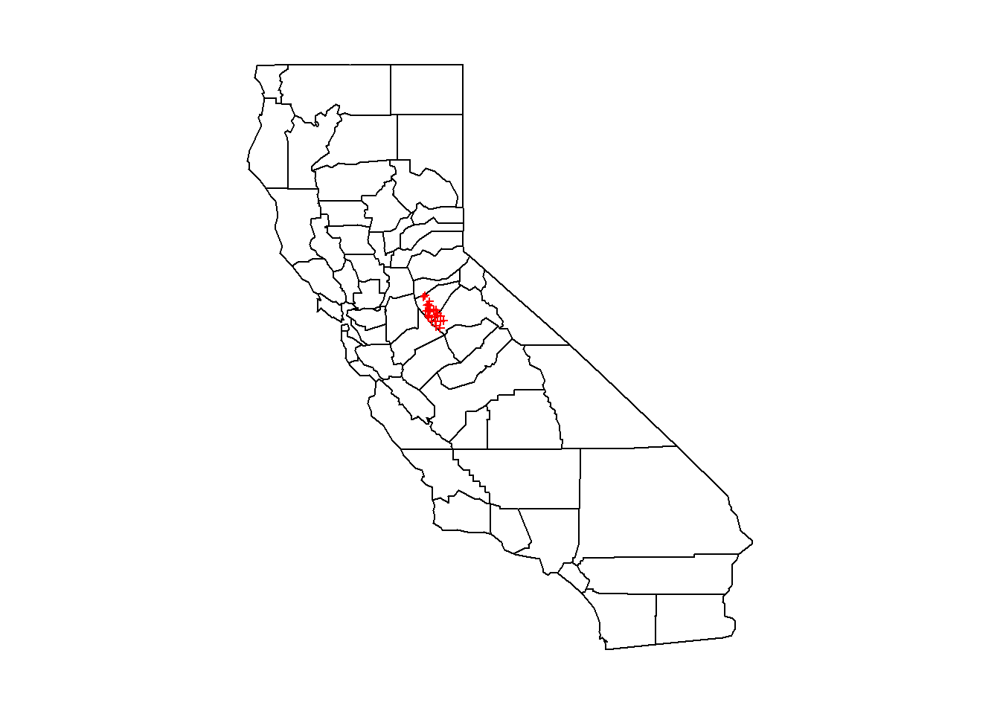
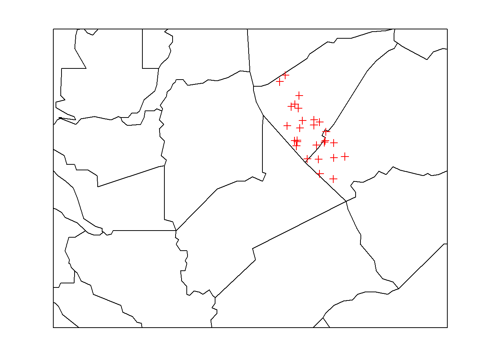
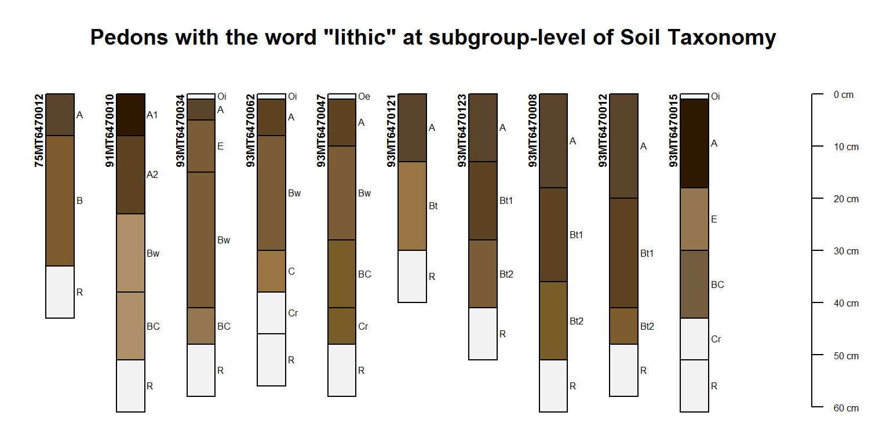
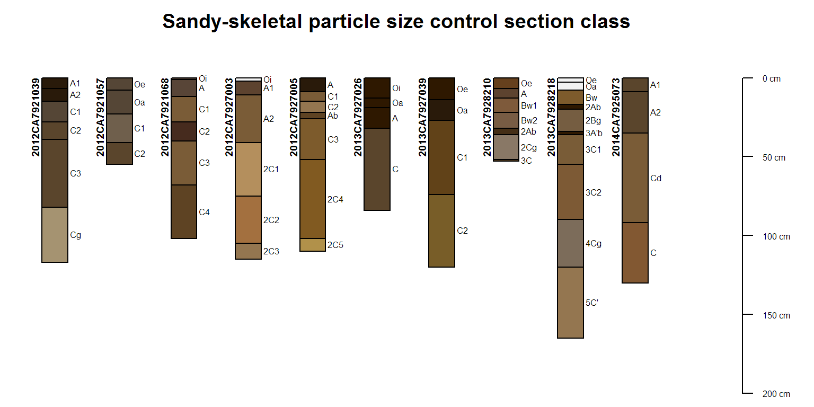
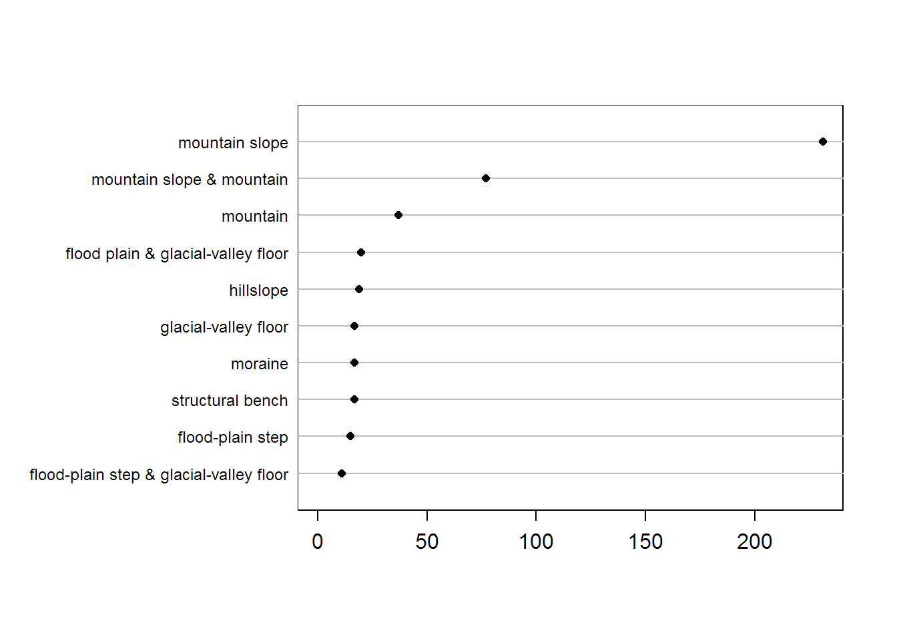
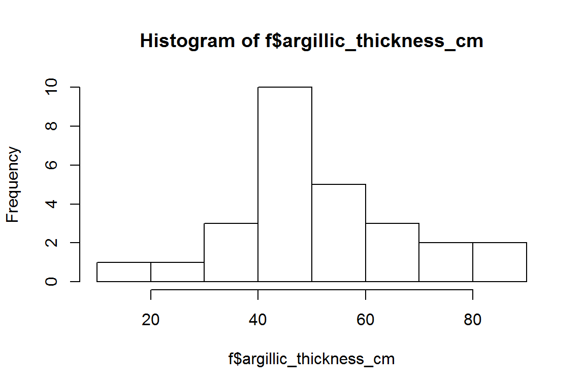
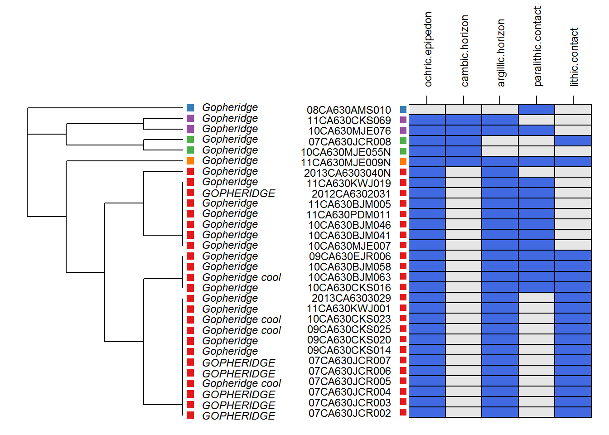
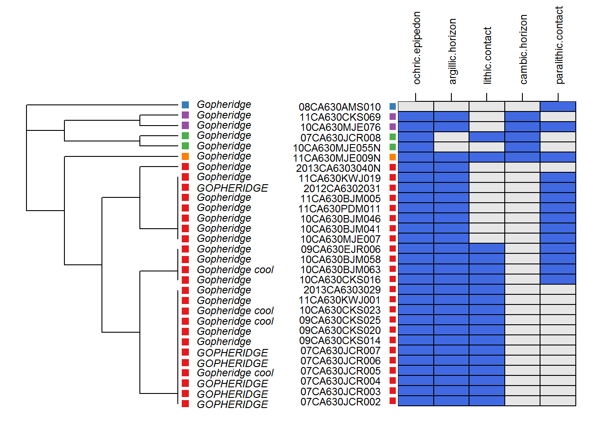

# Chapter 2 - Tabular data we use
Jay Skovlin, D.E. Beaudette, Stephen Roecker  
February 2016  


# Getting acquainted with the soilDB package
## Objectives:
- Use the soilDB package to load NASIS pedon data into R
-	Learn about the checks run by the fetch functions when pulling data into R
-	Learn basic commands for inspecting objects and data types
- Understand the basic structure of pedon data stored in a Soil Profile Collection (SPC) object
- Learn ways to work with and inspect pedon data in R
- Learn basic checks that you can do to filter and inspect the consistency of a pedon dataset
-	Not finding the data you need? Joining additional data to an SPC via extended data query functions


## Importance of pedon data

The importance of pedon data for present and future work cannot be understated.  This data represents countless years of on-the-ground observations of the soil resource for a give area.  As difficult as it may be to take the time to enter legacy pedon data it is vitally important that we capture this resource and get this data into NASIS as a future archive of point observations.  



#### Some issues with pedon data

- Observations of soil are hard won....**digging is difficult work and taking soil descriptions is time consuming!**
    - often have a weakening confidence in observations with depth described
    
- If we acknowledge this, which we must, then how do we deal with it in working with pedon data?
    - using a cutoff depth of 100cm for example to truncate observations to a zone of greater confidence
    
could use a slab plot to show this!!!  Provides a hook up front.


# R fundamentals

Examples in the sections below are meant to be copied/pasted from this document and interactively run within **R**. Comments (green text with '#' sign at left) briefly describe what the code in each line does.  Further documentation on objects and functions from the `aqp` package can be accessed by typing `help(soilDB)` or `help(aqp)` (or more generally, `?function_name`) at the **R** console. 
  
## Classes of objects used in R
 
One of the most versatile things about R is that there are many ways manipulate and work with data.  Below are examples of how to create and reference information in several data types that are commonly used in working with soil data. Within the R session, *objects* contain information: loaded from files, extracted from NASIS, created on the fly, or calculated by some function.
 
### Vectors
*Vectors* are a fundamental object in the R language that represent a set of 1 or more numbers, characters (commonly called strings), or boolean (TRUE/FALSE) values.

```r
 # implicit vector creation from a sequence from 1:10
 1:10
```

```
##  [1]  1  2  3  4  5  6  7  8  9 10
```

```r
 # numeric vector example: clay percent values
 clay <- c(10, 12, 15, 26, 30)
 
 # 'c()' is the concatenate function
 # values are concatenated into an object we've called 'clay' by assigning the concatenate result to 'clay' using '<-' or '='
 # print the values of 'clay' by typing it into the R console followed by enter
 clay
```

```
## [1] 10 12 15 26 30
```

```r
 # character vector: taxonomic subgroup
 subgroup <- c("typic haplocryepts","andic haplocryepts","typic dystrocryepts")  
 subgroup
```

```
## [1] "typic haplocryepts"  "andic haplocryepts"  "typic dystrocryepts"
```

```r
 # logical vector: diagnostic feature presence/absence
 # note that TRUE and FALSE must be capitalized
 andic <- c(FALSE,TRUE,FALSE) 
 andic
```

```
## [1] FALSE  TRUE FALSE
```

#### Referencing elements of a vector
Specific elements from a vector are accessed with square brackets, e.g. `clay[i]`. Note that the examples below use vectors to reference elements of another vector.

```r
 # 2nd and 4th elements of vector 'clay' from above
 clay[c(2, 4)] 
```

```
## [1] 12 26
```

```r
 # 1st and 3rd elements of vector 'subgroup' from above
 subgroup[c(1, 3)]
```

```
## [1] "typic haplocryepts"  "typic dystrocryepts"
```

```r
 # everything but the first element of vector 'andic'
 andic[-1]
```

```
## [1]  TRUE FALSE
```

```r
 # re-order clay values using a sequence from 5 to 1
 clay[5:1]
```

```
## [1] 30 26 15 12 10
```

So what's the deal with the square bracket notation? 
 * Access elements `i` from vector `x`: `x[i]`. 
 * Exclude elements `i` from vector `x`: `x[-i]`.
 
 
#### Vectorized evaluation: implicit looping
Most functions in R are *vectorized*. This means that operations such as addition (the `+` function) on vectors will automatically iterate through every element. Let's look at some examples to demonstrate these concepts.

```r
 # clay values from above
 # divide by 100, notice that iteration over the elements of 'clay' is implicit
 clay / 100
```

```
## [1] 0.10 0.12 0.15 0.26 0.30
```

```r
 # search for the text 'dyst' in elements of 'subgroup'
 grepl('dyst', subgroup)
```

```
## [1] FALSE FALSE  TRUE
```

```r
 # multiply two vectors of the same length
 c(5, 5) * c(1, 2)
```

```
## [1]  5 10
```

```r
 # be careful, operations on vectors of different length results in "recycling"!
 # this is helpful at times, but can be a common source of confusion
 10 * c(1, 2)
```

```
## [1] 10 20
```

```r
 c(1, 10, 100) + c(1, 2)
```

```
## [1]   2  12 101
```


### Dataframes

Dataframes are central to most work in R. They describe *rectangular* data (similar to the spreadsheet format where we are used to thinking in terms of rows and columns) where each column is constrained to a single data type: numeric, datetime, character, boolean, and so on. Note that each column of a dataframe is a vector, and all column vectors must be the same length (hence the adjective "rectangular").


```r
  # Take our two character and logical vectors we created above and convert them into a more useful dataframe.
  # we'll use the data.frame() function to glue these two vectors together into object 'd'
  d <- data.frame(subgroup, andic)
  d
```

```
##              subgroup andic
## 1  typic haplocryepts FALSE
## 2  andic haplocryepts  TRUE
## 3 typic dystrocryepts FALSE
```
We can see that the dataframe was created and it worked but the vector names are not very informative. A couple of useful functions for working with column names are `names()` which renames columns in a dataframe and `colnames()` which creates a vector of column names.


```r
  # get the column names of a dataframe
  names(d)
```

```
## [1] "subgroup" "andic"
```

```r
  # we can use 'names()' and 'c()' to rename the columns in the dataframe
  names(d) <- c('tax_subgroup', 'andic.soil.properties')
  d
```

```
##          tax_subgroup andic.soil.properties
## 1  typic haplocryepts                 FALSE
## 2  andic haplocryepts                  TRUE
## 3 typic dystrocryepts                 FALSE
```

#### Referencing within dataframes
Notice in dataframe `d` that each row has an index number in front of it.  Using the square brackets notation we can reference any part of a dataframe - rows or columns or specific row and column selections.  Here are some examples:
  

```r
  # format: dataframe_name[rows, columns]
  d[1, ] # first row of dataframe
```

```
##         tax_subgroup andic.soil.properties
## 1 typic haplocryepts                 FALSE
```

```r
  d[, 1] # first column of dataframe
```

```
## [1] "typic haplocryepts"  "andic haplocryepts"  "typic dystrocryepts"
```

```r
  d[2, 2] # second row, second column
```

```
## [1] TRUE
```

```r
  # In dataframes we can also use the '$' symbol to reference vector columns within a specific dataframe object
  d$tax_subgroup
```

```
## [1] "typic haplocryepts"  "andic haplocryepts"  "typic dystrocryepts"
```

```r
  # Other useful functions for checking objects and working with dataframes
  # the 'str()' function will show you the structure of an object and the data types of the vectors within it
  str(d)
```

```
## 'data.frame':	3 obs. of  2 variables:
##  $ tax_subgroup         : chr  "typic haplocryepts" "andic haplocryepts" "typic dystrocryepts"
##  $ andic.soil.properties: logi  FALSE TRUE FALSE
```

```r
  # 'class()' will tell you the object type or data type
  class(d)
```

```
## [1] "data.frame"
```

```r
  # use 'colnames()' to get a vector of column names from a dataframe
  colnames(d)
```

```
## [1] "tax_subgroup"          "andic.soil.properties"
```

```r
  # ncol and nrow give dimensions
  ncol(d)
```

```
## [1] 2
```

```r
  nrow(d)
```

```
## [1] 3
```

```r
  # building on what we've learned above, we can use the square bracket notation on a dataframe to re-order columns
  d <- d[ ,c('andic.soil.properties', 'tax_subgroup')]
  d
```

```
##   andic.soil.properties        tax_subgroup
## 1                 FALSE  typic haplocryepts
## 2                  TRUE  andic haplocryepts
## 3                 FALSE typic dystrocryepts
```

**Question:**

**How would we remove a vector or column from a dataframe?**
`d$tax_subgroup <- NULL` will remove this column from the dataframe.


### Factors
Factors are an extension of the character class, designed for encoding group labels. We will encounter this object (and some possible issues that it can create) later on.

```r
# generate a factor representation of the characters contained in the word 'pedology'
# also setting the range of possibilities to the letters of the alphabet
x <- factor(substring("pedology", 1:8, 1:8), levels = letters)
# note that the object 'x' knows that there are 26 possible levels
x
```

```
## [1] p e d o l o g y
## Levels: a b c d e f g h i j k l m n o p q r s t u v w x y z
```

### Lists
Lists are similar to the dataframe class, but without limitations on the length of each element. Lists are commonly used to store tree-like data stuctures or "ragged" data: elements with varying length. List elements can contain just about anything, making them one of the most flexible objects in R. Again, examples are most useful.


```r
# make a list with named elements
l <- list('favorite shovels'=c('sharpshooter', 'gibbs digger', 'auger', 'rock bar', 'backhoe!'),
     'food'=c('apples', 'bread', 'cheese', 'vienna sausages', 'lutefisk'),
     'numbers I like'=c(12, 1, 5, 16, 25, 68), 
     'email messages deleted'=c(TRUE, FALSE, FALSE, FALSE, TRUE, TRUE))
# check
l
```

```
## $`favorite shovels`
## [1] "sharpshooter" "gibbs digger" "auger"        "rock bar"     "backhoe!"    
## 
## $food
## [1] "apples"          "bread"           "cheese"          "vienna sausages" "lutefisk"       
## 
## $`numbers I like`
## [1] 12  1  5 16 25 68
## 
## $`email messages deleted`
## [1]  TRUE FALSE FALSE FALSE  TRUE  TRUE
```

```r
# access the first element of the list, note the double square brackets
l[[1]]
```

```
## [1] "sharpshooter" "gibbs digger" "auger"        "rock bar"     "backhoe!"
```

```r
# access the element named 'food'
l[['food']]
```

```
## [1] "apples"          "bread"           "cheese"          "vienna sausages" "lutefisk"
```

```r
# convert a dataframe into a list
as.list(d)
```

```
## $andic.soil.properties
## [1] FALSE  TRUE FALSE
## 
## $tax_subgroup
## [1] "typic haplocryepts"  "andic haplocryepts"  "typic dystrocryepts"
```

```r
# a list of lists
list.of.lists <- list('pedon_1'=list('top'=c(0,10,25,55), 'bottom'=c(10,25,55,76), 'pH'=c(6.8,6.6,6.5,6.4)))
list.of.lists
```

```
## $pedon_1
## $pedon_1$top
## [1]  0 10 25 55
## 
## $pedon_1$bottom
## [1] 10 25 55 76
## 
## $pedon_1$pH
## [1] 6.8 6.6 6.5 6.4
```

```r
# convert list of elements with equal length into a data.frame
as.data.frame(list.of.lists)
```

```
##   pedon_1.top pedon_1.bottom pedon_1.pH
## 1           0             10        6.8
## 2          10             25        6.6
## 3          25             55        6.5
## 4          55             76        6.4
```

### Matrix
The matrix object is used to describe rectangular data of a *single* datatype: numbers, characters, boolean values, and so on.

```r
# make a 5x5 matrix of 0's
m <- matrix(0, nrow=5, ncol=5)

# operations by scalar (single value) are vectorized
m <- m + 1
m * 5
```

```
##      [,1] [,2] [,3] [,4] [,5]
## [1,]    5    5    5    5    5
## [2,]    5    5    5    5    5
## [3,]    5    5    5    5    5
## [4,]    5    5    5    5    5
## [5,]    5    5    5    5    5
```

```r
# square braket notation is used to get / set values: m[row, col]
# set row 1, col 1 to 0
m[1,1] <- 0
m
```

```
##      [,1] [,2] [,3] [,4] [,5]
## [1,]    0    1    1    1    1
## [2,]    1    1    1    1    1
## [3,]    1    1    1    1    1
## [4,]    1    1    1    1    1
## [5,]    1    1    1    1    1
```

```r
# access diagonal and upper/lower triangles, useful for chapter 5
m[upper.tri(m)] <- 'U'
m[lower.tri(m)] <- 'L'
diag(m) <- 'D'
m
```

```
##      [,1] [,2] [,3] [,4] [,5]
## [1,] "D"  "U"  "U"  "U"  "U" 
## [2,] "L"  "D"  "U"  "U"  "U" 
## [3,] "L"  "L"  "D"  "U"  "U" 
## [4,] "L"  "L"  "L"  "D"  "U" 
## [5,] "L"  "L"  "L"  "L"  "D"
```

```r
# many functions return matrix objects
#  create a matrix of the sequences 1:10 and 1:10, then multiply every combination by applying a function
outer(1:10, 1:10, FUN='*')
```

```
##       [,1] [,2] [,3] [,4] [,5] [,6] [,7] [,8] [,9] [,10]
##  [1,]    1    2    3    4    5    6    7    8    9    10
##  [2,]    2    4    6    8   10   12   14   16   18    20
##  [3,]    3    6    9   12   15   18   21   24   27    30
##  [4,]    4    8   12   16   20   24   28   32   36    40
##  [5,]    5   10   15   20   25   30   35   40   45    50
##  [6,]    6   12   18   24   30   36   42   48   54    60
##  [7,]    7   14   21   28   35   42   49   56   63    70
##  [8,]    8   16   24   32   40   48   56   64   72    80
##  [9,]    9   18   27   36   45   54   63   72   81    90
## [10,]   10   20   30   40   50   60   70   80   90   100
```

# Using the soilDB package to load NASIS pedon data
 
## Set up an Open Database Connectivity (ODBC) connection to NASIS on your computer  

Data from a selected set defined in your local NASIS database can be accessed in R after setting up an ODBC connection. See this job aid [**How to Create an ODBC Connection and Setup SoilDB for Use with R**](https://r-forge.r-project.org/scm/viewvc.php/*checkout*/docs/soilDB/setup_local_nasis.html?root=aqp).

 **Query and load some pedon data into your NASIS selected set**
 

**Question:**

**Does NASIS need to be open and running to query data using soilDB?**
No, `fetchNASIS()` will work when the NASIS application is not running. You just need to make sure that you have the data you want loaded into your selected set.


## What is the soilDB package and what does it do?
The soilDB package for R was designed for working with soil resource related data sources.  The package has a series of convenience functions for accessing data in NASIS, KSSL, SDA, and other sources. The `fetchNASIS` convenience function extracts data from a NASIS selected set via Structured Query Language (SQL) queries.  Some basic data checks are run within the fetch functions then the data is assembled into a combined site-level and horizon-level data structure within a custom R object called a `Soil Profile Collection (SPC)`.  The [`SoilProfileCollection`](https://r-forge.r-project.org/scm/viewvc.php/*checkout*/docs/aqp/aqp-intro.html?root=aqp) class was designed to simplify the process of working with collections of data associated with soil profiles: site-level data, horizon-level data, spatial data, diagnostic horizon data, metadata, etc.  

It is important to mention that the import process built into `fetchNASIS()` is not comprehensive and does not pull all of the data for every table related to pedon data out of NASIS.  However, it pulls much of the most often used pedon and horizon data.  In addition, much of the nested complexity of the NASIS data structure have been simplified in creating the SPC object that results from the `fetchNASIS()` function.  Higher level functions like `fetchNASIS()` bundle a series of lower level functions which get specific parts of the data structure. 



One-to-many relationships are flattened where possible by `fetchNASIS()` to aggregate the data to one site record with related horizon records.  Selected additional data elements that may have a one-to-many relationship to a site or pedon can be gathered from a NASIS selected set via the  `get_extended_data_from_NASIS_db()` function.

**In short.....it greatly simplifies the process of getting pedon data from NASIS into R for further analysis.**


### Additional convenience functions in the soilDB package

- **fetchNASISLabData()**
    - KSSL laboratory pedon/horizon layer data from a local NASIS database.
- **fetchNASIS_component_data()**
    - Get selected NASIS mapunit and component data from a local NASIS database (experimental)
        - For more information check out the following tutorial:
        [**NASIS component data**](https://r-forge.r-project.org/scm/viewvc.php/%2acheckout%2a/docs/soilDB/NASIS-component-data.html?root=aqp)
- **fetchKSSL()**
    - Get KSSL data via BBOX, MLRA, or series name query, from the SoilWeb system.
        - For more information check out the following tutorial:
        [**KSSL data demo**](https://r-forge.r-project.org/scm/viewvc.php/%2acheckout%2a/docs/soilDB/NASIS-component-data.html?root=aqp)
- **fetchOSD()**
    - fetches a limited subset of horizon and site-level attributes for named soil series, from the SoilWeb system.
- **fetchRaCA()**
    - Get Rapid Carbon Assessment (RaCA) data by state, geographic bounding-box, RaCA site ID, or series query from the SoilWeb system.
        - For more information check out the following tutorial:
        [**RaCA data demo**](https://r-forge.r-project.org/scm/viewvc.php/%2acheckout%2a/docs/soilDB/RaCA-demo.html?root=aqp)
- **fetchSCAN()**
    - Query soil/climate data from USDA-NRCS SCAN Stations (experimental)
- **fetchHenry()**
    - Download Data from the Henry Mount Soil Climate Database (experimental)
        - For more information check out the following tutorial:
        [**Henry Mount Soil Climate Database Tutorial**](https://r-forge.r-project.org/scm/viewvc.php/%2acheckout%2a/docs/soilDB/Henry-demo.html?root=aqp)
- **fetchPedonPC()**
    - Fetch commonly used site/horizon data from a PedonPC v.5 database.
- **SDA_query**
    - submit queries to the Soil Data Access system
        - For more information check out the following tutorial:
        [**Soil Data Access Tutorial**](https://r-forge.r-project.org/scm/viewvc.php/%2acheckout%2a/docs/soilDB/SDA-tutorial.html?root=aqp)
 
### Data checks run by the `fetchNASIS()` function

When loading pedons with the fetchNASIS() function the following data checks are performed:

- **presence of multiple map datums:** results reported to the user and the data are not modified

- **inconsistent horizon boundaries:** pedons with inconsistent horizon boundaries are not loaded.  In most cases this occurs when the bottom depth of a horizon is not the same as the upper depth of the next lower horizon.


```
##   hzname top bot
## 1      A   0  30
## 2    Bt1  38  56
## 3    Bt2  56 121
## 4     Bk 121 135
## 5      R 135
```
_Notice the issue here?  Bottom depth of the A horizon and the upper depth of the Bt1 horizons should be the same - either be 30 or 38 cm?  Need to determine which depth to correct to resolve this issue._

- **missing lower horizon depths:** offending horizons are fixed by replacing the missing bottom depth with the top depth + 2cm.  So in the case of the profile shown above a bottom depth of 137cm would be inserted where the depth is missing.

- **sites missing pedon records:** data without corresponding horizons are not loaded


#### How can we find the site ID's where these errors occur so that we can to fix them in NASIS?
Should errors in the pedon data be detected when loading data using fetchNASIS() you can use the following 'get' functions to trace them back to the corresponding records in NASIS:

- **get('sites.missing.pedons', envir=soilDB.env)**
    - returns user site ID's for sites missing pedons
  
- **get('dup.pedon.ids', envir=soilDB.env)**
    - returns pedon ID's for sites with duplicate pedon ID's
  
- **get('bad.pedon.ids', envir=soilDB.env)**
    - returns user pedon ID's for pedons with inconsistent horizon depths
    
- **get('bad.horizons', envir=soilDB.env)**
    - returns a dataframe of horizon-level information for pedons with inconsistent horizon depths

For more information on the design of soilDB functions use the following link to the soilDB documentation - [**Introduction to soilDB**](https://r-forge.r-project.org/scm/viewvc.php/%2acheckout%2a/docs/soilDB/soilDB-Intro.html?root=aqp)


### Options that can be set within fetchNASIS()

There are two default options that can be set within `fetchNASIS(rmHzErrors = TRUE, nullFragsAreZero = TRUE)`  

- **rmHzErrors = TRUE/FALSE** 
    - Setting this value to **TRUE** (the default) will enable checks for horizon depth consistency. Consider setting this argument to FALSE if you aren't concerned about horizon depth errors, or know that your selected set contains many combination horizons (consisting of E/Bt or similar two part horizons described individually for the same depth range). Note that any pedons flagged as having horizon depths errors (rmHzErrors = TRUE) will be omitted from the data returned by `fetchNASIS()`.
    
- **nullFragsAreZero = TRUE/FALSE**
    - Setting this value to **TRUE** (the default) will convert NULL rock fragment volumes to 0. This is typically the right assumption as rock fragment data are typically populated only when observed. If you know that your data contain a combination of ommited information (e.g. there are no rock fragment volumes populated) then consider setting this argument to FALSE.
  
For more information on the data checks and adjusting the default options to `fetchNASIS()` function use the following resource - [**Tips on getting data from NASIS into R**](https://r-forge.r-project.org/scm/viewvc.php/%2acheckout%2a/docs/soilDB/fetchNASIS-mini-tutorial.html?root=aqp)

## Structure of pedon data a Soil Profile Collection (SPC) object

#### The `Gopheridge` Sample Dataset
The `gopheridge` sample dataset is very similar to the type of data returned from `fetchNASIS()`. The following demonstration is intended to show the structure of the Soil Profile Collection (SPC) object that is returned by `fetchNASIS()`. 

Before proceeding it may be helpful to review the [**SoilProfileCollection object introduction**](https://r-forge.r-project.org/scm/viewvc.php/*checkout*/docs/aqp/aqp-intro.html?root=aqp).  This tutorial provides an excellent overview of how the SPC object is constructed.  Also the `soilDB` and `aqp` manual pages are accessible (click on the 'index' at the bottom of the Help tab in RStudio) by entering the following into the R console: 


```r
# not run
library(soilDB)
help(soilDB)

# for links to lots of great examples look here!
library(aqp)
help(aqp)
```


Open RStudio, and setup the environment by loading packages and the Gopheridge sample dataset.


```r
options(width=95, stringsAsFactors=FALSE)
library(soilDB)
library(aqp)

# load example dataset
data(gopheridge)

# what kind of object is this?
class(gopheridge)
```

```
## [1] "SoilProfileCollection"
## attr(,"package")
## [1] "aqp"
```

```r
# what does the internal structure look like?
str(gopheridge, 2)
```

```
## Formal class 'SoilProfileCollection' [package "aqp"] with 7 slots
##   ..@ idcol     : chr "peiid"
##   ..@ depthcols : chr [1:2] "hzdept" "hzdepb"
##   ..@ metadata  :'data.frame':	1 obs. of  1 variable:
##   ..@ horizons  :'data.frame':	151 obs. of  43 variables:
##   ..@ site      :'data.frame':	30 obs. of  68 variables:
##   ..@ sp        :Formal class 'SpatialPoints' [package "sp"] with 3 slots
##   ..@ diagnostic:'data.frame':	98 obs. of  4 variables:
```

```r
# let's take a look at the fields at the site and horizon levels within the SPC
siteNames(gopheridge)
```

```
##  [1] "peiid"                "pedon_id"             "siteiid"             
##  [4] "site_id"              "obs_date"             "utmzone"             
##  [7] "utmeasting"           "utmnorthing"          "x"                   
## [10] "y"                    "datum"                "x_std"               
## [13] "y_std"                "describer"            "pedon_purpose"       
## [16] "pedon_type"           "pedlabsampnum"        "elev_field"          
## [19] "slope_field"          "aspect_field"         "plantassocnm"        
## [22] "coverkind_1"          "bedrckdepth"          "bedrock_kind"        
## [25] "bedrock_hardness"     "hillslope_pos"        "slope_position"      
## [28] "shapeacross"          "shapedown"            "slopecomplex"        
## [31] "drainagecl"           "classdate"            "classifier"          
## [34] "class_type"           "taxonname"            "taxon_kind"          
## [37] "series_status"        "part_size_class"      "tax_order"           
## [40] "tax_suborder"         "tax_grtgroup"         "tax_subgroup"        
## [43] "tax_edition"          "osdtypelocflag"       "tax_moistureclass"   
## [46] "tax_fam_other"        "psctopdepth"          "pscbotdepth"         
## [49] "selection_method"     "ochric.epipedon"      "argillic.horizon"    
## [52] "lithic.contact"       "paralithic.contact"   "cambic.horizon"      
## [55] "limnic.materials"     "paralithic.materials" "surface_fgravel"     
## [58] "surface_gravel"       "surface_cobbles"      "surface_stones"      
## [61] "surface_boulders"     "surface_channers"     "surface_flagstones"  
## [64] "surface_paragravel"   "surface_paracobbles"  "landform.string"     
## [67] "pmkind"               "pmorigin"
```

```r
horizonNames(gopheridge)
```

```
##  [1] "peiid"               "phiid"               "hzname"              "genhz"              
##  [5] "hzdept"              "hzdepb"              "clay"                "silt"               
##  [9] "sand"                "texture_class"       "texture"             "phfield"            
## [13] "effervescence"       "labsampnum"          "total_frags_pct_cal" "total_frags_pct"    
## [17] "rupresblkdry"        "stickiness"          "plasticity"          "d_r"                
## [21] "d_g"                 "d_b"                 "d_hue"               "d_value"            
## [25] "d_chroma"            "d_sigma"             "m_r"                 "m_g"                
## [29] "m_b"                 "m_hue"               "m_value"             "m_chroma"           
## [33] "m_sigma"             "soil_color"          "fine_gravel"         "gravel"             
## [37] "cobbles"             "stones"              "boulders"            "paragravel"         
## [41] "paracobbles"         "channers"            "flagstones"
```

#### Subset example of the data in the site-level portion of the SPC:


peiid    pedon_id    siteiid  site_id         obs_date      utmzone   utmeasting   utmnorthing           x          y
-------  ---------  --------  --------------  -----------  --------  -----------  ------------  ----------  ---------
242808   07JCR002     244384  07CA630JCR002   2007-04-02         10     700783.0       4201935   -120.7150   37.94286
268791   07JCR003     269602  07CA630JCR003   2007-05-14         10     714552.7       4191747   -120.5614   37.84805


datum        x_std      y_std  describer   pedon_purpose            pedon_type                 pedlabsampnum    elev_field   slope_field   aspect_field
------  ----------  ---------  ----------  -----------------------  -------------------------  --------------  -----------  ------------  -------------
NAD83    -120.7150   37.94286  John Rule   full pedon description   OSD pedon                  07N0469                 337            20            272
NAD83    -120.5614   37.84805  John Rule   full pedon description   correlates to named soil   NA                      324            15            154


plantassocnm        coverkind_1    bedrckdepth  bedrock_kind    bedrock_hardness            hillslope_pos   slope_position    shapeacross 
------------------  ------------  ------------  --------------  --------------------------  --------------  ----------------  ------------
NA                  NA                      81  Greenstone      Extremely weakly cemented   Backslope       on middle third   Linear      
Blue Oak Woodland   NA                      60  Metavolcanics   Extremely weakly cemented   Backslope       NA                Convex      


shapeacross   shapedown   slopecomplex   drainagecl     classdate             classifier   class_type   taxonname    taxon_kind 
------------  ----------  -------------  -------------  --------------------  -----------  -----------  -----------  -----------
Linear        Linear      complex        Well drained   2012-01-24 00:00:00   NA           series       GOPHERIDGE   series     
Convex        Convex      NA             Well drained   2012-01-24 23:15:24   NA           series       GOPHERIDGE   series     

#### Subset example of the data in the horizon-level portion of the SPC:


  peiid     phiid  hzname   genhz    hzdept   hzdepb   clay   silt   sand  texture_class 
-------  --------  -------  ------  -------  -------  -----  -----  -----  --------------
 242808   1148313  Oi       NA            0        3     NA     NA     NA  spm           
 242808   1148312  Oe       NA            3        5     NA     NA     NA  mpm           
 242808   1148311  A1       NA            5       10     16     44     20  sil           
 242808   1148310  A2       NA           10       18     18     42     20  sil           
 242808   1148309  Bt1      NA           18       36     25     55     20  sil           
 242808   1148308  Bt2      NA           36       53     30     50     20  cl            
 242808   1148307  Bt3      NA           53       81     35     45     20  cl            
 242808   1148306  R        NA           81      152     NA     NA     NA  NA            


texture    phfield  effervescence   labsampnum    total_frags_pct_cal   total_frags_pct  rupresblkdry     stickiness          plasticity         
--------  --------  --------------  -----------  --------------------  ----------------  ---------------  ------------------  -------------------
SPM             NA  NA              07N03080                        0                 0  NA               NA                  NA                 
MPM             NA  NA              07N03080                        0                 0  NA               NA                  NA                 
SIL            6.4  none            07N03081                        6                 6  hard             slightly sticky     nonplastic         
SIL            6.1  none            07N03082                       11                11  very hard        slightly sticky     slightly plastic   
GRV-SIL        6.1  none            07N03083                       63                63  extremely hard   moderately sticky   moderately plastic 
GRV-CL         6.0  none            07N03084                       64                64  extremely hard   moderately sticky   moderately plastic 
STX-CL         5.7  none            07N03085                       67                67  extremely hard   moderately sticky   moderately plastic 
NA              NA  NA              NA                              0                 0  NA               NA                  NA                 

**Exercise:**

**Explore the site and horizon level data in your own SPC using the following code:**

#### Follow along with your own data
This will require some pedons in your local NASIS selected set.


```r
# load required libraries
library(soilDB)
library(aqp)

# load data from a NASIS selected set
f <- fetchNASIS()

# what kind of object is this?
class(f)

# how many pedons
length(f)

# let's take a look at the fields at the site and horizon levels within the SPC
siteNames(f)
horizonNames(f)

# look at the first 2 rows of site and horizon data
head(site(f), 2)
head(horizons(f), 2)
```

**Question:**

**How can we find out how many site and horizon records we have in the data we've just loaded?**

## Viewing pedon locations
### Plotting geographic data directly in R

 - **Quick check:** Does the data roughly plot where you would expect it to?
 
Plotting the data directly as an R graphic can give you some idea of how the data look spatially and whether their distribution approximates what you would expect to see.  Typos in coordinates are relatively common when they are manually entered and viewing the data spatially is a quick way to see points that plot far outside of the geographic area of interest and clearly have some kind of error.


```r
# plot the locations of the gopheridge pedons within R
# Steps:
# 1) subset to a new data frame
# 2) create a spatial points data frame (SPDF)
# 3) plot the data

# load libraries
library(sp)
library(maps)

# subset standard WGS84 decimal degree coordinates from the gopheridge SPC by specifying column names
gopher.locations <- site(gopheridge)[, c('site_id', 'x_std', 'y_std')]

# initialize coordinates in an SPDF
coordinates(gopher.locations) <- ~ x_std + y_std
# define coordinate system
proj4string(gopher.locations) <- '+proj=longlat +datum=WGS84'

# set plot margins
par(mar=c(0,0,0,0))

# plot county boundaries for all of CA
map('county', 'california')
# add pedon data locations, note symbol styling
points(gopher.locations, cex=0.5, pch=3, col='red')
```



```r
# plot again but zoom in by setting xlim, ylim extents
map('county', 'California', xlim=c(-122.25, -119.75), ylim=c(37, 38.5))
# add pedon data locations, note symbol styling
points(gopher.locations, cex=1, pch=3, col='red')
box()
```



### Displaying pedon data in Google Earth
Google Earth is a powerful data viewer for point data.  Geographic data in Google Earth is displayed using the Keyhole Markup Language (KML) format.  Using the [plotKML](https://cran.r-project.org/web/packages/plotKML/plotKML.pdf) package we can easily create a KML file for inspection and viewing in Google Earth.  See the related material in this tutorial [**Export Pedons to Google Earth**](https://r-forge.r-project.org/scm/viewvc.php/*checkout*/docs/soilDB/export-points-from-NASIS-to-Google-Earth.html?root=aqp). 

### Exporting pedon data to an ESRI shapefile
Another way we could view the data is to export a shapefile from R.  Further information on how to do this can be found in this tutorial [**Export Pedons to Shapefile**](https://r-forge.r-project.org/scm/viewvc.php/*checkout*/docs/soilDB/export-points-from-NASIS.html?root=aqp).

**Exercise:**

**Use the following script to make an R plot of pedon data you've loaded from your NASIS selected set.**

The following script is plotting the standard lat/long fields from NASIS.  In some cases you might find that these fields are incomplete due to insufficient data or have not been calculated from UTM coordinates in NASIS.  In these cases there are a couple of ways that you can omit sites with 'NA' values in the coordinates.  `na.omit()` or `complete.cases()` functions will remove any rows in a dataframe that have 'NA' values.

Working with the data loaded from your local NASIS selected set.

```r
# load libraries
library(sp)
library(maps)

# subset standard WGS84 decimal degree coordinates from the gopheridge SPC by specifying column names
f.locations <- site(f)[, c('site_id', 'x_std', 'y_std')]
nrow(f.locations)

# remove any sites lacking standard lat/long coordinates
# notice that there may now be fewer rows of data
f.locations <- na.omit(f.locations)
nrow(f.locations)

# initialize coordinates in an SPDF
coordinates(f.locations) <- ~ x_std + y_std
# define coordinate system
proj4string(f.locations) <- '+proj=longlat +datum=WGS84'

# set plot margins
par(mar=c(0,0,0,0))

# plot pedon locations
plot(f.locations)

# plot in CONUS: good way to check for typos
# ENTER your state!!!
map('state')
points(f.locations, cex=0.5, pch=3, col='red')

# plot again this time with county boundaries for your state
# ENTER your state!!!
map('county', 'Montana')
# add plot of pedon locations
points(f.locations, cex=0.5, pch=3, col='red')
```

# Working with SPC data in R

## Summarizing data

Now that we've loaded some data, let's look at additional ways that you can summarize data elements and filter the SPC to specific sites of interest. The `table()` function is very useful for quick summary operations.  This function can be combined with other functions such as `sort()` and `is.na()` or `!is.na()` (is not NA). Follow along with your own data.


```r
# summarize which soil taxa we have loaded
table(f$taxonname)
# sort results in descending order
sort(table(f$taxonname), decreasing=TRUE)

# could do the same thing for taxonomic subgroups or any column of the SPC at the site or horizon levels
table(f$tax_subgroup)
sort(table(f$tax_subgroup), decreasing=TRUE)

# table() is also useful when testing for null data using IS NA, is.na() or IS NOT NA, !is.na()
table(is.na(f$tax_subgroup))
table(!is.na(f$tax_subgroup))

# it can also be applied to horizon level columns in the SPC
sort(table(f$texture), decreasing=TRUE)
```

### Filtering data using pattern matching

A collection of soil profiles or an SPC can be subset using a variety of methods and then the results can be placed into another SPC. This can be useful for generating subset SPC objects from the original dataset.  The following examples use the `grep()` function to pattern match within the data and create an index of the SPC for records that match the specified pattern within that column and then use that index to filter to specific sites and their corresponding profiles. Patterns are specified in [regular expression](http://regexr.com/) syntax.

This process can be applied to many different columns in the SPC based on how you need to filter the data.  This example pattern matches on the `tax_subgroup` column, but another useful application might be to pattern match on geomorphic or parent material information.

Notice below that the `grep()` also has an ***invert option***, which is specified as either TRUE or FALSE (the default when unspecified is FALSE).  This option is very useful (when set to TRUE) for excluding the results of the pattern matching process by inverting the selection.


```r
# say we wanted to look at what the variation of particle size classes are within a specific subgroup?
# use of grep() to filter and create an index, then apply that index to the SPC 
# and create a new SPC called 'f1' using the square bracket notation
idx <- grep('lithic', f$tax_subgroup, invert=FALSE)
# save this subset of 'lithic' soils for later use  
f1 <- f[idx, ]
# or use the index directly to summarize a field
sort(table(f$part_size_class[idx]), decreasing=TRUE)
```
Let's do a quick graphical check that we've selected the 'lithic*' profiles by plotting them in R using the AQP package `plot()` function.


```r
# adjust margins
par(mar=c(1,0,1,1))
# plot the first 10 profiles of the 'f1' subset
plot(f1[1:10, ], label='site_id', max.depth=100)
```


For more information on using regular expressions in `grep()` for pattern matching operations: [Regular-expression-syntax](https://www.gnu.org/software/findutils/manual/html_node/find_html/grep-regular-expression-syntax.html)


### Filtering data by specifying a criteria using the `which()` function

Another method of subsetting a collection of soil profiles is to specify a criteria using the `which()` function. The following examples use the `which()` and `grep()` functions to reference the indexing of the SPC to create subsets and to filter to specific sites or their corresponding profiles.


```r
# say we wanted to look at what the variation of particle size classes are within a specific subgroup?
# first: use grep to pattern match the tax_subgroup field for the string 'aqu'
idx <- grep('aqu', f$tax_subgroup)
# save this subset
f1 <- f[idx, ]
# check taxonomic range of particle size classes in the data
sort(table(f1$tax_subgroup), decreasing=TRUE)
```

```
## 
##       oxyaquic humicryepts          histic cryaquepts    fluvaquentic cryaquepts 
##                         14                         13                          8 
##      oxyaquic cryofluvents       oxyaquic humixerepts       oxyaquic cryorthents 
##                          7                          7                          6 
##     oxyaquic dystrocryepts           typic cryaquents         aquic xerofluvents 
##                          6                          6                          4 
##           humic cryaquepts          aquic humicryepts          aquic humixerepts 
##                          4                          3                          3 
##         cumulic humaquepts   fluvaquentic humicryepts          histic humaquepts 
##                          3                          3                          3 
##      oxyaquic xerofluvents           typic humaquepts         aquic cryofluvents 
##                          3                          3                          2 
##         aquic haploxerepts fluvaquentic haplosaprists       oxyaquic xerorthents 
##                          2                          2                          2 
##  thapto-histic fluvaquents           aeric cryaquepts          aquic cryorthents 
##                          2                          1                          1 
##        aquic dystrocryepts        aquic xeropsamments   fluvaquentic cryohemists 
##                          1                          1                          1 
##  fluvaquentic cryosaprists fluvaquentic dystrocryepts  fluvaquentic haplohemists 
##                          1                          1                          1 
##    fluvaquentic humaquepts      fluventic endoaquepts    humaqueptic endoaquents 
##                          1                          1                          1 
##    humaqueptic fluvaquents     oxyaquic cryopsamments           typic cryaquepts 
##                          1                          1                          1 
##          typic endoaquents          typic fluvaquents 
##                          1                          1
```

```r
sort(table(f1$part_size_class), decreasing=TRUE)
```

```
## 
##                            sandy-skeletal                              coarse-loamy 
##                                        30                                        26 
##                                     sandy                            loamy-skeletal 
##                                        26                                        21 
##                                  not used coarse-loamy over sandy or sandy-skeletal 
##                                         6                                         5 
##                              coarse-silty coarse-silty over sandy or sandy-skeletal 
##                                         2                                         2 
##   fine-silty over sandy or sandy-skeletal                   sandy or sandy-skeletal 
##                                         1                                         1 
##                          sandy over loamy 
##                                         1
```

```r
# then further query the subset for only those profiles with particle size class of 'sandy-skeletal'
# notice: a double equal sign '==' is used for exact character or numeric criteria
idx <- which(f1$part_size_class == 'sandy-skeletal')
# save this subset
f2 <- f1[idx, ]
table(f2$part_size_class)
```

```
## 
## sandy-skeletal 
##             30
```

```r
# plot  profiles 1 thru 10
par(mar=c(0,0,2,1))
plot(f2[1:10, ], label='site_id')
title('Sandy-Skeletal Particle Size Control Section Class')
```



#### Additional syntax options for use in `which()` criteria

  - `%in%` - equivalent to IN() in SQL. Can use `c()` to concatenate lists of vectors
    - example:   `which(f$part_size_class %in% c('loamy-skeletal', 'sandy-skeletal'))`
  - `!=` - not equal to character 'string'
  - `==` - notice in the above example that R uses a double equal sign as equal to.
  - `<, >, <=, >=` - less than, greater than, and equal to.


### Extracting Site and Horizon data

Soil Profile Collections are designed to be dismantled in order to work with either site or horizon data more easily.  Within the SPC there is a slot for site-level data and a slot for horizon-level data.  We can reference these slots using the `site()` and `horizons()` functions within the AQP package.  These getter functions will extract all the site or horizon variables as a dataframe for further use.  


```r
# extract site data from SPC into dataframe 's'
s <- site(f)
names(s)
```

```
##  [1] "peiid"                                    "pedon_id"                                
##  [3] "siteiid"                                  "site_id"                                 
##  [5] "obs_date"                                 "utmzone"                                 
##  [7] "utmeasting"                               "utmnorthing"                             
##  [9] "x"                                        "y"                                       
## [11] "datum"                                    "x_std"                                   
## [13] "y_std"                                    "gpspositionalerror"                      
## [15] "describer"                                "pedon_purpose"                           
## [17] "pedon_type"                               "pedlabsampnum"                           
## [19] "labdatadescflag"                          "elev_field"                              
## [21] "slope_field"                              "aspect_field"                            
## [23] "plantassocnm"                             "coverkind_1"                             
## [25] "bedrckdepth"                              "bedrock_kind"                            
## [27] "bedrock_hardness"                         "hillslope_pos"                           
## [29] "slope_position"                           "shapeacross"                             
## [31] "shapedown"                                "slopecomplex"                            
## [33] "drainagecl"                               "classdate"                               
## [35] "classifier"                               "class_type"                              
## [37] "taxonname"                                "taxon_kind"                              
## [39] "series_status"                            "part_size_class"                         
## [41] "tax_order"                                "tax_suborder"                            
## [43] "tax_grtgroup"                             "tax_subgroup"                            
## [45] "tax_edition"                              "osdtypelocflag"                          
## [47] "tax_moistureclass"                        "temp_class"                              
## [49] "tax_fam_other"                            "psctopdepth"                             
## [51] "pscbotdepth"                              "selection_method"                        
## [53] "umbric.epipedon"                          "lithic.contact"                          
## [55] "cambic.horizon"                           "histic.epipedon"                         
## [57] "mollic.epipedon"                          "aquic.conditions"                        
## [59] "ochric.epipedon"                          "argillic.horizon"                        
## [61] "redox.concentrations"                     "reduced.matrix"                          
## [63] "paralithic.contact"                       "abrupt.textural.change"                  
## [65] "fibric.soil.materials"                    "hemic.soil.materials"                    
## [67] "sapric.soil.materials"                    "redox.depletions.with.chroma.2.or.less"  
## [69] "densic.materials"                         "lithologic.discontinuity"                
## [71] "paralithic.materials"                     "densic.contact"                          
## [73] "strongly.contrasting.particle.size.class" "calcic.horizon"                          
## [75] "folistic.epipedon"                        "andic.soil.properties"                   
## [77] "human.transported.material"               "surface_fgravel"                         
## [79] "surface_gravel"                           "surface_cobbles"                         
## [81] "surface_stones"                           "surface_boulders"                        
## [83] "surface_channers"                         "surface_flagstones"                      
## [85] "surface_paragravel"                       "surface_paracobbles"                     
## [87] "landform.string"                          "pmkind"                                  
## [89] "pmorigin"
```

```r
# extract horizon data from SPC into dataframe 'h'
h <- horizons(f)
names(h)
```

```
##  [1] "peiid"               "phiid"               "hzname"              "genhz"              
##  [5] "hzdept"              "hzdepb"              "clay"                "silt"               
##  [9] "sand"                "texture_class"       "texture"             "phfield"            
## [13] "effervescence"       "labsampnum"          "total_frags_pct_cal" "total_frags_pct"    
## [17] "rupresblkdry"        "stickiness"          "plasticity"          "d_r"                
## [21] "d_g"                 "d_b"                 "d_hue"               "d_value"            
## [25] "d_chroma"            "d_sigma"             "m_r"                 "m_g"                
## [29] "m_b"                 "m_hue"               "m_value"             "m_chroma"           
## [33] "m_sigma"             "soil_color"          "fine_gravel"         "gravel"             
## [37] "cobbles"             "stones"              "boulders"            "paragravel"         
## [41] "paracobbles"         "channers"            "flagstones"
```
We can also use these functions in referencing the data within an SPC to specify that we want to look specifically in the site or horizon data. 

### Review of data checks run by `fetchNASIS()`
Now that we've loaded some data and learned a little about how to filter data in the SPC, let's quickly review some of the `get()` functions used to track data issues detected in the process of loading data back to the NASIS records in our selected set.


```r
# use each one of these to return a vector of the pedons where errors were detected
#get('sites.missing.pedons', envir=soilDB.env)
#get('dup.pedon.ids', envir=soilDB.env)
#get('bad.pedon.ids', envir=soilDB.env)
# example of pedon_id's returned
#[1] "2011MT0810001" "2011MT0810009" "2011MT00810015" "2011MT0810027" "2011MT0810034"

#get('bad.horizons', envir=soilDB.env)

# How could you then remove these from your SPC?
# since the get() returns the string of bad pedon id's we can use a which() to query any pedon id's that don't match the bad id's
idx <- which(horizons(f)$pedon_id != get('bad.pedon.ids', envir=soilDB.env))
f <- f[idx, ]
```
Another useful function is `dput()` which will concatenate a variable converting something like this:\

"2011MT0810001" "2011MT0810009" "2011MT00810015" "2011MT0810027" "2011MT0810034"\

Into this:\
c("2011MT0810001", "2011MT0810009", "2011MT00810015", "2011MT0810027", "2011MT0810034")

Such a string can then be copied/pasted back as a concatenated string or could even be used as string for NASIS list queries. The `dput()` function is also helpful when sending questions or examples to colleagues via email.


## Custom functions

### Defining a function
Functions bundle operations and can come in the form of small helper functions or involve larger multi-step processes to be run on the SPC data.  Here we focus on functions that work with the site and horizon data in the SPC.  The general workflow typically goes like this:

- *the need for a function is realized*

- *steps for a function are defined*

- *function is then applied iteratively to each profile and each horizon*

- *results are returned*

- *in many cases function results many need to be further summarized to join them back to the SPC for further use*

### Function examples

Functions can bundle a series of operations and then be applied to an SPC using `profileApply()`.  Say we wanted to use some pedon data to model the depth to the top of an argillic horizon.  One way to do this would be to look through horizon designations to derive a depth to argillic horizons using the 't' suffix horizon designation.  A first step would be to think about outlining the steps involved in the process.  
What steps would be needed to accomplish this task and return an upper depth to carbonates for each site?

 - *extract* the horizon data for each profile
 - *iterate* through the horizon designations(hzname) pattern matching for 't'
 - *apply* the function to each profile via `profileApply()`
 - *summarize* the data returned by the function to one value per profile
 - *join* the summarized depth value back to the site data
 
#### Example using the Gopheridge sample dataset


```r
# load required libraries
library(aqp)
library(soilDB)
library(plyr)

# load example dataset
data(gopheridge)

# rename gopheridge as SPC object 'f'
f <- gopheridge

# the argument 'i' is a single soil profile
f.clay <- function(i) {
  # extract horizons for current profile
  h <- horizons(i) 
  # search for pattern 't' in horizon designations
  idx <- grep('t', h$hzname)
  # subset these horizons
  h2 <- h[idx, ] 
  # subset columns in resulting dataframe
  res <- h2[, c('peiid', 'phiid', 'hzname', 'hzdept', 'hzdepb', 'clay', 'phfield')]
  # return data
  return(res)
}

# apply function to each profile, results are a list of dataframes
l <- profileApply(f, FUN=f.clay, simplify=FALSE)

# convert list into a dataframe, dropping all pedons with no 't' horizons 
clay <- ldply(l)

# view the top 6 rows
head(clay)

# example of data returned - you can see that we still need to summarize this to get the upper depth from multiple 'Bt' horizons
# notice that a couple of additional variable were return by the function
#      .id  peiid   phiid hzname hzdept hzdepb clay phfield 
#1 242808 242808 1148309    Bt1     18     36   25     6.1  
#2 242808 242808 1148308    Bt2     36     53   30     6.0  
#3 242808 242808 1148307    Bt3     53     81   35     5.7 
#4 268791 268791 1258250    Bt1     15     33   18     6.8 
#5 268791 268791 1258251    Bt2     33     58   28     6.5 

# still need to reduce this down to one depth value for each profile
# summarize this dataframe using summarise() in the plyr package
## ddply() will apply a function (summarise the min(hzdept)) then combine the results into a data frame.
## standard ddply syntax is as follows (type '??ddply' into the console:
## ddply(.data, .variables, .fun = NULL....)

clay1 <- ddply(clay, 'peiid', summarise, depth_to_argillic_cm=min(hzdept))

# since we have peiid in the 'clay1' dataframe we can easy join it back to site data in the SPC
site(f) <- clay1

# summary of depth to carbonates in the data using a histogram
hist(f$depth_to_argillic_cm)
```
**Question:**                                                                                                                                          
**What is a potential problem with this operation?  What was not accounted for?**


```r
# This time we'll go after the thickness of the organic horizons where present.

# load library
library(plyr)

f.organic <- function(i) {
  # extract horizons
  h <- horizons(i)
  # pattern match for 'O' horizon designations in horizon data
  idx <- grep('O', h$hzname)
  h2 <- h[idx, ] 
  # subset results
  res <- h2[, c('peiid', 'phiid', 'hzname', 'hzdept', 'hzdepb')]
  # return data
  return(res)
}

# apply function to each profile, results are a list of data.frames
l <- profileApply(f, FUN=f.organic, simplify=FALSE)

# convert list into a dataframe
organic <- ldply(l)

# show contents of the 'organic' dataframe
head(organic)

# example of data returned - you can see that we still need to summarize this to get the lower depth for multiple 'O' horizons where present. 
 #     .id  peiid   phiid hzname hzdept hzdepb
#     .id  peiid   phiid hzname hzdept hzdepb
#1 242808 242808 1148313     Oi      0      3
#2 242808 242808 1148312     Oe      3      5
#3 374209 374209 1656191     Oi      0      1
#4 374220 374220 1656263     Oi      0      1

# still need to reduce this down to one max bottom depth value for each profile
# summarize this dataframe using summarise() in the plyr package
organic1 <- ddply(organic, 'peiid', summarise, organic_thickness_cm=max(hzdepb))

# since we have peiid in the 'organic1' dataframe we can join back to site data in the SPC
site(f) <- organic1

# summary of organic thickness in the data
hist(f$organic_thickness_cm)
```

You could now subtract the organic_thickness_cm values from depth_to_argillic_cm values to get a more realistic upper depth to argillic features.

How would we do that?


#### Follow along with your own data

In the following example we want to use some pedon data to model the depth to calcium carbonate.  

What steps would be needed to accomplish this task and return an upper depth to carbonates for each site?

 - *extract* the horizon data for each profile
 - *iterate* through the horizon designations(hzname) pattern matching for 'k'
 - *apply* the function to each profile via `profileApply()`
 - *summarize* the data returned by the function to one value per profile
 - *join* the summarized depth value back to the site data

Note: This example may need to be modified to evaluate different horizon designations than the ones used here:
 

```r
# load required libraries
library(plyr)

# the argument 'i' is a single soil profile
f.limy <- function(i) {
  # extract horizons for current profile
  h <- horizons(i) 
  # search for pattern 'k' in horizon designations
  idx <- grep('k', h$hzname)
  # subset these horizons
  h2 <- h[idx, ] 
  # subset columns in resulting dataframe
  res <- h2[, c('peiid', 'phiid', 'hzname', 'hzdept', 'hzdepb', 'phfield', 'effervescence')]
  # return data
  return(res)
}

# apply function to each profile, results are a list of dataframes
l <- profileApply(f, FUN=f.limy, simplify=FALSE)

# convert list into a dataframe, dropping all pedons with no 'k' horizons 
limy <- ldply(l)

# view the top 6 rows
head(limy)

# example of data returned - you can see that we still need to summarize this to get the upper depth from multiple 'Bk' horizons
# notice that a couple of additional variable were return by the function
#     .id  peiid   phiid hzname hzdept hzdepb phfield effervescence
#1 828198 828198 4268004    Bk1     91    152     8.2     violent
#2 828198 828198 4268003    Bk2    152    182     8.2      strong
#3 828209 828209 4268070    Btk    104    152     7.6       <NA>

# still need to reduce this down to one depth value for each profile
# summarize this dataframe using summarise() in the plyr package
## ddply() will apply a function (summarise the min(hzdept)) then combine the results into a data frame.
## standard ddply syntax is as follows (type '??ddply' into the console:
## ddply(.data, .variables, .fun = NULL....)

limy1 <- ddply(limy, 'peiid', summarise, depth_to_carbonates_cm=min(hzdept))

# since we have peiid in the 'limy1' dataframe we can easy join it back to site data in the SPC
site(f) <- limy1

# summary of depth to carbonates in the data using a histogram
hist(f$depth_to_carbonates_cm)
```
**Question:**                                                                                                                                          
**What is a potential problem with this operation?  What was not accounted for?**


```r
# This time we'll go after the thickness of the organic horizons where present.

# load library
library(plyr)

f.organic <- function(i) {
  # extract horizons
  h <- horizons(i)
  # pattern match for 'O' horizon designations in horizon data
  idx <- grep('O', h$hzname)
  h2 <- h[idx, ] 
  # subset results
  res <- h2[, c('peiid', 'phiid', 'hzname', 'hzdept', 'hzdepb')]
  # return data
  return(res)
}

# apply function to each profile, results are a list of data.frames
l <- profileApply(f, FUN=f.organic, simplify=FALSE)

# convert list into a dataframe
organic <- ldply(l)

# show contents of the 'organic' dataframe
head(organic)

# example of data returned - you can see that we still need to summarize this to get the lower depth for multiple 'O' horizons where present. 
 #     .id  peiid   phiid hzname hzdept hzdepb
 #1 828138 828138 4005848     Oi      0      5
 #2 828139 828139 4005854     Oe      0      3
##3 828140 828140 4005861     Oi      0      3
##4 828140 828140 4005862     Oe      3      7

# still need to reduce this down to one max bottom depth value for each profile
# summarize this dataframe using summarise() in the plyr package
organic1 <- ddply(organic, 'peiid', summarise, organic_thickness_cm=max(hzdepb))

# since we have peiid in the 'organic1' dataframe we can join back to site data in the SPC
site(f) <- organic1

# summary of organic thickness in the data
hist(f$organic_thickness_cm)
```

You could now subtract the `organic_thickness_cm` values from `depth_to_carbonates_cm` values to get a more realistic upper depth to calcium carbonates.

How would we do that?

How about an example where we truncate the thickness or we're interested in summarizing the data for some depth zone, 25 to 100cm for example.  Weighted average clay for the 25 to 100cm thickness?

Simple example: `slab(f, fm= peiid ~ clay, slab.structure=c(25,100), slab.fun=mean, na.rm=TRUE)`


## Getting additional data: Extended data functions in soilDB

Additional data related to both site and horizon information can be fetched using the `get_extended_data_from_NASIS()` function.  The reason that this data is not automatically brought into R is that in most cases these data elements are related to the site or horizon data as one to many relationships.  Multiple diagnostic features could exist within one pedon for example.  Below is a summary of additional information that can be readily brought into R from your NASIS selected set via the `get_extended_data_from_NASIS()` function.


```r
# fetch extended site and horizon data
e <- get_extended_data_from_NASIS_db()

### site and pedon related extended data
# vegetation data summary
colnames(e$veg) 
##  [1] "siteiid"               "vegplotid"             "vegplotname"          
##  [4] "obsdate"               "primarydatacollector"  "datacollectionpurpose"
##  [7] "assocuserpedonid"      "seqnum"                "plantsym"             
## [10] "plantsciname"          "plantnatvernm"         "orderofdominance"     
## [13] "speciescancovpct"      "speciescancovclass"

# diagnostic features
colnames(e$diagnostic) 
## [1] "peiid"     "diag_kind" "featdept"  "featdepb"

# surface rock fragments
colnames(e$surf_frag_summary) 
##  [1] "peiid"               "surface_fgravel"     "surface_gravel"      "surface_cobbles"    
##  [5] "surface_stones"      "surface_boulders"    "surface_channers"    "surface_flagstones" 
##  [9] "surface_paragravel"  "surface_paracobbles"

# geomorphic description
colnames(e$geomorph)
## [1] "peiid"        "geomfmod"     "geomfname"    "geomfeatid"   "existsonfeat" "geomfiidref" 
## [7] "geomftname"

# taxonomic history data
colnames(e$taxhistory)
##  [1] "peiid"             "classdate"         "classifier"        "class_type"       
##  [5] "taxonname"         "taxon_kind"        "series_status"     "part_size_class"  
##  [9] "tax_order"         "tax_suborder"      "tax_grtgroup"      "tax_subgroup"     
## [13] "tax_edition"       "osdtypelocflag"    "tax_moistureclass" "temp_class"       
## [17] "tax_fam_other"     "psctopdepth"       "pscbotdepth"

# linked photo stored in site textnotes
colnames(e$photo) 
## [1] "siteiid"   "recdate"   "textcat"   "imagepath"

# site parent materials
colnames(e$pm)
##  [1] "siteiid"       "seqnum"        "pmorder"       "pmdept"        "pmdepb"       
##  [6] "pm_modifier"   "pmgenmod"      "pm_kind"       "pm_origin"     "pm_weathering"

### horizon related extended data
# rock fragments 
colnames(e$frag_summary) 
##  [1] "phiid"       "fine_gravel" "gravel"      "cobbles"     "stones"      "boulders"   
##  [7] "paragravel"  "paracobbles" "channers"    "flagstones"

# soil texture modifers
colnames(e$texmodifier) 
## [1] "peiid"            "phiid"            "phtiid"           "seqnum"          
## [5] "texture_modifier"

# soil structure data
colnames(e$struct) 
## [1] "phiid"           "structure_grade" "structure_size"  "structure_type"  "structid"       
## [6] "structpartsto"
```
Geomorphic description and parent materials are important attributes in soil data and can be useful as handles in exploring data.  The soilDB package flattens the nested table structure of parent material and geomorphic description within NASIS into single strings for each site-level record.  The pattern matching concepts demostrated above can be used to select profiles based on parts of these strings. Here we generate a handy graphical summary of the 10 most commonly occurring landforms in `fetchNASIS()` data so you can see their frequency of occurrence. 


```r
# graphically tabulate the occurrence of landforms
# load required libraries
library(soilDB)
library(Hmisc)  # required for dotchart2()
# load data from a NASIS selected set
f <- fetchNASIS()
# create 'lf' object of landform factors sorted in descending order
lf <- sort(table(f$landform.string), decreasing = TRUE)
# plot top 10
dotchart2(lf[1:10], col='black', xlim = c(0, max(lf)), cex.labels = 0.75)
```



### Deriving thicknesses of diagnostic features

#### Boolean diagnostic feature columns in the site data

If diagnostic features have been populated in the pedon diagnostic features table in NASIS then data brought into R by soilDB will have boolean (`TRUE` or `FALSE`) fields created for each diagnostic feature present in the data.  These fields can be readily used to model the presence/absence of a diagnostic soil feature by extracting the site data.

We could have used the following code to pull the upper depth to calcium carbonates using the 'calcic horizon' and/or the 'secondary carbonates' diagnostic features.  However, this is where data consistency becomes critical.  We could only use those fields if they have been consistently populated for all pedons that we are working with in our selected set.  As you start working with larger pedon data sets you will quickly find that there can be great inconsistencies in the way the data were populated by different people in different offices on different surveys over different timeframes.

The following is an example of how you could use the diagnostic features (if populated!) from the extended data to determine the thickness of some diagnostic feature of interest:


```r
# rename gopheridge data
f <- gopheridge
# get diagnostic features associated with pedons loaded from selected set
d <- diagnostic_hz(f)
# summary of the diagnostic features in your data!
unique(d$diag_kind)
```

```
## [1] "ochric epipedon"      "argillic horizon"     "lithic contact"       "paralithic contact"  
## [5] "cambic horizon"       "limnic materials"     NA                     "paralithic materials"
```

```r
sort(table(d$diag_kind), decreasing = TRUE)
```

```
## 
##      ochric epipedon     argillic horizon       lithic contact   paralithic contact 
##                   30                   28                   18                   14 
##       cambic horizon     limnic materials paralithic materials 
##                    5                    1                    1
```

```r
# subset argillic horizons
d <- d[which(d$diag_kind == 'argillic horizon'), ]
# create a new column and subtract the upper from the lower depth
d$argillic_thickness_cm <- d$featdepb - d$featdept
# omit NA values
d <- na.omit(d)
# subset to pedon records IDs and calculated thickness
d <- d[, c('peiid', 'argillic_thickness_cm')]
head(d)
```

```
##     peiid argillic_thickness_cm
## 2  242808                    50
## 5  268791                    43
## 8  268792                    90
## 11 268793                    71
## 14 268794                    50
## 17 268795                    46
```

```r
# join these data with existing site data
site(f) <- d
hist(f$argillic_thickness_cm)
```



#### Follow along with your own data


```r
# start fresh with your own data
f <- fetchNASIS()
# get diagnostic features associated with pedons loaded from selected set
d <- diagnostic_hz(f)
# summary of the diagnostic features in your data!
unique(d$diag_kind)
```

```
##  [1] "umbric epipedon"                          "lithic contact"                          
##  [3] "cambic horizon"                           "histic epipedon"                         
##  [5] "mollic epipedon"                          "aquic conditions"                        
##  [7] "ochric epipedon"                          "argillic horizon"                        
##  [9] "redox concentrations"                     "reduced matrix"                          
## [11] "paralithic contact"                       "abrupt textural change"                  
## [13] "fibric soil materials"                    "hemic soil materials"                    
## [15] "sapric soil materials"                    "redox depletions with chroma 2 or less"  
## [17] "densic materials"                         NA                                        
## [19] "lithologic discontinuity"                 "paralithic materials"                    
## [21] "densic contact"                           "strongly contrasting particle size class"
## [23] "calcic horizon"                           "folistic epipedon"                       
## [25] "andic soil properties"                    "human-transported material"
```

```r
# top 5 most frequent
sort(table(d$diag_kind), decreasing = TRUE)[1:5]
```

```
## 
##      umbric epipedon      ochric epipedon       cambic horizon       lithic contact 
##                  319                  300                  210                  134 
## redox concentrations 
##                   72
```

```r
# subset argillic horizons - or choose your own diagnostic feature and modify this script!
#idx <- which(d$diag_kind == 'your_diagnostic')
#d <- d[idx, ]

# how would you do the rest.....see if you can work it out!
```

**Question:**

**What can we do with the boolean diagnostic feature data?**

### Diagnostic feature diagrams


```r
## work up diagnostic plot based on gopheridge dataset
library(aqp)
library(soilDB)
library(sharpshootR)

# load data
data(gopheridge)

# select a series of diagnostic properties to consider or automatically pull diagnostic feature columns
# get all diagnostic feature columns from the site data by pattern matching on '[.]' in the colnames
idx <- grep('[.]', colnames(site(gopheridge)))
v <- colnames(site(gopheridge))[idx]
# remove 'landform.string' from this vector using negative index
idx <- which(v == 'landform.string')
v <- v[-idx]
v
```

```
## [1] "ochric.epipedon"      "argillic.horizon"     "lithic.contact"       "paralithic.contact"  
## [5] "cambic.horizon"       "limnic.materials"     "paralithic.materials"
```

```r
# can limit which diagnostic features to show by setting 'v' manually
v <- c('ochric.epipedon', 'cambic.horizon', 'argillic.horizon', 'lithic.contact', 'paralithic.contact')

# generate diagnostic property diagram
diagnosticPropertyPlot(gopheridge, v, k=5, grid.label='site_id', dend.label = 'taxonname', sort.vars = FALSE)
```



```r
# plot again, this time with diagnostic features ordered according to co-occurrence
diagnosticPropertyPlot(gopheridge, v, k=5, grid.label='site_id', dend.label = 'taxonname', sort.vars = TRUE)
```



**Exercise:**

**Use the following script to make a diagnostic feature diagram of the pedon data you've loaded from your NASIS selected set.**
_NOTE: If there are more than 20-30 pedons, the following code may generate figures that are very hard to read._


```r
library(soilDB)
library(sharpshootR)

# load data
f<- fetchNASIS()

# insert diagnostics of interest that relate to your data
v <- c('ochric.epipedon', 'cambic.horizon', 'argillic.horizon', 'lithic.contact', 'paralithic.contact')

# generate diagnostic property diagram
diagnosticPropertyPlot(f, v, k=5, grid.label='site_id', dend.label = 'taxonname')
```

For more information on generating diagnostic feature diagrams use the following tutorial:
[**Diagnostic feature property plots**](https://r-forge.r-project.org/scm/viewvc.php/*checkout*/docs/sharpshootR/diagnostic-property-plot.html?root=aqp)


## Common challenges in working with pedon data

 - Consistency
    - missing data
 - Confidence in the observations
    - uncertainty with depth
 - Description style differences
    - depth described, horizonation usage styles
 - Legacy data vintage
    - what decade?
 - Location confidence
    - Origin of the location information?
    - What datum was the data collected in?
    - What was considered reasonable accuracy for GPS values at that time?

For more information regarding working with difficult pedon data see the following tutorial in the 'aqp' package:  
[**Dealing with Troublesome data**](https://r-forge.r-project.org/scm/viewvc.php/*checkout*/docs/aqp/dealing-with-bad-data.html?root=aqp)

# References

 * [Tutorials on the AQP website](http://aqp.r-forge.r-project.org/)
 * [Package 'aqp' manual](https://cran.r-project.org/web/packages/aqp/aqp.pdf)
 * [Package 'soilDB' manual](https://cran.r-project.org/web/packages/aqp/soilDB.pdf)
 * [Package 'sharpshootR' manual](https://cran.r-project.org/web/packages/aqp/sharpshootR.pdf)
 * [Package 'plyr' manual](https://cran.r-project.org/web/packages/plyr/plyr.pdf)


## Additional resources

 * [**Quick R website**](http://www.statmethods.net/)
 * [**Simple R tutorial**](http://cran.r-project.org/doc/contrib/Verzani-SimpleR.pdf)


