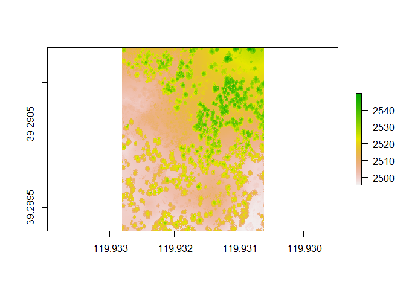
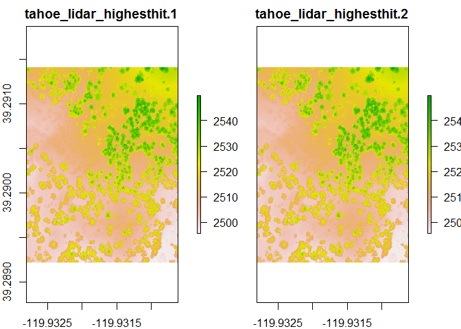
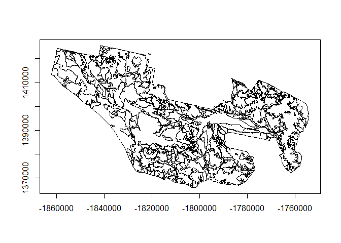

# Chapter 2 - The Spatial Data We Use
Stephen Roecker, Jay Skovlin, Dylan Beaudette, Skye Wills, Tom D'Avello  
February, 2016  
  

# Chapter 2: The Spatial Data We Use
 
## Accuracy, Precision, and Significant Figures  

**Accuracy** --- is the closeness of a number to its actual value.

**Precision** --- is the closeness of repeated measurements to each other.

**Significant figures** --- the digits in a number that define the precision of a measurement. The value of 6 cm has one significant digit. The implied range is 1 cm. The true value lies between 5.50 and 6.49. The value of 6.2 cm has two significant digits. The implied range is 0.1 cm. The true value lies between 6.150 and 6.249. The implied precision is greater for the number 6.0 cm than 6 cm. See page 37 of the [Keys to Soil Taxonomy](http://www.nrcs.usda.gov/wps/portal/nrcs/detail/soils/survey/class/taxonomy/?cid=nrcs142p2_053580) for a discussion of how significant figures are applied in Soil Taxonomy. 


## Raster Data

Raster are a common GIS format primarily designed for displaying continuous data. They are similar to matrices in R, although they contain additional information such as their spatial projection and resolution. To import raster data, R uses the Geospatial Data Abstraction Library (GDAL), similarly to many other GIS, including ArcGIS. GDAL supports a wide variety of raster formats. Popular formats include GeoTIFF (.tif) and Erdas Imagine (.img), but exclude rasters stored in ESRI's propriety file geodatabase format. To import raster data either the `readGDAL()` or `raster()` functions can used, which come from the rgdal and raster packages respectively. When working with large raster datasets the raster package is preferred because it doesn't require reading the raster files into the computer's random access memory (RAM). The raster package also contains a wider variety of functions, similar to those found in ArcGIS's Spatial Analyst extension.

### Importing raster data with `raster` package


```r
# Example importing raster data

library(sp)
library(rgdal)
library(raster)
library(gdalUtils)

f <- system.file("external/tahoe_lidar_highesthit.tif", package="gdalUtils") # pointer to example raster file

# import raster data using the raster package
r <- raster(f)

str(r, max.level = 2)
```

```
## Formal class 'RasterLayer' [package "raster"] with 12 slots
##   ..@ file    :Formal class '.RasterFile' [package "raster"] with 13 slots
##   ..@ data    :Formal class '.SingleLayerData' [package "raster"] with 13 slots
##   ..@ legend  :Formal class '.RasterLegend' [package "raster"] with 5 slots
##   ..@ title   : chr(0) 
##   ..@ extent  :Formal class 'Extent' [package "raster"] with 4 slots
##   ..@ rotated : logi FALSE
##   ..@ rotation:Formal class '.Rotation' [package "raster"] with 2 slots
##   ..@ ncols   : int 400
##   ..@ nrows   : int 400
##   ..@ crs     :Formal class 'CRS' [package "sp"] with 1 slot
##   ..@ history : list()
##   ..@ z       : list()
```

```r
proj4string(r) # get or set the coordinate reference system
```

```
## [1] "+proj=longlat +datum=WGS84 +no_defs +ellps=WGS84 +towgs84=0,0,0"
```

```r
bbox(r) # get bounding box
```

```
##           min        max
## s1 -119.93281 -119.93062
## s2   39.28922   39.29141
```

```r
plot(r)
```

 

### Stacking rasters

Multiple rasters can be loaded and then stacked using the `stack()` function in the `raster` package.  Notice that rasters with the same name will be have a number appended onto them to make the names unique within the raster stack.


```r
# create a raster stack of multiple rasters - in this case we are stacking the 'f' raster on top of itself
# note names in the plot of this raster stack
s <- stack(f, f) 

plot(s)
```

 

### Importing raster data with `rgdal` package


```r
## import raster data using the rgdal package
r2 <- readGDAL(f)

str(r2, max.level = 2)

## sp package plotting method based on lattice package
spplot(r2) 
```

### Exporting raster data


```r
# raster package
# for large datasets the progress option is helpful
writeRaster(r, filename = "C:/workspace/test.tif", format = "GTiff", progress = "text", overwrite = TRUE) 
```

```
## 
  |                                                                       
  |                                                                 |   0%
```

```r
# rgdal package: example syntax for exporting a raster
# writeGDAL(r2, fname = "C:/workspace/test.tif", drivername = "GTiff")
```

## Vector Data

Vectors are a common GIS format designed for displaying points, lines, and polygons. To import vector files R uses the rgdal package, which is a wrapper for GDAL. During the import process R converts all vector files to its own format, which is a complicated series of lists. This makes R impractical for handling large vector datasets. However, R can call other GIS and spatial databases, such as SAGA, GRASS, and PostGIS.

### Importing vector data


```r
# load libraries
library(sp)
library(rgdal)

pol <- readOGR(dsn = "C:/workspace/ca794.shp", layer = "ca794")
```

```
## OGR data source with driver: ESRI Shapefile 
## Source: "C:/workspace/ca794.shp", layer: "ca794"
## with 719 features
## It has 5 fields
```

```r
str(pol, max.level  = 2)
```

```
## Formal class 'SpatialPolygonsDataFrame' [package "sp"] with 5 slots
##   ..@ data       :'data.frame':	719 obs. of  5 variables:
##   ..@ polygons   :List of 719
##   .. .. [list output truncated]
##   ..@ plotOrder  : int [1:719] 419 448 95 185 89 451 9 447 334 253 ...
##   ..@ bbox       : num [1:2, 1:2] -1862018 1365854 -1754262 1425526
##   .. ..- attr(*, "dimnames")=List of 2
##   ..@ proj4string:Formal class 'CRS' [package "sp"] with 1 slot
```

```r
proj4string(pol)
```

```
## [1] "+proj=aea +lat_1=29.5 +lat_2=45.5 +lat_0=23 +lon_0=-96 +x_0=0 +y_0=0 +datum=NAD83 +units=m +no_defs +ellps=GRS80 +towgs84=0,0,0"
```

```r
bbox(pol)
```

```
##        min      max
## x -1862018 -1754262
## y  1365854  1425526
```

```r
plot(pol, axes = TRUE)
```

 
### Accessing vector tabular data

Tabular data associated with a vector layer can be accessed via the `@data` slot within the `SpatialPolygonsDataFrame` object.  We can you the `head()` function to take a look at the columns present in the data.


```r
# access tabular data table for vector data using '@data' slot
head(pol)
```

```
##   AREASYMBOL SPATIALVER MUSYM   MUKEY  mukey2
## 0      CA794          2  2076  470122  470122
## 1      CA794          2  2100 2484376 2484376
## 2      CA794          2  2100 2484376 2484376
## 3      CA794          2  4275 2505204 2505204
## 4      CA794          2  1220  470112  470112
## 5      CA794          2  2835 2450615 2450615
```

### Exporting vector data

```r
# export vector data
writeOGR(pol, dsn = "C:/workspace/test.shp", layer = "test", driver = "ESRI Shapefile", overwrite_layer = TRUE)
```

## Extracting Spatial Data

In soil survey we're typically interested in the values for spatial data that overlap point locations or polygons. This gives us information on the geomorphic setting of our soil observations. With this information we would like to predict the spatial distribution of soil properties or classes at unobserved sites (e.g. raster cells). The procedure for extracting spatial data at point locations is a simple process of intersecting the point coordinates with the spatial data and recording their values. This can be accomplished with almost any GIS program, including R.

Before extracting spatial data for the purpose of spatial prediction, it is necessary that the data meet the following conditions:  

 - All data conforms to a common projection and datum
 - All raster data have a common cell resolution
 - All raster data are co-registered, that is, the geographic coordinates of cell centers are the same for all layers. Setting the _Snap Raster_ in the ArcGIS Processing Environment prior to the creation of raster derivatives can ensure cell alignment. An ERDAS model is also available to perform this task.  


### R tools for extracting spatial data

To extract point data using R, you can use either the `sp` or `raster` packages. For large raster data sets it is best to use the `extract()` function from the raster package.

The following example takes pedon data locations from the CA794 soil survey, filters out pedons missing coordinates, and creates a `SpatialPointsDataFrame` object.  Rasters of 30m elevation, and slope are then imported, stacked, and the `extract()` is used to intersect the raster values at the pedon point locations.


```r
# load libraries
library(soilDB)
library(raster)

# fetch pedon data
p <- fetchNASIS()

# extract site level data
s <- site(p)

# create an index to filter out pedons that are missing coordinates in WGS84
idx <- complete.cases(s[c("x", "y")]) 
# subset pedon using idx
p2 <- p[idx] 

# set the coordinates to the pedon object
coordinates(p2) <- ~ x + y 
# set the projection of the pedon object
proj4string(p2) <- CRS("+init=epsg:4326")
# extract a SpatialPointsDataFrame 
p_sp <- as(p2, "SpatialPointsDataFrame") 
# 
# set working directory for output
setwd("M:/geodata/project_data/8VIC/")

# create a raster stack
rs <- stack(c(elev = "ned30m_8VIC.tif", slope = "ned30m_8VIC_slope5.tif"))
# assign projection to the raster stack
proj4string(rs) <- CRS("+init=epsg:5070")

# extract data from the stack 
test <- data.frame(p_sp$site_id, extract(rs, p_sp)) 

# save output data table as .Rdata file
 save(p, p_sp, test, file = "C:/workspace/ca794_pedons.Rdata")
```


```r
load(file = "C:/workspace/ca794_pedons.Rdata")

summary(test)
```

```
##      p_sp.site_id       elev             slope        
##  1249515815:   3   Min.   :  18.74   Min.   : 0.2441  
##  1249704903:   3   1st Qu.: 560.21   1st Qu.: 3.7603  
##  1249704905:   3   Median : 766.46   Median : 6.7417  
##  1249713101:   3   Mean   : 850.83   Mean   :15.1356  
##  1249713104:   3   3rd Qu.:1187.82   3rd Qu.:26.1443  
##  1249713106:   3   Max.   :1816.41   Max.   :70.0182  
##  (Other)   :1001   NA's   :11        NA's   :11
```

#### Exercise 1: extracting spatial data

- Using your own point data, extract the raster values for several pedons
- Submit the results to your coach.


### ArcGIS Tools for extracting spatial data

### Extracting point data from a raster

This section discusses the use of the *Extract Multi Values to Points* tool, which assigns the cell value of specified raster data sets to existing points. *Extract Values to Points* and *Sample* tools will achieve similar results. These tools are described in the ESRI help section:  

[An_overview_of_the_Extraction_tools](http://help.arcgis.com/en/arcgisdesktop/10.0/help/index.html#/An_overview_of_the_Extraction_tools/009z00000028000000/)  

To start, assume you have 50 observations across your area of interest contained in a point file in ArcGIS with numerous observed soil properties. You would also like to consider variables like slope, profile curvature, solar insolation, topographic wetness index, relative position, and elevation in your analysis.
 
Using the **Extract Multi Values to Points** tool is the most expedient way to populate raster values to a point file. _If your spatial extent is large and you have many raster layers, e.g. 12, it may be best to proceed using 3 or 4 rasters at a time and running the tool 3 or 4 times_.  

The Extract Multi Values to Points tool is found in the Extraction Tool Box in Spatial Analyst Tools.  

  

Select your point file and the associated raster files of interest as noted in the example graphic.  

  

The resulting point file will have the corresponding cell values for slope, profile curvature and wetness index attached to the point file as columns in the shapefile table:  

  

The resulting point file may also be saved as a text file for use in R.


## References  

Stevens, S. S. (1946). On the theory of measurement scales. Science, 103(2684). [http://www.sciencemag.org/content/103/2684/677.full.pdf](http://www.sciencemag.org/content/103/2684/677.full.pdf) 

Velleman, P.F., and L. Wilkinson, 1993. Nominal, Ordinal, Interval, and Ratio Typologies are Misleading. The American Statistician 47(1)65:72. [https://www.cs.uic.edu/~wilkinson/Publications/stevens.pdf](https://www.cs.uic.edu/~wilkinson/Publications/stevens.pdf)

"Level of measurement" Wikipedia: The Free Encyclopedia. Wikimedia Foundation, Inc. 7 Feb. 2016. Web. 10 Feb. 2016. [https://en.wikipedia.org/wiki/Level_of_measurement](https://en.wikipedia.org/wiki/Level_of_measurement)


## Additional Reading

Brenning, A., and D. Bangs, 2015. Introduction to Terrain Analysis with RSAGA: Landslide Susceptibility Modeling. [https://cran.r-project.org/web/packages/RSAGA/vignettes/RSAGA-landslides.pdf](https://cran.r-project.org/web/packages/RSAGA/vignettes/RSAGA-landslides.pdf)

Hijmans, R.J., 2015. Introduction to the 'raster' package. [https://cran.r-project.org/web/packages/raster/vignettes/Raster.pdf](https://cran.r-project.org/web/packages/raster/vignettes/Raster.pdf)

Pebesma, E., and R.S. Bivand, 2005. Classes and Methods for Spatial Data: the sp Package. [https://cran.r-project.org/web/packages/sp/vignettes/intro_sp.pdf](https://cran.r-project.org/web/packages/sp/vignettes/intro_sp.pdf)

Venables, W. N., D. M. Smith and the R Core Team, 2015. Introduction to R, Notes on R: A Programming Environment for Data Analysis and Graphics Version. (3.2.3, 2015-12-10) [https://cran.r-project.org/doc/manuals/r-release/R-intro.pdf](https://cran.r-project.org/doc/manuals/r-release/R-intro.pdf)

Wickham, H., 2014. Advanced R. CRC Press, New York. [http://adv-r.had.co.nz/](http://adv-r.had.co.nz/)
