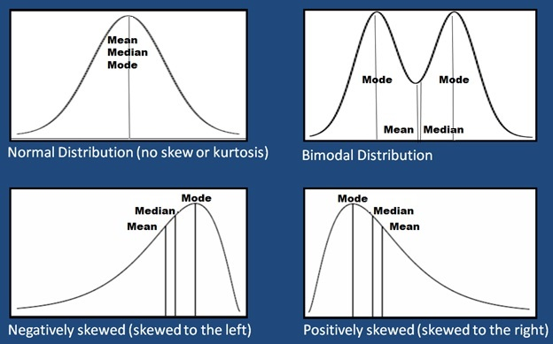
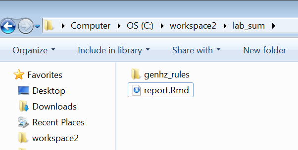
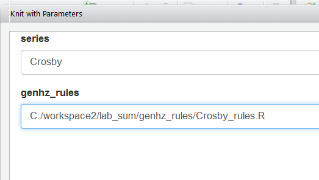

```{r setup, echo=FALSE, warning=FALSE, message=FALSE}
# setup
knitr::opts_chunk$set(message=FALSE, warning=FALSE, background='#F7F7F7', fig.align='center', fig.retina=2, dev='png', tidy=FALSE, verbose=FALSE, antialias='cleartype', cache=FALSE)
```

  


# Objectives

* Review methods for estimating Low, RV, and High values
* Review different methods for visualing soil data
* Review data transformations
* Introduce the soilReports package


#  Introduction

Before embarking on developing statistical models and generating predictions, it is essential to understand your data. This is typically done using conventional numerical and graphical methods. John Tukey (Tukey, 1977) advocated the practice of exploratory data analysis (EDA) as a critical part of the scientific process.  

*"No catalog of techniques can convey a willingness to look for what can be seen, whether or not anticipated. Yet this is at the heart of exploratory data analysis. The graph paper and transparencies are there, not as a technique, but rather as a recognition that the picture examining eye is the best finder we have of the wholly unanticipated."*

Fortunately, we can dispense with the graph paper and transparencies and use software that makes routine work of developing the 'pictures' (i.e., graphical output) and descriptive statistics needed to explore our data.  

Descriptive statistics include:  

 - **Mean** - arithmetic average  
 - **Median** - middle value  
 - **Mode** - most frequent value  
 - **Standard Deviation** - variation around the mean  
 - **Interquartile Range** - range encompasses 50% of the values  
 - **Kurtosis** - peakedness of the data distribution  
 - **Skewness** - symmetry of the data distribution  

Graphical methods include:  

 - **Histogram** - a bar plot where each bar represents the frequency of observations for a given range of values
 - **Density estimation** - an estimation of the frequency distribution based on the sample data
 - **Quantile-quantile plot** - a plot of the actual data values against a normal distribution
 - **Box plots** - a visual representation of median, quartiles, symmetry, skewness, and outliers
 - **Scatter plots** - a graphical display of one variable plotted on the x axis and another on the y axis
 - **Radial plots** - plots formatted for the representation of circular data 


#  Data Inspection

Before you start an EDA, you should inspect your data and correct all typos and blatent errors. EDA can then be used to identify additional errors such as outliers and help you determine appropriate statistical analyses. For this chapter we'll use the loafercreek dataset from the CA630 Soil Survey Area.

```{r, warning=FALSE, message=FALSE}
library(soilDB)

# Load from the the loakercreek dataset
data("loafercreek") 

# Construct generalized horizon designations
n <- c("A",
       "BAt",
       "Bt1",
       "Bt2",
       "Cr",
       "R")
# REGEX rules
p <- c("A",
       "BA|AB",
       "Bt|Bw",
       "Bt3|Bt4|2B|C",
       "Cr",
       "R")

# Compute genhz labels and add to loafercreek dataset
loafercreek$genhz <- generalize.hz(loafercreek$hzname, n, p)

# Extract the horizon table
h <- horizons(loafercreek) 

# Examine the matching of pairing of the genhz label to the hznames
table(h$genhz, h$hzname)
```

As noted in Chapter 1, a visual examination of the raw data is possible by clicking on the dataset in the environment tab, or via commandline:  

```{r, eval=FALSE}

View(h) 

```
 
This view is fine for a small dataset, but can be cumbersome for larger ones. The `summary()` function can be used to quickly summarize a dataset however, even for our small example dataset, the output can be voluminous. Therefore in the interest of saving space we'll only look at a sample of columns.  

```{r}

vars <- c("genhz", "clay", "total_frags_pct", "phfield", "effclass")
summary(h[vars])

```

The `summary()` function is known as a generic R function. It will return a preprogrammed summary for any R object. Because `h` is a data frame, we get a summary of each column. Factors will be summarized by their frequency (i.e., number of observations), while numeric or integer variables will print out a five number summary, and characters simply print their length. The number of missing observations for any variable will also be printed if they are present. If any of these metrics look unfamiliar to you, don't worry we'll cover them shortly.

When you do have missing data and the function you want to run will not run with missing values, the following options are available:  

 1. **Exclude** all rows or columns that contain missing values using the function `na.exclude()`, such as `h2 <- na.exclude(h)`. However this can be wasteful because it removes all rows (e.g., horizons), regardless if the row only has 1 missing value. Instead it's sometimes best to create a temporary copy of the variable in question and then remove the missing variables, such as `clay <- na.exclude(h$clay)`.
 2.	**Replace** missing values with another value, such as zero, a global constant, or the mean or median value for that column, such as `h$clay <- ifelse(is.na(h$clay), 0, h$clay) # or h[is.na(h$clay), ] <- 0`.
 3. **Read** the help file for the function you're attempting to use. Many functions have additional arguments for dealing with missing values, such as `na.rm`.

A quick check for typos would be to examine the list of levels for a factor or character, such as:  

```{r}
# just for factors
levels(h$genhz)

# for characters and factors
sort(unique(h$hzname)) 
```

If the `unique()` function returned typos such as "BT" or "B t", you could either fix your original dataset or you could make an adjustment in R, such as:

```{r, eval=FALSE}
h$hzname <- ifelse(h$hzname == "BT", "Bt", h$hzname)

# or

h$hzname[h$hzname == "BT"] <- "Bt"

# or as a last resort we could manually edit the spreadsheet in R

edit(h)
```

Typo errors such as these are a common problem with old pedon data in NASIS.

##  Exercise: fetch and inspect

- Load the gopheridge dataset found within the soilDB package or use your own data (highly encouraged) and inspect the dataset 
- Apply the generalized horizon rules below or develop your own, see the following [job-aid](http://ncss-tech.github.io/AQP/aqp/gen-hz-assignment.html)
- Summarize the depths, genhz, texture class, sand, and fine gravel.
- Show your work and submit the results to your mentor.


```{r}
# gopheridge rules
n <- c('A', 'Bt1', 'Bt2', 'Bt3','Cr','R')
p <- c('^A|BA$', 'Bt1|Bw','Bt$|Bt2', 'Bt3|CBt$|BCt','Cr','R')
```

# Descriptive Statistics

```{r, echo = FALSE}
desc <- data.frame(
  Parameter = c("Mean", "Median", "Mode", "Standard Deviation", "Quantiles"),
  NASIS = c(rep("RV", 3), rep("L & H", 2)),
  Description = c("arithmetic average", 
                  "middle value, 50% quantile", 
                  "most frequent value", "variation around mean", 
                  "percent rank of values, such that all values are <= p"
                  ),
  'R function' = c("mean()", "median()", "sort(table(), decreasing = TRUE)[1]", "sd()", "quantile()"),
  check.names = FALSE
  )
knitr::kable(desc, caption = "Short Description of Descriptive Statistics and R Functions")
```

## Measures of Central Tendency  

These measures are used to determine the mid-point of the range of observed values. In NASIS speak this should ideally be equivalent to the representative value (RV) for numeric and integer data. The mean and median are the most commonly used measures for our purposes.

**Mean** - is the arithmetic average all are familiar with, formally expressed as: $\bar{x} =\frac{\sum_{i=1}^{n}x_i}{n}$ which sums ( $\sum$ ) all the X values in the sample and divides by the number (n) of samples. It is assumed that all references in this document refer to samples rather than a population.  

The mean clay content from the loafercreek dataset may be determined:  

```{r}
clay <- na.exclude(h$clay) # first remove missing values and create a new vector

mean(clay)

# or use the additional na.rm argument

mean(h$clay, na.rm = TRUE)
```

**Median**  is the middle measurement of a sample set, and as such is a more robust estimate of central tendency than the mean. This is known as the middle or 50th quantile, meaning there are an equal number of samples with values less than and greater than the median. For example, assuming there are 21 samples, sorted in ascending order, the median would be the 11th sample.

The median from the sample dataset may be determined:  

```{r}
median(clay)
```

**Mode** - is the most frequent measurement in the sample. The use of mode is typically reserved for factors, which we will discuss shortly. One issue with using the mode for numeric data is that the data need to be rounded to the level of desired precision. R does not include a function for calculating the mode, but we can calculate it using the following example.

```{r}
sort(table(round(h$clay)), decreasing = TRUE)[1] # sort and select the 1st value, which will be the mode
```


**Frequencies**

To summarize factors and characters we can examine their frequency or number of observations. This is accomplished using the `table()` or `xtabs()` functions.

```{r}
table(h$genhz)

# or

# summary(h$genhz)
```

This gives us a count of the number of observations for each horizon. If we want to see the comparison between two different factors or characters, we can include two variables.

```{r}
table(h$genhz, h$texcl)
```

We can also easily add margin totals to the table or convert the table frequencies to proportions.

```{r}
# append the table with row and column sums

addmargins(table(h$genhz, h$texcl))

# calculate the proportions relative to the rows, margin = 1 calculates for rows, margin = 2 calculates for columns, margin = NULL calculates for total observations

round(prop.table(table(h$genhz, h$texture_class), margin = 1) * 100) 
```

To determine the mean by a group or category, use the aggregate command:

```{r}
aggregate(clay ~ genhz, data = h, mean)
```

To determine the median by group or category, use the aggregate command again:  

```{r}
aggregate(clay ~ genhz, data = h, median)

# or we could use the summary() function to get both the mean and median

aggregate(clay ~ genhz, data = h, summary)
```


## Measures of Dispersion  

These are measures used to determine the spread of values around the mid-point. This is useful to determine if the samples are spread widely across the range of observations or concentrated near the mid-point. In NASIS speak these values might equate to the low (L) and high (H) values for numeric and integer data.


**Variance**  is a positive value indicating deviation from the mean: 

$s^2 = \frac{\sum_{i=1}^{n}(x_i - \bar{x})^2} {n - 1}$ 

This is the square of the sum of the deviations from the mean, divided by the number of samples minus 1. It is commonly referred to as the sum of squares. As the deviation increases, the variance increases. Conversely, if there is no deviation, the variance will equal 0. As a squared value, variance is always positive. Variance is an important component for many statistical analyses including the most commonly referred to measure of dispersion, the *standard deviation*. Variance for the sample dataset is:  

```{r}
var(h$clay)
```

**Standard Deviation**  is the square root of the variance: 

$s = \sqrt\frac{\sum_{i=1}^{n}(x_i - \bar{x})^2} {n - 1}$ 

The units of the standard deviation are the same as the units measured. From the formula you can see that the standard deviation is simply the square root of the variance. Standard deviation for the sample dataset is:  

```{r}
sd(clay)

# or

# sqrt(var(clay))
```

**Coefficient of Variation** (CV)  is a relative (i.e., unitless) measure of standard deviation:

$CV = \frac{s}{\bar{x}} \times 100$

CV is calculated by dividing the standard deviation by the mean and multiplying by 100. Since standard deviation varies in magnitude with the value of the mean, the CV is useful for comparing relative variation amongst different datasets. However Webster (2001) discourages using CV to compare different variables. Webster (2001) also stresses that CV is reserved for variables that have an absolute 0, like clay content. CV may be calculated for the sample dataset as:  

```{r}
cv <- sd(clay) / mean(clay) * 100
cv
```


**Quantiles (a.k.a. Percentiles)** - the percentile is the value that cuts off the first nth percent of the data values when sorted in ascending order.

The default for the `quantile()` function returns the  min, 25th percentile, median or 50th percentile, 75th percentile, and max, known as the five number summary originally proposed by Tukey. Other probabilities however can be used. At present the 5th, 50th, and 95th are being proposed for determining the range in characteristics (RIC) for a given soil property.

```{r}
quantile(clay)

# or

quantile(clay, c(0.05, 0.5, 0.95))
```

Thus, for the five number summary 25% of the observations fall between each of the intervals. Quantiles are a useful metric because they are largely unaffected by the distribution of the data, and have a simple interpretation.


**Range**  is the difference between the highest and lowest measurement of a group. Using the sample data it may be determined as:  

```{r}
range(clay)
```

which returns the minimum and maximum values observed, or:  

```{r}
diff(range(clay))

# or

# max(clay) - min(clay)
```

which returns the value of the range  


**Interquartile Range** (IQR)  is the range from the upper (75%) quartile to the lower (25%) quartile. This represents 50% of the observations occurring in the mid-range of a sample. IQR is a robust measure of dispersion, unaffected by the distribution of data. In soil survey lingo you could consider the IQR to estimate the central concept of a soil property. IQR may be calculated for the sample dataset as:  

```{r}
IQR(clay)

# or

# diff(quantile(clay, c(0.25, 0.75)))
```

## Correlation

A correlation matrix is a table of the calculated correlation coefficients of all variables. This provides a quantitative measure to guide the decision making process. The following will produce a correlation matrix for the sp4 dataset:  

```{r}
h$hzdepm <- (h$hzdepb + h$hzdept) / 2 # Compute the middle horizon depth

vars <- c("hzdepm", "clay", "sand", "total_frags_pct", "phfield")

round(cor(h[vars], use = "complete.obs"), 2)
```

As seen in the output, variables are perfectly correlated with themselves and have a correlation coefficient of 1.0. Negative values indicate a negative relationship between variables. What is considered highly correlated? A good rule of thumb is anything with a value of **0.7** or greater is considered highly correlated. 


# Graphical Methods

Now that we've checked for missing values and typos and made corrections, we can graphically examine the sample data distribution of our data. Frequency distributions are useful because they can help us visualize the center (e.g., RV) and spread or dispersion (e.g., low and high) of our data. Typically in introductory statistics the normal (i.e., Gaussian) distribution is emphasized.

```{r graphical descriptions, echo = FALSE}
figs <- data.frame(
  'Plot Types' = c("Bar", "Histogram", "Density", "Quantile-Quantile", "Box-Whisker", "Scatter & Line"),
   Description = c("a plot where each bar represents the frequency of observations for a 'group'",
                   "a plot where each bar represents the frequency of observations for a 'given range of values'",
                  "an estimation of the frequency distribution based on the sample data",
                  "a plot of the actual data values against a normal distribution",
                  "a visual representation of median, quartiles, symmetry, skewness, and outliers",
                   "a graphical display of one variable plotted on the x axis and another on the y axis"
                  ),
  check.names = FALSE
  )

knitr::kable(figs, caption = "Short Description of Graphical Methods")
```

```{r graphical functions, echo = FALSE}
figs <- data.frame(
  'Plot Types' = c("Bar", "Histogram", "Density", "Quantile-Quantile", "Box-Whisker", "Scatter & Line"),
  # Description = c("a bar plot where each bar represents the frequency of observations for a given range of values",
  #                "an estimation of the frequency distribution based on the sample data",
  #                "a plot of the actual data values against a normal distribution",
  #                "a visual representation of median, quartiles, symmetry, skewness, and outliers",
  #                 "a graphical display of one variable plotted on the x axis and another on the y axis",
  #                "plots formatted for the representation of circular data"
  #                ),
  'Base R' = c("barplot()", "hist()", "plot(density())", "qqnorm()", "boxplot()", "plot()"),
  'lattice' = c("barchart()", "histogram()", "densityplot()", "qq()", "bwplot()", "xyplot"),
  'ggplot geoms' = c("geom_bar()", "geom_histogram()", "geom_density()", "geom_qq()", "geom_boxplot()", "geom_point()"),
  check.names = FALSE
  )

knitr::kable(figs, caption = "Comparison of R's 3 Graphing Systems and their Equivalent Functions for Plotting")
```


## Distributions

```{r distribution comparison, echo=FALSE, fig.dim = c(8, 4)}
data(metadata)

# Generalized the horizon designations
n <- c("A",
       "BAt",
       "Bt1",
       "Bt2",
       "Cr",
       "R")
# REGEX rules
p <- c("A",
       "BA|AB",
       "Bt|Bw",
       "Bt3|Bt4|2B|C",
       "Cr",
       "R")

loafercreek$genhz <- generalize.hz(loafercreek$hzname, n, p)

h <- horizons(loafercreek)
data("metadata")
h <- within(h, {
  hzdepm = (hzdepb + hzdept) / 2
  texture_class = factor(texture_class, 
                         levels = metadata[metadata$ColumnPhysicalName == "texcl", "ChoiceName"]
                         )
  })

idx <- is.na(h$texture_class)

library(ggplot2)

# bar plot
p_b <- ggplot(h[!idx, ], aes(x = texture_class)) +
  geom_bar() +
  ylab("count (n)") + xlab("texture class") +
  theme(aspect.ratio = 1) +
  ggtitle("Bar Plot")

# histogram
p <- ggplot(data = h, aes(x = clay))

p_h <- p + 
  geom_histogram(bins = nclass.Sturges(h$clay)) + 
  xlab("clay (%)") + ylab("count (n)") +
  theme(aspect.ratio = 1) +
  ggtitle("Histogram")

# density plot
p_d <- p + 
  geom_density(fill = "grey", alpha = 0.5) + 
  xlab("clay (%)") + ylab("density (p)") +
  theme(aspect.ratio = 1) +
  ggtitle("Density Plot")

gridExtra::grid.arrange(p_b, p_h, p_d, ncol = 3)

```


## Bar Plot

A bar plot is a graphical display of the frequency (i.e. number of observations (count or n)), such as soil texture, that fall within a given class. It is a graphical alternative to to the `table()` function.

```{r barplot}
library(ggplot2)

# bar plot
ggplot(h, aes(x = texcl)) +
  geom_bar()
```


## Histogram

A histogram is similar to a bar plot, except that instead of summarizing categorical data, it categorizes a continuous variable like clay content into non-overlappying intervals for the sake of display. The number of intervals can be specified by the user, or can be automatically determined using an algorithm, such as `nclass.Sturges()`. Since histograms are dependent on the number of bins, for small datasets they're not the best method of determining the shape of a distribution. 

```{r histogram}

ggplot(h, aes(x = clay)) +
  geom_histogram(bins = nclass.Sturges(h$clay))

```


## Density Curve

A density estimation, also known as a Kernel density plot, generally provides a better visualization of the shape of the distribution in comparison to the histogram. Compared to the histogram where the y-axis represents the number or percent (i.e., frequency) of observations, the y-axis for the density plot represents the probability of observing any given value, such that the area under the curve equals one. One curious feature of the density curve is the hint of a two peaks (i.e. bimodal distribution?). Given that our sample includes a mixture of surface and subsurface horizons, we may have two different populations. However considering how much the two distributions overlap, it seems impractical to separate them in this instance.

```{r densityplot}

ggplot(h, aes(x = clay)) +
  geom_density()

```


## Box plots  

Box plots are a graphical representation of the five number summary, depicting quartiles (i.e. the 25%, 50%, and 75% quantiles), minimum, maximum and outliers (if present). Boxplots convey the shape of the data distribution, the presence of extreme values, and the ability to compare with other variables using the same scale, providing an excellent tool for screening data, determining thresholds for variables and developing working hypotheses.  

The parts of the boxplot are shown in the figure below. The "box" of the boxplot is defined as the 1st quartile, (Q1 in the figure) and the 3rd quartile, (Q3 in the figure). The median, or 2nd quartile, is the dark line in the box. The whiskers (typically) show data that is 1.5 * IQR above and below the 3rd and 1st quartile. Any data point that is beyond a whisker is considered an outlier.  

That is not to say the outlier points are in error, just that they are extreme compared to the rest of the dataset. However, you may want to evaluate these points to ensure that they are correct.  


```{r boxplots}

ggplot(h, (aes(x = genhz, y = clay))) +
  geom_boxplot()

```

The above box plot shows a steady increase in clay content with depth. Notice the outliers in the box plots, identified by the individual circles.


## Quantile comparison plots (QQplot)  

A QQ plot is a plot of the actual data values against a normal distribution (which has a mean of 0 and standard deviation of 1).  

```{r}

# QQ Plot for Clay
ggplot(h, aes(sample = clay)) + 
  geom_qq() +
  geom_qq_line()

# QQ Plot for Frags
ggplot(h, aes(sample = total_frags_pct)) + 
  geom_qq() +
  geom_qq_line()

```

If the data set is perfectly symmetric (i.e. normal), the data points will form a straight line. Overall this plot shows that our clay example is more or less symmetric. However the second plot shows that our rock fragments are far from evenly distributed.

A more detailed explanation of QQ plots may be found on Wikipedia:  
[https://en.wikipedia.org/wiki/QQ_plot](https://en.wikipedia.org/wiki/Q%E2%80%93Q_plot)  


## The 'Normal' distribution

What is a normal distribution and why should you care? Many statistical methods are based on the properties of a normal distribution. Applying certain methods to data that are not normally distributed can give misleading or incorrect results. Most methods that assume normality are robust enough for all data except the very abnormal. This section is not meant to be a recipe for decision making, but more an extension of tools available to help you examine your data and proceed accordingly. The impact of normality is most commonly seen for parameters used by pedologists for documenting the ranges of a variable (i.e., Low, RV and High values). Often a rule-of thumb similar to: "two standard deviations" is used to define the low and high values of a variable. This is fine if the data are normally distributed. However, if the data are skewed, using the standard deviation as a parameter does not provide useful information of the data distribution. The quantitative measures of Kurtosis (peakedness) and Skewness (symmetry) can be used to assist in accessing normality and can be found in the [fBasics](https://cran.r-project.org/web/packages/psych/index.html) package, but [Webster (2001)](http://onlinelibrary.wiley.com/doi/10.1046/j.1365-2389.2001.00383.x/abstract) cautions against using significance tests for assessing normality. The preceding sections and chapters will demonstrate various methods to cope with alternative distributions.

A Gaussian distribution is often referred to as "Bell Curve", and has the following properties (Lane):  

 1. Gaussian distributions are **symmetric** around their mean 
 2.	The mean, median, and mode of a Gaussian distribution are **equal** 
 3.	The area under the curve is equal to **1.0** 
 4.	Gaussian distributions are **denser** in the center and less dense in the tails 
 5.	Gaussian distributions are **defined** by two parameters, the mean and the standard deviation
 6.	**68%** of the area under the curve is within one standard deviation of the mean
 7. Approximately **95%** of the area of a Gaussian distribution is within two standard deviations of the mean

```{r, echo=FALSE, fig.align="center"}

library(ggplot2)

dnorm_limit_1 <- function(x) {
  y <- dnorm(x)
  y[-1 > x | x > 1] <- NA
  return(y)
  }
dnorm_limit_2 <- function(x) {
  y <- dnorm(x)
  y[-2 > x | x > 2] <- NA
  return(y)
  }

df <-data.frame(x = c(-3, 3))

ggplot(df, aes(x = x)) + 
  stat_function(fun=dnorm) +
  stat_function(fun=dnorm_limit_1, geom="area", fill="blue", alpha=0.2) +
  stat_function(fun=dnorm_limit_2, geom="area", fill="orange", alpha=0.2) +
  annotate("text", x = 0, y = 0.2, label = "1 sd = 68%") +
  annotate("text", x = -1.5, y = 0.03, label = "2 sd = 95%")

```

Viewing a histogram or density plot of your data provides a quick visual reference for determining normality. Distributions are typically normal, Bimodal or Skewed:  




Occasionally distributions are Uniform, or nearly so:

```{r, echo = FALSE, warning=FALSE}

r <- data.frame(y = dunif(seq(-1, 2, 0.1)), x = 1:31)

ggplot(r, aes(x = x, y = y)) +
  geom_line() +
  geom_polygon(fill = "grey", alpha = 0.5) +
  ggtitle("Uniform Distribution: Minimum = 0, Maximum = 1")

```

With the loafercreek dataset the mean and median for clay were only slightly different, so we can safely assume that we have a normal distribution. However many soil variables often have a non-normal distribution. For example, let's look at graphical examination of the mean vs. median for clay and rock fragments:  

```{r clay vs frags, echo=FALSE, fig.dim = c(8, 4)}

p   <- c(0.025, 0.25, 0.5, 0.75, 0.975)

avg <- mean(h$clay, na.rm = TRUE)
std <- sd(h$clay,   na.rm = TRUE)

clay <- rbind(
  data.frame(
    value = c(avg - 2 * std, avg, avg + 2 * std),
    variable = "mean & sd",
    stringsAsFactors = TRUE
    ),
  data.frame(
    value    = quantile(h$clay, p, na.rm = TRUE),
    variable = "median & pct",
    stringsAsFactors = TRUE
    )
  )

avg <- mean(h$total_frags_pct, na.rm = TRUE)
std <- sd(h$total_frags_pct,   na.rm = TRUE)

frags <- rbind(
  data.frame(
    variable = "mean & sd",
    value = c(avg - 2 * std, avg, avg + 2 * std),
    stringsAsFactors = TRUE
    ),
  data.frame(
    variable = "median & pct", 
    value    = quantile(h$total_frags_pct, p, na.rm = TRUE),
    stringsAsFactors = TRUE
    )
  )

p1 <- ggplot(h, aes(x = clay)) +
  geom_density(fill = "grey", alpha = 0.5) +
  geom_vline(data = clay, aes(xintercept = value, lty = variable)) +
  xlab("clay (%)") +
  #xlim(-5, max(h$total_frags_pct)) +
  theme(aspect.ratio = 1) +
  ggtitle("Clay")

p2 <- ggplot(h, aes(x = total_frags_pct)) +
  geom_density(fill = "grey", alpha = 0.5) +
  geom_vline(data = frags, aes(xintercept = value, lty = variable)) +
  xlab("rock fragments (%)") +
  #xlim(-5, max(h$total_frags_pct)) +
  theme(aspect.ratio = 1) +
  ggtitle("Rock Fragments")

gridExtra::grid.arrange(p1, p2, ncol = 2)

```

The solid lines represent the breakpoint for the mean and standard deviations. The dashed lines represents the median and quantiles. The median is a more robust measure of central tendency compared to the mean. In order for the mean to be a useful measure, the data distribution must be approximately normal. The further the data departs from normality, the less meaningful the mean becomes. The median always represents the same thing independent of the data distribution, namely, 50% of the samples are below and 50% are above the median. The example for clay again indicates that distribution is approximately normal. However for rock fragments, we see a long tailed distribution (e.g., skewed). Using the mean in this instance would overestimate the rock fragments. Although in this instance the difference between the mean and median is only `r round(mean(h$fragvoltot, na.rm = TRUE) - median(h$fragvoltot, na.rm = TRUE))` percent.


## Scatterplots and Line Plots

```{r, echo=FALSE, fig.dim = c(8, 4)}

# scatter plot
p_s <- ggplot(h, aes(x = clay, y = hzdepm)) +
  geom_point() +
  ylim(100, 0) +
  ylab("depth (cm)") + xlab("clay (%)") +
  theme(aspect.ratio = 1) +
  ggtitle("Scatter Plot")

# line graph

# h2 <- slice(loafercreek, 0:100 ~ clay)@horizons

p_l <- ggplot(h) +
  # geom_line(aes(y = clay, x = hzdept, group = peiid)) +
  geom_step(aes(y = clay, x = hzdept, group = peiid), direction = "vh", alpha = 0.5) +
  geom_smooth(aes(y = clay, x = (hzdept + hzdepb) / 2), se = FALSE) +
  xlim(100, 0) +
  xlab("depth (cm)") + ylab("clay (%)") +
  coord_flip() +
  theme(aspect.ratio = 1) +
  ggtitle("Line Plot")

gridExtra::grid.arrange(p_s, p_l, ncol = 2)

```

Plotting points of one ratio or interval variable against another is a scatter plot. Plots can be produced for a single or multiple pairs of variables. Many independent variables are often under consideration in soil survey work. This is especially common when GIS is used, which offers the potential to correlate soil attributes with a large variety of raster datasets.  

The purpose of a scatterplot is to see how one variable relates to another. With modeling in general the goal is parsimony (i.e., simple). The goal is to determine the fewest number of variables required to explain or describe a relationship. If two variables explain the same thing, i.e., they are highly correlated, only one variable is needed. The scatterplot provides a perfect visual reference for this.

Create a basic scatter plot using the loafercreek dataset.

```{r}
# scatter plot
ggplot(h, aes(x = clay, y = hzdepm)) +
  geom_point() +
  ylim(100, 0)

# line plot
ggplot(h, aes(y = clay, x = hzdepm, group = peiid)) +
  geom_line() +
  coord_flip() +
  xlim(100, 0)

```

This plots clay on the X axis and depth on the X axis. As shown in the scatterplot above, there is a moderate correlation between these variables.  

The function below produces a scatterplot matrix for all the numeric variables in the dataset. This is a good command to use for determining rough linear correlations for continuous variables.  

```{r}
# Load the GGally package
library(GGally)

# Create a scatter plot matrix
vars <- c("hzdepm", "clay", "phfield", "total_frags_pct")

ggpairs(h[vars])

```


## 3rd Dimension - Color, Shape, Size, Layers, etc...

```{r, echo=FALSE, fig.dim = c(8, 4)}
h$clay2 <- ifelse(is.na(h$clay), 0, h$clay)

ggplot(h[!idx, ], aes(y = clay, x = hzdepm, col = genhz)) +
  geom_point(size = 2) +
  geom_smooth(se = FALSE, col = "black") +
  xlim(100, 0) + ylim(min(h$clay, na.rm = TRUE), max(h$clay, na.rm = TRUE)) +
  xlab("depth (cm)") + ylab("clay (%)") +
  coord_flip() +
  theme(aspect.ratio = 1)
```


### Color and Groups

```{r color, fig.dim = c(8, 4)}

# scatter plot
ggplot(h, aes(x = clay, y = hzdepm, color = genhz)) +
  geom_point(size = 3) +
  ylim(100, 0)

# density plot
ggplot(h, aes(x = clay, color = genhz)) +
  geom_density(size = 2)

# bar plot
ggplot(h, aes(x = genhz, fill = texture_class)) +
  geom_bar()

# box plot
ggplot(h, aes(x = genhz, y = clay)) + 
  geom_boxplot()

# heat map (pseudo bar plot)
s <- site(loafercreek)

ggplot(s, aes(x = landform_string, y = pmkind)) + 
  geom_tile(alpha = 0.2) 
  
```

### Facets - box plots

```{r facets, fig.dim = c(8, 4)}

# convert to long format
df <- reshape2::melt(h, 
                     id.vars = c("peiid", "genhz", "hzdepm"), 
                     measure.vars = c("clay", "phfield", "total_frags_pct")
                     )

ggplot(df, aes(x = genhz, y = value)) +
  geom_boxplot() +
  xlab("genhz") +
  facet_wrap(~ variable, scales = "free_y")

```


### Facets - depth plots

```{r, fig.dim=c(8, 4)}

library(aqp)

s <- slice(loafercreek, 0:100 ~ clay + phfield + total_frags_pct)
s <- slab(s, fm = ~ clay + phfield + total_frags_pct, 
          slab.fun = function(x) quantile(x, c(0.1, 0.5, 0.9), na.rm = TRUE)
          )

ggplot(s, aes(x = top, y = X50.)) +
  geom_line() +
  geom_ribbon(aes(ymin = X10., ymax = X90., x = top), alpha = 0.2) +
  xlim(c(100, 0)) +
  coord_flip() +
  facet_wrap(~ variable, scales = "free_x")

```


# Transformations

Slope aspect and pH are two common variables warranting special consideration for pedologists.  

## pH

Since **pH** has a logarithmic distribution, the use of median and quantile ranges are the [preferred](http://www.fao.org/docrep/field/003/AC175E/AC175E07.htm) measures when summarizing pH. Remember, pHs of 6 and 5 correspond to hydrogen ion concentrations of 0.000001 and 0.00001 respectively.  The actual average is 5.26;  -log10((0.000001 + 0.00001) / 2). If no conversions are made for pH, the mean and sd in the summary are considered the geometric mean and sd, not the arithmetic. The wider the pH range, the greater the difference between the geometric and arithmetic mean. The difference between the correct average of 5.26 and the incorrect of 5.5 is small, but proper handling of data types is a best practice.

If you have a table with pH values and wish to calculate the arithmetic mean using R, this example will work:

```{r}
# arithmetic mean
log10(mean(1/10^-h$phfield, na.rm = TRUE)) 

# geometric mean
mean(h$phfield, na.rm = TRUE) 
```


## Circular data

**Slope aspect** - requires the use of circular statistics for summarizing numerically, or graphical interpretation using circular plots. For example, if soil map units being summarized have a uniform distribution of slope aspects ranging from 335 degrees to 25 degrees, the Zonal Statistics tool in ArcGIS would return a mean of 180.  

The most intuitive means available for evaluating and describing slope aspect are circular plots available with the circular package in R and the radial plot option in the [TEUI](http://www.fs.fed.us/eng/rsac/programs/teui/downloads.html) Toolkit. The circular package in R will also calculate circular statistics like mean, median, quartiles etc.

```{r, warning=FALSE, message=FALSE}

# Extract the site table
s <- site(loafercreek) 

library(circular)

aspect <- s$aspect_field
aspect <- circular(aspect, template="geographic", units="degrees", modulo="2pi")

summary(aspect)
```

The numeric output is fine, but a following graphic is more revealing, which shows the dominant Southwest slope aspect.  

```{r}
rose.diag(aspect, bins = 8, col="grey")
```


# Soil Reports

One of the strengths of NASIS is that it that has a wealth of existing queries and reports. This makes it easy for the average user to load their data and run numerous reports. In R the soilDB similarly has many fetch functions to load data. Recently the soilReports package was developed to replicate NASIS's report repository. Currently soilReports contains a small collection of reports designed to summarize field and laboratory pedons, and map unit polygons. This collection of reports automates many of methods reviewed thus far, but are no substitute for interacting with your data and asking questions. Examples can be found at the following link, [https://github.com/ncss-tech/soilReports#example-output](https://github.com/ncss-tech/soilReports#example-output). 

The soilReports R package is largely just a collection of R Markdown (.Rmd) reports. R Markdown is a document format that makes it easy to create reports and other dynamic documents. It allows R code and text to be mingled in the same document and executed like an R script. This allows R to generate reports similar to NASIS.

Lets get busy and demonstrate how to run an existing .Rmd to summarize a series of pedons for a given soil series.


## Requirements

-	Data are properly populated, otherwise the report may fail. Common examples include:
    -	Horizon depths don't lineup
    -	Either the Pedon or Site tables isn't loaded
-	ODBC connection to NASIS is setup
- Beware each report has a unique configuration file that may need to be edited. 


## Instructions

1. **Load** your NASIS selected set. **Run** a query such as "POINT - Pedon/Site/NCSSlabdata by upedonid and Taxon Name" from the Region 11 report folder to load your selected set. Be sure to target both the site, pedon and lab layer tables. **Remove** from your selected set the pedons and sites you wish to exclude from the report.

2.	**Install/rei-install** the soilReports package. This package is updated regularly (e.g. weekly), and should be re-installed from GitHub regularly.

```{r, eval=FALSE}
# Install the soilReports package from GitHub
devtools::install_github("ncss-tech/soilReports", dependencies=FALSE, upgrade_dependencies=FALSE)
```

3. **View** the list of available reports.

```{r, eval=FALSE}
# Load the soilReports and rmarkdown package
library(soilReports)
library(rmarkdown)

# List reports
listReports()
```

4. **Copy** the lab summary to your working directory.

```{r, eval=FALSE}
# Copy report to your directory
copyReport(reportName = "region11/lab_summary_by_taxonname", outputDir = "C:/workspace2/lab_sum")
```

5. **Examine** the report folders contents. The reported is titled report.Rmd. Notice their are several other support files. The parameters for the report are contained in the config.R file.



6. **Check** or **create** a genhz\_rules file for a soil series. In order to aggregate the pedons by horizon designation, a genhz\_rules file (e.g., Miamian_rules.R) is needed. See above.

If none exists see the following job aid on how to create one, [Assigning Generalized Horizon Labels](http://ncss-tech.github.io/AQP/aqp/gen-hz-assignment.html).


Pay special attention to how carrot "^" and dollar "\$" symbols are used. They function as anti-wildcards. For example, a "^" placed before an A horizon, "^A", will match any horizon designation that follows A, such as Ap, Ap1, etc. Also, placing a "\$" after a Bt horizon, "Bt\$", will match any horizon designation that precedes Bt, such as 2Bt or 3Bt. Encapsulating a horizon with both "^" and "\$" symbols will result only in exact matches. For example ^A$, will only match A, not Ap or A1.

6. **Excute** the report.

**Command-line approach**

```{r, eval=FALSE}
# Set report parameters
series <- "Miami"
genhz_rules <- "C:/workspace2/lab_sum/Miami_rules.R"

# report file path
report_path <- "C:/workspace2/lab_sum/report.Rmd"

# Run the report
render(input = report_path, 
       output_dir = "C:/workspace2", 
       output_file = "C:/workspace2/lab_sum.html", 
       envir = new.env(), 
       params = list(series = series,
                     genhz_rules = genhz_rules
                     )
       )

```

**Manual approach**

**Open** the report.Rmd, **hit** the Knit drop down arrow, and select **Knit with Parameters**. 



7.	**Save** the report. The report is automatically saved upon creation in the same folder as the R report. However, it is given the same generic name as the R report (i.e., C:/workspace/lab\_sum/report.html), and will be overwritten the next time the report is run. Therefore, if you wish to save the report, rename the .html file to a name of your choosing, or convert it to a pdf. Also beware when reopening the .html with Internet Explorer, click on "Allow blocked content" if prompted. Otherwise Internet Explorer may alter the formatting within the document.

**Sample pedon report**
 


## Exercise 2: run the lab\_summary\_by\_taxonname.Rmd

- Load your selected set with the pedon and site table for an existing GHL file, or make your own (highly encouraged)
- Run the lab_summary_by_taxonname.Rmd report on a soil series of your choice.
- Show your work and submit the results to your mentor.


# Zonal Statistics

To summarize spatial data for a polygon, some form of zonal statistics can be used. Zonal statistics is a generic term for statistics that aggregate data for an area or zone (e.g., a set of map unit polygons). This can be accomplished via two methods. The most common method provided by most GIS is the **census survey method**, which computes a statistical summary of all the raster cells that overlap a polygon or map unit. This approach is generally faster and provides a complete summary of the spatial data. An alternative approach is the **sample survey method**, which takes a collection of random samples from each polygon or map unit. While the sample approach is generally slower and does not sample every cell that overlaps a polygon it does offer certain advantages. For example the census approach used by most GIS typically only provides basic statistics such as: the min, max, mean, standard deviation, and sum. However, for skewed data sets the mean and standard deviation may be unreliable. A better alternative for skewed data sets is to use non-parametric statistics like quantiles. Examples of non-parametric statistics are covered in Chapter 4. The advantage of the sample approach is that it allows us to utilize alternative statistics, such as quantiles, and perform a more thorough exploratory analysis. While some people might prefer the census approach because it provides a complete summary of all the data that overlaps a map unit, it is important to remember that all spatial data are only approximations of the physical world and therefore are only estimates themselves with varying levels of precision.

Before extracting spatial data for the purpose of spatial prediction, it is necessary that the data meet the following conditions:  

 - All data conform to a common projection and datum
 - All raster data have a common cell resolution
 - All raster data are co-registered, that is, the geographic coordinates of cell centers are the same for all layers. Setting the _Snap Raster_ in the ArcGIS Processing Environment prior to the creation of raster derivatives can ensure cell alignment. An ERDAS model is also available to perform this task.  

## Zonal Statistics in R

Zonal statistics in R can be implemented using either the census or sample approach. While R can compute zonal statistics using the census approach with the `zonal()` function in the raster package, it is considerably faster to call another GIS via the RSAGA or spgrass6 packages. These additional GIS packages provide R functions to access SAGA and GRASS commands. 

### Census Survey Example

For this example the RSAGA package will be used.

```{r r_poly_extract, eval = FALSE}
# load rgdal package
library(rgdal)

# import CA794 map unit polygons
ca794 <- readOGR(dsn = "E:/geodata/project_data/8VIC/ca794", layer = "ca794") 

# reproject
ca794 <- spTransform(ca794, CRS("+init=epsg:5070")) 

# convert MUKEY to  an integer
ca794$mukey2 <- as.integer(as.character(ca794$MUKEY)) 

# export shapefile
writeOGR(ca794, 
         dsn = "C:/workspace", 
         layer = "ca794", 
         driver = "ESRI Shapefile", 
         overwrite_layer = TRUE
         ) 

# load RSAGA package
library(RSAGA)

# set rsaga path
myenv <- rsaga.env(path = "C:/Program Files/QGIS Essen/apps/saga") 

# load DEM
ned <- raster("E:/geodata/project_data/8VIC/sdat/ned30m_8VIC.sdat") 

# create a blank raster that matches the DEM
test <- raster(extent(ca794), ext = extent(ned), crs = crs(ned), res = res(ned))  

# export the raster
writeRaster(test, 
            file = "E:/geodata/project_data/8VIC/sdat/ca794.sdat", 
            format = "SAGA", 
            progress = "text", 
            overwrite = TRUE
            ) 

# Convert the CA794 shapefile to a rsaga raster
rsaga.geoprocessor("grid_gridding", 0, env = myenv, list(
  INPUT = "C:/workspace/ca794.shp",
  FIELD = "mukey2",
  OUTPUT = "2",
  TARGET = "0",
  GRID_TYPE = "2",
  USER_GRID = "E:/geodata/project_data/8VIC/sdat/ca794.sgrd",
  USER_XMIN = extent(test)[1] + 15,
  USER_XMAX = extent(test)[2] - 15,
  USER_YMIN = extent(test)[3] + 15,
  USER_YMAX = extent(test)[4] - 15,
  USER_SIZE = res(test)[1]
  ))

# Extract the zonal statistics for 2 rasters
rsaga.geoprocessor("statistics_grid", 5, env = myenv, list(
  ZONES = "E:/geodata/project_data/8VIC/sdat/ca794.sgrd",
  STATLIST = paste(c("E:/geodata/project_data/8VIC/sdat/ned30m_8VIC.sgrd", "E:/geodata/project_data/8VIC/sdat/ned30m_8VIC_slope5.sgrd"), collapse = ";"),
  OUTTAB = "C:/workspace/github/stats_for_soil_survey/trunk/data/ca794_zonal.csv"
  ))
```
```{r poly extract2}
# import the results
test <- read.csv("C:/workspace2/github/stats_for_soil_survey/trunk/data/ca794_zonal.csv") 

# rename the mukey column
names(test)[1] <- "mukey" 

# examine mukey 2480977
subset(test, mukey == 2480977) 
```

### Sample Survey Example

To implement the sample approach to zonal statistics we can use the `extract()` and `over()` functions in the raster and sp packages respectively.

```{r, eval = FALSE}
# Take a stratified random sample
s <- spsample(ca794, n = 1000, type = "stratified")

setwd("E:/geodata/project_data/8VIC/ca794")

# Create a raster stack
rs <- stack(c(
  elev = "ned30m_8VIC.tif",
  slope = "ned30m_8VIC_slope5.tif")
  )
# Set the spatial projection
proj4string(rs) <- CRS("+init=epsg:5070")

# Extract the map unit polygon value
test1 <- over(s, ca794)

# Extract the raster values
test2 <- data.frame(extract(rs, s))

# Combine the two datasets
test2 <- cbind(test1, test2)

# Cache/save the results
save(test2, file = "C:/workspace/github/stats_for_soil_survey/trunk/data/ch2_sample.Rdata")
```

```{r}
# Load the cache/saved results
load(file = "C:/workspace2/github/stats_for_soil_survey/trunk/data/ch2_sample.Rdata")

# Examine summary for mukey 2480977
summary(subset(test2, MUKEY == 2480977)) 
```

Compare the results of the census and sample approaches above. While the census approach surveyed 204,460 cells, the sample approach only surveyed 5,777. However we can see that the results are largely similar between the two approaches.


### Exercise 3: calculating zonal statistics

- Use your own data
- Extract the zonal statistics for one soil survey area or several polygons, using the sample approach
- Show your work and submit the results to your coach


# References  

FAO Corporate Document Repository. 
[http://www.fao.org/docrep/field/003/AC175E/AC175E07.htm](http://www.fao.org/docrep/field/003/AC175E/AC175E07.htm)    

Lane, D.M. Online Statistics Education: A Multimedia Course of Study [(http://onlinestatbook.com/](http://onlinestatbook.com/) Project Leader: [David M. Lane](http://www.ruf.rice.edu/~lane/), Rice University

Seltman, H. 2009. Experimental Design and Analysis. Chapter 4: Exploratory Data Analysis. Carnegie Mellon University.  [http://www.stat.cmu.edu/~hseltman/309/Book/](http://www.stat.cmu.edu/~hseltman/309/Book/)

Tukey, John. 1977. Exploratory Data Analysis, Addison-Wesley    

Tukey, J. 1980. We need both exploratory and confirmatory. The American Statistician, 34:1, 23-25.

Webster, R. 2001. Statistics to support soil research and their presentation. European Journal of Soil Science. 52:331-340. [http://onlinelibrary.wiley.com/doi/10.1046/j.1365-2389.2001.00383.x/abstract](http://onlinelibrary.wiley.com/doi/10.1046/j.1365-2389.2001.00383.x/abstract)


# Additional Reading

Healy, K., 2018. Data Visualization: a practical introduction. Princeton University Press. [http://socviz.co/](http://socviz.co/)

Helsel, D.R., and R.M. Hirsch, 2002. Statistical Methods in Water Resources Techniques of Water Resources Investigations, Book 4, chapter A3. U.S. Geological Survey. 522 pages. [http://pubs.usgs.gov/twri/twri4a3/](http://pubs.usgs.gov/twri/twri4a3/)

Kabacoff, R.I., 2015. R in Action. Manning Publications Co. Shelter Island, NY. [https://www.statmethods.net/](https://www.statmethods.net/)

Peng, R. D., 2016. Exploratory Data Analysis with R. Leanpub.  [https://bookdown.org/rdpeng/exdata/](https://bookdown.org/rdpeng/exdata/)  

Wilke, C.O., 2019. Fundamentals of Data Visualization. O'Reily Media, Inc. [https://serialmentor.com/dataviz/](https://serialmentor.com/dataviz/)