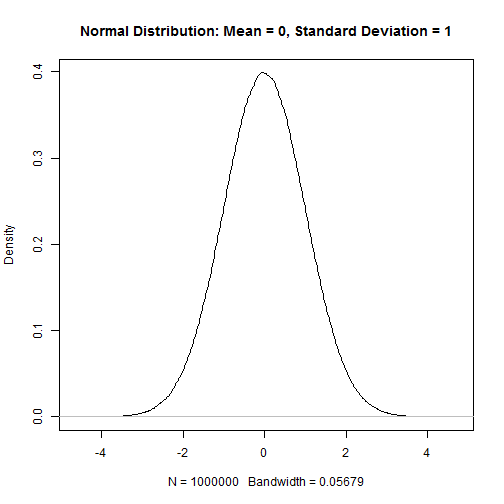
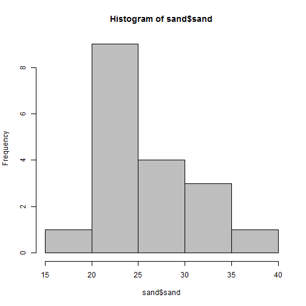
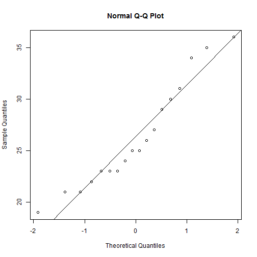
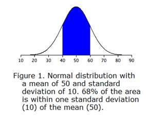
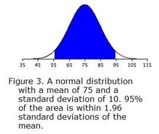
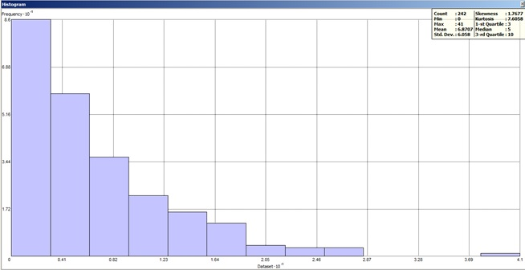

---
title:
author:
date: "Friday, February 27, 2015"
output: html_document
html_document:
    keep_md: yes
---
  

##CHAPTER 4: EXPLORATORY DATA ANALYSIS  
 
 * [4.0 Examine your data](#exam)  
 * [4.1 Frequency distribution](#freq)       
 * [4.2 Measures of central tendency](#cent)        
 * [4.3 Measures of Dispersion](#disp)      
 * [4.4 Box plots](#box)       
 * [4.5 Quantile comparison plot](#qq)       
 * [4.6 Assessing normality](#norm)       	
 * [4.7 Special cases - Circular data and pH](#circ)       
 * [4.8 Scatterplot](#scat)       
 * [4.9 Correlation matrix](#corr)       
 * [4.10 Spatial auto-correlation](#auto)      
 * [4.11 References](#ref)   

Before embarking on statistical tests and inferences, it is essential to understand your data. This will be done through conventional numerical and graphical methods. John Tukey (Tukey, 1977) advocated the practice of exploratory data analysis (EDA) as a critical part of the scientific process.  

Filliben (2004), described EDA as: 
*an approach/philosophy for data analysis that employs a variety of techniques (mostly  graphical) to maximize:*

 1. insight into a data set  
 2. uncover underlying structure  
 3. extract important variables  
 4. detect outliers and anomalies  
 5. test underlying assumptions  
 6. develop parsimonious models and  
 7. determine optimal factor settings  
  
Tukey (1980) summarized:  
*If we need a short suggestion of what exploratory data analysis is, I would suggest that*

 1. It is an attitude, AND  
 2.	A flexibility, AND  
 3.	Some graph paper (or transparencies, or both)  

*No catalog of techniques can convey a willingness to look for what can be seen, whether or not anticipated. Yet this is at the heart of exploratory data analysis. The graph paper  and transparencies  are there, not as a technique, but rather as a recognition that the picture examining eye is the best finder we have of the wholly unanticipated.*

Fortunately, we can dispense with the graph paper and transparencies and use software that makes routine work of developing the "pictures", i.e. graphical output, and descriptive statistics we will use to explore data.  

Descriptive statistics include:  

 - Mean - arithmetic average  
 - Median - middle value  
 - Mode - most frequent value  
 - Standard Deviation - variation about the mean  
 - Interquartile Range - range encompasses 50% of the values  
 - Kurtosis - peakedness of the data distribution  
 - Skewness - symmetry of the data distribution  

Graphical methods include:  

 - Histogram - a bar plot where each bar represents the frequency of observations for a given range of values
 - Density estimation - an estimation of the frequency distribution based on the sample data
 - Quantile-quantile plot - plot of actual data values against a normal distribution
 - Box plots - a visual representation of median, quartiles, symmetry, skewness, and outliers
 - Scatter plots - graphical display of one variable plotted on the x axis and another on the y axis
 - Radial plots - plots formatted for the representation of circular data 

Graphical methods represent an intuitive way to investigate data.   


###<a id="exam")></a>4.0  Examine your data  

Before starting EDA, look at your data to make sure there are no errors due to typos, coding, missing values or other countless possibilities for error. If we read the sample dataset:  


```r
sand <- read.csv("C:/workspace/sand_example.csv")
```

As noted in Chapter 1, a visual examination of the raw data is possible by looking at the data object:  


```r
View(sand)
```
 
This view is fine for a smaller dataset, but can be cumbersome for a large dataset. In order to quickly summarize a dataset, simply use the `summary()` function:  


```r
summary(sand)
```

```
##  location    landuse  master     depth            sand      
##  city:6   crop   :6   A:9    Min.   :10.00   Min.   :19.00  
##  farm:6   pasture:6   B:9    1st Qu.:14.00   1st Qu.:23.00  
##  west:6   range  :6          Median :20.00   Median :25.00  
##                              Mean   :20.06   Mean   :26.33  
##                              3rd Qu.:25.75   3rd Qu.:29.75  
##                              Max.   :31.00   Max.   :36.00
```

This is a generic R function that will return a preprogrammed summary for any R object. Because *sand* is a dataframe, we get a summary of each column. Factors will be summarized by their frequency (i.e. number of observations), while numeric or integer variables will print out a five number summary. The number of missing observations for any variable will also be printed. If some of these metrics look unfamiliar to you, don't worry. We'll cover they shortly.

When you do have missing data and the function you want to run will not run with missing values, the following options are available:  

 1. Exclude all rows or columns that contain missing values using  the function `na.exclude()`.
 2.	Replace missing values with another value, such as zero, a global constant, or the mean or median value for that column, such as `sand[is.na(sand)] <- 0`.  

A quick check for coding errors of factors would be to examine the list of levels, such as:  


```r
levels(sand$landuse)
```

```
## [1] "crop"    "pasture" "range"
```

There should be three categories of landuse, which the output verifies. If the `levles` function returned the typo such as "crops" or "Pastures", you will have to fix your dataset.  


###<a id="freq")></a>4.1  Frequency distribution  

Now that missing values and coding errors have been checked and corrected, a graphical depiction of the sample data distribution in the form of a bar graph, for nominal data, or a histogram, for continuous data conveys a wealth of information.  

An idealized normal distribution is shown in Figure 1:  


```r
test <- rnorm(1000000)
plot(density(test), main = "Normal Distribution: Mean = 0, Standard Deviation = 1")
```



Figure 1. Normal Distribution


Observing Fig. 1 indicates the data is symmetrically distributed, there is an equal distribution on either side of the highest point on the graph. By contrast, Fig. 2 and 3 are asymmetrical, with a higher distribution of values on the low end and high end of the spectrum respectively.  


```r
test <- rbeta(1000000, shape1 = 2, shape2 = 1000)
plot(density(test), main = "Beta Distribution: Shape 1 = 2, Shape 2 = 1000")
```


Figure 2. Skewed example 1  


```r
test <- rbeta(1000000, shape1 = 1000, shape2 = 2)
plot(density(test), main = "Beta Distribution: Shape 1 = 1000, Shape 2 = 2")
```


Figure 3. Skewed example 2  


Displaying data in this manner provides a visual means to determine if your data has a wide, flat, narrow, peaked, normal, or skewed distribution as in Fig. 1 and 3.  

Using the *sand_example.csv* file as the sample data set, review the histogram command from Chapter 1. Remember to use the read.csv command and create the "sand" data object in R. The next command will create a histogram:  


```r
hist(sand$sand, col = "grey")
```



Figure 4. Histogram  


Since histograms are dependent on the number of bins, for small datasets they may not be the best method of determining the shape of a distribution.  

A density estimation, also known as a Kernel density plot, generally provides a better visualization of the shape of the distribution:  
 

```r
d <- density(sand$sand)
plot(d)
```


Figure 6. The Kernel density plot depicts a smoothed line of the distribution  


ArcGIS also provides the capability of creating histograms for data associated with point files using the Geostatistical Analyst:  

  

###<a id="cent")></a>4.2  Measures of central tendency  

These are measures to determine the mid-point of the range of observed samples. The mean and median are the most commonly used measures for our purposes.  

**Mean** - The arithmetic average all are familiar with, formally expressed as: which means sum all X values in the sample and divide by the number (n) of samples. It is assumed that all references in this document refer to samples rather than a population.  

The mean sand content from the sample dataset may be determined:  


```r
mean(sand$sand)
```

```
## [1] 26.33333
```

To determine the mean by group or category, use the aggregate command as discussed in section 4.0:  

```r
aggregate(sand ~ landuse, data = sand, mean)
```

```
##   landuse     sand
## 1    crop 26.33333
## 2 pasture 28.33333
## 3   range 24.33333
```

**Median**  The middle measurement of a sample set. This is known as the middle or 50% quantile, meaning there are an equal number of samples with values less than and greater than the median. For example, assuming there are 21 samples, sorted in ascending order, the median would be the 11th sample.  

The median from the sample dataset may be determined:  


```r
median(sand$sand)
```

```
## [1] 25
```

To determine the median by group or category, use the aggregate command as discussed in section 4.0:  


```r
aggregate(sand ~ landuse, data = sand, median)
```

```
##   landuse sand
## 1    crop 26.0
## 2 pasture 28.0
## 3   range 23.5
```

It is apparent that the mean and median are different. In a normal distribution, the mean and median would be equal. Normal distributions should not be assumed with soils data. A graphical examination of the sand is possible:  


```r
d <- density(sand$sand)
plot(d)
amean <- mean(sand$sand)
amed <- median(sand$sand)
abline(v = amed, col = "green") #plot the median as a gree vertical line 
abline(v = amean, col = "red") #plot the mean as a red vertical line
```


The green vertical line represents the breakpoint for the median and the red represents the mean. The median is a more robust measure of central tendency compared to the mean. In order for the mean to be a useful measure, the data distribution must be normal. The further the data departs from normality, the less meaningful the mean becomes.  The median always represents the same thing independent of the data distribution, namely, 50% of the samples are below and 50% are above the median. The example from Figure 7 indicates a greater proportion of the samples are less than the mean. Using the mean would be overestimating the sand content of the sample dataset in this case.  

###<a id="disp")></a>4.3  Measures of Dispersion  

These are measures to determine the spread of data around the mid-point. This is useful to determine if the samples are spread widely across the range of observations or concentrated near the mid-point.  

**Range**  The difference between the highest and lowest measurement of a group. Using the sample data it may be determined as:  


```r
range(sand$sand)
```

```
## [1] 19 36
```

which returns the minimum and maximum values observed, or:  

```r
max(sand$sand) - min(sand$sand)
```

```
## [1] 17
```

which returns the value of the range  

**Variance**  A positive value indicating deviation from the mean:  

This is the square of the sum of the deviations from the mean, divided by the number of samples  1. It is commonly referred to as the sum of squares. As the deviation increases, variance increases. Conversely, if there is no deviation, the variance will equal 0. As a squared value, variance is always positive. Variance is an important component for many statistical analyses including the most commonly referred to measure of dispersion, the _standard deviation_. Variance for the sample dataset is:  


```r
var(sand$sand)
```

```
## [1] 26
```

**Standard Deviation**  The square root of the variance:  

The units of the standard deviation are the same as the units measured. Standard deviation for the sample dataset is:  


```r
sd(sand$sand)
```

```
## [1] 5.09902
```

**Coefficient of Variation** (CV)  A relative (i.e. unitless) measure of standard deviation:  

CV is calculated by dividing the standard deviation by the mean and multiplying by 100. Since standard deviation varies in magnitude with the value of the mean, a relative measure is more useful when comparing variation of datasets. CV may be calculated for the sample dataset as:  


```r
cv <- sd(sand$sand/mean(sand$sand)) * 100
cv
```

```
## [1] 19.36337
```

**Interquartile Range** (IQR)  The range from the upper (75%) quartile to the lower (25%) quartile. This represents 50% of the observations occurring in the mid-range of a sample. IQR is a robust measure of dispersion, unaffected by the distribution of data.   IQR may be calculated for the sample dataset as:  


```r
quantile(sand$sand, c(0.25, 0.75))
```

```
##   25%   75% 
## 23.00 29.75
```

**Quantiles (aka Percentiles)** - The percentile is the value that cuts off the first nth percent of the data values when sorted in ascending order.  

Quantiles may be calculated for the 10%, 50% and 90% percentiles for the sample dataset as:  


```r
quantile(sand$sand, c(0.1, 0.5, 0.9))
```

```
##  10%  50%  90% 
## 21.0 25.0 34.3
```

Thus, 80% of the observations have a sand content between 21.0% and 34.3%, while 10% are less than 21.0% and 10% are greater than 34.3%. Quantiles are robust measures, unaffected by data distributions.  

###<a id="box")></a>4.4  Box plots  

A graphical representation that shows the quartiles, minimum, maximum and outliers, if present, of the data.  Boxplots convey the shape of the data distribution, the presence of extreme values, and the ability to compare with other variables using the same scale, providing an excellent tool for screening data quality, determining thresholds for variables or developing working hypotheses.  

The parts of the boxplot are shown in Figure 8. The "box" of the boxplot is defined as the 1st quartile, (Q1 in the figure) and the 3rd quartile, (Q3 in the figure). The median, or 2nd quartile, is the dark line in the box. The whiskers show data that is 1.5 * IQR above and below the 3rd and 1st quartile. Any data point that is beyond a whisker is considered an outlier.  

That is not to say the points are in error, just that they are extreme compared to the rest of the dataset. This is a good visual cue to verify any data points that show as outliers to make sure there are no errors in data entry or measurement.  


Figure 8. Boxplot description (Seltman, 2009)  

A boxplot of sand content by horizon may be made for the sample dataset as:  


```r
boxplot(sand ~ master, xlab = "Master Horizon", ylab="Sand (%)", data = sand)
```


Figure 9. Box plot of sand by horizon  

The xlab and ylab parameters control the titles of the x and y axis.  

This plot shows us that B horizons typically contain more sand than A horizons and that the median of sand in A horizons is around 23% and around 26% in B horizons.  

A boxplot of sand content by landuse may be made for the sample dataset as:  


```r
boxplot(sand ~ landuse, data = sand)
```


Figure 10. Box plot of sand by landuse.  

Notice that the boxplot for "range" has a single circle on the graph above it.  This indicates an outlier, or a value that is more than 1.5 x IQR.  You should evaluate this data point to ensure that the number measured and entered is correct.  

###<a id="qq")></a>4.5  Quantile comparison plots (QQplot)  

a plot of actual data values against a Gaussian distribution (normal distribution with a mean of 0 and standard deviation of 1).  

A QQplot of sand content may be made for the sample dataset as:  

```r
qqnorm(sand$sand)
qqline(sand$sand)
```



Figure 11. QQplot  

The red line represents the quantiles of a normal distribution. If the data set is perfectly normal, the data points will fall along the red line. This plot reinforces the slightly skewed distribution that was seen in the density plot of Figure 7.  

ArcGIS also provides the capability of creating QQplots for data associated with point files using the Geostatistical Analyst:  

  

A more detailed explanation of QQplots may be found at the ESRI webpage:  
[http://help.arcgis.com/en/arcgisdesktop/10.0/help/index.html#//00310000000q000000](http://help.arcgis.com/en/arcgisdesktop/10.0/help/index.html#//00310000000q000000)  

###<a id="norm")></a>4.6  Assessing normality  

What is a normal distribution and why should you care? Many statistical tests are based on the properties of a normal distribution. Using certain tests on data that are not normally distributed can be misleading or incorrect. Most tests that assume normality are robust enough for all data except the very abnormal. This section is not meant to be a recipe for decision making, but more an extension of tools available to help examine your data and proceed accordingly.  

A normal distribution is also known as a Gaussian distribution or the colloquial "Bell Curve". A normal distribution has the following properties (Lane):  

 1. Normal distributions are symmetric around their mean 
 2.	The mean, median, and mode of a normal distribution are equal 
 3.	The area under the normal curve is equal to 1.0 
 4.	Normal distributions are denser in the center and less dense in the tails 
 5.	Normal distributions are defined by two parameters, the mean and the standard deviation
 6.	68% of the area of a normal distribution is within one standard deviation of the mean

    

 7.7.  Approximately 95% of the area of a normal distribution is within two standard deviations of the mean.  

  

Viewing a histogram or density plot of your data provides a quick visual reference for determining normality as discussed in section 4.1. Distributions are typically Normal, Bimodal or Skewed:  

Figure 12. Sample histograms    

Occasionally distributions are Uniform, or nearly so:  

Figure 13. Uniform distribution  

The quantitative measures of Kurtosis (peakedness) and Skewness (symmetry) may be used to bolster the graphical examination of your data and are available through Rcmdr,  

  

and the Geostatistical Analyst  Histogram Tool in ArcGIS. A rule of thumb for interpreting skewness suggested by Bulmer (1979) follows:  

 * If skewness is less than 1 or greater than +1, the distribution is highly skewed
 * If skewness is between 1 and ??? or between ??? and +1, the distribution is moderately skewed
 * If skewness is between ??? and ???, the distribution is approximately symetric  
 
Statistical tests for normality that utilize Kurtosis and Skewness are available with the fBasics package in R  including:  

 * Kolmogorov-Smirnov
 * Shapiro-Wilk
 * Jarque-Bera
 * Da'Agostino  
 
Using the sample data. the default test uses the Shapiro-Wilk method:  


```r
normalTest(sand$sand)
```
Install or load the fBasics package if you receive an error:  

install.packages("fBasics", dep=TRUE, repos='http://cran.case.edu/')      
library(fBasics) # Add the fBasics package  


  

The null hypothesis for the test is: "this sample comes from a normal population". The output has a p value of 0.1867, which is fairly high, so the null hypothesis would not be rejected.  The Jarque-Bera test also returns a high p  


```r
jarqueberaTest(sand$sand)
```

  

The Da'Agostino test returns:  


```r
dagoTest(sand$sand)
```

  

Which lets you know this test will only run when there are at least 20 sample points.  

The impact of normality is most commonly seen for parameters used by pedologists for documenting the ranges of a variable, i.e. Low, RV and High values. Often a rule-of thumb similar to: "two standard deviations" is used to define the low and high values of a variable. This is fine if the data is normally distributed. However, if the data is skewed, like Figure 14, using standard deviation as a parameter does not provide useful information of the data distribution.  



Figure 14. Skewed distribution  

The dataset for Figure 14 has a mean of ~6.9, a median of 5 and a standard deviation is ~6.1. Using the standard deviation or the mean to populate the low, rv and high values would not be appropriate. As mentioned in section 4.2 and 4.3, the median and a specified quantile(percentile) would be the most foolproof measures for assigning these values, performing uniformly well for normally as well as non-normally distributed data.  

There is a suite of statistical tools available for data that is not normally distributed called nonparametric methods. These will be discussed in subsequent chapters.  


###<a id="circ")></a>4.7  Special cases - Circular data and pH

The two most common variables warranting special consideration for pedologists are:  

**Slope aspect** - requires the use of circular statistics for summarizing numerically, or graphical interpretation using circular plots. For example, if soil map units being summarized have a uniform distribution of slope aspects ranging from 335 degrees to 25 degrees, the Zonal Statistics tool in ArcGIS would return a mean of 180.  

The most intuitive means available for evaluating and describing slope aspect are circular plots available with the circular package in R and the radial plot option in the [TEUI](http://www.fs.fed.us/eng/rsac/programs/teui/downloads.html) Toolkit. The circular package in R will also calculate circular statistics like mean, median, quartiles etc. An example dataset with one column containing slope aspect values may be evaluated as: 

The text file containing aspect values (aspect_extract3.csv) is similar to this sample:  

GRID_CODE  
51.4996  
51.5852  
51.5700  
51.7099  
51.9115  
51.4930  


```r
library(circular)
library(soilDB)

data(loafercreek)
aspect <- loafercreek$aspect_field

aspect <- circular(aspect, template="geographic", units="degrees", modulo="2pi")
summary(aspect)
```

```
##        n     Min.  1st Qu.   Median     Mean  3rd Qu.     Max.      Rho 
##  59.0000  20.0000 277.5000 205.0000 209.4000 140.5000  28.0000   0.1765 
##     NA's 
##   4.0000
```

The numeric output is fine, but a graphic is more revealing (Figure 15):  


```r
rose.diag(aspect, bins = 12, col="grey")
```


Figure 15. Rose Diagram  

The graphic reveals a dominant Northeast exposure with a secondary Western slope aspect. This is expected from the sample map unit that occurs in the ridge and valley province with strong directional trends. Unfortunately, there is not a good way to convey bimodal slope aspect distributions in NASIS.  

**pH**  since pH is logarithmic, the use of median and quantile ranges are the [preferred](http://www.fao.org/docrep/field/003/AC175E/AC175E07.htm) measures when summarizing pH. Remember, pHs of 6 and 5 correspond to hydrogen ion concentrations of 0.000001 and 0.00001 respectively.  The actual average is 5.26;  -log(0.000001 + 0.00001/2). The difference between the correct average of 5.26 and the incorrect of 5.5 is small, but proper handling of data types is a best practice.  

If you have a table with pH values and wish to calculate the arithmetic mean using R, this example will work:  

-log10(mean(10^-datatbl$ph, na.rm=T))  

In this example, datatbl is the data object and ph is the column containing pH values.  

If there is a need to create a surface of pH values, i.e. interpolate values from point observations, the operation of determining values at unknown points is analogous to determining an average and the use of hydrogen ion concentration would be the proper input.  

If spatial interpolation is going to be performed, the following steps should be executed:  

 1.  transform pH to the actual H+ concentration 
 2.	interpolate
 3.	back transform to log value

Here is a brief example for interpolating pH using common software:    

1. Assume a comma delimited text file with pH, and x and y coordinates named "Excel_ph2.csv"
2.	Open the file in Excel and it looks similar to this:  
  
3.  Format a column as numeric with ~15 decimals and a header named H_concentration
4.	Enter a formula in the first empty cell as: =(1/10^B2) * 1000000
5.	Drag the cell down to all empty records, which results in a transformed H+concentration

 
This is a workaround for ArcGIS, which truncates data that is extremely small like the H+ concentration for pH > 7.  

6.  Bring the text file into ArcGIS as points using Make XY Event Layer

  

  

Opening the table for the Event layer:  

  

7. Interpolate using the interpolation method of choice - Spline will be used in this example    

  
  

8. The resulting values correspond to H+ concentration * 10<sup>6</sup>  

  

9. Convert values to pH using Raster Calculator  

  

10. The values now correspond to pH

  

###<a id="scat")></a>4.8  Scatterplots

Plotting points of one variable against another is a scatter plot. Plots can be produced for a single or multiple pairs of variables. It is assumed that these plots are for ratio or interval data types. Many independent variables are often under consideration in soil survey work. This is especially common when GIS is used, which offer the potential to correlate soil attributes with a large variety of raster datasets.  

The purpose of a scatterplot is to see how one variable relates to another. With modeling in general the goal is parsimony (i.e. simple). The goal is to determine the fewest number of variables required to explain or describe a phenomenon. If two variables explain the same thing, i.e. they are highly correlated, only one variable is needed. The scatterplot provides a perfect visual reference for this.

Create a basic scatter plot using a dataset included with the aqp package that shows soil properties for Serpentine soils from California (McGahan et al., 2009).


```r
library(aqp)
data(sp4)
plot(clay ~ CEC_7, data = sp4)
```


Figure 16. Scatter Plot

This plots clay on the Y axis and cation exchange capacity on the X axis. As shown in Figure 16, there is a strong correlation between these variables, as expected.  

The function below produces a scatterplot matrix for all the numeric variables in the sp4 dataset. This is a good command to use for determining rough linear correlations for continuous variables.  


```r
pairs(sp4[7:13])
```


###<a id="corr")></a>4.9  Correlation matrix  

A correlation matrix is a table of the calculated correlation coefficients of all variables. This provides a quantitative measure to guide the decision making process. The following will produce a correlation matrix for the sp4 dataset:  


```r
round(cor(sp4[7:13]), 2)
```

```
##                Ca CEC_7 ex_Ca_to_Mg  sand  silt  clay    CF
## Ca           1.00  0.23        0.90  0.26 -0.04 -0.25 -0.28
## CEC_7        0.23  1.00        0.15 -0.52 -0.10  0.66 -0.32
## ex_Ca_to_Mg  0.90  0.15        1.00  0.28  0.12 -0.41 -0.21
## sand         0.26 -0.52        0.28  1.00 -0.51 -0.63  0.17
## silt        -0.04 -0.10        0.12 -0.51  1.00 -0.36  0.13
## clay        -0.25  0.66       -0.41 -0.63 -0.36  1.00 -0.31
## CF          -0.28 -0.32       -0.21  0.17  0.13 -0.31  1.00
```

As seen in the output, variables are perfectly correlated with themselves and have a correlation coefficient of 1.0.  

What is considered highly correlated? A good rule of thumb is anything with a value of **0.7** or greater is considered highly correlated.  The scatterplot shows a tight, linear relationship between e00 and c00, which is corroborated with the correlation matrix showing a correlation coefficient of ~0.96.  

Negative values indicate a negative relationship between variables. In the case of pH80 and e80; as electrical conductivity increases, pH decreases. This is a strong negative correlation of ~ -0.85.  

###<a id="auto")></a>4.10  Spatial auto-correlation  

In progress  

###<a id="ref")></a>4.11 References  

Bulmer, M. G. 1979. Principal of Statistics  

deSmith, M. 2014. Statistical Analysis Handbook  
[http://www.statsref.com/HTML/index.html](http://www.statsref.com/HTML/index.html)  

ESRI ArcGIS. Normal QQ plot and general QQ plot.  
[http://help.arcgis.com/en/arcgisdesktop/10.0/help/index.html#//00310000000q000000](http://help.arcgis.com/en/arcgisdesktop/10.0/help/index.html#//00310000000q000000)    

FAO Corporate Document Repository. 
[http://www.fao.org/docrep/field/003/AC175E/AC175E07.htm](http://www.fao.org/docrep/field/003/AC175E/AC175E07.htm)    

Filliben, J. J. 2004. NIST/SEMATECH e-Handbook of Statistical Methods. [http://www.itl.nist.gov/div898/handbook/eda/section1/eda11.htm](http://www.itl.nist.gov/div898/handbook/eda/section1/eda11.htm])    

Lane, D.M. Online Statistics Education: A Multimedia Course of Study [(http://onlinestatbook.com/](http://onlinestatbook.com/) Project Leader: [David M. Lane](http://www.ruf.rice.edu/~lane/), Rice University

McGahan, D.G., Southard, R.J, Claassen, V.P. 2009. Plant-Available Calcium Varies Widely in Soils on Serpentinite Landscapes. Soil Sci. Soc. Am. J. 73: 2087-2095. [https://dl.sciencesocieties.org/publications/sssaj/abstracts/73/6/2087](https://dl.sciencesocieties.org/publications/sssaj/abstracts/73/6/2087) 

Seltman, H. 2009. Experimental Design and Analysis. Chapter 4: Exploratory Data Analysis. Carnegie Mellon University.  [http://www.stat.cmu.edu/~hseltman/309/Book/chapter4.pdf](http://www.stat.cmu.edu/~hseltman/309/Book/chapter4.pdf)    

TEUI. USFS, [http://www.fs.fed.us/eng/rsac/programs/teui/downloads.html](http://www.fs.fed.us/eng/rsac/programs/teui/downloads.html)   

Tukey, John. 1977. Exploratory Data Analysis, Addison-Wesley    

Tukey, J. 1980. We need both exploratory and confirmatory. The American Statistician, 34:1, 23-25  

