---
title:
author: Tom D'Avello and Stephen Roecker
date: "Friday, February 27, 2015"
output: html_document
html_document:
    keep_md: yes
---
  

# CHAPTER 4: EXPLORATORY DATA ANALYSIS  
 
 - [4.0 Examine your data](#exam)  
 - [4.1 Frequency distributions](#freq)       
 - [4.2 Measures of central tendency](#cent)        
 - [4.3 Measures of Dispersion](#disp)      
 - [4.4 Box plots](#box)       
 - [4.5 Quantile comparison plot](#qq)       
 - [4.6 Transformations](#transform)       	
 - [4.6.1 Special cases - Circular data and pH](#circ)       
 - [4.7 Scatterplot](#scat)       
 - [4.8 Correlation matrix](#corr)       
 - [4.9 References](#ref)   
 - [4.10 Additional reading](#add)

Before embarking on developing statistical models and generating predictions, it is essential to understand your data. This typcially done using conventional numerical and graphical methods. John Tukey (Tukey, 1977) advocated the practice of exploratory data analysis (EDA) as a critical part of the scientific process.  

Filliben (2004), described EDA as: 
*an approach/philosophy for data analysis that employs a variety of techniques (mostly  graphical) to maximize:*

 1. insight into a data set  
 2. uncover underlying structure  
 3. extract important variables  
 4. detect outliers and anomalies  
 5. test underlying assumptions  
 6. develop parsimonious models and  
 7. determine optimal factor settings  
  
Tukey (1980) summarized:  
*If we need a short suggestion of what exploratory data analysis is, I would suggest that*

 1. It is an attitude, AND  
 2.	A flexibility, AND  
 3.	Some graph paper (or transparencies, or both)  

*"No catalog of techniques can convey a willingness to look for what can be seen, whether or not anticipated. Yet this is at the heart of exploratory data analysis. The graph paper  and transparencies  are there, not as a technique, but rather as a recognition that the picture examining eye is the best finder we have of the wholly unanticipated."*

Fortunately, we can dispense with the graph paper and transparencies and use software that makes routine work of developing the 'pictures' (i.e. graphical output) and descriptive statistics we will use to explore our data.  

Descriptive statistics include:  

 - **Mean** - arithmetic average  
 - **Median** - middle value  
 - **Mode** - most frequent value  
 - **Standard Deviation** - variation about the mean  
 - **Interquartile Range** - range encompasses 50% of the values  
 - **Kurtosis** - peakedness of the data distribution  
 - **Skewness** - symmetry of the data distribution  

Graphical methods include:  

 - **Histogram** - a bar plot where each bar represents the frequency of observations for a given range of values
 - **Density estimation** - an estimation of the frequency distribution based on the sample data
 - **Quantile-quantile plot** - plot of actual data values against a normal distribution
 - **Box plots** - a visual representation of median, quartiles, symmetry, skewness, and outliers
 - **Scatter plots** - graphical display of one variable plotted on the x axis and another on the y axis
 - **Radial plots** - plots formatted for the representation of circular data 


##<a id="exam")></a>4.0  Examine your data  

Ideally before you start an EDA, you should ensure that your data has no errors, typos, or other problems. However as is often the case, EDA is a useful tool/process to identify such errors before you move on to other statistical analyses. For this chapter we'll use the loafercreek dataset, from the CA630 Soil Survey Area.


```r
library(soilDB)
library(lattice)
library(reshape2)

data("loafercreek") # load from the soilDB package

# Generalized the horizon designations
n <- c('A',
       'Bt1',
       'Bt2',
       'Bt3',
       'Cr',
       'R')
# REGEX rules
p <- c('^A$|Ad|Ap',
       'Bt1$',
       '^Bt2$',
       '^Bt3|^Bt4|CBt$|BCt$|2Bt|2CB$|^C$',
       'Cr',
       'R')
loafercreek$genhz <- generalize.hz(loafercreek$hzname, n, p)

h <- horizons(loafercreek) # extract the horizon table
s <- site(loafercreek) # extract the site table
```

As noted in Chapter 1, a visual examination of the raw data is possible by looking at the R object:  


```r
View(h)

# or by clicking on the dataset in the environment tab
```
 
This view is fine for a small dataset, but can be cumbersome for a larger ones. In order to quickly summarize a dataset, can simply use the `summary()` function. However even for our small example dataset the output can be volumnous. Therefore in the interest of saving space we'll only look at a sample of columns.  


```r
vars <- c("genhz", "clay", "total_frags_pct", "phfield", "effervescence")
summary(h[vars])
```

```
##       genhz         clay       total_frags_pct    phfield     
##  A       :64   Min.   :10.00   Min.   : 0.00   Min.   :4.900  
##  Bt1     :59   1st Qu.:17.00   1st Qu.: 0.00   1st Qu.:6.000  
##  Bt2     :58   Median :21.00   Median : 5.00   Median :6.200  
##  Bt3     :52   Mean   :22.05   Mean   :13.01   Mean   :6.135  
##  Cr      :57   3rd Qu.:26.00   3rd Qu.:20.00   3rd Qu.:6.500  
##  R       :26   Max.   :48.00   Max.   :87.00   Max.   :6.900  
##  not-used:49   NA's   :110                     NA's   :204    
##  effervescence     
##  Length:365        
##  Class :character  
##  Mode  :character  
##                    
##                    
##                    
## 
```

The `summary()` function is know as a generic R function. It will return a preprogrammed summary for any R object. Because *h* is a data frame, we get a summary of each column. Factors will be summarized by their frequency (i.e. number of observations), while numeric or integer variables will print out a five number summary, and characters simply print their length. The number of missing observations for any variable will also be printed if they're present. If any of these metrics look unfamiliar to you, don't worry we'll cover them shortly.

When you do have missing data and the function you want to run will not run with missing values, the following options are available:  

 1. **Exclude** all rows or columns that contain missing values using  the function `na.exclude()`, such as `h2 <- na.exclude(h)`. However this can be wasteful because it removes all rows (e.g. horizons), regardless if the row only has 1 missing value. Instead it's sometimes best to create a temporary copy of the variable in question and then remove the missing variables, such `clay <- na.exclude(h$clay)`.
 2.	**Replace** missing values with another value, such as zero, a global constant, or the mean or median value for that column, such as `h$clay <- ifelse(is.na(h$clay), 0, h$clay) # or h[is.na(h$clay), ] <- 0`.
 3. **Read** the help file for the function you're attempting to use. Many functions have additional arguements for dealing with missing values, such as `na.rm`.

A quick check for typos would be to examine the list of levels for a factor or character, such as:  


```r
levels(h$genhz)  # just for factors
```

```
## [1] "A"        "Bt1"      "Bt2"      "Bt3"      "Cr"       "R"       
## [7] "not-used"
```

```r
unique(h$hzname) # for characters and factors
```

```
##  [1] "Oi"   "A"    "BAt"  "Bt1"  "Bt2"  "Bt3"  "Crt"  "R"    "BA"   "Cr"  
## [11] "2Bt3" "2Bt4" "2Cr"  "Bw"   "BCt"  "2BCt" "Bt"   "CBt"  "Bt4"  "2CB" 
## [21] "2R"   "C"    "AB"   "2Bt2" "Ad"   "Ap"   "Rt"   "ABt"  "2Crt" "B"
```

```r
sort(unique(h$hzname)) # sort the results
```

```
##  [1] "2BCt" "2Bt2" "2Bt3" "2Bt4" "2CB"  "2Cr"  "2Crt" "2R"   "A"    "AB"  
## [11] "ABt"  "Ad"   "Ap"   "B"    "BA"   "BAt"  "BCt"  "Bt"   "Bt1"  "Bt2" 
## [21] "Bt3"  "Bt4"  "Bw"   "C"    "CBt"  "Cr"   "Crt"  "Oi"   "R"    "Rt"
```

If the `unique()` function returned typos such as "BT" or "B t", you could either fix your original dataset or you could make an adjustment in R, such as:


```r
h$hzname[h$hzname == "BT"] <- "Bt"

# or

# h$hzname <- ifelse(h$hzname == "BT", "Bt", h$hzname)

# or as a last resort we could manually edit the spreadsheet in R

# edit(h)
```

Typo errors such as these are common problem with old pedon data in NASIS.

## Exercise: fetch and inspect

- Load the gopheridge dataset found within the soilDB package or your own data (highly encouraged) and inspect the dataset. 
- Apply the generalized horizon rules below or develop your own.
- Summarize the depths, genhz, texture class, sand, and fine gravel
- Submit the results to your coach.


```r
# gopheridge rules
n <- c('A', 'Bt1', 'Bt2', 'Bt3','Cr','R')
p <- c('^A|BA$', 'Bt1|Bw','Bt$|Bt2', 'Bt3|CBt$|BCt','Cr','R')
```


##<a id="freq")></a>4.1  Frequency distributions  

Now that we've checked for missing values and typos and made correcitons, we can graphically examine the sample data distribution of our integer and numeric data. Frequency distributions are useful because they can help us visualize the center (e.g. RV) and spread or dispersion (e.g low and high) of our data. Typically in introductory statistics the normal (i.e. Gaussian) distribution is emphasized.

What is a normal distribution and why should you care? Many statistical methods are based on the properties of a normal distribution. Appling certain methods to data that are not normally distributed can give misleading or incorrect results. Most methods that assume normality are robust enough for all data except the very abnormal. This section is not meant to be a recipe for decision making, but more an extension of tools available to help you examine your data and proceed accordingly. The impact of normality is most commonly seen for parameters used by pedologists for documenting the ranges of a variable (i.e. Low, RV and High values). Often a rule-of thumb similar to: "two standard deviations" is used to define the low and high values of a variable. This is fine if the data is normally distributed. However, if the data is skewed, like Figure 7, using the standard deviation as a parameter does not provide useful information of the data distribution. The quantitative measures of Kurtosis (peakedness) and Skewness (symmetry) can be used to assist in accessing normality, and will be addressed below. Significance tests for normality also exist and can be found in the fBasics package, but Webster (2001) cautions aganist using signficance tests for accessing normality. Then preceding sections and chapters will demonstrate various methods to cope with alternative distributions.

A Gaussian distribution is often referred too as "Bell Curve", and has the following properties (Lane):  

 1. Gaussian distributions are **symmetric** around their mean 
 2.	The mean, median, and mode of a Gaussian distribution are **equal** 
 3.	The area under the curve is equal to **1.0** 
 4.	Gaussian distributions are **denser** in the center and less dense in the tails 
 5.	Gaussian distributions are **defined** by two parameters, the mean and the standard deviation
 6.	**68%** of the area under the curve is within one standard deviation of the mean

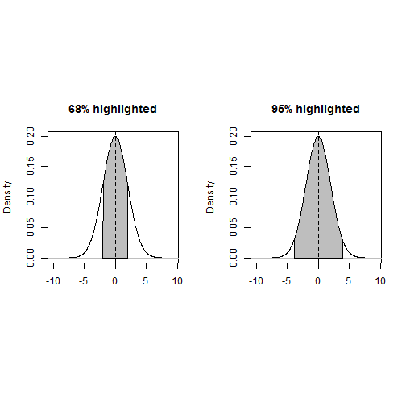

7.7.  Approximately 95% of the area of a Gaussian distribution is within two standard deviations of the mean.  


Viewing a histogram or density plot of your data provides a quick visual reference for determining normality as discussed in section 4.1. Distributions are typically normal, Bimodal or Skewed:  


Figure 12. Sample histograms    

Occasionally distributions are Uniform, or nearly so:  


Figure 13. Uniform distribution  


**Histograms and density curves**

Next will review the `hist` and `density` functions which plot a histogram and density curve respectively.  


```r
test <- melt(h, measure.vars = c("clay", "sand", "total_frags_pct"), id.vars = "phiid")

histogram(~ value | variable, data = test, scales = list(y = "free"))
```

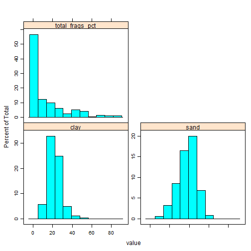

```r
# or individually

# histogram(~ clay, data = h)

# or using the graphics package

# par(mfrow = c(1, 3))
# hist(h$clay, col = "grey")
# hist(h$sand, col = "grey")
# hist(h$total_frags_pct, col = "grey")
# dev.off()
```

Figure 4. Histogram  


Since histograms are dependent on the number of bins, for small datasets they're not the best method of determining the shape of a distribution. A density estimation, also known as a Kernel density plot, generally provides a better visualization of the shape of the distribution in comparison to the histogram.  
 

```r
test <- melt(h, measure.vars = c("clay", "sand"), idvars = "phiid")

histogram(~ clay + sand + total_frags_pct, data = h,
          type = "density",
          panel = function(x, ...) {
            panel.histogram(x, ...)
            panel.densityplot(x, ..., darg = list(na.rm  = TRUE))
            }
          )
```

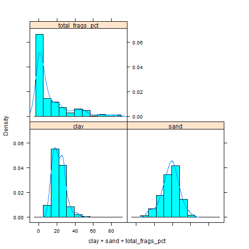

```r
densityplot(~ clay + sand + total_frags_pct, data = h, auto.key = TRUE)
```

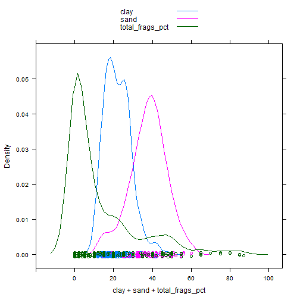

```r
# or using graphics package

# test <- density(h$clay, na.rm = TRUE)
# plot(test) 
```

Figure 6. The Kernel density plot depicts a smoothed line of the distribution  


Compared to the histogram where the y-axis represents the number (i.e. frequencey) of observations, the y-axis for the density plot represents the proportion or probability of observing any given value. Notice how the histogram seems to emphasis long right tail of values, which might question whether we have a normal distribution. One curious feature that this density curve does show is the hint of a bimodal distribution. Given that our sample does include a mixture of surface and subsurface horizons it may be we have have two different populations. However considering how much the two distributions overlap it seems impractical to separate them in this instance.

##<a id="cent")></a>4.2  Measures of central tendency  

These measures are used to determine the mid-point of the range of observed values. In NASIS speak this should ideally be equivalent to the representative value (RV) for numeric and integer data. The mean and median are the most commonly used measures for our purposes.

**Mean** - is the arithmetic average all are familiar with, formally expressed as: which sums ( $\sum$ ) all the X values in the sample and divide by the number (n) of samples. It is assumed that all references in this document refer to samples rather than a population.  

The mean clay content from the loafercreek dataset may be determined:  


```r
clay <- na.exclude(h$clay) # first remove missing values and create a new vector

mean(clay)
```

```
## [1] 22.04863
```

```r
# or use the additional na.rm argument
mean(h$clay, na.rm = TRUE)
```

```
## [1] 22.04863
```

To determine the mean by group or category, use the aggregate command:  

```r
aggregate(clay ~ genhz, data = h, mean)
```

```
##      genhz     clay
## 1        A 15.47903
## 2      Bt1 21.43390
## 3      Bt2 25.26897
## 4      Bt3 28.60577
## 5 not-used 18.54167
```

**Median**  The middle measurement of a sample set, and as such is a more robust estimate of central tendency than the mean. This is known as the middle or 50th quantile, meaning there are an equal number of samples with values less than and greater than the median. For example, assuming there are 21 samples, sorted in ascending order, the median would be the 11th sample.

The median from the sample dataset may be determined:  


```r
median(clay)
```

```
## [1] 21
```

To determine the median by group or category, use the aggregate command again:  


```r
aggregate(clay ~ genhz, data = h, median)
```

```
##      genhz clay
## 1        A 15.0
## 2      Bt1 20.0
## 3      Bt2 24.5
## 4      Bt3 28.0
## 5 not-used 18.0
```

```r
# or we could use the summary() function to get both the mean and median

aggregate(clay ~ genhz, data = h, summary)
```

```
##      genhz clay.Min. clay.1st Qu. clay.Median clay.Mean clay.3rd Qu.
## 1        A     10.00        13.00       15.00     15.48        16.93
## 2      Bt1     14.00        18.00       20.00     21.43        24.50
## 3      Bt2     17.00        21.25       24.50     25.27        28.00
## 4      Bt3     10.00        26.00       28.00     28.61        31.25
## 5 not-used     12.00        16.00       18.00     18.54        20.25
##   clay.Max.
## 1     23.00
## 2     41.00
## 3     43.00
## 4     48.00
## 5     27.00
```

In this example the mean and median are only slightly different, so we can safefully assume we have normal distribution. However many soil variables often have a non-normal distribution. For example, lets look at graphical examination of the mean vs median for clay and rock fragments:  


```r
test <- density(clay)
plot(test)
amean <- mean(clay)
amed <- median(clay)
abline(v = amed, col = "green") # plot the median as a gree vertical line 
abline(v = amean, col = "red") # plot the mean as a red vertical line
```

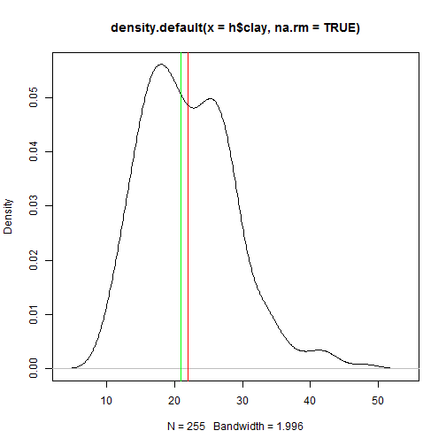

```r
frags <- h$total_frags_pct
test <- density(frags)
plot(test)
amean <- mean(frags)
amed <- median(frags)
abline(v = amed, col = "green") # plot the median as a gree vertical line 
abline(v = amean, col = "red") # plot the mean as a red vertical line
```

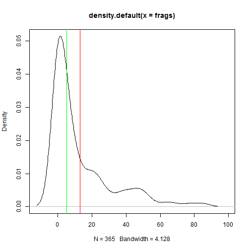

Figure 7. Comparison of the mean vs median for clay and rock fragments.  


The green vertical line represents the breakpoint for the median and the red represents the mean. The median is a more robust measure of central tendency compared to the mean. In order for the mean to be a useful measure, the data distribution must be approximately normal. The further the data departs from normality, the less meaningful the mean becomes. The median always represents the same thing independent of the data distribution, namely, 50% of the samples are below and 50% are above the median. The example from Figure 7 for clay again indicates that distribution is approximately normal. However for rock fragments, we see a long tailed distribution (e.g. skewed). Using the mean in this instance would overestimating the rock fragments. Although in this instance the difference between the mean and median is only 8 percent.

**Mode** - is the most frequent measurement in the sample. The use of mode is typically reserved for factors, which we will discuss shortly. One issue with using the mode, is that with numeric data you need to round the data to the level of precision you're interested in. In following example you can see where it looks like someone entered the laboratory data into the pedon horizon data. It hard to tell from the example, but the first column in each sequence shows the values and the following columns show the number occurences of that value.


```r
table(h$clay) # show a frequency table
```

```
## 
##               10               11               12               13 
##                3                3                7                8 
##               14               15               16 16.7000007629395 
##               10               10               18                1 
##               17               18               19 19.6000003814697 
##               13               16               13                1 
##               20               21             21.5               22 
##               15               12                1               10 
##               23 23.6000003814697               24               25 
##                9                1               13               13 
##               26               27               28               29 
##               17                8               17                9 
##               30               31               32               33 
##                4                1                5                4 
##               34               35               36               38 
##                2                3                1                1 
##               39               41               42               43 
##                1                1                2                1 
##               48 
##                1
```

```r
# table(as.integer(h$clay)) # we can fix the rounding error like so

# or

# table(round(h$clay))

sort(table(h$clay), decreasing = TRUE)[1] # sort and select the 1st value, which will be the mode
```

```
## 16 
## 18
```

##<a id="disp")></a>4.3  Measures of Dispersion  

These are measures to determine the spread of data around the mid-point. This is useful to determine if the samples are spread widely across the range of observations or concentrated near the mid-point. In NASIS speak these values might equate to the low (L) and high (H) values for numeric and integer data.

**Range**  The difference between the highest and lowest measurement of a group. Using the sample data it may be determined as:  


```r
range(clay)
```

```
## [1] 10 48
```

which returns the minimum and maximum values observed, or:  


```r
max(clay) - min(clay)
```

```
## [1] 38
```

```r
# or

# diff(range(clay))
```

which returns the value of the range  

**Variance**  A positive value indicating deviation from the mean: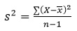  

This is the square of the sum of the deviations from the mean, divided by the number of samples minus 1. It is commonly referred to as the sum of squares. As the deviation increases, the variance increases. Conversely, if there is no deviation, the variance will equal 0. As a squared value, variance is always positive. Variance is an important component for many statistical analyses including the most commonly referred to measure of dispersion, the _standard deviation_. Variance for the sample dataset is:  


```r
var(clay)
```

```
## [1] 45.53172
```

**Standard Deviation**  The square root of the variance:  

The units of the standard deviation are the same as the units measured. From the formula you can see that the standard deviation is simply the square root of the variance. Standard deviation for the sample dataset is:  


```r
sd(clay)
```

```
## [1] 6.74772
```

```r
# or

# sqrt(var(clay))
```

**Coefficient of Variation** (CV)  A relative (i.e. unitless) measure of standard deviation:  

CV is calculated by dividing the standard deviation by the mean and multiplying by 100. Since standard deviation varies in magnitude with the value of the mean, the CV is useful for comparing relative variation amongst different datasets. However Webster (2001) discourages using CV to compare different variables. Webster (2001) also stresses that CV is reserved for variables that have an absolute 0, like clay content. CV may be calculated for the sample dataset as:  


```r
cv <- sd(clay)/mean(clay) * 100
cv
```

```
## [1] 30.60381
```

**Interquartile Range** (IQR)  The range from the upper (75%) quartile to the lower (25%) quartile. This represents 50% of the observations occurring in the mid-range of a sample. IQR is a robust measure of dispersion, unaffected by the distribution of data. In soil survey lingo you could consider the IQR to estimate the central concept of a soil property. IQR may be calculated for the sample dataset as:  


```r
IQR(clay)
```

```
## [1] 9
```

```r
# or

# diff(quantile(clay, c(0.25, 0.75)))
```

**Quantiles (aka Percentiles)** - The percentile is the value that cuts off the first nth percent of the data values when sorted in ascending order.

The default for the `quantile()` function returns the the min, 25th percentile, median or 50th percentile, 75th percentile, and max, known as the five number summmery originally proposed by Tukey. Other probabilities however can be used. At present the 5th, 50th, and 95th are being proposed for determining the range in characteristics (RIC) for a given soil property.


```r
quantile(clay)
```

```
##   0%  25%  50%  75% 100% 
##   10   17   21   26   48
```

```r
# or

quantile(clay, c(0.05, 0.5, 0.95))
```

```
##   5%  50%  95% 
## 12.7 21.0 33.3
```

Thus, for the five number summary 25% of the observations fall between each of the intervals. Quantiles are a useful metric because they are largely unaffected by the distribution of the data, and have a simple interpetration.

**Frequencies**

To summarize factors and characters we can examine their frequency or number of observations. This is accomplished using tables.


```r
table(h$genhz)
```

```
## 
##        A      Bt1      Bt2      Bt3       Cr        R not-used 
##       64       59       58       52       57       26       49
```

```r
# or

# summary(h$genhz)
```

This gives us a count of the number of observations for each horizon. If we want to see the comparison two different factors or characters.


```r
table(h$genhz, h$hzname)
```

```
##           
##            2BCt 2Bt2 2Bt3 2Bt4 2CB 2Cr 2Crt 2R  A AB ABt Ad Ap  B BA BAt
##   A           0    0    0    0   0   0    0  0 62  0   0  1  1  0  0   0
##   Bt1         0    0    0    0   0   0    0  0  0  0   0  0  0  0  0   0
##   Bt2         0    0    0    0   0   0    0  0  0  0   0  0  0  0  0   0
##   Bt3         1    1    5    4   1   0    0  0  0  0   0  0  0  0  0   0
##   Cr          0    0    0    0   0   3    1  0  0  0   0  0  0  0  0   0
##   R           0    0    0    0   0   0    0  2  0  0   0  0  0  0  0   0
##   not-used    0    0    0    0   0   0    0  0  0  1   4  0  0  1 11   3
##           
##            BCt Bt Bt1 Bt2 Bt3 Bt4 Bw  C CBt Cr Crt Oi  R Rt
##   A          0  0   0   0   0   0  0  0   0  0   0  0  0  0
##   Bt1        0  0  59   0   0   0  0  0   0  0   0  0  0  0
##   Bt2        0  0   0  58   0   0  0  0   0  0   0  0  0  0
##   Bt3        5  0   0   0  27   3  0  2   3  0   0  0  0  0
##   Cr         0  0   0   0   0   0  0  0   0 35  18  0  0  0
##   R          0  0   0   0   0   0  0  0   0  0   0  0 22  2
##   not-used   0  5   0   0   0   0  3  0   0  0   0 21  0  0
```

```r
table(h$genhz, h$texture_class)
```

```
##           
##            br  c cl  l mpm scl sic sicl sil sl spm
##   A         0  0  0 51   0   0   0    0   9  3   0
##   Bt1       0  1  5 41   0   0   0    1  11  0   0
##   Bt2       0  0 15 32   0   2   1    3   5  0   0
##   Bt3       0  2 24 15   0   4   1    2   4  0   0
##   Cr       51  0  0  0   0   0   0    0   0  0   0
##   R        23  0  0  0   0   0   0    0   0  0   0
##   not-used  0  0  1 20   1   1   0    1   2  1  18
```

We can also easily see add margins totals to the table or convert the table frequencies to proportions.


```r
addmargins(table(h$genhz, h$texture_class)) # appends the table with row and column sums
```

```
##           
##             br   c  cl   l mpm scl sic sicl sil  sl spm Sum
##   A          0   0   0  51   0   0   0    0   9   3   0  63
##   Bt1        0   1   5  41   0   0   0    1  11   0   0  59
##   Bt2        0   0  15  32   0   2   1    3   5   0   0  58
##   Bt3        0   2  24  15   0   4   1    2   4   0   0  52
##   Cr        51   0   0   0   0   0   0    0   0   0   0  51
##   R         23   0   0   0   0   0   0    0   0   0   0  23
##   not-used   0   0   1  20   1   1   0    1   2   1  18  45
##   Sum       74   3  45 159   1   7   2    7  31   4  18 351
```

```r
round(prop.table(table(h$genhz, h$texture_class), margin = 1) * 100) # margin = 1 calculates for rows, margin = 2 calculates for columns, margin = NULL calculates for total observations
```

```
##           
##             br   c  cl   l mpm scl sic sicl sil  sl spm
##   A          0   0   0  81   0   0   0    0  14   5   0
##   Bt1        0   2   8  69   0   0   0    2  19   0   0
##   Bt2        0   0  26  55   0   3   2    5   9   0   0
##   Bt3        0   4  46  29   0   8   2    4   8   0   0
##   Cr       100   0   0   0   0   0   0    0   0   0   0
##   R        100   0   0   0   0   0   0    0   0   0   0
##   not-used   0   0   2  44   2   2   0    2   4   2  40
```

##<a id="box")></a>4.4  Box plots  

A graphical representation that shows the quartiles, minimum, maximum and outliers, if present, of the data.  Boxplots convey the shape of the data distribution, the presence of extreme values, and the ability to compare with other variables using the same scale, providing an excellent tool for screening data quality, determining thresholds for variables or developing working hypotheses.  

The parts of the boxplot are shown in Figure 8. The "box" of the boxplot is defined as the 1st quartile, (Q1 in the figure) and the 3rd quartile, (Q3 in the figure). The median, or 2nd quartile, is the dark line in the box. The whiskers show data that is 1.5 * IQR above and below the 3rd and 1st quartile. Any data point that is beyond a whisker is considered an outlier.  

That is not to say the points are in error, just that they are extreme compared to the rest of the dataset. This is a good visual cue to verify any data points that show as outliers to make sure there are no errors in data entry or measurement.  


Figure 8. Boxplot description (Seltman, 2009)  

A boxplot of sand content by horizon may be made for the sample dataset as:  


```r
bwplot(clay ~ genhz, xlab = "Master Horizon", ylab = "Clay (%)", data = h)
```

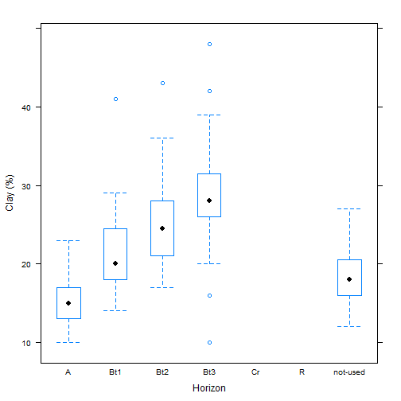

```r
# or

# boxplot(clay ~ genhz, xlab = "Master Horizon", ylab="Clay (%)", data = h)
```

Figure 9. Box plot of sand by horizon  

The xlab and ylab parameters control the titles of the x and y axis.  

This plot shows us that B horizons typically contain more sand than A horizons and that the median of sand in A horizons is around 23% and around 26% in B horizons.  

Notice that the boxplot for "range" has a single circle on the graph above it.  This indicates an outlier, or a value that is more than 1.5 x IQR.  You should evaluate this data point to ensure that the number measured and entered is correct.  

##<a id="qq")></a>4.5  Quantile comparison plots (QQplot)  

a plot of actual data values against a normal distribution (which has a mean of 0 and standard deviation of 1).  

A QQplot of sand content may be made for the sample dataset as: 


```r
qqnorm(h$clay, main = "Normal Q-Q Plot for Clay")
qqline(h$clay)
```

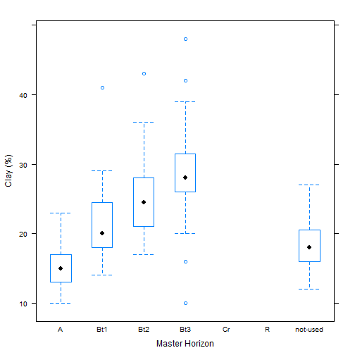

```r
qqnorm(h$total_frags_pct, main = "Normal Q-Q Plot for Rock Fragments")
qqline(h$total_frags_pct)
```


Figure 11. QQplot  

The line represents the quantiles of a normal distribution. If the data set is perfectly normal, the data points will fall along the line. Overall this plot shows that our clay example is more or less normally distributed. However the second plot shows again that our rock fragments are far from normally distributed.

A more detailed explanation of QQplots may be found on Wikipedia:  
[https://en.wikipedia.org/wiki/QQ_plot](https://en.wikipedia.org/wiki/Q%E2%80%93Q_plot)  

## <a id="transform")></a>4.6  Transformations


### <a id="circ")></a>4.6.1  Special cases - Circular data and pH

The two most common variables warranting special consideration for pedologists are:  

**Slope aspect** - requires the use of circular statistics for summarizing numerically, or graphical interpretation using circular plots. For example, if soil map units being summarized have a uniform distribution of slope aspects ranging from 335 degrees to 25 degrees, the Zonal Statistics tool in ArcGIS would return a mean of 180.  

The most intuitive means available for evaluating and describing slope aspect are circular plots available with the circular package in R and the radial plot option in the [TEUI](http://www.fs.fed.us/eng/rsac/programs/teui/downloads.html) Toolkit. The circular package in R will also calculate circular statistics like mean, median, quartiles etc.


```r
library(circular)

aspect <- s$aspect_field
aspect <- circular(aspect, template="geographic", units="degrees", modulo="2pi")

summary(aspect)
```

```
##        n     Min.  1st Qu.   Median     Mean  3rd Qu.     Max.      Rho 
##  59.0000  20.0000 277.5000 205.0000 209.4000 140.5000  28.0000   0.1765 
##     NA's 
##   4.0000
```

The numeric output is fine, but a following graphic is more revealing, which shows the dominant Southwest slope aspect.  


```r
rose.diag(aspect, bins = 8, col="grey")
```

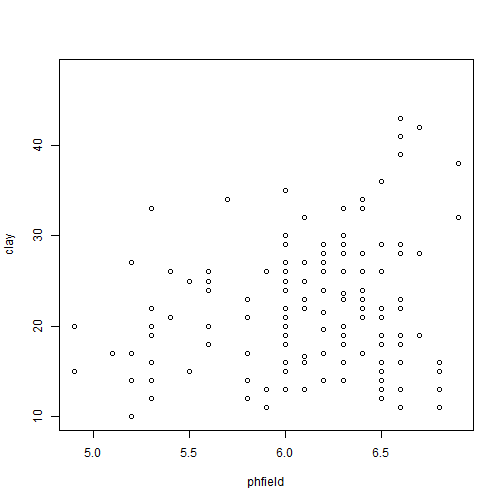

Figure 15. Rose Diagram  


**pH**  since pH is logarithmic, the use of median and quantile ranges are the [preferred](http://www.fao.org/docrep/field/003/AC175E/AC175E07.htm) measures when summarizing pH. Remember, pHs of 6 and 5 correspond to hydrogen ion concentrations of 0.000001 and 0.00001 respectively.  The actual average is 5.26;  -log(0.000001 + 0.00001/2). If no conversions are made for pH, the mean and sd in the summary are considered the geometric mean and sd, not the arithmetic. The wider the range of pH the greater the difference between the geometric and arithmetic mean becomes. The difference between the correct average of 5.26 and the incorrect of 5.5 is small, but proper handling of data types is a best practice.

If you have a table with pH values and wish to calculate the arithmetic mean using R, this example will work:  

-log10(mean(10^-datatbl$ph, na.rm=T))  

In this example, datatbl is the data object and ph is the column containing pH values.  

If there is a need to create a surface of pH values, i.e. interpolate values from point observations, the operation of determining values at unknown points is analogous to determining an average and the use of hydrogen ion concentration would be the proper input.  

If spatial interpolation is going to be performed, the following steps should be executed:  

 1. transform pH to the actual H+ concentration 
 2.	interpolate
 3.	back transform to log value

Here is a brief example for interpolating pH using common software:

1. Assume a comma delimited text file with pH, and x and y coordinates named "Excel_ph2.csv"
2.	Open the file in Excel and it looks similar to this:  
  
3.  Format a column as numeric with ~15 decimals and a header named H_concentration
4.	Enter a formula in the first empty cell as: =(1/10^B2) * 1000000
5.	Drag the cell down to all empty records, which results in a transformed H+concentration

 
This is a workaround for ArcGIS, which truncates data that is extremely small like the H+ concentration for pH > 7.  

6.  Bring the text file into ArcGIS as points using Make XY Event Layer

  

  

Opening the table for the Event layer:  

  

7. Interpolate using the interpolation method of choice - Spline will be used in this example    

  
  

8. The resulting values correspond to H+ concentration * 10<sup>6</sup>  

  

9. Convert values to pH using Raster Calculator  

  

10. The values now correspond to pH

  

##<a id="scat")></a>4.7  Scatterplots

Plotting points of one variable against another is a scatter plot. Plots can be produced for a single or multiple pairs of variables. It is assumed that these plots are for ratio or interval data types. Many independent variables are often under consideration in soil survey work. This is especially common when GIS is used, which offer the potential to correlate soil attributes with a large variety of raster datasets.  

The purpose of a scatterplot is to see how one variable relates to another. With modeling in general the goal is parsimony (i.e. simple). The goal is to determine the fewest number of variables required to explain or describe a phenomenon. If two variables explain the same thing, i.e. they are highly correlated, only one variable is needed. The scatterplot provides a perfect visual reference for this.

Create a basic scatter plot using the loafercreek dataset.


```r
xyplot(clay ~ phfield, data = h)
```

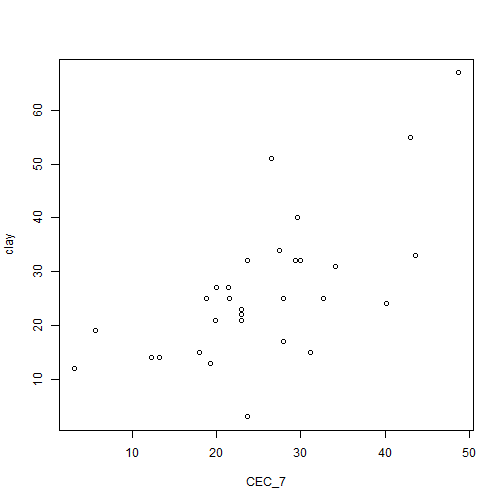

```r
# or

# plot(clay ~ phfield, data = h)
```

Figure 16. Scatter Plot

This plots clay on the Y axis and cation exchange capacity on the X axis. As shown in Figure 16, there is a strong correlation between these variables, as expected.  

The function below produces a scatterplot matrix for all the numeric variables in the sp4 dataset. This is a good command to use for determining rough linear correlations for continuous variables.  


```r
h$hzdepm <- with(h, (hzdepb - hzdept) /2)
vars <- c("hzdepm", "clay", "total_frags_pct", "phfield")

splom(h[vars])
```

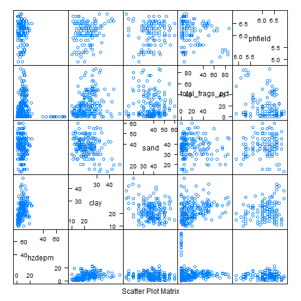

```r
# or

# pairs(h[vars])
```

##<a id="corr")></a>4.8  Correlation matrix  

A correlation matrix is a table of the calculated correlation coefficients of all variables. This provides a quantitative measure to guide the decision making process. The following will produce a correlation matrix for the sp4 dataset:  


```r
round(cor(h[vars], use = "complete.obs"), 2)
```

```
##                 hzdepm clay total_frags_pct phfield
## hzdepm            1.00 0.51            0.27    0.00
## clay              0.51 1.00            0.28    0.18
## total_frags_pct   0.27 0.28            1.00   -0.16
## phfield           0.00 0.18           -0.16    1.00
```

As seen in the output, variables are perfectly correlated with themselves and have a correlation coefficient of 1.0.  

What is considered highly correlated? A good rule of thumb is anything with a value of **0.7** or greater is considered highly correlated.  The scatterplot shows a tight, linear relationship between e00 and c00, which is corroborated with the correlation matrix showing a correlation coefficient of ~0.96.  

Negative values indicate a negative relationship between variables. In the case of pH80 and e80; as electrical conductivity increases, pH decreases. This is a strong negative correlation of ~ -0.85.  


##<a id="ref")></a>4.9 References  

FAO Corporate Document Repository. 
[http://www.fao.org/docrep/field/003/AC175E/AC175E07.htm](http://www.fao.org/docrep/field/003/AC175E/AC175E07.htm)    

Filliben, J. J. 2004. NIST/SEMATECH e-Handbook of Statistical Methods. [http://www.itl.nist.gov/div898/handbook/eda/section1/eda11.htm](http://www.itl.nist.gov/div898/handbook/eda/section1/eda11.htm])    

Lane, D.M. Online Statistics Education: A Multimedia Course of Study [(http://onlinestatbook.com/](http://onlinestatbook.com/) Project Leader: [David M. Lane](http://www.ruf.rice.edu/~lane/), Rice University

Seltman, H. 2009. Experimental Design and Analysis. Chapter 4: Exploratory Data Analysis. Carnegie Mellon University.  [http://www.stat.cmu.edu/~hseltman/309/Book/](http://www.stat.cmu.edu/~hseltman/309/Book/)    

TEUI. USFS, [http://www.fs.fed.us/eng/rsac/programs/teui/downloads.html](http://www.fs.fed.us/eng/rsac/programs/teui/downloads.html)   

Tukey, John. 1977. Exploratory Data Analysis, Addison-Wesley    

Tukey, J. 1980. We need both exploratory and confirmatory. The American Statistician, 34:1, 23-25  

Webster, R. 2001. Statistics to support soil research and their presentation. European Journal of Soil Science. 52:331-340. [http://onlinelibrary.wiley.com/doi/10.1046/j.1365-2389.2001.00383.x/abstract](http://onlinelibrary.wiley.com/doi/10.1046/j.1365-2389.2001.00383.x/abstract)


##<a id="add")></a>4.10 Additional reading

de Smith, M.J., 2015. STATSREF: Statistical Analysis Handbook: a web-based statistics
resource. The Winchelsea Press, Winchelsea, UK.  [http://www.statsref.com/HTML/index.html](http://www.statsref.com/HTML/index.html)  

Diez, D.M., Barr, C.D., and Cetinkaya-Rundel, M., 2015. OpenIntro Statistics. 3rd edition. openintro.org. [https://www.openintro.org/stat/](https://www.openintro.org/stat/)

Helsel, D.R., and R.M. Hirsch, 2002. Statistical Methods in Water Resources Techniques of Water Resources Investigations, Book 4, chapter A3. U.S. Geological Survey. 522 pages. [http://pubs.usgs.gov/twri/twri4a3/](http://pubs.usgs.gov/twri/twri4a3/)
