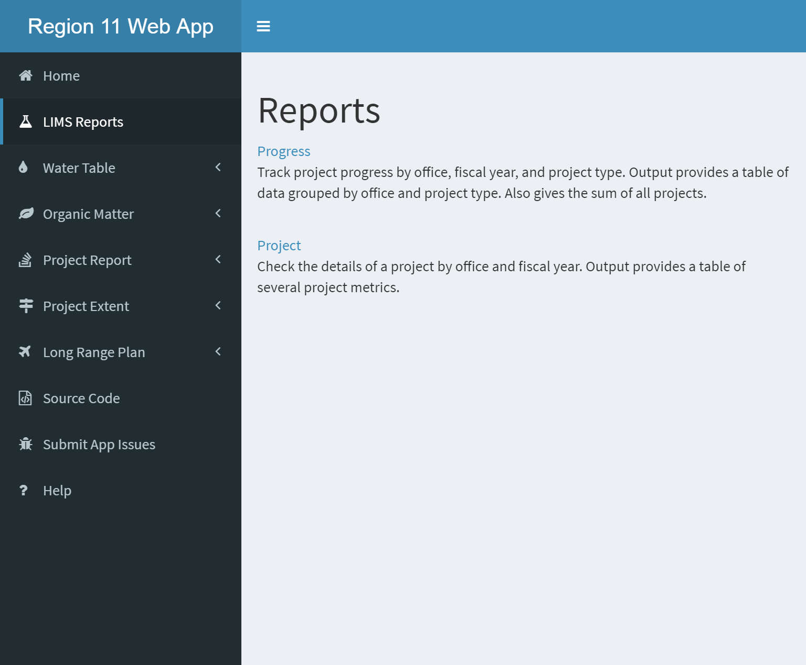
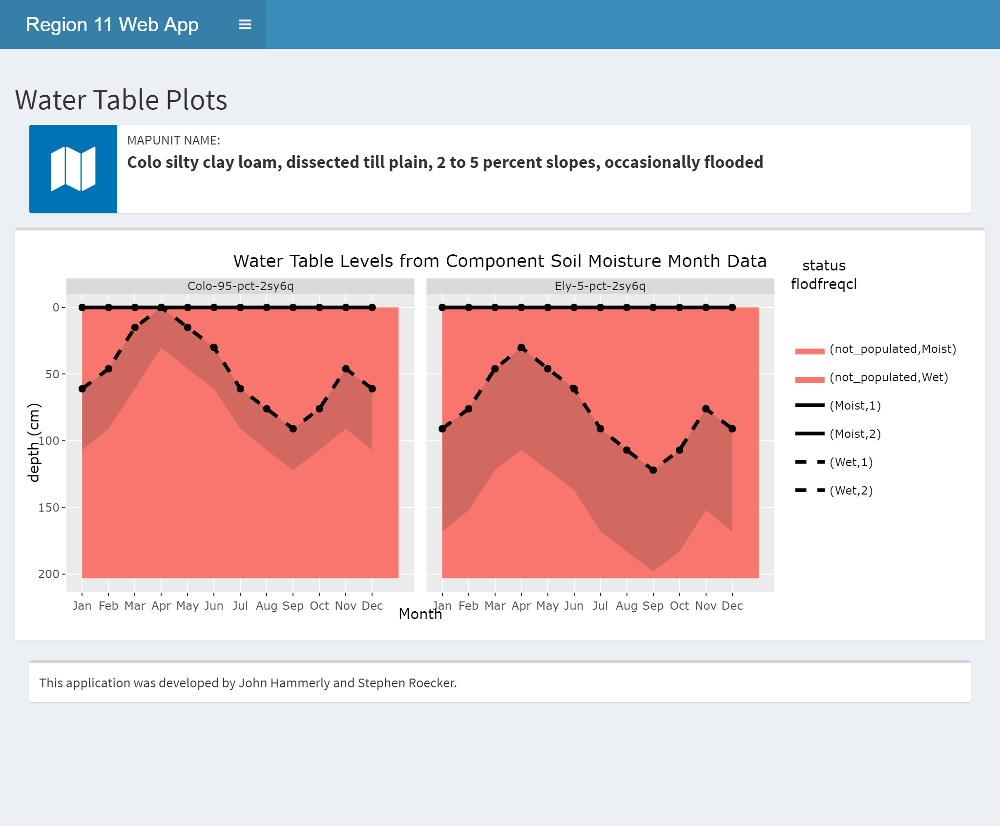
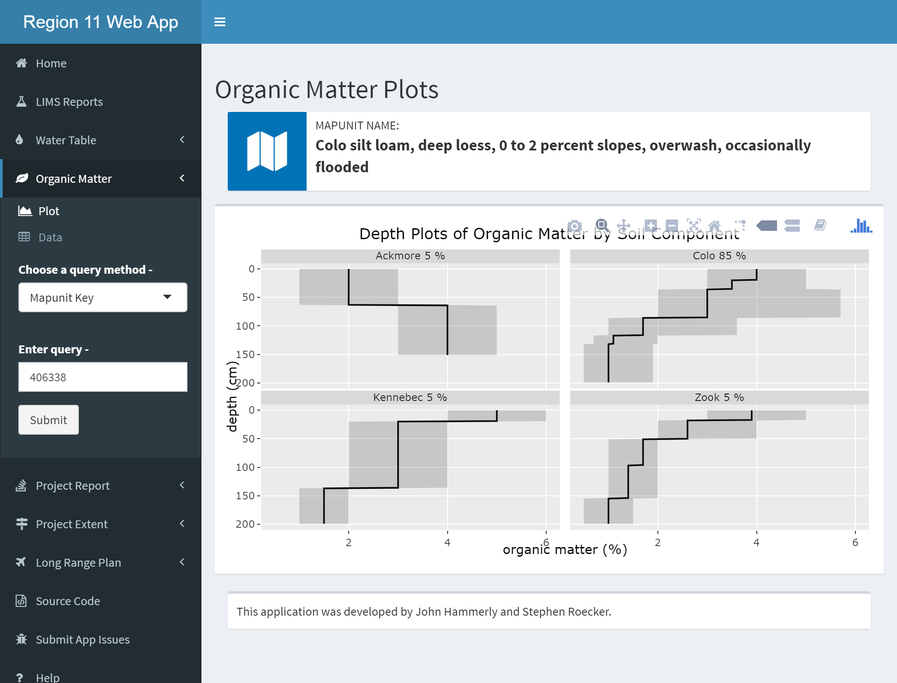
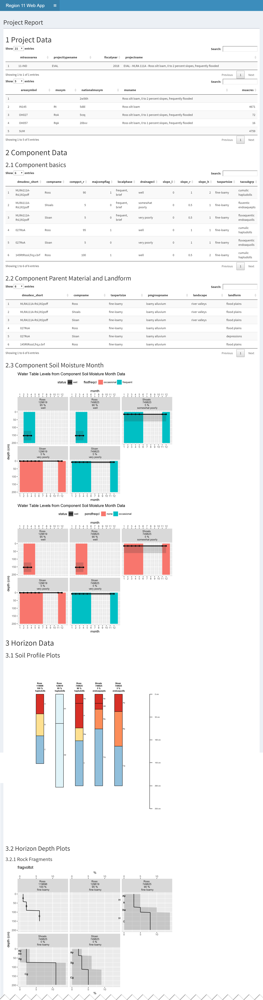
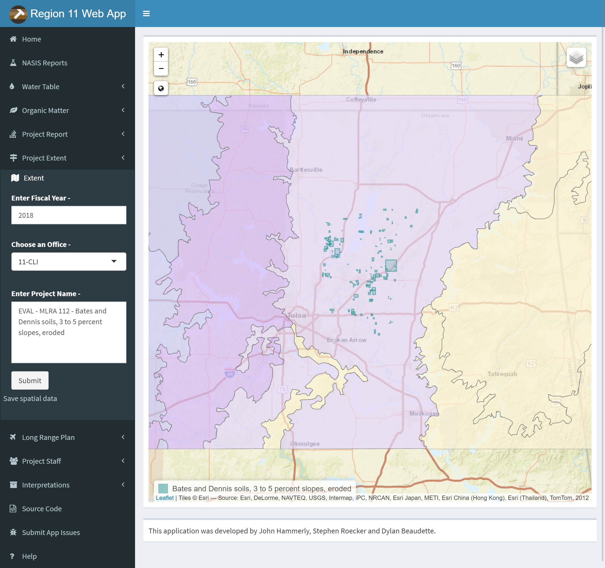
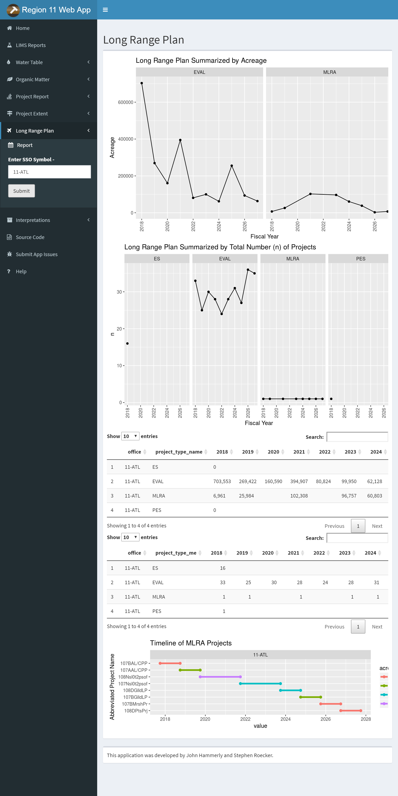
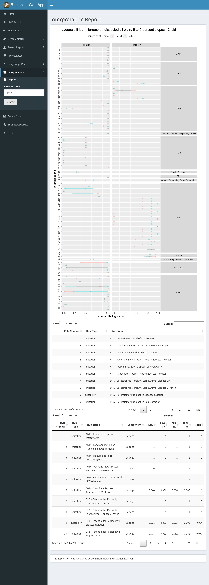

```{r setup, include=FALSE}
knitr::opts_chunk$set(echo = FALSE)
```

# The Shiny Package

Shiny is an R package which combines R programming with the interactivity of the web.

```{r, eval=FALSE, echo=TRUE, include=TRUE}
install.packages("shiny")
```

Methods for Use

- Online
- Locally

<div class="notes">
The shiny package, created by RStudio, enables users to not only use interactive applications created by others, but to build them as well.
</div>

## Online

Easiest Method

- Click a Link:  https://gallery.shinyapps.io/lake_erie_fisheries_stock_assessment_app/
- Open a web browser
- Navigate to a URL

<div class="notes">
The ability to use a shiny app online is one of the most useful features of the package.  All of the R code is executed on a remote computer which sends the results over a live http connection.  Very little is required of the user in order to obtain results.
</div>

## Locally

No Internet required once configured

- Install R and RStudio (done)
- Install Required packages (app dependent)
- Download, open in RStudio and click "Run App"

<div class="notes">
The online method may be easy for the user, but it does require a significant amount of additional effort for the creator. We won't get into those details here! The local method, however simply requires the creator to share a single app.R file.  It is the user which needs to put forth the additional effort.
</div>

# Web App Demonstration

Online:

- https://usda.shinyapps.io/r11_app

Local:

- https://github.com/ncss-tech/soil-pit/raw/master/sandbox/john/r11_smp_app/app.R

<div class="notes">
Online apps such as the Region 11 Web App are useful tools, available for all to use during soil survey, ecological site development, or other evaluations.  The Region 11 app is however limited to data which is already available online, such as SDA (Soil Data Access) and LIMS (Laboratory Information Management System).  It is also relient on the successful operation of those data systems.  If LIMS or SDA is down for maintanence, the app fails.
Local apps have the ability to leverage local data systems more easily like NASIS or other proprietary data.
</div>

## Troubleshooting Errors

1. Reload the app and try again. (refresh browser, or click stop, and run app again in RStudio) When the app throws an error, it stops. All other tabs/reports will no longer function until the app is reloaded.
2. Read the getting started section on the home page.  This is a quick summary of tips to avoid issues, and will be updated as needed.
3. Check to see if SDA and LIMS are operational, if they aren't working, then the app won't work either.
4. Double check your query inputs. (typos, wildcards, null data, and too much data, can be common issues)
5. 5 minutes of inactivity will cause the connection to drop, be sure you are actively using the app.
6. Run the app locally - the online app does not show console activity, which can be a big help when identifying problems.
7. Check the app issues page to see if the issue you are experiencing is already documented. (Polite but not required)
8. Contact the app author (john.hammerly@in.usda.gov)

<div class="notes">
When you run into trouble, there are a few steps you can take on your own to get things working again. This list may help you get your issue resolved. If not, contact me and I can assist.
</div>

# Shiny App Embedding


<iframe src="https://gallery.shinyapps.io/064-telephones-by-region?showcase=0", style="border:none; width: 900px; height: 500px">
</iframe>

<div class="notes">
Shiny apps are extremely versatile, they can be embedded into presentations, markdown, or html.  Those same formats can also be embedded in to a shiny app.  This is a very simple example of a shiny app which consists of an interactive dropdown menu which controls what region is displayed in the bar chart.  Let's take a look at the code.
</div>

## Shiny App Code

```{r, eval=FALSE, echo=TRUE, include=TRUE}
shinyApp(
  
  ui = 
# Rely on the 'WorldPhones' dataset in the datasets
# package (which generally comes preloaded).
library(datasets)

# Use a fluid Bootstrap layout
fluidPage(    
  
  # Give the page a title
  titlePanel("Telephones by region"),
  
  # Generate a row with a sidebar
  sidebarLayout(      
    
    # Define the sidebar with one input
    sidebarPanel(
      selectInput("region", "Region:", 
                  choices=colnames(WorldPhones)),
      hr(),
      helpText("Data from AT&T (1961) The World's Telephones.")
    ),
    
    # Create a spot for the barplot
    mainPanel(
      plotOutput("phonePlot")  
    )
    
  )
)
  server = 
# Rely on the 'WorldPhones' dataset in the datasets
# package (which generally comes preloaded).
library(datasets)

# Define a server for the Shiny app
function(input, output) {
  
  # Fill in the spot we created for a plot
  output$phonePlot <- renderPlot({
    
    # Render a barplot
    barplot(WorldPhones[,input$region]*1000, 
            main=input$region,
            ylab="Number of Telephones",
            xlab="Year")
  })
}
)
```

<div class="notes">
Shiny apps consist of a *ui* and a *server*. The ui is the part of the shiny app the user sees, the user interface.  In the ui, a user can choose or enter inputs for processing and view the results.  The server takes the inputs, performs some data processing and rendering of those inputs and generates the outputs for the ui to display.
</div>

# Questions

1. What new features in RStudio are available for you to use once the shiny package is installed?

2. The Region 11 Web App uses which 2 data sources for its reports?

3. If an error occurs while using the Region 11 Web App, what should you do?

4. Poll:  A shiny app consists of:


# Examples

## LIMS Reports


These three reports are provided on this page as direct links to the LIMS reports.

## Water Table



The query method option allows you to choose between MUKEY, NATSYM, MUNAME.   It also has a radio button for switching between flooding and ponding.

Plots and Data Tables are on separate sub-menu items.

## Organic Matter


Same options as the Water Table Tab except no radio button.  The query method option allows you to choose between MUKEY, NATSYM, MUNAME.

Plots and Data Tables are on separate sub-menu items.

## Project Report

The project report can accept multiple projects. Use the semicolon (;) as a separator. You can also save a copy of the report by clicking the link below the submit button.



## Project Extent



Type in Year, type or select office and type project name for the Project extent query. Zoom and pan to view extent.  Use the layers button to change the basemap or toggle layers.  Click the link below the submit button to download a .zip containing the extent as a ESRI shapefile.

## Long Range Plan



Enter an office symbol to generate a long range plan report.

##Interpretations



Enter the national mapunit symbol to plot all available interpretations for the mapunit from SDA.

# Work on your Own

##Project Report

Use the project report to generate a report on a project in your own area.  Save the results and explain the results of pH plots for one of your components.

## Project Extent

Map an extent of a project.  How many layers are available to choose from as a basemap? How many layers can be toggled on or off?

## Long Range Plan

Choose an office to generate a long range plan.  What is the highest acreage project for 2025?


# References