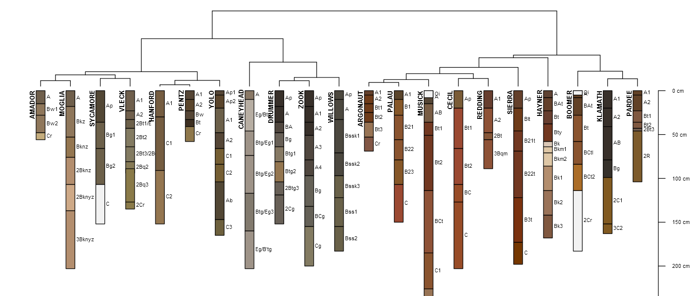

```{r setup, echo=FALSE, results='hide', warning=FALSE, message=FALSE}
# setup
library(knitr, quietly=TRUE)
library(printr, quietly=TRUE)
opts_chunk$set(message=FALSE, warning=FALSE, background='#F7F7F7', fig.align='center', fig.retina=2, dev='png', tidy=FALSE, verbose=FALSE, antialias='cleartype', cache=FALSE)

# options for R functions
options(width=100, stringsAsFactors=FALSE)

# captions added to figures
knit_hooks$set(htmlcap = function(before, options, envir) {
  if(!before) {
    paste('<p class="caption" style="font-size:85%; font-style: italic; font-weight: bold;">',options$htmlcap,"</p><hr>",sep="")
    }
    })

# compaire pair-wise distances between 3 individuals
distPlot <- function(ex, vars, individuals, id, scale.data=FALSE, show.distances=TRUE, ...) {
  par(mar=c(5,5,1,1))
  # optionally scale
  if(scale.data) {
    ex.scaled <- scale(ex[, vars], center = TRUE, scale = TRUE)
    ex[[vars[1]]] <- ex.scaled[, 1]
    ex[[vars[2]]] <- ex.scaled[, 2]
  }
    
  
  x.data <- ex[[vars[1]]]
  y.data <- ex[[vars[2]]]
  
  d <- dist(ex[, vars])
  m <- round(as.matrix(d), 1)
  dimnames(m) <- list(ex[[id]], ex[[id]])
  
  plot(ex[[vars[1]]], ex[[vars[2]]], las=1, type='n', ...)
  # plot(x.data, y.data, las=1, type='n')
  grid()
  
  if(show.distances) {
    arrows(x.data[individuals[1]], y.data[individuals[1]], x.data[individuals[2]], y.data[individuals[2]], lwd=2, col='RoyalBlue', length = 0.1, code = 3)
    arrows(x.data[individuals[3]], y.data[individuals[3]], x.data[individuals[2]], y.data[individuals[2]], lwd=2, col='Orange', length = 0.1, code = 3)
    
    segments(x.data[individuals[3]], y.data[individuals[3]], x.data[individuals[3]], y.data[individuals[2]], lwd=1, lty=2, col='Orange')
    segments(x.data[individuals[3]], y.data[individuals[2]], x.data[individuals[2]], y.data[individuals[2]], lwd=1, lty=2, col='Orange')
    segments(x.data[individuals[1]], y.data[individuals[1]], x.data[individuals[2]], y.data[individuals[1]], lwd=1, lty=2, col='RoyalBlue')
    segments(x.data[individuals[2]], y.data[individuals[1]], x.data[individuals[2]], y.data[individuals[2]], lwd=1, lty=2, col='RoyalBlue')
    
    legend('topright', legend=c(m[individuals[1], individuals[2]], m[individuals[3], individuals[2]]), col=c('RoyalBlue', 'Orange'), lty=1, lwd=2, bty='n', title = 'Distance', cex=1.5)
  }
  
  text(x.data, y.data, ex[[id]], col='black', cex=1.5, font=1, pos = 4)
  points(x.data, y.data, pch=16, col='black', cex=0.75)
  
  return(m)
}

# load libs for examples
library(aqp)
library(cluster)
library(ape)
library(RColorBrewer)
library(MASS)
```

<!-- This document is based on `aqp` version `r utils::packageDescription("aqp", field="Version")` and `sharpshootR` version `r utils::packageDescription("sharpshootR", field="Version")`. -->

<hr>
<span style="font-size:200%">Before You Start</span><br>
Some of the examples in this document depend on the latest versions of the `aqp` and `sharpshootR` packages. Open a fresh RStudio session and paste the following in the console panel:

```{r, eval=FALSE}
install.packages("aqp", repos="http://R-Forge.R-project.org", type="source")
install.packages("sharpshootR", repos="http://R-Forge.R-project.org", type="source")
```
<hr><br>

# Introduction

Nearly every aspect of soil survey involves the question: "*is A more similar to B or to C?*". The quantification of *similarity* within a collection of horizons, pedons, components, map units, or even landscapes represents an exciting new way to enhance the precision and accuracy of our day to day work. After completing this module you should be able to *quantitatively* organize objects based on measured or observed characteristics of those objects in a consistent and repeatable manner. Perhaps you will find a solution to the long-standing "similar / dissimilar" question.




## Objectives
* Learn essential vocabulary used in the field of numerical taxonomy, review some of the literature
* Gain experience with R functions and packages commonly used for clustering / ordination
* Learn how to create and interpret a distance matrix, and appropriate distance metrics
* Learn how to create and interpret a dendrogram
* Lean the basics and application of hierarchical clustering methods
* Lean the basics and application of partitioning clustering methods
* Learn the basics and application of ordination methods
* Apply skills to a range of soil, vegetation, and similar data sources
* Apply techniques from numerical taxonomy to addressing the "similar/dissimilar" question
* Learn some strategies for coping with missing data

# Whirlwind tour

Most of the examples featured in the whirlwind tour are based on soil data from [McGahan, D.G., Southard, R.J, Claassen, V.P. 2009. Plant-Available Calcium Varies Widely in Soils on Serpentinite Landscapes. Soil Sci. Soc. Am. J. 73: 2087-2095.](https://dl.sciencesocieties.org/publications/sssaj/articles/73/6/2087). These data are available in the `aqp` built-in dataset "sp4".

## Similarity, disimilarty, and distance

There are shelves of books and many thousands of academic articles describing the theory and applications of "clustering" and "ordination" methods. This body of knowledge is commonly described as the field of **numerical taxonomy** [@Sneath1973]. Central to this field is the quantification of *similarity* among "individuals" based on a relevant set of "characteristics". Individuals are typically described as rows of data with a single characteristic per column, together referred to as the **data matrix**. For example:

```{r, echo=FALSE}
data('sp4', package = 'aqp')
sp4 <- sp4[1:4, c('name', 'clay', 'sand', 'Mg', 'Ca', 'CEC_7')]
knitr::kable(sp4, align = 'c')
```

Quantitative measures of similarity are more conveniently expressed as distance, or dissimilarity--this is part convention and part computational simplicity. In the simplest case, dissimilarity can be computed as the shortest distance between individuals in property-space. Another name for the shortest linear distance between points is the [**Euclidean distance**](https://en.wikipedia.org/wiki/Euclidean_distance). Evaluated in two dimensions, between individuals $p$ and $q$ the Euclidean distance is calculated:

$$D(p,q) = \sqrt{(p_{1} - q_{1})^{2} + (p_{2} - q_{2})^{2}}$$

where $p_{1}$ is the 1st characteristic (or dimension) of individual $p$. There are many other ways to define "distance" (e.g. *distance metrics*), but we will cover those later.

Using sand and clay percentages from the data above, dissimilarity is represented as the length of the line connecting any two individuals in property space:

```{r, echo=FALSE, fig.width=5, fig.height=5}
m <- distPlot(sp4, vars=c('sand', 'clay'), individuals=c(1,2,4), id='name', xlim=c(10, 60), ylim=c(10, 60), xlab='Sand (%)', ylab='Clay (%)')
```

A matrix of all pair-wise distances (the [**distance matrix**](https://en.wikipedia.org/wiki/Distance_matrix)) looks something like this:

|    |    A|  ABt|  Bt1|  Bt2|
|:---|----:|----:|----:|----:|
|A   |  0.0|  <b>7.2</b>| 12.5| 38.9|
|ABt |  <b>7.2</b>|  0.0|  5.4| <b>31.8</b>|
|Bt1 | 12.5|  5.4|  0.0| 26.4|
|Bt2 | 38.9| <b>31.8</b>| 26.4|  0.0|

Note that this is the "full" form of the [**distance matrix**](https://en.wikipedia.org/wiki/Distance_matrix), with 0s on the diagonal (e.g. the distance between individual 'A' and itself is 0) and upper and lower "triangles" symmetric. The lower triangle is commonly used by most algorithms to encode pair-wise distances.

|    |    A|  ABt|  Bt1|
|:---|----:|----:|----:|
|ABt |  <b>7.2</b>|  |  |
|Bt1 | 12.5|  5.4|  |
|Bt2 | 38.9| <b>31.8</b>| 26.4|

Interpretation is simple: individual "A" is more like "ABt" than "Bt1". It is important to note that quantification of dissimilarity (distance) among individuals is always relative: *"X is more like Y, as compared to Z"*. More on this later.


## Standardization of characteristics

Euclidean distance doesn't make much sense when characteristics do not share a common unit of measure, range of values, or when some characteristics are categorical vs. continuous. For example, distances are distorted when computed from clay (%) and exchangeable Ca (cmol/kg):

```{r, echo=FALSE, fig.width=5, fig.height=5}
m <- distPlot(sp4, vars=c('Ca', 'clay'), individuals=c(1,2,4), id='name', xlim=c(0, 60), ylim=c(0, 60), xlab='Exchangeable Ca (cmol/kg)', ylab='Clay (%)')
```

In this example, exchangeable Ca contributes less to the distance between individuals than clay content, effectively down-weighting the importance of Ex-Ca. Typically, characteristics are given equal weight [@Sneath1973], however weighting is much simpler to apply after **standardization**.

**Standardization** of the data matrix solves the problem of unequal ranges or units of measure, typically by subtraction of the mean and division by standard deviation:

$$x_{std} = \frac{x - mean(x)}{sd(x)}$$

There are many other **standardization** methods which we will cover later. The new data matrix looks like this:

```{r, echo=FALSE, fig.width=5, fig.height=5}
sp4.scaled <- data.frame(name=sp4[, 1], round(scale( sp4[, -1]), 2))
sp4.scaled
```

Using the standardized data matrix, distances computed in the property space of clay and exchangeable calcium are unbiased by the unique central tendency or spread of each character.

```{r, echo=FALSE, fig.width=5, fig.height=5}
m <- distPlot(sp4, vars=c('Ca', 'clay'), individuals=c(1,2,4), id='name', scale=TRUE, xlim=c(-1.5, 1.5), ylim=c(-1.5, 1.5), xlab='Exchangeable Ca (cmol/kg)', ylab='Clay (%)')
```

It is rare that the question of "dissimilarity" can be answered with only two characteristics (dimensions). Euclidean distance can be extended to an arbitrary number of $n$ dimensions:

$$D(p,q) = \sqrt{ \sum_{i=1}^{n}{(p_{i} - q_{i})^{2}} }$$

where $i$ is one of $n$ total characteristics. It is hard to imagine what distance "looks like" when there are > 3 dimensions, so lets look at the distance matrix calculated using all five characteristics.

```{r, echo=FALSE, fig.width=5, fig.height=5}
d <- dist(sp4.scaled[, -1])
m <- as.matrix(d)
dimnames(m) <- list(sp4.scaled$name, sp4.scaled$name)
round(m, 2)
```

We can now begin to describe dissimilarity between individuals using an arbitrary number of (relevant!) characteristics and make statements like "The A horizon is roughly 2x more similar to the ABt horizon than it is to the Bt horizon". While this may be a trivial example, the utility of generalizing these methods to soil survey operations should be obvious.

### Review and discuss

 * What is are the "data matrix" and "distance matrix"?
 * What is standardization and why is it important?
 * What do you think is the largest impediment to creating a distance matrix from our NASIS and KSSL data?
 * **Key point:** each characteristic is its own *dimension* in property-space:
     + {sand, clay, CEC} = 3 dimensions
     + {sand, clay, CEC, OC, horizon depth} = 5 dimensions
     + ... simple to define in code, but hard to visualize
   

## Quick detour: missing data

Missing data are a fact of life. As soil scientists, we are quite familiar with KSSL data missing something (*"why didn't we request optical grain counts?"*) or NASIS pedon data that are missing essential data elements such as horizon bottom depth, estimated clay fraction, or pH. Nearly all of the methods described in this document are very sensitive to missing data--in other words, they won't work! There are a couple of solutions:

 * "fix" the missing data if at all possible
 * "estimate" the missing data values from know relationships to other properties or group-wise mean/median
 * remove records containing any missing data before proceeding


## Visualizing pair-wise distances: the dendrogram

[Dendrograms](http://en.wikipedia.org/wiki/Dendrogram) are a convenient way of visualizing [pair-wise distances](http://hymenoptera.tamu.edu/courses/ento601/pdf/Sokal_1966.pdf) among individuals from a distance matrix. Dissimilarity between branches is proportional to the level at which branches merge: branching at higher levels (relative to the root of the tree) suggests greater dissimilarity, branching at lower levels suggests greater similarity. Consider the previous example, where distance between individuals was defined in terms of sand and clay percentages:

```{r, echo=FALSE, fig.width=10, fig.height=5}
par(mar=c(1,1,1,0), mfcol=c(1,2))

m <- distPlot(sp4, vars=c('sand', 'clay'), individuals=c(1,2,4), id='name', show.distances=FALSE, xlim=c(10, 60), ylim=c(10, 60), xlab='Sand (%)', ylab='Clay (%)')
d <- as.dist(m)
dd <- diana(d)
h <- as.hclust(dd)
p <- as.phylo(h)

plot(p, font=2, label.offset=0.5, adj=0.5, direction='down', srt=90)
# axis(2, las=1, line=1.5)
mtext('Dendrogram Representation of Distance Matrix\n(sand and clay %)', side=1, line=2)
```

Interpretation is simple. Euclidean distance in property-space is directly proportional to branching height in the corresponding dendrogram. Visualizing the geometry of pair-wise distances in > 3 dimensions is difficult, however, a the dendrogram can conveniently summarize a distance matrix created from an arbitrary number of characteristics. It is important to note that some information about pair-wise distances is lost in the dendrogram in the form of distortion: distortion is greatest near the terminal "leaves" of the dendrogram. This phenomena is analogous to the distortion generated by a map projection--it is impossible to flatten a higher-dimensional entity to a lower-dimensional form without causing distortion.

```{r, echo=FALSE, fig.width=10, fig.height=4}
par(mfcol=c(1,2))

d <- dist(sp4.scaled[, -1])
m <- as.matrix(d)
dimnames(m) <- list(sp4.scaled$name, sp4.scaled$name)
d <- as.dist(m)
dd <- diana(d)
h <- as.hclust(dd)
p.all <- as.phylo(h)

plot(p, font=2, label.offset=0.5, adj=0.5, direction='down', srt=90)
axis(2, las=1, line=1.5)
mtext('Dendrogram Representation of Distance Matrix\n(sand and clay %)', side=1, line=2)

plot(p.all, font=2, label.offset=0.5, adj=0.5, direction='down', srt=90)
axis(2, las=1, line=1.5)
mtext('Dendrogram Representation of Distance Matrix\n(all characteristics, standardized)', side=1, line=2)
```

There isn't much difference between these two figures, because most of the characteristics in this example dataset are highly correlated with soil texture. There are some more important details on how individuals are connected into larger and larger groups within the dendrogram, more on this later.


### Review and discuss
 * Any questions about dendrogram interpretation? They will be used extensively in this chapter.
 * If you were explaining how to interpret a dendrogram to someone, where would you start: roots or leaves? Why?


## Cluster analysis: finding groups in data
[**Cluster analysis**](https://en.wikipedia.org/wiki/Cluster_analysis) is a massive topic that deals with the seemingly simple task of finding "useful" groups within a dataset. This topic and the methods used are also referred to as "unsupervised classification" in remote sensing and GIS circles. All of the available algorithms will find groups in a give dataset, however, it is up to the subject expert to determine:
 
 1. suitable characteristics and standardization method
 2. appropriate clustering algorithm
 3. criteria used to determine the "right" number of clusters
 4. interpretation of the final grouping based on subject knowledge
 5. &rarr; *possibly starting over at step 1...*

### Using color to communicate the results of a clustering or ordination exercise
Note that the widespread use of color in the following examples are not aesthetic. Colors are convenient for tri-variate data-spaces because our eyes can automatically integrate the information into a self-consistent set of classes.

### Hierarchical clustering
This form of clustering is useful when a the full **distance matrix** is available, and the optimal number of clusters is not yet known. [**Hierarchical clustering**](https://en.wikipedia.org/wiki/Hierarchical_clustering) creates a data structure that can encode "grouping" information from 1 cluster to as many clusters as there are individuals. It is up to the expert to determine the optimal place to "cut the tree" and generate a fixed set of clusters. The results from a [**hierarchical clustering**](https://en.wikipedia.org/wiki/Hierarchical_clustering) operation are nearly always presented in the form of a dendrogram.

```{r, echo=FALSE, results='hide', fig.width=10, fig.height=4}
# re-make data, this time with all profiles
data('sp4', package = 'aqp')
sp4 <- sp4[, c('name', 'clay', 'sand', 'Mg', 'Ca', 'CEC_7')]
sp4.scaled <- data.frame(name=sp4[, 1], round(scale( sp4[, -1]), 2))

# distance matrix
d <- dist(sp4.scaled[, -1])
m <- as.matrix(d)
dimnames(m) <- list(sp4.scaled$name, sp4.scaled$name)
d <- as.dist(m)
# dendrogram from divisive clustering
dd <- diana(d)
h <- as.hclust(dd)
p <- as.phylo(h)

# define colors based on natural groupings
cols <- brewer.pal(9, 'Set1')[cutree(h, 4)]

par(mar=c(0,0,0,0), mfcol=c(1,2))
plot(p, label.offset=0.125, direction='right', font=1, cex=0.85)
abline(v=2.3, col='orange', lty=2, lwd=2)
# mtext('Dendrogram Representation of Distance Matrix\n(all characteristics, standardized)', side=1, line=1)

plot(p, label.offset=0.125, direction='right', font=1, cex=0.85)
abline(v=2.3, col='orange', lty=2, lwd=2)
tiplabels(pch=15, col=cols)
# mtext('Dendrogram Representation of Distance Matrix\n(all characteristics, standardized)', side=1, line=1)
```

#### Methods

There are two main types of [**hierarchical clustering**](https://en.wikipedia.org/wiki/Hierarchical_clustering):

 * **agglomerative**: start with individuals and iteratively combine into larger and larger groups
 * **divisive**: start with all individuals and iteratively split into smaller and smaller groups

Both methods are strongly influenced by choice of **standardization** method and **distance metric**. Both methods require a full, pair-wise distance matrix as input. This can limit [**hierarchical clustering**](https://en.wikipedia.org/wiki/Hierarchical_clustering) to datasets that can be fit into memory.

The agglomerative methods also depends on the choice of a [**linkage criterion**](https://en.wikipedia.org/wiki/Hierarchical_clustering#Linkage_criteria). Some of these criteria include:

 * single linkage
 * complete linkage
 * Ward's method
 * weighted average linkage
 * flexible linkage

More on these criteria later.

##### Review and discuss
 * The simplicity and lack of decisions make the **divisive** method convenient for most work. 
 * The top-down approach is similar to the way in which we describe soil morphology and taxonomy.
 * Method selection: think about it, don't go "fishing".


### Centroid / medoid (partitioning) clustering
This form of cluster analysis is commonly referred to as [**k-means**](https://en.wikipedia.org/wiki/K-means_clustering)-style analysis, however, the name "k-means" is one of many possible clustering algorithms that partition property-space into a *fixed* number of groups. These type of algorithms can be applied to very large datasets because they do not rely on the **distance matrix**. Rather, they are based on an iterative shuffling of group "centroids" until some criterion is minimized--for example, the mean variance within groups.

```{r, echo=FALSE, results='hide', fig.width=6, fig.height=6}
# re-make data, this time with all profiles
data('sp4', package = 'aqp')
sp4 <- sp4[, c('name', 'Mg', 'Ca')]
sp4.scaled <- data.frame(name=sp4[, 1], round(scale( sp4[, -1]), 2))

# use pam to generate 3 clusters
cl <- pam(sp4.scaled[, -1], k = 3, stand = FALSE)

# use kmeans to generate centroids for demo
km <- kmeans(sp4.scaled[, -1], 3, nstart = 10, iter.max = 100)

# define colors based on hard clustering
col.set <- brewer.pal(9, 'Set1')
cols <- col.set[cl$clustering]

# setup plot
par(mar=c(4,4,0,0))
plot(sp4.scaled$Mg, sp4.scaled$Ca, asp=1, ylab='Exchangeable Mg (cmol/kg), Standardized', xlab='Exchangeable Ca (cmol/kg), Standardized', type='n')
abline(h=0, v=0, col='black')
grid()

# add k-means centroids
points(km$centers[, 1], km$centers[, 2], cex=2, lwd=1, pch=8, col='black')

# add medoids
points(cl$medoids, col=col.set, lwd=2, cex=3, pch=0, lend=2)

# add original obs
points(sp4.scaled$Mg, sp4.scaled$Ca, bg=cols, col='black', cex=1.25, pch=21)

# legend
legend('topright', legend=c('Observation', 'Medoid', 'Centroid'), pch=c(21, 0, 8), lwd=c(1, 2, 1), pt.cex=c(1.25, 3, 2), lty=NA, bty='n', cex=1.25)
```

#### Methods

We will be discussing three (out of many) of the most important **partitioning** type algorithms:

 * [**k-means**](https://en.wikipedia.org/wiki/K-means_clustering): groups of individuals are partitioned around newly created "[centroids](https://en.wikipedia.org/wiki/Centroid)"
 * [**k-medoids**](https://en.wikipedia.org/wiki/K-medoids): groups of individuals are partitioned around selected "[medoids](https://en.wikipedia.org/wiki/Medoid)"
 * [**fuzzy clustering**](https://en.wikipedia.org/wiki/Fuzzy_clustering): individuals are assigned a "fuzzy membership" value for each partition or property-space

All of these methods are sensitive to the type of **standardization** that has been applied to characteristics. These methods rely on iterative minimization of one or more criteria, therefore each clustering "run" may generate slightly different output. Most implementations will re-run the algorithm until it stabilizes. More on this later.


##### Review and discuss

 * What is the difference between a "medoid" and a "centroid"? Can you think of a way in which both concepts could be applied to the grouping of soils data? 
 * Fuzzy clustering is also referred to as "soft clustering", while the other two methods as "hard clustering". Sometimes using both can be helpful, especially for cases where individuals straddle the line between groups.


## Ordination: visualization in a reduced space
Humans are generally quite good at extracting spatial patterns, almost instantly, from two dimensional fields: faces, written language, etc. Sadly, this ability does not extend beyond two or three dimensions. The term [**ordination**](https://en.wikipedia.org/wiki/Ordination_(statistics)) refers to a suite of methods that project coordinates in a high-dimensional space into suitable coordinates in a low-dimensional (reduced) space. Map projections are a simple form of ordination: coordinates from the curved surface of the Earth are projected to a two-dimensional plane. As with any projection, there are assumptions, limitations, and distortion.

[**Principal component analysis**](https://en.wikipedia.org/wiki/Principal_component_analysis) is one of the simplest and most widely used ordination methods. The reduced space ("principal components") are defined by linear combinations of characteristics. For the rest of this document, we will be focusing on [**multidimensional scaling**](https://en.wikipedia.org/wiki/Multidimensional_scaling) (MDS). "Non-metric" [**multidimensional scaling**](https://en.wikipedia.org/wiki/Multidimensional_scaling) (nMDS) ordination methods attempt to generate a reduced space that minimizes distortion in *proportional similarity*: similar individuals are near each other in the reduced space, dissimilar individuals are farther apart.


### An example of nMDS applied to soil data
The following example is based on a *data matrix* containing lab measured clay fraction, sand fraction, exchangeable Ca, exchangeable Mg, and CEC measured by NH4-Ac at pH 7.

|name |  clay|  sand|    Mg|    Ca| CEC_7|
|:----|-----:|-----:|-----:|-----:|-----:|
|A    | -0.41|  0.21|  0.06|  0.44| -0.23|
|ABt  |  0.04| -0.07| -0.06| -0.13| -0.38|
|Bt1  |  0.41| -0.21| -0.09| -0.74| -0.16|
| <b>...</b>  |  <b>...</b>| <b>...</b>| <b>...</b>| <b>...</b>| <b>...</b>|


```{r, echo=FALSE, results='hide', fig.width=10, fig.height=5}
# re-make data, this time with all profiles
data('sp4', package = 'aqp')
sp4 <- sp4[, c('name', 'clay', 'sand', 'Mg', 'Ca', 'CEC_7')]
sp4.scaled <- data.frame(name=sp4[, 1], round(scale( sp4[, -1]), 2))

# distance matrix
d <- dist(sp4.scaled[, -1])
m <- as.matrix(d)
dimnames(m) <- list(sp4.scaled$name, sp4.scaled$name)
d <- as.dist(m)
# dendrogram from divisive clustering
dd <- diana(d)
h <- as.hclust(dd)
p <- as.phylo(h)

# define colors based on natural groupings
cols <- brewer.pal(9, 'Set1')[cutree(h, 4)]

# MDS
s <- MASS::sammon(d)

par(mar=c(3,0,0,3), mfcol=c(1,2))
plot(p, label.offset=0.125, direction='right', font=1, cex=0.85)
tiplabels(pch=15, col=cols)
abline(v=2.3, col='orange', lty=2, lwd=2)
mtext('Dendrogram Representation of Distance Matrix\n(all characteristics, standardized)', side=1, line=1)

plot(s$points, asp=1, type='n', axes=FALSE, xlab='', ylab='')
# abline(v=0, h=0, col='black')
grid()
text(s$points, rownames(s$points), cex=0.75, col=cols, font=2)
axis(1, cex.axis=0.95, line=-2)
axis(4, cex.axis=0.95, line=0.5, las=1)
mtext('Ordination of Distance Matrix\n(all characteristics, standardized)', side=1, line=1)
```

```{r, echo=FALSE, results='hide', fig.width=10, fig.height=4}
# re-init sp4, copy clustering colors to hz attribute
data('sp4', package = 'aqp')
sp4$cl <- cols
depths(sp4) <- id ~ top + bottom

par(mar=c(0,0,0,0))
plot(sp4, color='cl', cex.names=0.75)
title('Clustering Results in Context', line=-3)
```


## Review and discuss

* Which visualization of the **distance matrix** was simpler to interpret: dendrogram or ordination by nMDS?
* Any questions about the figures?
* Any guesses on what the clusters represent?


## Pair-wise distances between soil profiles?

```{r, fig.width=8, fig.height=4, echo=FALSE}
library(sharpshootR)
# init example data
data(sp4)
depths(sp4) <- id ~ top + bottom

# eval dissimilarity:
# using Ex-Ca:Mg and CEC at pH 7
# with no depth-weighting (k=0)
# to a maximum depth of 40 cm
d <- profile_compare(sp4, vars=c('ex_Ca_to_Mg', 'CEC_7'), k=0, max_d=40)

# cluster via divisive method
clust <- diana(d)

# vizualize dissimilarity matrix via hierarchical clustering
par(mar=c(0,0,3,0))
plotProfileDendrogram(sp4, clust, dend.y.scale = max(d), scaling.factor = (1/max(d) * 10), y.offset = 2, width=0.15, cex.names=0.45, color='ex_Ca_to_Mg', col.label='Exchageable Ca to Mg Ratio')
```

This is a complex topic, lets switch over to a [relevant set of slides](https://r-forge.r-project.org/scm/viewvc.php/*checkout*/docs/presentations/AQP-num_soil_classification.pdf?root=aqp).

If you are hungry for more detailed information, have a look at this [relevant paper](http://dx.doi.org/10.1016/j.cageo.2012.10.020).


## Final discussion
 * missing data strategy
 * meaningful characteristics
 * standardization of characteristics
 * distance metric
 * clustering algorithm
 * number of clusters
 * **application to soil survey and ESD**
 

# Excercises
This is the fun part.

## Setup the R session
Install R packages as needed. Open a new R script file to use as you follow along.
```{r, results='hide'}
# load libraries
library(aqp)
library(soilDB)
library(sharpshootR)
library(cluster)
library(ape)
library(RColorBrewer)
library(vegan)
library(MASS)
library(colorspace)

# annoying workaround for downloading files from HTTPS links on Windows...
if(.Platform$OS.type != 'unix')
  setInternet2(TRUE)
```

### Data sources

Most of the examples used in the following exercises come from the following sources:

1. built-in data sets from the `aqp` and `soilDB` packages ("sp4", "gopheridge", and "loafercreek")
2. results from [`fetchNASIS()`](https://r-forge.r-project.org/scm/viewvc.php/*checkout*/docs/soilDB/fetchNASIS-mini-tutorial.html?root=aqp): pedon data from the local NASIS selected set
3. results from [`fetchKSSL()`](https://r-forge.r-project.org/scm/viewvc.php/*checkout*/docs/soilDB/KSSL-demo.html?root=aqp): lab characterization data from the SoilWeb snapshot
4. results from [`fetchOSD()`](https://r-forge.r-project.org/scm/viewvc.php/*checkout*/docs/sharpshootR/OSD-dendrogram.html?root=aqp): basic morphologic and taxonomic data from the SoilWeb snapshot 
5. results from [`SDA_query()`](https://r-forge.r-project.org/scm/viewvc.php/*checkout*/docs/soilDB/SDA-tutorial.html?root=aqp): *live* SSURGO spatial and tabular data from [Soil Data Access](http://sdmdataaccess.nrcs.usda.gov/)
6. data from SSR 2, as CSV, downloaded from class [GitHub site](https://github.com/ncss-tech/stats_for_soil_survey/tree/master/data/clustering_and_ordination)


In most cases, you can edit the examples and swap-in just about any data that are or have been upgraded to a [`SoilProfileCollection` object](https://r-forge.r-project.org/scm/viewvc.php/*checkout*/docs/aqp/aqp-intro.html?root=aqp). For example, pedons from **your** local NASIS selected set can be loaded with `fetchNASIS()`.


#### Try it!
Tinker with some `SoilProfileCollection` objects:

 * Get some data using one of the methods listed above, if you need help see the manual pages for examples (`?fetchKSSL`) or the [SoilProfileCollection tutorial](https://r-forge.r-project.org/scm/viewvc.php/*checkout*/docs/aqp/aqp-intro.html?root=aqp).
 * Determine the number of profiles and horizons within the collection.
 * View and extract some *site* and *horizon* attributes.
 * Generate some soil profile sketches.


## Evaluating missing data

The `aqp` package provides two functions for checking the fraction of missing data within a `SoilProfileCollection` object. The first function (`evalMissingData`) generates an index that ranges from 0 (all missing) to 1 (all present) for each profile. This index can be used to subset or rank profiles for further investigation. The second function (`missingDataGrid`) creates a visualization of the *fraction* of data missing within each horizon. Both functions can optionally filter-out horizons that don't typically have data such as Cr, R, or Cd horizons.

Lets try both functions on the `gopheridge` sample dataset.

**evalMissingData**
```{r, fig.width=10, fig.height=4}
# example data
data("gopheridge", package = "soilDB")

# compute data completeness
gopheridge$data.complete <- evalMissingData(gopheridge, vars = c('clay', 'sand', 'phfield'), name = 'hzname', p = 'Cr|R|Cd')

# check range
# summary(gopheridge$data.complete)

# rank
new.order <- order(gopheridge$data.complete)

# plot along data completeness ranking
par(mar=c(3,0,1,1))
plot(gopheridge, plot.order=new.order, print.id=FALSE)

# add axis, note re-ordering of axis labels
axis(side=1, at=1:length(gopheridge), labels = round(gopheridge$data.complete[new.order], 2),
line=-2, cex.axis=0.75, las=2)

title('Gopheridge pedons sorted according to data completeness (clay, sand, pH)')
```


**missingDataGrid**
```{r, fig.width=9, fig.height=4}
# view missing data as a fraction
res <- missingDataGrid(gopheridge, max_depth=100, vars=c('clay', 'sand', 'phfield'), filter.column='hzname', filter.regex = 'Cr|R|Cd', main='Fraction of missing data (clay, sand, pH)')

# check results
head(res)
```

For now, lets extract those profiles with a complete set of field-described clay, sand, or pH values for later use.
```{r, fig.width=8, fig.height=4}
# be sure to read the manual page for this function
gopheridge.complete <- subsetProfiles(gopheridge, s = "data.complete == 1")

# looks good
par(mar=c(0,0,3,1))
plot(gopheridge.complete, color='clay', id.style='side', label='pedon_id')
```


## More on the distance matrix and how to make one

These three functions are essential to the creation of a **distance matrix**:

* `dist()` (base R), simple and fast, limited number of distance metrics
* `daisy()` ([cluster package](https://cran.r-project.org/web/packages/cluster/index.html)), better selection of distance metrics, simple standardization, my go-to function
* `vegdist` ([vegan package](https://cran.r-project.org/web/packages/vegan/index.html)), many distance metrics, primarily designed for species composition data


A short demo:
```{r, }
# get some example data from the aqp package
data('sp4', package = 'aqp')
# subset select rows and columns
sp4 <- sp4[1:4, c('name', 'clay', 'sand', 'Mg', 'Ca', 'CEC_7')]
row.names(sp4) <- sp4$name

# compare distance functions
round(dist(sp4[, -1], method = 'euclidean'))

round(daisy(sp4[, -1], stand = TRUE, metric = 'euclidean'), 2)

round(vegdist(sp4[, -1], method = 'gower'), 2)
```


### Distance calculations with categorical data
An example excerpted from [here](https://r-forge.r-project.org/scm/viewvc.php/*checkout*/docs/sharpshootR/diagnostic-property-plot.html?root=aqp), that illustrates an application of clustering binary data (diagnostic feature presence / absence). Internally, the `diagnosticPropertyPlot` function is utilizing the `daisy` function to compute pair-wise distances using the **general dissimilarity coefficient of Gower** [@Gower1971]. A concise summary of this distance metric are given in @Kaufman2005.

```{r}
# load some example NASIS data
data(loafercreek, package='soilDB')

# cut-down to a subset, first 20 pedons
loafercreek <- loafercreek[1:20, ]

# get depth class
sdc <- getSoilDepthClass(loafercreek)
site(loafercreek) <- sdc

# diagnostic properties to consider, no need to convert to factors
v <- c('lithic.contact', 'paralithic.contact', 'argillic.horizon', 
       'cambic.horizon', 'ochric.epipedon', 'mollic.epipedon', 'very.shallow',
       'shallow', 'mod.deep', 'deep', 'very.deep')

# do the analysis and save the results to object 'x'
x <- diagnosticPropertyPlot(loafercreek, v, k=5, grid.label='bedrock_kind', dend.label = 'taxonname')
```

Hmmm... I wonder what is in the object `x`. The `str` function or manual page (`?diagnosticPropertyPlot`) can help.


## Hierachrical clustering
 
The go-to functions for **hierachrical clustering** are:
 
 * `hclust()`: (agglomerative) base R, requires a distance matrix, implements most of the commonly used **linkage critera**
 * `agnes()`: (agglomerative) "cluster" package, can perform standardization and distance calculations, implements more **linkage critera**
 * `diana()`: (divisive) "cluster" package, can perform standardization and distance calculations

### Basic agglomerative hierarchical clustering with `hclust`
The `hclust()` function and resulting `hclust`-class objects are simple to use, but limited.

```{r, }
# re-make data, this time with all profiles
data('sp4', package = 'aqp')
sp4 <- sp4[, c('name', 'clay', 'sand', 'Mg', 'Ca', 'CEC_7')]

# distance matrix
d <- daisy(sp4[, -1], metric = 'euclidean', stand = TRUE)

# hierachical clustering with base function hclust
sp4.h <- hclust(d, method = 'ward.D')
sp4.h$labels <- sp4$name

# plot with basic plotting method... not many options here
par(mar=c(2,4,2,2))
plot(sp4.h, font=2, cex=0.85)

# ID clusters after cutting tree
rect.hclust(sp4.h, 4)
```


### Better plots via `ape` package

Lets do this again, this time using a different approach to plotting based on functions and classes from the `ape` package.
```{r}
# re-make data, this time with all profiles
data('sp4', package = 'aqp')
sp4 <- sp4[, c('name', 'clay', 'sand', 'Mg', 'Ca', 'CEC_7')]

# distance matrix
d <- daisy(sp4[, -1], metric = 'euclidean', stand = TRUE)

# divising clustering
dd <- diana(d)

# convert to ape class, via hclust class
h <- as.hclust(dd)
h$labels <- sp4$name
p <- as.phylo(h)

# define some nice colors
col.set <- brewer.pal(9, 'Set1')

# cut tree into 4 groups
groups <- cutree(h, 4)

# make color vector based on groups
cols <- col.set[groups]
```

The plot methods for `phylo` class objects are quite flexible. Be sure to see the manual page `?plot.phylo`.
```{r, fig.width=9, fig.height=9}
par(mar=c(1,1,1,1), mfcol=c(2,2))
plot(p, label.offset=0.125, direction='right', font=1, cex=0.85, main='dendrogram')
tiplabels(pch=15, col=cols)

plot(p, type='radial', font=1, cex=0.85, main='radial')
tiplabels(pch=15, col=cols)

plot(p, type='fan', font=1, cex=0.85, main='fan')
tiplabels(pch=15, col=cols)

plot(p, type='unrooted', font=1, cex=0.85, main='unrooted')
tiplabels(pch=15, col=cols)
```

### Comparison of dendrograms

Simple example here, many more possibilities with the [dendextend package](https://cran.r-project.org/web/packages/dendextend/index.html).
```{r}
# load sample dataset from aqp package
data(sp3)

# promote to SoilProfileCollection
depths(sp3) <- id ~ top + bottom

# compute dissimilarity using different sets of variables
# note that these are rescaled to the interval [0,1]
d.1 <- profile_compare(sp3, vars=c('clay', 'L'), k=0, max_d=100, rescale.result=TRUE)

# cluster via divisive hierarchical algorithm
# convert to 'phylo' class
p.1 <- as.phylo(as.hclust(diana(d.1)))

# graphically compare diana() to agnes() using d.2
dueling.dendrograms(as.phylo(as.hclust(diana(d.1))), 
as.phylo(as.hclust(agnes(d.1, method='ward'))), lab.1='diana', lab.2='agnes')
```


## Centroid / medoid (partitioning) clustering

Lets make some simulated data for demonstration puposes.
```{r, }
# nice colors for later
col.set <- brewer.pal(9, 'Set1')

# 2D example
x <- rbind(matrix(rnorm(100, sd = 0.3), ncol = 2),
           matrix(rnorm(100, mean = 1, sd = 0.3), ncol = 2))
colnames(x) <- c("x", "y")
```

### Hard classes

#### K-means
```{r, fig.width=8, fig.height=8, htmlcap="k-means function with default settings"}
par(mfrow=c(3,3), mar=c(1,1,1,1))
for(i in 1:9) {
  cl <- kmeans(x, centers=3)
  plot(x, col = col.set[cl$cluster], axes=FALSE)
  grid()
  points(cl$centers, col = col.set, pch = 8, cex = 2, lwd=2)
  box()
}
```


```{r, fig.width=8, fig.height=8, htmlcap="k-means function after increasing the max number of random starts and iterations"}
par(mfrow=c(3,3), mar=c(1,1,1,1))
for(i in 1:9) {
  cl <- kmeans(x, centers=3, nstart = 10, iter.max = 100)
  plot(x, col = col.set[cl$cluster], axes=FALSE)
  grid()
  points(cl$centers, col = col.set, pch = 8, cex = 2, lwd=2)
  box()
}
```


#### K-medoids
```{r}
# pam()
# clara()
```

### Fuzzy clusters

```{r, fig.width=6, fig.height=6}
# re-make data, this time with all profiles
data('sp4', package = 'aqp')
sp4.std <- data.frame(sp4[, c('id', 'name', 'top', 'bottom')], scale( sp4[, c('Mg', 'Ca')]))

# perform fuzzy clustering
cl <- fanny(sp4.std[, c('Mg', 'Ca')], k = 3, stand = FALSE)

# get membership matrix
m <- cl$membership

# convert to colors by interpreting membership as R,G,B values
cols <- rgb(m)

# setup plot
par(mar=c(4,4,0,0))
plot(sp4.std$Mg, sp4.std$Ca, asp=1, ylab='Exchangeable Mg (cmol/kg), Standardized', xlab='Exchangeable Ca (cmol/kg), Standardized', type='n')
abline(h=0, v=0, col='black')
grid()

# add original obs
points(sp4.std$Mg, sp4.std$Ca, bg=cols, col='black', cex=1.25, pch=21)
```

```{r, results='hide', fig.width=10, fig.height=4}
sp4.std$colors <- cols
depths(sp4.std) <- id ~ top + bottom

par(mar=c(0,0,0,0))
plot(sp4.std, color='colors', cex.names=0.75)
title('Fuzzy Clustering Results in Context', line=-3)
```

> Nine of the 11 parent materials were serpentinites. The Napa and Tehama county parent materials were quite different from each other and from the nine other sites. Neither parent rock contained serpentine minerals and were therefore not serpentinites. The Napa County parent material contained dominantly vermiculite and albite, with minor amounts of Ca-bearing clino-pyroxene. The Tehama County parent material was dominated by grossularite, a calcsilicate ugrandite garnet, with subdominant amounts of the Ca-bearing sorosilicate, pumpellyite, and Ca-bearing clinopyroxene. The rocks from the Shasta and Kings county sites were serpentinite, dominated by serpentine minerals, but had minor amounts of Ca-bearing accessory minerals (calcic clinoamphibole [tremolite] and calcsilicate ugrandite garnet [andradite]). The seven other parent materials were serpentinites and exhibited, at most, trace amounts of Ca-bearing minerals.


### How many clusters?
There is no simple answer to the question *"how many clusters are there in my data?"*. However, there are some metrics that can be used to help estimate a "resonable" number of clusters. The mean [**silhouette width**](https://en.wikipedia.org/wiki/Silhouette_(clustering)) is a useful index of "cluster compactness" relative to neightbor clusters [@Rousseeuw1987]. Larger silhouette widths suggest tighter grouping.

```{r, fig.width=8, fig.height=4}
# re-make data, this time with all profiles
data('sp4', package = 'aqp')
sp4.std <- data.frame(sp4[, c('id', 'name', 'top', 'bottom')], scale( sp4[, c('Mg', 'Ca')]))

# perform hard clustering
sil.widths <- vector(mode='numeric')
for(i in 2:10) {
  cl <- pam(sp4.std[, c('Mg', 'Ca')], k = i, stand = FALSE)
  sil.widths[i] <- cl$silinfo$avg.width
}

par(mar=c(4,4,3,1))
plot(sil.widths, type='b', xlab='Number of Clusters', ylab='Average Silhouette Width', las=1, lwd=2, col='RoyalBlue', cex=1.25, main='Finding the "Right" Number of Clusters')
grid()
```


## Ordination (Non-metric multidimensional scaling)

### Sammon's non-linear mapping

```{r, eval=FALSE, echo=FALSE, results='hide', fig.width=10, fig.height=5}
# re-make data, this time with all profiles
data('sp4', package = 'aqp')
sp4 <- sp4[, c('name', 'clay', 'sand', 'Mg', 'Ca', 'CEC_7')]
sp4.scaled <- data.frame(name=sp4[, 1], round(scale( sp4[, -1]), 2))

# distance matrix
d <- dist(sp4.scaled[, -1])
m <- as.matrix(d)
dimnames(m) <- list(sp4.scaled$name, sp4.scaled$name)
d <- as.dist(m)
# dendrogram from divisive clustering
dd <- diana(d)
h <- as.hclust(dd)
p <- as.phylo(h)

# define colors based on natural groupings
cols <- brewer.pal(9, 'Set1')[cutree(h, 4)]

# MDS
s <- sammon(d)

plot(s$points, asp=1, type='n', axes=FALSE, xlab='', ylab='')
# abline(v=0, h=0, col='black')
grid()
text(s$points, rownames(s$points), cex=0.75, col=cols, font=2)
axis(1, cex.axis=0.95, line=-2)
axis(4, cex.axis=0.95, line=0.5, las=1)
mtext('Ordination of Distance Matrix\n(all characteristics, standardized)', side=1, line=1)
```


### nMDS with the `vegan` package

### Interpretation and goodness of fit

[Shephard diagram](http://cc.oulu.fi/~jarioksa/softhelp/vegan/html/goodness.metaMDS.html)
```{r, eval=FALSE}
# MASS library
d.shep <- Shepard(d, d.sammon$points)
plot(d.shep, pch='.')
lines(d.shep$x, d.shep$yf, type = 'S', col='blue', lwd=2)

## vegan library
# compute distance between ES
d <- metaMDSdist(m[, -1])

# try ordination: non-metrix multidimensional scaling with default distance metric and standardization
# use all columns except first: the ES ID
nmds <- metaMDS(m[, -1])

# evaluate nmMDS fit
stressplot(nmds)

# GOF by site, smaller = better
hist(goodness(nmds))

```


# Practical applications

Before working through the following examples, it would be a good idea to review the [SoilProfileCollection object tutorial](https://r-forge.r-project.org/scm/viewvc.php/*checkout*/docs/aqp/aqp-intro.html?root=aqp).


## Pair-wise distances between soil profiles 


```{r, message=FALSE}
# init example data
data(sp4)
depths(sp4) <- id ~ top + bottom

# eval dissimilarity:
# using Ex-Ca:Mg and CEC at pH 7
# with no depth-weighting (k=0)
# to a maximum depth of 40 cm
d <- profile_compare(sp4, vars=c('ex_Ca_to_Mg', 'CEC_7'), k=0, max_d=40)

# check distance matrix:
round(d, 1)

# cluster via divisive method
clust <- diana(d)
```

```{r, fig.width=8, fig.height=4}
# vizualize dissimilarity matrix via hierarchical clustering
par(mar=c(0,0,3,0))
plotProfileDendrogram(sp4, clust, dend.y.scale = max(d), scaling.factor = (1/max(d) * 10), y.offset = 2, width=0.15, cex.names=0.45, color='ex_Ca_to_Mg', col.label='Exchageable Ca to Mg Ratio')
```


## Pair-wise distances between subgroup level taxa

Demonstration of pair-wise distances computed from categorical data and the use of a dendrogram to organize groups from Soil Taxonomy. Details [here](https://r-forge.r-project.org/scm/viewvc.php/*checkout*/docs/sharpshootR/OSD-dendrogram.html?root=aqp).

```{r, fig.width=10, fig.height=4.5}
# define a vector of series
s.list <- c('amador', 'redding', 'pentz', 'willows', 'pardee', 'yolo', 'hanford', 'cecil', 'sycamore', 'KLAMATH', 'MOGLIA', 'drummer', 'musick', 'zook', 'argonaut', 'PALAU')

# get and SPC object with basic data on these series
s <- fetchOSD(s.list)

# graphical check
par(mar=c(0,0,2,0))
plot(s) ; title('Selected Pedons from Official Series Descriptions', line=0)

# check structure of some site-level attributes
head(site(s))[, c('id', 'soilorder', 'suborder', 'greatgroup', 'subgroup')]
```

```{r, fig.width=12, fig.height=5}
par(mar=c(0,1,1,1))
# plot dendrogram + profiles
d <- SoilTaxonomyDendrogram(s, scaling.factor = 0.01)
```

Check resulting distance matrix.
```{r, eval=FALSE}
d
```


## Soil color
Just for fun, lets use hierarchical clustering and nMDS on soil color data from the OSDs that were used in the previous example.

```{r, fig.width=6, fig.height=6}
# these are moist colors

# extract horizon data from select OSDs in above example
h <- horizons(s)

# convert Munsell color notation to RGB
rgb.data <- munsell2rgb(h$hue, h$value, h$chroma, return_triplets = TRUE)

# check
head(rgb.data)

# remove NA
rgb.data <- na.omit(rgb.data)

# retain unique colors
rgb.data <- unique(rgb.data)

# convert RGB colors to CIE LAB color system
lab.data <- as(with(rgb.data, RGB(r, g, b)), 'LAB')

# visualize colors in LAB coordinates
pairs(lab.data@coords, col='white', bg=rgb(rgb.data), pch=21, cex=2)
```

```{r, fig.width=12, fig.height=6, results='hide'}
# create distance matrix from LAB coordinates
d <- daisy(lab.data@coords, stand = TRUE)

# divisive heirarcical clustering
d.hclust <- as.hclust(diana(d))

# convert to phylo class for nicer plotting
p <- as.phylo(d.hclust)

# perform nMDS on distance matrix
d.sammon <- sammon(d)

# setup multi-figure page
par(mfcol=c(1,2), mar=c(0,0,2,0), bg=grey(0.95))

# plot fan-style dendrogram
plot(p, font=2, cex=0.5, type='fan', show.tip.label=FALSE, main='Dendrogram Representation')
# add colors at dendrogram tips
tiplabels(pch=21, cex=4, col='white', bg=rgb(rgb.data))

# plot nMDS ordination
plot(d.sammon$points, type='n', axes=FALSE, xlab='', ylab='', asp=1, main='nMDS Ordination')
abline(h=0, v=0, col='black', lty=3)
points(d.sammon$points, bg=rgb(rgb.data), pch=21, cex=3.5, col='white')
```


## *"How do the interpretations compare?"*
Example borrowed from [here](https://r-forge.r-project.org/scm/viewvc.php/*checkout*/docs/soilDB/SDA-cointerp-tutorial.html?root=aqp).


```{r}
library(reshape2)
# set list of component names, same as soil color example
s.list <- c('amador', 'redding', 'pentz', 'willows', 'pardee', 'yolo', 
            'hanford', 'cecil', 'sycamore', 'KLAMATH', 'MOGLIA', 'drummer', 
            'musick', 'zook', 'argonaut', 'PALAU')

# set list of relevant interpretations
interp.list <- c('ENG - Construction Materials; Topsoil', 
'ENG - Sewage Lagoons', 'ENG - Septic Tank Absorption Fields', 
'ENG - Unpaved Local Roads and Streets')

# compose query
q <- paste0("SELECT UPPER(compname) as compname, mrulename, AVG(interplr) as interplr_mean
FROM component INNER JOIN cointerp ON component.cokey = cointerp.cokey
WHERE compname IN ", format_SQL_in_statement(s.list), "
AND seqnum = 0
AND mrulename IN ", format_SQL_in_statement(interp.list), "
AND interplr IS NOT NULL
GROUP BY compname, mrulename;")

# send query
x <- SDA_query(q)

# reshape long -> wide
x.wide <- dcast(x, compname ~ mrulename, value.var = 'interplr_mean')
knitr::kable(x.wide, digits = 3, caption="Mean Fuzzy Ratings for Select Soil Series")
```

```{r}
# note: component name and series name have been converted to upper case
# sort rows of fuzzy ratings based on profiles from OSDs
new.order <- match(x.wide$compname, profile_id(s))
x.wide <- x.wide[new.order, ]

# copy ids to row.names so that they are preserved in distance matrix
row.names(x.wide) <- x.wide$compname

# create distance matrix
d <- daisy(x.wide[, -1])

# divisive hierarchical clustering
clust <- diana(d)
```

```{r, fig.width=10, fig.height=6}
par(mar=c(2,0,2,0))
plotProfileDendrogram(s, clust, dend.y.scale = 1.5, scaling.factor = 0.004, y.offset = 0.1, width=0.15, cex.names=0.45)
title('Component Similarity via Select Fuzzy Ratings')
mtext('Profile Sketches are from OSDs', 1)
```


## GIS Data

Investigation of topographic "signatures" in the Sequoia Kings Canyon initial soil mapping project.

```{r, fig.width=8, fig.height=8, results='hide'}
library(plyr)
library(reshape2)
library(vegan)
library(cluster)

# init a temp file
tf <- tempfile()

# annoying work around for windows
if(.Platform$OS.type != 'unix')
  setInternet2(TRUE)

# download compressed CSV to temp file
download.file('https://github.com/ncss-tech/stats_for_soil_survey/raw/master/data/clustering_and_ordination/seki-mu-gis-samples.csv.gz', destfile = tf, quiet = TRUE)
# read-in from compressed CSV to data.frame object
x <- read.csv(gzfile(tf), stringsAsFactors = FALSE)

# check
head(x)

# get terrain variable names
vars <- c('elev', 'solar', 'slope', 'tci', 'ppt', 'maat', 'tpi', 'tri', 'pi')

x.long <- melt(x, id.vars = 'MUSYM', measure.vars = vars)

x.summary <- ddply(x.long, c('MUSYM', 'variable'), .fun=plyr::summarize, m=median(value, na.rm = TRUE))

head(x.summary)

x.wide <- dcast(x.summary, MUSYM ~ variable, value.var = 'm')
row.names(x.wide) <- x.wide$MUSYM

head(x.wide, 2)

# generate lookup table of MUSYM - MU groups
lut <- unique(x[, c('MUSYM', 'gensym')])

# join data matrix with lut
x.wide <- join(x.wide, lut, by='MUSYM', type='left', match='first')
x.wide$gensym <- factor(x.wide$gensym, levels = c("riparian", "xx10", "xx20", "xx30", "xx40", "xx50"), labels = c("riparian", "basins and cirques", "glacial valleys", "bedrock controlled mountain slopes and valley walls", "non bedrock controlled slopes", "plateaus, till plains, outwash plains"))

head(x.wide, 2)

# eval signatures from LHS samples
nmds <- metaMDS(x.wide[, vars], distance = 'gower', autotransform = FALSE, wascores=FALSE)

cols <- c('RoyalBlue', 'black', 'DarkGreen', 'orange3', 'red', 'brown')
site.colors <- cols[as.numeric(x.wide$gensym)]

# plot
par(mar=c(1,1,1,1))
# clusters connected with orange lines
fig <- ordiplot(nmds, type='none', cex.axis=0.75, axes=FALSE)
abline(h=0, v=0, lty=2, col='grey')
text(fig, "sites", cex=0.65, font=2, col=site.colors)
legend('bottomleft', legend=levels(x.wide$gensym), col=cols, pch=15, pt.cex=2, bty='n', cex=1)
title('Map Unit Terrain Signatures')
```


## Species composition

An example of using ordination to investigate patterns in species composition from MLRA 22A--Sierra Nevada Mountains, CA. Data courtesy of David Evans (Sonora, CA).

```{r}
library(reshape2)
library(vegan)

# init a temp file
tf <- tempfile()

# annoying work around for windows
if(.Platform$OS.type != 'unix')
  setInternet2(TRUE)

# read species data from online CSV
download.file('https://github.com/ncss-tech/stats_for_soil_survey/raw/master/data/clustering_and_ordination/ca630-22A-species.csv', destfile = tf, quiet = TRUE)

x <- read.csv(tf, stringsAsFactors = FALSE)

# check: long-format
head(x)

# any missing cover values should be converted to trace values of 0.1
idx <- which(is.na(x$cover))
if(length(idx) > 0)
  x$cover[idx] <- 0.1

# # keep only tree species
# idx <- which(grepl('^T', x$stratum))
# x <- x[idx, ]

# add stratum as a suffix for tree species (^T*)
x$modified.symbol <- ifelse(grepl('^T', x$stratum), paste0(x$symbol, '/', x$stratum), x$symbol)

# convert "long" format to full community matrix, "wide" format using the mean pct cover
# 1 row / ES ID, each column is a species
m <- dcast(x, site_id ~ modified.symbol, value.var = 'cover', fun.aggregate = mean)

# assign abbreviated user site ID to row names
row.names(m) <- gsub('CA630', '', m$site_id) 

# convert to matrix, excluding the first column (site id)
m <- as.matrix(m[, -1])

# check first row and first 20 columns: looks good, except missing data (NA) should be 0
head(m, 1)[, 1:20]

# replace NA in the community matrix with 0
m[is.na(m)] <- 0

# all-in-one!
# non-metrix multidimensional scaling with default distance metric and standardization
nmds <- metaMDS(m)
```

```{r, fig.width=5, fig.height=5}
# evaluate nmMDS fit
par(mar=c(5,5,1,1))
stressplot(nmds, cex=0.5)
```

```{r, fig.width=10, fig.height=5}
# plot
par(mar=c(1,1,1,1), mfcol=c(1,2))

# "species"
fig <- ordiplot(nmds, type='none', axes=FALSE)
abline(h=0, v=0, lty=2, col='grey')
text(fig, "species", col="blue", cex=0.5)
title('Species', line=-0.5)

# "sites"
# re-use the ordination object 'fig'
ordiplot(fig, type='none', axes=FALSE)
abline(h=0, v=0, lty=2, col='grey')
text(fig, "sites", col="black", cex=0.5)
title('Sites', line=-0.5)
```


----------------------------
This document is based on `aqp` version `r utils::packageDescription("aqp", field="Version")` and `soilDB` version `r utils::packageDescription("soilDB", field="Version")` and `sharpshootR` version `r utils::packageDescription("sharpshootR", field="Version")`.
----------------------------


# References


<!-- * [problems assoc. with too many dimensions](https://en.wikipedia.org/wiki/Clustering_high-dimensional_data) -->

