## Introduction

Linear regression has been used for soil survey applications since the early 1900s when Briggs and McLane (1907) developed a pedotransfer function to estimate the wilting coefficient as a function of soil particle size. 

Wilting coefficient = 0.01(sand) + 0.12(silt) + 0.57(clay)

Linear regression, as the name implys, models the linear relationship between a response variable (y) and an predictor variable (x). 

$f(y) = \beta_{0} + \beta_{1}x + \varepsilon$

- \beta_{0} = intercept of the fitted line
- \beta_{1}x = slope of the fitted line
- \varepsilon$ = the error term

When more than one independent variable is used in the regression, the model is called multiple linear regression. In regression models, the response (or dependent) variable must always be continuous. The predictor (or independent) variable(s) can be continuous or categorical. In order to use linear regression or any linear model, the errors (i.e. residuals) must be normally distributed. Most environmental data are skewed and require transformations to the response variable (such as square root or log) for use in linear models. Normality can be assessed in R visually using a QQ plot or histogram of the residuals.


## Linear Regression Example

Now that we've got some of the basic theory out of the way we'll move on to a real example, and address any additional theory where it relates to specific steps in the modeling process. The examples selected for this chapter come from Joshua Tree National Park (JTNP)(i.e. CA794) in the Mojave desert. The landscape is composed primarily of closed basins ringed by granitic hills and mountains (Peterson, 1981). The problem tackled here is modeling the distribution of surface rock fragments as a function of digital elevation model (DEM) and Landsat derivatives.

With this dataset we'll encounter some challenges. To start with, fan piedmont landscapes typically have relatively little relief. Since most of our predictors will be derivatives of elevation, that won't leave us with much to work with. Also, our elevation data comes from the USGS National Elevation dataset (NED), which provides considerably less detail than say LiDAR or IFSAR (Shi et al., 2012). Lastly our pedon dataset like most in NASIS, hasn't received near as much quality control as have the components. So we'll need to wrangle some of the pedon data before we can analyze it. These are all typical problems encountered in any data analysis and should be good practice.


### Load packages

To start, as always we need to load some extra packages. This is a necessary evil every time you start R. Most of the basic functions we need to develop a linear regression model are contained in base R, but the following contain some useful spatial and data manipulation functions. Believe it or not we will use all of them and more.


```r
library(aqp) # specialized soil classes and functions
library(soilDB) # NASIS and SDA import functions
library(raster) # guess
library(rgdal) # spatial import
library(lattice) # graphing
library(reshape2) # data manipulation
library(plyr) # data manipulation
library(caret) # printing
library(car) # additional regression tools
library(DAAG) # additional regression tools
```


### Read in data

Hopefully like all good soil scientists and ecological site specialists you enter your field data into NASIS. Better yet hopefully someone else did it for you. Once data are captured in NASIS it much easier to import them into R, extract the pieces you need, manipulate them, model them, etc. If it's not entered into NASIS it may as well not exist.


```r
# pedons <- fetchNASIS(rmHzErrors = FALSE) # beware the error messages, by default they don't get imported unless you override the default, which in our case shouldn't cause any problems
load(file = "C:/workspace/ch7_data.Rdata")

str(pedons, max.level = 2) # Examine the makeup of the data we imported from NASIS.
```

```
## Formal class 'SoilProfileCollection' [package "aqp"] with 7 slots
##   ..@ idcol     : chr "peiid"
##   ..@ depthcols : chr [1:2] "hzdept" "hzdepb"
##   ..@ metadata  :'data.frame':	1 obs. of  1 variable:
##   ..@ horizons  :'data.frame':	4990 obs. of  43 variables:
##   ..@ site      :'data.frame':	1168 obs. of  79 variables:
##   ..@ sp        :Formal class 'SpatialPoints' [package "sp"] with 3 slots
##   ..@ diagnostic:'data.frame':	2133 obs. of  4 variables:
```

## Exploratory analysis

### Data Wrangling

Generally before we begin modeling its good to explore the data. By examining a simple summary we can quickly see the breakdown of our data. Unfortunately, odds are all the data haven't been properly populated like they should be.


```r
s <- site(pedons) # extract the site data frame from the pedons soil profile collection object

s$surface_gravel <- with(s, surface_gravel - surface_fgravel) # recalculate gravel to exclude fine gravel
s$frags <- apply(s[grepl("surface", names(s))], 1, sum) # calculate total surface rock fragments

densityplot(~ surface_cobbles + surface_gravel + surface_fgravel + frags, data = s, auto.key = TRUE)
```

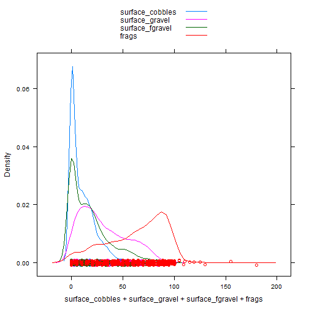

```r
hist(s$frags, 50)
```

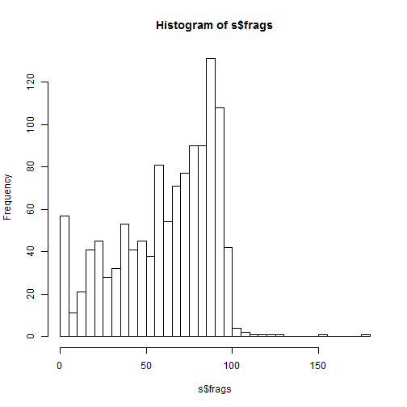

```r
apply(s[grepl("surface|frags", names(s))], 2, function(x) round(summary(x))) # summarize all columns that pattern match either "surface" or "frags"
```

```
##         surface_fgravel surface_gravel surface_cobbles surface_stones
## Min.                  0              0               0              0
## 1st Qu.               0             10               0              0
## Median               12             25               5              0
## Mean                 17             31              10              4
## 3rd Qu.              25             48              15              5
## Max.                 95             95              65             55
##         surface_boulders surface_channers surface_flagstones
## Min.                   0                0                  0
## 1st Qu.                0                0                  0
## Median                 0                0                  0
## Mean                   1                0                  0
## 3rd Qu.                1                0                  0
## Max.                  25                5                  0
##         surface_paragravel surface_paracobbles frags
## Min.                     0                   0     0
## 1st Qu.                  0                   0    42
## Median                   0                   0    70
## Mean                     0                   0    63
## 3rd Qu.                  0                   0    86
## Max.                    20                   2   180
```

```r
sum(s$frags > 100) # number of samples greater than 100
```

```
## [1] 12
```

```r
sum(s$frags < 1) # number of samples less than  1
```

```
## [1] 35
```

Examining the results we can see that the distribution of our surface rock fragments are skewed. In addition, we apparently have values in excess of 100 and some that equal 0. Those values in excess of 100 are likely recording errors, while the values that equal 0 could either be truly 0 or NA.


### Geomorphic data

Another obvious place to look is at the geomorphic data in the site table. This information is intended to help differentiate where our soil observations exist on the landscape. If populated consistently it could be used in future disaggregation efforts, as demonstrated by Nauman and Thompson (2014).

#### Landform vs frags


```r
quantile2 <- function(x) c(round(quantile(x, probs = c(0.05, 0.5, 0.95))), n = length(x)) # Create a custom quantile function

test <- aggregate(frags ~ landform.string, data = s, quantile2)

test <- subset(test, frags[, 4] > 3) # subset the data frame to only include landforms with greater than 3 observations

arrange(test, frags[, 2], decreasing = TRUE) # sort the data frame by the frags matrix column using plyr package function
```

```
##            landform.string frags.5% frags.50% frags.95% frags.n
## 1                 mountain       70        90        95      59
## 2                  ballena       69        85        99      10
## 3                hillslope       28        85       100     151
## 4                     hill        0        80        95      63
## 5              fan remnant       13        75        98     232
## 6                inset fan       14        75        90      19
## 7           mountain slope       25        75       100      82
## 8                 pediment       31        75        95      43
## 9  drainageway & fan apron       55        70        85       4
## 10           rock pediment       13        65        86       8
## 11                    spur       20        62        90      31
## 12             drainageway       20        60        90      39
## 13                    wash       16        60        86      15
## 14               high hill       29        58        85       8
## 15 drainageway & inset fan       43        55        67       4
## 16               fan apron        5        55        91     152
## 17 fan remnant & fan apron       32        52        72       8
## 18          stream terrace       42        50        64       5
## 19 fan apron & fan remnant       12        46        75      22
## 20                low hill       29        46        92      13
## 21            alluvial fan       14        45        91      57
## 22                     fan       20        40        78      11
## 23                 terrace        0        40        85      11
## 24    fan apron & pediment       16        32       142       7
## 25              sand sheet        0         5        40      11
```

```r
# or sort using the order() function from the base package

# test[order(test$surface_total[, 2], decreasing = TRUE), ]
```

There are obviously a wide variety of landforms. However generally it appears that erosional landforms have the most surface rock fragments. Lets generalize the `landform.string` and have a closer look.


```r
s$landform <- ifelse(grepl("fan", s$landform.string), "fan", "hill") # generalize the landform.string
s$landform <- as.factor(s$landform)

test <- aggregate(frags ~ landform, data = s, quantile2)

arrange(test, landform, frags[, 2], decreasing = TRUE) # sort data frame by column using plyr 
```

```
##   landform frags.5% frags.50% frags.95% frags.n
## 1     hill        5        75        98     602
## 2      fan       10        60        95     566
```

```r
densityplot(~ frags + surface_cobbles + surface_gravel | landform, data = s, auto.key = TRUE)
```

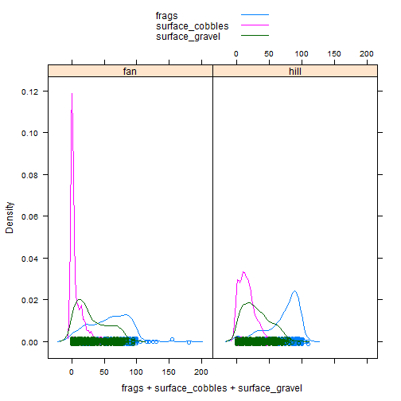

So it does appear that erosional landforms generally do have more surface rock fragments that depositional one, but not by much. It also appears that most of the difference is coming from the amount of cobbles, as seen in the density plot.


#### Hillslope position


```r
test <- aggregate(frags ~ landform + hillslope_pos, data = s, quantile2)

arrange(test, landform, frags[, 2], decreasing = TRUE)
```

```
##    landform hillslope_pos frags.5% frags.50% frags.95% frags.n
## 1      hill     Footslope       23        87        96      17
## 2      hill     Backslope       21        78       100     326
## 3      hill      Shoulder       28        72        92      36
## 4      hill        Summit       26        70       100      26
## 5      hill      Toeslope       20        56        90      40
## 6       fan        Summit       13        80        98     125
## 7       fan      Shoulder       21        75       103      24
## 8       fan      Toeslope        3        60        90      56
## 9       fan     Backslope        4        54        91     100
## 10      fan     Footslope        2        41        93      12
```

If we examine the different hillslope positions for each generic landform we can see other trends. For hills it appears that surface rock fragments decrease as we traverse up the slope, with the exception of the toeslopes which are typically associated with drainageways. On fans we see the opposite relationship, with toeslopes again being the exception. 


#### Slope shape


```r
test <- aggregate(frags ~ landform + paste(shapedown, shapeacross), data = s, quantile2)

arrange(test, landform, frags[, 2], decreasing = TRUE)
```

```
##    landform paste(shapedown, shapeacross) frags.5% frags.50% frags.95%
## 1      hill               Concave Concave       63        89        94
## 2      hill                Concave Convex       54        89        98
## 3      hill                Concave Linear       25        83        93
## 4      hill                Linear Concave       40        80       100
## 5      hill                 Linear Convex       21        80        99
## 6      hill                         NA NA        0        75        95
## 7      hill                 Linear Linear        5        74       100
## 8      hill                 Convex Convex        4        72        95
## 9      hill                 Convex Linear       32        70        94
## 10     hill                Convex Concave       37        45        85
## 11      fan               Concave Concave       51        86        89
## 12      fan                 Linear Convex       15        72        95
## 13      fan                Convex Concave       70        70        70
## 14      fan                Linear Concave       24        70        98
## 15      fan                     Linear NA       70        70        70
## 16      fan                Concave Linear       36        66       100
## 17      fan                 Convex Linear       20        66        95
## 18      fan                 Convex Convex       20        65        90
## 19      fan                 Linear Linear       10        60        95
## 20      fan                         NA NA        0        40        95
## 21      fan                Concave Convex       21        26        31
##    frags.n
## 1        3
## 2       17
## 3        8
## 4       43
## 5      142
## 6       57
## 7      218
## 8       74
## 9       37
## 10       3
## 11       4
## 12     134
## 13       1
## 14      27
## 15       1
## 16      18
## 17      39
## 18      45
## 19     232
## 20      63
## 21       2
```

When examining slope shape on hills it appears that concave positions have greater amounts of surface rock fragments. I can't see any sensible pattern with slope shape on fans.


#### Surface morphometry, depth and surface rock fragments


```r
# Subset Generic landforms and Select Numeric Columns
s_fan <- subset(s, landform == "fan", select = c(frags, surface_gravel, bedrckdepth, slope_field, elev_field))
s_hill <- subset(s, landform == "hill", select = c(frags, surface_gravel, bedrckdepth, slope_field, elev_field))

# Correlation Matrices
round(cor(s_fan, use = "pairwise"), 2)
```

```
##                frags surface_gravel bedrckdepth slope_field elev_field
## frags           1.00           0.67        0.05        0.14      -0.29
## surface_gravel  0.67           1.00        0.06        0.05      -0.04
## bedrckdepth     0.05           0.06        1.00       -0.34       0.10
## slope_field     0.14           0.05       -0.34        1.00      -0.02
## elev_field     -0.29          -0.04        0.10       -0.02       1.00
```

```r
round(cor(s_hill, use = "pairwise"), 2)
```

```
##                frags surface_gravel bedrckdepth slope_field elev_field
## frags           1.00           0.58        0.03        0.26      -0.18
## surface_gravel  0.58           1.00        0.12        0.06       0.01
## bedrckdepth     0.03           0.12        1.00        0.29      -0.21
## slope_field     0.26           0.06        0.29        1.00      -0.13
## elev_field     -0.18           0.01       -0.21       -0.13       1.00
```

```r
# Scatterplot Matrices
spm(s_fan, use = "pairwise", main = "Scatterplot Matrix for Fans")
```

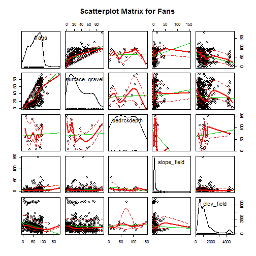

```r
spm(s_hill, use = "pairwise", main = "Scatterplot Matrix for Hills")
```

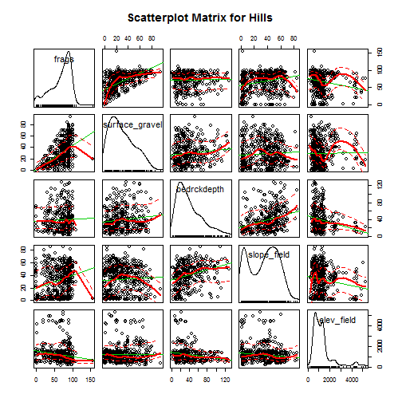

In examing the correlation matrices we don't see a strong relationships with either elevation for slope gradient. However the density plot of slope gradient on the diagonal axis for the hills scatterplot shows a bimodal distribution.


#### Soil scientist bias

Next we'll look at soil scientist bias. The question being do some soil scientists have a tendency to describe more surface rock fragments that others. Due to the excess number of soil scientist that have worked on CA794, including detailees, we've filtered the names of soil scientist to include just the top 3 soil scientists and given priority to the most senior soil scientists when they occur together.


```r
# Custom function to filter out the top 3 soil scientists
desc_test <- function(old) {
  old <- as.character(old)
  new <- NA
  # ranked by seniority
  if (is.na(old)) {new <- "other"}
  if (grepl("Stephen", old)) {new <- "Stephen"} # least senior
  if (grepl("Paul", old)) {new <- "Paul"} 
  if (grepl("Peter", old)) {new <- "Peter"} # most senior
  if (is.na(new)) {new <- "other"}
 return(new)
}

s$describer2 <- sapply(s$describer, desc_test)

test <- aggregate(frags ~ landform + describer2, data = s, function(x) round(quantile(x, probs = c(0, 0.5, 1))))

arrange(test, landform, frags[, 2], decreasing = TRUE)
```

```
##   landform describer2 frags.0% frags.50% frags.100%
## 1     hill       Paul        0        85        155
## 2     hill      Peter        0        80        100
## 3     hill      other        0        75        110
## 4     hill    Stephen        5        50        100
## 5      fan       Paul        0        80        180
## 6      fan      Peter        0        70        125
## 7      fan      other        0        60        119
## 8      fan    Stephen        0        38         96
```

In looking at the numbers it appears we have a clear trend on both fans and hills. We can see that Paul overall describes the most surface rock fragments, while Stephen describest the least. By looking the maximum values we can also see who is recording surface rock fragments in excess of 100. However while these trends are suggestive, they are not definitive because they doesn't take into account other factors. We'll examine this potential bias more closely later.


### Plot coordinates

Where do our points plot? We can plot the general location in R, but for a closer look, we'll export them to a Shapefile so that they can viewed in a proper GIS. Notice in the figure below the number of points that fall outside the survey boundary. What it doesn't show is the points in the Ocean or Mexico.


```r
# Convert soil profile collection to a spatial object
pedons2 <- pedons
slot(pedons2, "site") <- s # this is dangerous, but something needs to be fixed in the site() setter function
idx <- complete.cases(site(pedons2)[c("x", "y")]) # create an index to filter out pedons with missing coordinates
pedons2 <- pedons2[idx]
coordinates(pedons2) <- ~ x + y # set the coordinates
proj4string(pedons2) <- CRS("+init=epsg:4326") # set the projection
pedons_sp <- as(pedons2, "SpatialPointsDataFrame") # coerce to spatial object
```

```
## only site data are extracted
```

```r
pedons_sp <- spTransform(pedons_sp, CRS("+init=epsg:5070")) # reproject

# Read in soil survey area boundaries
ssa <- readOGR(dsn = "M:/geodata/soils/soilsa_a_nrcs.shp", layer = "soilsa_a_nrcs")
```

```
## OGR data source with driver: ESRI Shapefile 
## Source: "M:/geodata/soils/soilsa_a_nrcs.shp", layer: "soilsa_a_nrcs"
## with 3262 features
## It has 8 fields
```

```r
ca794 <- subset(ssa, areasymbol == "CA794") # subset out Joshua Tree National Park
ca794 <- spTransform(ca794, CRS("+init=epsg:5070"))

# Plot
plot(ca794, axes = TRUE)
plot(pedons_sp, add = TRUE) # notice the points outside the boundary
```

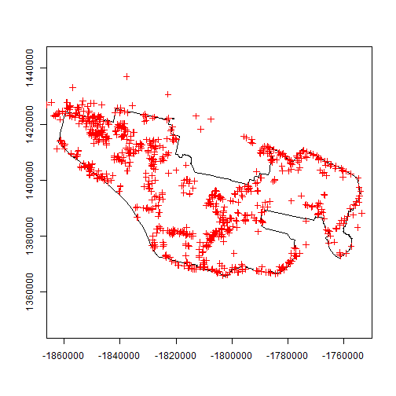

```r
# Write shapefile of pedons
# writeOGR(pedons_sp, dsn = "M:/geodata/project_data/8VIC", "pedon_locations", driver = "ESRI Shapefile") 
```


#### Exercise 1: View the data in ArcGIS

- Examine the shapefile in ArcGIS along with our potential predictive variables (hint classify the Shapefile symbology using the frags column)
- Discuss with your group, and report your observations or hypotheses


### Extracting spatial data

Prior to any spatial analysis or modeling, you need to develop a suite of geodata files that can be intersected with your field data locations. This is in and of itself is a difficult task, and should be facilitated by your Regional GIS Specialist. Typically this would primarily consist of derivatives from a DEM or satellite imagery. Prior to any prediction it is also necessary to ensure the geodata files have the same projection, extent, and cell size. Once we have the necessary files we can construct a list in R of the file names and paths, read the geodata into R and extract the geodata values where they intersect with field data.

As you can see below their is an almost limitless number of variables we could inspect.


```r
folder <- "M:/geodata/project_data/8VIC/ca794/"
files <- c(
  elev   = "ned30m_8VIC.tif", # elevation
  slope  = "ned30m_8VIC_slope5.tif", # slope gradient
  aspect = "ned30m_8VIC_aspect5.tif", # slope aspect
  twi    = "ned30m_8VIC_wetness.tif", # topographic wetness index
  twi_sc = "ned30m_8VIC_wetness_sc.tif", # transformed twi
  ch     = "ned30m_8VIC_cheight.tif", # catchment height
  z2str  = "ned30m_8VIC_z2stream.tif", # height above streams
  mrrtf  = "ned30m_8VIC_mrrtf.tif", # multiresolution ridgetop flatness index
  mrvbf  = "ned30m_8VIC_mrvbf.tif", # multiresolution valley bottom flatness index
  solar  = "ned30m_8VIC_solar.tif", # solar radiation
  precip = "prism30m_8VIC_ppt_1981_2010_annual_mm.tif", # annual precipitation
  precipsum = "prism30m_8VIC_ppt_1981_2010_summer_mm.tif", # summer precipitation
  temp   = "prism30m_8VIC_tmean_1981_2010_annual_C.tif", # annual temperature
  ls     = "landsat30m_8VIC_b123457.tif", # landsat bands
  pc     = "landsat30m_8VIC_pc123456.tif", # principal components of landsat
  tc     = "landsat30m_8VIC_tc123.tif", # tasseled cap components of landsat
  k      = "gamma30m_8VIC_namrad_k.tif", # gamma radiometrics signatures
  th     = "gamma30m_8VIC_namrad_th.tif",
  u      = "gamma30m_8VIC_namrad_u.tif",
  cluster = "cluster152.tif" # unsupervised classification
  )

geodata_f <- sapply(files, function(x) paste0(folder, x)) # combine the folder directory and file names

# Create a raster stack
geodata_r <- stack(geodata_f) 

# Extract the geodata and imbed in a data frame
data <- data.frame(
   as.data.frame(pedons_sp)[c("pedon_id", "taxonname", "frags", "x_std", "y_std", "describer2", "landform.string", "landform", "argillic.horizon")],
   extract(geodata_r, pedons_sp)
   )

# Modify some of the geodata variables
data$mast <- data$temp - 4
idx <- aggregate(mast ~ cluster, data = data, function(x) round(mean(x, na.rm = TRUE), 2))
names(idx)[2] <- "cluster_mast"
data <- join(data, idx, by = "cluster", type = "left")
data$cluster <- factor(data$cluster, levels = 1:15)
data$cluster2 <- reorder(data$cluster, data$mast)
data$twi_sc <- abs(data$twi - 13.8)
data$gsi <- with(data, (ls_3 - ls_1) / (ls_3 + ls_2 + ls_1))
data$sw <- cos(data$aspect - 255)

# save(data, ca794, pedons, file = "C:/workspace/ch7_data.Rdata")

# Strip out location and personal information before uploading to the internet
# s[c("describer", "describer2", "x", "y", "x_std", "y_std", "utmnorthing", "utmeasting", "classifier")] <- NA
# slot(pedons, "site") <- s
# data[c("describer2", "x_std", "y_std")] <- NA
# save(data, ca794, pedons, file = "C:/workspace/stats_for_soil_survey/trunk/data/ch7_data.Rdata")
```


### <a id="spatial")></a> 7.4.6 Examine spatial data 

With our spatial data in hand, we can now see whether any of the variables have a linear relationship with surface rock fragments. 

At the beginning of our analysis we noticed some issues with our data. Particularly that the distribution of our data was skewed, and included values greater than 100 and equal to 0. So before we start lets filter those out and transform the surface rock fragments using a logit transform.


```r
load(file = "C:/workspace/stats_for_soil_survey/trunk/data/ch7_data.Rdata")
train <- data
train <- subset(train, frags > 0 & frags < 100, select = - c(pedon_id, taxonname, landform.string, x_std, y_std, argillic.horizon, describer2)) # exclude frags greater than 100 and less than 1, and exclude some of the extra columns

# Create custom transform functions
logit <- function(x) log(x / (1 - x)) # logit transform
ilogit <- function(x) exp(x) / (1 + exp(x)) # inverse logit transform

# Transform
train$fragst <- logit(train$frags / 100)

# Create list of predictor names
terrain1 <- c("slope", "solar", "mrrtf", "mrvbf")
terrain2 <- c("twi", "z2str", "ch")
climate <- c("elev", "precip", "precipsum", "temp")
ls <- paste0("ls_", 1:6)
pc <- paste0("pc_", 1:6)
tc <- paste0("tc_", 1:3)
rad <- c("k", "th", "u")

# Compute correlation matrices
round(cor(train[c("fragst", terrain1)], use = "pairwise"), 2)
```

```
##        fragst slope solar mrrtf mrvbf
## fragst   1.00  0.27 -0.09 -0.15 -0.32
## slope    0.27  1.00 -0.30 -0.49 -0.62
## solar   -0.09 -0.30  1.00  0.15  0.15
## mrrtf   -0.15 -0.49  0.15  1.00  0.25
## mrvbf   -0.32 -0.62  0.15  0.25  1.00
```

```r
round(cor(train[c("fragst", terrain2)], use = "pairwise"), 2)
```

```
##        fragst   twi z2str    ch
## fragst   1.00 -0.30  0.16 -0.07
## twi     -0.30  1.00 -0.57  0.70
## z2str    0.16 -0.57  1.00 -0.34
## ch      -0.07  0.70 -0.34  1.00
```

```r
round(cor(train[c("fragst", climate)], use = "pairwise"), 2)
```

```
##           fragst  elev precip precipsum  temp
## fragst      1.00 -0.32  -0.13     -0.26  0.31
## elev       -0.32  1.00   0.58      0.77 -0.99
## precip     -0.13  0.58   1.00      0.77 -0.55
## precipsum  -0.26  0.77   0.77      1.00 -0.74
## temp        0.31 -0.99  -0.55     -0.74  1.00
```

```r
round(cor(train[c("fragst", ls)], use = "pairwise"), 2)
```

```
##        fragst  ls_1  ls_2  ls_3  ls_4  ls_5  ls_6
## fragst   1.00 -0.06 -0.17 -0.23 -0.35 -0.42 -0.40
## ls_1    -0.06  1.00  0.98  0.94  0.84  0.73  0.77
## ls_2    -0.17  0.98  1.00  0.99  0.93  0.84  0.87
## ls_3    -0.23  0.94  0.99  1.00  0.97  0.90  0.92
## ls_4    -0.35  0.84  0.93  0.97  1.00  0.96  0.95
## ls_5    -0.42  0.73  0.84  0.90  0.96  1.00  0.98
## ls_6    -0.40  0.77  0.87  0.92  0.95  0.98  1.00
```

```r
round(cor(train[c("fragst", pc)], use = "pairwise"), 2)
```

```
##        fragst  pc_1  pc_2  pc_3  pc_4  pc_5  pc_6
## fragst   1.00  0.35 -0.47  0.00  0.09  0.00 -0.11
## pc_1     0.35  1.00 -0.08 -0.24  0.23 -0.25  0.00
## pc_2    -0.47 -0.08  1.00 -0.38 -0.17  0.03  0.06
## pc_3     0.00 -0.24 -0.38  1.00 -0.40 -0.09  0.12
## pc_4     0.09  0.23 -0.17 -0.40  1.00 -0.34 -0.22
## pc_5     0.00 -0.25  0.03 -0.09 -0.34  1.00 -0.02
## pc_6    -0.11  0.00  0.06  0.12 -0.22 -0.02  1.00
```

```r
round(cor(train[c("fragst", tc)], use = "pairwise"), 2)
```

```
##        fragst  tc_1  tc_2  tc_3
## fragst   1.00 -0.31  0.05  0.47
## tc_1    -0.31  1.00 -0.86 -0.90
## tc_2     0.05 -0.86  1.00  0.65
## tc_3     0.47 -0.90  0.65  1.00
```

```r
lower.tri(round(cor(train[c("fragst", rad)], use = "pairwise"), 2))
```

```
##       [,1]  [,2]  [,3]  [,4]
## [1,] FALSE FALSE FALSE FALSE
## [2,]  TRUE FALSE FALSE FALSE
## [3,]  TRUE  TRUE FALSE FALSE
## [4,]  TRUE  TRUE  TRUE FALSE
```

```r
# Create scatterplots
spm(train[c("fragst", terrain1)])
```

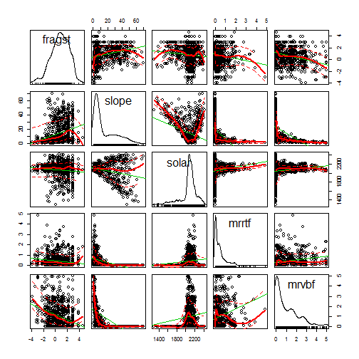

```r
spm(train[c("fragst", terrain2)])
```


```r
spm(train[c("fragst", climate)])
```

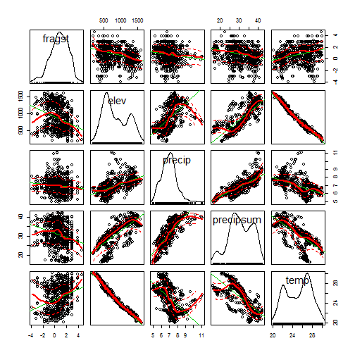

```r
spm(train[c("fragst", pc)])
```

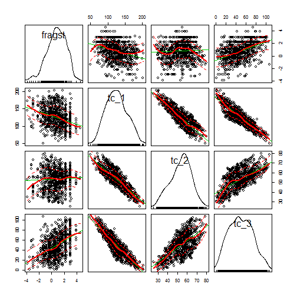

```r
spm(train[c("fragst", tc)])
```

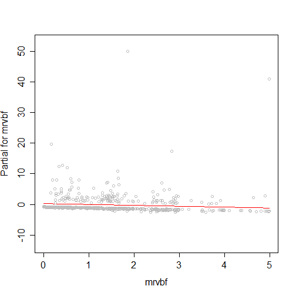

```r
spm(train[c("fragst", rad)])
```

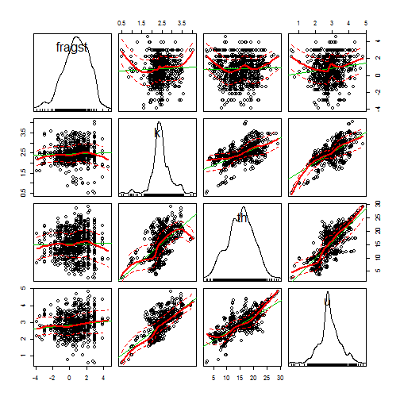

```r
# Create boxplots
bwplot(fragst ~ cluster, data = train)
```

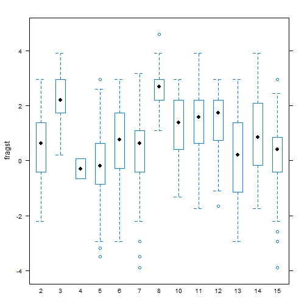

```r
bwplot(fragst ~ cluster2, data = train)
```


The correlation matrices above show that that surface rock fragments have moderate correlations with some of the variables, particularly the landsat derivatives. This makes sense given that surface rock fragments are at the surface, unlike most soil properties. Examining the density plots on the diagonal axis of the scatterplots we can see that some variables are skewed while others are bimodal. Lastly the boxplot show a trend amongst the clusters when their sorted according to annual temperature.


## Modeling

### Model training

Modeling is an iterative process that cycles between fitting and evaluating alternative models. Compared to tree and forest models, linear and generalized models require more input from the user. Automated model selection procedures are available, but are discouraged because they generally result in complex and unstable models. This is in part due to correlation amongst the predictive variables that confuses the model. Also the order is which the variables are included or excluded from the model effects the significance of the others, and thus several weak predictors might mask the effect of one strong predictor. Therefore it is best to begin with a selection of predictors that are known to be useful, and grow the model incrementally. 

The example below is known as a forward selection procedure, where a full model is fit and compared against a null model, to assess the effect of the different predictors. For testing alternative models the Akaike's information criterion (AIC) is used. With AIC smaller is better.


```r
full <- lm(fragst ~ . - frags, data = train) # "~ ." includes all columns in the data set, "-" removes variables
null <- lm(fragst ~ 1, data = train) # "~ 1" just includes an intercept

add1(null, full, test = "F") # using the AIC test the effect of '
```

```
## Warning in add1.lm(null, full, test = "F"): using the 917/968 rows from a
## combined fit
```

```
## Single term additions
## 
## Model:
## fragst ~ 1
##              Df Sum of Sq  RSS AIC F value  Pr(>F)    
## <none>                    1932 686                    
## landform      1        52 1881 663   26.63 3.0e-07 ***
## elev          1       202 1731 586  112.60 < 2e-16 ***
## slope         1       142 1790 617   76.79 < 2e-16 ***
## aspect        1        14 1918 681    7.10 0.00785 ** 
## twi           1       170 1762 603   93.37 < 2e-16 ***
## twi_sc        1        80 1852 649   41.75 1.6e-10 ***
## ch            1        10 1923 683    4.97 0.02602 *  
## z2str         1        47 1885 665   24.26 9.9e-07 ***
## mrrtf         1        42 1890 667   21.44 4.1e-06 ***
## mrvbf         1       195 1737 590  108.73 < 2e-16 ***
## solar         1        17 1915 679    8.58 0.00349 ** 
## precip        1        29 1903 673   14.97 0.00012 ***
## precipsum     1       127 1806 625   67.87 5.7e-16 ***
## temp          1       185 1747 595  102.47 < 2e-16 ***
## ls_1          1         6 1926 685    3.06 0.08077 .  
## ls_2          1        52 1880 663   26.72 2.9e-07 ***
## ls_3          1       103 1829 637   54.65 3.1e-13 ***
## ls_4          1       239 1693 566  136.34 < 2e-16 ***
## ls_5          1       338 1595 512  204.45 < 2e-16 ***
## ls_6          1       300 1632 533  177.87 < 2e-16 ***
## pc_1          1       234 1698 569  133.29 < 2e-16 ***
## pc_2          1       412 1520 467  262.09 < 2e-16 ***
## pc_3          1         0 1932 688    0.01 0.92010    
## pc_4          1        14 1918 681    7.12 0.00776 ** 
## pc_5          1         0 1932 688    0.00 0.96539    
## pc_6          1        29 1903 674   14.74 0.00013 ***
## tc_1          1       176 1756 600   96.88 < 2e-16 ***
## tc_2          1         5 1928 685    2.35 0.12525    
## tc_3          1       416 1516 465  265.22 < 2e-16 ***
## k             1         3 1929 686    1.53 0.21650    
## th            1         1 1932 687    0.46 0.49707    
## u             1        29 1903 674   14.89 0.00012 ***
## cluster      12       500 1432 435   27.80 < 2e-16 ***
## mast          1       185 1747 595  102.47 < 2e-16 ***
## cluster_mast  1        88 1845 645   45.94 2.1e-11 ***
## cluster2     12       500 1432 435   27.80 < 2e-16 ***
## gsi           1       409 1523 469  259.56 < 2e-16 ***
## sw            1         3 1929 686    1.74 0.18715    
## ---
## Signif. codes:  0 '***' 0.001 '**' 0.01 '*' 0.05 '.' 0.1 ' ' 1
```

```r
fragst_lm <- update(null, . ~ . + pc_2 + pc_1 + temp + twi + precipsum) # add one or several variables to the model 

# or

# fragst_lm <- lm(fragst ~ pc_2 + pc_1 + temp + twi + precipsum, data = train)

summary(fragst_lm)
```

```
## 
## Call:
## lm(formula = fragst ~ pc_2 + pc_1 + temp + twi + precipsum, data = train)
## 
## Residuals:
##    Min     1Q Median     3Q    Max 
## -4.170 -0.674  0.049  0.758  3.776 
## 
## Coefficients:
##              Estimate Std. Error t value Pr(>|t|)    
## (Intercept) -5.322611   0.923237   -5.77  1.1e-08 ***
## pc_2        -0.039054   0.005890   -6.63  5.7e-11 ***
## pc_1         0.008876   0.000949    9.36  < 2e-16 ***
## temp         0.218362   0.029642    7.37  3.9e-13 ***
## twi         -0.085597   0.015130   -5.66  2.1e-08 ***
## precipsum    0.057804   0.010365    5.58  3.2e-08 ***
## ---
## Signif. codes:  0 '***' 0.001 '**' 0.01 '*' 0.05 '.' 0.1 ' ' 1
## 
## Residual standard error: 1.16 on 912 degrees of freedom
##   (50 observations deleted due to missingness)
## Multiple R-squared:  0.368,	Adjusted R-squared:  0.364 
## F-statistic:  106 on 5 and 912 DF,  p-value: <2e-16
```
Generally we continue adding predictors to the model until we no longer see an increase in the adjusted R2. At some point the adjusted R2 will level off, versus the R2 which will continue to incrementally increase. The difference between the adjusted R2 vs the R2 is that the adjusted R2 is penalizes model for each additional predictor added to model, similarly to the AIC.


```r
# test <- CVlm(na.exclude(train), formula(fragst_lm), m = 10, plotit = FALSE)
# with(test, cor(frags, ilogit(cvpred) * 100)^2) # cv r2

anova(fragst_lm)
```

```
## Analysis of Variance Table
## 
## Response: fragst
##            Df Sum Sq Mean Sq F value  Pr(>F)    
## pc_2        1    414     414   307.9 < 2e-16 ***
## pc_1        1    192     192   143.2 < 2e-16 ***
## temp        1     29      29    21.2 4.6e-06 ***
## twi         1     36      36    26.5 3.2e-07 ***
## precipsum   1     42      42    31.1 3.2e-08 ***
## Residuals 912   1225       1                    
## ---
## Signif. codes:  0 '***' 0.001 '**' 0.01 '*' 0.05 '.' 0.1 ' ' 1
```

```r
plot(fragst_lm)
```


```r
termplot(fragst_lm, partial.resid = TRUE)
```

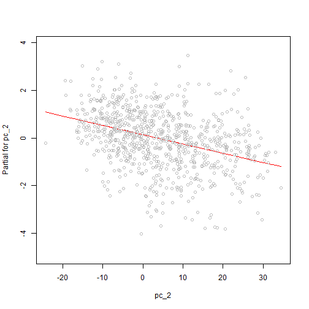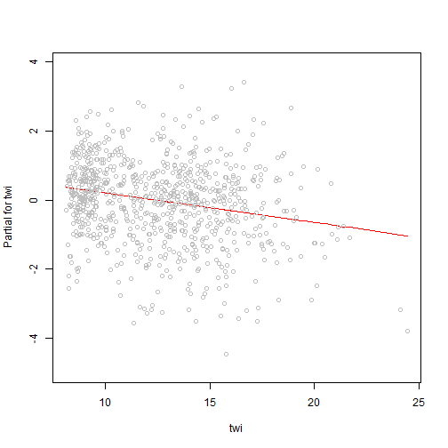

```r
vif(fragst_lm)
```

```
##      pc_2      pc_1      temp       twi precipsum 
##      3.18      1.69      3.91      1.52      2.66
```

```r
train$predict <- ilogit(predict(fragst_lm, train)) * 100

with(train, plot(frags, predict, xlim = c(0, 100), ylim = c(0, 100)))
abline(0, 1)
```

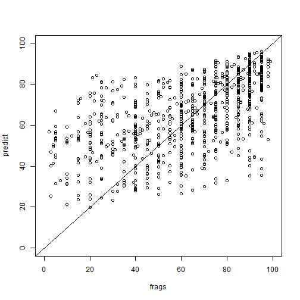

```r
with(train, sqrt(mean((frags - predict)^2, na.rm = T))) # RMSE = root mean square error
```

```
## [1] 20.9
```

```r
with(train, mean(abs(frags - predict), na.rm = T)) # MAE = mean absolute error
```

```
## [1] 15.8
```

```r
temp <- by(train, list(train$cluster2), FUN = function(x) 
  with(x, data.frame(
  cluster = unique(cluster2), 
  rmse = round(sqrt(mean((frags - predict)^2, na.rm = T))), 
  n = length(frags)
  )))
temp2 <- do.call(rbind, temp)
temp2
```

```
##    cluster rmse   n
## 4        4   33   2
## 5        5   22 112
## 15      15   25  97
## 14      14   20  69
## 12      12   15  63
## 11      11   17 107
## 10      10   21  50
## 2        2   23 149
## 13      13   24  42
## 3        3   10  78
## 6        6   25  57
## 7        7   25  69
## 8        8    7  24
```

```r
# or using dplyr package
# 
# group_by(train, cluster2) %>% summarize(
#   rmse = round(sqrt(mean((frags - predict)^2, na.rm = T))), 
#   n = length(frags)
# )

# or using plyr
# 
# ddply(train, .(cluster2), summarize,
#   rmse = round(sqrt(mean((frags - predict)^2, na.rm = T))), 
#   n = length(frags)
# )

dotplot(rmse ~ cluster, data = temp2)
```


```r
# fragst_lm <- update(null, . ~ . + pc_2 + pc_1 + temp + twi + precipsum + cluster) # add one or several variables to the model 
```


```r
predfun <- function(model, data) {
  v <- predict(model, data, se.fit=TRUE)
  cbind(p = as.vector(ilogit(v$fit) * 100), se=as.vector(ilogit(v$se.fit)) * 100)
}

r <- predict(geodata_r, fragst_lm, fun = predfun, index = 1:2, progress="text")
writeRaster(r[[1]], "frags.tif", overwrite = T, progress = "text")
writeRaster(r[[2]], "frags_se.tif", overwrite = T, progress = "text")

plot(raster("C:/workspace/test_fragst4.tif"))
plot(ca794, add = TRUE)
```

## References

Nauman, T. W., and J. A. Thompson, 2014. Semi-automated disaggregation of conventional soil maps using knowledge driven data mining and classification trees. Geoderma 213:385-399. [http://www.sciencedirect.com/science/article/pii/S0016706113003066](http://www.sciencedirect.com/science/article/pii/S0016706113003066)

Peterson, F.F., 1981. Landforms of the basin and range province: defined for soil survey. Nevada Agricultural Experiment Station Technical Bulletin 28, University of Nevada - Reno, NV. 52 p. [http://jornada.nmsu.edu/files/Peterson_LandformsBasinRangeProvince.pdf](http://jornada.nmsu.edu/files/Peterson_LandformsBasinRangeProvince.pdf)

Shi, X., L. Girod, R. Long, R. DeKett, J. Philippe, and T. Burke, 2012. A comparison of LiDAR-based DEMs and USGS-sourced DEMs in terrain analysis for knowledge-based digital soil mapping. Geoderma 170:217-226. [http://www.sciencedirect.com/science/article/pii/S0016706111003387](http://www.sciencedirect.com/science/article/pii/S0016706111003387)


## Additional reading

Faraway, J.J., 2002. Practical Regression and Anova using R. CRC Press, New York. [https://cran.r-project.org/doc/contrib/Faraway-PRA.pdf](https://cran.r-project.org/doc/contrib/Faraway-PRA.pdf)

Gareth, J., D. Witten, T. Hastie, and R. Tibshirani, 2014. An Introduction to Statistical Learning: with Applications in R. Springer, New York. [http://www-bcf.usc.edu/~gareth/ISL/](http://www-bcf.usc.edu/~gareth/ISL/)

Hengl, T. 2009. A Practical Guide to Geostatistical Mapping, 2nd Edt. University of Amsterdam, www.lulu.com, 291 p. ISBN 978-90-9024981-0. [http://spatial-analyst.net/book/system/files/Hengl_2009_GEOSTATe2c0w.pdf](http://spatial-analyst.net/book/system/files/Hengl_2009_GEOSTATe2c0w.pdf)

Webster, R. 1997. Regression and functional relations. European Journal of Soil Science, 48, 557-566. [http://onlinelibrary.wiley.com/doi/10.1111/j.1365-2389.1997.tb00222.x/abstract](http://onlinelibrary.wiley.com/doi/10.1111/j.1365-2389.1997.tb00222.x/abstract)
