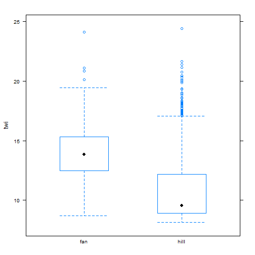
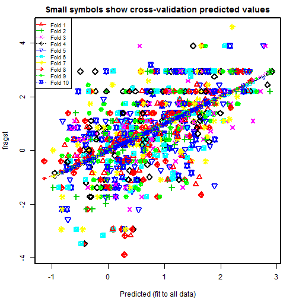
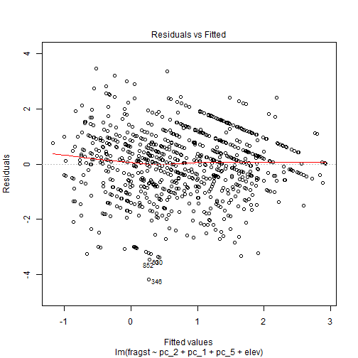
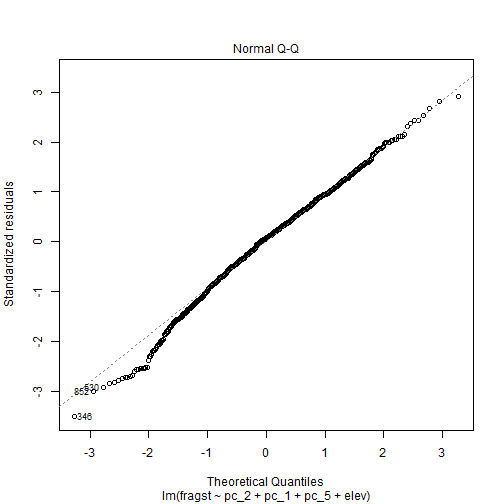
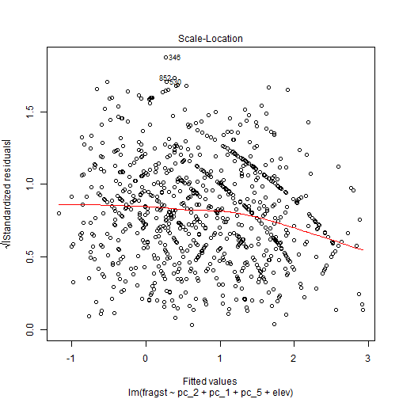
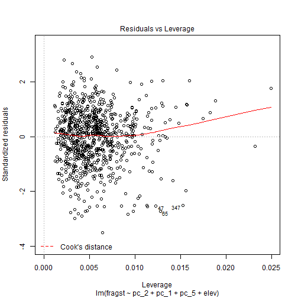
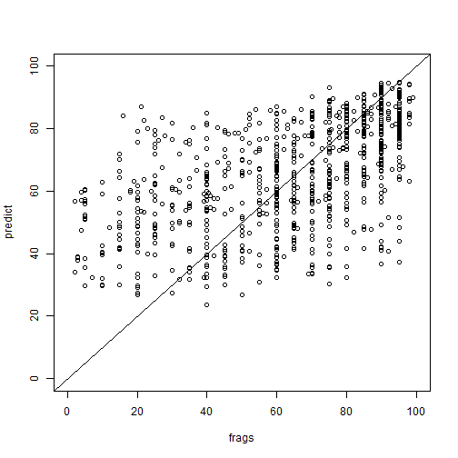
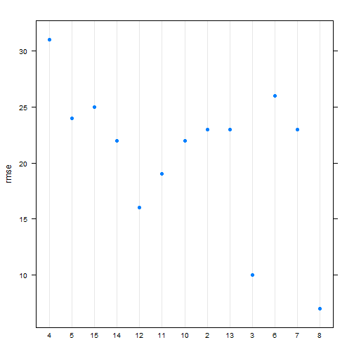

## Introduction

Linear regression has been used for soil survey applications since the early 1900s when Briggs and McLane (1907) developed a pedotransfer function to estimate the wilting coefficient as a function of soil particle size. 

Wilting coefficient = 0.01(sand) + 0.12(silt) + 0.57(clay)

Linear regression, as the name implys, models the linear relationship between a response variable (y) and an predictor variable (x). 

$f(y) = \beta_{0} + \beta_{1}x + \varepsilon$

- \beta_{0} = intercept of the fitted line
- \beta_{1}x = slope of the fitted line
- \varepsilon$ = the error term

When more than one independent variable is used in the regression, the model is called multiple linear regression. In regression models, the response (or dependent) variable must always be continuous. The predictor (or independent) variable(s) can be continuous or categorical. In order to use linear regression or any linear model, the errors (i.e. residuals) must be normally distributed. Most environmental data are skewed and require transformations to the response variable (such as square root or log) for use in linear models. Normality can be assessed in R visually using a QQ plot or histogram of the residuals.


### Load packages

To start, as always we need to load some extra packages. This is a necessary evil every time you start R. Most of the basic functions we need to develop a linear regression model are contained in base R, but the following contain some useful spatial and data manipulation functions. Believe it or not we will use all of them and more.


```r
library(aqp) # specialized soil classes and functions
library(soilDB) # NASIS and SDA import functions
library(raster) # guess
library(rgdal) # spatial import
library(lattice) # graphing
library(reshape2) # data manipulation
library(plyr) # data manipulation
library(caret) # printing
library(car) # additional regression tools
library(DAAG) # additional regression tools
```


### Read in data

Hopefully like all good soil scientists and ecological site specialists you enter your field data into NASIS. Better yet hopefully someone else did it for you. Once data are captured in NASIS it much easier to import them into R, extract the pieces you need, manipulate them, model them, etc. If it's not entered into NASIS it may as well not exist.


```r
# pedons <- fetchNASIS(rmHzErrors = FALSE) # beware the error messages, by default they don't get imported unless you override the default, which in our case shouldn't cause any problems
load(file = "C:/workspace/ch7_data.Rdata")

str(pedons, max.level = 2) # Examine the makeup of the data we imported from NASIS.
```

```
## Formal class 'SoilProfileCollection' [package "aqp"] with 7 slots
##   ..@ idcol     : chr "peiid"
##   ..@ depthcols : chr [1:2] "hzdept" "hzdepb"
##   ..@ metadata  :'data.frame':	1 obs. of  1 variable:
##   ..@ horizons  :'data.frame':	4990 obs. of  43 variables:
##   ..@ site      :'data.frame':	1168 obs. of  79 variables:
##   ..@ sp        :Formal class 'SpatialPoints' [package "sp"] with 3 slots
##   ..@ diagnostic:'data.frame':	2133 obs. of  4 variables:
```

## Exploratory analysis

### Data Wrangling

Generally before we begin modeling its good to explore the data. By examining a simple summary we can quickly see the breakdown of our data. Unfortunately, odds are all the data haven't been properly populated like they should be.


```r
s <- site(pedons)

s$surface_gravel <- with(s, surface_gravel - surface_fgravel) # recalculate gravel to exclude fine gravel
s$frags <- apply(s[grepl("surface", names(s))], 1, sum) # calculate total surface rock fragments

densityplot(~ surface_cobbles + surface_gravel + surface_fgravel + frags, data = s, auto.key = TRUE)
```


```r
apply(s[grepl("surface|frags", names(s))], 2, function(x) round(summary(x)))
```

```
##         surface_fgravel surface_gravel surface_cobbles surface_stones
## Min.                  0              0               0              0
## 1st Qu.               0             10               0              0
## Median               12             25               5              0
## Mean                 17             31              10              4
## 3rd Qu.              25             48              15              5
## Max.                 95             95              65             55
##         surface_boulders surface_channers surface_flagstones
## Min.                   0                0                  0
## 1st Qu.                0                0                  0
## Median                 0                0                  0
## Mean                   1                0                  0
## 3rd Qu.                1                0                  0
## Max.                  25                5                  0
##         surface_paragravel surface_paracobbles frags
## Min.                     0                   0     0
## 1st Qu.                  0                   0    42
## Median                   0                   0    70
## Mean                     0                   0    63
## 3rd Qu.                  0                   0    86
## Max.                    20                   2   180
```

```r
sum(s$frags > 100) # number of samples greater than 100
```

```
## [1] 12
```

```r
sum(s$frags < 1) # number of samples less than  1
```

```
## [1] 35
```

An important think to note is the `fetchNASIS


### Geomorphic data

Another obvious place to look is at the geomorphic data in the site table. This information is intended to help differentiate where our soil observations exist on the landscape. If populated consistently it could be used in future disaggregation efforts, as demonstrated by Nauman and Thompson (2014).

#### Landform vs frags


```r
# Create a custom quantile function

quantile2 <- function(x) c(round(quantile(x, probs = c(0.05, 0.5, 0.95))), n = length(x))

test <- aggregate(frags ~ landform.string, data = s, quantile2)

test <- subset(test, frags[, 4] > 3) # subset to those with greater than 3 observations

arrange(test, frags[, 2], decreasing = TRUE) # sort the data frame by the frags matrix column using plyr package function
```

```
##            landform.string frags.5% frags.50% frags.95% frags.n
## 1                 mountain       70        90        95      59
## 2                  ballena       69        85        99      10
## 3                hillslope       28        85       100     151
## 4                     hill        0        80        95      63
## 5              fan remnant       13        75        98     232
## 6                inset fan       14        75        90      19
## 7           mountain slope       25        75       100      82
## 8                 pediment       31        75        95      43
## 9  drainageway & fan apron       55        70        85       4
## 10           rock pediment       13        65        86       8
## 11                    spur       20        62        90      31
## 12             drainageway       20        60        90      39
## 13                    wash       16        60        86      15
## 14               high hill       29        58        85       8
## 15 drainageway & inset fan       43        55        67       4
## 16               fan apron        5        55        91     152
## 17 fan remnant & fan apron       32        52        72       8
## 18          stream terrace       42        50        64       5
## 19 fan apron & fan remnant       12        46        75      22
## 20                low hill       29        46        92      13
## 21            alluvial fan       14        45        91      57
## 22                     fan       20        40        78      11
## 23                 terrace        0        40        85      11
## 24    fan apron & pediment       16        32       142       7
## 25              sand sheet        0         5        40      11
```

```r
# or sort using the order() function from the base package

# test[order(test$surface_total[, 2], decreasing = TRUE), ]
```

There are obviously a wide variety of landforms. However generally it appears that erosional landforms have the most surface rock fragments. Lets generalize the `landform.string` and have a closer look.


```r
# Generalize the landform.string

s$landform <- ifelse(grepl("fan", s$landform.string), "fan", "hill") 
s$landform <- as.factor(s$landform)

test <- aggregate(frags ~ landform, data = s, quantile2)

arrange(test, landform, frags[, 2], decreasing = TRUE) # sort data frame by column using plyr 
```

```
##   landform frags.5% frags.50% frags.95% frags.n
## 1     hill        5        75        98     602
## 2      fan       10        60        95     566
```

```r
densityplot(~ frags + surface_cobbles + surface_gravel | landform, data = s, auto.key = TRUE)
```


So it does appear that erosional landforms generally do have more surface rock fragments that depositional one, but not by much. It also appears that most of the difference is coming from the amount of cobbles, as seen in the density plot.


#### Hillslope position


```r
test <- aggregate(frags ~ landform + hillslope_pos, data = s, quantile2)

arrange(test, landform, frags[, 2], decreasing = TRUE)
```

```
##    landform hillslope_pos frags.5% frags.50% frags.95% frags.n
## 1      hill     Footslope       23        87        96      17
## 2      hill     Backslope       21        78       100     326
## 3      hill      Shoulder       28        72        92      36
## 4      hill        Summit       26        70       100      26
## 5      hill      Toeslope       20        56        90      40
## 6       fan        Summit       13        80        98     125
## 7       fan      Shoulder       21        75       103      24
## 8       fan      Toeslope        3        60        90      56
## 9       fan     Backslope        4        54        91     100
## 10      fan     Footslope        2        41        93      12
```

If we examine the different hillslope positions for each generic landform we can see other trends. For hills it appears that surface rock fragments decrease as we traverse up the slope, with the exception of toeslopes which are typically associated with channels. On fans we see the opposite relationship, which toeslopes again being the exception. 


#### Slope shape


```r
test <- aggregate(frags ~ landform + paste(shapedown, shapeacross), data = s, quantile2)

arrange(test, landform, frags[, 2], decreasing = TRUE)
```

```
##    landform paste(shapedown, shapeacross) frags.5% frags.50% frags.95%
## 1      hill               Concave Concave       63        89        94
## 2      hill                Concave Convex       54        89        98
## 3      hill                Concave Linear       25        83        93
## 4      hill                Linear Concave       40        80       100
## 5      hill                 Linear Convex       21        80        99
## 6      hill                         NA NA        0        75        95
## 7      hill                 Linear Linear        5        74       100
## 8      hill                 Convex Convex        4        72        95
## 9      hill                 Convex Linear       32        70        94
## 10     hill                Convex Concave       37        45        85
## 11      fan               Concave Concave       51        86        89
## 12      fan                 Linear Convex       15        72        95
## 13      fan                Convex Concave       70        70        70
## 14      fan                Linear Concave       24        70        98
## 15      fan                     Linear NA       70        70        70
## 16      fan                Concave Linear       36        66       100
## 17      fan                 Convex Linear       20        66        95
## 18      fan                 Convex Convex       20        65        90
## 19      fan                 Linear Linear       10        60        95
## 20      fan                         NA NA        0        40        95
## 21      fan                Concave Convex       21        26        31
##    frags.n
## 1        3
## 2       17
## 3        8
## 4       43
## 5      142
## 6       57
## 7      218
## 8       74
## 9       37
## 10       3
## 11       4
## 12     134
## 13       1
## 14      27
## 15       1
## 16      18
## 17      39
## 18      45
## 19     232
## 20      63
## 21       2
```

When examining slope shape on hills it appears that concave positions have greater amounts of surface rock fragments. I can't see any sensible pattern with slope shape on fans.


#### Surface morphometry, depth and surface rock fragments


```r
# Subset Generic landforms and Select Numeric Columns
s_fan <- subset(s, landform == "fan", select = c(frags, surface_gravel, bedrckdepth, slope_field, elev_field))
s_hill <- subset(s, landform == "hill", select = c(frags, surface_gravel, bedrckdepth, slope_field, elev_field))

# Correlation Matrices
round(cor(s_fan, use = "pairwise"), 2)
```

```
##                frags surface_gravel bedrckdepth slope_field elev_field
## frags           1.00           0.67        0.05        0.14      -0.29
## surface_gravel  0.67           1.00        0.06        0.05      -0.04
## bedrckdepth     0.05           0.06        1.00       -0.34       0.10
## slope_field     0.14           0.05       -0.34        1.00      -0.02
## elev_field     -0.29          -0.04        0.10       -0.02       1.00
```

```r
round(cor(s_hill, use = "pairwise"), 2)
```

```
##                frags surface_gravel bedrckdepth slope_field elev_field
## frags           1.00           0.58        0.03        0.26      -0.18
## surface_gravel  0.58           1.00        0.12        0.06       0.01
## bedrckdepth     0.03           0.12        1.00        0.29      -0.21
## slope_field     0.26           0.06        0.29        1.00      -0.13
## elev_field     -0.18           0.01       -0.21       -0.13       1.00
```

```r
# Scatterplot Matrices
spm(s_fan, use = "pairwise")
```


```r
spm(s_hill, use = "pairwise")
```


In examing the correlation matrices we can we that both generic landforms have similar correlations, both in strength and sign. One difference is that the density plot of slope gradient on the diagonal axis shows a bimodal distribution.


#### Soil scientist bias

Next we'll look at soil scientist bias. The question being do some soil scientists have a tendency to describe more surface rock fragments that others. Due to the excess number of soil scientist that have worked on CA794, including detailees, we've filtered the names of soil scientist to include just the top 3 soil scientists and given priority to the most senior soil scientists when they occur together.


```r
# Custom function to filter out the top 3 soil scientists
desc_test <- function(old) {
  old <- as.character(old)
  new <- NA
  # ranked by seniority
  if (is.na(old)) {new <- "other"}
  if (grepl("Stephen", old)) {new <- "Stephen"} # least senior
  if (grepl("Paul", old)) {new <- "Paul"} 
  if (grepl("Peter", old)) {new <- "Peter"} # most senior
  if (is.na(new)) {new <- "other"}
 return(new)
}

s$describer2 <- sapply(s$describer, desc_test)

test <- aggregate(frags ~ landform + describer2, data = s, function(x) round(quantile(x, probs = c(0, 0.5, 1))))

arrange(test, landform, frags[, 2], decreasing = TRUE)
```

```
##   landform describer2 frags.0% frags.50% frags.100%
## 1     hill       Paul        0        85        155
## 2     hill      Peter        0        80        100
## 3     hill      other        0        75        110
## 4     hill    Stephen        5        50        100
## 5      fan       Paul        0        80        180
## 6      fan      Peter        0        70        125
## 7      fan      other        0        60        119
## 8      fan    Stephen        0        38         96
```

In looking at the numbers it appears we have a clear trend on both fans and hills. We can see that Paul overall describes the most surface rock fragments, while Stephen describest the least. By looking the maximum values we can also see who is recording surface rock fragments in excess of 100. However while this information is suggestive, it is far from definitive because it doesn't take into account other factors. We'll examine this more closely later.


### <a id="plot")></a> 7.4.4 Plot coordinates

Where do our points plot? We can plot the general location in R, but for a closer look, we'll export them to a Shapefile so that they can viewed in a proper GIS. Notice in the figure below the number of points that fall outside the survey boundary. What it doesn't show is the points in the Ocean or Mexico.


```r
# Convert soil profile collection to a spatial object
pedons2 <- pedons
slot(pedons2, "site") <- s # this is dangerous, but something needs to be fixed in the site() setter function
idx <- complete.cases(site(pedons2)[c("x", "y")]) # create an index to filter out pedons with missing coordinates
pedons2 <- pedons2[idx]
coordinates(pedons2) <- ~ x + y # set the coordinates
proj4string(pedons2) <- CRS("+init=epsg:4326") # set the projection
pedons_sp <- as(pedons2, "SpatialPointsDataFrame") # coerce to spatial object
```

```
## only site data are extracted
```

```r
pedons_sp <- spTransform(pedons_sp, CRS("+init=epsg:5070")) # reproject

# Read in soil survey area boundaries
ssa <- readOGR(dsn = "M:/geodata/soils/soilsa_a_nrcs.shp", layer = "soilsa_a_nrcs")
```

```
## OGR data source with driver: ESRI Shapefile 
## Source: "M:/geodata/soils/soilsa_a_nrcs.shp", layer: "soilsa_a_nrcs"
## with 3262 features
## It has 8 fields
```

```r
ca794 <- subset(ssa, areasymbol == "CA794") # subset out Joshua Tree National Park
ca794 <- spTransform(ca794, CRS("+init=epsg:5070"))

# Plot
plot(ca794, axes = TRUE)
plot(pedons_sp, add = TRUE) # notice the points outside the boundary
```


```r
# Write shapefile of pedons
# writeOGR(pedons_sp, dsn = "M:/geodata/project_data/8VIC", "pedon_locations", driver = "ESRI Shapefile") 
```


#### Exercise 1: View the data in ArcGIS

- Examine the shapefile in ArcGIS along with our potential predictive variables (hint classify the Shapefile symbology using the frags column)
- Discuss with your group, and report your observations or hypotheses


### <a id="extract")></a> 7.4.5 Extracting spatial data

Prior to any spatial analysis or modeling, you need to develop a suite of geodata files that can be intersected with your field data locations. This is in and of itself is a difficult task, and should be facilitated by your Regional GIS Specialist. Typically this would primarily consist of derivatives from a DEM or satellite imagery. Prior to any prediction it is also necessary to ensure the geodata files have the same projection, extent, and cell size. Once we have the necessary files we can construct a list in R of the file names and paths, read the geodata into R and extract the geodata values where they intersect with field data.


```r
folder <- "M:/geodata/project_data/8VIC/ca794/"
files <- c(
  elev   = "ned30m_8VIC.tif",
  slope  = "ned30m_8VIC_slope5.tif",
  aspect = "ned30m_8VIC_aspect5.tif",
  twi    = "ned30m_8VIC_wetness.tif",
  twi_sc = "ned30m_8VIC_wetness_sc.tif",
  ch     = "ned30m_8VIC_cheight.tif",
  z2str  = "ned30m_8VIC_z2stream.tif",
  mrrtf  = "ned30m_8VIC_mrrtf.tif",
  mrvbf  = "ned30m_8VIC_mrvbf.tif",
  solar  = "ned30m_8VIC_solar.tif",
  precip = "prism30m_8VIC_ppt_1981_2010_annual_mm.tif",
  precipsum = "prism30m_8VIC_ppt_1981_2010_summer_mm.tif",
  temp   = "prism30m_8VIC_tmean_1981_2010_annual_C.tif",
  ls     = "landsat30m_8VIC_b123457.tif",
  pc     = "landsat30m_8VIC_pc123456.tif",
  tc     = "landsat30m_8VIC_tc123.tif",
  k      = "gamma30m_8VIC_namrad_k.tif",
  th     = "gamma30m_8VIC_namrad_th.tif",
  u      = "gamma30m_8VIC_namrad_u.tif",
  cluster = "cluster152.tif"
  )

geodata_f <- sapply(files, function(x) paste0(folder, x)) # combine the folder directory and file names

head(geodata_f)

# Create a raster stack
geodata_r <- stack(geodata_f) 

# Extract the geodata and imbed in a data frame
data <- data.frame(
   as.data.frame(pedons_sp)[c("pedon_id", "taxonname", "frags", "x_std", "y_std", "describer2", "landform.string", "landform", "argillic.horizon")],
   extract(geodata_r, pedons_sp)
   )

# Modify some of the geodata variables
data$mast <- data$temp - 4
idx <- aggregate(mast ~ cluster, data = data, function(x) round(mean(x, na.rm = TRUE), 2))
names(idx)[2] <- "cluster_mast"
data <- join(data, idx, by = "cluster", type = "left")
data$cluster <- factor(data$cluster, levels = 1:15)
data$cluster2 <- reorder(data$cluster, data$mast)
data$twi_sc <- abs(data$twi - 13.8)
data$gsi <- with(data, (ls_3 - ls_1) / (ls_3 + ls_2 + ls_1))
data$sw <- cos(data$aspect - 255)

# save(data, ca794, pedons, file = "C:/workspace/ch7_data.Rdata")

# Strip out location and personal information before uploading to the internet
# s[c("describer", "describer2", "x", "y", "x_std", "y_std", "utmnorthing", "utmeasting", "classifier")] <- NA
# slot(pedons, "site") <- s
# data[c("describer2", "x_std", "y_std")] <- NA
# save(data, ca794, pedons, file = "C:/workspace/stats_for_soil_survey/trunk/data/ch7_data.Rdata")
```


### <a id="spatial")></a> 7.4.6 Examine spatial data 

With our spatial data in hand, we can now see whether any of the variables have a linear relationship with surface rock fragments. 

At the beginning of our analysis we noticed some issues with our data. Particularly that the distribution of our data was skewed, and included values greater than 100 and equal to 0.


```r
load(file = "C:/workspace/stats_for_soil_survey/trunk/data/ch7_data.Rdata")
train <- data
train <- subset(train, frags > 0 & frags < 100, select = - c(pedon_id, taxonname, landform.string, x_std, y_std, argillic.horizon, describer2)) # exclude frags greater than 100 and less than 1, and exclude some of the extra columns

# Create custom functions
logit <- function(x) log(x / (1 - x)) # logit transform
ilogit <- function(x) exp(x) / (1 + exp(x)) # inverse logit transform

# Transform
train$fragst <- logit(train$frags / 100)

terrain1 <- c("slope", "solar", "mrrtf", "mrvbf")
terrain2 <- c("twi", "z2str", "ch")
climate <- c("elev", "precip", "precipsum", "temp")
ls <- paste0("ls_", 1:6)
pc <- paste0("pc_", 1:6)
tc <- paste0("tc_", 1:3)
rad <- c("k", "th", "u")

round(cor(train[c("fragst", terrain1)], use = "pairwise"), 2)
```

```
##        fragst slope solar mrrtf mrvbf
## fragst   1.00  0.27 -0.09 -0.15 -0.32
## slope    0.27  1.00 -0.30 -0.49 -0.62
## solar   -0.09 -0.30  1.00  0.15  0.15
## mrrtf   -0.15 -0.49  0.15  1.00  0.25
## mrvbf   -0.32 -0.62  0.15  0.25  1.00
```

```r
round(cor(train[c("fragst", terrain2)], use = "pairwise"), 2)
```

```
##        fragst   twi z2str    ch
## fragst   1.00 -0.30  0.16 -0.07
## twi     -0.30  1.00 -0.57  0.70
## z2str    0.16 -0.57  1.00 -0.34
## ch      -0.07  0.70 -0.34  1.00
```

```r
round(cor(train[c("fragst", climate)], use = "pairwise"), 2)
```

```
##           fragst  elev precip precipsum  temp
## fragst      1.00 -0.32  -0.13     -0.26  0.31
## elev       -0.32  1.00   0.58      0.77 -0.99
## precip     -0.13  0.58   1.00      0.77 -0.55
## precipsum  -0.26  0.77   0.77      1.00 -0.74
## temp        0.31 -0.99  -0.55     -0.74  1.00
```

```r
round(cor(train[c("fragst", ls)], use = "pairwise"), 2)
```

```
##        fragst  ls_1  ls_2  ls_3  ls_4  ls_5  ls_6
## fragst   1.00 -0.06 -0.17 -0.23 -0.35 -0.42 -0.40
## ls_1    -0.06  1.00  0.98  0.94  0.84  0.73  0.77
## ls_2    -0.17  0.98  1.00  0.99  0.93  0.84  0.87
## ls_3    -0.23  0.94  0.99  1.00  0.97  0.90  0.92
## ls_4    -0.35  0.84  0.93  0.97  1.00  0.96  0.95
## ls_5    -0.42  0.73  0.84  0.90  0.96  1.00  0.98
## ls_6    -0.40  0.77  0.87  0.92  0.95  0.98  1.00
```

```r
round(cor(train[c("fragst", pc)], use = "pairwise"), 2)
```

```
##        fragst  pc_1  pc_2  pc_3  pc_4  pc_5  pc_6
## fragst   1.00  0.35 -0.47  0.00  0.09  0.00 -0.11
## pc_1     0.35  1.00 -0.08 -0.24  0.23 -0.25  0.00
## pc_2    -0.47 -0.08  1.00 -0.38 -0.17  0.03  0.06
## pc_3     0.00 -0.24 -0.38  1.00 -0.40 -0.09  0.12
## pc_4     0.09  0.23 -0.17 -0.40  1.00 -0.34 -0.22
## pc_5     0.00 -0.25  0.03 -0.09 -0.34  1.00 -0.02
## pc_6    -0.11  0.00  0.06  0.12 -0.22 -0.02  1.00
```

```r
round(cor(train[c("fragst", tc)], use = "pairwise"), 2)
```

```
##        fragst  tc_1  tc_2  tc_3
## fragst   1.00 -0.31  0.05  0.47
## tc_1    -0.31  1.00 -0.86 -0.90
## tc_2     0.05 -0.86  1.00  0.65
## tc_3     0.47 -0.90  0.65  1.00
```

```r
round(cor(train[c("fragst", rad)], use = "pairwise"), 2)
```

```
##        fragst    k   th    u
## fragst   1.00 0.04 0.02 0.12
## k        0.04 1.00 0.59 0.69
## th       0.02 0.59 1.00 0.77
## u        0.12 0.69 0.77 1.00
```

```r
spm(train[c("fragst", terrain1)])
```


```r
spm(train[c("fragst", terrain2)])
```


```r
spm(train[c("fragst", climate)])
```


```r
spm(train[c("fragst", pc)])
```


```r
spm(train[c("fragst", tc)])
```


```r
spm(train[c("fragst", rad)])
```


```r
bwplot(fragst ~ cluster, data = train)
```


```r
bwplot(fragst ~ cluster2, data = train)
```


```r
bwplot(twi ~ landform, data = train)
```



```r
aggregate(twi ~ landform, data = train, median)
```

```
##   landform       twi
## 1      fan 13.857069
## 2     hill  9.557741
```


```r
full <- lm(fragst ~ ., data = train) # "~ ." includes all columns in the data set
null <- lm(fragst ~ 1, data = train) # "~ 1" just includes an intercept

add1(null, full, test = "F") # using the AIC test the effect of '
```

```
## Warning in add1.lm(null, full, test = "F"): using the 917/968 rows from a
## combined fit
```

```
## Single term additions
## 
## Model:
## fragst ~ 1
##              Df Sum of Sq     RSS      AIC    F value    Pr(>F)    
## <none>                    1932.45   685.56                         
## frags         1   1855.98   76.47 -2274.06 23446.5324 < 2.2e-16 ***
## landform      1     51.85 1880.60   662.63    26.6328 2.986e-07 ***
## elev          1    201.73 1730.71   586.46   112.5984 < 2.2e-16 ***
## slope         1    142.30 1790.15   617.42    76.7885 < 2.2e-16 ***
## aspect        1     14.09 1918.35   680.85     7.0975 0.0078476 ** 
## twi           1    170.32 1762.13   602.96    93.3683 < 2.2e-16 ***
## twi_sc        1     80.06 1852.39   648.76    41.7517 1.641e-10 ***
## ch            1      9.89 1922.56   682.86     4.9703 0.0260152 *  
## z2str         1     47.35 1885.10   664.82    24.2627 9.884e-07 ***
## mrrtf         1     41.96 1890.49   667.43    21.4405 4.148e-06 ***
## mrvbf         1    195.50 1736.95   589.76   108.7258 < 2.2e-16 ***
## solar         1     17.00 1915.44   679.46     8.5758 0.0034866 ** 
## precip        1     29.49 1902.96   673.46    14.9720 0.0001164 ***
## precipsum     1    126.85 1805.60   625.30    67.8654 5.655e-16 ***
## temp          1    185.33 1747.12   595.11   102.4712 < 2.2e-16 ***
## ls_1          1      6.09 1926.36   684.67     3.0558 0.0807655 .  
## ls_2          1     52.02 1880.43   662.54    26.7242 2.852e-07 ***
## ls_3          1    103.47 1828.97   637.10    54.6516 3.115e-13 ***
## ls_4          1    239.01 1693.44   566.49   136.3420 < 2.2e-16 ***
## ls_5          1    337.55 1594.90   511.52   204.4472 < 2.2e-16 ***
## ls_6          1    300.49 1631.96   532.59   177.8666 < 2.2e-16 ***
## pc_1          1    234.32 1698.13   569.03   133.2940 < 2.2e-16 ***
## pc_2          1    412.40 1520.04   467.44   262.0859 < 2.2e-16 ***
## pc_3          1      0.02 1932.43   687.56     0.0101 0.9201030    
## pc_4          1     14.13 1918.32   680.83     7.1168 0.0077642 ** 
## pc_5          1      0.00 1932.45   687.56     0.0019 0.9653904    
## pc_6          1     29.04 1903.41   673.68    14.7383 0.0001316 ***
## tc_1          1    176.14 1756.31   599.92    96.8792 < 2.2e-16 ***
## tc_2          1      4.70 1927.75   685.33     2.3545 0.1252508    
## tc_3          1    416.27 1516.18   465.10   265.2186 < 2.2e-16 ***
## k             1      3.05 1929.39   686.11     1.5295 0.2164953    
## th            1      0.92 1931.53   687.13     0.4615 0.4970728    
## u             1     29.33 1903.12   673.54    14.8887 0.0001216 ***
## cluster      12    500.29 1432.16   434.83    27.8003 < 2.2e-16 ***
## mast          1    185.33 1747.12   595.11   102.4712 < 2.2e-16 ***
## cluster_mast  1     87.72 1844.73   644.96    45.9365 2.122e-11 ***
## cluster2     12    500.29 1432.16   434.83    27.8003 < 2.2e-16 ***
## gsi           1    409.27 1523.18   469.33   259.5586 < 2.2e-16 ***
## sw            1      3.48 1928.97   685.91     1.7424 0.1871459    
## ---
## Signif. codes:  0 '***' 0.001 '**' 0.01 '*' 0.05 '.' 0.1 ' ' 1
```

```r
null <- update(null, . ~ . + tc_3) # add twi_sc to the model, 

fragst_lm <- lm(fragst ~ tc_3 + tc_2 + twi + precipsum + elev, data = train)

fragst_lm <- lm(fragst ~ pc_2 + pc_1 + pc_5 + elev, data = train)
# fragst_lm <- lm(fragst ~ twi + elev, data = train)
# fragst_lm <- lm(fragst ~ elev + gsi, data = train)
# fragst_lm <- lm(fragst ~ precipsum + tc_3 + tc_2 + twi + elev + cluster, data = train)

summary(fragst_lm)
```

```
## 
## Call:
## lm(formula = fragst ~ pc_2 + pc_1 + pc_5 + elev, data = train)
## 
## Residuals:
##     Min      1Q  Median      3Q     Max 
## -4.1641 -0.7343  0.0942  0.7786  3.4583 
## 
## Coefficients:
##               Estimate Std. Error t value Pr(>|t|)    
## (Intercept)  1.5277331  0.1543473   9.898  < 2e-16 ***
## pc_2        -0.0366685  0.0059798  -6.132 1.29e-09 ***
## pc_1         0.0110599  0.0008824  12.534  < 2e-16 ***
## pc_5         0.0511302  0.0169886   3.010 0.002687 ** 
## elev        -0.0007649  0.0002001  -3.823 0.000141 ***
## ---
## Signif. codes:  0 '***' 0.001 '**' 0.01 '*' 0.05 '.' 0.1 ' ' 1
## 
## Residual standard error: 1.193 on 914 degrees of freedom
##   (49 observations deleted due to missingness)
## Multiple R-squared:  0.3356,	Adjusted R-squared:  0.3327 
## F-statistic: 115.4 on 4 and 914 DF,  p-value: < 2.2e-16
```

```r
test <- CVlm(na.exclude(train), formula(fragst_lm), m = 10)
```

```
## Analysis of Variance Table
## 
## Response: fragst
##            Df Sum Sq Mean Sq F value  Pr(>F)    
## pc_2        1    412     412   291.4 < 2e-16 ***
## pc_1        1    189     189   133.8 < 2e-16 ***
## pc_5        1     17      17    12.1 0.00054 ***
## elev        1     23      23    16.0 6.9e-05 ***
## Residuals 912   1291       1                    
## ---
## Signif. codes:  0 '***' 0.001 '**' 0.01 '*' 0.05 '.' 0.1 ' ' 1
```

```
## Warning in CVlm(na.exclude(train), formula(fragst_lm), m = 10): 
## 
##  As there is >1 explanatory variable, cross-validation
##  predicted values for a fold are not a linear function
##  of corresponding overall predicted values.  Lines that
##  are shown for the different folds are approximate
```



```
## 
## fold 1 
## Observations in test set: 91 
##                  9     16     20     21     73     87  106      109    112
## Predicted    0.443 -0.713 -0.566 -0.351  1.523 -0.587 1.61  0.07703 0.0879
## cvpred       0.431 -0.724 -0.519 -0.298  1.533 -0.560 1.61  0.00269 0.0145
## fragst      -0.201 -0.201  1.099  0.000  1.386 -0.201 2.94 -2.94444 2.9444
## CV residual -0.632  0.523  1.618  0.298 -0.147  0.360 1.33 -2.94713 2.9300
##                 132   149   176  177  183    199   205   215   219    224
## Predicted   -0.5773 0.695 0.879 1.09 1.49  0.823 1.728 2.501 1.352  1.618
## cvpred      -0.5595 0.697 0.864 1.09 1.47  0.818 1.746 2.501 1.368  1.616
## fragst      -0.6190 1.735 1.735 2.20 2.94 -0.282 1.901 2.944 1.735  1.386
## CV residual -0.0595 1.038 0.871 1.11 1.47 -1.099 0.155 0.443 0.367 -0.229
##                242   243    246    260   268   292   316    318   329
## Predicted   -0.287 0.211 -0.349 -0.501 2.291 0.606 0.152 -0.287 0.362
## cvpred      -0.317 0.232 -0.325 -0.513 2.306 0.620 0.162 -0.211 0.405
## fragst      -0.847 0.619 -0.201 -0.201 2.944 2.197 1.099  0.000 0.847
## CV residual -0.530 0.387  0.124  0.312 0.638 1.578 0.937  0.211 0.442
##                344    348   349     351    361    367   404    410    421
## Predicted    1.553  0.587 1.292 -0.0906 -0.772  0.201 0.974  1.248 -0.320
## cvpred       1.569  0.540 1.258 -0.1892 -0.810  0.277 0.996  1.285 -0.348
## fragst       1.386 -0.405 2.197 -0.4055  0.201 -0.619 1.735  0.847  2.197
## CV residual -0.183 -0.946 0.939 -0.2163  1.010 -0.896 0.738 -0.438  2.545
##               425    435   450    487   499     510     552   561   567
## Predicted   1.813  1.773 0.433  1.718 1.135 -0.1280  0.6772 0.666 1.987
## cvpred      1.819  1.858 0.412  1.735 1.155 -0.0692  0.6811 0.673 2.002
## fragst      2.197  1.516 2.314  0.847 1.386  0.0800  0.6190 0.847 2.197
## CV residual 0.378 -0.341 1.901 -0.887 0.231  0.1493 -0.0621 0.175 0.195
##               573   574    586   588     590     591    592    614    618
## Predicted   1.711 1.540  0.229 0.132 -0.0632  0.0763  0.228  0.400  1.628
## cvpred      1.672 1.500  0.241 0.136 -0.0495  0.1041  0.249  0.398  1.623
## fragst      1.815 1.735 -0.847 0.405 -1.3863 -2.9444 -0.847 -1.153  0.847
## CV residual 0.144 0.234 -1.088 0.269 -1.3368 -3.0486 -1.096 -1.550 -0.776
##              624    627    648    649   650   681    689    690   691  718
## Predicted   1.38 -0.379  0.642  0.550 0.105  1.06  1.459  2.481 1.272 1.67
## cvpred      1.33 -0.339  0.714  0.591 0.147  1.10  1.503  2.541 1.280 1.67
## fragst      2.94  0.847 -0.405 -0.754 0.282 -1.10 -0.405  2.197 1.901 3.89
## CV residual 1.61  1.186 -1.119 -1.345 0.135 -2.20 -1.908 -0.344 0.621 2.22
##               722    739   741  756   772   794    817     825     838
## Predicted    2.42  0.708  1.89 1.82  1.56 1.866  0.312 -0.2701 -0.0229
## cvpred       2.44  0.727  1.94 1.82  1.62 1.850  0.354 -0.2150  0.0154
## fragst       2.20  0.201  1.73 2.94 -1.27 2.091 -0.323 -0.2007 -1.3863
## CV residual -0.24 -0.526 -0.21 1.13 -2.88 0.241 -0.677  0.0143 -1.4017
##                847    852    872   890   891    905    906   910    948
## Predicted    1.156  0.396  0.436 0.352 0.590  1.622  0.875 0.699  1.188
## cvpred       1.224  0.431  0.449 0.355 0.608  1.669  0.887 0.642  1.210
## fragst      -0.619 -3.178 -0.847 1.046 1.208 -0.995  0.000 1.386  0.663
## CV residual -1.843 -3.610 -1.296 0.691 0.600 -2.664 -0.887 0.744 -0.547
##                952    958    967   975    1009   1025  1037   1040
## Predicted    1.235  1.318  0.924 1.581 -0.0718 -0.615 1.056  1.368
## cvpred       1.223  1.331  0.909 1.596 -0.0336 -0.749 1.077  1.332
## fragst       0.490 -0.201  0.619 2.442 -0.8473  0.405 1.386  1.125
## CV residual -0.734 -1.532 -0.290 0.846 -0.8137  1.154 0.309 -0.207
## 
## Sum of squares = 133    Mean square = 1.46    n = 91 
## 
## fold 2 
## Observations in test set: 92 
##                 2     14     24      29    36    45    80     81    97
## Predicted   0.958 -0.363  1.128 -0.0675 1.454 0.793 0.320  0.224 0.831
## cvpred      0.957 -0.355  1.104 -0.0704 1.429 0.816 0.313  0.236 0.792
## fragst      2.197  0.080  0.619 -1.0986 1.735 2.197 1.099 -0.619 2.197
## CV residual 1.240  0.435 -0.485 -1.0282 0.305 1.381 0.785 -0.855 1.405
##               111  113   114     139    146    152    158    161   165
## Predicted   0.286 1.08 0.991  0.0262  0.282 -0.173 0.0986 -0.194 1.740
## cvpred      0.248 1.11 1.007  0.0812  0.305 -0.135 0.1078 -0.179 1.791
## fragst      0.619 2.20 2.197 -0.6190 -0.447 -1.099 1.0986  0.405 2.197
## CV residual 0.371 1.09 1.190 -0.7003 -0.753 -0.964 0.9909  0.585 0.406
##              170   173   187     190    198   212    223   229    256
## Predicted   1.93  1.68  1.13  0.0857  1.596 0.986  1.659 1.022 -0.580
## cvpred      1.92  1.70  1.11  0.1670  1.588 1.000  1.679 0.975 -0.589
## fragst      2.20  1.10 -1.39 -2.9444  1.386 1.099  1.386 1.099  1.386
## CV residual 0.28 -0.60 -2.50 -3.1114 -0.201 0.099 -0.292 0.123  1.975
##                265   287    323   333    350  353    363    385     391
## Predicted   2.8690 0.816  1.085 0.505  0.262 1.46 0.8148 -0.101 -0.4183
## cvpred      2.8913 0.711  1.061 0.441  0.281 1.52 0.8190 -0.104 -0.4384
## fragst      2.9444 2.197  0.619 1.735  0.000 2.94 0.8473  0.000 -0.4055
## CV residual 0.0532 1.486 -0.442 1.294 -0.281 1.42 0.0283  0.104  0.0329
##                 402   407     417     422    428  445   453   473   479
## Predicted    1.0329  1.06  1.8938 -0.0305 0.0748 1.05 0.700 0.560 1.281
## cvpred       1.0342  1.10  1.8180 -0.0382 0.0935 0.99 0.682 0.557 1.303
## fragst       0.9946 -1.10  1.7346  2.1972 2.4423 2.94 2.197 1.386 2.197
## CV residual -0.0396 -2.19 -0.0834  2.2354 2.3488 1.95 1.515 0.829 0.895
##                483    485     486    505    525   566     578    582
## Predicted    1.469  1.107 -0.0208 -0.282 -0.978  1.79  0.0489 0.0494
## cvpred       1.491  1.117  0.0415 -0.229 -0.946  1.76 -0.0258 0.0827
## fragst       0.405  0.847 -1.0986 -2.197 -1.386  1.39 -1.3863 1.0986
## CV residual -1.085 -0.270 -1.1401 -1.968 -0.440 -0.37 -1.3605 1.0159
##                 583    607    608    615   641     644    659     660
## Predicted    0.0431  0.490  1.183  0.906 1.295 -0.0784  2.132  2.2828
## cvpred       0.0647  0.481  1.198  0.861 1.302 -0.0917  2.078  2.2424
## fragst      -0.4055 -0.405  0.201  0.708 1.735  0.6190  1.735  2.1972
## CV residual -0.4702 -0.887 -0.997 -0.153 0.432  0.7108 -0.344 -0.0452
##                678  679  684   697   707  715  742   747    764    773
## Predicted    0.693 1.42 1.16 1.268 1.414 2.20 1.11 0.633  1.416  0.790
## cvpred       0.724 1.46 1.20 1.185 1.401 2.19 1.04 0.563  1.410  0.763
## fragst       0.405 2.20 2.20 1.386 1.815 2.94 2.20 1.099  1.266  0.405
## CV residual -0.318 0.74 1.00 0.201 0.415 0.75 1.16 0.535 -0.145 -0.358
##                780     810    829     834    837    845     851    882
## Predicted    0.974 0.02450 -0.395 -0.0232 -0.565  0.647  0.0206 0.0809
## cvpred       0.976 0.00981 -0.353  0.0454 -0.524  0.603  0.0854 0.0794
## fragst       0.160 0.40547 -2.197 -1.7346 -1.735  0.000 -1.7346 1.0986
## CV residual -0.815 0.39565 -1.844 -1.7800 -1.210 -0.603 -1.8200 1.0192
##               884    893      909  915    925    927   930  953    973
## Predicted    1.36 2.9047 -0.04255 1.25 -0.309  1.357 2.241 1.32  1.003
## cvpred       1.36 2.9139  0.00161 1.26 -0.275  1.312 2.253 1.29  1.041
## fragst      -1.10 2.9444 -1.99243 2.94  0.405  0.405 2.944 2.20  0.405
## CV residual -2.46 0.0305 -1.99404 1.69  0.681 -0.907 0.691 0.91 -0.635
##                990    993   1001  1019
## Predicted    1.732  1.667  2.876 0.706
## cvpred       1.729  1.693  2.888 0.703
## fragst       0.405  1.386  2.197 2.944
## CV residual -1.323 -0.307 -0.691 2.241
## 
## Sum of squares = 118    Mean square = 1.28    n = 92 
## 
## fold 3 
## Observations in test set: 92 
##                 1   10   11   43     50    52     96    124    134   137
## Predicted   1.590 1.42 1.12 1.83 -0.365  1.32 -0.225  2.705 -0.380 1.979
## cvpred      1.620 1.43 1.14 1.85 -0.379  1.36 -0.242  2.733 -0.407 2.008
## fragst      1.735 2.59 2.20 2.20 -1.386 -1.39  0.619  2.197 -2.197 2.197
## CV residual 0.115 1.15 1.06 0.35 -1.007 -2.75  0.861 -0.535 -1.791 0.189
##                145   166   171  180   182    186   197    220   244
## Predicted    0.599  2.38 0.324 1.78 1.914  1.191  2.09 2.0996 0.242
## cvpred       0.605  2.40 0.325 1.80 1.930  1.227  2.12 2.1175 0.253
## fragst      -1.735  2.20 1.386 2.94 2.197 -0.847  1.10 2.1972 0.405
## CV residual -2.339 -0.20 1.061 1.15 0.267 -2.074 -1.02 0.0797 0.152
##                 251      296       299    303     306   307    352    356
## Predicted   -0.0240 -0.00333  0.369722 -0.590 -0.0698 0.320 0.5403  2.175
## cvpred      -0.0423 -0.01447  0.406084 -0.608 -0.0997 0.308 0.5556  2.189
## fragst       0.4055  0.61904  0.405465  0.847  0.6190 0.847 0.6190  1.735
## CV residual  0.4478  0.63351 -0.000619  1.455  0.7188 0.539 0.0634 -0.455
##               360   368   371   372    395  416    418    434    474
## Predicted   0.730 0.389 0.712 0.320 1.3654 1.86  1.300  1.459  0.715
## cvpred      0.726 0.374 0.706 0.308 1.3703 1.90  1.315  1.508  0.699
## fragst      1.386 0.847 0.847 0.619 1.3863 2.94  1.099 -0.405  0.405
## CV residual 0.661 0.474 0.141 0.311 0.0159 1.05 -0.216 -1.914 -0.294
##                484    494   498    515    516    543  544   553      576
## Predicted    0.693  1.697 0.942  0.796  1.184  1.416 1.34 0.767 -0.01777
## cvpred       0.684  1.736 0.998  0.792  1.221  1.409 1.37 0.802 -0.00753
## fragst      -0.201  0.405 1.735  0.080  0.282  1.266 2.94 1.099 -0.75377
## CV residual -0.884 -1.330 0.736 -0.712 -0.940 -0.143 1.57 0.297 -0.74625
##                580     587    611     628   655     658   664    694
## Predicted   0.1628  0.0903  0.135 -0.7511 0.731  1.8905  1.29  1.394
## cvpred      0.1578  0.0841  0.123 -0.7871 0.757  1.9197  1.31  1.436
## fragst      0.2007  0.0000 -1.735 -0.7538 1.735  1.9010 -0.16  0.532
## CV residual 0.0429 -0.0841 -1.858  0.0333 0.977 -0.0187 -1.47 -0.904
##                695    708    713   717   734    750    752     754   758
## Predicted    1.526  1.519  1.300 2.175 2.005 0.3840 -0.436  1.7906 1.873
## cvpred       1.575  1.537  1.315 2.188 2.046 0.3812 -0.450  1.8131 1.906
## fragst       0.708  1.046  1.099 2.944 2.944 0.4055  0.405  1.7346 2.197
## CV residual -0.867 -0.491 -0.216 0.757 0.899 0.0242  0.855 -0.0785 0.292
##                771    781   784    788    809    821    824    828   886
## Predicted    1.116  1.878 1.747  2.209 -0.593 -0.568 -0.332 -0.521 0.278
## cvpred       1.104  1.897 1.764  2.221 -0.622 -0.595 -0.355 -0.559 0.281
## fragst      -0.663  1.386 2.197  0.847  1.099 -0.201  0.405  0.405 0.944
## CV residual -1.767 -0.511 0.433 -1.374  1.720  0.395  0.760  0.965 0.664
##               888    899    900    918  928    929    956    962    964
## Predicted   0.271 -0.424  0.496  1.199 1.09  0.757  0.379  0.301  0.792
## cvpred      0.263 -0.452  0.486  1.228 1.12  0.782  0.396  0.302  0.810
## fragst      0.847 -0.323 -0.405 -0.405 2.20  0.405 -2.197 -1.386  0.405
## CV residual 0.584  0.129 -0.891 -1.634 1.08 -0.377 -2.593 -1.689 -0.404
##               972    992  994  998   1013   1015  1021   1028  1033   1035
## Predicted    2.57 1.6134 1.69 2.79  1.309 -0.659 0.558  1.818 0.675  0.132
## cvpred       2.64 1.6368 1.72 2.86  1.312 -0.684 0.558  1.868 0.676  0.106
## fragst       1.10 1.7346 2.94 3.89  0.847  0.800 3.892  0.708 1.099 -1.266
## CV residual -1.54 0.0978 1.23 1.03 -0.465  1.485 3.334 -1.160 0.423 -1.372
##             1038  1039
## Predicted   1.28 1.250
## cvpred      1.29 1.263
## fragst      2.94 1.735
## CV residual 1.65 0.472
## 
## Sum of squares = 107    Mean square = 1.16    n = 92 
## 
## fold 4 
## Observations in test set: 92 
##                  13     31     38     44    56     60      63     68    78
## Predicted   -0.0147  1.019  1.310  0.440 0.264 -0.721 -0.0667 -0.425 0.948
## cvpred      -0.0280  1.002  1.297  0.419 0.239 -0.753 -0.0871 -0.463 0.928
## fragst       0.8473 -0.405  1.099 -2.944 2.197 -0.405  0.6633 -3.476 1.735
## CV residual  0.8753 -1.407 -0.198 -3.364 1.959  0.347  0.7504 -3.013 0.806
##                 83     88   89    123   125    141   169  178   181    201
## Predicted   -0.339 -0.396 1.12  2.529 1.202  0.938 2.284 1.09 0.694  0.976
## cvpred      -0.370 -0.428 1.10  2.539 1.186  0.917 2.283 1.07 0.671  0.957
## fragst       0.847 -1.208 2.94  2.197 1.386  0.405 2.944 2.20 1.735  0.619
## CV residual  1.217 -0.780 1.84 -0.342 0.201 -0.512 0.662 1.13 1.064 -0.338
##              225    235    237    240    258    267     273    275     291
## Predicted   1.82 -0.325 -0.199 -0.446 -0.350 2.9120  0.1182 -0.226  0.2529
## cvpred      1.81 -0.353 -0.225 -0.482 -0.372 2.9223  0.0981 -0.258  0.2182
## fragst      2.94 -0.619 -1.386  0.000  0.000 2.9444 -0.2007  2.197  0.2007
## CV residual 1.14 -0.266 -1.161  0.482  0.372 0.0222 -0.2988  2.455 -0.0175
##               295     315  325    335    339   341    364    366  369
## Predicted   0.497 -0.0708 1.07  0.616 1.7045 0.474 -0.161 -0.235 1.51
## cvpred      0.462 -0.0872 1.05  0.583 1.6823 0.437 -0.184 -0.261 1.49
## fragst      1.735 -1.0986 2.20  0.405 1.7346 1.099  0.847  2.944 3.89
## CV residual 1.273 -1.0114 1.15 -0.177 0.0523 0.662  1.032  3.205 2.40
##                373    394    400   413   426   441   448   476   480
## Predicted   -0.303  1.519  0.693 2.005  2.42 1.660 0.953 0.254 1.236
## cvpred      -0.331  1.507  0.669 2.007  2.43 1.662 0.937 0.230 1.222
## fragst      -1.735  1.046  0.405 2.944  2.20 2.197 1.735 1.386 1.386
## CV residual -1.404 -0.461 -0.264 0.937 -0.23 0.535 0.797 1.157 0.164
##                522    526    528    529    537    565     575   595    612
## Predicted   -0.340 -0.727 -0.953 -0.329  1.016  0.804  0.0779 0.577  0.525
## cvpred      -0.372 -0.757 -0.989 -0.361  1.012  0.797  0.0509 0.564  0.503
## fragst       0.000 -0.447 -0.847 -1.735  0.201  0.405  0.0000 1.099 -1.099
## CV residual  0.372  0.310  0.142 -1.374 -0.811 -0.391 -0.0509 0.535 -1.601
##                640    642    643    646   651    683   688   692    701
## Predicted    0.694  1.577  1.797 -0.211  1.26 1.3379 0.974 1.660  0.605
## cvpred       0.681  1.570  1.792 -0.234  1.26 1.3276 0.959 1.662  0.582
## fragst      -0.532  0.847  0.323  0.405 -1.10 1.3863 2.197 2.197  0.201
## CV residual -1.214 -0.722 -1.469  0.639 -2.36 0.0587 1.238 0.535 -0.382
##               720   724   725     730    774  789   790    796    803
## Predicted   0.375 2.393  2.42 -0.0305  1.740 1.89 1.372 -0.206 -0.306
## cvpred      0.362 2.401  2.43 -0.0529  1.743 1.89 1.370 -0.224 -0.328
## fragst      2.197 2.944  2.20  2.1972  1.386 2.75 2.197  0.619  1.099
## CV residual 1.835 0.544 -0.23  2.2501 -0.356 0.86 0.828  0.843  1.427
##                804    816    823    839    862    908   919    976   978
## Predicted    0.381  0.732 -0.124 -0.329  0.359  0.693 0.271  1.633 0.955
## cvpred       0.369  0.717 -0.152 -0.356  0.334  0.669 0.238  1.623 0.931
## fragst      -0.754 -0.995 -1.386 -1.735 -1.099  0.405 1.386  1.099 1.099
## CV residual -1.123 -1.712 -1.235 -1.378 -1.433 -0.264 1.148 -0.525 0.168
##              985    986    999  1004  1007  1012  1022   1024   1029
## Predicted   1.66  1.997  2.833 1.734 0.485 0.755 0.615 -0.496  1.596
## cvpred      1.65  1.991  2.837 1.728 0.467 0.737 0.598 -0.525  1.595
## fragst      2.94  1.386  2.442 2.197 2.197 2.197 1.386  2.944  0.619
## CV residual 1.29 -0.605 -0.395 0.469 1.730 1.460 0.788  3.470 -0.976
##               1041
## Predicted    1.632
## cvpred       1.618
## fragst       1.266
## CV residual -0.352
## 
## Sum of squares = 137    Mean square = 1.49    n = 92 
## 
## fold 5 
## Observations in test set: 92 
##                 27     51     57    79     86      93    98  104  107
## Predicted   -0.678  0.424 -0.811 1.635 -0.718 -0.0196 1.084 1.63 1.38
## cvpred      -0.715  0.406 -0.822 1.618 -0.729 -0.0176 1.062 1.59 1.34
## fragst      -1.099 -1.516  1.099 2.442 -2.587  0.6190 1.735 2.94 2.94
## CV residual -0.384 -1.922  1.920 0.825 -1.857  0.6366 0.673 1.35 1.60
##                108   115    116  120  168   174   195    200    211   216
## Predicted    0.539 0.776  1.254 1.35 2.33 0.495 1.744  0.772  0.193 2.516
## cvpred       0.506 0.762  1.239 1.27 2.31 0.420 1.704  0.753  0.164 2.493
## fragst      -2.197 2.197  0.847 2.20 2.94 0.847 2.197 -0.405 -1.386 2.944
## CV residual -2.704 1.435 -0.391 0.93 0.63 0.428 0.493 -1.158 -1.551 0.452
##                232    247    254    257   269   270   272    276     282
## Predicted   -0.135 -0.654 -0.502 -0.551 2.271 0.620 0.303 -0.294 -0.0425
## cvpred      -0.161 -0.677 -0.492 -0.585 2.228 0.597 0.363 -0.333 -0.0564
## fragst      -1.099  0.847  0.405 -0.405 2.944 1.386 0.847  0.619 -1.7346
## CV residual -0.938  1.525  0.898  0.180 0.716 0.789 0.484  0.952 -1.6782
##               289   293  300  328   331   340     343    354  370   376
## Predicted   1.548 0.395 1.37 1.20 1.360 1.660  1.4461 -0.420 1.56 0.446
## cvpred      1.473 0.348 1.32 1.18 1.301 1.606  1.3975 -0.431 1.50 0.484
## fragst      2.197 1.386 2.94 2.94 2.197 1.735  1.3863 -0.201 2.94 0.663
## CV residual 0.724 1.038 1.63 1.77 0.896 0.129 -0.0112  0.230 1.44 0.179
##               377     389    396    397   405    406  414  419   455
## Predicted   0.290  0.4299  1.228  1.286 0.974  1.342 1.04 1.08 0.633
## cvpred      0.311  0.4527  1.190  1.241 0.953  1.346 1.05 1.06 0.637
## fragst      0.575  0.4055  0.405  0.847 2.197 -0.201 2.20 2.20 1.735
## CV residual 0.265 -0.0473 -0.784 -0.394 1.244 -1.547 1.14 1.13 1.098
##                456   464   468    501   512    521   523  556    568   581
## Predicted    1.526 1.268 2.175 0.8058  1.37  0.936 1.977 1.49  1.015 0.122
## cvpred       1.503 1.283 2.208 0.7674  1.39  0.953 1.998 1.48  1.038 0.099
## fragst       0.708 1.735 2.944 0.8473  0.04 -0.754 2.442 2.20 -0.201 0.201
## CV residual -0.795 0.451 0.737 0.0799 -1.35 -1.707 0.444 0.72 -1.239 0.102
##               597    613   656   671     680   686   687   710    719
## Predicted   0.233  1.344 0.823 1.813  1.0329 1.239 0.974  1.61  1.406
## cvpred      0.217  1.329 0.854 1.839  1.0355 1.216 0.953  1.58  1.453
## fragst      1.099 -0.201 1.046 2.197  0.9946 1.735 1.735  0.08  0.847
## CV residual 0.882 -1.530 0.192 0.358 -0.0409 0.519 0.782 -1.50 -0.605
##                 731   744   770   776   792     793    795   811    820
## Predicted   -0.0830 0.988  1.89  1.81  2.05  1.7885  1.088 0.530 -0.259
## cvpred      -0.0743 1.001  1.92  1.81  2.05  1.7975  1.139 0.529 -0.268
## fragst       1.9010 1.266 -1.32  0.16  1.73  1.7346 -0.619 1.735 -0.405
## CV residual  1.9753 0.264 -3.24 -1.65 -0.32 -0.0629 -1.758 1.206 -0.137
##                 844    846     848     865    881    887    895   917  941
## Predicted   -0.0159  0.155 -0.0463  0.0444 0.3226  0.473  0.817 0.395 1.17
## cvpred       0.0136  0.162 -0.0325  0.0110 0.3348  0.458  0.807 0.351 1.16
## fragst      -1.0986 -0.663  1.0986 -0.7538 0.4055 -0.619  0.619 1.099 2.94
## CV residual -1.1122 -0.826  1.1311 -0.7648 0.0706 -1.077 -0.188 0.747 1.79
##               960    965      968    983   988   989  997  1008
## Predicted    1.20  0.349  1.12344  1.733 1.873 2.461 2.76 1.013
## cvpred       1.17  0.322  1.10308  1.702 1.822 2.419 2.71 0.992
## fragst       0.00 -0.405  1.09861  1.099 2.197 2.944 3.89 1.386
## CV residual -1.17 -0.727 -0.00447 -0.603 0.375 0.526 1.18 0.394
## 
## Sum of squares = 110    Mean square = 1.2    n = 92 
## 
## fold 6 
## Observations in test set: 92 
##                 3     5    6     7     23   28     32     46     54
## Predicted   1.248 1.333 1.01 2.142 0.1099 1.08  0.483  0.681 -0.709
## cvpred      1.211 1.319 1.03 2.079 0.1696 1.04  0.512  0.722 -0.706
## fragst      1.386 2.197 2.20 2.197 0.2412 2.31 -1.386 -1.735 -1.386
## CV residual 0.176 0.879 1.17 0.118 0.0716 1.27 -1.898 -2.456 -0.680
##                  58     92    118    119   135  196  206    228   245
## Predicted   -0.0119  0.298  2.585  2.518  1.00 1.46 1.46 0.1104 0.180
## cvpred       0.0089  0.322  2.543  2.465  1.01 1.43 1.44 0.1384 0.195
## fragst       0.2007 -1.099  2.197  2.197  0.00 2.94 2.94 0.2007 1.099
## CV residual  0.1918 -1.421 -0.346 -0.267 -1.01 1.51 1.50 0.0622 0.904
##                274     277    283    285   286   294    298    311   332
## Predicted    0.176 -0.0871 -0.568  0.620 0.876 0.588  0.350  0.499 0.524
## cvpred       0.185 -0.0725 -0.541  0.666 0.935 0.625  0.399  0.551 0.554
## fragst      -0.405 -3.1781 -2.944  0.405 2.197 1.099 -0.405 -1.099 1.386
## CV residual -0.591 -3.1055 -2.404 -0.261 1.262 0.473 -0.804 -1.649 0.832
##                 334   338    347   374    379    392  430  431    438
## Predicted   0.61361 0.707 -0.478 0.414  0.882 -0.671 1.47 1.02  0.605
## cvpred      0.61061 0.737 -0.396 0.436  0.926 -0.642 1.49 1.07  0.651
## fragst      0.61904 1.099 -3.476 0.847 -0.201 -0.405 2.75 2.94  0.201
## CV residual 0.00843 0.362 -3.080 0.412 -1.126  0.237 1.26 1.87 -0.450
##                439   440   458    466    469   470   478   517    527
## Predicted    2.481 1.272 1.910  1.406  0.708  2.06 0.303  1.47 -0.309
## cvpred       2.443 1.314 1.904  1.436  0.754  2.01 0.312  1.46 -0.275
## fragst       2.197 1.901 2.197  0.847  0.201  1.10 1.046  0.08  0.405
## CV residual -0.246 0.587 0.293 -0.588 -0.554 -0.91 0.734 -1.38  0.680
##                532    534   545   558     579    585    602   604   609
## Predicted    0.395 -0.875 2.409 1.749  0.0881  0.156  0.698 0.313  1.11
## cvpred       0.391 -0.819 2.366 1.730  0.1599  0.188  0.724 0.351  1.12
## fragst      -1.516 -1.386 2.944 2.197 -2.9444 -0.405  0.405 1.735 -1.10
## CV residual -1.908 -0.567 0.579 0.467 -3.1043 -0.593 -0.319 1.384 -2.22
##               610   619   633    634    663  677  682    693   702    709
## Predicted    1.16 1.572  1.70  1.157  1.013 1.35 1.43  1.412 0.433 1.3654
## cvpred       1.18 1.605  1.68  1.220  1.003 1.31 1.40  1.428 0.459 1.3420
## fragst      -1.05 1.735  0.08 -0.847  0.490 2.94 2.94 -0.282 2.314 1.3863
## CV residual -2.23 0.129 -1.60 -2.068 -0.514 1.63 1.54 -1.710 1.855 0.0443
##                712  737    749   755   765   767    768  779   787    798
## Predicted    1.286 1.86  0.887 1.422 1.029 0.244  0.359 1.38  1.79  0.745
## cvpred       1.250 1.89  0.878 1.443 1.026 0.273  0.394 1.39  1.81  0.762
## fragst       0.847 2.94  0.405 2.197 1.325 0.847 -0.447 2.20  1.39  0.405
## CV residual -0.403 1.06 -0.472 0.755 0.298 0.574 -0.841 0.81 -0.42 -0.356
##                808    815      827   832    849    863   864    879    880
## Predicted   -0.321  0.802 -0.00726 0.170 -0.350  0.590 0.245  0.458 -0.401
## cvpred      -0.295  0.788 -0.02359 0.175 -0.333  0.569 0.251  0.489 -0.380
## fragst       0.619 -0.160 -0.40547 1.386  2.197 -0.619 0.405 -0.120 -1.099
## CV residual  0.914 -0.949 -0.38188 1.211  2.530 -1.188 0.155 -0.609 -0.719
##                920  924    947    961   987  991 1002   1032   1042
## Predicted   -0.435 1.80  1.525  1.001 0.860 1.90 2.07  1.015 0.0879
## cvpred      -0.370 1.79  1.557  1.050 0.865 1.86 2.03  1.028 0.1014
## fragst      -0.201 2.94  1.386  0.201 2.197 2.94 3.89 -0.201 2.9444
## CV residual  0.169 1.16 -0.171 -0.849 1.332 1.08 1.86 -1.228 2.8430
## 
## Sum of squares = 145    Mean square = 1.57    n = 92 
## 
## fold 7 
## Observations in test set: 92 
##                 19     26     30     62     66     70   74   76     84
## Predicted   -0.836 -0.257  0.509 -0.530 -0.818  1.880 1.60 1.13 -0.821
## cvpred      -0.824 -0.251  0.495 -0.527 -0.806  1.856 1.57 1.11 -0.818
## fragst      -2.944 -0.847  0.201  0.405 -2.197  1.099 1.90 2.20 -1.735
## CV residual -2.121 -0.596 -0.294  0.932 -1.391 -0.758 0.33 1.09 -0.916
##                99    101    105    121    126  130   136     138    144
## Predicted   0.463 -0.286  1.780 -0.982  1.926 1.60  2.29 -0.0208  0.661
## cvpred      0.486 -0.304  1.778 -0.966  1.875 1.57  2.26 -0.0538  0.633
## fragst      0.847 -1.386  1.386  0.000  1.735 2.94  1.99 -1.0986  0.000
## CV residual 0.361 -1.083 -0.392  0.966 -0.141 1.38 -0.27 -1.0448 -0.633
##                155    157     175    179  184    203   213  217    221
## Predicted   -0.187 -0.453 -0.0422 -0.546 1.17  1.730 0.147 1.10  2.157
## cvpred      -0.219 -0.477 -0.0764 -0.567 1.15  1.690 0.125 1.07  2.130
## fragst      -1.735 -2.944 -1.0986  0.201 2.94 -0.405 0.619 2.20  1.153
## CV residual -1.515 -2.468 -1.0222  0.768 1.79 -2.095 0.495 1.13 -0.978
##                238     239    249     250    252   266    284    304   322
## Predicted   -0.404 -0.0764 -0.408 -0.4420 -0.356 1.978  2.038 -0.290 0.596
## cvpred      -0.393 -0.0909 -0.396 -0.4368 -0.349 1.952  2.021 -0.297 0.566
## fragst       0.405  0.8473  0.405 -0.4055  0.000 2.944  1.099  2.197 2.944
## CV residual  0.799  0.9382  0.801  0.0314  0.349 0.992 -0.922  2.494 2.378
##               330   337    345    365    380    384  399   401    427
## Predicted   0.705 0.493  1.523 -0.195  0.457  0.380 1.35 0.711  2.179
## cvpred      0.669 0.442  1.483 -0.203  0.447  0.396 1.34 0.716  2.171
## fragst      0.847 0.619  1.099  0.847  0.201  0.201 2.94 2.587  1.586
## CV residual 0.178 0.178 -0.384  1.050 -0.247 -0.195 1.60 1.870 -0.585
##                442  444   449   457    460  465   481   488   490    491
## Predicted   1.3631 1.11 2.175 1.414  1.680 1.67 1.345 0.523 0.264  0.931
## cvpred      1.3312 1.10 2.175 1.399  1.673 1.67 1.341 0.464 0.232  0.905
## fragst      1.3863 2.20 2.944 1.815  1.386 3.89 1.586 1.099 0.663 -1.099
## CV residual 0.0551 1.10 0.769 0.416 -0.287 2.22 0.245 0.635 0.431 -2.003
##               492   493  497   506    508    511    531   546   547    603
## Predicted   0.776 1.315 1.73 1.772  0.671  0.621  0.304 1.623 1.741  0.557
## cvpred      0.748 1.282 1.68 1.758  0.682  0.620  0.325 1.595 1.702  0.560
## fragst      1.386 1.735 2.94 2.442  0.000 -0.201 -2.944 2.197 2.197  0.201
## CV residual 0.638 0.452 1.26 0.685 -0.682 -0.821 -3.269 0.602 0.495 -0.359
##                620   629    635    645    661   665    698   700   705
## Predicted    1.189  1.76  1.487  0.664  0.926  1.29  1.680 0.573 0.633
## cvpred       1.195  1.76  1.477  0.697  0.916  1.29  1.673 0.552 0.617
## fragst       1.099  0.49 -0.405  0.080  0.405 -0.08  1.386 2.944 1.735
## CV residual -0.096 -1.27 -1.882 -0.617 -0.510 -1.37 -0.287 2.392 1.117
##                711    732   733    746    759    762     806    870  892
## Predicted    1.228 0.0748 1.020  0.669 1.7282  2.057  0.4624  0.394 1.65
## cvpred       1.214 0.0730 1.030  0.675 1.7043  2.061  0.4934  0.412 1.60
## fragst       0.405 2.4423 1.735  0.000 1.7346  1.099  0.4055 -1.386 3.89
## CV residual -0.808 2.3694 0.704 -0.675 0.0303 -0.962 -0.0879 -1.798 2.29
##              897    921  933    955    970   971  984   1006  1027
## Predicted   2.21 -0.323 1.66  1.285  1.713 1.533 1.60  0.156  1.30
## cvpred      2.15 -0.309 1.62  1.250  1.676 1.493 1.57  0.172  1.28
## fragst      4.60  1.735 2.94  0.847  0.847 1.735 2.94 -0.847 -0.04
## CV residual 2.45  2.043 1.32 -0.403 -0.829 0.242 1.38 -1.019 -1.32
## 
## Sum of squares = 136    Mean square = 1.48    n = 92 
## 
## fold 8 
## Observations in test set: 92 
##                 12     17     18     33    34    42      47     48    61
## Predicted   -0.420 0.1027 -0.837  0.506  1.36 0.821  0.0902 2.5461 0.403
## cvpred      -0.275 0.1079 -0.805  0.524  1.36 0.801  0.2370 2.5531 0.343
## fragst      -3.476 0.2007 -1.386 -1.099 -1.10 2.944 -2.9444 2.5867 0.847
## CV residual -3.201 0.0928 -0.581 -1.622 -2.46 2.144 -3.1814 0.0336 0.505
##                 69     82     95     143   148    150    164    191    202
## Predicted    0.236 -0.714  0.625  0.0231 0.552 -0.366 -1.141  0.879  0.491
## cvpred       0.220 -0.684  0.693  0.1265 0.596 -0.243 -1.048  0.980  0.512
## fragst      -2.944  1.386 -1.099 -1.3863 1.099 -2.197 -0.405 -1.735 -1.099
## CV residual -3.164  2.071 -1.792 -1.5128 0.503 -1.954  0.643 -2.715 -1.610
##               204    210    222   226   227    253   255    259    261
## Predicted   1.759  0.429  1.596 0.267 0.814 -0.337 0.608 -0.533 -0.842
## cvpred      1.782  0.511  1.640 0.354 0.893 -0.308 0.594 -0.475 -0.761
## fragst      2.197 -2.944  0.847 0.619 1.386  0.619 1.735 -0.405 -0.405
## CV residual 0.415 -3.455 -0.793 0.265 0.493  0.927 1.141  0.070  0.356
##              288    310    336    346   375    386    388   403  411   437
## Predicted   1.30  0.274  0.734  0.283 0.262 -0.134 -0.572 2.201 1.16 0.573
## cvpred      1.29  0.228  0.761  0.376 0.242 -0.119 -0.497 2.200 1.17 0.598
## fragst      2.94 -0.405  0.201 -3.892 0.405 -1.099 -0.619 2.944 2.20 2.944
## CV residual 1.65 -0.633 -0.560 -4.268 0.163 -0.979 -0.122 0.744 1.02 2.346
##               447   463   467   472   482   489  496   500     507    509
## Predicted   0.988 1.023 0.375 1.363 0.603 0.804 1.75 0.759  0.0522  0.697
## cvpred      0.960 0.974 0.383 1.341 0.591 0.838 1.82 0.742  0.1462  0.728
## fragst      1.266 2.197 2.197 2.197 1.815 1.386 2.44 1.099  0.0000  0.405
## CV residual 0.306 1.223 1.814 0.857 1.225 0.549 0.62 0.357 -0.1462 -0.322
##                 513    514    530    535   538    541     569    571
## Predicted    1.1215  0.871  0.292  0.441 0.784  1.449 -0.0146  1.794
## cvpred       1.1812  0.817  0.308  0.445 0.813  1.444 -0.0315  1.828
## fragst       1.0986 -0.532 -3.178 -0.800 1.386  0.532  0.4055  0.847
## CV residual -0.0826 -1.349 -3.486 -1.245 0.573 -0.912  0.4369 -0.981
##                   577    596   598   606    616    637   652  666   670
## Predicted    2.63e-01  0.175 0.335 0.598  1.019  1.255 0.604 1.18 1.430
## cvpred       2.82e-01  0.217 0.373 0.603  1.012  1.266 0.595 1.16 1.429
## fragst       2.82e-01 -0.323 0.405 0.847 -0.405  0.847 1.386 2.20 1.735
## CV residual -4.56e-05 -0.540 0.032 0.245 -1.417 -0.419 0.792 1.04 0.305
##               696   706    714    726   727    729  735   745    748   757
## Predicted   1.910  1.32  1.248  2.179 2.393 -0.320 1.04 0.953  0.539 1.557
## cvpred      1.863  1.36  1.267  2.167 2.386 -0.275 1.07 0.937  0.531 1.565
## fragst      2.197  1.27  0.847  1.586 2.944  2.197 2.20 1.735  0.405 2.197
## CV residual 0.334 -0.09 -0.420 -0.582 0.558  2.473 1.12 0.798 -0.125 0.632
##               782   791    799   807    826    866   878   898    901
## Predicted   1.531  1.65 -0.499 0.494 -0.612  0.734 -0.41 2.314  0.446
## cvpred      1.550  1.67 -0.486 0.463 -0.579  0.743 -0.40 2.306  0.391
## fragst      1.735 -1.66  0.000 0.619 -0.847 -0.160  1.10 2.944 -0.847
## CV residual 0.184 -3.33  0.486 0.156 -0.268 -0.903  1.50 0.638 -1.238
##                923   931   939    946    950   954  957   981   995
## Predicted   0.0317 1.135 0.223  0.372  1.251 1.054 1.25 1.751 1.440
## cvpred      0.1136 1.122 0.254  0.342  1.272 1.080 1.27 1.822 1.483
## fragst      1.3863 1.386 0.405 -0.385  0.754 1.325 1.39 2.197 2.197
## CV residual 1.2727 0.264 0.152 -0.726 -0.518 0.245 0.12 0.375 0.714
## 
## Sum of squares = 173    Mean square = 1.88    n = 92 
## 
## fold 9 
## Observations in test set: 91 
##                 4     22    37     49      55     71     85     94    117
## Predicted   1.377 -0.253 1.492 -0.139 -0.2963  1.905 -0.726  0.576  2.315
## cvpred      1.354 -0.299 1.496 -0.151 -0.3200  1.889 -0.762  0.589  2.308
## fragst      2.197 -1.099 1.735 -1.735 -0.4055  1.386  0.405 -1.266  1.735
## CV residual 0.843 -0.800 0.238 -1.584 -0.0854 -0.503  1.167 -1.854 -0.573
##              128   129    153      160    163  167   188   230   231
## Predicted   1.68 2.524 -0.272 -0.00681 -0.148 1.61  1.11 0.472 0.427
## cvpred      1.68 2.520 -0.324  0.02030 -0.136 1.61  1.17 0.467 0.419
## fragst      2.94 2.944 -1.386 -0.61904  0.000 2.94 -1.10 1.099 0.619
## CV residual 1.26 0.425 -1.062 -0.63934  0.136 1.33 -2.27 0.632 0.200
##                234    278    302     309     312      313   324  327
## Predicted   -0.357 -0.639  1.317 -0.0447 -0.0702 -0.00333 0.311 1.29
## cvpred      -0.384 -0.641  1.372 -0.0862 -0.1300 -0.00239 0.290 1.32
## fragst       2.442 -0.619  0.847  0.6190  1.7346 -0.84730 2.197 2.94
## CV residual  2.827  0.022 -0.525  0.7052  1.8646 -0.84491 1.908 1.62
##                342   355     357    383  408    409   412   420    423
## Predicted    0.667 0.266 -0.0146 -0.341 1.43 1.3379 1.239 0.793 -0.083
## cvpred       0.758 0.260 -0.0284 -0.353 1.44 1.3406 1.240 0.787 -0.108
## fragst       0.619 1.735  1.3863  1.386 2.94 1.3863 1.735 2.091  1.735
## CV residual -0.139 1.475  1.4147  1.740 1.50 0.0457 0.494 1.303  1.843
##               424     433   446    451    452   462    519   551    563
## Predicted   1.430  1.3154  1.09  1.412  1.394 2.393 -0.124 0.541  0.072
## cvpred      1.411  1.2878  1.13  1.488  1.465 2.383 -0.147 0.603  0.122
## fragst      1.735  1.2657  0.08 -0.282  0.532 2.944  1.516 1.099  0.000
## CV residual 0.323 -0.0221 -1.05 -1.770 -0.933 0.561  1.664 0.495 -0.122
##                572   593   599    600    601   605    630    631    647
## Predicted    2.288 0.647 0.503  0.599  0.666 0.468  1.881  1.811  0.539
## cvpred       2.289 0.639 0.499  0.605  0.666 0.483  1.903  1.829  0.531
## fragst       1.735 1.099 0.847 -0.405 -0.405 1.099  1.325  1.099 -1.450
## CV residual -0.554 0.460 0.349 -1.011 -1.071 0.615 -0.578 -0.731 -1.981
##                653    662   704   721   723    738    761    763   766
## Predicted   0.6040  1.310 0.397 2.175  2.18  1.894 0.8008  1.049 0.763
## cvpred      0.5996  1.347 0.413 2.134  2.18  1.923 0.8217  1.029 0.745
## fragst      0.6190 -0.201 0.619 2.944  1.59  1.735 0.8473  0.405 2.944
## CV residual 0.0195 -1.547 0.206 0.811 -0.59 -0.188 0.0256 -0.624 2.199
##                769    775    783    786    812    813    818    822    830
## Predicted    0.918  2.391 1.7187  1.729  0.568  0.178 -0.260 -0.819  0.654
## cvpred       0.900  2.380 1.6892  1.735  0.585  0.181 -0.260 -0.845  0.672
## fragst      -1.735  2.197 1.7346  1.266 -0.405 -0.120 -1.099 -0.201 -0.405
## CV residual -2.635 -0.183 0.0454 -0.469 -0.991 -0.301 -0.839  0.644 -1.077
##                 833    867    877    883    885  894    896     911    934
## Predicted    0.0379  0.320 -0.693 -0.135  0.483 1.73  2.640  0.0170  0.844
## cvpred      -0.0196  0.281 -0.752 -0.129  0.488 1.75  2.674 -0.0355  0.868
## fragst      -0.4055 -1.735 -0.201 -1.386 -1.386 3.89  2.197  0.8473  0.000
## CV residual -0.3859 -2.015  0.552 -1.257 -1.874 2.14 -0.477  0.8828 -0.868
##                936    938    940   944   949    959    963    969   979
## Predicted    0.423 -0.185 1.2046 1.578  1.39  1.092  1.106  1.255 2.038
## cvpred       0.459 -0.195 1.1995 1.578  1.43  1.126  1.126  1.318 2.028
## fragst      -0.405 -0.405 1.2657 1.735 -1.21  0.405  0.847  0.800 2.944
## CV residual -0.864 -0.210 0.0662 0.157 -2.64 -0.720 -0.279 -0.518 0.916
##              1016  1030
## Predicted   0.454 1.266
## cvpred      0.399 1.276
## fragst      1.735 2.197
## CV residual 1.335 0.921
## 
## Sum of squares = 118    Mean square = 1.3    n = 91 
## 
## fold 10 
## Observations in test set: 91 
##                8     25     35    39     40    41     53     59     64
## Predicted   1.49  1.229 1.3245 0.646  0.135 0.704 -0.659 -0.821 -0.744
## cvpred      1.48  1.209 1.3070 0.629  0.139 0.711 -0.667 -0.823 -0.765
## fragst      2.94  0.619 1.3863 1.735 -1.735 1.735 -1.386 -2.197 -0.619
## CV residual 1.46 -0.590 0.0792 1.106 -1.873 1.024 -0.720 -1.374  0.145
##                  67     72    75    90    102    122  127    131    133
## Predicted   -0.0387  1.785 1.135 1.044  0.117 -0.394 1.23 -0.401 -0.327
## cvpred      -0.0509  1.791 1.134 1.051  0.118 -0.414 1.24 -0.419 -0.336
## fragst      -1.3863  1.386 1.386 1.153 -1.099  0.201 2.94  0.201 -0.201
## CV residual -1.3354 -0.404 0.252 0.102 -1.216  0.615 1.71  0.620  0.135
##                140   147    151  172    185    189    192   193     194
## Predicted    0.290 0.689 -0.539 1.04  0.157  0.323  0.245 0.223  1.5751
## cvpred       0.286 0.646 -0.511 1.04  0.157  0.314  0.232 0.229  1.5725
## fragst      -2.944 1.386  0.847 2.94 -1.325 -0.282 -0.995 1.386  1.5163
## CV residual -3.230 0.740  1.358 1.90 -1.482 -0.596 -1.227 1.158 -0.0561
##                208    233    263   264    279    280    281    301     314
## Predicted    0.342 -0.533  0.206 0.332  0.843 0.0317  1.895  1.366 -0.0370
## cvpred       0.342 -0.547  0.238 0.318  0.829 0.0409  1.910  1.354 -0.0474
## fragst      -1.386  2.197 -0.405 1.099  0.619 0.4055  0.405  1.099  2.9444
## CV residual -1.728  2.744 -0.643 0.781 -0.210 0.3645 -1.504 -0.255  2.9919
##                317    326    387    393   454   459  461   503    504
## Predicted   -0.427  0.995 -0.347 -0.730 0.397 1.268 1.02 0.756  0.267
## cvpred      -0.426  0.959 -0.354 -0.743 0.385 1.255 1.01 0.699  0.284
## fragst       0.490  0.619 -0.619 -2.197 0.619 1.386 1.73 3.178 -0.619
## CV residual  0.916 -0.340 -0.265 -1.454 0.234 0.131 0.72 2.479 -0.903
##                520    524    533    536   539    554   562    570   584
## Predicted    0.161  1.500  0.349  1.246 2.066 0.3818 0.875  1.656 0.282
## cvpred       0.146  1.507  0.347  1.235 2.072 0.3528 0.792  1.631 0.258
## fragst      -0.405  0.201 -0.364 -0.944 2.197 0.4055 2.944  1.208 0.619
## CV residual -0.551 -1.307 -0.711 -2.179 0.125 0.0526 2.153 -0.422 0.361
##                 589     594    617   621  623    632    636    638   654
## Predicted    0.1242  0.2953  0.506 1.749 1.62  1.483  1.560  1.404 0.955
## cvpred       0.0742  0.2850  0.489 1.731 1.63  1.465  1.542  1.403 0.924
## fragst      -1.3863  0.2007 -1.099 2.197 2.94 -0.847  0.405 -0.575 1.658
## CV residual -1.4605 -0.0843 -1.587 0.466 1.32 -2.312 -1.136 -1.979 0.734
##               657   703   728    743    785   797   800    801    802
## Predicted   0.688 0.700 0.793  1.094 1.7434 1.223 0.172 -0.115 -0.213
## cvpred      0.669 0.669 0.782  1.058 1.7339 1.211 0.156 -0.138 -0.236
## fragst      2.197 2.197 2.091  0.080 1.8153 1.386 0.405  0.405  1.099
## CV residual 1.528 1.529 1.309 -0.978 0.0814 0.176 0.249  0.543  1.334
##                 805    814     819    831    840    868   869  914  922
## Predicted   -0.0534  0.430 -0.0203 -0.604  0.625  0.199 0.147 1.32 2.16
## cvpred      -0.0733  0.419 -0.0507 -0.617  0.616  0.191 0.145 1.28 2.17
## fragst       0.0000  0.282 -0.6190  0.405  0.000 -0.364 0.847 2.94 3.89
## CV residual  0.0733 -0.138 -0.5683  1.023 -0.616 -0.555 0.702 1.66 1.72
##                926  943    966   980   1010 1018 1023   1031   1034  1036
## Predicted   -0.680 1.21  1.531 1.895 -0.330 1.73 1.78  2.407 -0.279 1.356
## cvpred      -0.653 1.20  1.510 1.910 -0.330 1.71 1.76  2.421 -0.309 1.343
## fragst       0.847 2.94  0.619 2.197  0.619 2.94 2.94  2.197  0.619 1.735
## CV residual  1.500 1.74 -0.891 0.288  0.949 1.24 1.19 -0.224  0.928 0.392
## 
## Sum of squares = 132    Mean square = 1.45    n = 91 
## 
## Overall (Sum over all 91 folds) 
##   ms 
## 1.43
```

```r
with(test, cor(frags, ilogit(cvpred) * 100)^2) # cv r2
```

```
## [1] 0.3
```

```r
plot(fragst_lm)
```



```r
train$predict <- ilogit(predict(fragst_lm, train)) * 100

with(train, plot(frags, predict, xlim = c(0, 100), ylim = c(0, 100)))
abline(0, 1)
```



```r
with(train, sqrt(mean((frags - predict)^2, na.rm = T))) # RMSE = root mean square error
```

```
## [1] 21.6
```

```r
with(train, mean(abs(frags - predict), na.rm = T)) # MAE = mean absolute error
```

```
## [1] 16.6
```

```r
temp <- by(train, list(train$cluster2), FUN = function(x) 
  with(x, data.frame(
  cluster = unique(cluster2), 
  rmse = round(sqrt(mean((frags - predict)^2, na.rm = T))), 
  n = length(frags)
  )))
temp2 <- do.call(rbind, temp)
temp2
```

```
##    cluster rmse   n
## 4        4   31   2
## 5        5   24 112
## 15      15   25  97
## 14      14   22  69
## 12      12   16  63
## 11      11   19 107
## 10      10   22  50
## 2        2   23 149
## 13      13   23  42
## 3        3   10  78
## 6        6   26  57
## 7        7   23  69
## 8        8    7  24
```

```r
# or using dplyr package
# 
# group_by(train, cluster2) %>% summarize(
#   rmse = round(sqrt(mean((frags - predict)^2, na.rm = T))), 
#   n = length(frags)
# )

# or using plyr
# 
# ddply(train, .(cluster2), summarize,
#   rmse = round(sqrt(mean((frags - predict)^2, na.rm = T))), 
#   n = length(frags)
# )

dotplot(rmse ~ cluster, data = temp2)
```




```r
r <- predict(geodata_r, test, progress="text", type = "response")
writeRaster(r, "test_fragst4.tif", overwrite = T, progress = "text")

plot(raster("C:/workspace/test_fragst.tif"))
plot(ca794, add = TRUE)
```


## Additional reading

Faraway, J.J., 2002. Practical Regression and Anova using R. CRC Press, New York. [https://cran.r-project.org/doc/contrib/Faraway-PRA.pdf](https://cran.r-project.org/doc/contrib/Faraway-PRA.pdf)

Gareth, J., D. Witten, T. Hastie, and R. Tibshirani, 2014. An Introduction to Statistical Learning: with Applications in R. Springer, New York. [http://www-bcf.usc.edu/~gareth/ISL/](http://www-bcf.usc.edu/~gareth/ISL/)

Hengl, T. 2009. A Practical Guide to Geostatistical Mapping, 2nd Edt. University of Amsterdam, www.lulu.com, 291 p. ISBN 978-90-9024981-0. [http://spatial-analyst.net/book/system/files/Hengl_2009_GEOSTATe2c0w.pdf](http://spatial-analyst.net/book/system/files/Hengl_2009_GEOSTATe2c0w.pdf)

Webster, R. 1997. Regression and functional relations. European Journal of Soil Science, 48, 557-566. [http://onlinelibrary.wiley.com/doi/10.1111/j.1365-2389.1997.tb00222.x/abstract](http://onlinelibrary.wiley.com/doi/10.1111/j.1365-2389.1997.tb00222.x/abstract)
