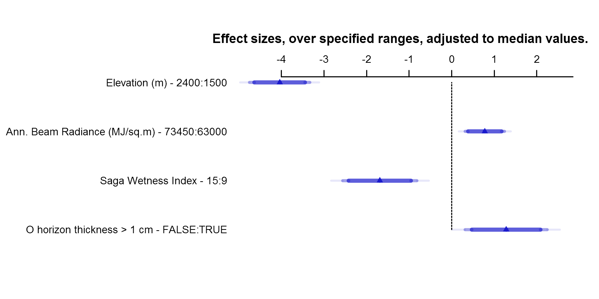

```{r setup, echo=FALSE, results='hide', warning=FALSE}
# setup
library(knitr, quietly=TRUE)
library(kableExtra, quietly=TRUE)
opts_chunk$set(message=FALSE, warning=FALSE, background='#F7F7F7', fig.align='center', fig.retina=2, dev='png', tidy=FALSE, verbose=FALSE)
options(width=100, stringsAsFactors=FALSE)
```


