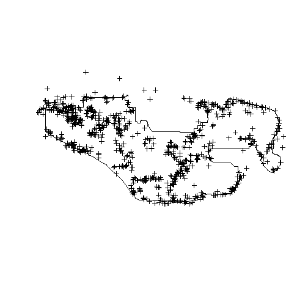
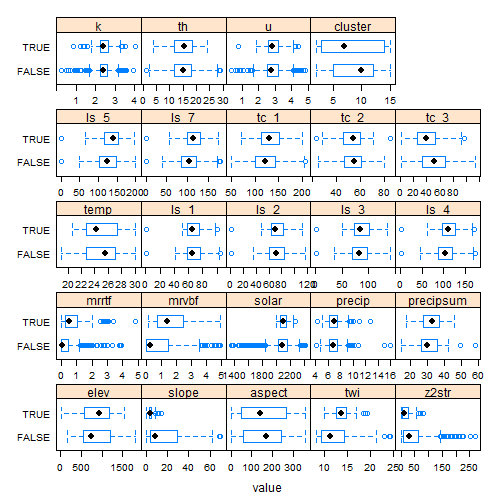

# Introduction

Generalized linear models (GLM) as the name implies are a generalization of the linear modeling framework to allow for the modeling of response variables (e.g. soil attributes) with non-normal distributions and heterogeneous variances. Whereas linear models are designed for predicting continuous soil properties such as clay content or temperature, GLM can be used to predict the presence/absence of argillic horizons (i.e. logistic regression) or counts of a plant species along a transact. This greatly expands the applicable of the linear modeling framework, while still allowing for a similar fitting procedure and interpretation of the resulting models.  

In the past in order to handle non-linearity and heterogeneous variances, transformations have been made to the response variable, such as the log(x). However such transformations complicate the models interpretation because the results refer to the transformed scale (e.g. log(x)). Also previous transformations were not guaranteed to achieve both normality and constant variance. GLM likewise transform the response, but provide separate functions to transform the mean response and variance, know as the link and variance functions respectively. So instead of looking like so

y = b0 + b1

you get

_f_(y) = b0 + b1


In order to allow for 

# Load packages

This is a necessary evil everytime you start R. Most of the basic functions we need to develop a logistic regression model are contained in base R, but the following contain some useful spatial and data manipulation functions. Believe it or not we will use all of them and more.


```r
library(aqp) # specialized soil classes and functions
library(soilDB) # NASIS and SDA import functions
library(raster) # guess
library(rgdal) # spatial import
library(lattice) # graphing
library(reshape2) # data manipulation
library(plyr) # data manipulation
library(caret) # printing
```

# Read in data

Hopefully like all good soil scientists and ecological site specialists you enter your field data into NASIS. Better yet hopefully someone else did it for you.  Once data is captured in NASIS it much easier to import the data into R, extract the pieces you need, manipulate it, model it, etc. If it's not entered into NASIS it may as well not exist, and will it haunt you for the rest of your life.


```r
pedons <- fetchNASIS() # beware the error messages, uh oh looks like we have some, look the other way (by default they don't get imported)
```

```
## mixing dry colors ... [20 of 4190 horizons]
```

```
## mixing moist colors ... [14 of 4226 horizons]
```

```
## replacing missing lower horizon depths with top depth + 1cm ... [148 horizons]
```

```
## -> QC: duplicate pedons: use `get('dup.pedon.ids', envir=soilDB.env)` for related peiid values
```

```
## -> QC: horizon errors detected, use `get('bad.pedon.ids', envir=soilDB.env)` for related userpedonid values
```

```r
#load(file = "C:/workspace/stats_for_soil_survey.git/trunk/data/ch7_data.Rdata")

str(pedons, max.level = 2)
```

```
## Formal class 'SoilProfileCollection' [package "aqp"] with 7 slots
##   ..@ idcol     : chr "peiid"
##   ..@ depthcols : chr [1:2] "hzdept" "hzdepb"
##   ..@ metadata  :'data.frame':	1 obs. of  1 variable:
##   ..@ horizons  :'data.frame':	4857 obs. of  43 variables:
##   ..@ site      :'data.frame':	1137 obs. of  77 variables:
##   ..@ sp        :Formal class 'SpatialPoints' [package "sp"] with 3 slots
##   ..@ diagnostic:'data.frame':	2133 obs. of  4 variables:
```

# Exploratory analysis

Generally before we begin modeling its good to explore the data. By using the summary() function, we can quickly see the breakdown of how many argillic horizons we have. Unfortunately, odds are all the argillic horizons haven't been properly populated in the diagnostic horizon table like they should be. Luckily for us, the desert argillic horizons always pop up in the taxonomic name, so we can use pattern matching to extract it. By doing this gain an additional 9 pedons with argillic horizons and are able to label the missing values (i.e. NA).


```r
summary(pedons$argillic.horizon)
```

```
##    Mode   FALSE    TRUE    NA's 
## logical     735     266     136
```

```r
summary(grepl("arg", pedons$tax_subgroup)) # use pattern matching to exact "arg" from the taxonomic subgroup name
```

```
##    Mode   FALSE    TRUE    NA's 
## logical     862     275       0
```

```r
pedons$argillic.horizon <- grepl("arg", pedons$tax_subgroup)
```

Ideally if the diagnostic horizon table were populated we could also filter out argillic horizons that start below 50cm, which may not be representative of "good" argillic horizons and may therefore have gotten correlated to a Torripsamments anyway. Not only are unrepresentative sites confusing for scientists, they're equally confusing for models. However as we saw earlier some pedons don't appear to be fully populated, so we'll stick with those pedons that have the argillic specified in their taxonomic subgroup name, since it gives us the biggest sample. 


```r
d <- diagnostic_hz(pedons)
idx <- unique(d[d$diag_kind == "argillic horizon" & d$featdept < 50, "peiid"])
test <- site(pedons)$peiid %in% idx
summary(test)
```

```
##    Mode   FALSE    TRUE    NA's 
## logical     914     223       0
```

Another obvious place to look is at the geomorphic data in the site table. This information is hopefully  (Nauman and Thompson, 2014)


```r
# Examine geomorphic info from te site table.
s <- site(pedons) # extract the site table from the pedons object
s$surface_gravel <- s$surface_gravel-s$surface_fgravel # recalculate gravel
s$surface_total <- apply(s[, grepl("surface", names(s))], 1, sum) # calculate the total rock fragments
s$pavement <- ifelse(s$slope_field < 15, s$surface_total, NA) # subset rock fragments to slopes < 15% 
s$bedrckdepth <- ifelse(s$slope_field < 15, s$bedrckdepth, NA) # subset bedrock depth to slopes <15%
s_m <- melt(s[c("argillic.horizon", "slope_field", "elev_field", "bedrckdepth", "pavement")], id = "argillic.horizon")
bwplot(argillic.horizon ~ value | variable, data = s_m, scales = list(x = "free"))
```


```r
# We can see a variety of landforms have been used. Some more frequently than others. Overall argillic horizons seem to concide with fan remnants.
table(s$landform.string, s$argillic.horizon)
```

```
##                                            
##                                             FALSE TRUE
##   alluvial fan                                 47    9
##   alluvial fan & drainageway                    1    0
##   alluvial fan & fan apron                      1    0
##   alluvial fan & fan piedmont                   1    0
##   alluvial fan & fan remnant                    1    0
##   alluvial fan & sand sheet                     1    0
##   ballena                                       7    3
##   bench                                         1    0
##   braided stream & swale                        1    0
##   channel                                       2    0
##   channel & drainageway                         1    0
##   drainageway                                  38    0
##   drainageway & alluvial fan                    2    0
##   drainageway & fan apron                       4    0
##   drainageway & fan piedmont                    3    0
##   drainageway & fan remnant                     3    0
##   drainageway & inset fan                       4    0
##   drainageway & valley                          2    0
##   dune                                          1    0
##   dune & sand sheet                             1    0
##   eroded fan remnant & pediment                 1    0
##   fan                                           8    1
##   fan & fan apron                               0    1
##   fan apron                                   123   27
##   fan apron & alluvial fan                      1    0
##   fan apron & fan piedmont                      0    2
##   fan apron & fan remnant                       3   19
##   fan apron & pediment                          6    0
##   fan apron & rock pediment                     2    0
##   fan piedmont                                  3    0
##   fan piedmont & alluvial fan                   0    1
##   fan piedmont & fan apron                      0    1
##   fan piedmont & fan remnant                    1    2
##   fan piedmont & pediment                       0    1
##   fan piedmont & wash                           1    0
##   fan remnant                                 120  103
##   fan remnant & alluvial fan                    2    1
##   fan remnant & alluvial fan & fan piedmont     1    0
##   fan remnant & channel                         1    0
##   fan remnant & fan apron                       1    7
##   fan remnant & fan piedmont                    1    2
##   fan remnant & hillslope                       0    1
##   fan remnant & pediment                        1    1
##   fan skirt                                     0    1
##   flat                                          1    0
##   free face                                     2    0
##   high hill                                     8    0
##   hill                                         47   15
##   hillside                                      2    0
##   hillslope                                   117   31
##   hillslope & hill                              1    0
##   hillslope & ridge                             0    1
##   hillslope & spur                              0    1
##   inselberg                                     2    0
##   inset fan                                    15    3
##   inset fan & fan remnant                       2    0
##   intermontane basin & fan remnant              0    1
##   lava flow                                     1    0
##   low hill                                      7    5
##   mountain                                     51    6
##   mountain slope                               72    8
##   partial ballena                               0    1
##   pediment                                     32   11
##   ridge                                         1    0
##   rock pediment                                 7    1
##   sand sheet                                   11    0
##   sand sheet & alluvial fan                     1    0
##   sand sheet & dune                             1    0
##   sand sheet & fan remnant                      2    1
##   spur                                         29    1
##   stream terrace                                5    0
##   terrace                                      10    0
##   terrace & valley                              3    0
##   valley                                        2    0
##   wash                                         15    0
```

```r
s$argillic.horizon <- ifelse(s$slope_field > 15, NA, s$argillic.horizon) # subset to look at just fans
round(prop.table(table(s$hillslope_pos, s$argillic.horizon), 1) * 100)
```

```
##            
##             FALSE TRUE
##   Toeslope     89   11
##   Footslope    71   29
##   Backslope    69   31
##   Shoulder     50   50
##   Summit       58   42
```

```r
round(prop.table(table(paste(s$shapedown, s$shapeacross), s$argillic.horizon), 1) * 100)
```

```
##                  
##                   FALSE TRUE
##   Concave Concave    80   20
##   Concave Convex     67   33
##   Concave Linear     92    8
##   Convex Concave    100    0
##   Convex Convex      68   32
##   Convex Linear      69   31
##   Linear Concave     84   16
##   Linear Convex      61   39
##   Linear Linear      70   30
##   Linear NA         100    0
##   NA NA              80   20
```

```r
# Argillic horizon by soil scientist, bias?
# Argillic horizon by soil scientist, bias?
desc_test <- function(old) {
  old <- as.character(old)
  new <- NA
  if (is.na(old)) {new <- "other"}
  if (grepl("Stephen", old)) {new <- "Stephen"} 
  if (grepl("Paul", old)) {new <- "Paul"} 
  if (grepl("Peter", old)) {new <- "Peter"}
  if (is.na(new)) {new <- "other"}
 return(new)
}

s <- site(pedons)
s$describer <- sapply(s$describer, desc_test)
pedons$describer <- s$describer

table(s$describer, s$argillic.horizon)
```

```
##          
##           FALSE TRUE
##   other     204   77
##   Paul      168   68
##   Peter     312  102
##   Stephen   178   28
```

```r
round(prop.table(table(s$describer, s$argillic.horizon), 1) * 100)
```

```
##          
##           FALSE TRUE
##   other      73   27
##   Paul       71   29
##   Peter      75   25
##   Stephen    86   14
```

```r
# Plot coordinates
idx <- complete.cases(site(pedons)[c("x", "y")]) # create an index to filter out pedons that are missing coordinates in WGS84
pedons2 <- pedons[idx]
coordinates(pedons2) <- ~ x + y # add coordinates to the pedon object
proj4string(pedons2) <- CRS("+init=epsg:4326") # add projection to pedon object

ssa <- readOGR(dsn = "M:/geodata/soils", layer = "soilsa_a_nrcs") # read in soil survey area boundaries
```

```
## OGR data source with driver: ESRI Shapefile 
## Source: "M:/geodata/soils", layer: "soilsa_a_nrcs"
## with 3262 features
## It has 8 fields
```

```r
ca794 <- subset(ssa, areasymbol == "CA794") # subset out Joshua Tree National Park
plot(ca794)
pedons_sp <- as(pedons2, "SpatialPointsDataFrame")
```

```
## only site data are extracted
```

```r
plot(pedons_sp, add = TRUE)
```



```r
# Beware some points that fall outside of CA794 are not show here. Some are way outside of CA794.

pedons_sp <- spTransform(pedons_sp, CRS("+init=epsg:5070"))
# writeOGR(pedons_sp, dsn = "M:/geodata/project_data/8VIC", "pedon_locations", driver = "ESRI Shapefile") # write shapefile of pedons
```

# Geodata extract

Prior to any spatial analysis or modeling, you need to develop a suite of geodata files that can be intersected with your field data. This is in and of itself is a difficult task, and should be facilitated by your Regional GIS Specialist. Typically this would primarily consist of derivatives from a DEM or satellite imagery. Prior to any prediction it is also necessary to ensure the geodata files have the same projection, extent, and cell size. Once we have the necessary files we can construct a list in R of the file names and paths, read the geodata into R and extract geodata values where they intersect with your field data.


```r
# folder1 <- "M:/geodata/project_data/8VIC/"
# folder2 <- "M:/geodata/imagery/gamma/"
# files1 <- list(
#   terrain = c(
#     elev    = "ned30m_8VIC.tif",
#     slope   = "ned30m_8VIC_slope5.tif",
#     aspect  = "ned30m_8VIC_aspect5.tif",
#     twi     = "ned30m_8VIC_wetness.tif",
#     z2str   = "ned30m_8VIC_z2stream.tif",
#     mrrtf   = "ned30m_8VIC_mrrtf.tif",
#     mrvbf   = "ned30m_8VIC_mrvbf.tif",
#     #  solar   = "ned30m_vic8_solar.tif",
#     solarcv = "ned30m_vic8_solarcv.tif"
#     ),
#   climate = c(
#     precip  = "prism30m_vic8_ppt_1981_2010_annual_mm.tif",
#     precipsum = "prism30m_vic8_ppt_1981_2010_summer_mm.tif",
#     temp    = "prism30m_vic8_tavg_1981_2010_annual_C.tif"
#     ),
#   imagery = c(
#     ls = "landsat30m_vic8_b123457.tif",
#     tc      = "landsat30m_vic8_tc123.tif"
#     )
# )
# files2 <- list(
#   gamma = c(
#     k  = "namrad_k_aea.tif",
#     th = "namrad_th_aea.tif",
#     u  = "namrad_u_aea.tif"
#     )
# )
# geodata <- c(lapply(files1, function(x) paste0(folder1, x)), lapply(files2, function(x) paste0(folder2, x))) 
# names(geodata$terrain) <- names(files1$terrain)
# names(geodata$climate) <- names(files1$climate)
# names(geodata$imagery) <- names(files1$imagery)
# names(geodata$gamma) <- names(files2$gamma)
# 
# geodata_df <- data.frame(
#   as.data.frame(pedons_sp)[c("argillic.horizon", "x_std", "y_std", "describer")],
#   extract(stack(geodata$terrain[1:7]), pedons_sp),
#   extract(raster(geodata$terrain[8]), pedons_sp),
#   extract(stack(geodata$imagery), pedons_sp),
#   extract(stack(geodata$gamma), pedons_sp),
#   extract(stack(geodata$climate), pedons_sp)
#   )
# names(geodata_df)[c(12, 18)] <- c("solarcv", "ls_7")
# 
# gidx <- list()
# gidx$terrain <- names(files1$terrain)
# gidx$climate <- names(files1$climate)
# gidx$imagery <- names(geodata_df)[!names(geodata_df) %in% names(files1$terrain) &
#                                         !names(geodata_df) %in% names(files1$climate) &
#                                         !names(geodata_df) %in% names(files2$gamma) &
#                                         !names(geodata_df) %in% c("argillic.horizon", "x_std", "y_std", "describer", "surface_total")]
# gidx$gamma <- names(files2$gamma)
# 
# 
# data <- subset(geodata_df, select = - c(x_std, y_std))
# save(data, ca794, pedons, file = "C:/workspace/stats_for_soil_survey.git/trunk/data/ch7_data.Rdata")
```


```r
load(file = "C:/workspace/stats_for_soil_survey.git/trunk/data/ch7_data.Rdata")
data <- na.exclude(data)
data$argillic.horizon <- data$mrvbf > 0.15 & data$argillic.horizon == TRUE # Subset out argillic horizons that only occur on fans. Argillic horizons that occur on hills and mountains more than likely form by different process, and therefore would require a different model.
data_m <- subset(data, select = - c(describer))
data_m <- melt(data_m, id = "argillic.horizon")
bwplot(argillic.horizon ~ value | variable, data = data_m, scales = list(x = "free"), as.table = TRUE)
```



```r
# Argillic horizons seem to occur over a limited range of twi and z2str. So lets rescale those variables by substracting their median
aggregate(data[c("twi", "z2str")], list(data$argillic.horizon), median)
```

```
##   Group.1      twi    z2str
## 1   FALSE 11.46485 30.64749
## 2    TRUE 13.78531 13.06227
```

```r
data$twi_sc <- abs(data$twi - 13.7)
data$z2str_sc <- abs(data$z2str - 12.9)

test <- glm(argillic.horizon ~., data = data, family = binomial())
```

```
## Warning: glm.fit: fitted probabilities numerically 0 or 1 occurred
```

```r
summary(test)
```

```
## 
## Call:
## glm(formula = argillic.horizon ~ ., family = binomial(), data = data)
## 
## Deviance Residuals: 
##     Min       1Q   Median       3Q      Max  
## -1.8310  -0.5236  -0.1247  -0.0012   3.2928  
## 
## Coefficients:
##                   Estimate Std. Error z value Pr(>|z|)    
## (Intercept)      49.794107  36.922951   1.349  0.17747    
## describerPaul     1.156174   0.426863   2.709  0.00676 ** 
## describerPeter   -0.261904   0.348883  -0.751  0.45284    
## describerStephen -0.981873   0.761515  -1.289  0.19727    
## elev              0.006459   0.003172   2.036  0.04172 *  
## slope            -0.283080   0.086921  -3.257  0.00113 ** 
## aspect            0.000429   0.001066   0.402  0.68740    
## twi              -0.110827   0.105041  -1.055  0.29139    
## z2str            -0.014094   0.017690  -0.797  0.42561    
## mrrtf            -0.140578   0.257366  -0.546  0.58492    
## mrvbf            -0.112476   0.172442  -0.652  0.51424    
## solarcv           0.124549   0.077252   1.612  0.10691    
## ls_1              0.045822   0.145400   0.315  0.75265    
## ls_2             -0.141179   0.194931  -0.724  0.46891    
## ls_3              0.047001   0.160995   0.292  0.77033    
## ls_4              0.089769   0.231674   0.387  0.69840    
## ls_5             -0.212217   0.110710  -1.917  0.05525 .  
## ls_7             -0.099574   0.102560  -0.971  0.33160    
## tc_1             -0.009394   0.145653  -0.064  0.94858    
## tc_2             -0.093578   0.287673  -0.325  0.74496    
## tc_3             -0.302187   0.194732  -1.552  0.12071    
## k                 0.485268   0.341585   1.421  0.15542    
## th               -0.038211   0.044467  -0.859  0.39017    
## u                -0.220296   0.369318  -0.596  0.55085    
## precip           -0.048169   0.016035  -3.004  0.00266 ** 
## precipsum        -0.025821   0.039212  -0.659  0.51021    
## temp              0.235828   0.352376   0.669  0.50333    
## twi_sc           -0.568161   0.118761  -4.784 1.72e-06 ***
## z2str_sc         -0.010810   0.020399  -0.530  0.59617    
## ---
## Signif. codes:  0 '***' 0.001 '**' 0.01 '*' 0.05 '.' 0.1 ' ' 1
## 
## (Dispersion parameter for binomial family taken to be 1)
## 
##     Null deviance: 764.50  on 860  degrees of freedom
## Residual deviance: 497.84  on 832  degrees of freedom
## AIC: 555.84
## 
## Number of Fisher Scoring iterations: 9
```

```r
confusionMatrix(test$fitted.values > 0.5, as.logical(test$y), positive = "TRUE")
```

```
## Confusion Matrix and Statistics
## 
##           Reference
## Prediction FALSE TRUE
##      FALSE   692   90
##      TRUE     29   50
##                                           
##                Accuracy : 0.8618          
##                  95% CI : (0.8369, 0.8842)
##     No Information Rate : 0.8374          
##     P-Value [Acc > NIR] : 0.02727         
##                                           
##                   Kappa : 0.3844          
##  Mcnemar's Test P-Value : 3.794e-08       
##                                           
##             Sensitivity : 0.35714         
##             Specificity : 0.95978         
##          Pos Pred Value : 0.63291         
##          Neg Pred Value : 0.88491         
##              Prevalence : 0.16260         
##          Detection Rate : 0.05807         
##    Detection Prevalence : 0.09175         
##       Balanced Accuracy : 0.65846         
##                                           
##        'Positive' Class : TRUE            
## 
```

```r
test2 <- glm(argillic.horizon ~ twi_sc + slope + z2str_sc + tc_2, data = na.exclude(data), family = binomial())
confusionMatrix(test2$fitted.values > 0.35, as.logical(test2$y), positive = "TRUE")
```

```
## Confusion Matrix and Statistics
## 
##           Reference
## Prediction FALSE TRUE
##      FALSE   635   69
##      TRUE     86   71
##                                           
##                Accuracy : 0.82            
##                  95% CI : (0.7927, 0.8451)
##     No Information Rate : 0.8374          
##     P-Value [Acc > NIR] : 0.9224          
##                                           
##                   Kappa : 0.3698          
##  Mcnemar's Test P-Value : 0.1987          
##                                           
##             Sensitivity : 0.50714         
##             Specificity : 0.88072         
##          Pos Pred Value : 0.45223         
##          Neg Pred Value : 0.90199         
##              Prevalence : 0.16260         
##          Detection Rate : 0.08246         
##    Detection Prevalence : 0.18235         
##       Balanced Accuracy : 0.69393         
##                                           
##        'Positive' Class : TRUE            
## 
```


