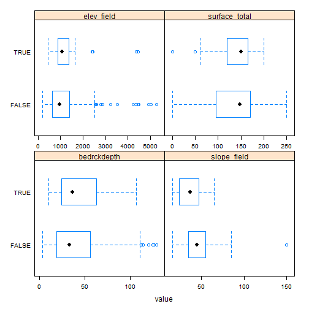
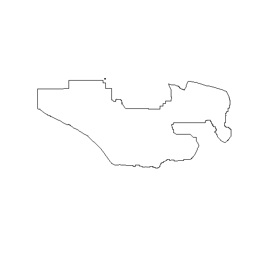

# Introduction

Generalized linear models (GLM) as the name implies are a generalization of the linear modeling framework to allow for the modeling of response variables (e.g. soil attributes) with non-normal distributions and heterogeneous variances. Whereas linear models are designed for predicting continuous soil properties such as clay content or soil temperature, GLM can be used to predict the presence/absence of argillic horizons (i.e. logistic regression) or counts of a plant species along a transact (i.e. Poisson regression). These generalizations greatly expands the applicability of the linear modeling framework, while still allowing for a similar fitting procedure and interpretation of the resulting models.

In the past in order to handle non-linearity and heterogeneous variances, transformations have been made to the response variable, such as the log(x). However such transformations complicate the models interpretation because the results refer to the transformed scale (e.g. log(x)). Also previous transformations were not guaranteed to achieve both normality and constant variance simultaneously. GLM likewise transform the response, but also preserve the scale of the response and provide separate functions to transform the mean response and variance, know as the link and variance functions respectively. So instead of looking like this

$f(y) = \beta_{0} + \beta_{1}x + \varepsilon$

you get this

$g(\mu)$ or $\eta = \beta_{0} + \beta_{1}x + \varepsilon$

with $g(\mu)$ or $\eta$ symbolizing the link function. 

Another alteration the classical linear model is that with GLM the coefficients are estimated iteratively by maximum likelihood estimation instead of ordinary least squares. This results in the GLM minimizing the deviance, instead of the sum of squares. However for the Gaussian (i.e. normal) distributions the deviance and sum of squares are equivalent.


# Logistic regression

Logistic regression is a specific type of GLM designed to model data that has a binomial distribution (i.e. presence/absence, yes/no, or proportional data), which in statistical learning parlance is considered a classification problem. For binomial data the logit link transform is used. The effect of the logit transform can be seen in the following figure. It creates a sigmoidal curve, which enhances the separation between the two groups. It also has the effect of ensuring that the values range between 0 and 1.


When comparing a simple linear model vs a simple logistic model we can see the effect of the logit transform on the relationship between the response and predictor variable. As before it follows a sigmoidal curve and prevents predictions from exceeding 0 and 1. 


# Logistic regression example

Now that we've got some of the basic GLM theory out of the way we'll move on to a real example, and address any additional theory where it relates to specific steps in the modeling process. The examples selected for this chapter comes from Joshua Tree National Park (JTNP)(i.e. CA794) in the Mojave desert (where full disclosure I've dug a few holes). The problem tackled here is a familiar one, where can I expect to find argillic horizons on fan piedmonts. Argillic horizons within the Mojave are typically found on fan remnants, which are a stable landform that is a remnant of the Pleistocene (Peterson, 1981). Despite the low relief of most fans, fan remnants are uplands in the sense that they generally don't receive run-on or deposition.

With this dataset we'll encounter some challenges. To start with, fan piedmont landscapes typically have relatively little relief. Since most of our predictors will be derivatives of elevation, that won't leave us much to work with. Also, our elevation data comes from the USGS National Elevation dataset (NED), which provides considerable less detail than say LiDAR or IFSAR (Shi et al., 2012). Lastly our pedon dataset like most in NASIS, hasn't receive near as much quality control as have the components. So we'll need to massage some of the pedon data before we can analyze it. These are all typical problems encountered in any data analysis and should be good practice. Ideally it would be more interesting to try and model individual soil series with argillic horizons, but do to some challenges just mentioned this is difficult with this dataset. However, at the end we'll look at one simple approach to try and separate individual soil series with argillic horizons.

# Load packages

To start, as always we need to load some extra packages. This is a necessary evil every time you start R. Most of the basic functions we need to develop a logistic regression model are contained in base R, but the following contain some useful spatial and data manipulation functions. Believe it or not we will use all of them and more.


# Read in data

Hopefully like all good soil scientists and ecological site specialists you enter your field data into NASIS. Better yet hopefully someone else did it for you. Once data is captured in NASIS it much easier to import the data into R, extract the pieces you need, manipulate it, model it, etc. If it's not entered into NASIS it may as well not exist, and will it haunt you for the rest of your life.


```r
# pedons <- fetchNASIS(rmHzErrors = FALSE) # beware the error messages, by default they don't get imported unless you override the default, which in our chase shouldn't cause any problems
load(file = "C:/workspace/stats_for_soil_survey/trunk/data/ch7_data.Rdata")

str(pedons, max.level = 2) # Examine the makeup of the data we imported from NASIS.
```

```
## Formal class 'SoilProfileCollection' [package "aqp"] with 7 slots
##   ..@ idcol     : chr "peiid"
##   ..@ depthcols : chr [1:2] "hzdept" "hzdepb"
##   ..@ metadata  :'data.frame':	1 obs. of  1 variable:
##   ..@ horizons  :'data.frame':	4857 obs. of  43 variables:
##   ..@ site      :'data.frame':	1137 obs. of  82 variables:
##   ..@ sp        :Formal class 'SpatialPoints' [package "sp"] with 3 slots
##   ..@ diagnostic:'data.frame':	2133 obs. of  4 variables:
```

# Exploratory analysis

Generally before we begin modeling its good to explore the data. By using the summary() function, we can quickly see the breakdown of how many argillic horizons we have. Unfortunately, odds are all the argillic horizons haven't been properly populated in the diagnostic horizon table like they should be. Luckily for us, the desert argillic horizons always pop up in the taxonomic name, so we can use pattern matching to extract it. By doing this we gain an additional 11 pedons with argillic horizons and are able to label the missing values (i.e. NA). At a minimum for modeling purposes we probably need 10 pedons of the target we're interested in and a total of 100 observations overall.


```r
s <- site(pedons) # extract the site table
summary(s$argillic.horizon) # tabulate the number of argillic horizons observed
```

```
##    Mode   FALSE    TRUE    NA's 
## logical     735     266     136
```

```r
# or
table(s$argillic.horizon)
```

```
## 
## FALSE  TRUE 
##   735   266
```

```r
s$argillic.horizon2 <- grepl("arg", s$tax_subgroup)
summary(s$argillic.horizon2)
```

```
##    Mode   FALSE    TRUE    NA's 
## logical     862     275       0
```

Ideally if the diagnostic horizon table were populated we could also filter out argillic horizons that start below 50cm, which may not be representative of "good" argillic horizons and may therefore have gotten correlated to a Torripsamments anyway. Not only are unrepresentative sites confusing for scientists, they're equally confusing for models. However as we saw earlier some pedons don't appear to be fully populated, so we'll stick with those pedons that have the argillic specified in their taxonomic subgroup name, since it gives us the biggest sample.


```r
d <- diagnostic_hz(pedons)
idx <- unique(d[d$diag_kind == "argillic horizon" & d$featdept < 50, "peiid"])
test <- s$peiid %in% idx
summary(test)
```

```
##    Mode   FALSE    TRUE    NA's 
## logical     914     223       0
```

Another obvious place to look is at the geomorphic data in the site table. This information is intended to help differentiate where our soil observations exist on the landscape. If populated consistently if could be used in future disaggregation efforts, as demonstrated by Nauman and Thompson, 2014.


```r
s$surface_gravel <- s$surface_gravel - s$surface_fgravel # recalculate gravel
s$surface_total <- apply(s[grepl("surface", names(s))], 1, sum) # calculate the total rock fragments

s_sub <- subset(s, slope_field > 15, select = c(argillic.horizon2, bedrckdepth, slope_field, elev_field, surface_total)) # subset quantitative columns and taxonname, and slopes > 15 to just look at fans
s_m <- melt(s_sub, id = "argillic.horizon2") # convert s_sub to wide data format
head(s_m)
```

```
##   argillic.horizon2    variable value
## 1             FALSE bedrckdepth    NA
## 2             FALSE bedrckdepth    18
## 3              TRUE bedrckdepth    NA
## 4             FALSE bedrckdepth    18
## 5             FALSE bedrckdepth    28
## 6             FALSE bedrckdepth    15
```

```r
bwplot(argillic.horizon2 ~ value | variable, data = s_m, scales = list(x = "free"))
```



Looking at our continuous variables we don't appear to have more separation between the presence/absence of argillic horizons.

Lets look at categorical variables next.


```r
s_sub <- subset(s, argillic.horizon2 == 1)
table(s_sub$landform.string, s_sub$argillic.horizon) # cross tabulate landform vs argillic horizon
```

```
##                                   
##                                    FALSE TRUE
##   alluvial fan                         0    8
##   ballena                              0    3
##   fan                                  0    1
##   fan & fan apron                      0    1
##   fan apron                            0   26
##   fan apron & fan piedmont             0    2
##   fan apron & fan remnant              0   19
##   fan piedmont & alluvial fan          0    1
##   fan piedmont & fan apron             0    1
##   fan piedmont & fan remnant           0    2
##   fan piedmont & pediment              0    1
##   fan remnant                          6   92
##   fan remnant & alluvial fan           0    1
##   fan remnant & fan apron              0    7
##   fan remnant & fan piedmont           0    1
##   fan remnant & hillslope              0    1
##   fan remnant & pediment               0    1
##   fan skirt                            0    1
##   hill                                 0   15
##   hillslope                            1   29
##   hillslope & ridge                    0    1
##   hillslope & spur                     0    1
##   inset fan                            0    3
##   intermontane basin & fan remnant     0    1
##   low hill                             0    5
##   mountain                             0    6
##   mountain slope                       1    6
##   partial ballena                      0    1
##   pediment                             2    9
##   rock pediment                        1    0
##   sand sheet & fan remnant             0    1
##   spur                                 0    1
```

Examining a frequency table we can see that argillic horizons occur predominantly on fan remnants as was alluded too earlier. However they also seem to occur frequently on several other landforms. Other observations seem to have made use of curious landform combinations or redundant terms.


```r
round(prop.table(table(s$hillslope_pos, s$argillic.horizon), 2) * 100) # cross tabulate and calculate proportions, the "2" calculates the proportions relative to the column totals
```

```
##            
##             FALSE TRUE
##   Toeslope     11    7
##   Footslope     3    4
##   Backslope    64   49
##   Shoulder      9    9
##   Summit       13   30
```

```r
round(prop.table(table(paste(s$shapedown, s$shapeacross), s$argillic.horizon), 2) * 100)
```

```
##                  
##                   FALSE TRUE
##   Concave Concave     1    0
##   Concave Convex      2    2
##   Concave Linear      3    1
##   Convex Concave      1    0
##   Convex Convex      11    9
##   Convex Linear       5    7
##   Linear Concave      6    6
##   Linear Convex      21   31
##   Linear Linear      39   39
##   Linear NA           0    0
##   NA NA              10    6
```

Looking 


```r
# Argillic horizon by soil scientist, bias?
desc_test <- function(old) {
  old <- as.character(old)
  new <- NA
  # ranked by seniority
  if (is.na(old)) {new <- "other"}
  if (grepl("Stephen", old)) {new <- "Stephen"} 
  if (grepl("Paul", old)) {new <- "Paul"} 
  if (grepl("Peter", old)) {new <- "Peter"}
  if (is.na(new)) {new <- "other"}
 return(new)
}

# s$describer2 <- sapply(s$describer, desc_test)
# 
# table(s$describer2, s$argillic.horizon2)
# round(prop.table(table(s$describer2, s$argillic.horizon2), 2) * 100)
```


```r
# Plot coordinates
# slot(pedons, "site") <- s # this is dangerous, but something needs to be fixed in the site() setter function
# idx <- complete.cases(site(pedons)[c("x", "y")]) # create an index to filter out pedons that are missing coordinates in WGS84
# pedons2 <- pedons[idx]
# coordinates(pedons2) <- ~ x + y # add coordinates to the pedon object
# proj4string(pedons2) <- CRS("+init=epsg:4326") # add projection to pedon object
#  
# ssa <- readOGR(dsn = "M:/geodata/soils", layer = "soilsa_a_nrcs") # read in soil survey area boundaries
# ca794 <- subset(ssa, areasymbol == "CA794") # subset out Joshua Tree National Park
plot(ca794)
```



```r
# pedons_sp <- as(pedons2, "SpatialPointsDataFrame")
# plot(pedons_sp, add = TRUE) # Beware some points that fall outside of CA794 are not show here. Some are way outside of CA794.
# 
# pedons_sp <- spTransform(pedons_sp, CRS("+init=epsg:5070"))
# writeOGR(pedons_sp, dsn = "M:/geodata/project_data/8VIC", "pedon_locations", driver = "ESRI Shapefile") # write shapefile of pedons
```

# Extract geodata at pedons locations

Prior to any spatial analysis or modeling, you need to develop a suite of geodata files that can be intersected with your field data locations. This is in and of itself is a difficult task, and should be facilitated by your Regional GIS Specialist. Typically this would primarily consist of derivatives from a DEM or satellite imagery. Prior to any prediction it is also necessary to ensure the geodata files have the same projection, extent, and cell size. Once we have the necessary files we can construct a list in R of the file names and paths, read the geodata into R and extract the geodata values where they intersect with your field data locations.


```r
# folder <- "M:/geodata/project_data/8VIC/"
# files <- list(
#   elev   = "ned30m_8VIC.tif",
#   slope  = "ned30m_8VIC_slope5.tif",
#   aspect = "ned30m_8VIC_aspect5.tif",
#   twi    = "ned30m_8VIC_wetness.tif",
#   z2str  = "ned30m_8VIC_z2stream.tif",
#   mrrtf  = "ned30m_8VIC_mrrtf.tif",
#   mrvbf  = "ned30m_8VIC_mrvbf.tif",
#   solar  = "ned30m_8VIC_solar.tif",
#   precip = "prism30m_8VIC_ppt_1981_2010_annual_mm.tif",
#   precipsum = "prism30m_8VIC_ppt_1981_2010_summer_mm.tif",
#   temp   = "prism30m_8VIC_tmean_1981_2010_annual_C.tif",
#   ls     = "landsat30m_8VIC_b123457.tif",
#   tc     = "landsat30m_8VIC_tc123.tif",
#   k      = "gamma30m_8VIC_namrad_k.tif",
#   th     = "gamma30m_8VIC_namrad_th.tif",
#   u      = "gamma30m_8VIC_namrad_u.tif",
#   cluster = "cluster152.tif"
#   )
# geodata <- lapply(files, function(x) paste0(folder, x)) 
# 
# data <- data.frame(
#    as.data.frame(pedons_sp)[c("pedon_id", "taxonname", "argillic.horizon2", "x_std", "y_std", "describer2")],
#    extract(stack(geodata), pedons_sp)
#    )
# names(data)[names(data) == "ls_6"] <- "ls_7"

# s[c("describer", "describer2", "x", "y", "x_std", "y_std", "utmnorthing", "utmeasting", "classifier")] <- NA
# slot(pedons, "site") <- s
# data[c("describer2", "x_std", "y_std")] <- NA
# save(data, ca794, pedons, file = "C:/workspace/stats_for_soil_survey/trunk/data/ch7_data.Rdata")
```


```r
data$argillic.horizon2 <- data$mrvbf > 0.15 & data$argillic.horizon2 == TRUE # Subset out argillic horizons that only occur on fans. Argillic horizons that occur on hills and mountains more than likely form by different process, and therefore would require a different model.

data_m <- subset(data, select = - c(pedon_id, taxonname, x_std, y_std, describer2))
data_m <- melt(data_m, id = "argillic.horizon2")
bwplot(argillic.horizon2 ~ value | variable, data = data_m, scales = list(x = "free"))
```


```r
# Argillic horizons seem to occur over a limited range of twi and z2str. So lets rescale those variables by substracting their median
aggregate(data["twi"], list(data$argillic.horizon2), median, na.rm = TRUE)
```

```
##   Group.1      twi
## 1   FALSE 11.31017
## 2    TRUE 13.72271
```

```r
data$twi_sc <- abs(data$twi - 13.7)

data2 <- subset(data, select = - c(pedon_id, describer2, taxonname, x_std, y_std))

test <- glm(argillic.horizon2 ~ ., data = data2, family = binomial(link = "cloglog"))
```

```
## Warning: glm.fit: fitted probabilities numerically 0 or 1 occurred
```

```r
summary(test)
```

```
## 
## Call:
## glm(formula = argillic.horizon2 ~ ., family = binomial(link = "cloglog"), 
##     data = data2)
## 
## Deviance Residuals: 
##     Min       1Q   Median       3Q      Max  
## -1.8656  -0.5762  -0.1339  -0.0033   2.5937  
## 
## Coefficients:
##               Estimate Std. Error z value Pr(>|z|)    
## (Intercept)  4.4250564 28.0377967   0.158  0.87459    
## elev         0.0039911  0.0024896   1.603  0.10891    
## slope       -0.2517727  0.0587929  -4.282 1.85e-05 ***
## aspect       0.0001825  0.0007633   0.239  0.81107    
## twi         -0.0666702  0.0703092  -0.948  0.34301    
## z2str       -0.0158878  0.0050741  -3.131  0.00174 ** 
## mrrtf       -0.0712299  0.1515580  -0.470  0.63837    
## mrvbf       -0.2202082  0.1200918  -1.834  0.06670 .  
## solar       -0.0039055  0.0022934  -1.703  0.08859 .  
## precip       0.0319766  0.1680093   0.190  0.84905    
## precipsum   -0.0232382  0.0452812  -0.513  0.60781    
## temp         0.5053086  0.3271622   1.545  0.12246    
## ls_1        -0.0442781  0.1049474  -0.422  0.67309    
## ls_2        -0.0527589  0.1389544  -0.380  0.70418    
## ls_3         0.0891085  0.1088663   0.819  0.41306    
## ls_4        -0.0223692  0.1629264  -0.137  0.89080    
## ls_5        -0.0225686  0.0720463  -0.313  0.75409    
## ls_7        -0.0292795  0.0711843  -0.411  0.68084    
## tc_1         0.0035188  0.0880985   0.040  0.96814    
## tc_2        -0.0073013  0.2059838  -0.035  0.97172    
## tc_3        -0.0447061  0.1227506  -0.364  0.71571    
## k            0.4358184  0.3174857   1.373  0.16984    
## th           0.0251538  0.0340306   0.739  0.45981    
## u           -0.3591788  0.3015085  -1.191  0.23355    
## cluster     -0.0081692  0.0199257  -0.410  0.68182    
## twi_sc      -0.4890546  0.0826274  -5.919 3.24e-09 ***
## ---
## Signif. codes:  0 '***' 0.001 '**' 0.01 '*' 0.05 '.' 0.1 ' ' 1
## 
## (Dispersion parameter for binomial family taken to be 1)
## 
##     Null deviance: 897.54  on 1004  degrees of freedom
## Residual deviance: 613.38  on  979  degrees of freedom
##   (9 observations deleted due to missingness)
## AIC: 665.38
## 
## Number of Fisher Scoring iterations: 9
```

```r
confusionMatrix(test$fitted.values > 0.5, as.logical(test$y), positive = "TRUE")
```

```
## Confusion Matrix and Statistics
## 
##           Reference
## Prediction FALSE TRUE
##      FALSE   812  115
##      TRUE     28   50
##                                           
##                Accuracy : 0.8577          
##                  95% CI : (0.8346, 0.8787)
##     No Information Rate : 0.8358          
##     P-Value [Acc > NIR] : 0.0318          
##                                           
##                   Kappa : 0.3422          
##  Mcnemar's Test P-Value : 6.4e-13         
##                                           
##             Sensitivity : 0.30303         
##             Specificity : 0.96667         
##          Pos Pred Value : 0.64103         
##          Neg Pred Value : 0.87594         
##              Prevalence : 0.16418         
##          Detection Rate : 0.04975         
##    Detection Prevalence : 0.07761         
##       Balanced Accuracy : 0.63485         
##                                           
##        'Positive' Class : TRUE            
## 
```

```r
test2 <- glm(argillic.horizon2 ~ 1, data = data2, family = binomial(link = "cloglog"))
summary(test2)
```

```
## 
## Call:
## glm(formula = argillic.horizon2 ~ 1, family = binomial(link = "cloglog"), 
##     data = data2)
## 
## Deviance Residuals: 
##     Min       1Q   Median       3Q      Max  
## -0.5983  -0.5983  -0.5983  -0.5983   1.9019  
## 
## Coefficients:
##             Estimate Std. Error z value Pr(>|z|)    
## (Intercept) -1.72053    0.07772  -22.14   <2e-16 ***
## ---
## Signif. codes:  0 '***' 0.001 '**' 0.01 '*' 0.05 '.' 0.1 ' ' 1
## 
## (Dispersion parameter for binomial family taken to be 1)
## 
##     Null deviance: 903.66  on 1012  degrees of freedom
## Residual deviance: 903.66  on 1012  degrees of freedom
##   (1 observation deleted due to missingness)
## AIC: 905.66
## 
## Number of Fisher Scoring iterations: 5
```

```r
#confusionMatrix(test2$fitted.values > 0.5, as.logical(test2$y), positive = "TRUE")
```


