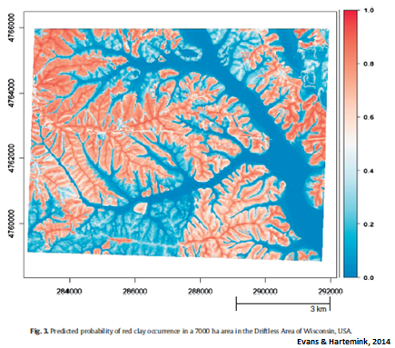
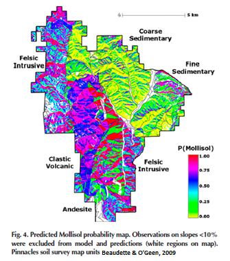
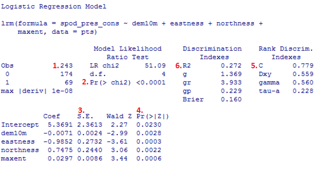
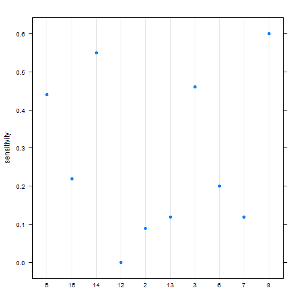
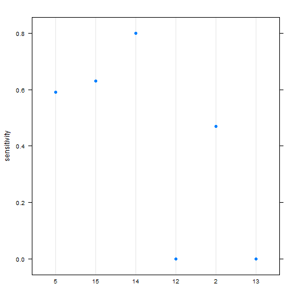
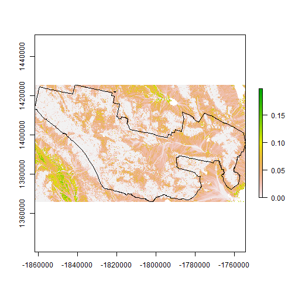

  

# Introduction

Generalized linear models (GLM) as the name implies are a generalization of the linear modeling framework to allow for the modeling of response variables (e.g. soil attributes) with non-normal distributions and heterogeneous variances. Whereas linear models are designed for predicting continuous soil properties such as clay content or soil temperature, GLM can be used to predict the presence/absence of argillic horizons (i.e. logistic regression) or counts of a plant species along a transect (i.e. Poisson regression). These generalizations greatly expand the applicability of the linear modeling framework, while still allowing for a similar fitting procedure and interpretation of the resulting models.

In the past in order to handle non-linearity and heterogeneous variances, transformations have been made to the response variable, such as the log(x). However, such transformations complicate the models interpretation because the results refer to the transformed scale (e.g. log(x)). These response transformations are not guaranteed to achieve both normality and constant variance simultaneously. GLM approaches transform the response, but also preserve the scale of the response, and provide separate functions to transform the mean response and variance, known as the link and variance functions respectively. So instead of looking like this:

$f(y) = \beta_{0} + \beta_{1}x + \varepsilon$

you get this:

$g(\mu)$ or $\eta = \beta_{0} + \beta_{1}x + \varepsilon$

with $g(\mu)$ or $\eta$ symbolizing the link function. 

Another alteration of the classical linear model is that with GLM the coefficients are estimated iteratively by maximum likelihood estimation instead of ordinary least squares. This results in the GLM minimizing the deviance, instead of the sum of squares. However, for the Gaussian (i.e. normal) distributions the deviance and sum of squares are equivalent.


# Logistic regression

Logistic regression is a specific type of GLM designed to model data that has a binomial distribution (i.e. presence/absence, yes/no, or proportional data), which in statistical learning parlance is considered a classification problem. For binomial data the logit link transform is generally used. The effect of the logit transform can be seen in the following figure. It creates a sigmoidal curve, which enhances the separation between the two groups. It also has the effect of ensuring that the values range between 0 and 1.


When comparing a simple linear model vs a simple logistic model we can see the effect of the logit transform on the relationship between the response and predictor variable. As before it follows a sigmoidal curve and prevents predictions from exceeding 0 and 1.


Examples of Logistic regression output showing probability of red clay parent material, mollisol and ponded components:  

 



# Logistic regression rules of thumb

- The response variable is discrete, i.e. binomial, present/absent, 0/1
- The independent variables can be numeric or categorical  
- No assumptions for normality among independent variables
- Check for highly correlated variables and select accordingly
- The minimum number of cases per independent variable is 10:1
- The <strong>preferred</strong> number of cases per independent variable is 20:1
- The <strong>preferred</strong> number of cases per independent variable is 50:1 when using stepwise logistic regression 

# Logistic regression quick example

This example will provide a quick introduction to logistic regression by exploring the presence of soils with spodic characteristics in the Central Appalachians of West Virginia. Spodisols and soils with spodic properties form under the process of podzolization. The process of podzolization involves the removal (eluviation) of organic material, aluminum and iron from upper soil horizons (O, A and E) and the accumulation (illuviation) of these materials in the subsoil spodic horizon(s). In this region, these soils are associated with the past and present occurence of red spruce forest cover. 

Load the required packages and set the working directory. Change the working directory to accomodate your working environment.

```r
require(sp)
require(raster)
require(rgdal)
require(rms)
setwd("C:/workspace")
```
Select sample file, create data frame and view the first few records

```r
file <-'https://raw.githubusercontent.com/ncss-tech/stats_for_soil_survey/master/data/logistic/wv_transect_editedforR.csv'
download.file(file, destfile = "pts.csv")
pts <- read.csv("pts.csv", header=TRUE, sep=",")
head(pts, 1) 
```

Soil scientists developed a local, ad-hoc classification of the intensity of spodic expression for use in the region that is an ordered data type. This will need to be converted to a binary classification for modeling purposes.

Add a column called spod\_pres\_cons to the pts object that converts spodint to a binary variable

```r
pts$spod_pres_cons <- ifelse(pts$spodint <= 1, 0, 1) 
```

Create a model using dem10m, eastness, northness, and maxent to predict spod\_pres\_con and view the summary

```r
GLM.1 <- lrm(spod_pres_cons ~ dem10m + eastness + northness + maxent, data=pts)
print(GLM.1)
```

The summary will look similar to the following:

 

Evaluating the results involves review of several key values as noted in the summary figure:

1. Is the ratio of observations to independent variables ok?
2. What is the relationship between the dependent and independent variables? A low P value indicates there is a relationship between the DV and IV
3. Is multicollinearity present? Standard Errors should be less than 2, which does not pertain to the intercept.
4. Relationship of individual independent variables to the dependent variable. Small "p" values indicate the independent variable is a meaningful predictor
5. Does the model perform better than random chance?
"C" refers to the concordance aka c-index or AUC, with the following suggested scale (Hosmer & Lemeshow, 2013),
0.5 = no discrimination,
0.7 - 0.8 acceptable discrimination,
0.8 - 0.9 excellent discrimination,
>0.9 outstanding discrimination
6. What is the "Goodness of fit" for the model? The R2  of linear regression does not exist for Logistic regression. A measure called the pseudo R squared is only roughly analogous. There are several methods for calculating the pseudo R squared. In general, the higher the value the greater the variability that is explained by the independent variables. 


# Logistic regression example

Now we will move on to a detailed example, and address any additional theory where it relates to specific steps in the modeling process. The examples selected for this chapter come from Joshua Tree National Park (JTNP)(i.e. CA794) in the Mojave desert. The problem tackled here is a familiar one: Where can I expect to find argillic horizons on fan piedmonts? Argillic horizons within the Mojave are typically found on fan remnants, which are a stable landform that is a remnant of the Pleistocene (Peterson, 1981). Despite the low relief of most fans, fan remnants are uplands in the sense that they generally don't receive run-on or active deposition.

With this dataset we'll encounter some challenges. To start with, fan piedmont landscapes typically have relatively little relief. Since most of our predictors will be derivatives of elevation, that won't leave us with much to work with. Also, our elevation data comes from the USGS National Elevation dataset (NED), which provides considerably less detail than say LiDAR or IFSAR data (Shi et al., 2012). Lastly our pedon dataset like most in NASIS, hasn't received near as much quality control as have the components. So we'll need to wrangle some of the pedon data before we can analyze it. These are all typical problems encountered in any data analysis and should be good practice. Ideally, it would be more interesting to try and model individual soil series with argillic horizons, but due to some of the challenges previously mentioned it would be difficult with this dataset. However, at the end we'll look at one simple approach to try and separate individual soil series with argillic horizons.

## Load packages

To start, as always we need to load some extra packages. This will become a familiar routine every time you start R. Most of the basic functions we need to develop a logistic regression model are contained in base R, but the following contain some useful spatial and data manipulation functions. Believe it or not we will use all of them and more.


```r
library(aqp) # specialized soil classes and functions
library(soilDB) # NASIS and SDA import functions
library(raster) # guess
library(rgdal) # spatial import
library(lattice) # graphing
library(reshape2) # data manipulation
library(caret) # classification and regression training
library(car) # additional regression tools
```

## Read in data

Hopefully like all good soil scientists and ecological site specialists you enter your field data into NASIS. Better yet hopefully someone else did it for you! Once data are captured in NASIS it is much easier to import the data into R, extract the pieces you need, manipulate it, model it, etc. If it's not entered into NASIS, it may as well not exist.


```r
# pedons <- fetchNASIS(rmHzErrors = FALSE) # beware the error messages, by default they don't get imported unless you override the default, which in our chase shouldn't cause any problems
load(file = "C:/workspace/ch7_data.Rdata")

str(pedons, max.level = 2) # Examine the makeup of the data we imported from NASIS.
```

```
## Formal class 'SoilProfileCollection' [package "aqp"] with 7 slots
##   ..@ idcol     : chr "peiid"
##   ..@ depthcols : chr [1:2] "hzdept" "hzdepb"
##   ..@ metadata  :'data.frame':	1 obs. of  1 variable:
##   ..@ horizons  :'data.frame':	4990 obs. of  43 variables:
##   ..@ site      :'data.frame':	1168 obs. of  79 variables:
##   ..@ sp        :Formal class 'SpatialPoints' [package "sp"] with 3 slots
##   ..@ diagnostic:'data.frame':	2133 obs. of  4 variables:
```

# Exploratory analysis

## Data wrangling

Generally before we begin modeling you should spend some time exploring the data. By examining a simple summary we can quickly see the breakdown of how many argillic horizons we have. Unfortunately, odds are good that all the argillic horizons haven't been consistently populated in the diagnostic horizon table like they should be. Luckily for us, the desert argillic horizons always pop up in the taxonomic name, so we can use pattern matching to extract it. By doing this we gain an additional 11 pedons with argillic horizons and are able to label the missing values (i.e. NA). At a minimum for modeling purposes we probably need 10 pedons of the target we're interested in and a total of 100 observations overall.


```r
# Check consistency of argillic horizon population

s <- site(pedons) # get the site table

table(s$argillic.horizon, useNA = "ifany") # tabulate the number of argillic horizons observed
```

```
## 
## FALSE  TRUE  <NA> 
##   750   272   146
```

```r
# or

# summary(s$argillic.horizon) 

# Extract argillic presence from the taxonomic subgroup

s$argillic <- grepl("arg", s$tax_subgroup)

table(s$argillic, useNA = "ifany")
```

```
## 
## FALSE  TRUE 
##   886   282
```

```r
round(prop.table(table(s$argillic, useNA = "ifany")) * 100)
```

```
## 
## FALSE  TRUE 
##    76    24
```

Ideally, if the diagnostic horizon table had been populated consistently we could have used the upper depth to diagnostic feature to filter out argillic horizons that start below 50cm, which may not be representative of "good" argillic horizons and may therefore have gotten correlated to a Torripsamments anyway. Not only are unrepresentative sites confusing for scientists, they're equally confusing for models. However, as we saw earlier, some pedons don't appear to be fully populated, so we'll stick with those pedons that have the argillic specified in their taxonomic subgroup name, since it gives us the biggest sample.


```r
d <- diagnostic_hz(pedons)
peiid <- unique(d[d$diag_kind == "argillic horizon" & d$featdept < 50, "peiid"])
test <- s$peiid %in% peiid
summary(test)
```

```
##    Mode   FALSE    TRUE    NA's 
## logical     940     228       0
```

## Geomorphic data

Another obvious place to look is at the geomorphic data in the site table. This information is intended to help differentiate where our soil observations exist on the landscape. If populated consistently it could potentially be used in future disaggregation efforts, as demonstrated by Nauman and Thompson (2014).


```r
# Landform vs argillic presence

s_sub <- subset(s, argillic == TRUE)

with(s_sub, table(landform.string, argillic, useNA = "ifany")) # cross tabulate landform vs argillic horizon presence
```

```
##                                   argillic
## landform.string                    TRUE
##   alluvial fan                        9
##   ballena                             3
##   fan                                 1
##   fan & fan apron                     1
##   fan apron                          27
##   fan apron & fan remnant            25
##   fan piedmont & alluvial fan         1
##   fan piedmont & fan apron            3
##   fan piedmont & fan remnant          3
##   fan piedmont & pediment             1
##   fan remnant                       109
##   fan remnant & alluvial fan          1
##   fan remnant & fan apron             1
##   fan remnant & fan piedmont          1
##   fan remnant & hillslope             1
##   fan remnant & pediment              1
##   fan skirt                           1
##   hill                               15
##   hillslope                          32
##   hillslope & ridge                   1
##   hillslope & spur                    1
##   inset fan                           3
##   intermontane basin & fan remnant    1
##   low hill                            5
##   mountain                            6
##   mountain slope                      8
##   partial ballena                     1
##   pediment                           11
##   rock pediment                       1
##   sand sheet & fan remnant            1
##   spur                                1
##   <NA>                                6
```

```r
s$landform <- ifelse(grepl("fan|terrace|sheet|drainageway|wash", s$landform.string), "fan", "hill") # generalize the landform.string
s$landform <- as.factor(s$landform)
```

Examining the above frequency table we can see that argillic horizons occur predominantly on fan remnants as was alluded too earlier. However, they also seem to occur frequently on other landforms - some of which are curious combinations of landforms or redundant terms.


```r
# Hillslope position

s_sub <- subset(s, landform == "fan") # subset fan landforms

# Cross tabulate and calculate proportions, the "2" calculates the proportions relative to the column totals
with(s_sub, round(prop.table(table(hillslope_pos, argillic, useNA = "ifany"), 2) * 100)) 
```

```
##              argillic
## hillslope_pos FALSE TRUE
##     Toeslope     18    5
##     Footslope     2    2
##     Backslope    15   16
##     Shoulder      3    4
##     Summit       15   32
##     <NA>         47   40
```

```r
# Slope shape

with(s_sub, round(prop.table(table(paste(shapedown, shapeacross), argillic, useNA = "ifany"), 2) * 100))
```

```
##                  argillic
##                   FALSE TRUE
##   Concave Concave     1    1
##   Concave Convex      0    0
##   Concave Linear      4    1
##   Convex Concave      0    0
##   Convex Convex       8    8
##   Convex Linear       7    7
##   Linear Concave      7    3
##   Linear Convex      20   29
##   Linear Linear      41   45
##   Linear NA           0    0
##   NA NA              12    8
```

Looking at the hillslope position of fan landforms we can see a slightly higher proportion of argillic horizons are found on summits, while less are found on toeslopes. Slope shape doesn't seem to provide any useful information for distinguishing argillic horizons.


```r
# Surface morphometry, depth and surface rock fragments

s$surface_gravel <- with(s, surface_gravel - surface_fgravel) # recalculate gravel
s$frags <- apply(s[grepl("surface", names(s))], 1, sum) # calculate the total surface rock fragments

s_sub <- subset(s, landform == "fan", select = c(argillic, bedrckdepth, slope_field, elev_field, frags)) # subset to just look and fans, and select numeric columns

s_m <- melt(s_sub, id = "argillic") # convert s_sub to wide data format
head(s_m)
```

```
##   argillic    variable value
## 1    FALSE bedrckdepth    NA
## 2    FALSE bedrckdepth    11
## 3    FALSE bedrckdepth    NA
## 4     TRUE bedrckdepth    NA
## 5    FALSE bedrckdepth    NA
## 6     TRUE bedrckdepth    NA
```

```r
bwplot(argillic ~ value | variable, data = s_m, scales = list(relation = "free"))
```


Looking at our numeric variables only depth to bedrock seems to show much separation between the presence/absence of argillic horizons.


## Soil Scientist Bias

Next we'll look at soil scientist bias. The question being: Are some soil scientists more likely to describe argillic horizons than others? Due to the excess number of soil scientist that have worked on CA794, including detailees, we've filtered the names of soil scientist to include just the top 3 mappers and given priority to the most senior soil scientists when they occur together.


```r
# Custom function to filter out the top 3 soil scientists
desc_test <- function(old) {
  old <- as.character(old)
  new <- NA
  # ranked by seniority
  if (is.na(old)) {new <- "other"}
  if (grepl("Stephen", old)) {new <- "Stephen"} # least senior
  if (grepl("Paul", old)) {new <- "Paul"} 
  if (grepl("Peter", old)) {new <- "Peter"} # most senior
  if (is.na(new)) {new <- "other"}
 return(new)
}

s$describer2 <- sapply(s$describer, desc_test)

s_sub <- subset(s, landform == "fan")

# By frequency
with(s_sub, table(describer2, argillic, useNA = "ifany"))
```

```
##           argillic
## describer2 FALSE TRUE
##    other     134   58
##    Paul       64   28
##    Peter     208   86
##    Stephen    58   19
```

```r
# By proportion
with(s_sub, round(prop.table(table(describer2, argillic), margin = 1) * 100))
```

```
##           argillic
## describer2 FALSE TRUE
##    other      70   30
##    Paul       70   30
##    Peter      71   29
##    Stephen    75   25
```

For fan landforms, none of the soil scientists seem more likely than the others to describe argillic horizons. However while this information is suggestive, it is far from definitive in showing a potential bias because it doesn't take into account other factors. We'll examine this more closely later.

## Plot coordinates

Where do our points plot? We can plot the general location in R, but for this task we will export them to a Shapefile, so we can view them in a proper GIS, and really inspect them. Notice in the figure below the number of points that fall outside the survey boundary. What it doesn't show is the points that may plot in the Ocean or Mexico!


```r
# Convert soil profile collection to a spatial object
pedons2 <- pedons
slot(pedons2, "site") <- s # this is dangerous, but something needs to be fixed in the site() setter function
idx <- complete.cases(site(pedons2)[c("x", "y")]) # create an index to filter out pedons with missing coordinates
pedons2 <- pedons2[idx]
coordinates(pedons2) <- ~ x + y # set the coordinates
proj4string(pedons2) <- CRS("+init=epsg:4326") # set the projection
pedons_sp <- as(pedons2, "SpatialPointsDataFrame") # coerce to spatial object
```

```
## only site data are extracted
```

```r
pedons_sp <- spTransform(pedons_sp, CRS("+init=epsg:5070")) # reproject

# Read in soil survey area boundaries
# ssa <- readOGR(dsn = "F:/geodata/soils/soilsa_a_nrcs.shp", layer = "soilsa_a_nrcs")
# ca794 <- subset(ssa, areasymbol == "CA794") # subset out Joshua Tree National Park
# ca794 <- spTransform(ca794, CRS("+init=epsg:5070"))

# Plot
plot(ca794, axes = TRUE)
plot(pedons_sp, add = TRUE) # notice the points outside the boundary
```


```r
# Write shapefile of pedons
# writeOGR(pedons_sp, dsn = "F:/geodata/project_data/8VIC", "pedon_locations", driver = "ESRI Shapefile") 
```


### Exercise 1: View the data in ArcGIS

- Examine the shapefile in ArcGIS along with our potential predictive variables (hint classify the Shapefile symbology using the argillic horizon column)
- Discuss with your group, and report your observations or hypotheses


## Extracting spatial data

Prior to any spatial analysis or modeling, you will need to develop a suite of geodata files that can be intersected with your field data locations. This is, in and of itself a difficult task, and should be facilitated by your Regional GIS Specialist. Typically, these geodata files would primarily consist of derivatives from a DEM or satellite imagery. Prior to any prediction it is also necessary to ensure the geodata files have the same projection, extent, and cell size. Once we have the necessary files we can construct a list in R of the file names and paths, read the geodata into R, and then extract the geodata values where they intersect with field data.


```r
folder <- "F:/geodata/project_data/8VIC/ca794/"
files <- c(
  elev   = "ned30m_8VIC.tif", # elevation
  slope  = "ned30m_8VIC_slope5.tif", # slope gradient
  aspect = "ned30m_8VIC_aspect5.tif", # slope aspect
  twi    = "ned30m_8VIC_wetness.tif", # topographic wetness index
  twi_sc = "ned30m_8VIC_wetness_sc.tif", # transformed twi
  ch     = "ned30m_8VIC_cheight.tif", # catchment height
  z2str  = "ned30m_8VIC_z2stream.tif", # height above streams
  mrrtf  = "ned30m_8VIC_mrrtf.tif", # multiresolution ridgetop flatness index
  mrvbf  = "ned30m_8VIC_mrvbf.tif", # multiresolution valley bottom flatness index
  solar  = "ned30m_8VIC_solar.tif", # solar radiation
  precip = "prism30m_8VIC_ppt_1981_2010_annual_mm.tif", # annual precipitation
  precipsum = "prism30m_8VIC_ppt_1981_2010_summer_mm.tif", # summer precipitation
  temp   = "prism30m_8VIC_tmean_1981_2010_annual_C.tif", # annual temperature
  ls     = "landsat30m_8VIC_b123457.tif", # landsat bands
  pc     = "landsat30m_8VIC_pc123456.tif", # principal components of landsat
  tc     = "landsat30m_8VIC_tc123.tif", # tasseled cap components of landsat
  k      = "gamma30m_8VIC_namrad_k.tif", # gamma radiometrics signatures
  th     = "gamma30m_8VIC_namrad_th.tif",
  u      = "gamma30m_8VIC_namrad_u.tif",
  cluster = "cluster152.tif" # unsupervised classification
  )

geodata_f <- sapply(files, function(x) paste0(folder, x)) # combine the folder directory and file names

# Create a raster stack
geodata_r <- stack(geodata_f)

# Extract the geodata and imbed in a data frame
data <- data.frame(
   as.data.frame(pedons_sp)[c("pedon_id", "taxonname", "frags", "x_std", "y_std", "describer2", "landform.string", "landform", "tax_subgroup")],
   extract(geodata_r, pedons_sp)
   )

# Modify some of the geodata variables
data$mast <- data$temp - 4
idx <- aggregate(mast ~ cluster, data = data, function(x) round(mean(x, na.rm = TRUE), 2))
names(idx)[2] <- "cluster_mast"
data <- join(data, idx, by = "cluster", type = "left")

data$cluster <- factor(data$cluster, levels = 1:15)
data$cluster2 <- reorder(data$cluster, data$cluster_mast)
data$gsi <- with(data, (ls_3 - ls_1) / (ls_3 + ls_2 + ls_1))
data$ndvi <- with(data, (ls_4 - ls_3) / (ls_4 + ls_3))
data$sw <- cos(data$aspect - 255)

# save(data, ca794, pedons, file = "C:/workspace/ch7_data.Rdata")

# Strip out location and personal information before uploading to the internet
# s[c("describer", "describer2", "x", "y", "x_std", "y_std", "utmnorthing", "utmeasting", "classifier")] <- NA
# slot(pedons, "site") <- s
# data[c("describer2", "x_std", "y_std")] <- NA
# save(data, ca794, pedons, file = "C:/workspace/stats_for_soil_survey/trunk/data/ch7_data.Rdata")
```


## Examine spatial data 

With our spatial data in hand, we can now see whether any of the variables will help us separate the presence/absence of argillic horizons. Because we're dealing with a classification problem, we'll compare the numeric variables using boxplots. What we're looking for are variables with the least amount of overlap in their distribution (i.e. the greatest separation in their median values).  


```r
load(file = "C:/workspace/ch7_data.Rdata")
train <- data
train$argillic <- with(train, grepl("arg", tax_subgroup) & mrvbf > 0.15)
train <- subset(train, select = - c(pedon_id, taxonname, x_std, y_std, landform.string, cluster, cluster_mast, argillic.horizon, tax_subgroup, frags)) # Include only argillic horizons that only occur on fans. Argillic horizons that occur on hills and mountains more than likely form by different process, and therefore would require a different model.

train2 <- subset(train, select = - c(describer2, landform, cluster2))
data_m <- melt(train2, id = "argillic")
bwplot(argillic ~ value | variable, data = data_m, scales = list(x = "free"))
```


```r
# Argillic horizons seem to occur over a limited range of twi. So lets rescale twi by substracting its median
aggregate(twi ~ argillic, data = train, summary)
```

```
##   argillic twi.Min. twi.1st Qu. twi.Median twi.Mean twi.3rd Qu. twi.Max.
## 1    FALSE    8.131       9.240     11.300   12.100      14.440   24.440
## 2     TRUE   10.070      12.800     13.830   13.740      14.690   19.470
```

```r
train$twi_sc <- abs(train$twi - 13.8)
```

# Modeling

## Model training

Modeling is an iterative process that cycles between fitting and evaluating alternative models. Compared to tree and forest models, linear and generalized models require more input from the user. Automated model selection procedures are available, but are discouraged because they generally result in complex and unstable models. This is in part due to correlation amongst the predictive variables that can confuse the model. In addition, the order is which the variables are included or excluded from the model effects the significance of the others, and thus several weak predictors might mask the effect of one strong predictor. Therefore, it is best to begin with a selection of predictors that are known to be useful, and grow the model incrementally. 

The example below is known as a forward selection procedure, where a full model is fit and compared against a null model, to assess the effect of the different predictors. For testing alternative models the Akaike's Information Criterion (AIC) is used. When using the AIC to assess predictor significance, a smaller number is better.


```r
full <- glm(argillic ~ ., data = train, family = binomial(link = "cloglog")) # "~ ." includes all columns in the data set
```

```
## Warning: glm.fit: fitted probabilities numerically 0 or 1 occurred
```

```r
null <- glm(argillic ~ 1, data = train, family = binomial(link = "cloglog")) # "~ 1" just includes an intercept

add1(null, full, test = "Chisq") # using the AIC test the effect of adding additional predictors, generally select the predictor with the smallest AIC unless it goes against your intuition
```

```
## Warning in add1.glm(null, full, test = "Chisq"): using the 989/1030 rows
## from a combined fit
```

```
## Single term additions
## 
## Model:
## argillic ~ 1
##            Df Deviance    AIC     LRT  Pr(>Chi)    
## <none>          872.18 891.63                      
## describer2  3   853.25 878.70  18.932 0.0002824 ***
## landform    1   768.81 790.26 103.377 < 2.2e-16 ***
## elev        1   869.80 891.25   2.387 0.1223183    
## slope       1   706.49 727.94 165.692 < 2.2e-16 ***
## aspect      1   869.82 891.27   2.367 0.1238869    
## twi         1   840.28 861.73  31.900 1.624e-08 ***
## twi_sc      1   691.10 712.55 181.085 < 2.2e-16 ***
## ch          1   870.86 892.31   1.328 0.2491889    
## z2str       1   807.01 828.46  65.170 6.870e-16 ***
## mrrtf       1   827.44 848.89  44.740 2.251e-11 ***
## mrvbf       1   823.49 844.94  48.693 2.994e-12 ***
## solar       1   862.48 883.93   9.704 0.0018388 ** 
## precip      1   864.17 885.62   8.009 0.0046553 ** 
## precipsum   1   854.46 875.91  17.720 2.559e-05 ***
## temp        1   870.07 891.52   2.116 0.1458030    
## ls_1        1   871.93 893.38   0.250 0.6167862    
## ls_2        1   869.81 891.26   2.375 0.1232904    
## ls_3        1   864.95 886.40   7.232 0.0071618 ** 
## ls_4        1   860.69 882.14  11.489 0.0007000 ***
## ls_5        1   846.45 867.90  25.728 3.930e-07 ***
## ls_6        1   847.55 869.00  24.636 6.925e-07 ***
## pc_1        1   855.98 877.43  16.206 5.682e-05 ***
## pc_2        1   837.58 859.03  34.602 4.046e-09 ***
## pc_3        1   858.21 879.66  13.971 0.0001857 ***
## pc_4        1   869.44 890.89   2.748 0.0974002 .  
## pc_5        1   872.17 893.62   0.015 0.9010447    
## pc_6        1   864.01 885.46   8.173 0.0042519 ** 
## tc_1        1   861.68 883.13  10.499 0.0011944 ** 
## tc_2        1   869.34 890.79   2.846 0.0916075 .  
## tc_3        1   837.31 858.76  34.874 3.518e-09 ***
## k           1   870.15 891.60   2.029 0.1543334    
## th          1   871.26 892.71   0.922 0.3368267    
## u           1   872.02 893.47   0.159 0.6901881    
## mast        1   870.07 891.52   2.116 0.1458030    
## cluster2   12   760.01 803.46 112.172 < 2.2e-16 ***
## gsi         1   835.10 856.55  37.086 1.130e-09 ***
## ndvi        1   868.88 890.33   3.306 0.0690372 .  
## sw          1   872.16 893.61   0.023 0.8804695    
## ---
## Signif. codes:  0 '***' 0.001 '**' 0.01 '*' 0.05 '.' 0.1 ' ' 1
```

We can see as the boxplots showed earlier that twi\_sc has the smallest AIC and reduces the deviances the most. So let's add twi\_sc to the `null` model using the `update()` function. Then continue using the `add1()` or `drop1()` functions,  until the model is saturated.  


```r
argi_glm <- update(null, . ~ . + twi_sc) # add twi_sc to the model, "-" will subtract predictors

# or refit

# argi_glm <- glm(argillic ~ twi_sc, data = train, family = binomial(link = "cloglog"))

# add1(argi_glm, full, test = "Chisq") # iterate until the model is saturated

# drop1(argi_glm, test = "Chisq") # test effect of dropping a predictor

argi_glm <- glm(argillic ~ twi_sc + slope + ls_1 + ch + z2str + mrvbf, data = train, family = binomial())

summary(argi_glm) # examine the effect and error for each predictors
```

```
## 
## Call:
## glm(formula = argillic ~ twi_sc + slope + ls_1 + ch + z2str + 
##     mrvbf, family = binomial(), data = train)
## 
## Deviance Residuals: 
##      Min        1Q    Median        3Q       Max  
## -1.55921  -0.56704  -0.11035  -0.00256   2.90359  
## 
## Coefficients:
##              Estimate Std. Error z value Pr(>|z|)    
## (Intercept)  4.069968   0.815232   4.992 5.96e-07 ***
## twi_sc      -0.639211   0.097629  -6.547 5.86e-11 ***
## slope       -0.247058   0.053860  -4.587 4.49e-06 ***
## ls_1        -0.025050   0.009370  -2.674  0.00751 ** 
## ch          -0.003184   0.001180  -2.698  0.00698 ** 
## z2str       -0.020988   0.006048  -3.470  0.00052 ***
## mrvbf       -0.311831   0.134845  -2.313  0.02075 *  
## ---
## Signif. codes:  0 '***' 0.001 '**' 0.01 '*' 0.05 '.' 0.1 ' ' 1
## 
## (Dispersion parameter for binomial family taken to be 1)
## 
##     Null deviance: 875.83  on 989  degrees of freedom
## Residual deviance: 599.25  on 983  degrees of freedom
##   (52 observations deleted due to missingness)
## AIC: 613.25
## 
## Number of Fisher Scoring iterations: 8
```

After the model is saturated you should end up with a model similar to the one above. 

## Model evaluation

After we're satisfied no additional variables will improve the fit, we need to evaluate it's residuals, collinearity, accuracy, and model coefficients.


```r
# Standard diagnostic plots for glm() objects
# plot(argi_glm) # plot regression diagnostics

# Term and partial residual plots
# termplot(argi_glm, partial.resid = TRUE)
```

The **variance inflation factor** (VIF) is used to assess collinearity amongst the predictors. Its square root indicates the amount of increase in the predictor coefficients standard error. A value greater than 2 indicates a doubling the standard error. Rules of thumb vary, but a square root of vif greater than 2 or 3 indicates an unacceptable value.


```r
# Variance inflation, greater than 5 or 10 is bad
vif(argi_glm)
```

```
## twi_sc  slope   ls_1     ch  z2str  mrvbf 
## 1.0981 1.6811 1.1713 1.1566 1.3733 1.8928
```


Because we're dealing with a classification problem, we have to consider both errors of commission (Type I) and omission (Type II), or their corresponding accuracies of sensitivity (producer's accuracy) and specificity (user's accuracy) respectively. Before we can assess the error, however, we need to select a probability threshold. 

- **Sensitivity** and **specificity** examine how well the ground truth or reference data compares to the predictions. 
- **Positive** and **negative** predicted values (user's accuracy) examine the inverse concept of how well the predictions match the reference data


```r
comp <- cbind(train[c("argillic", "cluster2")], pred = predict(argi_glm, train, type = "response") > 0.5)
confusionMatrix(comp$pred, comp$argillic, positive = "TRUE")
```

```
## Confusion Matrix and Statistics
## 
##           Reference
## Prediction FALSE TRUE
##      FALSE   802  113
##      TRUE     28   47
##                                           
##                Accuracy : 0.8576          
##                  95% CI : (0.8342, 0.8788)
##     No Information Rate : 0.8384          
##     P-Value [Acc > NIR] : 0.05332         
##                                           
##                   Kappa : 0.331           
##  Mcnemar's Test P-Value : 1.504e-12       
##                                           
##             Sensitivity : 0.29375         
##             Specificity : 0.96627         
##          Pos Pred Value : 0.62667         
##          Neg Pred Value : 0.87650         
##              Prevalence : 0.16162         
##          Detection Rate : 0.04747         
##    Detection Prevalence : 0.07576         
##       Balanced Accuracy : 0.63001         
##                                           
##        'Positive' Class : TRUE            
## 
```

```r
# Deviance squared
D2 <- with(argi_glm, round((null.deviance - deviance) / null.deviance, 2))

# Adjusted deviance squared
adjD2 <- with(argi_glm, round(1 - ((df.null / df.residual) * (1 - D2)), 2))
adjD2
```

```
## [1] 0.32
```

- Discuss the variability of the predictions across the clusters, perhaps different models need to be constructed in each cluster, some clusters appear to be dominated by specific soil series, these data aren't clean enough (nor are the series concepts usually) to model series separately, however, we could use the clusters as an additional model to attempt to separate the series. Do the hyperthermic clusters perform differently.


```r
comp_sub <- subset(comp, argillic == TRUE)
temp <- by(comp_sub, list(comp_sub$cluster), function(x) with(x, data.frame(
  cluster = unique(cluster2),
  sum_arg = sum(argillic, na.rm = T),
  sum_pred = sum(pred, na.rm = T),
  sensitivity = round(sum(pred == argillic) / length(argillic), 2)
  )))
temp <- do.call(rbind, temp)
temp
```

```
##    cluster sum_arg sum_pred sensitivity
## 5        5      32       14        0.44
## 15      15      27        6        0.22
## 14      14      20       11        0.55
## 12      12       1        0        0.00
## 2        2      32        3        0.09
## 13      13       8        1        0.12
## 3        3      13        6        0.46
## 6        6       5        1        0.20
## 7        7      17        2        0.12
## 8        8       5        3        0.60
```

```r
dotplot(sensitivity ~ cluster, data = temp)
```



```r
train_sub <- subset(train, temp < 22 + 4)

# full <- glm(argillic ~ ., data = train_sub, family = binomial(link = "cloglog"))
# null <- glm(argillic ~ 1, data = train_sub, family = binomial(link = "cloglog"))
# add1(null, full, train = "Chisq")

sub_glm <- glm(argillic ~ slope + twi_sc + ls_1 + mrvbf + z2str + ch, data = train_sub, family = binomial())

# summary(sub_glm)

comp <- cbind(train_sub[c("argillic", "cluster2")], pred = predict(sub_glm, train_sub, type = "response") > 0.4)
confusionMatrix(comp$pred, comp$argillic, positive = "TRUE")
```

```
## Confusion Matrix and Statistics
## 
##           Reference
## Prediction FALSE TRUE
##      FALSE   375   38
##      TRUE     53   60
##                                           
##                Accuracy : 0.827           
##                  95% CI : (0.7919, 0.8584)
##     No Information Rate : 0.8137          
##     P-Value [Acc > NIR] : 0.2350          
##                                           
##                   Kappa : 0.4612          
##  Mcnemar's Test P-Value : 0.1422          
##                                           
##             Sensitivity : 0.6122          
##             Specificity : 0.8762          
##          Pos Pred Value : 0.5310          
##          Neg Pred Value : 0.9080          
##              Prevalence : 0.1863          
##          Detection Rate : 0.1141          
##    Detection Prevalence : 0.2148          
##       Balanced Accuracy : 0.7442          
##                                           
##        'Positive' Class : TRUE            
## 
```

```r
comp_sub <- subset(comp, argillic == TRUE)

temp <- by(comp_sub, list(comp_sub$cluster2), function(x) with(x, data.frame(
  cluster = unique(cluster2),
  sum_arg = sum(argillic, na.rm = T),
  sum_pred = sum(pred, na.rm = T), 
  sensitivity = round(sum(pred == argillic) / length(argillic), 2))))
temp <- do.call(rbind, temp)
temp
```

```
##    cluster sum_arg sum_pred sensitivity
## 5        5      32       19        0.59
## 15      15      27       17        0.63
## 14      14      20       16        0.80
## 12      12       1        0        0.00
## 2        2      17        8        0.47
## 13      13       1        0        0.00
```

```r
dotplot(sensitivity ~ cluster, data = temp)
```



```r
# Examine the coefficients
summary(argi_glm)
```

```
## 
## Call:
## glm(formula = argillic ~ twi_sc + slope + ls_1 + ch + z2str + 
##     mrvbf, family = binomial(), data = train)
## 
## Deviance Residuals: 
##      Min        1Q    Median        3Q       Max  
## -1.55921  -0.56704  -0.11035  -0.00256   2.90359  
## 
## Coefficients:
##              Estimate Std. Error z value Pr(>|z|)    
## (Intercept)  4.069968   0.815232   4.992 5.96e-07 ***
## twi_sc      -0.639211   0.097629  -6.547 5.86e-11 ***
## slope       -0.247058   0.053860  -4.587 4.49e-06 ***
## ls_1        -0.025050   0.009370  -2.674  0.00751 ** 
## ch          -0.003184   0.001180  -2.698  0.00698 ** 
## z2str       -0.020988   0.006048  -3.470  0.00052 ***
## mrvbf       -0.311831   0.134845  -2.313  0.02075 *  
## ---
## Signif. codes:  0 '***' 0.001 '**' 0.01 '*' 0.05 '.' 0.1 ' ' 1
## 
## (Dispersion parameter for binomial family taken to be 1)
## 
##     Null deviance: 875.83  on 989  degrees of freedom
## Residual deviance: 599.25  on 983  degrees of freedom
##   (52 observations deleted due to missingness)
## AIC: 613.25
## 
## Number of Fisher Scoring iterations: 8
```

```r
# Convert the coefficients to an odds scale, who here gambles?
round(binomial(link = "logit")$linkinv(coef(argi_glm)), 2) 
```

```
## (Intercept)      twi_sc       slope        ls_1          ch       z2str 
##        0.98        0.35        0.44        0.49        0.50        0.49 
##       mrvbf 
##        0.42
```

```r
# Importance of each predictor assessed by the amount of deviance they explain
anova(argi_glm) 
```

```
## Analysis of Deviance Table
## 
## Model: binomial, link: logit
## 
## Response: argillic
## 
## Terms added sequentially (first to last)
## 
## 
##        Df Deviance Resid. Df Resid. Dev
## NULL                     989     875.83
## twi_sc  1  185.455       988     690.38
## slope   1   50.802       987     639.58
## ls_1    1   19.950       986     619.63
## ch      1    4.694       985     614.93
## z2str   1   10.116       984     604.82
## mrvbf   1    5.561       983     599.25
```

- View the results in ArcGIS and examine the accuracy at individual points
- Discuss the effects of data quality, including both NASIS and GIS
- Discuss how the modeling process isn't an end in itself, but serves to uncover trends, possibly generate additional questions and direct future investigations


```r
# Custom function to return the predictions and their standard errors
predfun <- function(model, data) {
  v <- predict(model, data, type = "response", se.fit = TRUE)
  cbind(
    p = as.vector(v$fit),
    se = as.vector(v$se.fit)
    )
  }
  
# Generate spatial predictions
# r <- predict(geodata_r, argi_glm, fun = predfun, index = 1:2, progress = "text")

# Export the results
# writeRaster(r[[1]], "argi.tif", overwrite = T, progress = "text")
# writeRaster(r[[2]], "argi_se.tif", overwrite = T, progress = "text")

plot(raster("C:/workspace/argi.tif"))
plot(ca794, add = TRUE)
```


```r
plot(raster("C:/workspace/argi_se.tif"))
plot(ca794, add = TRUE)
```



### Exercise 2: View the prediction in ArcGIS

- Examine the raster predictions in ArcGIS  and compare them to the Shapefile of that contains the original observations (hint classify the Shapefile symbology using the argillic column)
- Discuss with your group, and report your observations or hypotheses


# References

Beaudette, D. E., & O'Geen, A. T, 2009. Quantifying the aspect effect: an application of solar radiation modeling for soil survey. Soil Science Society of America Journal, 73:1345-1352

Gessler, P. E., Moore, I. D., McKenzie, N. J., & Ryan, P. J, 1995. Soil-landscape modelling and spatial prediction of soil attributes. International Journal of Geographical Information Systems, 9:421-432

Gorsevski, P. V., Gessler, P. E., Foltz, R. B., & Elliot, W. J, 2006. Spatial prediction of landslide hazard using logistic regression and ROC analysis. Transactions in GIS, 10:395-415

Evans, D.M. and Hartemink, A.E., 2014. Digital soil mapping of a red clay subsoil covered by loess. Geoderma, 230:296-304.

Hosmer Jr, D.W., Lemeshow, S. and Sturdivant, R.X., 2013. Applied logistic regression (Vol. 398). John Wiley & Sons

Kempen, B., Brus, D. J., Heuvelink, G., & Stoorvogel, J. J. (2009). Updating the 1: 50,000 Dutch soil map using legacy soil data: A multinomial logistic regression approach. Geoderma, 151:311-326.

Nauman, T. W., and J. A. Thompson, 2014. Semi-automated disaggregation of conventional soil maps using knowledge driven data mining and classification trees. Geoderma 213:385-399. [http://www.sciencedirect.com/science/article/pii/S0016706113003066](http://www.sciencedirect.com/science/article/pii/S0016706113003066)

Peterson, F.F., 1981. Landforms of the basin and range province: defined for soil survey. Nevada Agricultural Experiment Station Technical Bulletin 28, University of Nevada - Reno, NV. 52 p. [http://jornada.nmsu.edu/files/Peterson_LandformsBasinRangeProvince.pdf](http://jornada.nmsu.edu/files/Peterson_LandformsBasinRangeProvince.pdf)

Shi, X., L. Girod, R. Long, R. DeKett, J. Philippe, and T. Burke, 2012. A comparison of LiDAR-based DEMs and USGS-sourced DEMs in terrain analysis for knowledge-based digital soil mapping. Geoderma 170:217-226. [http://www.sciencedirect.com/science/article/pii/S0016706111003387](http://www.sciencedirect.com/science/article/pii/S0016706111003387)


# Additional reading

Lane, P.W., 2002. Generalized linear models in soil science. European Journal of Soil Science 53, 241- 251. [http://onlinelibrary.wiley.com/doi/10.1046/j.1365-2389.2002.00440.x/abstract](http://onlinelibrary.wiley.com/doi/10.1046/j.1365-2389.2002.00440.x/abstract)

James, G., D. Witten, T. Hastie, and R. Tibshirani, 2014. An Introduction to Statistical Learning: with Applications in R. Springer, New York. [http://www-bcf.usc.edu/~gareth/ISL/](http://www-bcf.usc.edu/~gareth/ISL/)

Hengl, T. 2009. A Practical Guide to Geostatistical Mapping, 2nd Edt. University of Amsterdam, www.lulu.com, 291 p. ISBN 978-90-9024981-0. [http://spatial-analyst.net/book/system/files/Hengl_2009_GEOSTATe2c0w.pdf](http://spatial-analyst.net/book/system/files/Hengl_2009_GEOSTATe2c0w.pdf)
