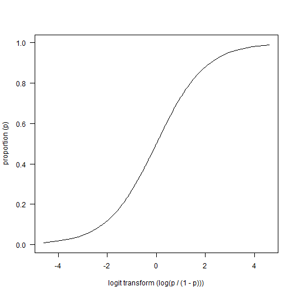
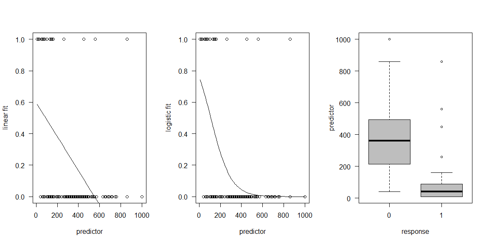
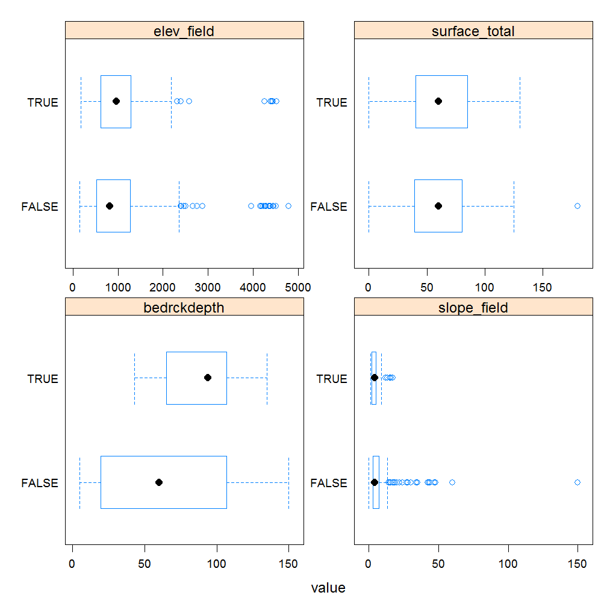
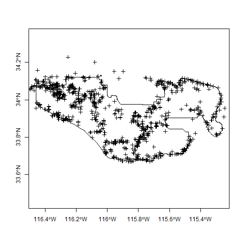
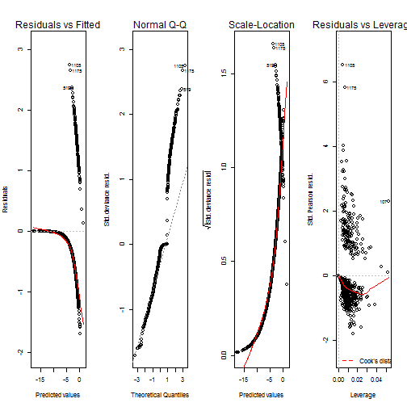
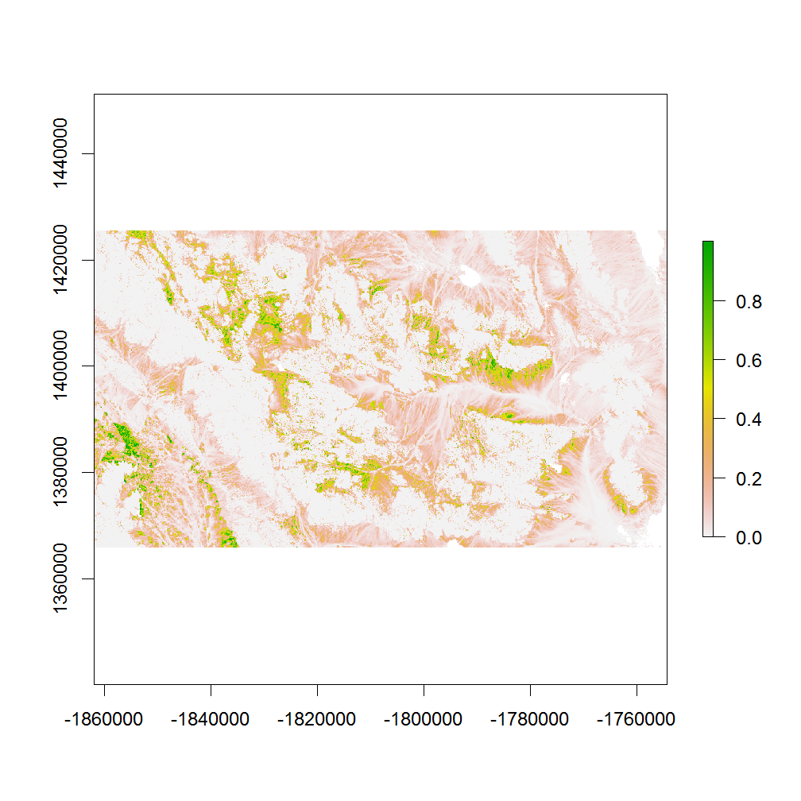

  

# CHAPTER 7: Generalized linear models

- [7.1 Introduction](#intro)
- [7.2 Logisitic regression](#logistic) 
- [7.3 Logistic regression example](#example)
- [7.4 Exploratory analysis](#explore)
    - [7.4.1 Data wrangling](#wrang)
    - [7.4.2 Geomorphic data](#geomorph)
    - [7.4.3 Soil scientist bias](#bias)
    - [7.4.4 Plot coordinates](#plot)
        - [Exercise 1: view the data in ArcGIS](#view)
    - [7.4.5 Extract spatial data](#extract)
    - [7.4.6 Examing spatial data](#spatial)
- [7.5 Modeling](#glm)
    - [7.5.1 Model fitting and selection](#fit)
    - [7.5.2 Modeling evaluation](#eval)
- [7.6 References](#ref)
- [7.7 Additional references](#add)
 

## <a id="intro")></a> 7.1 Introduction

Generalized linear models (GLM) as the name implies are a generalization of the linear modeling framework to allow for the modeling of response variables (e.g. soil attributes) with non-normal distributions and heterogeneous variances. Whereas linear models are designed for predicting continuous soil properties such as clay content or soil temperature, GLM can be used to predict the presence/absence of argillic horizons (i.e. logistic regression) or counts of a plant species along a transact (i.e. Poisson regression). These generalizations greatly expands the applicability of the linear modeling framework, while still allowing for a similar fitting procedure and interpretation of the resulting models.

In the past in order to handle non-linearity and heterogeneous variances, transformations have been made to the response variable, such as the log(x). However such transformations complicate the models interpretation because the results refer to the transformed scale (e.g. log(x)). Also previous transformations were not guaranteed to achieve both normality and constant variance simultaneously. GLM likewise transform the response, but also preserve the scale of the response and provide separate functions to transform the mean response and variance, know as the link and variance functions respectively. So instead of looking like this

$f(y) = \beta_{0} + \beta_{1}x + \varepsilon$

you get this

$g(\mu)$ or $\eta = \beta_{0} + \beta_{1}x + \varepsilon$

with $g(\mu)$ or $\eta$ symbolizing the link function. 

Another alteration the classical linear model is that with GLM the coefficients are estimated iteratively by maximum likelihood estimation instead of ordinary least squares. This results in the GLM minimizing the deviance, instead of the sum of squares. However for the Gaussian (i.e. normal) distributions the deviance and sum of squares are equivalent.


## <a id="logistic")></a> 7.2 Logistic regression

Logistic regression is a specific type of GLM designed to model data that has a binomial distribution (i.e. presence/absence, yes/no, or proportional data), which in statistical learning parlance is considered a classification problem. For binomial data the logit link transform is generally used. The effect of the logit transform can be seen in the following figure. It creates a sigmoidal curve, which enhances the separation between the two groups. It also has the effect of ensuring that the values range between 0 and 1.




When comparing a simple linear model vs a simple logistic model we can see the effect of the logit transform on the relationship between the response and predictor variable. As before it follows a sigmoidal curve and prevents predictions from exceeding 0 and 1.



## <a id="example")></a> 7.3 Logistic regression example

Now that we've got some of the basic GLM theory out of the way we'll move on to a real example, and address any additional theory where it relates to specific steps in the modeling process. The examples selected for this chapter comes from Joshua Tree National Park (JTNP)(i.e. CA794) in the Mojave desert. The problem tackled here is a familiar one, where can I expect to find argillic horizons on fan piedmonts. Argillic horizons within the Mojave are typically found on fan remnants, which are a stable landform that is a remnant of the Pleistocene (Peterson, 1981). Despite the low relief of most fans, fan remnants are uplands in the sense that they generally don't receive run-on or deposition.

With this dataset we'll encounter some challenges. To start with, fan piedmont landscapes typically have relatively little relief. Since most of our predictors will be derivatives of elevation, that won't leave us much to work with. Also, our elevation data comes from the USGS National Elevation dataset (NED), which provides considerable less detail than say LiDAR or IFSAR (Shi et al., 2012). Lastly our pedon dataset like most in NASIS, hasn't receive near as much quality control as have the components. So we'll need to wrangle some of the pedon data before we can analyze it. These are all typical problems encountered in any data analysis and should be good practice. Ideally it would be more interesting to try and model individual soil series with argillic horizons, but do to some challenges just mentioned this is difficult with this dataset. However, at the end we'll look at one simple approach to try and separate individual soil series with argillic horizons.

### Load packages

To start, as always we need to load some extra packages. This is a necessary evil every time you start R. Most of the basic functions we need to develop a logistic regression model are contained in base R, but the following contain some useful spatial and data manipulation functions. Believe it or not we will use all of them and more.


```r
library(aqp) # specialized soil classes and functions
library(soilDB) # NASIS and SDA import functions
library(raster) # guess
library(rgdal) # spatial import
library(lattice) # graphing
library(reshape2) # data manipulation
library(plyr) # data manipulation
library(dplyr)
library(caret) # printing
library(rms) # additional regression modeling tools
```

### Read in data

Hopefully like all good soil scientists and ecological site specialists you enter your field data into NASIS. Better yet hopefully someone else did it for you. Once data is captured in NASIS it much easier to import the data into R, extract the pieces you need, manipulate it, model it, etc. If it's not entered into NASIS it may as well not exist, and will it haunt you for the rest of your life.


```r
# pedons <- fetchNASIS(rmHzErrors = FALSE) # beware the error messages, by default they don't get imported unless you override the default, which in our chase shouldn't cause any problems
load(file = "C:/workspace/ch7_data.Rdata")

str(pedons, max.level = 2) # Examine the makeup of the data we imported from NASIS.
```

```
## Formal class 'SoilProfileCollection' [package "aqp"] with 7 slots
##   ..@ idcol     : chr "peiid"
##   ..@ depthcols : chr [1:2] "hzdept" "hzdepb"
##   ..@ metadata  :'data.frame':	1 obs. of  1 variable:
##   ..@ horizons  :'data.frame':	5049 obs. of  43 variables:
##   ..@ site      :'data.frame':	1176 obs. of  84 variables:
##   ..@ sp        :Formal class 'SpatialPoints' [package "sp"] with 3 slots
##   ..@ diagnostic:'data.frame':	2143 obs. of  4 variables:
```

## <a id="explore")></a> 7.4 Exploratory analysis

### <a id="wrang")></a> 7.4.1 Data wrangling

Generally before we begin modeling its good to explore the data. By using a simple summary we can quickly see the breakdown of how many argillic horizons we have. Unfortunately, odds are all the argillic horizons haven't been properly populated in the diagnostic horizon table like they should be. Luckily for us, the desert argillic horizons always pop up in the taxonomic name, so we can use pattern matching to extract it. By doing this we gain an additional 11 pedons with argillic horizons and are able to label the missing values (i.e. NA). At a minimum for modeling purposes we probably need 10 pedons of the target we're interested in and a total of 100 observations overall.


```r
# Check consistency of argillic horizon population

s <- site(pedons) # get the site table

table(s$argillic.horizon, useNA = "ifany") # tabulate the number of argillic horizons observed
```

```
## 
## FALSE  TRUE  <NA> 
##   750   275   151
```

```r
# or

# summary(s$argillic.horizon) 

# Extract argillic presense from the taxonomic subgroup

s$argillic <- grepl("arg", s$tax_subgroup)

table(s$argillic, useNA = "ifany")
```

```
## 
## FALSE  TRUE 
##   894   282
```

Ideally if the diagnostic horizon table were populated we could also filter out argillic horizons that start below 50cm, which may not be representative of "good" argillic horizons and may therefore have gotten correlated to a Torripsamments anyway. Not only are unrepresentative sites confusing for scientists, they're equally confusing for models. However as we saw earlier some pedons don't appear to be fully populated, so we'll stick with those pedons that have the argillic specified in their taxonomic subgroup name, since it gives us the biggest sample.


```r
d <- diagnostic_hz(pedons)
idx <- unique(d[d$diag_kind == "argillic horizon" & d$featdept < 50, "peiid"])
test <- s$peiid %in% idx
summary(test)
```

```
##    Mode   FALSE    TRUE    NA's 
## logical     945     231       0
```

### <a id="geomorph")></a> 7.4.2 Geomorphic data

Another obvious place to look is at the geomorphic data in the site table. This information is intended to help differentiate where our soil observations exist on the landscape. If populated consistently it could be used in future disaggregation efforts, as demonstrated by Nauman and Thompson (2014).


```r
# Surface morphometry, depth and surface rock fragments

s$surface_gravel <- s$surface_gravel - s$surface_fgravel # recalculate gravel
s$surface_total <- apply(s[grepl("surface", names(s))], 1, sum) # calculate the total rock fragments

s_sub <- subset(s, slope_field > 15, select = c(argillic, bedrckdepth, slope_field, elev_field, surface_total)) # subset slopes > 15 to just look and fans, and select numeric columns
s_m <- melt(s_sub, id = "argillic") # convert s_sub to wide data format
head(s_m)
```

```
##   argillic    variable value
## 1    FALSE bedrckdepth    NA
## 2    FALSE bedrckdepth    18
## 3     TRUE bedrckdepth    NA
## 4    FALSE bedrckdepth    18
## 5    FALSE bedrckdepth    28
## 6    FALSE bedrckdepth    15
```

```r
bwplot(argillic ~ value | variable, data = s_m, scales = list(relation = "free"))
```



Looking at our numeric variables we don't appear to have much if any separation between the presence/absence of argillic horizons. 

Lets look at categorical variables next.


```r
# Landform vs argillic presense

s_sub <- subset(s, argillic == 1)
table(s_sub$landform.string, s_sub$argillic.horizon) # cross tabulate landform vs argillic horizon
```

```
##                                   
##                                    FALSE TRUE
##   alluvial fan                         0    8
##   ballena                              0    3
##   fan                                  0    1
##   fan & fan apron                      0    1
##   fan apron                            0   26
##   fan apron & fan piedmont             0    2
##   fan apron & fan remnant              0   19
##   fan piedmont & alluvial fan          0    1
##   fan piedmont & fan apron             0    1
##   fan piedmont & fan remnant           0    2
##   fan piedmont & pediment              0    1
##   fan remnant                          6   97
##   fan remnant & alluvial fan           0    1
##   fan remnant & fan apron              0    7
##   fan remnant & fan piedmont           0    1
##   fan remnant & hillslope              0    1
##   fan remnant & pediment               0    1
##   fan skirt                            0    1
##   hill                                 0   15
##   hillslope                            1   30
##   hillslope & ridge                    0    1
##   hillslope & spur                     0    1
##   inset fan                            0    3
##   intermontane basin & fan remnant     0    1
##   low hill                             0    5
##   mountain                             0    6
##   mountain slope                       1    6
##   partial ballena                      0    1
##   pediment                             2    9
##   rock pediment                        1    0
##   sand sheet & fan remnant             0    1
##   spur                                 0    1
```

Examining the above frequency table we can see that argillic horizons occur predominantly on fan remnants as was alluded too earlier. However they also seem to occur frequently on other landforms, some of which are curious combinations of landforms or redundant terms.


```r
# Hillslope position

round(prop.table(table(s$hillslope_pos, s$argillic.horizon), 2) * 100) # cross tabulate and calculate proportions, the "2" calculates the proportions relative to the column totals
```

```
##            
##             FALSE TRUE
##   Toeslope     11    6
##   Footslope     4    5
##   Backslope    63   48
##   Shoulder      9   10
##   Summit       13   30
```

```r
# Slope shape

round(prop.table(table(paste(s$shapedown, s$shapeacross), s$argillic.horizon), 2) * 100)
```

```
##                  
##                   FALSE TRUE
##   Concave Concave     1    0
##   Concave Convex      2    1
##   Concave Linear      3    1
##   Convex Concave      1    0
##   Convex Convex      12    9
##   Convex Linear       5    7
##   Linear Concave      6    5
##   Linear Convex      22   31
##   Linear Linear      39   38
##   Linear NA           0    0
##   NA Convex           0    0
##   NA NA              10    6
```

Looking at the examples above for hillslope postion and slope shape also don't seem to be of much help in distinguishing between the presense/absense of argillic horizons.


### <a id="bias")></a> 7.4.3 Soil scientist bias

Next we'll look at soil scientist bias. The question being are some soil scientists more likely to describe argillic horizons that others.


```r
# Function to filter out the top 3 mappers
desc_test <- function(old) {
  old <- as.character(old)
  new <- NA
  # ranked by seniority
  if (is.na(old)) {new <- "other"}
  if (grepl("Stephen", old)) {new <- "Stephen"} 
  if (grepl("Paul", old)) {new <- "Paul"} 
  if (grepl("Peter", old)) {new <- "Peter"}
  if (is.na(new)) {new <- "other"}
 return(new)
}

s$describer2 <- sapply(s$describer, desc_test)

# By frequency
table(s$describer2, s$argillic)
```

```
##          
##           FALSE TRUE
##   other     217   78
##   Paul      175   70
##   Peter     320  106
##   Stephen   182   28
```

```r
# By proportion
round(prop.table(table(s$describer2, s$argillic), margin = 1) * 100)
```

```
##          
##           FALSE TRUE
##   other      74   26
##   Paul       71   29
##   Peter      75   25
##   Stephen    87   13
```

We can see that proportionately, Stephen seems less likely to describe argillic horizons that others. However while this information is suggestive, it is far from definitive, because it doesn't take into account other factors. We'll examine this more closely later.

### <a id="plot")></a> 7.4.4 Plot coordinates

Where do are our points plot. We can plot the general location in R, but for this task will export them to a Shapefile, so we can view them in a proper GIS, and look more closely.


```r
# Plot coordinates
slot(pedons, "site") <- s # this is dangerous, but something needs to be fixed in the site() setter function
idx <- complete.cases(site(pedons)[c("x", "y")]) # create an index to filter out pedons with missing coordinates
pedons2 <- pedons[idx]
coordinates(pedons2) <- ~ x + y # set the coordinates
proj4string(pedons2) <- CRS("+init=epsg:4326") # set the projection

ssa <- readOGR(dsn = "M:/geodata/soils/soilsa_a_nrcs.shp", layer = "soilsa_a_nrcs") # read in soil survey area boundaries
```

```
## OGR data source with driver: ESRI Shapefile 
## Source: "M:/geodata/soils/soilsa_a_nrcs.shp", layer: "soilsa_a_nrcs"
## with 3262 features
## It has 8 fields
```

```r
ca794 <- subset(ssa, areasymbol == "CA794") # subset out Joshua Tree National Park
# ca794 <- spTransform(ca794, CRS("+init=epsg:5070"))
pedons_sp <- as(pedons2, "SpatialPointsDataFrame") # coerce to sp object

plot(ca794, axes = TRUE)
plot(pedons_sp, add = TRUE) # notice the points outside the boundary
```



```r
pedons_sp <- spTransform(pedons_sp, CRS("+init=epsg:5070")) # reproject coordinate system 
# writeOGR(pedons_sp, dsn = "M:/geodata/project_data/8VIC", "pedon_locations", driver = "ESRI Shapefile") # write shapefile of pedons
```

Notice in the above figure the number of points that fall outside the survey boundary. What it doesn't show is the points in the Ocean or Mexico.

#### <a id="view")></a> Exercise 1: View the data in ArcGIS

- Examine the shapefile in ArcGIS along with our potential predictive variables (hint classify the Shapefile symbology using the argillic horizon column)
- Discuss with your group, and report your observations or hypotheses


### <a id="extract")></a> 7.4.5 Extracting spatial data

Prior to any spatial analysis or modeling, you need to develop a suite of geodata files that can be intersected with your field data locations. This is in and of itself is a difficult task, and should be facilitated by your Regional GIS Specialist. Typically this would primarily consist of derivatives from a DEM or satellite imagery. Prior to any prediction it is also necessary to ensure the geodata files have the same projection, extent, and cell size. Once we have the necessary files we can construct a list in R of the file names and paths, read the geodata into R and extract the geodata values where they intersect with field data.


```r
folder <- "M:/geodata/project_data/8VIC/ca794/"
files <- c(
  elev   = "ned30m_8VIC.tif",
  slope  = "ned30m_8VIC_slope5.tif",
  aspect = "ned30m_8VIC_aspect5.tif",
  twi    = "ned30m_8VIC_wetness.tif",
  twi_sc = "ned30m_8VIC_wetness_sc.tif",
  ch     = "ned30m_8VIC_cheight.tif",
  z2str  = "ned30m_8VIC_z2stream.tif",
  mrrtf  = "ned30m_8VIC_mrrtf.tif",
  mrvbf  = "ned30m_8VIC_mrvbf.tif",
  solar  = "ned30m_8VIC_solar.tif",
  precip = "prism30m_8VIC_ppt_1981_2010_annual_mm.tif",
  precipsum = "prism30m_8VIC_ppt_1981_2010_summer_mm.tif",
  temp   = "prism30m_8VIC_tmean_1981_2010_annual_C.tif",
  ls     = "landsat30m_8VIC_b123457.tif",
  tc     = "landsat30m_8VIC_tc123.tif",
  k      = "gamma30m_8VIC_namrad_k.tif",
  th     = "gamma30m_8VIC_namrad_th.tif",
  u      = "gamma30m_8VIC_namrad_u.tif",
  cluster = "cluster152.tif"
  )

geodata_f <- sapply(files, function(x) paste0(folder, x)) 
geodata_r <- stack(geodata_f)

data <- data.frame(
   as.data.frame(pedons_sp)[c("pedon_id", "taxonname", "argillic", "x_std", "y_std", "describer2")],
   extract(geodata_r, pedons_sp)
   )

# s[c("describer", "describer2", "x", "y", "x_std", "y_std", "utmnorthing", "utmeasting", "classifier")] <- NA
# slot(pedons, "site") <- s
# data[c("describer2", "x_std", "y_std")] <- NA
# save(data, ca794, pedons, file = "C:/workspace/ch7_data.Rdata")
```

### <a id="spatial")></a> 7.4.6 Examine spatial data 

With out spatial data in hand, we can now see whether any of the varibles will help us separate the presense/absense of argillic horizons. Because we're dealing with a classification problem, we'll compare the numeric variables using boxplots. What we're looking for are variables with the least amount of overlap in their distribution (i.e. greatest separation in their median values).  


```r
load(file = "C:/workspace/ch7_data.Rdata")
test <- subset(data, select = - c(pedon_id, describer2, taxonname, x_std, y_std))
test$argillic <- with(test, argillic == TRUE & mrvbf > 0.15) # Include only argillic horizons that only occur on fans. Argillic horizons that occur on hills and mountains more than likely form by different process, and therefore would require a different model.

data_m <- melt(test, id = "argillic")
bwplot(argillic ~ value | variable, data = data_m, scales = list(x = "free"))
```


```r
# Argillic horizons seem to occur over a limited range of twi. So lets rescale twi by substracting its median
aggregate(twi ~ argillic, data = test, summary)
```

```
##   argillic twi.Min. twi.1st Qu. twi.Median twi.Mean twi.3rd Qu. twi.Max.
## 1    FALSE    8.131       9.237     11.320   12.110      14.410   24.440
## 2     TRUE   10.070      12.750     13.820   13.750      14.760   19.470
```

```r
test$twi_sc <- abs(test$twi - 13.8)
```

## <a id="glm")></a> 7.5 Modeling

### <a id="fit")></a> 7.5.1 Model fitting and selection

- Discuss how the modeling process is iterative
- Discuss how the correlation amongst or between the variables affects the model selection process
- Discourage stepwise methods, instead encourage expert guided process


```r
full <- glm(argillic ~ ., data = test, family = binomial(link = "cloglog"))
null <- glm(argillic ~ 1, data = test, family = binomial(link = "cloglog"))
# add1(null, full, test = "Chisq")

argi_glm <- glm(argillic ~ twi_sc + slope + ls_1 + ch + z2str + mrvbf, data = test, family = binomial(link = "cloglog"))
summary(argi_glm)
```

```
## 
## Call:
## glm(formula = argillic ~ twi_sc + slope + ls_1 + ch + z2str + 
##     mrvbf, family = binomial(link = "cloglog"), data = test)
## 
## Deviance Residuals: 
##     Min       1Q   Median       3Q      Max  
## -1.6951  -0.5788  -0.1482  -0.0064   2.7459  
## 
## Coefficients:
##               Estimate Std. Error z value Pr(>|z|)    
## (Intercept)  3.1766790  0.5968833   5.322 1.03e-07 ***
## twi_sc      -0.5037869  0.0770642  -6.537 6.27e-11 ***
## slope       -0.2041295  0.0410085  -4.978 6.43e-07 ***
## ls_1        -0.0248863  0.0070434  -3.533 0.000410 ***
## ch          -0.0025019  0.0009958  -2.512 0.011988 *  
## z2str       -0.0160969  0.0048786  -3.300 0.000969 ***
## mrvbf       -0.2392052  0.1009400  -2.370 0.017799 *  
## ---
## Signif. codes:  0 '***' 0.001 '**' 0.01 '*' 0.05 '.' 0.1 ' ' 1
## 
## (Dispersion parameter for binomial family taken to be 1)
## 
##     Null deviance: 927.82  on 1034  degrees of freedom
## Residual deviance: 643.25  on 1028  degrees of freedom
##   (15 observations deleted due to missingness)
## AIC: 657.25
## 
## Number of Fisher Scoring iterations: 9
```

```r
anova(argi_glm)
```

```
## Analysis of Deviance Table
## 
## Model: binomial, link: cloglog
## 
## Response: argillic
## 
## Terms added sequentially (first to last)
## 
## 
##        Df Deviance Resid. Df Resid. Dev
## NULL                    1034     927.82
## twi_sc  1  182.895      1033     744.92
## slope   1   56.448      1032     688.47
## ls_1    1   27.226      1031     661.25
## ch      1    3.874      1030     657.37
## z2str   1    8.583      1029     648.79
## mrvbf   1    5.544      1028     643.25
```

```r
par(mfrow = c(1, 4))
plot(argi_glm)
```



```r
dev.off()
```

```
## null device 
##           1
```

```r
par(mfrow = c(1, length(argi_glm$coefficients)/2))
termplot(argi_glm, partial.resid = TRUE)
dev.off()
```

```
## null device 
##           1
```


### <a id="eval")></a> 7.5.2 Model evaluation

- Discuss the different accuracy metrics
- Discuss the effect of setting a threshold
- Discuss the variability of the predictions across the clusters, perhaps different models need to be constructed in each cluster, some cluster appear to be dominanted by specific soil series, this data isn't clean enough (nor are concepts usually) to model series separately however we could use the cluster as an additional model to separate the series. Cluster 2, 6, 7, 8, 13 and 15 all appear to be hyperthermic


```r
comp <- cbind(test[c("argillic", "cluster")], pred = predict(argi_glm, test, type = "response") > 0.5)
confusionMatrix(comp$pred, comp$argillic, positive = "TRUE")
```

```
## Confusion Matrix and Statistics
## 
##           Reference
## Prediction FALSE TRUE
##      FALSE   838  123
##      TRUE     26   48
##                                           
##                Accuracy : 0.856           
##                  95% CI : (0.8332, 0.8769)
##     No Information Rate : 0.8348          
##     P-Value [Acc > NIR] : 0.03423         
##                                           
##                   Kappa : 0.3244          
##  Mcnemar's Test P-Value : 3.702e-15       
##                                           
##             Sensitivity : 0.28070         
##             Specificity : 0.96991         
##          Pos Pred Value : 0.64865         
##          Neg Pred Value : 0.87201         
##              Prevalence : 0.16522         
##          Detection Rate : 0.04638         
##    Detection Prevalence : 0.07150         
##       Balanced Accuracy : 0.62530         
##                                           
##        'Positive' Class : TRUE            
## 
```

```r
comp_sub <- subset(comp, argillic == TRUE)
temp <- by(comp_sub, list(comp_sub$cluster), FUN = function(x) with(x, data.frame(cluster = unique(cluster), sum_arg = sum(argillic, na.rm = T), sum_pred = sum(pred, na.rm = T), recall = round(sum(pred == argillic) / length(argillic), 2))))
do.call(rbind, temp)
```

```
##    cluster sum_arg sum_pred recall
## 2        2      32        2   0.06
## 3        3      13        6   0.46
## 5        5      33       15   0.45
## 6        6       5        1   0.20
## 7        7      20        2   0.10
## 8        8       5        3   0.60
## 9        9       1        0   0.00
## 12      12       1        0   0.00
## 13      13       8        1   0.12
## 14      14      26       12   0.46
## 15      15      27        6   0.22
```

```r
test_sub <- subset(test, !(cluster %in% c(2, 6, 7, 8, 13, 15)))

# full <- glm(argillic ~ ., data = test_sub, family = binomial(link = "cloglog"))
# null <- glm(argillic ~ 1, data = test_sub, family = binomial(link = "cloglog"))
# add1(null, full, test = "Chisq")

sub_glm <- glm(argillic ~ slope + twi_sc + ls_1 + mrvbf + z2str, data = test_sub, family = binomial(link = "cloglog"))
# summary(sub_glm)

comp <- cbind(test_sub[c("argillic", "cluster")], pred = predict(sub_glm, test_sub, type = "response") > 0.5)
confusionMatrix(comp$pred, comp$argillic, positive = "TRUE")
```

```
## Confusion Matrix and Statistics
## 
##           Reference
## Prediction FALSE TRUE
##      FALSE   466   40
##      TRUE     15   34
##                                          
##                Accuracy : 0.9009         
##                  95% CI : (0.873, 0.9245)
##     No Information Rate : 0.8667         
##     P-Value [Acc > NIR] : 0.008522       
##                                          
##                   Kappa : 0.4997         
##  Mcnemar's Test P-Value : 0.001211       
##                                          
##             Sensitivity : 0.45946        
##             Specificity : 0.96881        
##          Pos Pred Value : 0.69388        
##          Neg Pred Value : 0.92095        
##              Prevalence : 0.13333        
##          Detection Rate : 0.06126        
##    Detection Prevalence : 0.08829        
##       Balanced Accuracy : 0.71414        
##                                          
##        'Positive' Class : TRUE           
## 
```

```r
comp_sub <- subset(comp, argillic == TRUE)
temp <- by(comp_sub, list(comp_sub$cluster), FUN = function(x) with(x, data.frame(cluster = unique(cluster), sum_arg = sum(argillic, na.rm = T), sum_pred = sum(pred, na.rm = T), recall = round(sum(pred == argillic) / length(argillic), 2))))
do.call(rbind, temp)
```

```
##    cluster sum_arg sum_pred recall
## 3        3      13        5   0.38
## 5        5      33       14   0.42
## 9        9       1        1   1.00
## 12      12       1        0   0.00
## 14      14      26       14   0.54
```

- View the results in ArcGIS and examine the accuracy at individual points
- Discuss the effects of data quality, including both NASIS and GIS
- Discuss how the modeling process isn't an end in itself, but serves to uncover trends, possibly generate additional questions and direct future investigations


```r
# r <- predict(geodata_r, sub_glm, progress="text", type = "response")
# writeRaster(r, "test3.tif", overwrite = T, progress = "text")

plot(raster("C:/workspace/test3.tif"))
plot(ca794, add = TRUE)
```



## <a id="ref")></a> 7.6 References

Nauman, T. W., and J. A. Thompson, 2014. Semi-automated disaggregation of conventional soil maps using knowledge driven data mining and classification trees. Geoderma 213:385-399. [http://www.sciencedirect.com/science/article/pii/S0016706113003066](http://www.sciencedirect.com/science/article/pii/S0016706113003066)

Peterson, F.F., 1981. Landforms of the basin and range province: defined for soil survey. Nevada Agricultural Experiment Station Technical Bulletin 28, University of Nevada - Reno, NV. 52 p. [http://jornada.nmsu.edu/files/Peterson_LandformsBasinRangeProvince.pdf](http://jornada.nmsu.edu/files/Peterson_LandformsBasinRangeProvince.pdf)

Shi, X., L. Girod, R. Long, R. DeKett, J. Philippe, and T. Burke, 2012. A comparison of LiDAR-based DEMs and USGS-sourced DEMs in terrain analysis for knowledge-based digital soil mapping. Geoderma 170:217-226. [http://www.sciencedirect.com/science/article/pii/S0016706111003387](http://www.sciencedirect.com/science/article/pii/S0016706111003387)


## <a id="add")></a> 7.7 Additional reading

Lane, P.W., 2002. Generalized linear models in soil science. European Journal of Soil Science 53, 241- 251. [http://onlinelibrary.wiley.com/doi/10.1046/j.1365-2389.2002.00440.x/abstract](http://onlinelibrary.wiley.com/doi/10.1046/j.1365-2389.2002.00440.x/abstract)

Gareth, J., D. Witten, T. Hastie, and R. Tibshirani, 2014. An Introduction to Statistical Learning: with Applications in R. Springer, New York. [http://www-bcf.usc.edu/~gareth/ISL/](http://www-bcf.usc.edu/~gareth/ISL/)

Hengl, T. 2009. A Practical Guide to Geostatistical Mapping, 2nd Edt. University of Amsterdam, www.lulu.com, 291 p. ISBN 978-90-9024981-0. [http://spatial-analyst.net/book/system/files/Hengl_2009_GEOSTATe2c0w.pdf](http://spatial-analyst.net/book/system/files/Hengl_2009_GEOSTATe2c0w.pdf)
