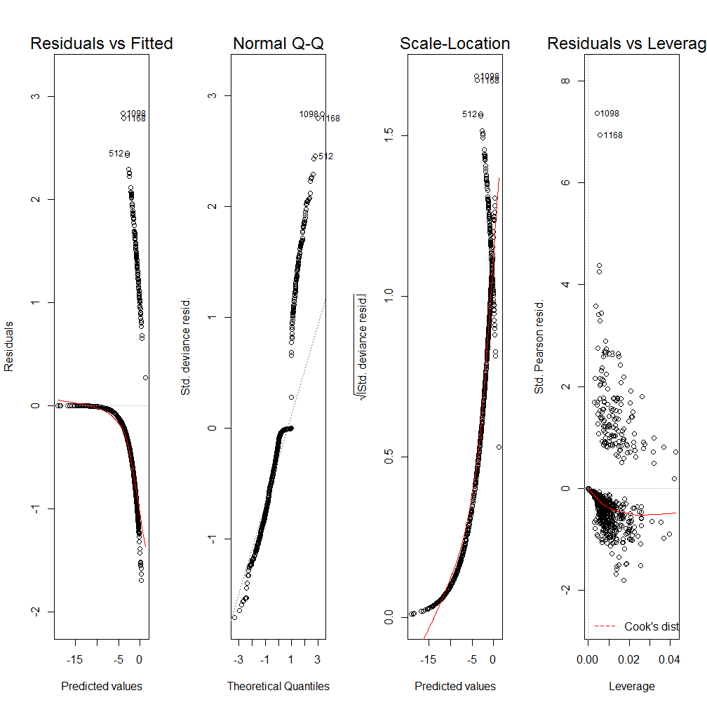
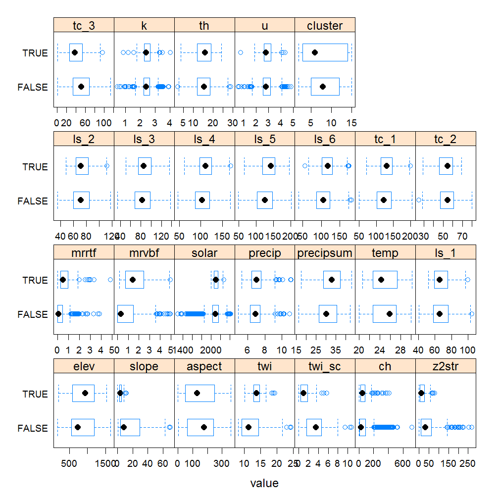
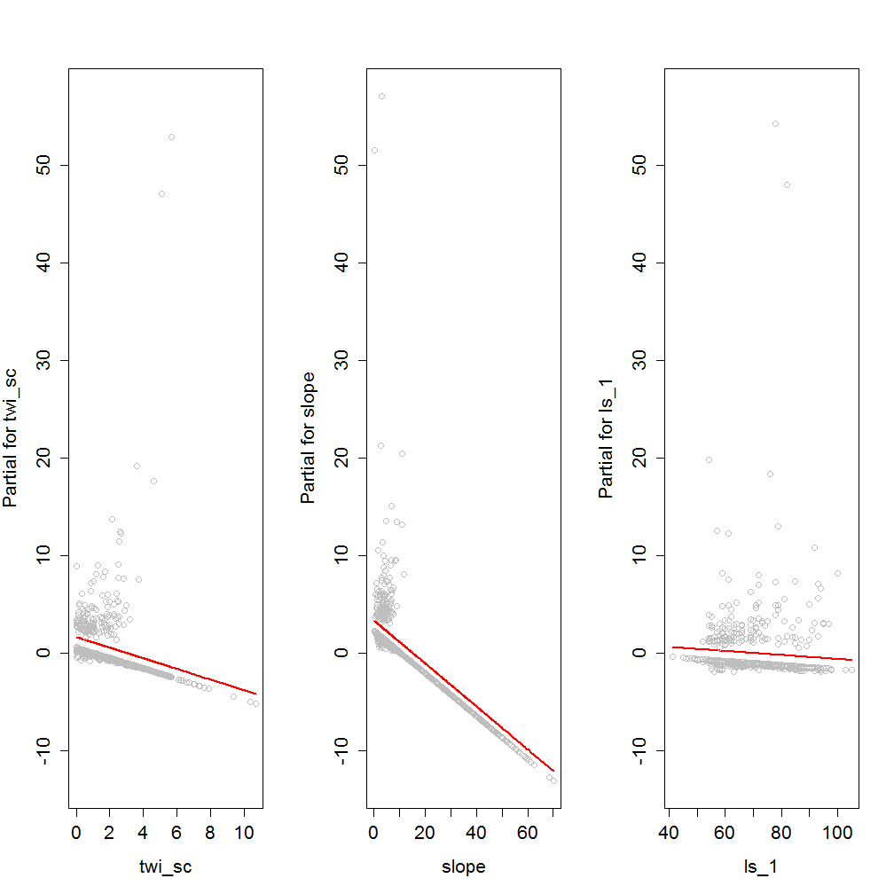

  

# CHAPTER 7: Generalized linear models

- [7.1 Introduction](#intro)
- [7.2 Logisitic regression](#logistic) 
- [7.3 Logistic regression example](#example)
- [7.4 Exploratory analysis](#explore)
    - [7.4.1 Data wrangling](#wrang)
    - [7.4.2 Geomorphic data](#geomorph)
    - [7.4.3 Soil scientist bias](#bias)
    - [7.4.4 Plot coordinates](#plot)
        - [Exercise 1: view the data in ArcGIS](#view)
    - [7.4.5 Extract spatial data](#extract)
    - [7.4.6 Examing spatial data](#spatial)
- [7.5 Modeling](#glm)
    - [7.5.1 Model training](#train)
    - [7.5.2 Modeling evaluation](#eval)
- [7.6 References](#ref)
- [7.7 Additional references](#add)
 

## <a id="intro")></a> 7.1 Introduction

Generalized linear models (GLM) as the name implies are a generalization of the linear modeling framework to allow for the modeling of response variables (e.g. soil attributes) with non-normal distributions and heterogeneous variances. Whereas linear models are designed for predicting continuous soil properties such as clay content or soil temperature, GLM can be used to predict the presence/absence of argillic horizons (i.e. logistic regression) or counts of a plant species along a transact (i.e. Poisson regression). These generalizations greatly expands the applicability of the linear modeling framework, while still allowing for a similar fitting procedure and interpretation of the resulting models.

In the past in order to handle non-linearity and heterogeneous variances, transformations have been made to the response variable, such as the log(x). However such transformations complicate the models interpretation because the results refer to the transformed scale (e.g. log(x)). Also response transformations are not guaranteed to achieve both normality and constant variance simultaneously. GLM likewise transform the response, but also preserve the scale of the response, and provide separate functions to transform the mean response and variance, know as the link and variance functions respectively. So instead of looking like this

$f(y) = \beta_{0} + \beta_{1}x + \varepsilon$

you get this

$g(\mu)$ or $\eta = \beta_{0} + \beta_{1}x + \varepsilon$

with $g(\mu)$ or $\eta$ symbolizing the link function. 

Another alteration the classical linear model is that with GLM the coefficients are estimated iteratively by maximum likelihood estimation instead of ordinary least squares. This results in the GLM minimizing the deviance, instead of the sum of squares. However for the Gaussian (i.e. normal) distributions the deviance and sum of squares are equivalent.


## <a id="logistic")></a> 7.2 Logistic regression

Logistic regression is a specific type of GLM designed to model data that has a binomial distribution (i.e. presence/absence, yes/no, or proportional data), which in statistical learning parlance is considered a classification problem. For binomial data the logit link transform is generally used. The effect of the logit transform can be seen in the following figure. It creates a sigmoidal curve, which enhances the separation between the two groups. It also has the effect of ensuring that the values range between 0 and 1.


When comparing a simple linear model vs a simple logistic model we can see the effect of the logit transform on the relationship between the response and predictor variable. As before it follows a sigmoidal curve and prevents predictions from exceeding 0 and 1.


## <a id="example")></a> 7.3 Logistic regression example

Now that we've got some of the basic GLM theory out of the way we'll move on to a real example, and address any additional theory where it relates to specific steps in the modeling process. The examples selected for this chapter comes from Joshua Tree National Park (JTNP)(i.e. CA794) in the Mojave desert. The problem tackled here is a familiar one, where can I expect to find argillic horizons on fan piedmonts. Argillic horizons within the Mojave are typically found on fan remnants, which are a stable landform that is a remnant of the Pleistocene (Peterson, 1981). Despite the low relief of most fans, fan remnants are uplands in the sense that they generally don't receive run-on or deposition.

With this dataset we'll encounter some challenges. To start with, fan piedmont landscapes typically have relatively little relief. Since most of our predictors will be derivatives of elevation, that won't leave us much to work with. Also, our elevation data comes from the USGS National Elevation dataset (NED), which provides considerable less detail than say LiDAR or IFSAR (Shi et al., 2012). Lastly our pedon dataset like most in NASIS, hasn't receive near as much quality control as have the components. So we'll need to wrangle some of the pedon data before we can analyze it. These are all typical problems encountered in any data analysis and should be good practice. Ideally it would be more interesting to try and model individual soil series with argillic horizons, but do to some challenges just mentioned this is difficult with this dataset. However, at the end we'll look at one simple approach to try and separate individual soil series with argillic horizons.

### Load packages

To start, as always we need to load some extra packages. This is a necessary evil every time you start R. Most of the basic functions we need to develop a logistic regression model are contained in base R, but the following contain some useful spatial and data manipulation functions. Believe it or not we will use all of them and more.


```r
library(aqp) # specialized soil classes and functions
library(soilDB) # NASIS and SDA import functions
library(raster) # guess
library(rgdal) # spatial import
library(lattice) # graphing
library(reshape2) # data manipulation
library(caret) # printing
library(car) # additional regression tools
```

### Read in data

Hopefully like all good soil scientists and ecological site specialists you enter your field data into NASIS. Better yet hopefully someone else did it for you. Once data is captured in NASIS it much easier to import the data into R, extract the pieces you need, manipulate it, model it, etc. If it's not entered into NASIS it may as well not exist.


```r
# pedons <- fetchNASIS(rmHzErrors = FALSE) # beware the error messages, by default they don't get imported unless you override the default, which in our chase shouldn't cause any problems
load(file = "C:/workspace/ch7_data.Rdata")

str(pedons, max.level = 2) # Examine the makeup of the data we imported from NASIS.
```

```
## Formal class 'SoilProfileCollection' [package "aqp"] with 7 slots
##   ..@ idcol     : chr "peiid"
##   ..@ depthcols : chr [1:2] "hzdept" "hzdepb"
##   ..@ metadata  :'data.frame':	1 obs. of  1 variable:
##   ..@ horizons  :'data.frame':	4990 obs. of  43 variables:
##   ..@ site      :'data.frame':	1168 obs. of  79 variables:
##   ..@ sp        :Formal class 'SpatialPoints' [package "sp"] with 3 slots
##   ..@ diagnostic:'data.frame':	2133 obs. of  4 variables:
```

## <a id="explore")></a> 7.4 Exploratory analysis

### <a id="wrang")></a> 7.4.1 Data wrangling

Generally before we begin modeling its good to explore the data. By using a simple summary we can quickly see the breakdown of how many argillic horizons we have. Unfortunately, odds are all the argillic horizons haven't been properly populated in the diagnostic horizon table like they should be. Luckily for us, the desert argillic horizons always pop up in the taxonomic name, so we can use pattern matching to extract it. By doing this we gain an additional 11 pedons with argillic horizons and are able to label the missing values (i.e. NA). At a minimum for modeling purposes we probably need 10 pedons of the target we're interested in and a total of 100 observations overall.


```r
# Check consistency of argillic horizon population

s <- site(pedons) # get the site table

table(s$argillic.horizon, useNA = "ifany") # tabulate the number of argillic horizons observed
```

```
## 
## FALSE  TRUE  <NA> 
##   750   272   146
```

```r
# or

# summary(s$argillic.horizon) 

# Extract argillic presense from the taxonomic subgroup

s$argillic <- grepl("arg", s$tax_subgroup)

table(s$argillic, useNA = "ifany")
```

```
## 
## FALSE  TRUE 
##   886   282
```

Ideally if the diagnostic horizon table were populated we could also filter out argillic horizons that start below 50cm, which may not be representative of "good" argillic horizons and may therefore have gotten correlated to a Torripsamments anyway. Not only are unrepresentative sites confusing for scientists, they're equally confusing for models. However as we saw earlier some pedons don't appear to be fully populated, so we'll stick with those pedons that have the argillic specified in their taxonomic subgroup name, since it gives us the biggest sample.


```r
d <- diagnostic_hz(pedons)
idx <- unique(d[d$diag_kind == "argillic horizon" & d$featdept < 50, "peiid"])
test <- s$peiid %in% idx
summary(test)
```

```
##    Mode   FALSE    TRUE    NA's 
## logical     940     228       0
```

### <a id="geomorph")></a> 7.4.2 Geomorphic data

Another obvious place to look is at the geomorphic data in the site table. This information is intended to help differentiate where our soil observations exist on the landscape. If populated consistently it could be used in future disaggregation efforts, as demonstrated by Nauman and Thompson (2014).


```r
# Landform vs argillic presense

s_sub <- subset(s, argillic == TRUE)

with(s_sub, table(landform.string, argillic, useNA = "ifany")) # cross tabulate landform vs argillic horizon presense
```

```
##                                   argillic
## landform.string                    TRUE
##   alluvial fan                        9
##   ballena                             3
##   fan                                 1
##   fan & fan apron                     1
##   fan apron                          27
##   fan apron & fan piedmont            2
##   fan apron & fan remnant            19
##   fan piedmont & alluvial fan         1
##   fan piedmont & fan apron            1
##   fan piedmont & fan remnant          2
##   fan piedmont & pediment             1
##   fan remnant                       109
##   fan remnant & alluvial fan          1
##   fan remnant & fan apron             7
##   fan remnant & fan piedmont          2
##   fan remnant & hillslope             1
##   fan remnant & pediment              1
##   fan skirt                           1
##   hill                               15
##   hillslope                          32
##   hillslope & ridge                   1
##   hillslope & spur                    1
##   inset fan                           3
##   intermontane basin & fan remnant    1
##   low hill                            5
##   mountain                            6
##   mountain slope                      8
##   partial ballena                     1
##   pediment                           11
##   rock pediment                       1
##   sand sheet & fan remnant            1
##   spur                                1
##   <NA>                                6
```

Examining the above frequency table we can see that argillic horizons occur predominantly on fan remnants as was alluded too earlier. However they also seem to occur frequently on other landforms, some of which are curious combinations of landforms or redundant terms.


```r
# Hillslope position

s_sub <- subset(s, grepl("fan", landform.string)) # subset fan landforms

with(s_sub, round(prop.table(table(hillslope_pos, argillic, useNA = "ifany"), 2) * 100)) # cross tabulate and calculate proportions, the "2" calculates the proportions relative to the column totals
```

```
##              argillic
## hillslope_pos FALSE TRUE
##     Toeslope     12    5
##     Footslope     2    2
##     Backslope    18   16
##     Shoulder      4    4
##     Summit       17   32
##     <NA>         46   40
```

```r
# Slope shape

with(s_sub, round(prop.table(table(paste(shapedown, shapeacross, useNA = "ifany"), argillic), 2) * 100))
```

```
##                        argillic
##                         FALSE TRUE
##   Concave Concave ifany     1    1
##   Concave Convex ifany      1    0
##   Concave Linear ifany      5    1
##   Convex Concave ifany      0    0
##   Convex Convex ifany       8    8
##   Convex Linear ifany       7    7
##   Linear Concave ifany      6    3
##   Linear Convex ifany      21   29
##   Linear Linear ifany      39   45
##   Linear NA ifany           0    0
##   NA NA ifany              13    8
```

Looking at the hillslope postion of fan landforms we can see a slightly higher proportion of argillic horizons are found on summits, while less are found on toeslopes. Slope shape doesn't seem to provide any useful information for distinguishing argillic horizons.


```r
# Surface morphometry, depth and surface rock fragments

s$surface_gravel <- with(s, surface_gravel - surface_fgravel) # recalculate gravel
s$surface_total <- apply(s[grepl("surface", names(s))], 1, sum) # calculate the total rock fragments

s_sub <- subset(s, grepl("fan", landform.string), select = c(argillic, bedrckdepth, slope_field, elev_field, surface_total)) # subset slopes > 15 to just look and fans, and select numeric columns

s_m <- melt(s_sub, id = "argillic") # convert s_sub to wide data format
head(s_m)
```

```
##   argillic    variable value
## 1    FALSE bedrckdepth    NA
## 2    FALSE bedrckdepth    11
## 3    FALSE bedrckdepth    NA
## 4     TRUE bedrckdepth    NA
## 5    FALSE bedrckdepth    NA
## 6     TRUE bedrckdepth    NA
```

```r
bwplot(argillic ~ value | variable, data = s_m, scales = list(relation = "free"))
```


Looking at our numeric variables only depth to bedrock seems to show much separation between the presense/absense of argillic horizons.


### <a id="bias")></a> 7.4.3 Soil scientist bias

Next we'll look at soil scientist bias. The question being are some soil scientists more likely to describe argillic horizons that others.


```r
# Function to filter out the top 3 mappers
desc_test <- function(old) {
  old <- as.character(old)
  new <- NA
  # ranked by seniority
  if (is.na(old)) {new <- "other"}
  if (grepl("Stephen", old)) {new <- "Stephen"} 
  if (grepl("Paul", old)) {new <- "Paul"} 
  if (grepl("Peter", old)) {new <- "Peter"}
  if (is.na(new)) {new <- "other"}
 return(new)
}

s$describer2 <- sapply(s$describer, desc_test)

s_sub <- subset(s, grepl("fan", landform.string))

# By frequency
with(s_sub, table(describer2, argillic, useNA = "ifany"))
```

```
##           argillic
## describer2 FALSE TRUE
##    other     115   58
##    Paul       47   28
##    Peter     166   86
##    Stephen    47   19
```

```r
# By proportion
with(s_sub, round(prop.table(table(describer2, argillic), margin = 1) * 100))
```

```
##           argillic
## describer2 FALSE TRUE
##    other      66   34
##    Paul       63   37
##    Peter      66   34
##    Stephen    71   29
```

For fan landforms all none of the soil scientists seem more likely than others to describe argillic horizons that others. However while this information is suggestive, it is far from definitive, because it doesn't take into account other factors. We'll examine this more closely later.

### <a id="plot")></a> 7.4.4 Plot coordinates

Where do are our points plot. We can plot the general location in R, but for this task will export them to a Shapefile, so we can view them in a proper GIS, and look more closely. Notice in the figure below the number of points that fall outside the survey boundary. What it doesn't show is the points in the Ocean or Mexico.


```r
# Plot coordinates
pedons2 <- pedons

slot(pedons2, "site") <- s # this is dangerous, but something needs to be fixed in the site() setter function
idx <- complete.cases(site(pedons2)[c("x", "y")]) # create an index to filter out pedons with missing coordinates
pedons2 <- pedons2[idx]
coordinates(pedons2) <- ~ x + y # set the coordinates
proj4string(pedons2) <- CRS("+init=epsg:4326") # set the projection

ssa <- readOGR(dsn = "M:/geodata/soils/soilsa_a_nrcs.shp", layer = "soilsa_a_nrcs") # read in soil survey area boundaries
```

```
## OGR data source with driver: ESRI Shapefile 
## Source: "M:/geodata/soils/soilsa_a_nrcs.shp", layer: "soilsa_a_nrcs"
## with 3262 features
## It has 8 fields
```

```r
ca794 <- subset(ssa, areasymbol == "CA794") # subset out Joshua Tree National Park
# ca794 <- spTransform(ca794, CRS("+init=epsg:5070"))
pedons_sp <- as(pedons2, "SpatialPointsDataFrame") # coerce to sp object

plot(ca794, axes = TRUE)
plot(pedons_sp, add = TRUE) # notice the points outside the boundary
```


```r
pedons_sp <- spTransform(pedons_sp, CRS("+init=epsg:5070")) # transform between coordinate systems
# optionally write shapefile of pedons
# writeOGR(pedons_sp, dsn = "M:/geodata/project_data/8VIC", "pedon_locations", driver = "ESRI Shapefile") 
```


#### <a id="view")></a> Exercise 1: View the data in ArcGIS

- Examine the shapefile in ArcGIS along with our potential predictive variables (hint classify the Shapefile symbology using the argillic horizon column)
- Discuss with your group, and report your observations or hypotheses


### <a id="extract")></a> 7.4.5 Extracting spatial data

Prior to any spatial analysis or modeling, you need to develop a suite of geodata files that can be intersected with your field data locations. This is in and of itself is a difficult task, and should be facilitated by your Regional GIS Specialist. Typically this would primarily consist of derivatives from a DEM or satellite imagery. Prior to any prediction it is also necessary to ensure the geodata files have the same projection, extent, and cell size. Once we have the necessary files we can construct a list in R of the file names and paths, read the geodata into R and extract the geodata values where they intersect with field data.


```r
folder <- "M:/geodata/project_data/8VIC/ca794/"
files <- c(
  elev   = "ned30m_8VIC.tif",
  slope  = "ned30m_8VIC_slope5.tif",
  aspect = "ned30m_8VIC_aspect5.tif",
  twi    = "ned30m_8VIC_wetness.tif",
  twi_sc = "ned30m_8VIC_wetness_sc.tif",
  ch     = "ned30m_8VIC_cheight.tif",
  z2str  = "ned30m_8VIC_z2stream.tif",
  mrrtf  = "ned30m_8VIC_mrrtf.tif",
  mrvbf  = "ned30m_8VIC_mrvbf.tif",
  solar  = "ned30m_8VIC_solar.tif",
  precip = "prism30m_8VIC_ppt_1981_2010_annual_mm.tif",
  precipsum = "prism30m_8VIC_ppt_1981_2010_summer_mm.tif",
  temp   = "prism30m_8VIC_tmean_1981_2010_annual_C.tif",
  ls     = "landsat30m_8VIC_b123457.tif",
  tc     = "landsat30m_8VIC_tc123.tif",
  k      = "gamma30m_8VIC_namrad_k.tif",
  th     = "gamma30m_8VIC_namrad_th.tif",
  u      = "gamma30m_8VIC_namrad_u.tif",
  cluster = "cluster152.tif"
  )

geodata_f <- sapply(files, function(x) paste0(folder, x)) # combine the folder directory and file names

head(geodata_f)

geodata_r <- stack(geodata_f) # create a raster stack

data <- data.frame(
   as.data.frame(pedons_sp)[c("pedon_id", "taxonname", "argillic", "x_std", "y_std", "describer2", "landform.string")],
   extract(geodata_r, pedons_sp)
   )

# s[c("describer", "describer2", "x", "y", "x_std", "y_std", "utmnorthing", "utmeasting", "classifier")] <- NA
# slot(pedons, "site") <- s
# data[c("describer2", "x_std", "y_std")] <- NA
# save(data, ca794, pedons, file = "C:/workspace/ch7_data.Rdata")
```


### <a id="spatial")></a> 7.4.6 Examine spatial data 

With our spatial data in hand, we can now see whether any of the varibles will help us separate the presense/absense of argillic horizons. Because we're dealing with a classification problem, we'll compare the numeric variables using boxplots. What we're looking for are variables with the least amount of overlap in their distribution (i.e. the greatest separation in their median values).  


```r
load(file = "C:/workspace/ch7_data.Rdata")
test <- data
test$argillic <- with(test, argillic == TRUE & mrvbf > 0.15) # Include only argillic horizons that only occur on fans. Argillic horizons that occur on hills and mountains more than likely form by different process, and therefore would require a different model.
test$landform <- ifelse(grepl("fan", test$landform.string), "fan", "hill")
test2 <- subset(test, select = - c(pedon_id, describer2, taxonname, x_std, y_std, landform.string, landform))

data_m <- melt(test2, id = "argillic")
bwplot(argillic ~ value | variable, data = data_m, scales = list(x = "free"))
```


```r
# Argillic horizons seem to occur over a limited range of twi. So lets rescale twi by substracting its median
aggregate(twi ~ argillic, data = test, summary)
```

```
##   argillic twi.Min. twi.1st Qu. twi.Median twi.Mean twi.3rd Qu. twi.Max.
## 1    FALSE    8.131       9.240     11.300   12.100      14.440   24.440
## 2     TRUE   10.070      12.800     13.830   13.740      14.690   19.470
```

```r
test$twi_sc <- abs(test$twi - 13.8)
```

## <a id="glm")></a> 7.5 Modeling

### <a id="train")></a> 7.5.1 Model training

Modeling is an iterative process that cycles between fitting and evaluating alternative models. Compared to tree and forest models, linear and generalized models require more input from the user. Automated model selection procedures are available, but are discouraged because they generally result in complex and unstable models. This is in part due to correlation amongst the predictive variables that confuses the model. Also the order is which the variables are included or excluded from the model effects the significance of the others, and thus several weak predictors might mask the effect of one strong predictor. Therefore it is best to begin with a selection of predictors that are known to be useful, and grow the model incrementally. 

The example below is known as a forward selection procedure, where a full model is fit and compared against a null model, to assess the effect of the different predictors. For testing alternative models the Akaike's information criterion (AIC) is used. With AIC smaller is better.


```r
full <- glm(argillic ~ ., data = test, family = binomial(link = "cloglog")) # "~ ." includes all columns in the data set
null <- glm(argillic ~ 1, data = test, family = binomial(link = "cloglog")) # "~ 1" just includes an intercept
add1(null, full, test = "Chisq") # using the AIC test the effect of adding additional predictors, generally select the predictor with the smallest AIC unless it goes against your intuition
```

```
## Single term additions
## 
## Model:
## argillic ~ 1
##                  Df Deviance     AIC    LRT  Pr(>Chi)    
## <none>                859.33  891.63                     
## pedon_id        896     0.00 1824.31 859.33 0.8058203    
## taxonname       141   219.01  533.31 640.32 < 2.2e-16 ***
## x_std             1   855.00  889.31   4.33 0.0374861 *  
## y_std             1   857.12  891.42   2.21 0.1369551    
## describer2        3   839.54  877.84  19.79 0.0001876 ***
## landform.string  71   501.71  676.02 357.61 < 2.2e-16 ***
## elev              1   856.83  891.14   2.50 0.1140062    
## slope             1   697.43  731.73 161.90 < 2.2e-16 ***
## aspect            1   857.42  891.73   1.91 0.1672152    
## twi               1   829.11  863.41  30.22 3.860e-08 ***
## twi_sc            1   679.65  713.95 179.68 < 2.2e-16 ***
## ch                1   857.86  892.16   1.47 0.2255060    
## z2str             1   796.07  830.37  63.26 1.811e-15 ***
## mrrtf             1   815.56  849.87  43.77 3.703e-11 ***
## mrvbf             1   812.57  846.87  46.76 8.014e-12 ***
## solar             1   850.72  885.03   8.60 0.0033553 ** 
## precip            1   850.05  884.35   9.28 0.0023187 ** 
## precipsum         1   840.90  875.20  18.43 1.762e-05 ***
## temp              1   857.15  891.46   2.17 0.1403171    
## ls_1              1   859.20  893.50   0.13 0.7162465    
## ls_2              1   857.37  891.68   1.96 0.1618911    
## ls_3              1   852.82  887.13   6.50 0.0107633 *  
## ls_4              1   848.75  883.06  10.58 0.0011458 ** 
## ls_5              1   834.73  869.04  24.59 7.077e-07 ***
## ls_6              1   835.73  870.03  23.60 1.187e-06 ***
## tc_1              1   849.69  883.99   9.64 0.0019040 ** 
## tc_2              1   856.88  891.18   2.45 0.1174312    
## tc_3              1   825.59  859.89  33.74 6.296e-09 ***
## k                 1   857.57  891.88   1.75 0.1853709    
## th                1   858.53  892.84   0.79 0.3725926    
## u                 1   859.25  893.55   0.08 0.7775850    
## cluster           1   858.56  892.87   0.77 0.3814103    
## landform          1   710.48  744.79 148.85 < 2.2e-16 ***
## ---
## Signif. codes:  0 '***' 0.001 '**' 0.01 '*' 0.05 '.' 0.1 ' ' 1
```

We can see as the boxplots showed earlier that twi\_sc has the smallest AIC and reduces the deviances the most. So lets add twi\_sc to the `null` model using the `update()` function. Then continue using the `add1()` or `drop1()` functions,  until the model is saturated.  


```r
argi_glm <- update(null, . ~ . + twi_sc) # add twi_sc to the model, "-" will subtract predictors

# or refit

# argi_glm <- glm(argillic ~ twi_sc, data = test, family = binomial(link = "cloglog"))

# add1(null, full, test = "Chisq") # iterate until the model is saturated

# drop1(argi_glm, test = "Chisq") # test effect of dropping a predictor
```

After the model is saturated you should end up with a model similar to the one below. 


```r
argi_glm <- glm(argillic ~ twi_sc + slope + ls_1 + ch + z2str + mrvbf, data = test, family = binomial(link = "cloglog"))

summary(argi_glm) # examine the effect and error for each predictors
```

```
## 
## Call:
## glm(formula = argillic ~ twi_sc + slope + ls_1 + ch + z2str + 
##     mrvbf, family = binomial(link = "cloglog"), data = test)
## 
## Deviance Residuals: 
##      Min        1Q    Median        3Q       Max  
## -1.68941  -0.55553  -0.13029  -0.00475   2.83047  
## 
## Coefficients:
##              Estimate Std. Error z value Pr(>|z|)    
## (Intercept)  3.165384   0.634651   4.988 6.11e-07 ***
## twi_sc      -0.545177   0.081843  -6.661 2.72e-11 ***
## slope       -0.220484   0.044411  -4.965 6.88e-07 ***
## ls_1        -0.020479   0.007493  -2.733 0.006273 ** 
## ch          -0.002871   0.001039  -2.763 0.005727 ** 
## z2str       -0.017545   0.005116  -3.429 0.000605 ***
## mrvbf       -0.309784   0.107608  -2.879 0.003991 ** 
## ---
## Signif. codes:  0 '***' 0.001 '**' 0.01 '*' 0.05 '.' 0.1 ' ' 1
## 
## (Dispersion parameter for binomial family taken to be 1)
## 
##     Null deviance: 875.83  on 989  degrees of freedom
## Residual deviance: 598.80  on 983  degrees of freedom
##   (52 observations deleted due to missingness)
## AIC: 612.8
## 
## Number of Fisher Scoring iterations: 9
```

```r
round(binomial(link = "cloglog")$linkinv(coef(argi_glm)), 2) # convert the coefficients to an odds scale, who here gambles?
```

```
## (Intercept)      twi_sc       slope        ls_1          ch       z2str 
##        1.00        0.44        0.55        0.62        0.63        0.63 
##       mrvbf 
##        0.52
```

```r
anova(argi_glm) # examine deviance explained by each predictors, some count for more than others
```

```
## Analysis of Deviance Table
## 
## Model: binomial, link: cloglog
## 
## Response: argillic
## 
## Terms added sequentially (first to last)
## 
## 
##        Df Deviance Resid. Df Resid. Dev
## NULL                     989     875.83
## twi_sc  1  182.565       988     693.27
## slope   1   53.231       987     640.04
## ls_1    1   20.078       986     619.96
## ch      1    4.885       985     615.07
## z2str   1    8.039       984     607.03
## mrvbf   1    8.239       983     598.80
```

```r
vif(argi_glm) # variance inflation factor, > 10 is bad
```

```
##   twi_sc    slope     ls_1       ch    z2str    mrvbf 
## 1.089232 1.612932 1.146121 1.140084 1.353126 1.840364
```

```r
par(mfrow = c(1, 4))
plot(argi_glm) # plot regression diagnostics
```



```r
dev.off()
```

```
## RStudioGD 
##         2
```

```r
par(mfrow = c(1, length(argi_glm$coefficients)/2))
```



```r
termplot(argi_glm, partial.resid = TRUE) # plot partial effects
```



```r
dev.off()
```

```
## null device 
##           1
```


### <a id="eval")></a> 7.5.2 Model evaluation

After we're satisfied no additional variables will improve the fit we can evaluate the model's accuracy. Because we're dealing with a classification problem, we have to consider both errors of comission (Type I) and omission (Type II), or their corresponding accuracies of sensitivity (producer's accuracy) and specificity (producers's accuracy) respectively. Before we can assess the error however we need to select a probability threshold. 

- **Sensitivity** and **specificity** examine how well the ground truth or reference data compares to the predictions. 
- **Positive**  and **negative** predicted values (user's accuracy) examine the inverse concept of how well the predictions match the reference data


```r
comp <- cbind(test[c("argillic", "cluster")], pred = predict(argi_glm, test, type = "response") > 0.35)
confusionMatrix(comp$pred, comp$argillic, positive = "TRUE")
```

```
## Confusion Matrix and Statistics
## 
##           Reference
## Prediction FALSE TRUE
##      FALSE   740   71
##      TRUE     90   89
##                                           
##                Accuracy : 0.8374          
##                  95% CI : (0.8129, 0.8598)
##     No Information Rate : 0.8384          
##     P-Value [Acc > NIR] : 0.5553          
##                                           
##                   Kappa : 0.4273          
##  Mcnemar's Test P-Value : 0.1560          
##                                           
##             Sensitivity : 0.5563          
##             Specificity : 0.8916          
##          Pos Pred Value : 0.4972          
##          Neg Pred Value : 0.9125          
##              Prevalence : 0.1616          
##          Detection Rate : 0.0899          
##    Detection Prevalence : 0.1808          
##       Balanced Accuracy : 0.7239          
##                                           
##        'Positive' Class : TRUE            
## 
```

- Discuss the variability of the predictions across the clusters, perhaps different models need to be constructed in each cluster, some cluster appear to be dominated by specific soil series, this data isn't clean enough (nor are concepts usually) to model series separately however we could use the cluster as an additional model to separate the series. Cluster 2, 6, 7, 8, 13 and 15 all appear to be hyperthermic


```r
comp_sub <- subset(comp, argillic == TRUE)
temp <- by(comp_sub, list(comp_sub$cluster), FUN = function(x) with(x, data.frame(cluster = unique(cluster), sum_arg = sum(argillic, na.rm = T), sum_pred = sum(pred, na.rm = T), sensitivity = round(sum(pred == argillic) / length(argillic), 2))))
do.call(rbind, temp)
```

```
##    cluster sum_arg sum_pred sensitivity
## 2        2      32       14        0.44
## 3        3      13        9        0.69
## 5        5      32       21        0.66
## 6        6       5        3        0.60
## 7        7      17        4        0.24
## 8        8       5        3        0.60
## 12      12       1        0        0.00
## 13      13       8        5        0.62
## 14      14      20       15        0.75
## 15      15      27       15        0.56
```

```r
test_sub <- subset(test, !(cluster %in% c(2, 6, 7, 8, 13, 15)))

# full <- glm(argillic ~ ., data = test_sub, family = binomial(link = "cloglog"))
# null <- glm(argillic ~ 1, data = test_sub, family = binomial(link = "cloglog"))
# add1(null, full, test = "Chisq")

sub_glm <- glm(argillic ~ slope + twi_sc + ls_1 + mrvbf + z2str, data = test_sub, family = binomial(link = "cloglog"))
# summary(sub_glm)

comp <- cbind(test_sub[c("argillic", "cluster")], pred = predict(sub_glm, test_sub, type = "response") > 0.5)
confusionMatrix(comp$pred, comp$argillic, positive = "TRUE")
```

```
## Confusion Matrix and Statistics
## 
##           Reference
## Prediction FALSE TRUE
##      FALSE   446   34
##      TRUE     17   32
##                                           
##                Accuracy : 0.9036          
##                  95% CI : (0.8752, 0.9274)
##     No Information Rate : 0.8752          
##     P-Value [Acc > NIR] : 0.02518         
##                                           
##                   Kappa : 0.5038          
##  Mcnemar's Test P-Value : 0.02506         
##                                           
##             Sensitivity : 0.48485         
##             Specificity : 0.96328         
##          Pos Pred Value : 0.65306         
##          Neg Pred Value : 0.92917         
##              Prevalence : 0.12476         
##          Detection Rate : 0.06049         
##    Detection Prevalence : 0.09263         
##       Balanced Accuracy : 0.72407         
##                                           
##        'Positive' Class : TRUE            
## 
```

```r
comp_sub <- subset(comp, argillic == TRUE)
temp <- by(comp_sub, list(comp_sub$cluster), FUN = function(x) with(x, data.frame(cluster = unique(cluster), sum_arg = sum(argillic, na.rm = T), sum_pred = sum(pred, na.rm = T), sensitivity = round(sum(pred == argillic) / length(argillic), 2))))
do.call(rbind, temp)
```

```
##    cluster sum_arg sum_pred sensitivity
## 3        3      13        6        0.46
## 5        5      32       15        0.47
## 12      12       1        0        0.00
## 14      14      20       11        0.55
```

- View the results in ArcGIS and examine the accuracy at individual points
- Discuss the effects of data quality, including both NASIS and GIS
- Discuss how the modeling process isn't an end in itself, but serves to uncover trends, possibly generate additional questions and direct future investigations


```r
# r <- predict(geodata_r, sub_glm, progress="text", type = "response")
# writeRaster(r, "test3.tif", overwrite = T, progress = "text")

plot(raster("C:/workspace/test3.tif"))
plot(ca794, add = TRUE)
```


## <a id="ref")></a> 7.6 References

Nauman, T. W., and J. A. Thompson, 2014. Semi-automated disaggregation of conventional soil maps using knowledge driven data mining and classification trees. Geoderma 213:385-399. [http://www.sciencedirect.com/science/article/pii/S0016706113003066](http://www.sciencedirect.com/science/article/pii/S0016706113003066)

Peterson, F.F., 1981. Landforms of the basin and range province: defined for soil survey. Nevada Agricultural Experiment Station Technical Bulletin 28, University of Nevada - Reno, NV. 52 p. [http://jornada.nmsu.edu/files/Peterson_LandformsBasinRangeProvince.pdf](http://jornada.nmsu.edu/files/Peterson_LandformsBasinRangeProvince.pdf)

Shi, X., L. Girod, R. Long, R. DeKett, J. Philippe, and T. Burke, 2012. A comparison of LiDAR-based DEMs and USGS-sourced DEMs in terrain analysis for knowledge-based digital soil mapping. Geoderma 170:217-226. [http://www.sciencedirect.com/science/article/pii/S0016706111003387](http://www.sciencedirect.com/science/article/pii/S0016706111003387)


## <a id="add")></a> 7.7 Additional reading

Lane, P.W., 2002. Generalized linear models in soil science. European Journal of Soil Science 53, 241- 251. [http://onlinelibrary.wiley.com/doi/10.1046/j.1365-2389.2002.00440.x/abstract](http://onlinelibrary.wiley.com/doi/10.1046/j.1365-2389.2002.00440.x/abstract)

Gareth, J., D. Witten, T. Hastie, and R. Tibshirani, 2014. An Introduction to Statistical Learning: with Applications in R. Springer, New York. [http://www-bcf.usc.edu/~gareth/ISL/](http://www-bcf.usc.edu/~gareth/ISL/)

Hengl, T. 2009. A Practical Guide to Geostatistical Mapping, 2nd Edt. University of Amsterdam, www.lulu.com, 291 p. ISBN 978-90-9024981-0. [http://spatial-analyst.net/book/system/files/Hengl_2009_GEOSTATe2c0w.pdf](http://spatial-analyst.net/book/system/files/Hengl_2009_GEOSTATe2c0w.pdf)
