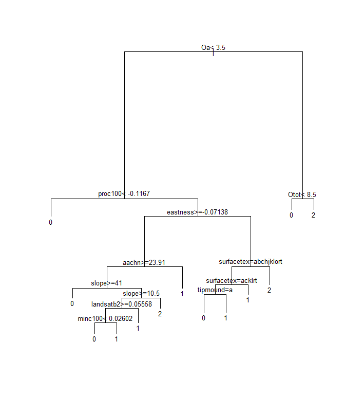
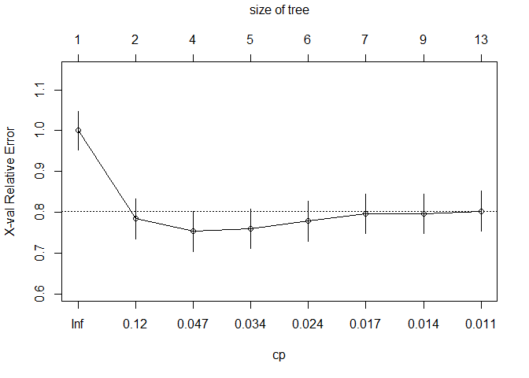
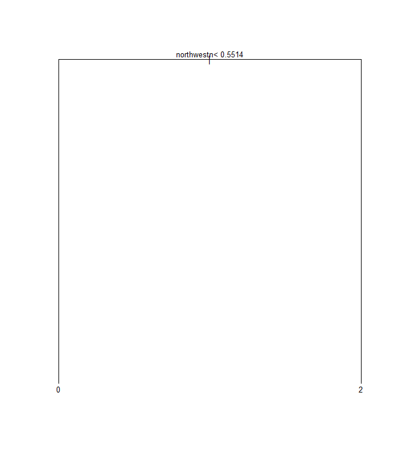

# Chapter 8 - Tree-based Models
Katey Yoast  
Thursday, January 14, 2016  


## 8.0  Introduction
Tree-based models are a supervised machine learning method commonly used in soil survey and ecology for exploratory data analysis and prediction due to their simplistic nonparametric design. Instead of fitting a model to the data, tree-based models recursively partition the data into increasingly homogenous groups based on values that minimize a loss function (such as Sum of Squared Errors (SSE) for regression or Gini Index for classification) ([McBratney et al.,2013](http://www.clw.csiro.au/aclep/documents/McBratney%20et%20al.%202003.pdf)). The two most common packages for generating tree-based models in R are rpart and randomForest. The rpart package creates a regression or classification tree based on binary splits that maximize homogeneity and minimize impurity. The output is a single decision tree that can be further "pruned" or trimmed back using the cross-validation error statistic to reduce over-fitting. The randomForest package is similar to rpart, but is double random in that each node is split using a random subset of predictors AND observations at each node and this process is repeated hundreds of times (as specified by the user). Unlike rpart, random forests do not produce a graphical decision tree since the predictions are averaged across hundreds or thousands of trees. Instead, random forests produce a variable importance plot and a tabular statistical summary. 

## 8.1 Exploratory Data Analysis
The data that we will be working with in this chapter were collected in support of a MLRA 127 soil survey update project to tabularly and spatially update SSRUGO map units for spodic properties in the Monongahela National Forest. Soils that were historically covered by Eastern Hemlock and Red Spruce exhibit spodic morphology on shale and sandstone bedrocks at eleveations typically >3,200 ft in West Virginia ([Nauman et al., 2015](http://www.sciencedirect.com/science/article/pii/S0016706115000427)). 

## 8.2 Classification and Regression Trees (CART)
The basic function for all CART models is (y ~ x), where y is the dependent variable to be predicted from x, a set of independent variables. If the dependent variable (y) is numeric, the resulting tree will be a regression tree. Conversely, if the dependent variable (y) is categorical, the resulting tree will be a classification tree. The rpart package allows all data types to be used as independent variables, regardless of whether the model is a classification or regression tree. The rpart algorithm ignores missing values when determining the quality of a split and uses surrogate splits to determine if observation(s) with missing data is best split left or right. If an observation is missing all surrogate splits, then the observation(s) is sent to the child node with the largest relative frequency (Feelders, 1999).

Assuming that the rpart and randomForest packages are already installed on your machine, simply load the packages using the library( ) function.


```r
library(rpart)
library(randomForest)
library(rpart.plot)

file<-'https://raw.githubusercontent.com/ncss-tech/stats_for_soil_survey/master/data/logistic/wv_transect_editedforR.csv'
download.file(file, destfile = "soildata.csv")
soildata<-read.csv("soildata.csv", header=TRUE, sep=",")
```

Review the data structure to ensure that the data were imported correctly into R.

```r
str(soildata)
```

```
## 'data.frame':	250 obs. of  50 variables:
##  $ x           : num  -79.7 -79.7 -79.7 -79.8 -79.7 ...
##  $ y           : num  38.6 38.6 38.6 38.6 38.6 ...
##  $ Overtype    : Factor w/ 3 levels "Conifer","Hardwood",..: 2 2 2 2 3 3 3 2 3 2 ...
##  $ Underconifer: Factor w/ 2 levels "n","y": 1 2 1 2 2 2 2 1 2 2 ...
##  $ Oi          : num  3 4 3 4 3 2 2 2 4 3 ...
##  $ Oe          : num  0 0 2 4 4 6 4 2 2 4 ...
##  $ Oa          : num  0 3 0 0 8 0 0 0 7 4 ...
##  $ Otot        : num  3 7 5 8 15 8 6 4 13 7 ...
##  $ epipedon    : Factor w/ 3 levels "folistic","ochric",..: 2 2 2 2 1 2 2 2 2 2 ...
##  $ spodint     : num  0 0 0 0 1 1 1 0.5 1 0 ...
##  $ subgroup    : Factor w/ 5 levels "aeric","aquic",..: 4 4 4 4 3 3 3 4 3 4 ...
##  $ order       : Factor w/ 4 levels "histosol","inceptisol",..: 4 2 4 2 4 4 2 2 2 4 ...
##  $ ps          : Factor w/ 5 levels "cl","fl","fragm",..: 2 5 2 1 2 2 1 2 2 2 ...
##  $ drainage    : Factor w/ 4 levels "exd","mwd","swp",..: 4 4 4 4 4 4 4 4 4 4 ...
##  $ series      : Factor w/ 16 levels "Blandburg","Carrollton",..: 2 9 2 9 2 2 9 9 9 2 ...
##  $ taxon       : Factor w/ 3 levels "family","series",..: 2 2 2 3 2 2 3 3 3 2 ...
##  $ slope       : int  45 54 39 25 38 30 38 36 16 36 ...
##  $ surfacetex  : Factor w/ 21 levels "cnhosil","cnl",..: 19 19 2 19 19 2 19 20 20 20 ...
##  $ stoniness   : Factor w/ 5 levels "ns","rb","st",..: 5 4 5 4 4 4 4 1 1 1 ...
##  $ depthclass  : Factor w/ 4 levels "d","md","sh",..: 2 2 2 2 2 2 2 2 2 2 ...
##  $ bedrockdepth: int  200 200 200 200 200 200 200 200 200 200 ...
##  $ depth_cm    : int  67 69 52 95 93 81 86 90 75 92 ...
##  $ hillslope   : Factor w/ 4 levels "backslope","footslope",..: 1 1 1 1 1 1 1 1 3 1 ...
##  $ tipmound    : int  0 0 0 0 0 0 0 0 0 0 ...
##  $ rainfall    : int  51 51 51 51 51 51 51 51 51 51 ...
##  $ geology     : Factor w/ 2 levels "Dch","Dhs": 1 2 2 2 1 2 1 1 1 2 ...
##  $ aachn       : num  27.46 81.7 2.59 43.36 70.75 ...
##  $ dem10m      : num  1123 1239 1155 1240 1211 ...
##  $ downslpgra  : num  25.9 25.1 78 37 26.1 ...
##  $ eastness    : num  -0.53 0.972 1 0.9 -0.474 ...
##  $ greenrefl   : num  0.1035 0.0425 0.0351 0.0776 0.0721 ...
##  $ landsatb1   : num  0.0726 0.0742 0.0742 0.0775 0.0694 ...
##  $ landsatb2   : num  0.062 0.0583 0.0547 0.0583 0.0528 ...
##  $ landsatb3   : num  0.0335 0.0351 0.0301 0.0419 0.0318 ...
##  $ landsatb7   : num  0.0494 0.0516 0.043 0.0451 0.0302 ...
##  $ maxc100     : num  -0.0845 -0.0963 -0.0848 0.2386 0.1368 ...
##  $ maxent      : num  20.26 30.21 27.44 7.88 73.85 ...
##  $ minc100     : num  -0.1925 -0.1457 -0.8324 0.069 0.0998 ...
##  $ mirref      : num  0.1608 0.0827 0.1109 0.1477 0.0762 ...
##  $ ndvi        : num  0.866 0.822 0.842 0.8 0.77 ...
##  $ northeastn  : num  -0.974 0.854 0.728 0.944 -0.958 ...
##  $ northness   : num  -0.848 0.237 0.03 0.435 -0.88 ...
##  $ northwestn  : num  -0.225 -0.52 -0.686 -0.329 -0.287 ...
##  $ planc100    : num  -0.1177 -0.1077 -0.2173 0.1321 0.0476 ...
##  $ proc100     : num  -0.231 -0.178 -0.735 0.221 0.161 ...
##  $ protection  : num  0.237 0.154 0.222 0.114 0.138 ...
##  $ relpos11    : num  0.352 0.507 0.233 0.544 0.585 ...
##  $ slp50       : num  42.4 42.3 26.3 24.5 36.3 ...
##  $ solar       : int  1481510 1280610 1348160 1322630 1532160 1536340 1488440 1155820 1440500 1474730 ...
##  $ tanc75      : num  0.0511 0.0279 0.0553 -0.0187 -0.0346 ...
```

The example dataset, soildata, consists of 250 observations and 58 variables that were collected in the field or derived from geospatial data to identify spodic soil properties in West Virginia. Of particular interest is determining best splits for spodic intensity (relative spodicity index). As you can see in that data structure, R interpreted the spodint field as numeric. Since spodint is an index, it will need to be changed to a factor and then to an ordered factor. The same will need to be done for tipmound (a tip and mound microtopography index).


```r
soildata$spodint<-as.factor(soildata$spodint)
soildata$spodint<-ordered(soildata$spodint)
soildata$tipmound<-as.factor(soildata$tipmound)
soildata$tipmound<-ordered(soildata$tipmound)
```

If you wanted to create a classification tree for spodint using all of the variables, you would simply type: `rpart(spodint ~ ., data=soildata)`. Since the soildata dataset contains variables such as FID and NASIS_Pedo that are site observation labels, it is not wise to include all variables in the model. Instead, you want to define which variables the model should use. 


```r
spodintmodel<-rpart(spodint~x+y+Overtype+Underconifer+Oi+Oe+Oa+Otot+epipedon+subgroup+order+ps+drainage+slope+surfacetex+stoniness+depthclass+bedrockdepth+hillslope+tipmound+rainfall+geology+aachn+dem10m+downslpgra+eastness+greenrefl+landsatb1+landsatb2+landsatb3+landsatb7+maxc100+maxent+minc100+mirref+ndvi+northeastn+northness+northwestn+planc100+proc100+protection+relpos11+slp50+solar+tanc75, data=soildata, method = "class")

spodintmodel
```

```
## n= 250 
## 
## node), split, n, loss, yval, (yprob)
##       * denotes terminal node
## 
## 1) root 250 162 0 (0.35 0.084 0.26 0.024 0.28)  
##   2) order=inceptisol,ultisol 179  91 0 (0.49 0.12 0.36 0.028 0)  
##     4) subgroup=aeric,aquic,typic 108  20 0 (0.81 0.18 0.0093 0 0)  
##       8) slp50>=5.61029 100  14 0 (0.86 0.13 0.01 0 0) *
##       9) slp50< 5.61029 8   2 0.5 (0.25 0.75 0 0 0) *
##     5) subgroup=spodic 71   7 1 (0 0.028 0.9 0.07 0) *
##   3) order=histosol,spodosol 71   1 2 (0 0 0 0.014 0.99) *
```

```r
plot(spodintmodel)
text(spodintmodel, cex=0.8) #cex is text size
```


When soil order and subgroup are included in the spodint model, they are the two most important variables for separating spodic intensity. This makes sense given the ratings for spodic intensity: 0 = non spodic, 0.5 = Bs horizon, 1 = spodic subgroup, 1.5 = spodic subgroup OR Spodosol, 2 = Spodosol. Let's omit soil order and subgroup to see what other factors best separate spodint.  


```r
spodintmodel2<-rpart(spodint~x+y+Overtype+Underconifer+Oi+Oe+Oa+Otot+epipedon+ps+drainage+slope+surfacetex+stoniness+depthclass+bedrockdepth+hillslope+tipmound+rainfall+geology+aachn+dem10m+downslpgra+eastness+greenrefl+landsatb1+landsatb2+landsatb3+landsatb7+maxc100+maxent+minc100+mirref+ndvi+northeastn+northness+northwestn+planc100+proc100+protection+relpos11+slp50+solar+tanc75, data=soildata, method = "class")

spodintmodel2
```

```
## n= 250 
## 
## node), split, n, loss, yval, (yprob)
##       * denotes terminal node
## 
##   1) root 250 162 0 (0.35 0.084 0.26 0.024 0.28)  
##     2) Oa< 3.5 184 104 0 (0.43 0.11 0.31 0.033 0.11)  
##       4) proc100< -0.1166665 40  10 0 (0.75 0.05 0.05 0.025 0.12) *
##       5) proc100>=-0.1166665 144  89 1 (0.35 0.12 0.38 0.035 0.11)  
##        10) eastness>=-0.0713796 66  32 0 (0.52 0.12 0.3 0.015 0.045)  
##          20) aachn>=23.9057 57  24 0 (0.58 0.12 0.23 0.018 0.053)  
##            40) slope>=41 15   1 0 (0.93 0 0.067 0 0) *
##            41) slope< 41 42  23 0 (0.45 0.17 0.29 0.024 0.071)  
##              82) slope>=10.5 35  17 0 (0.51 0.14 0.34 0 0)  
##               164) landsatb2>=0.0555786 27  10 0 (0.63 0.11 0.26 0 0)  
##                 328) minc100< 0.0260241 17   3 0 (0.82 0.12 0.059 0 0) *
##                 329) minc100>=0.0260241 10   4 1 (0.3 0.1 0.6 0 0) *
##               165) landsatb2< 0.0555786 8   3 1 (0.12 0.25 0.62 0 0) *
##              83) slope< 10.5 7   4 2 (0.14 0.29 0 0.14 0.43) *
##          21) aachn< 23.9057 9   2 1 (0.11 0.11 0.78 0 0) *
##        11) eastness< -0.0713796 78  43 1 (0.21 0.13 0.45 0.051 0.17)  
##          22) surfacetex=cnhosil,cnl,cnsil,cnxl,cnxsl,flsil,grl,grvl,hosil,sil 62  31 1 (0.21 0.16 0.5 0.065 0.065)  
##            44) surfacetex=cnhosil,cnsil,flsil,grl,hosil,sil 48  28 1 (0.27 0.17 0.42 0.083 0.062)  
##              88) tipmound=0 19   9 0 (0.53 0.11 0.26 0 0.11) *
##              89) tipmound=1,2,3 29  14 1 (0.1 0.21 0.52 0.14 0.034) *
##            45) surfacetex=cnl,cnxl,cnxsl,grvl 14   3 1 (0 0.14 0.79 0 0.071) *
##          23) surfacetex=cnvhol,cnvl,cnvsil,grsil,hol,l 16   7 2 (0.19 0 0.25 0 0.56) *
##     3) Oa>=3.5 66  17 2 (0.12 0.015 0.12 0 0.74)  
##       6) Otot< 8.5 8   4 0 (0.5 0.12 0.25 0 0.12) *
##       7) Otot>=8.5 58  10 2 (0.069 0 0.1 0 0.83) *
```

```r
plot(spodintmodel2)
text(spodintmodel2, cex=0.8)
```



The decision tree got more complex when soil order and subgroup were omitted. Also, 0.5 and 1.5 were omitted from the terminal nodes. One way to compare the two models is to use the function `printcp()`:


```r
printcp(spodintmodel)
```

```
## 
## Classification tree:
## rpart(formula = spodint ~ x + y + Overtype + Underconifer + Oi + 
##     Oe + Oa + Otot + epipedon + subgroup + order + ps + drainage + 
##     slope + surfacetex + stoniness + depthclass + bedrockdepth + 
##     hillslope + tipmound + rainfall + geology + aachn + dem10m + 
##     downslpgra + eastness + greenrefl + landsatb1 + landsatb2 + 
##     landsatb3 + landsatb7 + maxc100 + maxent + minc100 + mirref + 
##     ndvi + northeastn + northness + northwestn + planc100 + proc100 + 
##     protection + relpos11 + slp50 + solar + tanc75, data = soildata, 
##     method = "class")
## 
## Variables actually used in tree construction:
## [1] order    slp50    subgroup
## 
## Root node error: 162/250 = 0.648
## 
## n= 250 
## 
##         CP nsplit rel error  xerror     xstd
## 1 0.432099      0   1.00000 1.00000 0.046614
## 2 0.395062      1   0.56790 0.70370 0.048611
## 3 0.024691      2   0.17284 0.17901 0.031254
## 4 0.010000      3   0.14815 0.16667 0.030293
```

```r
printcp(spodintmodel2)
```

```
## 
## Classification tree:
## rpart(formula = spodint ~ x + y + Overtype + Underconifer + Oi + 
##     Oe + Oa + Otot + epipedon + ps + drainage + slope + surfacetex + 
##     stoniness + depthclass + bedrockdepth + hillslope + tipmound + 
##     rainfall + geology + aachn + dem10m + downslpgra + eastness + 
##     greenrefl + landsatb1 + landsatb2 + landsatb3 + landsatb7 + 
##     maxc100 + maxent + minc100 + mirref + ndvi + northeastn + 
##     northness + northwestn + planc100 + proc100 + protection + 
##     relpos11 + slp50 + solar + tanc75, data = soildata, method = "class")
## 
## Variables actually used in tree construction:
##  [1] aachn      eastness   landsatb2  minc100    Oa         Otot      
##  [7] proc100    slope      surfacetex tipmound  
## 
## Root node error: 162/250 = 0.648
## 
## n= 250 
## 
##         CP nsplit rel error  xerror     xstd
## 1 0.253086      0   1.00000 1.00000 0.046614
## 2 0.058642      1   0.74691 0.78395 0.048794
## 3 0.037037      3   0.62963 0.75309 0.048787
## 4 0.030864      4   0.59259 0.75926 0.048794
## 5 0.018519      5   0.56173 0.77778 0.048799
## 6 0.015432      6   0.54321 0.79630 0.048776
## 7 0.012346      8   0.51235 0.79630 0.048776
## 8 0.010000     12   0.45679 0.80247 0.048762
```

The `printcp()` funtion generates a cost complexity parameter table that provides the complexity parameter value (CP), relative model error (1 - relative error = ~variance explained), error estimated from a 10-fold cross validation (xerror), and the standard error of the xerror (xstd). The CP values control the size of the tree; the greater the CP value, the fewer the number of splits in the tree. To determine the optimal CP value, rpart automatically performs a 10-fold cross validation. The optimal size of the tree is generally the row in the CP table that minimizes all error with the fewest branches. Another way to determine the optimal tree size is to use the `plotcp()` function. This will plot the xerror versus cp value and tree size. 


```r
plotcp(spodintmodel)
```


```r
plotcp(spodintmodel2)
```



The optimal CP value is 0.099 for spodintmodel and 0.034 for spodintmodel2. Since both spodic intensity models overfit that data, they will need to be pruned using the `prune()` function.


```r
pruned<-prune(spodintmodel, cp=0.099)
printcp(pruned)
```

```
## 
## Classification tree:
## rpart(formula = spodint ~ x + y + Overtype + Underconifer + Oi + 
##     Oe + Oa + Otot + epipedon + subgroup + order + ps + drainage + 
##     slope + surfacetex + stoniness + depthclass + bedrockdepth + 
##     hillslope + tipmound + rainfall + geology + aachn + dem10m + 
##     downslpgra + eastness + greenrefl + landsatb1 + landsatb2 + 
##     landsatb3 + landsatb7 + maxc100 + maxent + minc100 + mirref + 
##     ndvi + northeastn + northness + northwestn + planc100 + proc100 + 
##     protection + relpos11 + slp50 + solar + tanc75, data = soildata, 
##     method = "class")
## 
## Variables actually used in tree construction:
## [1] order    subgroup
## 
## Root node error: 162/250 = 0.648
## 
## n= 250 
## 
##        CP nsplit rel error  xerror     xstd
## 1 0.43210      0   1.00000 1.00000 0.046614
## 2 0.39506      1   0.56790 0.70370 0.048611
## 3 0.09900      2   0.17284 0.17901 0.031254
```

```r
plot(pruned)
text(pruned, cex=0.8)
```


```r
pruned2<-prune(spodintmodel2, cp=0.034)
printcp(pruned2)
```

```
## 
## Classification tree:
## rpart(formula = spodint ~ x + y + Overtype + Underconifer + Oi + 
##     Oe + Oa + Otot + epipedon + ps + drainage + slope + surfacetex + 
##     stoniness + depthclass + bedrockdepth + hillslope + tipmound + 
##     rainfall + geology + aachn + dem10m + downslpgra + eastness + 
##     greenrefl + landsatb1 + landsatb2 + landsatb3 + landsatb7 + 
##     maxc100 + maxent + minc100 + mirref + ndvi + northeastn + 
##     northness + northwestn + planc100 + proc100 + protection + 
##     relpos11 + slp50 + solar + tanc75, data = soildata, method = "class")
## 
## Variables actually used in tree construction:
## [1] aachn    eastness Oa       proc100 
## 
## Root node error: 162/250 = 0.648
## 
## n= 250 
## 
##         CP nsplit rel error  xerror     xstd
## 1 0.253086      0   1.00000 1.00000 0.046614
## 2 0.058642      1   0.74691 0.78395 0.048794
## 3 0.037037      3   0.62963 0.75309 0.048787
## 4 0.034000      4   0.59259 0.75926 0.048794
```

```r
plot(pruned2)
text(pruned2, cex=0.8)
```


Spodintmodel explained approximately 83% of the variance in the data while spodintmodel2 only explained 41%. It is evident that soil order and subgroup greatly influence spodic intensity, but is that useful for prediction? 

Another way to visualize rpart's decison tree and model performance is to use the rpart.plot package. 


```r
rpart.plot(pruned2, extra=3) #extra=3 displays the misclassification rate at the node, expressed as the number of incorrect classifications divided by the total observations in the node; there are many options under the extra setting for classification models
```


```r
rpart.plot(pruned2, extra=103) #adding 100 to the extra setting displays the percentage observations in the node
```


The rpart.plot package is recommended for plotting rpart trees. The examples above all deal with classification trees which result in categorical terminal nodes determined by majority votes. In a regression tree model, terminal nodes reflect the mean of the observations in that node. Let's build a regression tree using the soildata dataset to predict total O horizon thickness. 


```r
spodintmodel3<-rpart(Otot~x+y+Overtype+Underconifer+spodint+ps+drainage+slope+surfacetex+stoniness+depthclass+bedrockdepth+hillslope+tipmound+rainfall+geology+aachn+dem10m+downslpgra+eastness+greenrefl+landsatb1+landsatb2+landsatb3+landsatb7+maxc100+maxent+minc100+mirref+ndvi+northeastn+northness+northwestn+planc100+proc100+protection+relpos11+slp50+solar+tanc75, data=soildata, method = "anova")

printcp(spodintmodel3)
```

```
## 
## Regression tree:
## rpart(formula = Otot ~ x + y + Overtype + Underconifer + spodint + 
##     ps + drainage + slope + surfacetex + stoniness + depthclass + 
##     bedrockdepth + hillslope + tipmound + rainfall + geology + 
##     aachn + dem10m + downslpgra + eastness + greenrefl + landsatb1 + 
##     landsatb2 + landsatb3 + landsatb7 + maxc100 + maxent + minc100 + 
##     mirref + ndvi + northeastn + northness + northwestn + planc100 + 
##     proc100 + protection + relpos11 + slp50 + solar + tanc75, 
##     data = soildata, method = "anova")
## 
## Variables actually used in tree construction:
## [1] aachn      greenrefl  landsatb3  maxent     spodint    stoniness 
## [7] surfacetex y         
## 
## Root node error: 8990/250 = 35.96
## 
## n= 250 
## 
##          CP nsplit rel error  xerror    xstd
## 1  0.318266      0   1.00000 1.00302 0.16515
## 2  0.111721      1   0.68173 0.69274 0.11570
## 3  0.050419      2   0.57001 0.66805 0.09507
## 4  0.043957      3   0.51959 0.66018 0.10497
## 5  0.031130      4   0.47564 0.64406 0.10626
## 6  0.019235      5   0.44451 0.64685 0.11572
## 7  0.013928      6   0.42527 0.67756 0.11568
## 8  0.010851      7   0.41134 0.71415 0.11782
## 9  0.010394      8   0.40049 0.74080 0.11801
## 10 0.010000      9   0.39010 0.73855 0.11786
```

```r
pruned3<-prune(spodintmodel3, cp=0.050419)
prp(pruned3,type=1,extra=1,branch=1) #prp is another function in the rpart.plot package that has numerous plot customization options
```


```r
printcp(pruned3)
```

```
## 
## Regression tree:
## rpart(formula = Otot ~ x + y + Overtype + Underconifer + spodint + 
##     ps + drainage + slope + surfacetex + stoniness + depthclass + 
##     bedrockdepth + hillslope + tipmound + rainfall + geology + 
##     aachn + dem10m + downslpgra + eastness + greenrefl + landsatb1 + 
##     landsatb2 + landsatb3 + landsatb7 + maxc100 + maxent + minc100 + 
##     mirref + ndvi + northeastn + northness + northwestn + planc100 + 
##     proc100 + protection + relpos11 + slp50 + solar + tanc75, 
##     data = soildata, method = "anova")
## 
## Variables actually used in tree construction:
## [1] spodint    surfacetex
## 
## Root node error: 8990/250 = 35.96
## 
## n= 250 
## 
##         CP nsplit rel error  xerror    xstd
## 1 0.318266      0   1.00000 1.00302 0.16515
## 2 0.111721      1   0.68173 0.69274 0.11570
## 3 0.050419      2   0.57001 0.66805 0.09507
```

**Was the majority of the variance in total O horizon thickness captured with the rpart model?**


### Exercise 1: rpart
Using the soildata dataset, construct a rpart model to predict tipmound. Prune the model if necessary and answer the following questions:

1) What are the most important variables for separating tip and mound ratings?
2) What is the cross-validation error of the pruned model?
3) How could you improve this model?

## 8.2 Random Forest
The randomForest algorithm fits hundreds to thousands of CART models to random subsets of input data and combines the trees for prediction. Similarly to rpart, randomForest allows all data types to be used as independent variables, regardless of whether the model is a classification or regression tree. Unlike rpart, the randomForest algorithm does not straight forwardly handle missing values with surrogate splits. There is a function called `rfImpute()` that uses a proximity matrix from the randomForest to populate missing values with either the weighted average of the non-missing observations (weighted by the proximities) for continuous predictors or the category with the largest average proximity for categorical predictors. 

Going back to the soildata dataset, it is also of particular interest to determine what properties best predict total O horizon thickness (Otot). Just like rpart, randomForest has the same basic model function: (y ~ x).


```r
rf<-randomForest(Otot~x+y+Overtype+Underconifer+spodint+ps+drainage+slope+surfacetex+stoniness+depthclass+bedrockdepth+hillslope+tipmound+rainfall+geology+aachn+dem10m+downslpgra+eastness+greenrefl+landsatb1+landsatb2+landsatb3+landsatb7+maxc100+maxent+minc100+mirref+ndvi+northeastn+northness+northwestn+planc100+proc100+protection+relpos11+slp50+solar+tanc75, data=soildata, importance=TRUE) 
#Oi, Oe, Oa, order, subgroup, and epipedon were omitted as independent variables
#importance=TRUE will allow the generation of a variable importance plot

rf # statistical summary
```

```
## 
## Call:
##  randomForest(formula = Otot ~ x + y + Overtype + Underconifer +      spodint + ps + drainage + slope + surfacetex + stoniness +      depthclass + bedrockdepth + hillslope + tipmound + rainfall +      geology + aachn + dem10m + downslpgra + eastness + greenrefl +      landsatb1 + landsatb2 + landsatb3 + landsatb7 + maxc100 +      maxent + minc100 + mirref + ndvi + northeastn + northness +      northwestn + planc100 + proc100 + protection + relpos11 +      slp50 + solar + tanc75, data = soildata, importance = TRUE) 
##                Type of random forest: regression
##                      Number of trees: 500
## No. of variables tried at each split: 13
## 
##           Mean of squared residuals: 21.66193
##                     % Var explained: 39.76
```

```r
plot(rf)  #out of bag (OOB) error rate versus number of trees
```



The rf model, generated using the default number of trees and number of variables tried at each split, explained approximately 40% of the variance and produced a mean square error (sum of squared residuals divided by n) of 21 cm2. If you were to run this same model again, the % variance explained and MSE would change slightly due to the random subsetting and averaging in the randomForest algorithm. 

Recall that the rpart model that we constructed earlier for Otot produced a relative error of ~57%, meaning that the rpart model explained approximately 43% of the variance. In this example, the pruned rpart model performed slightly better (meaning that it was able to explain more variance) than the rf model. 

The defaults for the number of trees (`ntree`) and number of variables tried at each split (`mtry`) may need to be adjusted in the `randomForest` command to explain more variance in the data and to reduce model over-fitting. For most datasets, manually tweaking these parameters and examining the statistical summary is often sufficient. The `tuneRF()` function can be used to determine the optimal `mtry` value, but some users have claimed that this algorithm leads to bias. Feel free to manually tweak the `ntree` and `mtry` settings to see how they effect the overall model performance. 

Another way to assess the rf model is to look at the variable importance plot. 


```r
varImpPlot(rf)
```


```r
importance(rf) #tabular summary
```

```
##                 %IncMSE IncNodePurity
## x             1.8387055     177.98510
## y             6.9566391     323.39851
## Overtype      5.9453817     495.03309
## Underconifer  2.2112833      38.84792
## spodint      18.7932827    1560.71972
## ps            0.1065177      47.01424
## drainage      0.5501701      11.07985
## slope         3.3031265     122.30215
## surfacetex    4.1777576     968.54956
## stoniness    -0.3991143      61.89473
## depthclass   -0.5028826      22.25916
## bedrockdepth  1.1706018      11.25325
## hillslope     3.7755245      51.27405
## tipmound     -0.9208059      24.70776
## rainfall      3.9527938      76.48357
## geology      -0.4297665      19.53788
## aachn         0.9545414     115.32842
## dem10m        1.2622558     146.07882
## downslpgra    2.7809739     106.56533
## eastness     -2.0498618     608.05856
## greenrefl     1.1460208     182.42542
## landsatb1    -0.1695460      89.71294
## landsatb2    -0.7391703     142.30815
## landsatb3    -0.4573641      52.23340
## landsatb7     8.0800037     469.41945
## maxc100       2.9536779     130.40924
## maxent        5.8906144     463.74184
## minc100       1.7269427     105.27595
## mirref        1.8606274     262.99156
## ndvi         -0.5078826     137.74216
## northeastn    0.3693786     311.57350
## northness    -0.8343141     123.06798
## northwestn    2.6442587     220.91120
## planc100      1.2169897     135.97407
## proc100       0.5817293     119.14787
## protection    3.0162565     159.07499
## relpos11     -0.1424508     136.69471
## slp50         3.5908348     124.49085
## solar         2.8835147     145.37341
## tanc75       -0.8439433     150.26381
```

For each tree, each predictor in the OOB sample is randomly permuted and passed through the tree to obtain an error rate (mean square error (MSE) for regression and Gini index for classification). The error rate from the unpermuted OOB is then subtracted from the error rate of the permuted OOB data, and averaged across all trees. When this value is large, it implies that a variable is highly correlated to the dependent variable and is needed in the model. 

In a regression tree analysis, randomForest uses %IncMSE and IncNodePurity to rank variable importance. %IncMSE is simply the average increase in squared residuals of the test set when variables are randomly permuted (little importance = little change in model when variable is removed or added) and IncNodePurity is the increase in homogeneity in the data partitions. In a classification tree analysis, randomForest uses MeanDecreaseAccuracy and MeanDecreaseGini. For MeanDecreaseAccuracy, the more the accuracy of the model decreases due to the addition of a single variable, the more important the variable is deemed. MeanDecreaseGini is a measure of how each variable contributes to the homogeneity of the nodes and leaves.

In the rf model, it is apparent that spodint is the most important variable used in the model, followed by y, landsatb7, Overtype, surfacetex, maxent, hillslope, slp50, rainfall, and protection index. 

### Exercise 2: randomForest
Using the soildata dataset, construct a randomForest model to predict soil order. Hint: remove the one histosol observation before constructing the model (`soildata2<-droplevels(subset(soildata, order!="histosol")) `) and do not include spodint, series, taxon, or subgroup. When finished, answer the following questions:

1) What are the most important variables for separating Inceptisols from Spodosols from Ultisols?
2) What is the out-of-bag error rate?
3) Which soil order was best predicted by the model?

## 8.3 Prediction using Tree-based Models
As with any modeling technique, tree-based models can be used for prediction and can be spatially interpolated using environmental covariates. In order to interpolate a model, R requires that all raster images have a common datum, common cell resolution, are coregistered, and are preferably .img files. The function `stack()` combines all of the rasters into a "raster stack." The `predict()` function is then used in the form of: `predict(rasterstack, fittedmodel, type="")`. Follow along through the example below to interpolate the rpart total O horizon thickness model:


```r
library(raster)
rasters<-stack(list.files(getwd(),pattern="img$",full.names=FALSE)) #combines rasters with a .img file extension stored in the working directory

rasters 

model<-rpart(Otot~maxent+slp50+protection, data=soildata)

predict(rasters,model, type="vector",progress="window",overwrite=TRUE,filename="rpartpredict.img") #type: "vector" for mean response at the node, "prob" for matrix of class probabilities, or "class" for a factor of classifications based on the responses
```

The output raster "rpartpredict.img" can be added and viewed in ArcMap. 

  


You can also view the interpolated model in R:

```r
rpartpredict <- raster("rpartpredict.img")
plot(rpartpredict, xlab="Easting (m)", ylab="Northing (m)", main="Total O Horizon Thickness (cm)")
```

## 8.4 Summary
Tree-based models are intuitive, quick to run, nonparametric, and are often ideal for exploratory data analysis and prediction. Both rpart and randomForest produce graphical and tabular outputs to aid interpretation. Both packages also perform internal validataion (rpart=10-fold cross validation; randomForest=OOB error estimates) to assess model performance. Tree-based models do require pruning and/or tweaking of model parameters to reduce over-fitting and are unstable in that removing observations (especially outliers) or independent predictors can greatly alter the tree structure. In general,  tree-based models are robust against multicollinearity and low n, high p datasets (low sample size and many predictors).


## 8.5 Additional Reading

Gareth, J., D. Witten, T. Hastie, and R. Tibshirani, 2014. An Introduction to Statistical Learning: with Applications in R. Springer, New York. [http://www-bcf.usc.edu/~gareth/ISL/](http://www-bcf.usc.edu/~gareth/ISL/)

Rad, M.R.P., N. Toomanian, F. Khormali, C.W. Brungard, C.B. Komaki, and P. Bogaert. 2014. Updating soil survey maps using random forest and conditioned Latin hypercube sampling in the loess derived soils of northern Iran. Geoderma. 232-234: 97-106. 

