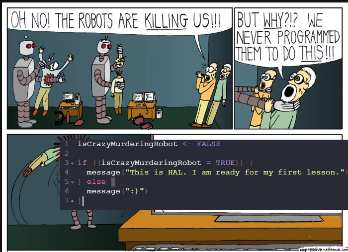

# An Introduction to Conditionals and Control Flow

## _"Our Robot Overlords"_



Modified from: ["This is why code reviews are a good thing" (Reddit)](https://www.reddit.com/r/ProgrammerHumor/comments/4x26u3/this_is_why_code_reviews_are_a_good_thing/)


### Change the **R** code so the robots do not destroy us all.

```r
isCrazyMurderingRobot <- FALSE

if ((isCrazyMurderingRobot = TRUE)) {
  message("This is HAL. I am ready for my first lesson.")
} else {
  message(":)")
}
```

## `if()` statements in R

 - [`base` **R** docs](https://stat.ethz.ch/R-manual/R-devel/library/base/html/Control.html)
 
 - [Advanced R: Introduction (#5 Control Flow)](https://adv-r.hadley.nz/control-flow.html)