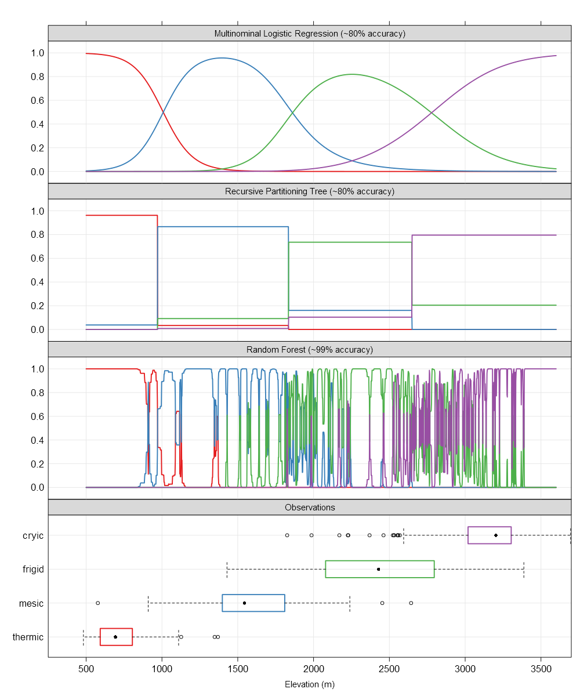

The choice of modeling framework has a significant impact on the quantity of data required, flexibility to account for non-linearities and interactions, potential for over-fitting, model performance, and degree to which the final model can be interpreted. This [document and related commentary](http://www.fharrell.com/post/stat-ml2/) provides a nice background on the interplay between model generality, interpretation, and performance.

TODO: package up these data to be used as an example.

## Soil Temperature Regime Modeling in CA792

The following figure goes along with a bit of conversation I had (below) with some of my colleagues, on the topic of modeling soil temperature regime using a variety of frameworks. The strong bioclimatic gradient with MLRAs 17, 18, 22A, 22B made is possible to use a modeling framework that generated reasonable predictions *and* resulted in an interpretable model.

Essentially, each framework (MLR, regression trees, randomForest, etc.) is useful for different tasks but thinking about the most appropriate framework ahead of time is time well spent. Predictions aren't the same as science or understanding. Sometimes we need the former, sometimes we need the latter and sometimes we need both.

The x-axis is elevation, in most cases the dominant driver of soil temperature and soil temperature regime in this area. The y-axis is conditional probability of several STR.

The top panel represents the smooth surface fit by multinomial logistic regression. These smooth surfaces lend to testable interpretations such as "the transition between STR per 1,000' of elevation gain follows XXX". This is far more useful when the model includes other factors such as annual beam radiance and the effect of cold air drainages. Absolute accuracy is sacrificed for a general (e.g. continuous over predictors) representation of the system that can support inference. Another example, "at elevation XXX, what is the average effect of moving from a south-facing slope to a north-facing slope?".

The second panel down represents the hard thresholds generated by an algorithm from the tree-based classification framework (e.g. recursive partitioning trees via rpart). Accuracy is about the same as the MLR approach and the hard breaks can be interpreted as "reasonable" cut points or thresholds that may have links to physical processes. Note that the cut points identified by this framework are very close to the 50% probability cross-over points in the MLR panel. The result is a (potentially) pragmatic partitioning of reality that can support decisions but not inference (e.g. "rate of change in Pr(STR) vs. 1000' elevation gain").

The third panel down represents the nearly-exact (over?) fitting of STR probabilities generated by the random forest framework. This approach builds thousands of classification trees and (roughly) averages them together. The results are incredible (unbelievable?) within-training-set accuracy (99% here) at the expense of an interpretable model. That isn't always a problem: sometimes predictions are all that we have time for. That said, this framework requires a 100x larger training sample (vs. MLR) and an independent validation data set before it can be trusted on new data.

---------------------------------

