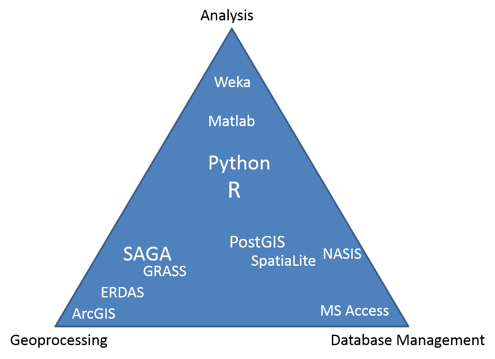
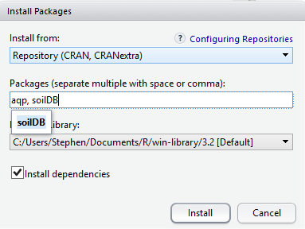

# Introduction to R {#intro}

  

## Outline

1. Course Overview
    1. Review Course Objectives
    2. Why is this training needed?
    3. Why is course organized this way?
2. What is R?
    1. Why should I use R?
    2. What can R do?
3. How do I get started?
    1. RStudio interface
    2. What are packages?
    3. How to navigate the Help tab
    4. How to save files
4. Manipulating data
    1. Loading & viewing data
    2. Filtering, transforming, merging, aggregating and reshaping data
    3. Exporting data
    
    
## Course Overview

### Course Objectives

- Develop solutions to investigate soil survey correlation problems and update activities.
- Evaluate investigations for interpretive results and determine how to proceed.
- Summarize data for population in NASIS.
- Analyze spatial data to investigate soil-landscape relationships 
- Help to pursue the question "why" 


### Why is this training needed?

- Long standing goal of the Soil Science Division to have a course in statistics [@mausbach2003]
- Opportunities to learn these techniques are limited, especially at the undergraduate level [@hennemann2004]
- Consistent methodology (data analysis, data population, sampling design, etc.)
- There is continually a greater need to use these techniques:
    - Mapping of lands at high production rates ([@macmillan2007]; [@kempen2012]; [@brevik2016])
    - Ecological Sites [@maynard2019]
    - Soil survey refinement (disaggregation) (@chaney2016];[@ramcharan2018])


### Why is course organized this way?

- Our best judgment for assembling into **24** hours what could be **6** University level courses
- Mixture of slides and script enabled web pages is new for NRCS
- The web content is a long-term investment and should serve as a permanent reference
- Feel free to provide guidance for improving the class for future offerings


## What is R?

R is a free, open-source software and programming language developed in 1995 at the University of Auckland as an environment for statistical computing and graphics [@ihaka1996]. Since then R has become one of the dominant software environments for data analysis and is used by a variety of scientific disiplines, including soil science, ecology, and geoinformatics ([Envirometrics CRAN Task View](https://cran.r-project.org/web/views/Environmetrics.html); [Spatial CRAN Task View](https://cran.r-project.org/web/views/Spatial.html)). R is particularly popular for its graphical capabilities, but it is also prized for it's GIS capabilities which make it relatively easy to generate raster-based models. More recently, R has also gained several packages which are designed specifically for analyzing soil data.

1. a software **environment**: 
    + statistics
    + graphics
    + programming
    + calculator
    + GIS
2. a **language** to explore, summarize, and model data
    + functions = verbs
    + objects = nouns

</br>

{ width=80% }

</br>


### Why Should I Learn R?

While the vast majority of people use Microsoft Excel for data analysis, R offers numerous advantages, such as:

1. Cost. R is free! [("Free as in free speech, not free beer.")](https://www.gnu.org/philosophy/free-sw.html)

2. [Reproducible Research](http://christophergandrud.github.io/RepResR-RStudio/) (*self-documenting, repeatable*)
    + repeatable: 
        + code + output in a single document *('I want the right answer, not a quick answer' - Paul Finnell)*
        + easier the next time ([humorous example](https://www.youtube.com/watch?time_continue=1&v=s3JldKoA0zw))
        + numerous Excel horror stories of scientific studies gone wrong exist ([TED Talk](https://www.youtube.com/watch?v=dXKbkpilQME))
    + scalable: applicable to small or large problems

3. R in a Community
    + [Numerous Discipline Specific R Groups](https://cran.r-project.org/web/views/)
    + [Numerous Local R User Groups (including R-Ladies Groups)](https://jumpingrivers.github.io/meetingsR/r-user-groups.html#north-america)
    + [Stack Overflow](https://stackoverflow.com/)

4. Learning Resources *(quantity and quality)*
    + [R books](https://www.r-project.org/doc/bib/R-books.html)
    + [(Free Online) R Books](https://bookdown.org/)
    
5. R is 'becoming' the new norm (paradigm shift?) "If we don't accept these challenges, others who are less qualified will; and soil scientists will be displaced by apathy." [@arnold1991]

While some people find the use of a commandline environment daunting, it is becoming a necessary skill for scientists as the volume and variety of data has grown. Thus scripting or programming has become a third language for many scientists, in addition to their native language and disipline specific terminology. Other popular programming languages include: SQL (i.e. NASIS), Python (i.e. ArcGIS), and JavaScript. 

</br>

{ width=50% }

</br>


### What can R do?

### Packages
* Base R (*functionality is extended through packages*)
    + basic summaries of quantitative or qualitative data
    + data exploration via graphics
    + [GIS](https://cran.r-project.org/web/views/Spatial.html) data processing and analysis

* Soil Science R Packages
    + [aqp](https://github.com/ncss-tech/aqp) - visualization, aggregation, classification
    + [soilDB](https://github.com/ncss-tech/soilDB) - access to commonly used soil databases
    + [soilReports](https://github.com/ncss-tech/soilReports) - handful of report templates
    + [soiltexture](http://soiltexture.r-forge.r-project.org/) - textural triangles

* [Ecology](https://cran.r-project.org/web/views/Environmetrics.html) R packages
    + [vegan](http://vegan.r-forge.r-project.org/) - ordination, diversity analysis, etc.
    + [dismo](http://rspatial.org/sdm/) -  species distribution modeling


#### Soil Science Applications

##### Create Maps

{ width=80% }


##### Draw Soil Profiles

```{r, purl=FALSE, echo=FALSE, eval=TRUE, fig.dim=c(10, 5)}
library(aqp)
library(soilDB)
loafercreek <- NULL
data("loafercreek", package = "soilDB")

n <- c("A",
       "BAt",
       "Bt1",
       "Bt2",
       "Cr",
       "R")
# REGEX rules
p <- c("A",
       "BA|AB",
       "Bt|Bw",
       "Bt3|Bt4|2B|C",
       "Cr",
       "R")

# Compute genhz labels and add to loafercreek dataset
loafercreek$genhz <- generalize.hz(loafercreek$hzname, n, p)

hzdesgnname(loafercreek)  <- "genhz"

lc <- trunc(loafercreek[5:10,], 0, 115)

par(mar = c(0, 0, 0, 0))
plotSPC(lc, plot.depth.axis = FALSE, hz.depths = TRUE, name.style = 'center-center', hz.depths.offset = 0.08, fixLabelCollisions = TRUE, cex.names = 0.75, label = 'pedon_id')
```


##### Draw Depth Plots

```{r, purl=FALSE, echo=FALSE, eval=TRUE, fig.dim=c(10, 5)}
s <- horizons(loafercreek) |>
  segment(intervals = 1:100, hzdepcols = c("hzdept", "hzdepb"))
vars <- c("clay", "phfield", "total_frags_pct")
s <- lapply(vars, function(x) {
  temp <- aggregate(s[x], list(id = s$segment_id, top = s$hzdept, bot = s$hzdepb), 
            quantile, 
            p = c(0.1, 0.5, 0.9), 
            na.rm = TRUE
            )
  temp <- cbind(temp[1:3], var = x, temp[[x]])
  }) 
s <- do.call("rbind", s)
names(s)[5:7] <- c("p10", "p50", "p90")


library(ggplot2)

ggplot(s, aes(x = top, y = p50)) +
  geom_line() +
  geom_ribbon(aes(ymin = p10, ymax = p90, x = top), alpha = 0.2) +
  xlim(c(100, 0)) + xlab("depth (cm)") + ylab("") +
  coord_flip() +
  facet_wrap( ~ var, scales = "free_x") +
  ggtitle("Loafercreek")

```


##### Estimate the Range in Characteristics (RIC)

```{r, purl=FALSE, echo=FALSE, eval=TRUE}
h <- horizons(loafercreek)
h$genhz <- factor(h$genhz, levels = rev(levels(h$genhz)))

vars <- c("clay", "phfield", "total_frags_pct")
h2 <- reshape(
  h[c("genhz", vars)],
  direction = "long",
  timevar = "variable",
  times = vars,
  v.names = "value",
  varying = vars
)
# h3 <- select(h, genhz, clay, phfield, total_frags_pct) %>%
#   gather(key = "variable", value = "value", clay, phfield, total_frags_pct)

# ggplot(h2, aes(x = genhz, y = value)) +
#   geom_boxplot() +
#   facet_wrap(~ variable, scales = "free_x") +
#   coord_flip()

vars <- c("variable", "genhz")
test <- {
  split(h2, h2[vars]) -> .
  
  lapply(., function(x)
    data.frame(
      x[1, vars],
      pct10  = round(quantile(x$value,  0.1,  na.rm = TRUE)),
      median = round(median(x$value, na.rm = TRUE)),
      pct90  = round(quantile(x$value, 0.9,  na.rm = TRUE))
    )) -> .
  
  do.call("rbind", .) -> .
  
  .[order(.$variable, rev(.$genhz)),] -> .
  
}

# test <- group_by(h2, variable, genhz) %>%
#   summarize(
#     pct10    = round(quantile(value,  0.1,  na.rm = TRUE)),
#     median = round(median(value, na.rm = TRUE)),
#     pct90    = round(quantile(value, 0.9,  na.rm = TRUE))
#     ) %>%
#   arrange(variable, rev(genhz)) %>%
#   as.data.frame()

test <- test[!is.na(test$median),]
rownames(test) <- NULL

knitr::kable(test[1:8,])
```


## RStudio: An Integrated Development Environment (IDE) for R

RStudio is an integrated development environment (IDE) that allows you to interact with R more readily. RStudio is similar to the standard RGui, but is considerably more user friendly. It has more drop-down menus, windows with multiple tabs, and many customization options. The first time you open RStudio, you will see three windows. A forth window is hidden by default, but can be opened by clicking the **File** drop-down menu, then **New File,** and then **R Script**. Detailed information on using RStudio can be found at at [RStudio's Website](https://support.rstudio.com/hc/en-us/sections/200107586-Using-RStudio).
 

  


RStudio Windows / Tabs  | Location    | Description                                  |
------------------------|-------------|----------------------------------------------|
Console Window          | lower-left  | location were commands are entered and the output is printed |
Source Tabs             | upper-left  | built-in text editor                         |
Environment Tab         | upper-right | interactive list of loaded R objects         |
History Tab             | upper-right | list of key strokes entered into the Console |
Files Tab               | lower-right | file explorer to navigate C drive folders    |
Plots Tab               | lower-right | output location for plots                    |
Packages Tab            | lower-right | list of installed packages                   |
Help Tab                | lower-right | output location for help commands and help search window |
Viewer Tab              | lower-right | advanced tab for local web content           |


## Rcmdr (R Commander): A Graphical User Interface for R

While we recommend the use of RStudio for some of the reasons listed above, many people new to R (or infrequent users) might benefit from a graphical user interface (GUI) that allows the user to run basic functions using a point and click interface. 

Luckily for beginners R has the R Commander (Rcmdr) GUI, which is similiar to [JMP](https://www.jmp.com/en_us/learning-library/using-jmp.html). Rcmdr was created by [John Fox](http://socserv.socsci.mcmaster.ca/jfox/Misc/Rcmdr/index.html) for his introductory statistics students so they could see how the software worked without learning a large number of function names and arguments. Rcmdr is a great way to begin familiarizing yourself with R and statistics within a GUI environment. 

Regrettably, we know of no GUI that allows users to perform the majority of soil survey applications demonstrated in this course, and thus Rcmdr will not be covered. For those who wish to pursue Rcmdr, alternative instructions can be viewed at [Andy Chang & G. Jay Kerns website](http://gchang.people.ysu.edu/r/R_Instructions.htm).

To take a quick peak at Rcmdr, it can be opened by **entering** the following command into the R console.

```{r, purl=FALSE, echo=TRUE, eval=FALSE}
install.packages("Rcmdr")
library(Rcmdr)
```

  


## R basics  

- R is command-line driven. It requires you to type or copy-and-paste commands after a command prompt (>) that appears when you open R. This is called the "Read-Eval-Print-Loop" or REPL. After typing a command in the R console and pressing **Enter** on your keyboard, the command will run. 

- If your command is not complete, R issues a continuation prompt (signified by a plus sign: `+`). 

- R is case sensitive. Make sure your spelling and capitalization are correct.  
 
- Commands in R are also called functions. The basic format of a function in R is: `object <- function.name(argument_1 = data, argument_2 = TRUE)`.  

- The up arrow (^) on your keyboard can be used to bring up previous commands that you've typed in the R console. 

- Any text that you do not want R to act on (such as comments, notes, or instructions) needs to be preceded by the `#` symbol (a.k.a. hash-tag, comment, pound, or number symbol).  R ignores the remainder of the script line following `#`. 


```{r, eval=FALSE}
# Math
1 + 1
10 * 10
log10(100)

# combine values
c(1, 2, 3)

# Create sequence of values
1:10

# Implicit looping
1:10 * 5
1:10 * 1:10

# Assignment and data types
## numeric
clay <- c(10, 12, 15, 26, 30)

## character
subgroup <- c("typic haplocryepts","andic haplocryepts","typic dystrocryepts")

## logical
andic <- c(FALSE, TRUE ,FALSE)

# Print
print(clay)
subgroup

```

## Managing Packages

Packages are collections of additional functions that can be loaded on demand. They commonly include example data that can be used to demonstrate those functions. Although R comes with many common statistical functions and models, most of our work requires additional packages.


### Installing Packages

To use a package, you must first install it and then load it. These steps can be done at the command line or using the Packages Tab. Examples of both approaches are provided below. R packages only need to be installed once (until R is upgraded or re-installed). Every time you start a new R session, however, you need to load every package that you intend to use in that session.  

Within the **Packages** tab you will see a list of all the packages currently installed on your computer, and 2 buttons labeled either "Install" or "Update". To install a new package simply select the **Install** button. You can enter install one or more than one packages at a time by simply separating them with a comma.   

  



To find out what packages are installed on your computer, use the following commands:

```{r}
library() 

# or

installed.packages()
``` 

One useful package for soil scientists is the `soiltexture` package. It allows you to plot soil textural triangles. The following command shows how to install this package if you do not currently have it downloaded:  

```{r}
# CRAN (static version)
install.packages(c("soiltexture"))

# GitHub (development version)
remotes::install_github("julienmoeys/soiltexture/pkg/soiltexture", dependencies = FALSE, upgrade = FALSE, build = FALSE)
``` 


### Loading Packages

Once a package is installed, it must be loaded into the R session to be used. 
This can be done by using `library()`. The package name does not need to be quoted.

```{r, eval=TRUE}
library(soilDB)
```

{ width=60% }


You can also load packages using the **Packages Tab**, by **checking** the box next to the package name. For example, documentation for the soilDB package is available from the `help()` function. 

```{r}
help(package = "soilDB")
``` 

## Getting Help 

R has [extensive documentation](https://cran.r-project.org/manuals.html), numerous [mailing lists](https://www.r-project.org/mail.html), and [countless books](https://www.r-project.org/doc/bib/R-books.html) (many of which are free and listed at end of each chapter for this course). 

To learn more about the function you are using and the options and arguments available, learn to help yourself by taking advantage of some of the following help functions in RStudio:

1. Use the Help tab in the lower-right Window to search commands (such as hist) or topics (such as histogram). 


2. Type `help(read.csv) or ?read.csv` in the Console window to bring up a help page. Results will appear in the Help tab in the lower right-hand window. Certain functions may require quotations, such as `help("+")`.

```{r, eval=FALSE}
# Help file for a function
help(read.csv) # or ?read.csv

# Help files for a package
help(package = "soiltexture")
```


## Documenting your work  

RStudio's Source Tabs serve as a built-in text editor. Prior to executing R functions at the Console, commands are typically written down (or scripted). Scripting is essentially showing your work. 

The sequence of functions necessary to complete a task are scripted in order to document or automate a task. 

While scripting may seems cumbersome at first, it ultimately saves time in the long run, particularly for repetitive tasks ([humorous YouTube Video on Scripting](https://www.youtube.com/watch?time_continue=1&v=s3JldKoA0zw)).

Benefits include:

- allows others to reproduce your work, which is the foundation of science
- serves as instruction/reminder on how to perform a task
- allows rapid iteration, which saves time and allows the evaluation of incremental changes
- reduces the chance of human error

### Basic Tips for Scripting

To write a script, simply open a new R script file by clicking **File>New File>R Script**. Within the text editor **type** out a sequence of functions.

 - Place each function (e.g. `read.csv()`) on a separate line.
 - If a function has a long list of arguments, place each argument on a separate line.
 - A command can be excuted from the text editor by placing the cursor on a line and typing **Crtl + Enter**, or by **clicking** the Run button.
 - An entire R script file can be excuted by **clicking** the Source button. 


## Organizing your work

When you first begin a project you should create a new folder and place within it all the data and code associated with the project. This simplifies the process of accessing your files from R. Using a project folder is also a good habit because it makes it easier to pickup where you left off and find your data if you need to come back to it later. Within R, your project folder is also known as your working directory. This directory will be the default location your plots and other R output are saved. 

You want to have inputs for your code in the working directory so that you can refer to them using [relative file paths](https://excelquick.com/r-programming/importing-data-absolute-and-relative-file-paths-in-r/). Relative file paths make it easier if you move the folder containing your script(s) around. Or, if you share it with someone else, they will have little issue getting your code to work on their own file system. 

### Setting the Working Directory

Before you begin working in R, you should set your working directory to your project folder; for example, `setwd("C:\\workspace2\\projectx...")`. You can use RStudio to manage your projects and folders.

**NOTE:** _Beware when specifying any file paths_ that **R** uses forward slashes `/` instead of back slashes `\`. Back slashes are reserved for use as an [escape character](https://en.wikipedia.org/wiki/Escape_character), so you must use two of them to get one in result character string.

To change the working directory in RStudio, select main menu **Session >> Set Working Directory >> ...**. Or, from the "Files" tab click **More >> Set As Working Directory** to use the _current location of the "Files" tab_ as your working directory.


Setting the working directory can also be done via the Console with the `setwd()` command:

```{r}
setwd("C:/workspace2")
```


To check the file path of the current working directory (which should now be `"C:\\workspace2"`), type:

```{r}
getwd()
```


### RStudio Projects (.Rproj files)

You can also manage your working directory using RStudio Projects. An RStudio Project file (_.Rproj_) is analogous to, for example, a _.mxd_ file for ArcMap. It contains information about the specific settings you may have set for a "project".
  
You open or create projects using the drop down menu in the top right-hand corner of the RStudio window (_shown below_)


Here is what a typical Project drop-down menu looks like:


 * You can create new projects from existing or new directories with "New Project...".

 * When you click "Open Project...", your working directory is _automatically set to the .Rproj file's location_ -- this is _extremely_ handy 

 * Any projects you have created/used recently will show up in the "Project List"


<!-- Too much for first chapter...
### More RStudio Project Features

Another neat thing about using Projects is that RStudio will provide additional tabs depending on the contents of your working directory. 

For example, if your project folder contains a Git repository (_.git_ hidden directory), a Git tab (_below image, left_) is available for version control. Also, if the directory contains source code for an R package, the "Build" tab  (_below image, right_) provides commands from the `devtools` package. 

 -->


## Saving your work  

In R, you can save several types of files to keep track of the work you do. The file types include: workspace, script, history, and graphics. It is important to save often because R, like any other software, may crash periodically. 

Such problems are especially likely when working with large files. You can save your workspace in R via the command line or the File menu.  

```{r, purl=FALSE, echo=FALSE}

rfiles <- data.frame(
  'File Type' = c("R Script", "R Markdown", "R Workspace", "R History"),
  'File Extension' = c(".R", ".Rmd", ".RData", ".RHistory"),
  Description = c("text file of R commands",
                  "text file of R commands formatted in Markdown",
                  "copy R objects from your workspace",
                  "copy all of commands sumbitted to the R Console"
                  ),
  check.names = FALSE,
  stringsAsFactors = FALSE
  )

knitr::kable(rfiles)

```


#### R script (.R)

An R script is simply a text file of R commands that you've typed. 

You may want to save your scripts (whether they were written in R Editor or another program such as Notepad) so that you can reference them in the future, edit them as needed, and keep track of what you've done. 

To save R scripts in RStudio, simply **click the save button** from your R script tab. Save scripts with the .R extension. 

R assumes that script files are saved with only that extension. If you are using another text editor, you won't need to worry about saving your scripts in R. You can open text files in the RStudio text editor, but beware copying and pasting from Word files as discussed below.  

  

To open an R script, **click the file icon**.  


#### Microsoft Word Files

Using Microsoft Word to write or save R scripts is generally a bad idea.

Certain keyboard characters, such as quotations "", are not stored the same in Word (e.g. they are "left" and "right" handed). The difference is hard to distinguish, but will not run in R. 

Also, pasting your R code or output into Wword documents manually is not reproducible, so while it may work in a pinch, it ultimately costs you time. 

You can use the `word_document` Rmarkdown template to automatically "Knit" `.docx` files from R code using a template, which is very handy for quickly getting a nice looking document!

#### R Markdown (.Rmd)

R Markdown (.Rmd) documents contain information for the reproducible combination of narrative text and code to produce elegantly formatted output. You can use multiple languages in .Rmd documents including R, Python, and SQL. You can easily "knit" visually appealing and high-quality documents into rich HTML, PDF or Word documents from the RStudio interface.

This document is made in bookdown, a variant of rmarkdown used for book templates involving multiple chapters. You can make blogs and websites for your R packages with blogdown and pkgdown. These are all tools based off of the powerful "pandoc" engine and the tools in the R Markdown ecosystem.

<!--
## This is not something we should encourage people to do. Not reproducible. We tell them to turn off this "feature" in the pre-course and I sure hope they do because it is a monstrous waste of their and our debugging time. 
## History is the only thing they should save, unless they explicitly are selecting the objects to save and using e.g. save(), saveRDS() / load() etc. -AGB

#### Workspace (.Rdata)  

The R workspace consists of all the data objects you've created or loaded during your R session. When you quit R by either typing `q()` or exiting out of the application window, R will prompt you to save your workspace.

If you choose yes, R saves a file named .RData to your working directory. The next time you open R and reload your .Rdata workspace, all of your data objects will be available in R and all of the commands that you've typed will be accessible by using the up-arrow and down-arrow keys on your keyboard. 

You can also save or load your workspace at any time during your R session from the menu by clicking **Session>Save Workspace As..**, or the save button on the **Environment Tab**.   

    

The R command for saving your workspace is:

```{r, purl=FALSE}
save.image(file="workspace.RData")
```
-->

#### R history (.Rhistory) 

An R history file is a copy of all your key strokes. You can think of it as brute force way of saving your work. It can be useful if you didn't document all your steps in an R script file.

Like an R file, an Rhistory file is simply a text file that lists all of the commands that you've executed. It does not keep a record of the results. 

To load or save your R history from the History Tab click the **Open File** or **Save** button. If you load an Rhistory file, your previous commands will again become available with the up-arrow and down-arrow keys.

 

You can also use the command line to load or save your history.  

```{r, eval=FALSE}
savehistory(file = "sand.Rhistory")  
loadhistory(file = "sand.Rhistory")  
history(max.show=Inf) #displays all previous commands
```

#### R Graphics   

Graphic outputs can be saved in various formats. 
 
```{r, purl=FALSE, echo=FALSE, eval=TRUE}
library(knitr)
test <- data.frame(
  Format = c("pdf", "window metafile", "png", "jpeg", "bmp", "postscript"),
  Function = c('pdf("graphic.pdf")', 'win.metafile("graphic.wmf")', 'png("graph.png")', 'jpeg("graph.jpg")', 'bmp("graph.bmp")', 'postscript("graph.ps")')
  )
kable(test)
```

To save a graphic: (1) Click the **Plots Tab** window, (2) click the **Export** button, (3) **Choose** your desired format, (3) **Modify** the export settings as you desire, and (4) click **Save**.  

  

The R command for saving a graphic is:  

```{r}
png(file = "npk_yield.png")
plot(npk$yield)
dev.off()
```

The first line of this command creates a blank file named sand with a JPEG extension.  The second line plots the data object that you want to create a graphic of (here it is conveniently the same name as the JPEG file we are creating). The third line closes the graphics device.  


## Exercise 1

Using the examples discussed thus far as a guide, demonstrate your mastery of the material by performing the following tasks.

1. Create an R script file, demonstrate 3 basic R functions, and comment (`#`) your code. 
2. Install the FedData R package from CRAN and [GitHub](https://github.com/ropensci/FedData). Save the commands in your R script file.
3. Load the FedData R package and read the help file for the `get_ssurgo` function within the FedData package. What is the 1st input/argument? Save the R command in your R script. 
4. Save your R script, and forward to your instructor.


## Loading Data

R can load a variety of data formats, however tabular data is by far the most common, and what we will spend of the majority of our time working with. Typically tabular data is stored in spreadsheets (e.g. .txt, .csv, .xlsx), databases (e.g. NASIS), or webpages (.html). Within R tabular data is stored as a `data.frame`. 


#### Text files

Text files are a preferable format for storing and transferring small datasets. One basic command for importing text files into R is `read.csv()`. The command is followed by the file name or URL and then some optional instructions for how to read the file.

These files can either be imported into R by clicking the **Import Dataset >> From Text** buttons from the Environment tab, or by typing the following command into the R console:

```{r, eval=FALSE}

# from working directory
sand <- read.csv("C:/workspace2/sand_example.csv")

```

```{r, eval=TRUE}
# from URL
sand <- read.csv("https://raw.githubusercontent.com/ncss-tech/stats_for_soil_survey/master/data/sand_example.csv") 

```

 


#### Excel files

R can import Excel files, but generally speaking it is a bad idea to use Excel. Excel has a dangerous default which automatically converts data with common notations to their standard format without warning or notice. For example, the character "11-JUN" entered into a cell automatically becomes the date 6/11/2021, even though the data is still displayed as 11-JUN. The only way to avoid this default behavior is to manually import your data into Excel via the **Data Tab>Get External Data Ribbon**, and manually set the data type of all your columns to text. Failure to do so has resulted in numerous retracted research articles ([Washington Post Article](https://www.washingtonpost.com/news/wonk/wp/2016/08/26/an-alarming-number-of-scientific-papers-contain-excel-errors/?utm_term=.9352a35dca6f)). Warnings aside, Excel files are a very common and are a format most people are familiar with. Therefore we will illustrate how to bring them into R.

Download the sand Excel dataset from GitHub at [https://github.com/ncss-tech/stats_for_soil_survey/blob/master/data/Pre-course/R_sand/sand_example.xlsx](https://github.com/ncss-tech/stats_for_soil_survey/blob/master/data/Pre-course/R_sand/sand_example.xlsx)

Excel datasets can either be imported into R by clicking the **Import Dataset >> From Excel** buttons from the Environment tab, or by typing the following command into the R console:  

```{r}

library(readxl)

sand_example <- read_excel("sand_example.xlsx")

```

 


#### NASIS (Web) Reports

NASIS provides a plethora of reports, many of which can be read into R for analysis. The `soilDB` R package provides a series of functions to read data from NASIS either using a local database connection or via HTML web reports. Similar functions also exist for accessing tabular data from Soil Data Access. More details on `soilDB` will be provided in the next chapter, but now we'll illustrate how to access some example datasets for manipulating tabular data.

```{r, eval=FALSE}

library(soilDB)

# get projects
prj <- get_project_from_NASISWebReport(mlrassoarea = "11-IND", fiscalyear = 2020)

# get legends
leg <- get_legend_from_NASISWebReport(mlraoffice = "Indi%", areasymbol = "%")

# get map units
mu  <- get_mapunit_from_NASISWebReport(areasymbol = c("IN001", "IN11%"))


```


## Data manipulation

Before we can do any sort of analysis, analysis, our data often needs to be manipulated one way or another. Estimates vary, but an analyst typically spend 80% of their time manipulating data, and only 20% actually analyzing or modeling. Tasks generally involve filtering, transforming, merging, aggregating, and reshaping data. 

R has many functions and packages for manipulating data frames, but within the past several years a family of packages, known as the `tidyverse`, have been developed to simplify interacting with data frames (or tibbles). Within the `tidyverse` the most commonly used packages are `dplyr` and `tidyr`. Many of the tidyverse function names are patterned after SQL syntax.

<!--
An important principle of tabular data is that it should be ["normalized'](https://en.wikipedia.org/wiki/Database_normalization) or ["tidy"](https://r4ds.had.co.nz/tidy-data.html). This simply means that rows should hold observations, and columns should hold variables for each observation. 
-->

We will review the most common functions you need to know in order to accomplish the majority of data manipulation tasks.


### Viewing and Removing Data

Once a file is imported, it is imperative that you check to ensure that R correctly imported your data. Make sure numerical data are correctly imported as numerical, that your column headings are preserved, etc. To view the data simply **click** on the mu dataset listed in the Environment tab. This will open up a separate window that displays a spreadsheet like view.


Additionally you can use the following functions to view your data in R.

Function  | Description                                         |
----------|-----------------------------------------------------|
`print()` | prints the entire object (avoid with large tables)  |
`head()`  | prints the first 6 lines of your data               |
`str()`   | shows the data structure of an R object             |
`names()` | lists the column names (i.e., headers) of your data |
`ls()`    | lists all the R objects in your workspace directory |

Try entering the following commands to view the `mu` dataset in R: 

```{r}
str(mu)

names(mu)

head(mu)

ls()
``` 

A data object is anything you've created or imported and assigned a name to in R. The Environment tab allows you to see what data objects are in your R session and expand their structure. Right now sand should be the only data object listed. If you wanted to delete all data objects from your R session, you could **click the broom icon** from the Environments tab. Otherwise you could type:

```{r}
# Remove all R objects
rm(list = ls(all = TRUE)) 

# Remove individual objects
rm(mu, leg, sand)
```


### Filtering or Subsetting Data

When analyzing data in NASIS, filtering is typically accomplished by loading your selected set with only the records you're interested in. However, it is often useful or necessary to subset your data after it's loaded. This can allow you to isolate interesting records within large datasets. For these reasons R has numerous options/functions for filtering data.

Data frames can be filtered by both columns and rows, using either **names**, **position** (e.g. column 1, row 5), or **logical** indices (e.g. `TRUE`/`FALSE`). Another particularly useful feature is the use of **pattern matching** which uses regular expressions to select data, which is similar to the `LIKE` statement from SQL.

**Filtering with names and numerical indices

```{r}

# Filtering with names
mu$areasymbol                             # select column names using $
mu[, c("areasymbol", "musym")]            # select column names using []
mu[c("1", "2"), ]                         # select row names using []
mu[c("1", "2"), c("areasymbol", "musym")] # select column and row names using []


# Filtering by position
mu[1, ]          # select first row
mu[, 1]          # select first column
mu[2, 2]         # select second row and second column
mu[c(1, 2, 3), ] # select multiple rows
mu[c(-1, -2), ]  # drop multiple rows


```

**Logical Operators**

  - `==` R uses a double equal sign as "equal-to" in SQL
  
  - `!=` "Not-equal-to"
  
  - `<, >, <=, >=` Less than, greater than, less than or equal to, and greater than or equal
  
  - `&` Equivalent to `AND` in SQL and Soil Taxonomy, must match both conditions
  
  - `|` Equivalent to `OR` in SQL and Soil Taxonomy, must match at least one condition
  
  - `%in%` Equivalent to `IN ()` in SQL (e.g. `mu$areasymbol %in% c("IN001", "IN111"`)
  
  - `grepl()` equivalent to `LIKE` in SQL (e.g. `grepl("IN%", mu$areasymbol)`)

**Filtering with logicals**

```{r, eval=FALSE}
# Standard evaluation with base R []

# Filtering with logicals
mu[mu$areasymbol == "IN001", ]                # select rows that equal IN001
mu[mu$areasymbol != "IN001", ]                # select rows that do not equal IN001
mu[, names(mu) == "areasymbol"]               # select columns that equal areasymbol
mu[, names(mu) %in% c("areasymbol", "musym")] # select columns that match areasymbol and musym 
mu[grepl("Miami", mu$muname), ]               # select rows that contain Miami


# Non-standard evaluation with tidyverse

library(dplyr)

# Filtering rows
filter(mu, areasymbol == "IN001")
filter(mu, areasymbol != "IN001")
filter(mu, areasymbol %in% c("IN001", "IN111"))
filter(mu, grepl("Miami", muname))
filter(mu, muacres > 0)

# Select columns
select(mu, areasymbol, musym)

# Slice  rows
slice(mu, 1:5)

```


### Transforming Data

This allows you to create new columns by convert, compute, or combine data within existing columns.

```{r}

mu <- mutate(mu, 
             # convert to hectares
             muhectares = muacres * 0.4047,
             # convert muname to TRUE or FALSE if Miami is present using pattern matching
             miami      = grepl("Miami", muname),
             # compute % minor component
             n_minor    = n_component - n_majcompflag,
             # combine columns
             key        = paste(areasymbol, musym)
             )

```


### Sorting Data

Sorting allows you to rearrange your data. Beware R has several similar functions (e.g. `sort` and `order`) for sorting data only work with specific datatypes. The tidyverse function `arrange` is designed to work with data frames.

```{r}

# sort ascending
arrange(mu, areasymbol, muname)

# sort descending
arrange(mu, desc(areasymbol), desc(muname))

```

### Piping Data

Another particularly useful feature provided by the `magrittr` package and used in the `tidyverse` is the use of **pipe** (`%>%`). Base R also has a native pipe operator (`|>`). Using the RStudio keyboard shortcut Ctrl + Shift + M inserts the pipe you have selected as default in Global Options > Code.

`f(x,y)` becomes `x %>% f(y)`

The "pipe" is something that occurs in many programming languages and computing contexts. It allows output from one expression to be passed as input to the first argument of the next function. This allows sequences of commands to be read from right to left b(or top to bottom) rather than from the inside out.

```{r piping}
# non-piping example 1
mu_sub <- filter(mu, areasymbol == "IN001")
mu_sub <- mutate(mu_sub, pct_100less = pct_component < 100) 

# non-piping example 2
mu_sub <- mutate(filter(mu, areasymbol == "IN001"), pct_100less = pct_component < 100)

# piping
mu_sub <- mu %>% 
  filter(areasymbol == "IN001") %>% 
  mutate(pct_100less = pct_component < 100)

```


### Merging/Joining or Combining Data

** Joining**

When working with tabular data you often have 2 or more tables you need to join. There are several ways to join tables. Which direction to join and which columns to join will determine how you achieve the join. 

```{r joining}

# inner join
leg_mu <- inner_join(leg, mu, by = c("liid", "areasymbol"))

# left join
leg_mu <- left_join(leg, mu, by = c("liid"))

# right_join
leg_mu <- right_join(leg, mu, by = "liid")

```


** Combining**

If your tables have the same structure (e.g. columns), or length and order you may simply combine them. For example, if you have two different mapunit tables.

```{r, eval=FALSE}

# combine rows
rbind(mu, mu)
rbind(mu, leg) # won't work


# combine columns
cbind(mu, mu)  # beware combine tables with duplicate column names
cbind(mu, areasymbol_2 = mu$areasymbol)
cbind(mu, leg) # won't work

```


### Aggregating or Grouping Data

Because soil data has multiple dimensions (e.g. properties and depths) and levels of organization (e.g. many to one relationships), it is often necessary to aggregate it. For example, when we wish to make a map we often need to aggregate over components and then map units. Depending on the data type this aggregation may involve taking a weighted average or selecting the dominant condition.

The `group_by` function defines the groups over which we wish to `summarize` the data.


```{r aggregating}

mu_agg <- mu %>% 
  group_by(grpname, areasymbol) %>%
  summarize(sum_muacres = sum(muacres),
            n_musym     = length(musym)
            )

```


### Reshaping Data

Typically data is stored in what is known as a **wide** format, where each column contains a different variable (e.g. depth, clay, sand, rocks). However, sometimes it is necessary to reshape or pivot to a **long** format, where each variable/column is compressed into 2 new rows. One new column contains the old column names, while another new column contains the values from the old columns. This is particularly useful when combining multiple variables into a single plot.

```{r}

library(tidyr)

# Simplify mu example dataset
mu2 <- mu %>%
  select(grpname, areasymbol, musym, muacres, n_component, pct_hydric) %>%
  slice(1:5)
print(mu2)

# Pivot long
mu2_long <- pivot_longer(mu2, cols = c(muacres, n_component, pct_hydric))
print(mu2_long)

# Pivot wide
mu2_wide <- pivot_wider(mu2_long, names_from = name)
print(mu2_wide)

```


### Exporting Data

To export data from R, use the command `write.csv()` or `write.dbf()` functions. Since we have already set our working directory, R automatically saves our file into the working directory.  

```{r}

write.csv(mu_agg, file = "mu_agg.csv")

library(foreign)

write.dbf(as.data.frame(mu_agg), file = "mu_agg.dbf")

``` 

## Exercise 2

1. Create a new R script file.

2. To get information from the NASIS legend table for the state of Wisconsin use the soilDB function `get_legend_from_NASISWebReport()` for `mlraoffice = "%"` and `areasymbol = "WI%`

3. Filter the legend table for rows where the `ssastatus == "Update needed"` to find the soil survey areas that need update. Inspect the result to find the `areasymbol` values.

4. Load the mapunit table, using soilDB `get_mapunit_from_NASISWebReport()` using the area symbols you identified in step 3.

5. Calculate the acreage of hydric soils for each mapunit by multiplying `muacres` by `pct_hydric`. Note: `pct_hydric` is a percentage, not a proportion.

6. Aggregate the total acreage of hydric soils each soil survey area using dplyr functions `group_by()` and `summarize()`.

7. Join the aggregated mapunit table from Step 6 to the legend table from Step 3 using dplyr `left_join()`.

8. Calculate the proportion of the total soil survey area acres (`areaacres`) that are hydric soils.

9. Answer the following questions:

   - What soil survey areas need update in Wisconsin?
   
   - What proportion of those soil survey areas are hydric soils?
   
   - Bonus: How does your joined result in Step 7 differ if you replace dplyr `left_join()` with `inner_join()`? Why?
   
10. Save your R script and forward to your instructor.

## Review

Given what you now know about R, try to answer the following questions:

1. Can you think of a situation where an existing hypothesis or conventional wisdom was not repeatable?

2. What are packages?

3. What is GitHub?

4. Where can you get help?

5. What is a data frame?

6. What are 3 ways you can manipulate a data frame?


## Additional Reading (Introduction)

* Introductory R Books
    + [R for Data Science](https://r4ds.had.co.nz/index.html)
    + [RStudio Cheatsheets](https://rstudio.com/resources/cheatsheets/)
    + [Quick-R](https://www.statmethods.net/)

* Advanced DSM R Books
    + [Predictive Soil Mapping with R](https://envirometrix.github.io/PredictiveSoilMapping/)
    + [Using R for Digital Soil Mapping (not free)](http://www.springer.com/us/book/9783319443256)
    + [Soil Spectral Inference with R (not free)](https://github.com/AlexandreWadoux/soilspec)
    + [GSP SOC Cookbook](https://fao-gsp.github.io/SOC-Mapping-Cookbook/)
    + [GSP SAS Manual](https://fao-gsp.github.io/GSSmap)
    
* Soil Science R Applications
    + [aqp and soilDB tutorials](http://ncss-tech.github.io/AQP/)
    + [ISRIC World Soil Information Example Training Courses](https://www.isric.org/utilise/capacity-building/training-courses#examplecourses)
    + [ISRIC World Soil Information YouTube Channel](https://www.youtube.com/channel/UCNi1XYjdXWF9eAjvG40KqWg)
    + [OpenGeoHub Courses](https://opengeohub.org/course)
    + [OpenGeoHub YouTube Channel](https://www.youtube.com/channel/UC6HFFFYiV4zEYJlQMIXemWA/featured)
    + [David Rossiter's Cornell Homepage](http://www.css.cornell.edu/faculty/dgr2/)
    + [Pierre Roudier](https://pierreroudier.github.io/teaching/index.html)

* Soil Sciences and Statistics Review Articles
    + Arkely, R., 1976. Statistical Methods in Soil Classification Research. Advances in Agronomy 28:37-70. [https://www.sciencedirect.com/science/article/pii/S0065211308605520](https://www.sciencedirect.com/science/article/pii/S0065211308605520)
    + Mausbach, M., and L. Wilding, 1991. Spatial Variability of Soils and Landforms. Soil Science Society of America, Madison. [https://dl.sciencesocieties.org/publications/books/tocs/sssaspecialpubl/spatialvariabil](https://dl.sciencesocieties.org/publications/books/tocs/sssaspecialpubl/spatialvariabil)
    + Wilding, L., Smeck, N., and G. Hall, 1983.  Spatial Variability and Pedology. In : L. Widling, N. Smeck, and G. Hall (Eds). Pedogenesis and Soil Taxonomy I. Conceps and Interactions. Elseiver, Amsterdam, pp. 83-116. [https://www.sciencedirect.com/science/article/pii/S0166248108705993](https://www.sciencedirect.com/science/article/pii/S0166248108705993)


