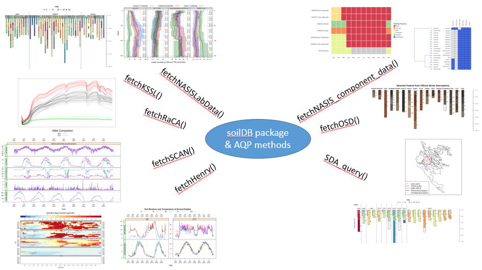

# The Data We Use {#data}

  

## Objectives (Tabular Data Structures)

- Learn more about R and how to inspect objects and data types
- Use the soilDB package to load NASIS pedon data into R
- Understand the structure of data stored in a `SoilProfileCollection` (SPC)
- Learn about the checks run on data loaded by the `fetchNASIS()` function
- Learn ways to logically filter and subset data in R
- Learn how functions can be used to bundle operations
- Review additional data that is accessible via extended data functions
- Introduce `soilReports` R package

## The Structure of Soil Data

What if you could extract, organize, and visualize data from NASIS and many other commonly used soil database sources with a couple of lines of code? 



The aqp (Algorithms for Quantitative Pedology) and soilDB packages enable data to be fetched from various sources and cast into a SoilProfileCollection(SPC) object. Tabular and spatial data objects fetched via soilDB and aqp methods can simplify the process of working with commonly used soil data.
 
### Package References

 - [**SoilProfileCollection Object Introduction**](http://ncss-tech.github.io/AQP/aqp/aqp-intro.html)

 * [**Tutorials on the AQP website**](http://ncss-tech.github.io/AQP/)
 * [**Package 'aqp' manual**](http://ncss-tech.github.io/aqp/)
 * [**Package 'soilDB' manual**](http://ncss-tech.github.io/soilDB/)
 * [**Package 'sharpshootR' manual**](http://ncss-tech.github.io/sharpshootR/docs/)

The manual pages for `soilDB` and `aqp` are accessible (click **index** at the bottom of the **Help** tab in RStudio) by entering the following into the R console: 

```{r, purl=FALSE, eval=FALSE}
# load the libaries
library(soilDB)
library(aqp)

# links to lots of great examples
help(soilDB)
help(aqp)
```

### soilDB functions for tabular data

`soilDB` functions are the quickest way to get up and running:

- **[fetchNASIS()](http://ncss-tech.github.io/soilDB/reference/fetchNASIS.html)**
    - Gets and re-packages data from a local NASIS database.
        + [NASIS pedon/horizon data](http://ncss-tech.github.io/AQP/soilDB/fetchNASIS-mini-tutorial.html)
        + [NASIS DMU/MU/component data](http://ncss-tech.github.io/AQP/soilDB/NASIS-component-data.html)
        
- **[fetchNASISLabData()](http://ncss-tech.github.io/soilDB/reference/fetchNASISLabData.html)**
    - Gets KSSL laboratory pedon/horizon layer data from a local NASIS database.
    
- **[fetchNASISWebReport()](http://ncss-tech.github.io/soilDB/reference/fetchNASISWebReport.html)**
    
- **[fetchKSSL()](http://ncss-tech.github.io/soilDB/reference/fetchKSSL.html)**
    - Gets KSSL data from the SoilWeb system via BBOX, MLRA, or series name query.
        + [KSSL Data Demo](http://ncss-tech.github.io/AQP/soilDB/KSSL-demo.html)
        + [Water Retention Curve Development from KSSL Data](http://ncss-tech.github.io/AQP/soilDB/fetchKSSL-VG-demo.html)
        
- **[fetchOSD()](http://ncss-tech.github.io/soilDB/reference/fetchOSD.html)**
    - Fetches a limited subset of horizon- and site-level attributes for named soil series from the SoilWeb system.
        + [Querying Soil Series Data](http://ncss-tech.github.io/AQP/soilDB/soil-series-query-functions.html)
    
- **[OSDquery()](http://ncss-tech.github.io/soilDB/reference/OSDquery.html)**
    - Full-text searching of OSD sections.
        + [Querying Soil Series Data](http://ncss-tech.github.io/AQP/soilDB/soil-series-query-functions.html#6_OSD_Full_Text_Search)
    
- **[fetchSCAN()](http://ncss-tech.github.io/soilDB/reference/fetchSCAN.html)**
    - Queries soil and climate data from USDA-NRCS SCAN Stations.
      + [A Unified Interface to SCAN/SNOTEL Data](http://ncss-tech.github.io/AQP/soilDB/fetchSCAN-demo.html)
      
- **[fetchHenry()](http://ncss-tech.github.io/soilDB/reference/fetchHenry.html)**
    - Downloads data from the Henry Mount Soil Climate Database.
        + [Henry Mount Soil Climate Database Tutorial](http://ncss-tech.github.io/AQP/soilDB/Henry-demo.html)
        
- **[fetchSDA()](http://ncss-tech.github.io/soilDB/reference/fetchSDA_component.html)**
    - Fetches legend/mapunit/component/horizon data from Soil Data Access.
    
- **[SDA_query()](http://ncss-tech.github.io/soilDB/reference/SDA_query.html)**
    - Can be used to access SSURGO, STATSGO (spatial and tabular), and Lab DataMart snapshots
    - Submits queries to the Soil Data Access system.
        + [Soil Data Access Tutorial](http://ncss-tech.github.io/AQP/soilDB/SDA-tutorial.html)
        + [SDA and Spatial Data](http://ncss-tech.github.io/AQP/soilDB/SDA-tutorial-2.html)
        + [SDA and Interpretations](http://ncss-tech.github.io/AQP/soilDB/SDA-cointerp-tutorial.html)


The following are still functional but not actively maintained:

- **[fetchPedonPC()](http://ncss-tech.github.io/soilDB/reference/fetchPedonPC.html)**
    - Fetches commonly used site and horizon data from a PedonPC v.5 database.

- **[fetchRaCA()](http://ncss-tech.github.io/soilDB/reference/fetchRaCA.html)**
    - Gets Rapid Carbon Assessment (RaCA) data by State, geographic bounding-box, RaCA site ID, or series query from the SoilWeb system.
        + [RaCA Data Demo](http://ncss-tech.github.io/AQP/soilDB/RaCA-demo.html)


### Importance of Pedon Data

The importance of pedon data for present and future work cannot be overstated.  These data represent decades of on-the-ground observations of the soil resource for a given area.  

As difficult as it may be to take the time to enter legacy pedon data, it is vitally important that we capture this resource and get these data into NASIS as an archive of point observations.  

```{r pedons_a, purl=FALSE, echo=FALSE, results='hide', warning=FALSE}

# options for R functions
options(width = 100, stringsAsFactors = FALSE)

library(ggplot2)
library(dplyr)

data("us_ss_timeline", package = "soilDB")

test <-
  as.data.frame(table(us_ss_timeline$year), stringsAsFactors = FALSE)

names(test)[names(test) %in% c("Var1", "Freq")] <-
  c("year", "Count")
test <- mutate(test,
               year = as.numeric(year))

g1 <- ggplot(test, aes(x = year, y = Count)) +
  geom_area(alpha = 0.7) +
  ylim(0, max(test$Count, na.rm = TRUE) * 1.5) +
  scale_x_continuous(breaks = seq(1880, 2030, 8)) +
  # theme(aspect.ratio = 1) +
  xlab("Year") +
  ggtitle("Number of Published US Soil Survey Manuscripts by Year")

g2  <- ggplot(test, aes(x = year, y = cumsum(Count))) +
  geom_area(alpha = 0.7) +
  ylim(0, max(cumsum(test$Count), na.rm = TRUE) * 1.5) +
  scale_x_continuous(breaks = seq(1880, 2030, 8)) +
  # theme(aspect.ratio = 1) +
  xlab("Year") + ylab("Count") +
  ggtitle("Cumulative Number of Published US Soil Survey Manuscripts by Year")

# gridExtra::grid.arrange(g1, g2, ncol = 1)
pedons <-
  read.csv(
    "https://raw.githubusercontent.com/ncss-tech/stats_for_soil_survey/master/data/pedons.csv",
    stringsAsFactors = FALSE
  )
pedons <- filter(pedons, obs_year %in% 1950:2018) %>%
  mutate(year = obs_year,
         lab = FALSE,
         Count = n_peiid)

labpedons <-
  read.csv(
    "https://raw.githubusercontent.com/ncss-tech/stats_for_soil_survey/master/data/labpedons.csv",
    stringsAsFactors = FALSE
  )
labpedons <- filter(labpedons, obs_year %in% 1950:2018) %>%
  mutate(year = obs_year,
         lab = TRUE,
         Count = n_peiid)

g3 <- ggplot(pedons, aes(x = year, y = Count)) +
  geom_area(aes(fill = lab), stat = "identity") +
  geom_area(data = labpedons,
            aes(x = year, y = Count, fill = lab),
            stat = "identity") +
  ylim(0, max(pedons$Count, na.rm = TRUE) * 1.2) +
  ylab("Count") + xlab("Observation Year") +
  scale_x_continuous(breaks = seq(1880, 2030, 8)) +
  ggtitle("Number of Pedons per Year")

g4 <- ggplot(pedons, aes(x = year, y = cumsum(Count))) +
  geom_area(aes(fill = lab), stat = "identity") +
  ylim(0, max(cumsum(pedons$Count), na.rm = TRUE) * 1.2) +
  ylab("Count") + xlab("Observation Year") +
  scale_x_continuous(breaks = seq(1880, 2030, 8)) +
  ggtitle("Cumulative Number of Pedons per Year")

gridExtra::grid.arrange(g1, g3, ncol = 1)
``` 


### Some Issues With Pedon Data

- Making and documenting observations of soil requires hard work. Digging is difficult, and writing soil descriptions is time consuming!

- Our confidence in observations typically weakens with the depth of the material described.
    
  - If we acknowledge this, which we must, then how do we deal with it in pedon data?
      - Use a cutoff depth, for example 100 cm, can be used to truncate observations to a zone of greater confidence.
      - Show the relative confidence of the data with depth.

##  Challenges with Pedon Data

 - Consistency
    - Missing data
 - Confidence in the observations
    - Uncertainty with depth
 - Description style differences
    - Depth described, horizonation usage styles
 - Legacy data vintage
    - Decadal span of data
    - Taxonomy updates, horizon nomenclature changes
 - Location confidence
    - Origin of the location information
    - Datum used for data collection
    - Accuracy for GPS values at the time of data collection
    
### Meeting the Challenges
  
  - Graphical display of the data and summary outputs ([**slice-wise aggregation**](http://ncss-tech.github.io/AQP/aqp/profile-summary.html))
  - Generalized Horizon Labels (GHL). Derive an aggregate soil profile and summarize soil properties for groups of similar soils. 
      - More on that process can be seen in the following tutorial:
      [**GHL Aggregation Presentation**](http://ncss-tech.github.io/AQP/presentations/ghl-aggregation.html) and [**GHL Aggregation Tutorial**](http://ncss-tech.github.io/AQP/aqp/gen-hz-application.html).

For more information regarding difficult pedon data, see the following tutorial in the "aqp" package:  
[**Dealing with Troublesome data**](http://ncss-tech.github.io/AQP/aqp/dealing-with-bad-data.html).

## The `SoilProfileCollection`

The `SoilProfileCollection` class (SPC) provided by the `aqp` package is a specialized data structure designed to support analysis. Before continuing, consider working through the [`SoilProfileCollection` Reference](http://ncss-tech.github.io/AQP/aqp/aqp-intro.html).

It is a type of object that simplifies the process of working with collections of data associated with soil profiles, e.g., site-level data, horizon-level data, spatial data, diagnostic horizon data, metadata, etc. 

A `SoilProfileCollection` is similar to the NASIS Site/Pedon "object" in that it provides generalizations, specific routines and rules about the fundamental tables and their relationships that are relevant to soil observations.

In many ways the SPC is more adaptable than the NASIS Pedon concept, strictly speaking. It can "contain" aggregations of any relevant parts of any soil data schema (table and column structure). Through this mechanism, it can be a _mediator_ between formats and algorithms. However, the SPC is not as expressive as the complex hierarchy of objects in NASIS, which are more aligned with data archival vs. analysis.

### `SoilProfileCollection` methods

Many "familiar" methods are defined for the `SoilProfileCollection` object. Some are unique, and others operate like more common functions of vector and `data.frame` objects, such as `nrow()` (*"how many horizons?"*) or `length()` (*"how many sites/pedons?"*). 

Perhaps most importantly, when you access the `site()` data or the `horizons()` data of a `SoilProfileCollection`, you get a `data.frame` object that you can use like any other you might use or make in R.

#### Promoting a `data.frame` to `SoilProfileCollection`

The `SoilProfileCollection` object is a collection of 1-D profile descriptions, of the type conventionally described on a Form 232, or on tabular data returned from laboratory. 

The object is "horizon data forward" in that you start with that, and can create site-level attributes by normalization, joins, calculations and more.

Most of the time if you are using your NASIS data, or an official database, there are defined ways of getting the data "into" an SPC. For example, `fetchOSD` returns a `SoilProfileCollection` that has been assembled from horizon and site level attributes gleaned from the OSDs text, Soil Classification database, and other sources.

In the pre-course, we had you set up a process so you could connect to your local NASIS instance to "fetch" data and have methods like `fetchNASIS` put things together for you.

This input to make a `SoilProfileCollection` can be represented most simply as a `data.frame` with unique site or profile ID and depth combinations for each horizon or layer--for example, a subset of the `phorizon` or `chorizon` table in NASIS.

A simple demonstration of "tabular horizon data" is the `sp4` data set bundled with `aqp`: some serpentine soil profiles stored in a `data.frame` in the `aqp` package (after McGahan et al., 2009).

```{r, eval=TRUE}
library(aqp)

# Load sample serpentine soil data (McGahan et al., 2009)
data(sp4, package = "aqp")

# this is a data.frame
# same as if loaded from CSV file etc.
class(sp4)

# inspect the first couple of rows
head(sp4)
```

To convert this horizon data into a `SoilProfileCollection`, we need to identify three parameters: `idname`, `top`, and `bottom`. These parameters refer to the columns of unique profile IDs, top depths and bottom depths, respectively.

There are a couple of important constraints and considerations:

   * records (rows) represent horizons
   * profiles are uniquely identified by a column (user pedon ID, pedon record ID, etc.)
   * profiles IDs cannot contain missing values (NA)
   * horizon top and bottom depths are identified by columns
   * ideally there are no gaps, overlap, or missing top/bottom depths (more on that later)
   

Use a formula to specify column names in the `data.frame`, in this case `"id"`, `"top"` and `"bottom"`. 

```{r, eval=TRUE}
#      profile ID ~ top depth + bottom depth
depths(sp4) <- id ~ top + bottom

# note new class
class(sp4)

# compact summary
sp4
```


<!-- I'd like to refine the following before including, currently confusing to me -->

<!-- The formula expresses the idea that a profile 1-dimensional description `id` has a vertical extent (Z, in profile) defined by set of `top` and `bottom` depths described for that profile.  -->

<!-- In this simplified 1-dimensional model we are concerned about keeping track of things like thickness, order, overlaps, gaps, or duplication in the data. From this, we can do a lot of "logic" checks--strictly from a perspective of basic physical representation of the horizon data. -->

<!--
NOTE: A character vector with same names has the same effect, and can be easier to "program" with than the formula-based syntax.

```{r}
depths(sp4) <- c("id","top","bottom")
```
### Extending the `SoilProfileCollection` Spatial Model 

The "spatial" definition that comes with defining the horizon depths at object creation can be further extended to real space using the `coordinates<-` method to define "X" and "Y" and `proj4string<-` to define the Coordinate Reference System (more on that later). Elevation ("Z", landscape) is generally recorded as a site attribute.
-->

#### Extracting Site and Horizon Data

The `SoilProfileCollection` is an S4 R object. S4 objects have [slots](https://stat.ethz.ch/R-manual/R-patched/library/methods/html/slot.html). Of primary importance, are the slots for site-level and horizon-level data.

You can extract values from these slots using the `site()` and `horizons()` functions. These create `data.frame` objects that are separate from the `SoilProfileCollection`. 

```{r, eval=TRUE}
# extract site data from SPC into new data.frame 's'
# note that it only contains profile IDs
s <- site(sp4)
str(s)

# extract horizon data from SPC into new data.frame 'h'
h <- horizons(sp4)
str(h)
```

#### Methods like `data.frame` 

The base R functions for accessing and setting `data.frame` columns by name such as `$` and `[[` work for `SoilProfileCollection` objects, too. Review `data.frame` methods: 

   * `[[` and `$`: single columns in `data.frame`, by name
      + `x[['variable']]`
      + `x$variable`
      
   * `[`: combinations of rows and columns, by name or index
      + `x[i, ]`: specified rows, all columns
      + `x[, j]`: all rows, specified columns
      + `x[i, j]`: specified rows, specified columns

See [Chapter 1](intro.html) and the Chapter 2 [Appendix](http://ncss-tech.github.io/stats_for_soil_survey/chapters/2_data/2a_appendix_data_types.html) for additional details and examples.

##### Column Access by Name: `$` and `[[`

```{r, eval=TRUE}
# sp4 is a SoilProfileCollection
sp4$clay
sp4[['clay']]

# horizon data.frame
h$clay
h[['clay']]

# use $<- or [[<- to set proportional clay content
sp4$clay <- sp4[['clay']] / 100

# undo what we did above; back to percentage
sp4[['clay']] <- sp4$clay * 100

# create new site variable ("numberone" recycled for all sites)
site(sp4)$newvar1 <- "numberone"

# create new horizon variable ("numbertwo" recycled for all horizons)
horizons(sp4)$newvar2 <- "numbertwo"
```

##### Row Access: `[`

The `SoilProfileCollection` also has `[` ("single bracket"), but with a different interpretation from the `[i, j]` indexing of `data.frame` objects. 

 - In a `data.frame` you have `object[row, column, drop=TRUE]`; the result is a `data.frame` (or a vector with default `drop=TRUE`). 

 - In a `SoilProfileCollection` you have `object[site, horizon]`; the result is a `SoilProfileCollection`.

```{r, eval=TRUE} 
# i-index: first 2 profiles, all horizons
sp4[1:2, ]

# j-index: all profiles; first 2 horizons of each profile
sp4[, 1:2]
```

When you use the `[` function, everything in the `SoilProfileCollection` is subset simultaneously depending on the constraints specified by the indices.

```{r, eval=TRUE}
# First profile, first 2 horizons
horizons(sp4[1, 1:2])
```

All slots in the collection have a relationship to the site or _i_-index. When you remove sites (profiles), all associated records (e.g. spatial, diagnostics, horizons, etc.) in the object are removed.

Similarly, when all horizons are removed (say, you request the 6th j-index from a profile that has only 5 layers), the site index and all associated data are removed from the collection.

<!--
##### Optional: `tibble` and `data.table` `SoilProfileCollection` objects

Since the CRAN release of `aqp` 1.25 there has been support for `tibble` and `data.table` `data.frame` subclasses in the slots of the `SoilProfileCollection`. 

Most methods that make `SoilProfileCollections` for you (e.g. `fetchNASIS`) only use `data.frame` objects, so this is, at this point, a completely optional feature.

```{r, eval=FALSE}
data("gopheridge", package="soilDB")
pedons <- gopheridge

# before: data.frame
class(horizons(pedons))

# set a new data.frame class with aqp_df_class<- then rebuild the SPC
aqp_df_class(pedons) <- "tibble" # or "tbl_df", "data.table", "data.frame"
pedons <- rebuildSPC(pedons)

# after: tbl_df, a subclass of data.frame
class(horizons(pedons))
```

This is an nice feature if you are a user of the `tidyverse` metapackage -- or scripts that use it -- as these use `tibble` as the "central" `data.frame`-class object -- and you may be frustrated by the old behavior of SPCs behaving erratically when given `tibble`, or turning your `tibble` into `data.frame`.

If you want to take advantage of high performance code for manipulating tabular data in the `data.table` package, you can also use that as the internal data.frame subclass. 

`data.table` is now _silently_ used in `aqp` for several operations to increase efficiency. If you prefer to use `data.table` in your scripts, integration with the `SoilProfileCollection` is now easier than ever.

### Why bother with a `SoilProfileCollection`?

As discussed at the beginning of the chapter, typical soil data sets have several tables with complex relationships between them. Manually keeping data sets in sync can range somewhere between a "chore" and a "Real Big Problem&trade;". We could manually do almost anything with or without a `SoilProfileCollection`... So _why bother_ with another data type?

Well, there are _lots_ of things we could do from scratch -- most of us do not do those things. If we did we _might_ mess something up if we weren't doing it all the time. 

We don't go and re-write the NASIS queries we use for each new project... We re-use the same tools in new project areas. In the same way, logic in the `SoilProfileCollection` is "off-loaded" onto special procedures. In the case of `aqp` and the SPC, these have been around for years and are rigorously unit-tested. 

This is why we use the `SoilProfileCollection`. We can "trust" it to take care of certain things -- reducing the amount of indexing and other book keeping needed in our own analysis code. 

The thinking has been put into the "schema" of the object and its methods up front, which makes it so that the user can focus on her or his analysis. This goal, in principle, is why NASIS, and all of the other soil databases and data models, exist. 

There are of course a variety of other tools available for managing spatial and relational data in and out of R -- this course does not seek to be comprehensive in covering those tools. Many tools can be used in tandem with `SoilProfileCollection` objects or the outputs they create.

If you understand the basic object types involved, you will see that the `SoilProfileCollection` is not the answer to every problem, but rather a convenient, efficient abstraction tailored for soil data work, and harmonious with a variety of R objects and data structures.

All of the above together means that more time and energy can be put towards to solving _soil_ problems, rather than computer problems. 
-->

### Exercise: Assemble a `SoilProfileCollection` from several CSV files

[Link to exercise R code](https://github.com/ncss-tech/stats_for_soil_survey/blob/master/exercise_ideas/SPC-from-CSV-files.R)

  


## Using the `soilDB` Package

The `soilDB` package for R provides functions for accessing data stored in NASIS, KSSL, SDA, SoilWeb, SoilGrids and other sources. 

These high-level 'fetch' functions bundle or wrap lower-level `get` functions which access internal database interfaces to NASIS and other data sources.  The ODBC connection to NASIS that you set up during the pre-course is an example of this internal database interface.

Basic data checks are run within `fetch` functions. These checks ensure the basic integrity of the data as it is queried and moved from its existing structure into an SPC. There are times when it is useful to use the lower-level `get` functions individually.  They generally return single `data.frame` or `list` of `data.frame`. 

You can set up scripts to make custom queries against these or other sources on your own -- there is an example at the end of this section.

For now, we will start with the `fetch` functions and others that will get you a large variety of data you can use for soil and ecological site analyses.

### Open Database Connectivity (ODBC) Connection to NASIS

After setting up an ODBC connection, you can use R to access data from a selected set defined in your local NASIS database. 

[**How to Create an ODBC Connection to local NASIS database for R**](http://ncss-tech.github.io/AQP/soilDB/setup_local_nasis.html).
 
_Does NASIS need to be open and running to query data using soilDB?_

No, `fetchNASIS()` works whether the NASIS application is running or not. You just need to make sure that the data you want has been loaded into your selected set.

### `fetchNASIS()`

The [fetchNASIS()](http://ncss-tech.github.io/soilDB/reference/fetchNASIS.html) convenience function extracts data from a NASIS selected set via Structured Query Language (SQL).   

Note that the import process in `fetchNASIS()`, and the other methods, is not comprehensive. It does not pull every column for every table related to pedon data out of NASIS. 

Instead, it pulls essential / commonly used pedon and horizon data. Higher level functions like `fetchNASIS()` bundle a series of lower-level queries to get specific parts of the Pedon or Component data structures. Much of the nested complexity of NASIS is simplified in the resulting object. You may need to make more detailed queries and joins to resolve specific questions.

```{r structure_diagram_a, purl=FALSE, eval=TRUE, echo=FALSE, warning=FALSE}
library(diagram, quietly=TRUE)
# reset figure margins
par(mar = c(1, 1, 1, 1))

# simple diagram of the pedon data structure
names <- c("Site", "Siteobs", "Pedon", "Horizon")
M <- matrix(nrow = 4, ncol = 4, byrow = TRUE, data = 0)
M[4, 3] <- M[3, 2] <- M[2, 1] <- ""
pos <- cbind (c(1, 1, 1, 1))
plotmat(M, pos = pos, name = names, lwd = 1, box.lwd = 2, cex.txt = 0.8, box.size = 0.1, box.type = "square", box.prop = 0.4, mx=-0.2)

# parallel simplified SPC structure
names <- c("Site-level", "Horizon-level")
M <- matrix(nrow = 2, ncol = 2, byrow = TRUE, data = 0)
 M[2, 1] <- ""
#pos <- cbind (c(2, 2))
plotmat(M, pos = c(1, 1), name = names, lwd = 1, box.lwd = 2, cex.txt = 0.8, box.size = 0.14, box.type = "square", box.prop = 0.75, mx=0.3, my=-0.05, add=TRUE)

# add arrows to the diagram
arrows(0.42, 0.12, x1=0.65, y1=0.2, length = 0.25, code=2, lwd=2, angle = 15)
arrows(0.42, 0.37, x1=0.65, y1=0.54, length = 0.25, code=2, lwd=2, angle = 15)
arrows(0.42, 0.61, x1=0.65, y1=0.61, length = 0.25, code=2, lwd=2, angle = 15)
arrows(0.42, 0.87, x1=0.65, y1=0.68, length = 0.25, code=2, lwd=2, angle = 15)
```

Many-to-one relationships are "flattened" where possible by `fetchNASIS()`. This aggregates the data from various tables into one "site" record with related horizon records, per profile. 

You can see the child tables that are aggregated using the `get_extended_data_from_NASIS()` method, which returns a named list of child table sources that can be joined to the `SoilProfileCollection` made with `fetchNASIS()` using the internal record IDs.

#### fetchNASIS arguments

`fetchNASIS()` has a number of different arguments:

- **from = 'pedons' or 'components' or 'pedon_report'** 
    - This option allows you to select which data you want to load from NASIS. Choosing either 'pedons' or 'components' will load data from your local database. If 'pedon_report' is specified then it will load data from the text file generated by the NASIS report 'fetchNASIS' (run offline). This is useful for loading more than 20,000 pedons at one time, such for an entire Soil Survey Region.
    
- **url =** string specifying the (temporary) URL for the NASIS `pedon_report` output generated by the `fetchNASIS` NASIS Report that can be run "Offline Against National Database" [EXAMPLE OUTPUT (MT663)](../data/book/02/fetchNASIS_61769c83-6180-486f-b8c8-9b0109ee1039.txt)
    
- **SS = `TRUE`/`FALSE`** 
    - The Selected Set (SS) option allows you to choose whether you want the data to load from your current selected set in NASIS or from the local database tables.  The default is set to `TRUE` so if unspecified `fetchNASIS()` will always load from the data in the selected set. 
    
- **stringAsFactors = `TRUE`/`FALSE`** 
    - This option allows you to select whether to convert strings into factors or not.  The default is set to **FALSE**, which will handle strings as character formats. Manually set this option to `TRUE` if you wish to handle character strings as factors.   

- **rmHzErrors = `TRUE`/`FALSE`** 
    - Setting this value to `TRUE` (the default) enables checks for horizon depth consistency. Consider setting this argument to `FALSE` if you aren't concerned about horizon-depth errors or if you know that your selected set contains many combination horizons (e.g., consisting of E/Bt horizons or similar two-part horizons described individually for the same depth range). Note that any pedons flagged as having horizon-depth errors (rmHzErrors = `TRUE`) are omitted from the data returned by `fetchNASIS()`.
    
- **nullFragsAreZero = `TRUE`/`FALSE`**
    - Setting this value to `TRUE` (the default) converts null entries for rock fragment volumes to 0. This is typically the right assumption because rock fragment data are typically populated only when observed. If you know that your data contain a combination of omitted information (e.g. no rock fragment volumes are populated) then consider setting this argument to `FALSE`.
    
- **soilColorState = 'moist' or 'dry'** 
    - Select dry or moist colors to be converted and placed into a horizon-level attribute called `soil_color`. The default is set to 'moist' unless specified.  Moist and dry colors are also stored in `moist_soil_color` and `dry_soil_color`.
    
- **lab = `TRUE`/`FALSE`** 
    - This option allows for loading the data associated with horizons that may be in the `phlabresults` table.  The default is set to `FALSE`, which will not load records from the `phlabresults` table.
  
For more information on the data checks and adjusting the default options to `fetchNASIS()` function, see the following resource: [**Tips on Getting Data from NASIS into R**](http://ncss-tech.github.io/AQP/soilDB/fetchNASIS-mini-tutorial.html).

### The `gopheridge` Dataset

The `gopheridge` sample data set is a sample R object returned from `fetchNASIS()` in a self-contained `.rda` file stored in `soilDB`.

Open RStudio, and set up the environment by loading packages and the `gopheridge` sample dataset.

```{r gopheridge_a, eval=TRUE}
library(aqp)
library(soilDB)

# load example dataset
data(gopheridge, package = "soilDB")

# what kind of object is this?
class(gopheridge)

# what does the internal structure look like?
str(gopheridge, 2)

# the fields at the site and horizon levels within the SPC
siteNames(gopheridge)
horizonNames(gopheridge)
```

#### Make profile sketches 

The `plotSPC()` or `plot()` function applied to a `SoilProfileCollection` object generates sketches based on horizon depths, designations, and colors. The [`SoilProfileCollection` Reference](https://ncss-tech.github.io/AQP/aqp/aqp-intro.html#10_Plotting_SoilProfileCollection_Objects) contains many examples demonstrating way in which these sketches can be customized.

The `fetchNASIS()` function automatically converts moist Munsell colors into R-style colors. 

Multiple colors per horizon are mixed to make the ones that are shown by default in the calculated `soil_color` fields. See [`?plotSPC` for a detailed list of arguments and examples](http://ncss-tech.github.io/aqp/reference/SoilProfileCollection-plotting-methods.html).

```{r, fig.width=10, fig.height=4, eval=TRUE}
par(mar = c(1, 1, 1, 1))

# omitting pedon IDs and horizon designations
plotSPC(gopheridge,
     print.id = FALSE,
     name = NA,
     width = 0.3)
title('Pedons from the `gopheridge` sample dataset', line = -0.5)
```

#### Pedon Data Checks

When you load pedons using the `fetchNASIS()` function, the following data checks are performed:

- **Presence of multiple map datums**. Results reported to the user and the data are not modified.

- **Inconsistent horizon boundaries**. Pedons with inconsistent horizon boundaries are not loaded unless `rmHzErrors = FALSE`.  In most cases, this occurs when the bottom depth of a horizon is not the same as the upper depth of the next lower horizon.

```{r example_a, purl=FALSE, eval=TRUE, echo=FALSE, results='show', warning=FALSE}
top <- c(0, 38, 56, 121, 135)
bot <- c(30, 56, 121, 135, NA)

hzname <- c('A', 'Bt1', 'Bt2', 'Bk', 'R')
d <- data.frame(hzname, top, bot)

d
```

Note the issue above. The bottom depth of the A horizon and the upper depth of the Bt1 horizon should be the same: either 30 or 38 cm. The correct depth needs to be determined and fixed in the database.

- **Missing lower horizon depths.** Offending horizons are fixed by replacing the missing bottom depth with the top depth plus 2 cm. In the case of the profile shown above, a bottom depth of 137 cm would be inserted where the depth is missing.

- **Sites missing pedon records**. Data without corresponding horizons are not loaded.

#### Find Pedons with Errors

If errors in the pedon data are detected when loading data using `fetchNASIS()`, the following "get" commands can trace them back to the corresponding records in NASIS. 

These access an option that is stored in a special object called an `Environment` associated with the soilDB package  -- they generally contain vectors of IDs.

- `get('sites.missing.pedons', envir = soilDB.env)`
    - Returns user site ID for sites missing pedons
  
- `get('dup.pedon.ids', envir = soilDB.env)`
    - Returns user pedon ID for sites with duplicate pedon ID
  
- `get('bad.pedon.ids', envir = soilDB.env)`
    - Returns user pedon ID for pedons with inconsistent horizon depths
    
- `get('bad.horizons', envir = soilDB.env)`
    - Returns a data.frame of horizon-level information for pedons with inconsistent horizon depths
    
```{r, eval=FALSE}
get('sites.missing.pedons', envir = soilDB.env)
get('dup.pedon.ids', envir = soilDB.env)
get('bad.pedon.ids', envir = soilDB.env)
get('bad.horizons', envir = soilDB.env)
```

These `get()` calls access variables stored in the package environment `soilDB.env`. The variables only exist if there are "problems" / values found by the data checks -- and if you fix the errors in the NASIS database and the checks don't find any errors then nothing will be returned by these functions.

### Further Reading / Reference
   
   * The [`SoilProfileCollection` Reference](http://ncss-tech.github.io/AQP/aqp/aqp-intro.html) contains examples based on the `sp4` sample dataset. This is a good exercise for the class and reference for future work.
   
   * The [Querying Soil Series Data](http://ncss-tech.github.io/AQP/soilDB/soil-series-query-functions.html) document contains a more detailed explanation of how the data behind `fetchOSD` were created and how to interpret its results.

   * The [Competing Soil Series](http://ncss-tech.github.io/AQP/soilDB/competing-series.html) document contains a number of examples related to getting OSD morphology using `fetchOSD`, laboratory data using `fetchKSSL`, and summary via profile sketches and slice-wise aggregation.
   
   * Several examples pertaining to SDA, soil texture, and soil profile sketches are explored in this [Random Walk 001](ncss-tech.github.io/AQP/random-walks/walk-001.html).
   
   * The ["SPC Plotting Ideas"](http://ncss-tech.github.io/AQP/aqp/SPC-plotting-ideas.html) document outlines some advanced techniques for arranging and annotating soil profile sketches.


## Working with Data in R

### Summaries

Now that you've loaded some data, you can look at additional ways to summarize and interact with data elements.

#### `table()`

The base R `table()` function is very useful for quick summary operations. It returns a named vector with the amount of each unique level of the a given vector.

The numeric vector of "counts" is commonly combined with other functions such as `sort()`, `order()`, `prop.table()`, `is.na()` or `!is.na()` (is not NA) to identify abundance, proportions, or missing data (`NA`).

```{r, eval=TRUE}
# load required packages
library(aqp)
library(soilDB)

data("gopheridge", package = "soilDB")

# for these examples, we use the gopheridge dataset as our "selected set"
pedons <- gopheridge 
# NOTE: you can use fetchNASIS to load your own data, like this:
# pedons <- fetchNASIS()

# summarize which soil taxa we have loaded
table(pedons$taxonname)

# sort results in descending order
sort(table(pedons$taxonname), decreasing = TRUE)

# could do the same thing for taxonomic subgroups 
# or any column of the SPC at the site or horizon levels
table(pedons$taxsubgrp)
sort(table(pedons$taxsubgrp), decreasing = TRUE)
```

<!-- #### `dput()` -->

<!-- Another very useful function is `dput()`, which prints a string-representation of the output of an R expression as code that generates that output so that you can re-use it.  -->

<!-- It is also good short-hand for concatenating a comma-delimited list.  -->

<!-- Here, we select the first four `pedon_id` values in `pedons` site table, and print out a comma-separated `c()` expression showing those values as a static R expression. -->

<!-- ```{r, eval=TRUE} -->
<!-- dput(site(pedons)$pedon_id[1:4]) -->
<!-- ``` -->

<!-- This result string can be copy-pasted as a comma-delimited string, used as a string of UserSiteID's for entering into NASIS list queries or other things. -->

<!-- The `dput()` function is helpful when sending questions or example data to colleagues. Here, we see that the results of `dput()` are equivalent to the input after evaluation by R. -->

<!-- ```{r, eval=TRUE} -->
<!-- all(c("08DWB028", "07RJV098", "07RJV099", "S2007CA009002") == site(pedons)$pedon_id[1:4]) -->
<!-- ``` -->

<!--Do we want to include here? Perhaps move to the end as more of a footnote for future work and extensibility.

I think this is now more covered in Stephens intro anyway. The main point of me including this (as well as the specialized timeseries object stub) was to draw parallels between objects for specialized data purposes. And how in some ways the SPC is 'tidy' for our typical soil profile data. I understand this probably makes you cringe, and you couldn't have known what I had in mind from just the two line stub.-AB

#### The `dplyr` package and "tidy" data principles

**[Tidy Data Principles](https://tidyr.tidyverse.org/articles/tidy-data.html)**

This is a stub to talk about `dplyr` some links to tidyverse-centric examples of working with `data.frame`/`tibble` and summarizing them. 

Talk about cool things like `rowwise()`, `across()` and translation to high-performance code (`dtplyr`) and SQL (`dbplyr`).

<!--
Brief point on why students learning R probably should use it for certain things at least. 

 - Abundant resources available
 
 - Now mature

 - Many options for inputs, ways to do things
 
 - Possibly more expressive code, in a consistent style (easier to share with others?)
 
But also that they should have a basic understanding how could be done in base R -- if nothing else to be better-informed of their (probably easier `dplyr`) choices. 

Anecdote about using `dplyr` for very simple base R things, and deprecation/package stability in general. `dplyr` is stable now, but it wasn't. Be aware of that kind of thing when you use a new package.
-->

### Missing Values

```{r, eval=TRUE}
table(pedons$taxsubgrp, useNA = "ifany")

#  is.na(...) 
table(is.na(pedons$taxsubgrp))

#  is NOT NA !is.na(...)
table(!is.na(pedons$taxsubgrp))

# it can also be applied to horizon level columns in the SPC
sort(table(pedons$texture), decreasing=TRUE)
```

### Logical Operators

[Logical operators](https://stat.ethz.ch/R-manual/R-devel/library/base/html/Logic.html) act on vectors for the purposes of comparison.

  - `==` "EQUAL TO"
  
  - `!=` "NOT EQUAL TO"
  
  - `<` LESS than
  
    - LESS than or equal to `<=`
    
  - `>` GREATER than
  
    - GREATER than or equal to `>=`
  
  - `%in%` Equivalent to `IN ()` in SQL; same logic as `match()` but returns a boolean, not integer
  
    - Example: `pedons$taxpartsize %in% c('loamy-skeletal', 'sandy-skeletal')`
    
    - Returns a vector of `TRUE`/`FALSE` equal in length to left-hand side
    
  - `&` logical AND 
  
  - `|` logical OR
  
  
### Pattern Matching

The following examples use the `grep()` function to pattern match within the data, create an index of the `SoilProfileCollection` for records that match the specified pattern within that column, and then use that index to filter to specific sites and their corresponding profiles. 

Patterns are specified using [regular expression](http://regexr.com/) (REGEX) syntax.

This process can be applied to many different columns in the SPC based on how you need to filter the data.  This example pattern matches on the `tax_subgroup` column, but another useful application might be to pattern match on geomorphology or parent material.

Say we want to see what the variation of particle size classes are within a specific subgroup? We can use `grep()` to create a row index, then apply that index to the `SoilProfileCollection`. 

```{r, eval=TRUE}
# create a numeric index for pedons with taxsubgroup containing 'typic'
idx <- grep('typic', pedons$taxsubgrp)
idx

# use square bracket notation to subset 'typic' soils in `subset1` object
subset1 <- pedons[idx,]

# or use the index directly to summarize taxpartsize for 'typic' soils
sort(table(pedons$taxpartsize[idx]), decreasing = TRUE)
```

Note: `grep()` below  has an `invert` argument (default `FALSE`). This option is very useful for excluding the results of the pattern matching process by inverting whatever the result is. `grepl()` is the _logical_ version of `grep()`, so you can invert it using the logical NOT operator: `!`.

Another method is to create an index using `which()` function. `which()` takes any logical vector (or expression), and it returns the indices (positions) where that expression returns `TRUE`. The use of `which` becomes more important when there are missing values (NA) in an expression.

_Do a graphical check to see the "typic" profiles are selected._

Plot them in R using the `SoilProfileCollection` "plot" method (e.g., specialized version of the generic `plot()` function).

```{r, eval=TRUE, fig.width=8, fig.height=4}
# adjust margins
par(mar=c(1,0,0,1))

# plot the first 10 profiles of subset1
plot(subset1[1:10, ], label = 'taxsubgrp', max.depth = 60)
title('Pedons with the word "typic" at subgroup-level of Soil Taxonomy', line=-2)
```

For more information on using regular expressions in `grep()` for pattern matching operations, see: [Regular-expression-syntax](https://www.gnu.org/software/findutils/manual/html_node/find_html/grep-regular-expression-syntax.html).

Quick check: _Compare or run these commands with some code, and review the documentation, to answer the questions._

 - _True or False_: `grepl()` returns a _numeric_ vector 
 - _True or False_: `which(grepl('typic', pedons$taxsubgrp))` is the same as `grep('typic', pedons$taxsubgrp)`.

#### REGEX Quick Start

  - `.` One character, any character
  
  - `*` Zero-or-more Quantifier (of previous token)
  
  - `+` One-or-more Quantifier (of previous token)
  
  - `{n}` quantifier where `n` is the the number of a match "repeats" (of previous token)
  
  - `[A-Z!]` ONE capital letter, or an exclamation mark

  - `[0-9]{2}` TWO numbers (using `{` quantifier)
    
  - `|` is equivalent to `OR`: 
    - Example:  `grep('loamy|sandy', c("loamy-skeletal","sandy","sandy-skeletal"))`
      - "loamy _OR_ sandy"
    
  - `^` Anchor to beginning of string / line: 
    - Example:  `grep('^sandy', c("loamy-skeletal","sandy","sandy-skeletal"))`
      - "_STARTS WITH_ sandy"
    
  - `$` Anchor to end of string / line: 
    - Example:  `grep('skeletal$', c("loamy-skeletal","sandy","sandy-skeletal"))`
      - "_ENDS WITH_ skeletal"
  
  - `\\b` Anchor to word boundary: 
    - Example:  `grep('\\bmesic', c("mesic","thermic","isomesic"))`
      - "_WORD STARTS WITH_ mesic" (e.g. not "isomesic")

#### Resources for Regular Expressions

  - https://regex101.com/ & https://regexr.com/ - Online regular expression testers
  
  - http://www.regular-expressions.info/quickstart.html - One-page regular expression quick start guide
  
### Filtering

A variety of methods are available to subset or "filter" R data objects, from a simple `data.frame` or vector, to something more complex like a `Spatial` object or a `SoilProfileCollection`.

You can index many R objects using numeric or logical expressions as above. There are also methods that make this process a little easier. 

The base R method for this is `subset()` and it works on `data.frame` objects. It is nice because you can specify column names without explicitly referencing the data set, since subset uses non-standard evaluation of expressions passed as arguments.

#### Filtering with `aqp::subset`

We use the `SoilProfileCollection` `subset` method, where we first specify a data (`pedons`) object then we can write expressions for the columns that exist in that object.

Here, we combine two logical expressions to find `taxsubgrp` containing `"alfs"` (Alfisols) with `obsdate` before January 1st, 2010. 

```{r, eval=TRUE,  fig.width=8, fig.height=4}
subset2 <- subset(
  pedons, 
  grepl("alfs", taxsubgrp) & obs_date < as.POSIXlt("2010-01-01")
)

# check taxonomic range of particle size classes in the data
# overwhelmingly these are described as loamy-skeletal ultic haploxeralfs
sort(table(subset2$taxsubgrp), decreasing = TRUE)
sort(table(subset2$taxpartsize), decreasing = TRUE)

# check year described and taxpartsize
table(subset2$taxpartsize, substr(subset2$obs_date, 0, 4))

# a double equal sign '==' is used for exact character or numeric criteria
subset3 <- subset(subset2, taxpartsize == 'loamy-skeletal')

table(subset3$taxpartsize)

par(mar = c(0, 0, 2, 1))
plotSPC(subset3[1:12, ], print.id = FALSE)
title('Loamy-skeletal Ultic Haploxeralfs')
```

### Dates and Times

Dates and times use special object types in R. The [Unix time](https://en.wikipedia.org/wiki/Unix_time), also known as "Posix time," is a system for describing a point in time. Unix epoch is a whole number value that is the number of seconds elapsed since the 00:00:00 UTC on 1 January 1970 minus leap seconds.

We can use logical comparison operators on dates and times if their string representation such as `"01/01/1970"` is converted to a common base R UNIX time representation known as `POSIXlt` or `POSIXct`. 

This conversion accounts for important things such as timezone using your computer's locale--which is important to keep in mind.

When converting to POSIX time several unambiguous (year-month-day) date time formats can be detected. 

For instance, if you want to convert a date in the common month-day-year format, you need to specify the `format` argument:

```{r}
as.POSIXlt("01/01/1970", format = "%m/%d/%Y")
```

By default the timezone will match your current timezone. Dates without times are treated as being at midnight UTC.

You can customize the timezone with `tz` argument:

```{r}
as.POSIXlt("01/01/1970", tz = "UTC", format = "%m/%d/%Y")
```

POSIXlt and POSIXct objects can be formatted with the `format()` function. `strptime()` can be used to parse character vectors into date/times. 

R also has the Date class which can be used for formatting calendar dates. You can convert POSIXlt/POSIXct objects to Date with `as.Date()`

<!-- Thinking this might be too much to cover/include here? Or perhaps expand as example for next time.

We need an entire section on time-series analysis. In light of DSP needs, and all of the great assets we have available -- HENRY, SCAN/SNOTEL, NOAA, and more -AB

#### Packages for Time-series Data

Tools for totally ordered indexed observations -- especially irregular time series.

 - [zoo Quick Reference](https://cran.r-project.org/web/packages/zoo/vignettes/zoo-quickref.pdf)

 - [`tidyverts`](https://tidyverts.org/) is all about _time-series_ in the [tidyverse](https://tidyverse.org/). 

 - [`tsibble`](https://github.com/tidyverts/tsibble) package provides a data structure for tidy temporal data and models.
-->

## `fetchNASIS` data checks

`fetchNASIS` does a lot of the hard work for you by pulling out a variety of child tables and joining them to site/horizon tables

This results in a `SoilProfileCollection` object that has many of the NASIS data columns. In order to do this, a variety of processes are run. Output is generated that you should look at. We will walk through the most common parts.

_Analysis of Site Coordinate Data for pedons from `MT647`_

```
multiple horizontal datums present, consider using WGS84 coordinates (x_std, y_std)
```

_Mixing of multiple colors (for "default" moist and dry colors for many:1 case)_

```
mixing dry colors ... [33 of 4108 horizons]
mixing moist colors ... [60 of 4532 horizons]
```

_Quality control and limited "filling" of fragments, horizon depth data, site data, tables_

```
replacing missing lower horizon depths with top depth + 1cm ... [19 horizons]
-> QC: horizon errors detected:
	Use `get('bad.pedon.ids', envir=soilDB.env)` for pedon record IDs (peiid)
	Use `get('bad.horizons', envir=soilDB.env)` for horizon designations
-> QC: pedons missing bottom hz depths:
	Use `get('missing.bottom.depths', envir=soilDB.env)` for pedon record IDs (peiid)
```

Notes about default settings and handling of `NULL` (missing data elements or records)_

```
NOTE: some records are missing surface fragment cover
NOTE: some records are missing rock fragment volume
NOTE: all records are missing artifact volume
```

### Inspecting Results

Here we inspect occurrence of andic soil properties in MT647. 

We will download this "selected set" from the course website as an _.rda_ file to save you the effort of crafting your selected set just for this example.

```{r, eval=TRUE}
example.data.dir <- "C:/workspace2"
example.data.path <- file.path(example.data.dir, "mt647.rda")

if(!dir.exists(example.data.dir))
  dir.create(example.data.dir, recursive = TRUE)

download.file("https://github.com/ncss-tech/stats_for_soil_survey/raw/master/data/book/02/mt647.rda", 
              destfile = example.data.path)
```

#### Load Example Data

To load the sample object data into R, just use `load()` and the path to the _.rda_ file (`example.data.path` or `"C:/workspace2/mt647.rda"`)

```{r eval=TRUE}
# load the sample data
example.data.dir <- "C:/workspace2"
load(file.path(example.data.dir, "mt647.rda"))
```

```{r, eval=TRUE}
length(mt647)

table(site(mt647)$andic.soil.properties, useNA = "ifany")

# get just the profiles with andic.soil.properties == TRUE
subset(mt647, andic.soil.properties)
```

We can compare this to what we see in the NASIS Pedon Diagnostic Features table:


Any profiles that have have logic errors detected are stored in `soilDB.env` `bad.pedon.ids` variable after you run `fetchNASIS`. If this variable does not exist either you have not run `fetchNASIS()` in the current session or there are no errors.

<!-- consider eval=FALSE for less output that contains very little information -->
```{r, eval=FALSE}
# these are the troublesome pedon IDs
get('bad.pedon.ids', envir = soilDB.env)

# the bad pedons are in mt647 with rmHzErrors = FALSE
mt647$pedon_id %in% get('bad.pedon.ids', envir = soilDB.env)
```

#### Logic Checks for the `SoilProfileCollection`

The `aqp` package has several functions that do logic checks on `SoilProfileCollection` objects. 

The main method that does this in `aqp` is `checkHzDepthLogic` which returns a data.frame of results of running four logic tests on the horizon data from each profile.

Checks for:

 1. bottom depths less than top depth / bad top depth order (`"depthLogic"`)
 
 2. bottom depths equal to top depth (`"sameDepth"`)
 
 3. overlaps and gaps (`"overlapOrGap"`)
 
 4. missing depths (`"missingDepth"`)
 
```{r, eval=TRUE}
logic_tests <- checkHzDepthLogic(mt647)

# look at first few (look OK; valid == TRUE)
head(logic_tests)

# these all have overlapOrGap errors
head(logic_tests[!logic_tests$valid, ])

# join the logic test data into the site table
site(mt647) <- logic_tests
```

Use the `$valid` vector to subset to find the "bad" (`logic_tests$valid == FALSE`)

```{r, eval=TRUE}
bad.profiles <- subset(mt647, !valid)
bad.profiles
```

And the "good." (`logic_tests$valid == TRUE`)

```{r, eval=TRUE}
good.profiles <- subset(mt647, logic_tests$valid)
good.profiles
```

## Extended Data Functions

Additional data related to both site and horizon information can be fetched using the [`get_extended_data_from_NASIS()`](http://ncss-tech.github.io/soilDB/reference/get_extended_data_from_NASIS.html) function. This function returns a named `list()` with several tables that `fetchNASIS` draws from--in addition to the typical Site/Pedon/Component/Horizon tables.

There are a variety of calculated fields that are included in the default `fetchNASIS` result based on the extended data--you can make use of these to simplify queries and aggregations for a variety of analyses... And then follow up with more detailed data as needed.

### Elements of `get_extended_data_from_NASIS()`

- Ecological Site History (`"ecositehistory"`)

- Diagnostic Features (`"diagnostic"`)

- Diagnostic Feature `TRUE`/`FALSE` Summary (`"diagHzBoolean"`)

- Restrictions (`"restriction"`)

- Fragment and Texture Summaries

   - Horizon Fragments (`"frag_summary"`)
 
   - Horizon Artifacts (`"art_summary"`)
 
   - Surface Fragments (`"surf_frag_summary"`)
 
   - Texture Class Modifiers (`"texmodifier"`)
 
- Geomorphic Table Summaries (`"geomorph"`)

- Parent Material Summaries (`"pm"`)

- Taxonomic History (`"taxhistory"`)

- Site Text Notes w/ Photo links(`"photo"`)

- Horizon Structure (`"struct"`)

- Horizon Designation (`"hzdesgn"`)

### Load Example Data

Below is a summary of additional information that can be readily brought into R from your NASIS selected set via the `get_extended_data_from_NASIS()` function.

To download the sample `2015MT663%` data from the course page with R:

```{r}
example.data.dir <- "C:/workspace2"
example.data.path <- file.path(example.data.dir, "mt663.rda")

if (!dir.exists(example.data.dir))
  dir.create(example.data.dir, recursive = TRUE)

download.file("https://github.com/ncss-tech/stats_for_soil_survey/raw/master/data/book/02/mt663.rda", 
              destfile = example.data.path)
```

Before continuing, _imagine_ opening the NASIS client, populating your selected set with `2015MT663%` using a query like "_NSSC Pangaea  POINT-Pedon/Site by User Pedon ID_"

Load the data like we did above.

```{r eval=TRUE}
# load the sample data
example.data.dir <- "C:/workspace2"
load(file.path(example.data.dir, "mt663.rda"))
```

```{r}
## fetch extended site and horizon data from local NASIS
# mt663ext <- get_extended_data_from_NASIS_db()
```

We could use the `get_extended_data_from_NASIS_db()` function if `2015MT663%` or other data were in the selected set, but we will use the `mt663ext` data we loaded from the _.rda_ file.

The column names are the names of variables that you could join to your site or horizon data by various means. Generally these variable names, with a few exceptions, mirror the [NASIS 7 data model names](https://www.nrcs.usda.gov/wps/portal/nrcs/detail/soils/survey/tools/?cid=nrcs142p2_053547).

```{r eval=TRUE}
# site and pedon related extended data

# list all dataframes in the extended data
str(mt663ext, 1)

# vegetation data summary
colnames(mt663ext$ecositehistory) 

# diagnostic features
colnames(mt663ext$diagnostic) 

# surface rock fragments
colnames(mt663ext$surf_frag_summary)

# geomorphic description
colnames(mt663ext$geomorph)

# taxonomic history data
colnames(mt663ext$taxhistory)

# linked photo stored in site textnotes
colnames(mt663ext$photo) 

# site parent materials
colnames(mt663ext$pm)

###
### horizon related extended data
### 

# rock fragments 
colnames(mt663ext$frag_summary) 

# soil texture modifers
colnames(mt663ext$texmodifier)

# soil structure data
colnames(mt663ext$struct) 
```

### Visualizing Common Landforms

The following code generates a simple graphical summary of the 10 most commonly occurring `"landform_string"` (a calculated field  in `fetchNASIS()`) to inspect which are the most common.

```{r owndata_c, eval=TRUE, results='show'} 
# load data from a NASIS selected set (or sample object)
pedons <- mt663

# create 'lf' object of landform factors sorted in descending order
lf <- sort(table(pedons$landform_string), decreasing = TRUE)

# plot top 10 or length, whichever is shorter
Hmisc::dotchart2(lf[1:pmin(10, length(lf))],
                 col = 'black',
                 xlim = c(0, max(lf)),
                 cex.labels = 0.75)
```

For a challenge and to further inspect your own data try the above code with some  other summaries of geomorphic data produced by `fetchNASIS()`.

You can swap `landform_string` for: `landscape_string` (landscape), `hillslopeprof` (2D), `geomposmntn`, `geomposhill`, `geompostrce`, `geomposflats` (3D), `slope_shape`, `shapeacross`, `shapedown` (slope shape across/down), `microfeature_string` (microfeature), or `geomicrorelief_string` (site observation microrelief). 

###  Diagnostic Features

#### Boolean Diagnostic Features in `fetchNASIS`

If diagnostic features are populated in the Pedon Diagnostic Features table in NASIS, then Boolean (`TRUE` or `FALSE`) fields are created for each diagnostic feature type found in the data brought in by `fetchNASIS`.

These fields can be used to model presence / absence of a diagnostic soil feature by extracting the site data from the `SoilProfileCollection` with `site()`.

#### Thickness from Diagnostic Features Table

The following is an example of how you could use the diagnostic features (if populated!) from the extended data to determine the thickness of a diagnostic feature of interest.

```{r, eval=TRUE, warning=FALSE, fig.width=6, fig.height=4}
# get diagnostic features associated with pedons loaded from selected set
d <- diagnostic_hz(mt663)

# summary of the diagnostic features in your data!
unique(d$featkind)

# tabulate
sort(table(droplevels(factor(d$featkind))), decreasing = TRUE)

# subset argillic horizons
d <- d[d$featkind == 'argillic horizon', ]

# create a new column and subtract the upper from the lower depth
d$argillic_thickness_cm <- d$featdepb - d$featdept

# create another new column with the upper depth to the diagnostic feature
d$depth_to_argillic_cm <- d$featdept

# omit NA values
d <- na.omit(d)

# subset to pedon records IDs and calculated thickness
d <- d[, c('peiid', 'argillic_thickness_cm', 'depth_to_argillic_cm')]
head(d)

# left-join with existing site data
site(mt663) <- d

# plot as histogram
par(mar = c(4.5, 4.5, 1, 1))

# note additional arguments to adjust figure labels
hist(
  mt663$argillic_thickness_cm, 
  xlab = 'Thickness of argillic (cm)', 
  main = '',
  las = 1
)

hist(
  mt663$depth_to_argillic_cm, 
  xlab = 'Depth to argillic top depth (cm)', 
  main = '',
  las = 1
)
```

Quick check: _What can you do with the boolean diagnostic feature data stored in the site table of a `fetchNASIS` `SoilProfileCollection`?_

#### Diagnostic Feature Diagrams

```{r, eval=TRUE, warning=FALSE, fig.height=12, fig.width=9}
# work up diagnostic plot based on the mt663 dataset loaded above
library(aqp)
library(soilDB)
library(sharpshootR)

# can limit which diagnostic features to show by setting 'v' manually
v <- c('ochric.epipedon', 'mollic.epipedon', 'andic.soil.properties', 
       'argillic.horizon', 'cambic.horizon', 
       'lithic.contact')

# the default concatenated landform_string may have multiple levels
#  depending on how the geomorphic tables were populated
#  these are concatenated using the ampersand (&) character
#  so take the first string split using ampersand as a delimiter
mt663$first_landform <- sapply(strsplit(mt663$landform_string, "&"), 
                                  function(x) x[[1]])

# plot with diagnostic features ordered according to co-occurrence
# v: site-level attributes to consider
# k: number of clusters to identify
diagnosticPropertyPlot(
  mt663[1:30, ], v = v, k = 5,
  grid.label = 'site_id', 
  dend.label = 'first_landform', 
  sort.vars = TRUE
)
```

### Comparing Horizon Data with Diagnostic "Intervals"

Here is a demo of using Soil Data Access and the `soilDB` function `fetchSDA` to inspect the horizon data / properties in portions of the profile corresponding to diagnostic features:

 -  [Glacierpoint `glom()` demo - finding sandy "cambic" horizons](http://ncss-tech.github.io/AQP/demos/glom/glacierpoint.html)

#### Follow along with your own data

Use the following script to generate a diagnostic-feature diagram for the pedon data you've loaded from your NASIS selected set.

Select a series of diagnostic properties or automatically pull diagnostic feature columns.

```{r owndata_l, eval=FALSE, fig.height=9, fig.width=7}
library(aqp)
library(soilDB)
library(sharpshootR)

# Load data
f <- fetchNASIS(from = 'pedons')

# ... May need to use subset() to reduce the number of pedons!

# get all diagnostic feature columns from site data 
# by pattern matching on '[.]' in the site attribute names
# this is not a generic rule, but works here
idx <- grep('[.]', siteNames(f))
v <- siteNames(f)[idx]

# inspect v
v

# insert diagnostics of interest from the possible list in 'v'
v <- c('ochric.epipedon', 'cambic.horizon', 
       'argillic.horizon', 'paralithic.contact',
       'lithic.contact')

# generate diagnostic property diagram
diagnosticPropertyPlot(
  f, v = v, k = 5, 
  grid.label = 'site_id', 
  dend.label = 'taxonname'
)
```

For more information on generating diagnostic feature diagrams, see the following tutorial:

 - [**Diagnostic Feature Property Plots**](http://ncss-tech.github.io/AQP/sharpshootR/diagnostic-property-plot.html).
 
 
## Custom Queries to Local NASIS Database

`fetchNASIS` and related convenience functions are wrappers around commonly used chunks of SQL (Structured Query Language). Queries of the NASIS local database can be written in [T-SQL](https://en.wikipedia.org/wiki/Transact-SQL) which is the dialect of [SQL](https://en.wikipedia.org/wiki/SQL) used to communicate with Microsoft SQL Server. This is the connection that you set for the pre-course. 

The following example will return all records in your selected set `sitesoiltemp` table, along with a couple of fields from the `site`, `siteobs`, and `pedon` tables. This is a convenient way to collect all of the field-based soil temperature data associated with the pedons in your selected set for further analysis.

```{r, fig.width=7, fig.height=4, eval=FALSE}
library(soilDB)

# write query as a character string
q <- "SELECT siteiid as siteiid, peiid, usiteid as site_id, 
             upedonid as pedon_id, obsdate as obs_date,
             soitemp, soitempdep FROM site_View_1
       INNER JOIN siteobs_View_1 ON site_View_1.siteiid = siteobs_View_1.siteiidref
       LEFT OUTER JOIN sitesoiltemp_View_1 ON siteobs_View_1.siteobsiid = sitesoiltemp_View_1.siteobsiidref
       LEFT OUTER JOIN pedon_View_1 ON siteobs_View_1.siteobsiid = pedon_View_1.siteobsiidref
      ORDER BY obs_date, siteiid;"

# setup connection local NASIS
channel <- dbConnectNASIS()

# exec query
d <- dbQueryNASIS(channel, q)
```

The functions `dbConnectNASIS()` (alias `NASIS()`) and `dbQueryNASIS()` allow you to create a connection to the NASIS local database and send queries to that connection, respectively. By default, `dbQueryNASIS()` will close your connection after completing the query; you can change this by setting `close=FALSE`.

```{r, eval =  FALSE}
# check results
str(d)

# remove records missing values
d <- na.omit(d)

# tabulate unique soil depths
table(d$soitempdep)

# extract doy of year
d$doy <- as.integer(format(d$obs_date, "%j"))

# when where measurements collected?
hist(
  d$doy,
  xlim = c(1, 366),
  breaks = 30,
  las = 1,
  main = 'Soil Temperature Measurements',
  xlab = 'Day of Year'
)

# soil temperature by day of year
plot(
  soitemp ~ doy,
  data = d,
  type = 'p',
  xlim = c(1, 366),
  ylim = c(-1, 25),
  xlab = 'Day of Year',
  ylab = 'Soil Temperature at 50cm (deg C)',
  las = 1
)
```

```{r, echo=FALSE}
rm(list = ls(all = TRUE))
```
