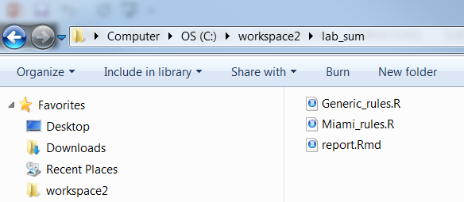

# Exploratory Data Analysis {#eda}


Before embarking on developing statistical models and generating predictions, it is essential to understand your data. This is typically done using conventional numerical and graphical methods. John Tukey ([@tukey1977) advocated the practice of exploratory data analysis (EDA) as a critical part of the scientific process.

> "No catalog of techniques can convey a willingness to look for what can be seen, whether or not anticipated. Yet this is at the heart of exploratory data analysis. The graph paper and transparencies are there, not as a technique, but rather as a recognition that the picture examining eye is the best finder we have of the wholly unanticipated."

Fortunately, we can dispense with the graph paper and transparencies and use software that makes routine work of developing the 'pictures' (i.e., graphical output) and descriptive statistics needed to explore our data.

## Objectives (Exploratory Data Analysis)

-   Review methods for estimating Low, RV, and High values
-   Review different methods for visualizing soil data
-   Review data transformations

## Statistics

Descriptive statistics include:

-   **Mean** - arithmetic average\
-   **Median** - middle value\
-   **Mode** - most frequent value\
-   **Standard Deviation** - variation around the mean\
-   **Interquartile Range** - range encompasses 50% of the values\
-   **Kurtosis** - peakedness of the data distribution\
-   **Skewness** - symmetry of the data distribution

Graphical methods include:

-   **Histogram** - a bar plot where each bar represents the frequency of observations for a given range of values
-   **Density estimation** - an estimation of the frequency distribution based on the sample data
-   **Quantile-quantile plot** - a plot of the actual data values against a normal distribution
-   **Box plots** - a visual representation of median, quartiles, symmetry, skewness, and outliers
-   **Scatter plots** - a graphical display of one variable plotted on the x axis and another on the y axis
-   **Radial plots** - plots formatted for the representation of circular data

## Data Inspection

Before you start an EDA, you should inspect your data and correct all typos and blatent errors. EDA can then be used to identify additional errors such as outliers and help you determine the appropriate statistical analyses. For this chapter we'll use the loafercreek dataset from the CA630 Soil Survey Area.

```{r, warning=FALSE, message=FALSE, eval=TRUE}
library(dplyr)

# Load from the the loakercreek dataset
data("loafercreek", package = "soilDB") 

# Extract the horizon table
h <- aqp::horizons(loafercreek)

# Construct generalized horizon designations
n <- c("A",
       "BAt",
       "Bt1",
       "Bt2",
       "Cr",
       "R")
# REGEX rules
p <- c("A",
       "BA|AB",
       "Bt|Bw",
       "Bt3|Bt4|2B|C",
       "Cr",
       "R")

# Compute genhz labels and add to loafercreek dataset
h$genhz <- aqp::generalize.hz(h$hzname, n, p)

# Examine genhz vs hznames (wide format)
table(h$genhz, h$hzname)

# Examine matching pairs (long format)
h %>% group_by(genhz, hzname) %>% count()

```

As noted in Chapter 1, a visual examination of the raw data is possible by clicking on the dataset in the environment tab, or via commandline:

```{r, eval=FALSE}
View(h) 
```

This view is fine for a small dataset, but can be cumbersome for larger ones. The `summary()` function can be used to quickly summarize a dataset however, even for our small example dataset, the output can be voluminous. Therefore in the interest of saving space we'll only look at a sample of columns.

```{r, message=FALSE, warning=FALSE, eval=TRUE}

h %>%
  select(genhz, clay, total_frags_pct, phfield, effclass) %>%
  summary()

```

The `summary()` function is known as a generic R function. It will return a preprogrammed summary for any R object. Because `h` is a data frame, we get a summary of each column. Factors will be summarized by their frequency (i.e., number of observations), while numeric or integer variables will print out a five number summary, and characters simply print their length. The number of missing observations for any variable will also be printed if they are present. If any of these metrics look unfamiliar to you, don't worry we'll cover them shortly.

When you do have missing data and the function you want to run will not run with missing values, the following options are available:

1.  **Exclude** all rows or columns that contain missing values using the function `na.exclude()`, such as `h2 <- na.exclude(h)`. However this can be wasteful because it removes all rows (e.g., horizons), regardless if the row only has 1 missing value. Instead it's sometimes best to create a temporary copy of the variable in question and then remove the missing variables, such as `clay <- na.exclude(h$clay)`.

2.  **Replace** missing values with another value, such as zero, a global constant, or the mean or median value for that column, such as `h$clay <- ifelse(is.na(h$clay), 0, h$clay) # or h[is.na(h$clay), ] <- 0`.

3.  **Read** the help file for the function you're attempting to use. Many functions have additional arguments for dealing with missing values, such as `na.rm`.

A quick check for typos would be to examine the list of levels for a factor or character, such as:

```{r, eval=TRUE}
# just for factors
levels(h$genhz)

# for characters and factors
sort(unique(h$hzname)) 
```

If the `unique()` function returned typos such as "BT" or "B t", you could either fix your original dataset or you could make an adjustment in R, such as:

```{r, eval=TRUE}

h$hzname <- ifelse(h$hzname == "BT", "Bt", h$hzname)

```

Typo errors such as these are a common problem with old pedon data in NASIS.

## Exercise 1: fetch and inspect

1.  Create a new R script
2.  Load the gopheridge dataset found within the soilDB package or use your own data (highly encouraged) and inspect the dataset
3.  Apply the generalized horizon rules below or develop your own, see the following [job-aid](http://ncss-tech.github.io/AQP/aqp/gen-hz-assignment.html)
4.  Summarize the `hzdept`, `genhz`, `texture_class`, `sand`, and `fine gravel`.
5.  Save your R script, and forward to your instructor.

```{r, eval=TRUE}
# gopheridge rules
n <- c('A', 'Bt1', 'Bt2', 'Bt3','Cr','R')
p <- c('^A|BA$', 'Bt1|Bw','Bt$|Bt2', 'Bt3|CBt$|BCt','Cr','R')
```

## Descriptive Statistics

```{r, echo = FALSE, eval=TRUE}
desc <- data.frame(
  Parameter = c("Mean", "Median", "Mode", "Standard Deviation", "Quantiles"),
  NASIS = c("RV ?", "RV", "RV", "L & H ?", "L & H"),
  Description = c("arithmetic average", 
                  "middle value, 50% quantile", 
                  "most frequent value", "variation around mean", 
                  "percent rank of values, such that all values are <= p"
                  ),
  'R function' = c("mean()", "median()", "sort(table(), decreasing = TRUE)[1]", "sd()", "quantile()"),
  check.names = FALSE
  )
knitr::kable(desc, caption = "Short Description of Descriptive Statistics and R Functions")
```

### Measures of Central Tendency

These measures are used to determine the mid-point of the range of observed values. In NASIS speak this should ideally be equivalent to the representative value (RV) for numeric and integer data. The mean and median are the most commonly used measures for our purposes.

**Mean** - is the arithmetic average all are familiar with, formally expressed as: $\bar{x} =\frac{\sum_{i=1}^{n}x_i}{n}$ which sums ( $\sum$ ) all the X values in the sample and divides by the number (n) of samples. It is assumed that all references in this document refer to samples rather than a population.

The mean clay content from the loafercreek dataset may be determined:

```{r, eval=TRUE}
mean(h$clay, na.rm = TRUE)
```

**Median** is the middle measurement of a sample set, and as such is a more robust estimate of central tendency than the mean. This is known as the middle or 50th quantile, meaning there are an equal number of samples with values less than and greater than the median. For example, assuming there are 21 samples, sorted in ascending order, the median would be the 11th sample.

The median from the sample dataset may be determined:

```{r, eval=TRUE}
median(h$clay, na.rm = TRUE)
```

**Mode** - is the most frequent measurement in the sample. The use of mode is typically reserved for factors, which we will discuss shortly. One issue with using the mode for numeric data is that the data need to be rounded to the level of desired precision. R does not include a function for calculating the mode, but we can calculate it using the following example.

```{r, eval=TRUE}
# sort and select the 1st value, which will be the mode
sort(table(round(h$clay)), decreasing = TRUE)[1] 
```

**Frequencies**

To summarize factors and characters we can examine their frequency or number of observations. This is accomplished using the `table()` or `summary()` functions.

```{r, eval=TRUE}
table(h$genhz)

# or

summary(h$genhz)
```

This gives us a count of the number of observations for each horizon. If we want to see the comparison between two different factors or characters, we can include two variables.

```{r eval=TRUE}
table(h$genhz, h$texcl)

# or

h %>% count(genhz, texcl)

```

We can also add margin totals to the table or convert the table frequencies to proportions.

```{r eval=TRUE}
# append the table with row and column sums
addmargins(table(h$genhz, h$texcl))

# calculate the proportions relative to the rows, margin = 1 calculates for rows, margin = 2 calculates for columns, margin = NULL calculates for total observations
table(h$genhz, h$texture_class) %>% 
  prop.table(margin = 1) %>% 
  round(2) * 100
```

To determine the mean by a group or category, use the `group_by` and `summarize` functions:

```{r, eval=TRUE}

h %>%
  group_by(genhz) %>%
  summarize(clay_avg = mean(clay, na.rm = TRUE),
            clay_med = median(clay, na.rm = TRUE)
            )

```

### Measures of Dispersion

These are measures used to determine the spread of values around the mid-point. This is useful to determine if the samples are spread widely across the range of observations or concentrated near the mid-point. In NASIS speak these values might equate to the low (L) and high (H) values for numeric and integer data.

**Variance** is a positive value indicating deviation from the mean:

$s^2 = \frac{\sum_{i=1}^{n}(x_i - \bar{x})^2} {n - 1}$

This is the square of the sum of the deviations from the mean, divided by the number of samples minus 1. It is commonly referred to as the sum of squares. As the deviation increases, the variance increases. Conversely, if there is no deviation, the variance will equal 0. As a squared value, variance is always positive. Variance is an important component for many statistical analyses including the most commonly referred to measure of dispersion, the *standard deviation*. Variance for the sample dataset is:

```{r, eval=TRUE}
var(h$clay, na.rm=TRUE)
```

**Standard Deviation** is the square root of the variance:

$s = \sqrt\frac{\sum_{i=1}^{n}(x_i - \bar{x})^2} {n - 1}$

The units of the standard deviation are the same as the units measured. From the formula you can see that the standard deviation is simply the square root of the variance. Standard deviation for the sample dataset is:

```{r, eval=TRUE}
sd(h$clay, na.rm = TRUE)

# or

sqrt(var(h$clay, na.rm = TRUE))
```

**Coefficient of Variation** (CV) is a relative (i.e., unitless) measure of standard deviation:

$CV = \frac{s}{\bar{x}} \times 100$

CV is calculated by dividing the standard deviation by the mean and multiplying by 100. Since standard deviation varies in magnitude with the value of the mean, the CV is useful for comparing relative variation amongst different datasets. However Webster (2001) discourages using CV to compare different variables. Webster (2001) also stresses that CV is reserved for variables that have an absolute 0, like clay content. CV may be calculated for the sample dataset as:

```{r, eval=TRUE}
# remove NA values and create a new variable
clay <- na.exclude(h$clay)

sd(clay) / mean(clay) * 100
```

**Quantiles (a.k.a. Percentiles)** - the percentile is the value that cuts off the first nth percent of the data values when sorted in ascending order.

The default for the `quantile()` function returns the min, 25th percentile, median or 50th percentile, 75th percentile, and max, known as the five number summary originally proposed by Tukey. Other probabilities however can be used. At present the 5th, 50th, and 95th are being proposed for determining the range in characteristics (RIC) for a given soil property.

```{r, eval=TRUE}
quantile(h$clay, na.rm = TRUE)

# or

quantile(clay, probs = c(0.05, 0.5, 0.95), na.rm = TRUE)
```

Thus, for the five number summary 25% of the observations fall between each of the intervals. [Quantiles are a useful metric because they are largely unaffected by the distribution of the data, and have a simple interpretation](https://ncss-tech.github.io/soil-range-in-characteristics/why-percentiles.html).

**Range** is the difference between the highest and lowest measurement of a group. Using the sample data it may be determined as:

```{r, eval=TRUE}
range(clay)
```

which returns the minimum and maximum values observed, or:

```{r, eval=TRUE}
diff(range(clay))

# or

max(clay) - min(clay)
```

**Interquartile Range** (IQR) is the range from the upper (75%) quartile to the lower (25%) quartile. This represents 50% of the observations occurring in the mid-range of a sample. IQR is a robust measure of dispersion, unaffected by the distribution of data. In soil survey lingo you could consider the IQR to estimate the central concept of a soil property. IQR may be calculated for the sample dataset as:

```{r, eval=TRUE}
IQR(clay)

# or

diff(quantile(clay, p = c(0.25, 0.75)))
```

### Correlation

A correlation matrix is a table of the calculated correlation coefficients of all variables. This provides a quantitative measure to guide the decision making process. The following will produce a correlation matrix for the sp4 dataset:

```{r, eval=TRUE}
h$hzdepm <- (h$hzdepb + h$hzdept) / 2 # Compute the middle horizon depth

h %>%
  select(hzdepm, clay, sand, total_frags_pct, phfield) %>%
  cor(use = "complete.obs") %>%
  round(2)
```

As seen in the output, variables are perfectly correlated with themselves and have a correlation coefficient of 1.0. Negative values indicate a negative relationship between variables. What is considered highly correlated? A good rule of thumb is anything with a value of **0.7** or greater is considered highly correlated.

## Exercise 2: Compute Descriptive Statistics

1.  Add to your existing R script from Exercise 1.
2.  Aggregate by `genhz` and calculate several descriptive statistics for `hzdept`, `gravel` and `phfield`.
3.  Cross-tabulate `geomposhill` and `argillic.horizon` from the site table, as a percentage.
4.  Compute a correlation matrix between `hzdept`, `gravel` and `phfield`.
5.  Save your R script, and forward to your instructor.

## Graphical Methods

Now that we've checked for missing values and typos and made corrections, we can graphically examine the sample data distribution of our data. Frequency distributions are useful because they can help us visualize the center (e.g., RV) and spread or dispersion (e.g., low and high) of our data. Typically in introductory statistics the normal (i.e., Gaussian) distribution is emphasized.

```{r graphical-descriptions, purl=FALSE, echo = FALSE, eval=TRUE}
figs <- data.frame(
  'Plot Types' = c("Bar", "Histogram", "Density", "Quantile-Quantile", "Box-Whisker", "Scatter & Line"),
   Description = c("a plot where each bar represents the frequency of observations for a 'group'",
                   "a plot where each bar represents the frequency of observations for a 'given range of values'",
                  "an estimation of the frequency distribution based on the sample data",
                  "a plot of the actual data values against a normal distribution",
                  "a visual representation of median, quartiles, symmetry, skewness, and outliers",
                   "a graphical display of one variable plotted on the x axis and another on the y axis"
                  ),
  check.names = FALSE
  )

knitr::kable(figs, caption = "Short Description of Graphical Methods")
```

```{r graphical-functions, purl=FALSE, echo = FALSE, eval=TRUE}
figs <- data.frame(
  'Plot Types' = c("Bar", "Histogram", "Density", "Quantile-Quantile", "Box-Whisker", "Scatter & Line"),
  # Description = c("a bar plot where each bar represents the frequency of observations for a given range of values",
  #                "an estimation of the frequency distribution based on the sample data",
  #                "a plot of the actual data values against a normal distribution",
  #                "a visual representation of median, quartiles, symmetry, skewness, and outliers",
  #                 "a graphical display of one variable plotted on the x axis and another on the y axis",
  #                "plots formatted for the representation of circular data"
  #                ),
  'Base R' = c("barplot()", "hist()", "plot(density())", "qqnorm()", "boxplot()", "plot()"),
  'lattice' = c("barchart()", "histogram()", "densityplot()", "qq()", "bwplot()", "xyplot"),
  'ggplot geoms' = c("geom_bar()", "geom_histogram()", "geom_density()", "geom_qq()", "geom_boxplot()", "geom_point()"),
  check.names = FALSE
  )

knitr::kable(figs, caption = "Comparison of R's 3 Graphing Systems and their Equivalent Functions for Plotting")
```

### Distributions

```{r distribution comparison, echo=FALSE, fig.dim = c(8, 4), eval=TRUE, warning=FALSE, message=FALSE}

data(metadata, package = "soilDB")

h <- mutate(h,
            hzdepm = (hzdepb + hzdept) / 2,
            # convert texture_class to factors and sort
            texture_class = factor(
              texture_class,
              levels = metadata[metadata$ColumnPhysicalName == "texcl", "ChoiceName"]
              )
            )


library(ggplot2)

idx <- !is.na(h$texture_class)

# bar plot
p_b <- ggplot(h[idx, ], aes(x = texture_class)) +
  geom_bar() +
  ylab("count (n)") + xlab("texture class") +
  theme(aspect.ratio = 1) +
  ggtitle("Bar Plot")

# histogram
p <- ggplot(data = h, aes(x = clay))

p_h <- p + 
  geom_histogram(bins = nclass.Sturges(h$clay)) + 
  xlab("clay (%)") + ylab("count (n)") +
  theme(aspect.ratio = 1) +
  ggtitle("Histogram")

# density plot
p_d <- p + 
  geom_density(fill = "grey", alpha = 0.5) + 
  xlab("clay (%)") + ylab("density (p)") +
  theme(aspect.ratio = 1) +
  ggtitle("Density Plot")

gridExtra::grid.arrange(p_b, p_h, p_d, ncol = 3)
```

### Bar Plot

A bar plot is a graphical display of the frequency (i.e. number of observations (count or n)), such as soil texture, that fall within a given class. It is a graphical alternative to to the `table()` function.

```{r barplot, eval=TRUE}
library(ggplot2)

# bar plot
ggplot(h, aes(x = texcl)) +
  geom_bar()
```

### Histogram

A histogram is similar to a bar plot, except that instead of summarizing categorical data, it categorizes a continuous variable like clay content into non-overlappying intervals for the sake of display. The number of intervals can be specified by the user, or can be automatically determined using an algorithm, such as `nclass.Sturges()`. Since histograms are dependent on the number of bins, for small datasets they're not the best method of determining the shape of a distribution.

```{r histogram, eval=TRUE}

ggplot(h, aes(x = clay)) +
  geom_histogram(bins = nclass.Sturges(h$clay))

```

### Density Curve

A density estimation, also known as a Kernel density plot, generally provides a better visualization of the shape of the distribution in comparison to the histogram. Compared to the histogram where the y-axis represents the number or percent (i.e., frequency) of observations, the y-axis for the density plot represents the probability of observing any given value, such that the area under the curve equals one. One curious feature of the density curve is the hint of a two peaks (i.e. bimodal distribution?). Given that our sample includes a mixture of surface and subsurface horizons, we may have two different populations. However considering how much the two distributions overlap, it seems impractical to separate them in this instance.

```{r densityplot, eval=TRUE}

ggplot(h, aes(x = clay)) +
  geom_density()

```

### Box plots

Box plots are a graphical representation of the five number summary, depicting quartiles (i.e. the 25%, 50%, and 75% quantiles), minimum, maximum and outliers (if present). Boxplots convey the shape of the data distribution, the presence of extreme values, and the ability to compare with other variables using the same scale, providing an excellent tool for screening data, determining thresholds for variables and developing working hypotheses.

The parts of the boxplot are shown in the figure below. The "box" of the boxplot is defined as the 1st quartile, (Q1 in the figure) and the 3rd quartile, (Q3 in the figure). The median, or 2nd quartile, is the dark line in the box. The whiskers (typically) show data that is 1.5 \* IQR above and below the 3rd and 1st quartile. Any data point that is beyond a whisker is considered an outlier.

That is not to say the outlier points are in error, just that they are extreme compared to the rest of the data set. However, you may want to evaluate these points to ensure that they are correct.

```{r bp, echo=FALSE, fig.width=1}

lab1 <- c("whisker", "lower quartile (25%)", "median (50%)", "upper quartile (50%)", "whisker")
fn <- boxplot.stats(h$clay)$stats
df <- data.frame(lab1, fn = fn)
# df <- rbind(data.frame(lab1 = "outliers", fn = 52), df)
df2 <- data.frame(fn = c(52, mean(fn[c(4, 5)]), fn[3]), var = c("outliers", "1.5 x IQR", "interquartile range (IQR)"))

ggplot(h, aes(y = clay)) +
  geom_boxplot()  + 
  geom_text(data = df, aes(x = -0.85, y = fn, label = lab1)) +
  geom_text(data = df2, aes(x = 1 - c(0.4, 0.3, -0.15), y = fn, label = var)) +
  # outliners
  annotate("segment", x = 0.35, xend = 0.35, y = max(h$clay, na.rm = TRUE), yend = df$fn[5], 
           arrow = grid::arrow(ends = "both", angle = 90, length = unit(0.1, "cm"))) +
  # whiskers
  annotate("segment", x = 0.45, xend = 0.45, y = df$fn[4], yend = df$fn[5], 
           arrow = grid::arrow(ends = "both", angle = 90, length = unit(0.1, "cm"))) +
  # IQR
  annotate("segment", x = 0.55, xend = 0.55, y = df$fn[2], yend = df$fn[4], 
           arrow = grid::arrow(ends = "both", angle = 90, length = unit(0.1, "cm"))) +
  scale_x_discrete(breaks = NULL) + 
  xlab("") + ylab("clay (%)") +
  ggtitle("Boxplot Components")

````


```{r boxplots, eval=TRUE}
ggplot(h, aes(x = genhz, y = clay)) +
  geom_boxplot()
```

The above box plot shows a steady increase in clay content with depth. Notice the outliers in the box plots, identified by the individual circles.

### Quantile comparison plots (QQplot)

A QQ plot is a plot of the actual data values against a normal distribution (which has a mean of 0 and standard deviation of 1).

```{r, eval=TRUE, warning=FALSE}

# QQ Plot for Clay
ggplot(h, aes(sample = clay)) + 
  geom_qq() +
  geom_qq_line()

# QQ Plot for Frags
ggplot(h, aes(sample = total_frags_pct)) + 
  geom_qq() +
  geom_qq_line()

```

If the data set is perfectly symmetric (i.e. normal), the data points will form a straight line. Overall this plot shows that our clay example is more or less symmetric. However the second plot shows that our rock fragments are far from evenly distributed.

A more detailed explanation of QQ plots may be found on Wikipedia:\
[https://en.wikipedia.org/wiki/QQ_plot](https://en.wikipedia.org/wiki/Q%E2%80%93Q_plot)

### The 'Normal' distribution

What is a normal distribution and why should you care? Many statistical methods are based on the properties of a normal distribution. Applying certain methods to data that are not normally distributed can give misleading or incorrect results. Most methods that assume normality are robust enough for all data except the very abnormal. This section is not meant to be a recipe for decision making, but more an extension of tools available to help you examine your data and proceed accordingly. The impact of normality is most commonly seen for parameters used by pedologists for documenting the ranges of a variable (i.e., Low, RV and High values). Often a rule-of thumb similar to: "two standard deviations" is used to define the low and high values of a variable. This is fine if the data are normally distributed. However, if the data are skewed, using the standard deviation as a parameter does not provide useful information of the data distribution. The quantitative measures of Kurtosis (peakedness) and Skewness (symmetry) can be used to assist in accessing normality and can be found in the [fBasics](https://cran.r-project.org/web/packages/psych/index.html) package, but [@webster2001) cautions against using significance tests for assessing normality. The preceding sections and chapters will demonstrate various methods to cope with alternative distributions.

A Gaussian distribution is often referred to as "Bell Curve", and has the following properties:

1.  Gaussian distributions are **symmetric** around their mean
2.  The mean, median, and mode of a Gaussian distribution are **equal**
3.  The area under the curve is equal to **1.0**
4.  Gaussian distributions are **denser** in the center and less dense in the tails
5.  Gaussian distributions are **defined** by two parameters, the mean and the standard deviation
6.  **68%** of the area under the curve is within one standard deviation of the mean
7.  Approximately **95%** of the area of a Gaussian distribution is within two standard deviations of the mean

```{r, purl=FALSE, echo=FALSE, fig.align="center", eval=TRUE}
library(ggplot2)

dnorm_limit_1 <- function(x) {
  y <- dnorm(x)
  y[-1 > x | x > 1] <- NA
  return(y)
}
dnorm_limit_2 <- function(x) {
  y <- dnorm(x)
  y[-2 > x | x > 2] <- NA
  return(y)
}

df <- data.frame(x = c(-3, 3))

ggplot(df, aes(x = x)) +
  stat_function(fun = dnorm) +
  stat_function(
    fun = dnorm_limit_1,
    geom = "area",
    fill = "blue",
    alpha = 0.2
  ) +
  stat_function(
    fun = dnorm_limit_2,
    geom = "area",
    fill = "orange",
    alpha = 0.2
  ) +
  annotate("text",
           x = 0,
           y = 0.2,
           label = "1 sd = 68%") +
  annotate("text",
           x = -1.5,
           y = 0.03,
           label = "2 sd = 95%")
```

Viewing a histogram or density plot of your data provides a quick visual reference for determining normality. Distributions are typically normal, Bimodal or Skewed:


Occasionally distributions are Uniform, or nearly so:

```{r, purl=FALSE, echo = FALSE, warning=FALSE, eval=TRUE}

r <- data.frame(y = dunif(seq(-1, 2, 0.1)), x = 1:31)

ggplot(r, aes(x = x, y = y)) +
  geom_line() +
  geom_polygon(fill = "grey", alpha = 0.5) +
  ggtitle("Uniform Distribution: Minimum = 0, Maximum = 1")

```

With the loafercreek dataset the mean and median for clay were only slightly different, so we can safely assume that we have a normal distribution. However many soil variables often have a non-normal distribution. For example, let's look at graphical examination of the mean vs. median for clay and rock fragments:

```{r clay vs frags, purl=FALSE, echo=FALSE, fig.dim = c(8, 4), eval=TRUE}

p   <- c(0.025, 0.25, 0.5, 0.75, 0.975)

avg <- mean(h$clay, na.rm = TRUE)
std <- sd(h$clay,   na.rm = TRUE)

clay <- rbind(
  data.frame(
    value = c(avg - 2 * std, avg, avg + 2 * std),
    variable = "mean & sd",
    stringsAsFactors = TRUE
    ),
  data.frame(
    value    = quantile(h$clay, p, na.rm = TRUE),
    variable = "median & pct",
    stringsAsFactors = TRUE
    )
  )

avg <- mean(h$total_frags_pct, na.rm = TRUE)
std <- sd(h$total_frags_pct,   na.rm = TRUE)

frags <- rbind(
  data.frame(
    variable = "mean & sd",
    value = c(avg - 2 * std, avg, avg + 2 * std),
    stringsAsFactors = TRUE
    ),
  data.frame(
    variable = "median & pct", 
    value    = quantile(h$total_frags_pct, p, na.rm = TRUE),
    stringsAsFactors = TRUE
    )
  )

p1 <- ggplot(h, aes(x = clay)) +
  geom_density(fill = "grey", alpha = 0.5) +
  geom_vline(data = clay, aes(xintercept = value, lty = variable)) +
  xlab("clay (%)") +
  #xlim(-5, max(h$total_frags_pct)) +
  theme(aspect.ratio = 1) +
  ggtitle("Clay")

p2 <- ggplot(h, aes(x = total_frags_pct)) +
  geom_density(fill = "grey", alpha = 0.5) +
  geom_vline(data = frags, aes(xintercept = value, lty = variable)) +
  xlab("rock fragments (%)") +
  #xlim(-5, max(h$total_frags_pct)) +
  theme(aspect.ratio = 1) +
  ggtitle("Rock Fragments")

gridExtra::grid.arrange(p1, p2, ncol = 2)

```

The solid lines represent the breakpoint for the mean and standard deviations. The dashed lines represents the median and quantiles. The median is a more robust measure of central tendency compared to the mean. In order for the mean to be a useful measure, the data distribution must be approximately normal. The further the data departs from normality, the less meaningful the mean becomes.

The median always represents the same thing independent of the data distribution, namely, 50% of the samples are below and 50% are above the median. The example for clay again indicates that distribution is approximately normal.

However for rock fragments, we commonly see a long tailed distribution (e.g., skewed). Using the mean in this instance would overestimate the rock fragments. Although in this instance the difference between the mean and median is only `r round(mean(h$total_frags_pct, na.rm = TRUE) - median(h$total_frags_pct, na.rm = TRUE))` percent.

### Scatterplots and Line Plots

```{r, echo=FALSE, purl=FALSE, fig.dim = c(8, 4), eval=TRUE, warning=FALSE, message=FALSE}
# scatter plot
p_s <- ggplot(h, aes(x = clay, y = hzdepm)) +
  geom_point() +
  ylim(100, 0) +
  ylab("depth (cm)") + xlab("clay (%)") +
  theme(aspect.ratio = 1) +
  ggtitle("Scatter Plot")

# line graph

# h2 <- slice(loafercreek, 0:100 ~ clay)@horizons

p_l <- ggplot(h) +
  # geom_line(aes(y = clay, x = hzdept, group = peiid)) +
  geom_step(aes(y = clay, x = hzdept, group = peiid), direction = "vh", alpha = 0.5) +
  geom_smooth(aes(y = clay, x = (hzdept + hzdepb) / 2), se = FALSE) +
  xlim(100, 0) +
  xlab("depth (cm)") + ylab("clay (%)") +
  coord_flip() +
  theme(aspect.ratio = 1) +
  ggtitle("Line Plot")

gridExtra::grid.arrange(p_s, p_l, ncol = 2)

```

Plotting points of one ratio or interval variable against another is a scatter plot. Plots can be produced for a single or multiple pairs of variables. Many independent variables are often under consideration in soil survey work. This is especially common when GIS is used, which offers the potential to correlate soil attributes with a large variety of raster datasets.

The purpose of a scatterplot is to see how one variable relates to another. With modeling in general the goal is parsimony (i.e., simple). The goal is to determine the fewest number of variables required to explain or describe a relationship. If two variables explain the same thing, i.e., they are highly correlated, only one variable is needed. The scatterplot provides a perfect visual reference for this.

Create a basic scatter plot using the loafercreek dataset.

```{r, eval=TRUE, warning=FALSE}
# scatter plot
ggplot(h, aes(x = clay, y = hzdepm)) +
  geom_point() +
  ylim(100, 0)

# line plot
ggplot(h, aes(y = clay, x = hzdepm, group = peiid)) +
  geom_line() +
  coord_flip() +
  xlim(100, 0)

```

This plots clay on the X axis and depth on the X axis. As shown in the scatterplot above, there is a moderate correlation between these variables.

The function below produces a scatterplot matrix for all the numeric variables in the dataset. This is a good command to use for determining rough linear correlations for continuous variables.

```{r, eval=TRUE, warning=FALSE, message=FALSE}

library(GGally)
  
h %>%
  select(hzdepm, clay, phfield, total_frags_pct) %>%
  ggpairs()

```

### 3rd Dimension - Color, Shape, Size, Layers, etc...

```{r, purl=FALSE, echo=FALSE, fig.dim = c(8, 4), eval=TRUE, message=FALSE, warning=FALSE}
h$clay2 <- ifelse(is.na(h$clay), 0, h$clay)

ggplot(h, aes(y = clay, x = hzdepm, col = genhz)) +
  geom_point(size = 2) +
  geom_smooth(se = FALSE, col = "black") +
  xlim(100, 0) + ylim(min(h$clay, na.rm = TRUE), max(h$clay, na.rm = TRUE)) +
  xlab("depth (cm)") + ylab("clay (%)") +
  coord_flip() +
  theme(aspect.ratio = 1)
```

#### Color and Groups

```{r color, fig.dim = c(8, 4), eval=TRUE}

# scatter plot
ggplot(h, aes(x = clay, y = hzdepm, color = genhz)) +
  geom_point(size = 3) +
  ylim(100, 0)

# density plot
ggplot(h, aes(x = clay, color = genhz)) +
  geom_density(size = 2)

# bar plot
ggplot(h, aes(x = genhz, fill = texture_class)) +
  geom_bar()

# box plot
ggplot(h, aes(x = genhz, y = clay)) + 
  geom_boxplot()

# heat map (pseudo bar plot)
s <- aqp::site(loafercreek)

ggplot(s, aes(x = landform_string, y = pmkind)) + 
  geom_tile(alpha = 0.2) 
  
```

#### Facets - box plots

```{r facets, fig.dim = c(8, 4), eval=TRUE}

library(tidyr)

# convert to long format
df <- h %>% 
  select(peiid, genhz, hzdepm, clay, phfield, total_frags_pct) %>% 
  pivot_longer(cols = c("clay", "phfield", "total_frags_pct"))

ggplot(df, aes(x = genhz, y = value)) +
  geom_boxplot() +
  xlab("genhz") +
  facet_wrap(~ name, scales = "free_y")

```

#### Facets - depth plots

```{r, fig.dim=c(8, 4), eval=TRUE}

data(loafercreek, package = "soilDB")

s <- aqp::slab(loafercreek, 
               fm = ~ clay + phfield + total_frags_pct,
               slab.structure = 0:100,
               slab.fun = function(x) quantile(x, c(0.1, 0.5, 0.9), na.rm = TRUE))

ggplot(s, aes(x = top, y = X50.)) +
  # plot median
  geom_line() +
  # plot 10th & 90th quantiles
  geom_ribbon(aes(ymin = X10., ymax = X90., x = top), alpha = 0.2) +
  # invert depths
  xlim(c(100, 0)) +
  # flip axis
  coord_flip() +
  facet_wrap(~ variable, scales = "free_x")

```

## Exercise 3: Graphical Methods

1.  Add to your existing R script from Exercise 2.
2.  Create a faceted boxplot of `genhz` vs `gravel` and `phfield`.
3.  Create a facted depth plot for `gravel` and `phfield`
4.  Save your R script, and forward to your instructor.

## Transformations

Slope aspect and pH are two common variables warranting special consideration for pedologists.

### pH

There is a recurring debate as to the best way to average **pH* since is it a log transformed variable. Remember, pHs of 6 and 5 correspond to hydrogen ion concentrations of 0.000001 and 0.00001 respectively. The actual average is 5.26; -log10((0.000001 + 0.00001) / 2). If no conversions are made for pH, the mean and sd in the summary are considered the geometric mean and sd, not the arithmetic. The wider the pH range, the greater the difference between the geometric and arithmetic mean. The difference between the arithmatic average of 5.26 and the geometric average of 5.5 is small. @boyd2011 examined the issue in detail, and suggests regardless of whatever method is used it should be documented.

If you have a table with pH values and wish to calculate the arithmetic mean using R, this example will work:

```{r, eval=TRUE}
# arithmetic mean
log10(mean(1/10^-h$phfield, na.rm = TRUE)) 

# geometric mean
mean(h$phfield, na.rm = TRUE) 
```

### Circular data

**Slope aspect** - requires the use of circular statistics for summarizing numerically, or graphical interpretation using circular plots. For example, if soil map units being summarized have a uniform distribution of slope aspects ranging from 335 degrees to 25 degrees, the Zonal Statistics tool in ArcGIS would return a mean of 180.

The most intuitive means available for evaluating and describing slope aspect are circular plots available with the circular package in R and the radial plot option in the [TEUI](http://www.fs.fed.us/eng/rsac/programs/teui/downloads.html) Toolkit. The circular package in R will also calculate circular statistics like mean, median, quartiles etc.

```{r, warning=FALSE, message=FALSE, eval=TRUE}
library(circular)

# Extract the site table
s <- aqp::site(loafercreek) 

aspect <- s$aspect_field
aspect <- circular(aspect, template="geographic", units="degrees", modulo="2pi")

summary(aspect)
```

The numeric output is fine, but a following graphic is more revealing, which shows the dominant Southwest slope aspect.

```{r, eval=TRUE}
rose.diag(aspect, bins = 8, col="grey")
```

### Texture

NASIS has an abundance of field data captured within it, dating back in some cases as far as 1975. This legacy data, as it's often called, captures raw and unfiltered information about our soil series and map unit component concepts. In the future it will undoubtable inform future digital soil mapping products by serving as training data. However, as most soil scientists are aware, legacy data is not a panacea. In many cases, the data is not as detailed as we would like (nor is some newer data). For example, many pedon descriptions include soil texture class and modifiers, but lack continuous estimates such as clay content and rock fragments %. This lack of continuous data makes it difficult to analyze and estimate other properties, such as available water capacity. However, while much continuous soil data is missing, it can still be estimated by the class ranges and averages. NASIS has several such calculations to estimate missing values. To facilitate this process in R, several new functions have recently been added to the aqp package. This package hosts a variety of R functions specifically designed to analyze and plot soil data. It is also taught in conjunction with the NEDC course Statistics for Soil Survey.These new aqp functions are intended to impute missing values or check existing values. The ssc_to_texcl() function uses the same logic as the particle size estimator calculation in NASIS to classify sand and clay into texture class. The results are stored in data(soiltexture) and used by texcl_to_ssc() as a lookup table to convert texture class to sand, silt and clay. The function texcl_to_ssc() replicates the functionality described by Levi (2017). Unlike the other functions, texture_to_taxpartsize() is intended to be computed on weighted averages within the family particle size control section. Below is a demonstration of these new aqp R functions.

```{r, warning=FALSE, message=FALSE}

library(aqp)
library(soiltexture)

# example of texcl_to_ssc(texcl)
texcl <- c("s",  "ls",  "l",  "cl",  "c")   
test <- texcl_to_ssc(texcl) 
head(cbind(texcl, test))

# example of ssc_to_texcl()
ssc <- data.frame(CLAY = c(55, 33, 18, 6, 3),
                  SAND = c(20, 33, 42, 82, 93),
                  SILT = c(25, 34, 40, 12,  4)
                  )  
texcl <- ssc_to_texcl(sand = ssc$SAND, 
                      clay = ssc$CLAY
                      )
ssc_texcl <- cbind(ssc, texcl)
head(ssc_texcl)

# plot on a textural triangle
TT.plot(class.sys = "USDA-NCSS.TT", 
        tri.data = ssc_texcl,
        pch = 16, col = "blue"
        )


# example of texmod_to_fragvoltol()
frags <- c("gr",  "grv",  "grx",  "pgr",  "pgrv",  "pgrx") 
test <- texmod_to_fragvoltot(frags)[1:4]
head(test)

# example of texture_to_taxpartsize()
tex <- data.frame(texcl = c("c",  "cl",  "l",  "ls",  "s"),
                  clay  = c(55, 33, 18, 6, 3),
                  sand  = c(20, 33, 42, 82, 93),
                  fragvoltot = c(35, 15, 34, 60, 91)
                  )
tex$fpsc <- texture_to_taxpartsize(
  texcl = tex$texcl, 
  clay = tex$clay,
  sand = tex$sand, 
  fragvoltot = tex$fragvoltot
  ) 
head(tex)

```

## The Shiny Package

Shiny is an R package which combines R programming with the interactivity of the web.

```{r, eval=FALSE, echo=TRUE, include=TRUE}
install.packages("shiny")
```

Methods for Use

-   Online
-   Locally

::: {.notes}
The shiny package, created by RStudio, enables users to not only use interactive applications created by others, but to build them as well.
:::

### Online

Easiest Method

-   Click a Link: <https://gallery.shinyapps.io/lake_erie_fisheries_stock_assessment_app/>
-   Open a web browser
-   Navigate to a URL

::: {.notes}
The ability to use a shiny app online is one of the most useful features of the package. All of the R code is executed on a remote computer which sends the results over a live http connection. Very little is required of the user in order to obtain results.
:::

### Locally

No Internet required once configured

-   Install R and RStudio (done)
-   Install Required packages (app dependent)
-   Download, open in RStudio and click "Run App"

The online method may be easy for the user, but it does require a significant amount of additional effort for the creator. We won't get into those details here! The local method, however simply requires the creator to share a single app.R file. It is the user which needs to put forth the additional effort.

### Web App Demonstration

Online:

-   <https://usda.shinyapps.io/r11_app>

Local:

-   <https://github.com/ncss-tech/vitrusa/raw/master/r11_smp_app/app.R>

Online apps such as the Region 11 Web App are useful tools, available for all to use during soil survey, ecological site development, or other evaluations. The Region 11 app is however limited to data which is already available online, such as SDA (Soil Data Access) and NASIS (National Soil Information System) Web Reports.

It is also relient on the successful operation of those data systems. If the NASIS Web Reports or SDA is down for maintanence, the app fails. Local apps have the ability to leverage local data systems more easily like NASIS or other proprietary data.

### Troubleshooting Errors

1.  Reload the app and try again. (refresh browser, or click stop, and run app again in RStudio) When the app throws an error, it stops. All other tabs/reports will no longer function until the app is reloaded.

2.  Read the getting started section on the home page. This is a quick summary of tips to avoid issues, and will be updated as needed.

3.  Check to see if SDA and NASIS Web Reports are operational, if they aren't working, then the app won't work either.

4.  Double check your query inputs. (typos, wildcards, null data, and too much data, can be common issues)

5.  5 minutes of inactivity will cause the connection to drop, be sure you are actively using the app.

6.  Run the app locally - the online app does not show console activity, which can be a big help when identifying problems.

7.  Check the app issues page to see if the issue you are experiencing is already documented. (Polite but not required)

8.  Contact the app author ([john.hammerly\@usda.gov](mailto:john.hammerly@usda.gov){.email})

When you run into trouble, there are a few steps you can take on your own to get things working again. This list may help you get your issue resolved. If not, contact me and I can assist.

### Shiny App Embedding

```{r, echo=FALSE}
knitr::include_app('https://gallery.shinyapps.io/064-telephones-by-region')
```

Shiny apps are extremely versatile, they can be embedded into presentations, Markdown, or HTML Those same formats can also be embedded in to a shiny app. This is a very simple example of a shiny app which consists of an interactive dropdown menu which controls what region is displayed in the bar chart. Let's take a look at the code.

#### Shiny App Code

```{r, eval=FALSE, echo=TRUE, include=TRUE}
shinyApp(
  
  ui = 
# Rely on the 'WorldPhones' dataset in the datasets
# package (which generally comes preloaded).
library(datasets)

# Use a fluid Bootstrap layout
fluidPage(    
  
  # Give the page a title
  titlePanel("Telephones by region"),
  
  # Generate a row with a sidebar
  sidebarLayout(      
    
    # Define the sidebar with one input
    sidebarPanel(
      selectInput("region", "Region:", 
                  choices=colnames(WorldPhones)),
      hr(),
      helpText("Data from AT&T (1961) The World's Telephones.")
    ),
    
    # Create a spot for the barplot
    mainPanel(
      plotOutput("phonePlot")  
    )
    
  )
)
  server = 
# Rely on the 'WorldPhones' dataset in the datasets
# package (which generally comes preloaded).
library(datasets)

# Define a server for the Shiny app
function(input, output) {
  
  # Fill in the spot we created for a plot
  output$phonePlot <- renderPlot({
    
    # Render a barplot
    barplot(WorldPhones[,input$region]*1000, 
            main=input$region,
            ylab="Number of Telephones",
            xlab="Year")
  })
}
)
```

Shiny apps consist of a *ui* and a *server*. The ui is the part of the shiny app the user sees, the user interface. In the ui, a user can choose or enter inputs for processing and viewing the results. The server takes the inputs, performs some data processing and rendering of those inputs and generates the outputs for the ui to display.

### Questions

1.  What new features in RStudio are available for you to use once the `shiny` package is installed?

2.  The Region 11 Web App uses which two data sources for reports?

3.  If an error occurs while using the Region 11 Web App, what should you do?

4.  Poll: A shiny app consists of:

### Examples

#### NASIS Reports


The NASIS Reports button is a link to a master list of NASIS Web reports for Regions 10 and 11.

#### Water Table


The query method option allows you to choose between MUKEY, NATSYM, MUNAME. It also has a radio button for switching between flooding and ponding.

Plots and Data Tables are on separate sub-menu items.

#### Organic Matter


Same options as the Water Table Tab except no radio button. The query method option allows you to choose between MUKEY, NATSYM, MUNAME.

Plots and Data Tables are on separate sub-menu items.

#### Project Report

The project report can accept multiple projects. Use the semicolon (;) as a separator. You can also save a copy of the report by clicking the link below the submit button.


#### Project Extent


Type in Year, type or select office and type project name for the Project extent query. Zoom and pan to view extent. Use the layers button to change the basemap or toggle layers. Click the link below the submit button to download a .zip containing the extent as a ESRI shapefile.

#### Long Range Plan


Enter an office symbol to generate a long range plan report.

#### Interpretations


Enter the national mapunit symbol to plot all available interpretations for the mapunit from SDA.

### Work on your Own

#### Project Report

Use the project report to generate a report on a project in your own area. Save the results and explain the results of pH plots for one of your components.

#### Project Extent

Map an extent of a project. How many layers are available to choose from as a basemap? How many layers can be toggled on or off?

#### Long Range Plan

Choose an office to generate a long range plan. What is the highest acreage project for 2025? \#\# Soil Reports

One of the strengths of NASIS is that it that has many queries and reports to access the complex data. This makes it easy for the average user to load their data, process it and run numerous reports.

## soilReports

The `soilReports` R package is essentially just a collection of R Markdown (*.Rmd*) documents.

R Markdown is a plain text markup format for creating reproducible, dynamic reports with R. These *.Rmd* files can be used to generate HTML, PDF, Word, Markdown documents with a variety of forms, templates and applications.

-   Example report output can be found at the following link: <https://github.com/ncss-tech/soilReports#example-output>.

-   Detailed instructions are provided for each report: <https://github.com/ncss-tech/soilReports#choose-an-available-report>

**Install** the `soilReports` package. This package is updated regularly and should be installed from GitHub.

```{r, eval=FALSE}
# Install the soilReports package from GitHub
remotes::install_github("ncss-tech/soilReports", dependencies = FALSE, build = FALSE)
```

To view the list of available reports first load the package then use the `listReports()` function.

```{r, eval=TRUE}
# Load the soilReports package
library(soilReports)

# List reports
listReports()
```

### Extending `soilReports`

Each report in `soilReports` has a "manifest" that describes any dependencies, configuration files or inputs for your R Markdown report document. If you can identify these things it is easy to convert your own R-based analyses to the `soilReports` format.

The *.Rmd* file allows R code and text with Markdown markup to be mingled in the same document and then "executed" like an R script.

### Exercise: Run Shiny Pedon Summary

The `region2/shiny-pedon-summary` report is an interactive Shiny-based report that uses `flexdashboard` to help the user subset and summarize NASIS pedons from a graphical interface.

-   You can try a ShinyApps.io demo [here](https://brownag.shinyapps.io/ShinyPedonSummary/)

The "Shiny Pedon Summary" allows one to rapidly generate reports from a large set of pedons in their NASIS selected set.

The left INPUT sidebar has numerous options for subsetting pedon data. Specifically, you can change REGEX patterns for *mapunit symbol*, *taxon name*, *local phase*, and *User Pedon ID*. Also, you can use the drop down boxes to filter on *taxon kind* or compare different "modal"/RV pedons.


1.  **Create an instance** of the `region2/shiny-pedon-summary` report with `soilReports`:

```{r eval=FALSE}
# create new instance of reports 
library(soilReports)

# set path for shiny-pedon-summary report instance
shinyped.path <- "C:/workspace2/chapter3/shiny-pedon"

# create directories (if needed)
if(!dir.exists(shinyped.path))
  dir.create(shinyped.path, recursive = TRUE)

# get report dependencies
reportSetup('region2/shiny-pedon-summary')

# copy report contents to target path
copyReport('region2/shiny-pedon-summary', outputDir = shinyped.path, overwrite = TRUE)
```

2.  Update the `config.R` file

You can update the `config.R` file in "C:/workspace2/chapter3/shiny-pedon" (or wherever you installed the report) to use the `soilDB` datasets `loafercreek` and `gopheridge` by setting `demo_mode <- TRUE`. This is the *simplest* way to demonstrate how this report works. Alternately, when `demo_mode <- FALSE`, pedons will be loaded from your NASIS selected set.

`config.R` also allows you to specify a shapefile for overlaying the points on -- to determine mapunit symbol -- as well as several raster data sources whose values will be extracted at point locations and summarized. The demo dataset does not use either of these by default, due to large file sizes.

Furthermore, a default (very general) set of REGEX generalized horizon patterns is provided to assign generalized horizon labels for provisional grouping. These provided patterns are unlikely to cover ALL cases, and *always* need to be modified for final correlation. That said, they do a decent job of making a first-pass correlation for diverse types of soils.

The default `config.R` settings use the general patterns: `use_regex_ghz <- TRUE`. You are welcome to modify the defaults. If you want to use the values you have populated in NASIS *Pedon Horizon Component Layer ID*, set `use_regex_ghz <- FALSE`.

3.  Run the report via `shiny.Rmd`

This report uses the Shiny `flexdashboard` interface. Open up `shiny.Rmd` and click the "Run Document" button to start the report. This will load the pedon and spatial data specified in `config.R`.

**NOTE:** *If a Viewer Window does not pop-up right away, click the gear icon to the right of the "Run Document" button. Be sure the option "Preview in Window" is checked, then click "Run Document" again.*

4.  All of the subset parameters are in the left-hand sidebar. Play around with all of these options -- the graphs and plots in the tabs to the right will automatically update as you make changes.

5.  When you like what you have, you can export a non-interactive HTML file for your records. To do this, first, set the "Report name:" box to something informative -- this will be your report output file name. Then, scroll down to the bottom of the INPUT sidebar and click "Export Report" button. Check the "output" folder (subdirectory of where you installed the report) for your results.

### Exercise: Run Mapunit Comparison

Another popular report in `soilReports` is the `region2/mu-comparison` report.

This report uses constant density sampling (`sharpshootR::constantDensitySampling()`) to extract numeric and categorical values from multiple raster data sources that overlap a set of user-supplied polygons.

In this example, we clip a small portion of SSURGO polygons from the CA630 soil survey area extent. We then select a small set of mapunit symbols (5012, 3046, 7083, 7085, 7088) that occur within the clipping extent. These mapunits have soil forming factors we expect to contrast with one another in several ways. You can inspect other mapunit symbols by changing `mu.set` in `config.R`.

1.  **Download** the demo data:

```{r eval=TRUE}
# set up ch4 path and path for report
mucomp.path <- "C:/workspace2/chapter3/mucomp"

# create any directories that may be missing
if(!dir.exists(mucomp.path)) {
  dir.create(mucomp.path, recursive = TRUE)
}

mucomp.zip <- file.path(mucomp.path, 'mucomp-data.zip')

# download raster data, SSURGO clip from CA630, and sample script for clipping your own raster data 
download.file('https://github.com/ncss-tech/stats_for_soil_survey/raw/master/data/chapter_3-mucomp-data/mucomp-data.zip', mucomp.zip)

unzip(mucomp.zip, exdir = mucomp.path, overwrite = TRUE)
```

2.  **Create an instance** of the `region2/mu-comparison` report with `soilReports`:

```{r eval=FALSE}
# create new instance of reports 
library(soilReports)

# get report dependencies
reportSetup('region2/mu-comparison')

# create report instance
copyReport('region2/mu-comparison', outputDir = mucomp.path, overwrite = TRUE)
```

If you want, you can now set up the default `config.R` that is created by `copyReport()` to work with your own data. OR you can use the "sample" `config.R` file (called `new_config.R`) in the ZIP file downloaded above.

3.  Run the code below to **replace the default** `config.R` with the sample `config.R`:

```{r eval=FALSE}
# copy config file containing relative paths to rasters downloaded above
file.copy(file.path(mucomp.path, "new_config.R"), file.path(mucomp.path, "config.R"), overwrite = TRUE)
```

4.  **Open** `report.Rmd` in the `C:/workspace2/chapter3/mucomp` folder and click the "Knit" button at the top of the RStudio source pane to run the report.

5.  Inspect the report output HTML file, as well as the spatial and tabular data output in the `output` folder.

*Question: What are the major differences that you can see, based on the report, between the five different mapunit symbols that were analysed?*

### Exercise: Run Lab Summary By Taxon Name Soil Report

For another exercise you can use the `region11/lab_summary_by_taxonname` report report to summarize laboratory data for a soil series. This report requires you to get some data from the Pedon "NCSS Lab" tables in NASIS.

#### Requirements

-   Data are properly populated, otherwise the report may fail. Common examples include:

    -   Horizon depths don't lineup
    -   Either the Pedon or Site tables isn't loaded

-   ODBC connection to NASIS is set up

-   Beware each report has a unique configuration file that may need to be edited.

#### Instructions

1.  **Load** your NASIS selected set. **Run** a query such as "POINT - Pedon/Site/NCSSlabdata by upedonid and Taxon Name" from the Region 11 report folder to load your selected set. Be sure to target both the site, pedon and lab layer tables. **Remove** from your selected set the pedons and sites you wish to exclude from the report.

2.  **Copy** the lab summary to your working directory.

```{r, eval=FALSE}
copyReport(reportName = "region11/lab_summary_by_taxonname", outputDir = "C:/workspace2/lab_sum")
```

3.  **Examine** the report folder contents.

The report is titled `report.Rmd`. Notice there are several other support files. The parameters for the report are contained in the `config.R` file.



4.  **Check** or **create** a genhz_rules file for a soil series. In order to aggregate the pedons by horizon designation, a genhz_rules file (e.g., Miami_rules.R) is needed. See above.

If none exists see the following job aid on how to create one, [Assigning Generalized Horizon Labels](http://ncss-tech.github.io/AQP/aqp/gen-hz-assignment.html).


Pay special attention to how caret `^` and dollar `$` symbols are used in REGEX. They function as *anchors* for the beginning and end of the string, respectively.

-   A `^` placed before an A horizon, `^A`, will match any horizon designation that starts with A, such as Ap, Ap1, but *not* something merely containing A, such as BA.

-   Placing a `$` after a Bt horizon, `Bt$`, will match any horizon designation that ends with Bt, such as 2Bt or 3Bt, but *not* something with a vertical subdivision, such as Bt2.

-   Wrapping pattern with both `^` and `$` symbols will result only in exact matches -- i.e. that start and end with the contents between `^` and `$`. For example `^[AC]$`, will only match A or C, *not* Ap, Ap2, or Cg.

5.  **Execute** the report.

**Command-line approach**

```{r, eval=FALSE}
# Set report parameters
series <- "Miami"
genhz_rules <- "C:/workspace2/lab_sum/Miami_rules.R"

# report file path
report_path <- "C:/workspace2/lab_sum/report.Rmd"

# Run the report
render(input = report_path, 
       output_dir = "C:/workspace2", 
       output_file = "C:/workspace2/lab_sum.html", 
       envir = new.env(), 
       params = list(series = series,
                     genhz_rules = genhz_rules
                     )
       )
```

**Manual approach**

**Open** the report.Rmd, **hit** the Knit drop down arrow, and select **Knit with Parameters**.


6.  **Save** the report. The report is automatically saved upon creation in the same folder as the R report. However, it is given the same generic name as the R report (i.e., "C:/workspace/lab_sum/report.html"), and will be overwritten the next time the report is run. Therefore, if you wish to save the report, rename the .html file to a name of your choosing and/or convert it to a PDF.

Also, beware when opening the .html file with Internet Explorer -- be sure to click on "Allow blocked content" if prompted. Otherwise, Internet Explorer will alter the formatting of tables etc. within the document.

**Sample pedon report**


*Brief summary of steps:*

-   Load your selected set with the pedon and site table for an existing GHL file, or make your own (highly encouraged)
-   Run the `lab_summary_by_taxonname.Rmd` report on a soil series of your choice.
-   Show your work and submit the results to your mentor.


## Additional Reading (Exploratory Data Analysis)

Healy, K., 2018. Data Visualization: a practical introduction. Princeton University Press. <http://socviz.co/>

Helsel, D.R., and R.M. Hirsch, 2002. Statistical Methods in Water Resources Techniques of Water Resources Investigations, Book 4, chapter A3. U.S. Geological Survey. 522 pages. <http://pubs.usgs.gov/twri/twri4a3/>

Kabacoff, R.I., 2018. Data Visualization in R. <https://rkabacoff.github.io/datavis/>

Peng, R. D., 2016. Exploratory Data Analysis with R. Leanpub. <https://bookdown.org/rdpeng/exdata/>

Wilke, C.O., 2019. Fundamentals of Data Visualization. O'Reily Media, Inc. <https://clauswilke.com/dataviz/>
