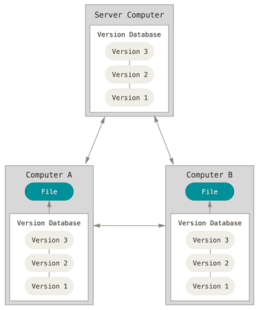

```{r setup, include=FALSE}
knitr::opts_chunk$set(echo = FALSE)
```

## GitHub

[GitHub](https://github.com/) is a web based code hosting platform for version control and collaboration.

 - code hosting (share R scripts with others)
 - version control (record changes to code over time)
 - collaboration (work with others on the same code, at the same time)
 
 [Learning Resources](https://help.github.com/articles/git-and-github-learning-resources/)  
 
 [GitHub Guides](https://guides.github.com/)

<div class="notes">
GitHub launched 10 years ago as a web based code hosting platform based on Git.  GitHub is a code hosting platform for version control and collaboration. It lets you and others work together on projects from anywhere.  It is based on Git - Git is a free and open source distributed version control system designed to handle everything from small to very large projects with speed and efficiency.  Git started in 2005 in response to a revocation of a proprietary Distributed Version Control Systems (DVCS) called BitKeeper which was previously used for the Linux kernel project (an open source software project).  Git was created as a replacement to BitKeeper by the Linux development community.  
</div>

## Code Hosting

  1. Repository (usually a single project)  
        i) folders  
        ii) files  
        iii) images  
        iv) videos  
        v) spreadsheets  
        vi) data sets  

## Version Control

GitHub uses a version control system called [Git](https://git-scm.com/)

- free and open source
- easy to learn
- small and fast

<div class="notes">
Version control is a system that records changes to a file or set of files over time so that you can recall specific versions later.
</div>

## Version Control



<div class="notes">
In a DVCS (such as Git, Mercurial, Bazaar or Darcs), clients don't just check out the latest snapshot of the files; rather, they fully mirror the repository, including its full history. Thus, if any server dies, and these systems were collaborating via that server, any of the client repositories can be copied back up to the server to restore it. Every clone is really a full backup of all the data.
</div>

## Collaboration

Organizations ([ncss-tech](https://github.com/ncss-tech))

- A collection of repositories (aqp, soilDB, stats_for_soil_survey)
- Teams and Members (stats-team)
- [GitHub Pages](https://guides.github.com/features/pages/) ([Statistics for Soil Survey](http://ncss-tech.github.io/stats_for_soil_survey/chapters/))

<div class="notes">
ncss-tech is the organization we use to collaborate.  It contains many repositories actively being developed.  It also has sets of members called teams, and has a special type of repository for hosting web pages.
</div>

## References

